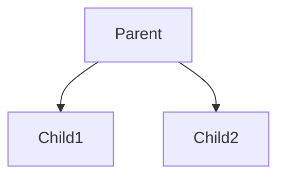
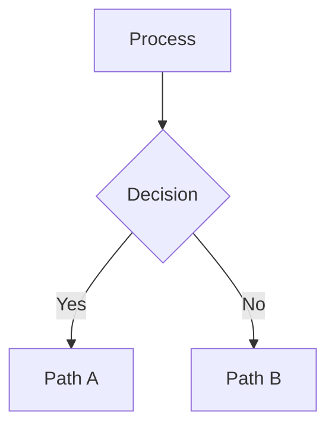
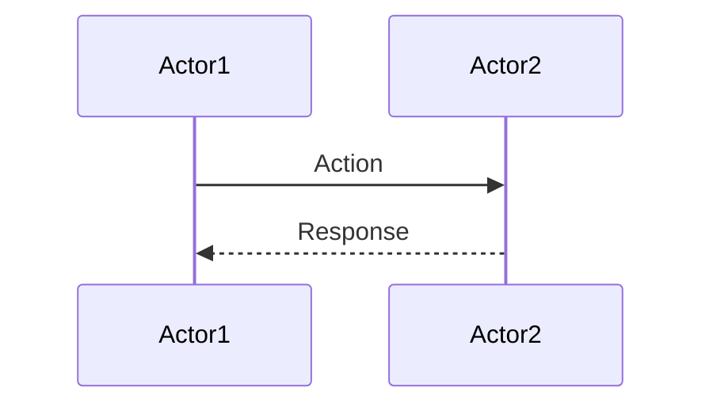
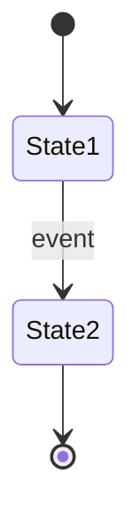
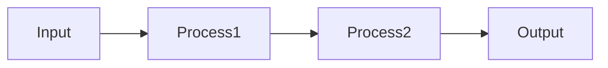
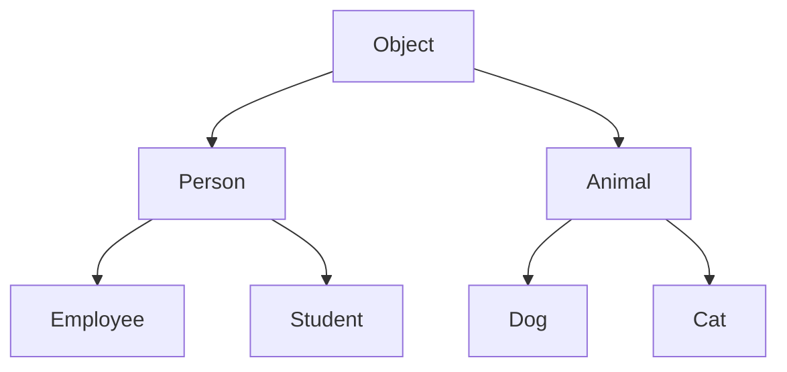
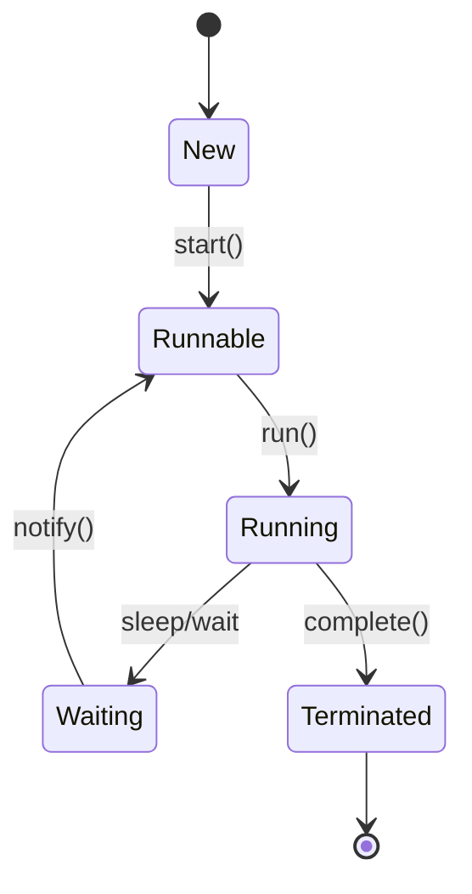

# ASCII to Mermaid Diagram Conversion Guide

**Status**: 153 files have ASCII diagrams that should be replaced with Mermaid.

## Quick Reference: Common Conversions

### 1. Hierarchy/Tree Diagrams

**ASCII Example:**
```text
┌────────────────────┐
│   Parent          │
└────────┬───────────┘
         │
    ┌────┴────┐
    ▼         ▼
┌────────┐ ┌────────┐
│ Child1 │ │ Child2 │
└────────┘ └────────┘
```

**Convert To:**


---

### 2. Sequential Flow Diagrams

**ASCII Example:**
```text
Step 1
  │
  ▼
Step 2
  │
  ▼
Step 3
```

**Convert To:**


---

### 3. Process with Decision

**ASCII Example:**
```text
┌──────────┐
│ Process  │
└────┬─────┘
     │
  ┌──┴──┐
  ▼     ▼
Yes    No
```

**Convert To:**


---

### 4. Sequence/Timeline

**ASCII Example:**
```text
Actor1 ---> Action ---> Actor2
Actor2 ---> Response ---> Actor1
```

**Convert To:**


---

### 5. State Machine

**ASCII Example:**
```text
┌──────┐
│Start │
└──┬───┘
   │
   ▼
┌──────┐    event
│State1├─────────┐
└──────┘         ▼
              ┌──────┐
              │State2│
              └──────┘
```

**Convert To:**


---

### 6. Data Flow / Pipeline

**ASCII Example:**
```text
Input → Process1 → Process2 → Output
```

**Convert To:**


---

## File-by-File Priority (Top 20)

### Tier 1: Critical (Large numbers of diagrams)

1. **03-backend/java/06-java-memory-gc.md** (21 diagrams)
   - Content: Memory layout, GC algorithms
   - Diagrams needed: Memory maps (ASCII), GC timelines (flow)
   - Priority: HIGH (core concept)

2. **03-backend/java/01-oop-concepts.md** (9 diagrams)
   - Content: Class hierarchies, polymorphism
   - Diagrams needed: Class trees (hierarchy), method dispatch (sequence)
   - Priority: HIGH (foundational)

3. **03-backend/java/09-io-nio.md** (10 diagrams)
   - Content: I/O models, selector patterns
   - Diagrams needed: I/O flow, selector loops, buffer states
   - Priority: HIGH

4. **03-backend/java/07-streams-lambda.md** (7 diagrams)
   - Content: Functional programming, stream pipeline
   - Diagrams needed: Stream pipeline (flow), lambda dispatch (sequence)
   - Priority: MEDIUM

5. **03-backend/python/01-python-basics.md** (11 diagrams)
   - Content: Python memory model, object model
   - Diagrams needed: Python object layout, memory management
   - Priority: MEDIUM

### Tier 2: Important (3-8 diagrams)

6. **03-backend/java/15-concurrency-deep-dive.md** (6 diagrams)
7. **03-backend/java/18-testing-advanced.md** (6 diagrams)
8. **03-backend/java/04-multithreading.md** (covers thread states)
9. **08-databases/01-postgresql-internals.md** (query executor)
10. **11-kubernetes/02-kubectl-operations.md** (pod lifecycle)
11. **09-distributed-systems/01-consensus-replication.md** (Raft/Paxos states)
12. **01-ai-ml/deep-learning/02-transformers.md** (attention flow)
13. **03-backend/go/02-go-scheduler-memory-gc.md** (runtime, GC)
14. **06-devops/ci-cd/01-cicd-concepts.md** (pipeline stages)
15. **12-operating-systems/02-cpu-scheduling.md** (scheduling algorithms)

---

## Conversion Patterns by Domain

### Java Files
- Class hierarchies → `mindmap` or `graph TD`
- Memory layouts → ASCII art (keep detailed) OR `graph TB` with memory regions
- Thread states → `stateDiagram-v2`
- GC timelines → `sequenceDiagram`

### Python Files
- Object model → `graph TD` (class hierarchy)
- Memory layout → `graph TB` (object structure)
- Import chains → `graph LR`

### Kubernetes Files
- Pod lifecycle → `stateDiagram-v2`
- Resource relationships → `graph TD`
- Networking flow → `sequenceDiagram`

### Database Files
- Query execution → `sequenceDiagram`
- Index structures → `graph TB`
- Replication → `sequenceDiagram`

### Distributed Systems Files
- Consensus protocols → `stateDiagram-v2` (state transitions)
- Replication flow → `sequenceDiagram`
- Failure scenarios → `graph TD`

---

## Tools & Scripts

### Check if file has ASCII diagrams
```bash
grep -n "^\`\`\`text" your-file.md | grep -E "[│├└─┌┐┘]"
```

### Find all files with ASCII
```bash
find data -name "*.md" -exec grep -l "[│├└─┌┐┘]" {} \;
```

### Count ASCII diagrams per file
```bash
grep -c "^\`\`\`text" data/**/*.md | grep -v ":0"
```

---

## Conversion Checklist

For each file with ASCII diagrams:

- [ ] Identify diagram type (hierarchy, flow, sequence, state, etc.)
- [ ] Note diagram complexity (simple = 1-5 nodes, complex = 5+ nodes)
- [ ] Decide: Mermaid (dynamic) vs. ASCII (for detailed layouts)
- [ ] Create Mermaid equivalent
- [ ] Test rendering in UI (localhost:3000)
- [ ] Compare visual clarity (Mermaid should be clearer)
- [ ] Update file with Mermaid
- [ ] Verify no broken markdown
- [ ] Check cross-references (if diagram is referenced in text)

---

## Common Mistakes to Avoid

1. **Don't keep ASCII for simple hierarchies**
   - ❌ ASCII boxes for class trees
   - ✅ Use Mermaid `graph TD`

2. **Don't lose detail in conversion**
   - ✅ Complex memory layouts can stay ASCII if they show important details
   - ✅ Use ASCII alongside Mermaid for detailed reference diagrams

3. **Don't forget to update text references**
   - If text says "see diagram X below", update caption

4. **Don't use ASCII for simple flows**
   - ❌ Step 1 → Step 2 → Step 3
   - ✅ Use `graph LR`

5. **Don't mix ASCII and Mermaid inconsistently**
   - Be consistent per domain/file

---

## Recommended Conversion Order

**Week 1: Java Core (Highest Impact)**
- [ ] java/06-java-memory-gc.md (21 diagrams)
- [ ] java/01-oop-concepts.md (9 diagrams)
- [ ] java/04-multithreading.md (state machines)

**Week 2: Data & Distributed Systems**
- [ ] databases/01-postgresql-internals.md
- [ ] 09-distributed-systems/01-consensus-replication.md
- [ ] 02-data-engineering/processing/01-apache-spark.md

**Week 3: Infrastructure**
- [ ] 11-kubernetes/02-kubectl-operations.md
- [ ] 05-cloud/aws/ec2/02-ec2-networking-security.md
- [ ] 06-devops/ci-cd/01-cicd-concepts.md

**Week 4: Specialized Topics**
- [ ] 01-ai-ml/deep-learning/02-transformers.md
- [ ] 03-backend/go/02-go-scheduler-memory-gc.md
- [ ] 12-operating-systems/02-cpu-scheduling.md

**Week 5+: Remaining Files**
- [ ] Python files (11+ diagrams)
- [ ] Testing files (6+ diagrams)
- [ ] Observability files (4+ diagrams)

---

## Quality Gates

Converted diagrams must:

- [ ] Render without errors in UI
- [ ] Be clearly readable (nodes not overlapping)
- [ ] Match or exceed ASCII clarity
- [ ] Include labels and legends if needed
- [ ] Support described interactions/flows
- [ ] Have reasonable aspect ratio (not stretched)

---

## Examples: Before & After

### Example 1: Class Hierarchy (Java OOP)

**Before (ASCII):**
```text
┌────────────┐
│   Object   │
└──────┬─────┘
       │
   ┌───┴────┐
   ▼        ▼
Person   Animal
```

**After (Mermaid):**


### Example 2: Thread State Machine

**Before (ASCII):**
```text
┌─────────┐
│   New   │
└────┬────┘
     │ start()
     ▼
┌─────────┐
│ Runnable│
└────┬────┘
     │ run()
     ▼
┌─────────┐
│ Running │
└────┬────┘
     │ sleep/wait
     ▼
┌─────────┐
│  Waiting│
└────┬────┘
     │ notify()
     ▼
┌─────────┐
│Terminated
```

**After (Mermaid):**


---

## Resources

- [Mermaid.js Documentation](https://mermaid.js.org/)
- [Mermaid Live Editor](https://mermaid.live/)
- Syntax highlighting: JavaScript, Python, SQL, Bash, Java
- Unicode box-drawing characters: [Wikipedia](https://en.wikipedia.org/wiki/Box-drawing_character)

---

## Estimated Effort

- Simple conversions (1-2 nodes): 2-5 min per diagram
- Medium conversions (3-5 nodes): 5-10 min per diagram
- Complex conversions (5+ nodes): 10-20 min per diagram
- **Total for 153 files**: 40-80 hours (varies by complexity)

---

## Implementation Support

Files already converted:
- ✅ 03-backend/java/02-collections-framework.md (HashSet flow)
- ✅ 03-backend/java/03-exception-handling.md
- ✅ 03-backend/java/04-multithreading.md
- ✅ 03-backend/java/05-jvm-architecture.md

Remaining: 149 files

Use ENHANCEMENT_FRAMEWORK.md for content enhancement alongside these conversions.

