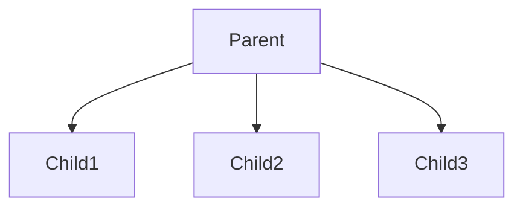
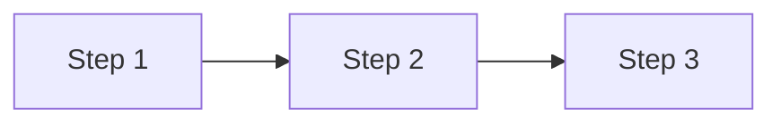
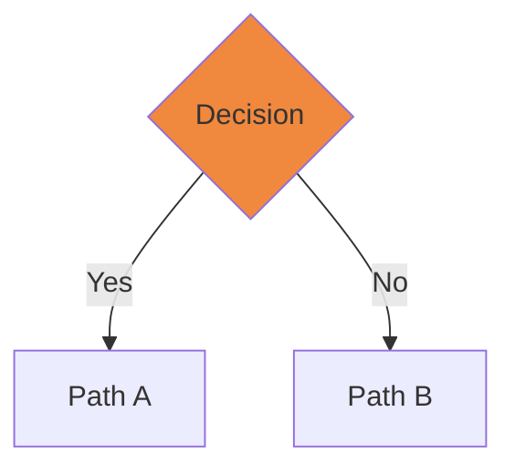
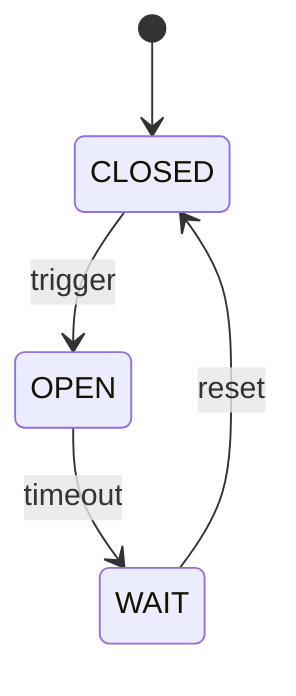
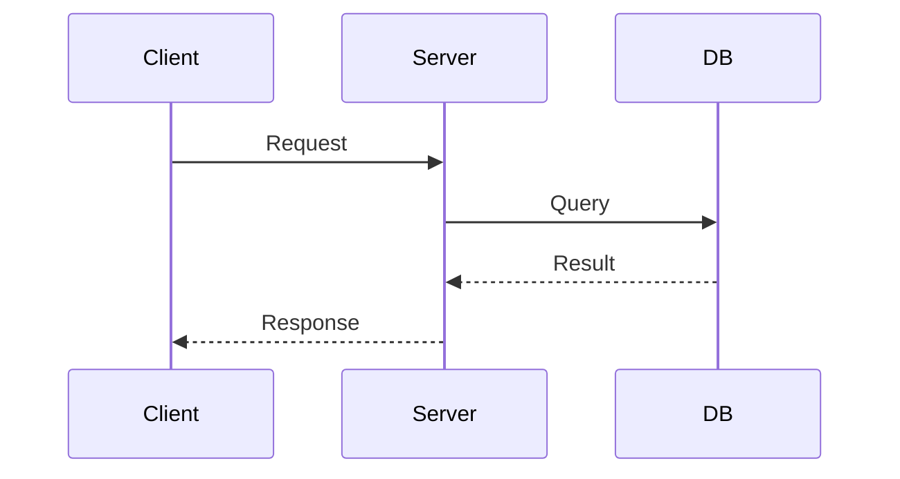
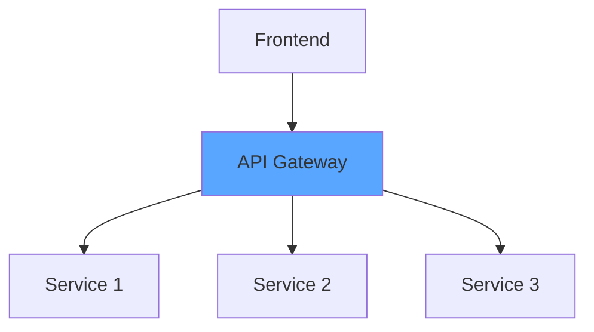
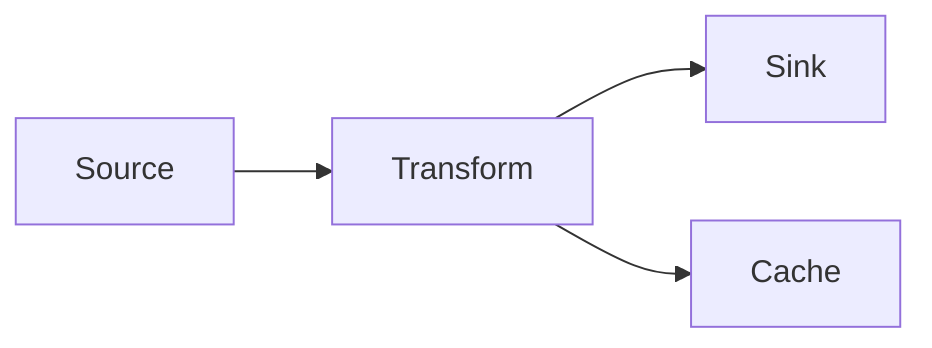

# Mermaid Diagram Templates

8 reusable patterns for converting ASCII diagrams. Use these as reference when auto-converting or manually refactoring.

---

## Template 1: Hierarchical/Tree (Parent → Children)

**ASCII Pattern:**
```text
        ┌──────────────┐
        │   Parent     │
        └─────┬────────┘
              │
        ┌─────┼─────┐
        │     │     │
        ▼     ▼     ▼
      Child1 Child2 Child3
```

**Mermaid:**


**Use for:** Organizational hierarchies, inheritance trees, folder structures, service dependencies.

---

## Template 2: Linear Process Flow

**ASCII Pattern:**
```text
┌─────────┐     ┌─────────┐     ┌─────────┐
│ Step 1  │ --> │ Step 2  │ --> │ Step 3  │
└─────────┘     └─────────┘     └─────────┘
```

**Mermaid:**


**Use for:** Request pipelines, data processing workflows, CI/CD stages, build processes.

---

## Template 3: Decision Tree/Branching

**ASCII Pattern:**
```text
        ┌──────────┐
        │ Decision │
        └────┬─────┘
             │
        ┌────┴────┐
        ▼         ▼
     Path A    Path B
```

**Mermaid:**


**Use for:** Conditional logic, authentication flows, error handling, cache hit/miss.

---

## Template 4: State Machine

**ASCII Pattern:**
```text
┌────────┐     ┌────────┐     ┌────────┐
│ CLOSED │ --> │ OPEN   │ --> │ WAIT   │
└────────┘     └────────┘     └────────┘
    ▲                              │
    └──────────────────────────────┘
```

**Mermaid:**


**Use for:** Circuit breaker, TCP states, connection lifecycle, FSM logic.

---

## Template 5: Sequence/Interaction Diagram

**ASCII Pattern:**
```text
Client          Server          DB
  │                │             │
  │──Request──────>│             │
  │                │──Query─────>│
  │                │<──Result───│
  │<──Response────│
  │                │             │
```

**Mermaid:**


**Use for:** HTTP flows, RPC calls, message passing, API interactions.

---

## Template 6: Component/Architecture

**ASCII Pattern:**
```text
┌─────────────────────────────────┐
│         Frontend                 │
└─────────────┬───────────────────┘
              │
┌─────────────▼───────────────────┐
│         API Gateway              │
└─────────────┬───────────────────┘
    ┌─────────┼─────────┐
    ▼         ▼         ▼
 Service1  Service2  Service3
```

**Mermaid:**


**Use for:** System architecture, microservices, layered design, deployment topology.

---

## Template 7: Data Flow Diagram

**ASCII Pattern:**
```text
┌──────────┐        ┌──────────┐        ┌──────────┐
│ Source   │──────>│ Transform│──────>│  Sink    │
└──────────┘        └──────────┘        └──────────┘
                        │
                        ▼
                   ┌──────────┐
                   │  Cache   │
                   └──────────┘
```

**Mermaid:**


**Use for:** ETL pipelines, event flows, data streams, database replication.

---

## Template 8: Comparison Matrix (ASCII table → Mermaid table)

**ASCII Pattern:**
```text
┌────────────┬──────────┬──────────┐
│ Feature    │ Option A │ Option B │
├────────────┼──────────┼──────────┤
│ Speed      │   Fast   │   Slow   │
│ Cost       │   Low    │   High   │
└────────────┴──────────┴──────────┘
```

**Mermaid (Markdown table in doc):**
```markdown
| Feature | Option A | Option B |
|---------|----------|----------|
| Speed   | Fast     | Slow     |
| Cost    | Low      | High     |
```

**Use for:** Feature comparisons, algorithm trade-offs, version compatibility.

---

## Conversion Rules

| ASCII Pattern | Mermaid Type | Priority |
|---------------|--------------|----------|
| `┌─┐` + tree structure | `graph TD` | High |
| `→` linear flow | `graph LR` | High |
| Branching (`┴`) | `graph TD` with conditional | High |
| State transitions | `stateDiagram-v2` | Medium |
| Sequence/arrows between actors | `sequenceDiagram` | Medium |
| Component boxes + connections | `graph TD` | Medium |
| Nested/layered boxes | `graph TD` with subgraph | Low |
| Tables/matrices | Markdown table | Low |

---

## Quick Regex Patterns (for batch converter)

```javascript
// Detect flowchart (consecutive boxes with arrows)
/└─+┘.*?─{2,}.*?┌─+┐/s → graph LR

// Detect hierarchy (boxes above/below with vertical connector)
/┌.*?┐\n.*└─+┘\n.*│.*?├/ → graph TD

// Detect state machine (circular arrows)
/[┌├].*?[┐┤].*?→.*?└/ → stateDiagram-v2

// Detect sequence (multiple columns with arrows)
/│.*?─{2,}.*?│.*?│/ → sequenceDiagram
```

---

## Integration with Batch Converter

Use these templates as:
1. **Reference patterns** — Manual review uses these as checklist
2. **Regex rules** — Auto-converter tests against patterns
3. **Quality gates** — Converted diagram matches template structure
4. **Fallback** — If pattern unrecognizable, suggest Template 6 (graph TD)

---

## Examples by Domain

| Domain | Primary Templates | Count |
|--------|-------------------|-------|
| Backend (03) | 1, 2, 3, 5 | 1,544 lines |
| DevOps (06) | 1, 5, 6, 7 | 1,176 lines |
| Cloud (05) | 6, 7, 8 | 918 lines |
| Architecture | 1, 6, 7 | 782 lines |
| Operating Systems | 3, 4, 5 | 550 lines |
