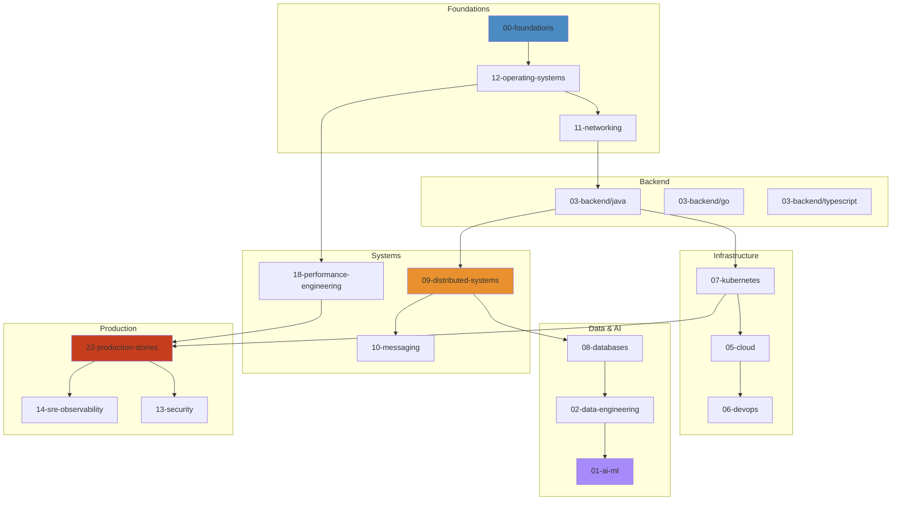

# Engineering Knowledge Universe

Master any engineering topic — from OS internals to system design, databases to distributed consensus.

## Start Here

Not sure where to begin? Pick your path:

| Your Goal | Start | Time |
|-----------|-------|------|
| **Junior Backend** (0-2 YOE) | [Backend Junior Path](content/paths/backend-junior.md) | ~20h |
| **Senior Backend** (3-5 YOE) | [Backend Senior Path](content/paths/backend-senior.md) | ~30h |
| **Staff+ Engineer** (6+ YOE) | [Staff Path](content/paths/staff.md) | ~25h |
| **System Design Interview** | [System Design Path](content/paths/system-design.md) | ~40h |

All 8 learning paths: [content/paths/](content/paths/)

## Quick Start

```bash
npm start          # API + viewer on http://localhost:3000
make frontend      # React frontend on http://localhost:5173
make viz           # Both together
python3 packages/python-server/server.py  # Python server (alternative)
```

## Domain Map



## Architecture

| Layer | Tech | Description |
|-------|------|-------------|
| **Content** | Markdown + HTML | 500+ files across 30 domains in `content/` |
| **API Server** | Node.js (zero deps) | `packages/api-server/server.js` — serves tree, file, search, graph, stats, health at `/api/*` |
| **Alt Server** | Python (stdlib) | `packages/python-server/server.py` — same API, no dependencies |
| **Legacy Viewer** | Vanilla JS SPA | `packages/legacy-viewer/read.html` — ~2000 lines, no build step |
| **React Frontend** | React 19, Vite, TS, Tailwind v4, XState, Zustand | `packages/react-frontend/` — proxies `/api` → `localhost:3000` |

## Navigation

- **New learner?** Start with a [learning path](content/paths/)
- **System design prep?** [15-system-design](content/15-system-design/) (86 files, 11 systems)
- **Database deep dives?** [08-databases](content/08-databases/) (72 files, 6 engines)
- **Production incidents?** [22-production-stories](content/22-production-stories/) (9 real-world cases)
- **Knowledge graph?** `GET /api/graph` — returns nodes + edges
- **API reference?** [content/API.md](content/API.md)

## Key Commands

```bash
make serve              # Node.js server on :3000
make frontend           # Vite dev server on :5173
make frontend-build     # Production build (tsc -b && vite build)
make frontend-typecheck # tsc --noEmit
make viz                # Node :3000 + Vite :5173 concurrently
make clean              # rm -rf packages/react-frontend/node_modules packages/react-frontend/dist
npm run lint -w packages/react-frontend  # ESLint (React frontend only)
```

## Project Layout

```
├── content/                         # All content (domains, paths, viz, API docs)
│   ├── 00-25/                       # Numbered domain folders
│   ├── paths/                       # 8 canonical learning paths
│   ├── html-visualizations/         # 220 standalone D3.js viz files
│   └── API.md                       # HTTP API reference
├── packages/                        # Monorepo packages (npm workspaces)
│   ├── api-server/                  # Node.js API server (zero deps)
│   ├── legacy-viewer/               # Vanilla JS SPA viewer
│   ├── python-server/               # Python alt server (stdlib only)
│   └── react-frontend/              # React 19 + Vite + TS app
├── scripts/                         # Python utility scripts
├── docs/archive/                    # Stale phase/initiative docs
├── STYLE_GUIDE.md                   # Content & contribution style guide
├── AGENTS.md                        # AI agent instructions
├── Makefile                         # Build/run commands
└── package.json                     # Root workspace config
```

## Contributing

See [CONTRIBUTING.md](CONTRIBUTING.md) and [STYLE_GUIDE.md](STYLE_GUIDE.md).

## Stats

<details>
<summary>Click to expand</summary>

| Metric | Value |
|--------|-------|
| Total content files | 500+ (420+ MD + 80+ HTML) |
| Total lines of content | ~380K |
| Code examples | 60K+ (93% syntax validated) |
| Interactive visualizations | 88+ HTML files (D3.js) |
| Real-world scenarios | 120+ across all domains |
| Domains covered | 30 numbered |
| Learning paths | 8 canonical paths |
| Languages | Python, JS, TS, SQL, Bash, Go, Java, Kotlin, Rust |
| Cloud platforms | AWS, Azure, GCP |
| Databases | PostgreSQL, MySQL, Redis, MongoDB, DynamoDB, Oracle |
| Messaging | Kafka, RabbitMQ, gRPC, SNS/SQS |
| Orchestration | Kubernetes, Docker, ECS, EKS, GKE, AKS |
| Server deps | Zero (Node.js built-ins only) |

</details>

## License

MIT
