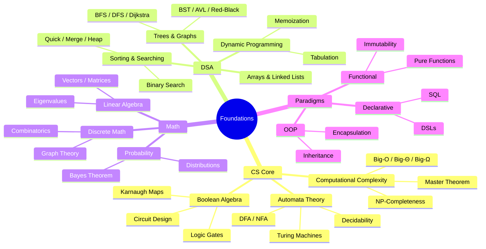
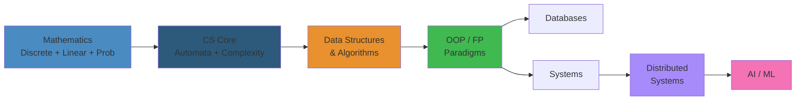

# 00 — Foundations

The bedrock of all software engineering. This domain covers the essential computer science theory, mathematical underpinnings, and core programming concepts that every engineer—regardless of specialization—must master. Without these foundations, higher-level topics (distributed systems, AI, compilers) rest on sand.

## Table of Contents

- [Computer Science Core](#computer-science-core)
  - [Data Structures & Algorithms](#data-structures--algorithms)
  - [Computational Complexity](#computational-complexity)
  - [Boolean Algebra & Logic](#boolean-algebra--logic)
  - [Automata Theory](#automata-theory)
  - [Discrete Mathematics](#discrete-mathematics)
- [Programming Paradigms](#programming-paradigms)
  - [Imperative & Procedural](#imperative--procedural)
  - [Object-Oriented Programming](#object-oriented-programming)
  - [Functional Programming](#functional-programming)
  - [Declarative Programming](#declarative-programming)
  - [Concurrent & Parallel Programming](#concurrent--parallel-programming)
- [Core CS Topics](#core-cs-topics)
  - [Computer Architecture](#computer-architecture)
  - [Operating Systems Concepts](#operating-systems-concepts)
  - [Compilers & Interpreters](#compilers--interpreters)
  - [Memory Management](#memory-management)
- [Learning Path](#learning-path)
- [Cross-References](#cross-references)

---

## Computer Science Core

### Data Structures & Algorithms

Fundamental data organizations and the algorithms that operate on them. This is the single most important topic for technical interviews and building efficient software.

**Linear Data Structures:**
- **Arrays & Strings** — contiguous memory allocation, dynamic arrays (amortized resizing), string algorithms (KMP pattern matching, Rabin-Karp rolling hash, Trie for prefix search, suffix arrays, Z-algorithm, Manacher's for palindromes)
- **Linked Lists** — singly and doubly linked, circular lists, sentinel nodes, pointer reversal, Floyd's cycle detection (tortoise and hare), fast and slow pointer patterns, merge sort on linked lists
- **Stacks & Queues** — LIFO/FIFO semantics, monotonic stack/queue (next greater element), deque (double-ended), priority queue (heap-backed), circular queue, sliding window maximum

**Hash-Based Structures:**
- **Hash Tables** — hash functions (division, multiplication, cryptographic), collision resolution (separate chaining, open addressing with linear/quadratic probing, double hashing), load factor and rehashing, Robin Hood hashing, Cuckoo hashing, consistent hashing for distributed systems
- **Bloom Filters** — probabilistic membership test; false-positive possible, false-negative impossible; applications: caching, spell-check, duplicate detection

**Tree Structures:**
- **Binary Trees** — traversal (inorder, preorder, postorder, level-order), serialization/deserialization, LCA (lowest common ancestor), diameter, max path sum
- **Binary Search Trees** — O(log n) search/insert/delete; predecessor/successor; self-balancing: AVL (height-balanced, rotations), Red-Black trees (color constraints, O(1) rotations), Treap (randomized), Splay tree
- **B-Trees & B+ Trees** — multi-way search trees; high fanout reduces height; B+ trees store keys in internal nodes, data in leafs; foundational for database indexes (MySQL InnoDB, PostgreSQL)
- **N-Tree / TRIE** — prefix tree for strings; compressed trie (radix tree); use cases: autocomplete, IP routing (CIDR), dictionary
- **Advanced Trees** — Segment tree (range queries + point updates), Fenwick tree / Binary Indexed Tree (prefix sums, O(log n) updates), Sparse table (RMQ, O(1) query), Order-statistic tree, Interval tree

**Heaps:**
- **Binary Heap** — complete binary tree; min-heap/max-heap; heapify O(n), extract-min O(log n); heap sort O(n log n), in-place
- **Fibonacci Heap** — amortized O(1) decrease-key; used in Dijkstra's and Prim's algorithms for sparse graphs
- **Binomial Heap** — mergeable heap; O(log n) merge

**Graph Algorithms:**
- **Representation** — adjacency matrix (dense, O(1) edge check), adjacency list (sparse, memory efficient), edge list
- **Traversal** — BFS (shortest path in unweighted graph, level order), DFS (topological sort, connected components, articulation points, bridges, strongly connected components via Tarjan/Kosaraju)
- **Shortest Paths** — Dijkstra (non-negative weights, O((V+E) log V) with binary heap), Bellman-Ford (negative weights, detects negative cycles, O(VE)), Floyd-Warshall (all-pairs, O(V³), dynamic programming)
- **Minimum Spanning Tree** — Kruskal (sort edges + Union-Find, O(E log E)), Prim (greedy node expansion, O(E log V) with heap)
- **Maximum Flow** — Ford-Fulkerson method, Edmonds-Karp (O(VE²)), Dinic (O(EV²) for unit capacities), Push-Relabel; min-cut = max-flow theorem
- **Advanced** — Eulerian/Hamiltonian paths, matching (bipartite via Hopcroft-Karp, stable marriage via Gale-Shapley), graph coloring, network flow with lower bounds

**Searching & Sorting:**
- **Searching** — linear search, binary search (and variants: first/last occurrence, rotated array), ternary search, exponential search, interpolation search
- **Comparison-Based Sorts** — quicksort (O(n²) worst, O(n log n) average; pivot selection; 3-way partition), mergesort (stable, O(n log n), O(n) extra space), heapsort (in-place, O(n log n), not stable), introsort (hybrid: quicksort → heapsort, used in C++ std::sort)
- **Non-Comparison Sorts** — counting sort (O(n+k) for small integer range), radix sort (O(d·n) for d-digit keys), bucket sort (uniform distribution)
- **Selection Algorithms** — quickselect (expected O(n)), median of medians (deterministic O(n))

**Dynamic Programming:**
- **Core Concepts** — optimal substructure, overlapping subproblems; memoization (top-down) vs tabulation (bottom-up); state definition and transition
- **Classic Problems** — 0/1 knapSack, unbounded knapSack, Longest Common Subsequence (LCS), Longest Increasing Subsequence (LIS, O(n log n) with patience sorting), Edit Distance (Levenshtein), Matrix Chain Multiplication
- **Advanced DP** — DP on trees (tree DP, rerooting), DP on graphs (shortest paths, DAG DP), DP on bitmasks (Hamiltonian path, traveling salesman), digit DP, probability DP
- **State Compression** — rolling array (O(1) space for certain problems), bitmask compression

**Greedy Algorithms:**
- **Core Principle** — make locally optimal choice leading to globally optimal solution; requires matroid structure (exchange property)
- **Classic Problems** — interval scheduling, Huffman coding (optimal prefix codes), Minimum Spanning Tree, Dijkstra's shortest path, coin change (canonical coin systems), fractional knapSack, job sequencing with deadlines

**Bit Manipulation:**
- **Operations** — AND, OR, XOR, NOT, left/right shift; isolate lowest set bit (x & -x), clear lowest set bit (x & (x-1)), check if power of two
- **Common Tricks** — XOR swap, find missing number, detect if bits differ (popcount), bit reversal, subset enumeration, bitset operations (bitset in C++/Java, BitSet in Python)
- **Applications** — bloom filters, bit flags, compression, cryptography, hash functions, low-level system programming

### Computational Complexity

- **Big-O Notation** — asymptotic upper bound (O), lower bound (Ω), tight bound (Θ); worst-case, best-case, average-case analysis
- **Amortized Analysis** — averaging cost over sequence of operations; aggregate, accounting, and potential methods; examples: dynamic array resizing, splay tree operations
- **Space Complexity** — memory usage analysis, in-place algorithms (O(1) extra space), auxiliary space vs input space
- **P vs NP** — P: solvable in polynomial time; NP: verifiable in polynomial time; NP-complete: hardest problems in NP (SAT, TSP, vertex cover, subset sum); NP-hard: at least as hard as NP-complete; reductions (Karp vs Cook reductions)
- **Complexity Classes** — L, NL, P, NP, PSPACE, EXPTIME; relationships and open questions (P vs NP, most famous open problem in CS)
- **Master Theorem** — solving recurrences T(n) = aT(n/b) + f(n); three cases based on f(n) vs n^log_b(a); applicable to divide-and-conquer algorithms (merge sort, binary search, Strassen's)
- **Other Recurrence Methods** — substitution method, recursion tree method, Akra-Bazzi for more complex recurrences

### Boolean Algebra & Logic

The mathematics of digital circuits and logical reasoning.

- **Boolean Operators** — AND (conjunction), OR (disjunction), NOT (negation), XOR (exclusive or), NAND (universal gate), NOR (universal gate); truth tables and Boolean identities (De Morgan's laws, distributive, associative, commutative, absorption)
- **Logic Gates** — combinational logic (AND, OR, NOT, XOR, NAND, NOR gates; multiplexers, demultiplexers, decoders, encoders, comparators) vs sequential logic (flip-flops: SR, JK, D, T; latches; registers; counters; finite state machines)
- **Karnaugh Maps** — graphical method for logic minimization; 2, 3, 4, 5 variable maps; grouping adjacent 1s; don't-care conditions; prime implicants vs essential prime implicants
- **Propositional Logic** — atomic propositions, logical connectives, well-formed formulas; truth tables; logical equivalence; inference rules (modus ponens, modus tollens, hypothetical syllogism, resolution)
- **Predicate Logic (First-Order)** — quantifiers (∀ universal, ∃ existential), predicates, functions; variable binding, substitution; Skolemization; Herbrand universe; completeness and undecidability of FOL
- **Digital Logic Design** — half adder and full adder circuits; ripple carry vs carry look-ahead adders; ALU design; register files, SRAM/DRAM cells; PLA (programmable logic arrays); FPGA basics

### Automata Theory

The study of abstract machines and the problems they can solve. Foundational for compilers, verification, and complexity.

- **Finite Automata** — DFA (deterministic): δ: Q×Σ→Q; NFA (nondeterministic): δ: Q×Σ→P(Q); epsilon-NFA (ε-transitions); subset construction (NFA → DFA, exponential blowup); DFA minimization (partition refinement, Moore's algorithm); product construction for intersection/union
- **Regular Languages** — regular expressions (Kleene star, concatenation, union); algebraic laws; pumping lemma for regular languages (proving non-regularity); Myhill-Nerode theorem (right-invariant equivalence relations, minimal DFA); closure properties (union, intersection, complement, difference, reversal, homomorphism)
- **Context-Free Grammars** — CFG definition (V, Σ, R, S); derivation (leftmost, rightmost), parse trees, ambiguity (inherent vs resolvable); Chomsky Normal Form (CNF: A→BC | a); Greibach Normal Form (GNF: A→aα); elimination of ε-productions, unit productions, useless symbols
- **Pushdown Automata** — PDA: Q×Σ×Γ → Q×Γ* (finite control, input tape, stack); deterministic vs nondeterministic; equivalence between CFGs and PDAs (LL parsing for top-down, LR parsing for bottom-up); pumping lemma for CFLs
- **Turing Machines** — TM definition: 7-tuple (Q, Σ, Γ, δ, q0, qaccept, qreject); multitape TMs (equivalent to single tape); nondeterministic TMs; encoding TMs as strings (universal TM); Church-Turing thesis (everything computable is TM-computable)
- **Decidability & Undecidability** — decidable problems (DFA/NFA/CFG emptiness, equivalence of DFAs); undecidable problems: halting problem (self-referential proof), Post Correspondence Problem, Rice's theorem (any non-trivial semantic property of TMs is undecidable); reductions between undecidable problems
- **Computability Hierarchy** — recursive languages (decidable), recursively enumerable (recognizable, but may loop on reject), co-RE; the Chomsky hierarchy (regular ⊂ context-free ⊂ context-sensitive ⊂ recursively enumerable)

### Discrete Mathematics

- **Set Theory** — set operations (union, intersection, difference, complement, symmetric difference), cartesian products, power sets, cardinality, countable vs uncountable sets; Russell's paradox, ZFC axioms
- **Combinatorics** — permutations (ordered, with/without repetition), combinations (unordered, Pascal's triangle, binomial theorem), stars and bars, recurrence relations, generating functions; inclusion-exclusion principle, pigeonhole principle (Dirichlet); Ramsey theory, Catalan numbers, Stirling numbers
- **Graph Theory** — vertices, edges, paths, cycles, connected components, bipartite graphs, complete graphs (Kn); Eulerian path/circuit (all edges exactly once, Euler's theorem), Hamiltonian path/cycle (all vertices exactly once, Dirac/Ore conditions); graph coloring (chromatic number, Four Color Theorem, chromatic polynomial); planar graphs (Euler's formula V - E + F = 2), Kuratowski's theorem
- **Number Theory** — Euclidean algorithm (GCD), extended Euclidean algorithm (modular inverses), modular arithmetic (congruence classes, Z/nZ), Chinese Remainder Theorem, Euler's totient theorem, Fermat's little theorem; prime number theorem, primality testing (Miller-Rabin, AKS); RSA foundations (trapdoor one-way function, hardness of factoring)
- **Probability Theory** — sample space, events, probability axioms, conditional probability, law of total probability; Bayes theorem (prior, likelihood, posterior); independence; random variables (discrete, continuous); expectation, variance, covariance, correlation; law of large numbers, central limit theorem; Markov chains (states, transition matrix, stationary distribution, PageRank)

---

## Programming Paradigms

### Imperative & Procedural

Statements that change program state. C, Fortran, Pascal. The foundational model of most modern languages. Key concepts: variables, loops, conditionals, subroutines, scope.

### Object-Oriented Programming

Encapsulation, inheritance, polymorphism, abstraction. SOLID principles, design patterns (GoF), composition vs inheritance. Languages: Java, C++, Python, TypeScript, C#.

### Functional Programming

Pure functions, immutability, referential transparency, higher-order functions, closures, currying, monads, functors. Languages: Haskell, Scala, Clojure, Elixir, F#. Functional features now appear in most mainstream languages (lambdas in Java, Python, JS).

### Declarative Programming

SQL, Prolog, HTML, CSS, configuration languages. Express *what* to do, not *how*. Domain-specific languages, logic programming, constraint programming.

### Concurrent & Parallel Programming

Threads, processes, async/await, coroutines, actors (Akka, Erlang), CSP (Go channels), data parallelism, SIMD, GPU programming (CUDA, OpenCL). Race conditions, deadlocks, livelocks, lock-free data structures.

---

## Core CS Topics

### Computer Architecture

- CPU pipelines, hazards, branch prediction
- Cache hierarchy (L1/L2/L3), cache coherency (MESI)
- Memory hierarchy, NUMA, virtual memory, TLB
- Instruction set architectures (x86, ARM, RISC-V)
- SIMD, vectorization, out-of-order execution

### Operating Systems Concepts

- **Processes** — PCB (process control block), process states (new → ready → running → waiting → terminated), context switching (overhead, TLB flush), fork/exec model, copy-on-write, zombie and orphan processes
- **Threads** — user-level vs kernel-level threads (N:1, 1:1, M:N models), thread pools, thread-local storage, fiber/green threads vs OS threads; concurrency vs parallelism
- **CPU Scheduling** — preemptive vs non-preemptive; policies: FCFS, SJF (Shortest Job First), Round Robin (time quantum), Priority Scheduling (with/without aging), Multi-level Feedback Queue (MLFQ, used in Linux CFS); Linux: CFS (Completely Fair Scheduler) with red-black tree; real-time scheduling (SCHED_FIFO, SCHED_RR, SCHED_DEADLINE)
- **Virtual Memory** — page table (single-level, multi-level, inverted, hash), TLB (translation lookaside buffer), page fault handling, demand paging, page replacement (FIFO, LRU, Clock/Second-chance, LFU, NRU); thrashing, working set model
- **Memory Allocation** — paging (fixed-size frames), segmentation (variable-size), segmented paging; buddy allocator, slab allocator, vmalloc vs kmalloc (Linux)
- **File Systems** — inode structure, directories (hard links vs symbolic links), ext4 (extents, journaling), XFS (B+tree allocation), Btrfs (copy-on-write, snapshots, checksums), ZFS (pooled storage, RAID-Z); NTFS (MFT), APFS (snapshots, clones, encryption)
- **I/O Models** — blocking I/O, non-blocking I/O, I/O multiplexing (select, poll, epoll on Linux, kqueue on BSD/macOS, IOCP on Windows), signal-driven I/O, asynchronous I/O (AIO, io_uring); zero-copy (sendfile, splice)
- **Inter-Process Communication** — pipes (named/unamed), FIFOs, Unix domain sockets, network sockets, shared memory (shmget, mmap), message queues (POSIX, System V), signals; synchronization: mutexes, semaphores, condition variables, barriers, spinlocks, read-write locks, RCU (Read-Copy-Update), futex (fast userspace mutex)

### Compilers & Interpreters

- Lexical analysis, parsing (recursive descent, LR, LALR)
- Abstract syntax trees, intermediate representations
- Optimization passes (constant folding, loop unrolling, inlining)
- Code generation, register allocation
- JIT compilation, AOT compilation, interpretation

### Memory Management

- **Stack Allocation** — fast, deterministic, automatic (function call/return); limited size (typically 1-8MB per thread); data must be fixed-size and known at compile time; stack overflow (unbounded recursion)
- **Heap Allocation** — dynamic, flexible, shared across functions; malloc/free (C), new/delete (C++), GC-managed (Java, Go, Python); performance cost: allocation + deallocation overhead, lock contention in multi-threaded allocators
- **Manual Memory Management** — explicit allocate/free (malloc, free; new, delete); pointer ownership, double-free, use-after-free, memory leaks (valgrind, AddressSanitizer); smart pointers (C++: unique_ptr, shared_ptr, weak_ptr)
- **Garbage Collection** — mark-sweep (stop-the-world, fragmentation), mark-compact (defragments, slower), copying (Cheney's algorithm, semispaces), generational (young generation: copy, old generation: mark-sweep/compact), reference counting (Swift, Python; circular reference problem + weak references); GC tuning (Java: G1, ZGC, Shenandoah; Go: non-generational, concurrent)
- **RAII (Resource Acquisition Is Initialization)** — C++ idiom; constructor acquires resource, destructor releases; exception-safe, scope-bound; applied to: memory (unique_ptr), locks (lock_guard), file handles, sockets
- **Ownership & Borrowing** — Rust's ownership system: each value has exactly one owner, references (borrowing) with lifetime annotations; no GC, no manual free, compile-time memory safety
- **Memory Pools & Arenas** — pre-allocate large block, sub-allocate manually; no per-allocation overhead, excellent cache locality; heap arena (glibc malloc arena), pool allocator (boost::pool), slab allocator (Linux kernel for objects of same size), region allocator (games, per-frame allocator)
- **Fragmentation** — internal (allocated but unused within block) vs external (free gaps between allocations); compaction for external fragmentation (relocate objects, update pointers); tcmalloc/jemalloc reduce fragmentation vs glibc malloc

---

## Learning Path

1. **Stage 1** — Discrete math, basic data structures (arrays, linked lists, stacks, queues), sorting/searching, Big-O analysis
2. **Stage 2** — Trees, graphs, hash tables, recursion, dynamic programming, greedy algorithms
3. **Stage 3** — Boolean algebra, digital logic, automata theory, computability
4. **Stage 4** — Programming paradigms (OOP, FP, concurrent), design patterns
5. **Stage 5** — Computer architecture, OS concepts, compilers, memory management

Study resources: CLRS (Introduction to Algorithms), SICP, Structure and Interpretation of Computer Programs, The Art of Computer Programming (Knuth), Computer Systems: A Programmer's Perspective (CS:APP).

---

## Cross-References

| Domain | Connection |
|--------|-----------|
| [01 — AI/ML](/01-ai-ml/) | Linear algebra, probability, optimization underpin all ML; algorithmic thinking critical for model design |
| [08 — Databases](/08-databases/) | B-trees, hash indexes, sorting algorithms are database internals; complexity analysis drives query optimization |
| [09 — Distributed Systems](/09-distributed-systems/) | Consensus algorithms, distributed computing theory build on automata and complexity foundations |
| [11 — Networking](/11-networking/) | Packet flow, TCP congestion control, routing algorithms apply queueing theory and graph algorithms |
| [12 — Operating Systems](/12-operating-systems/) | OS concepts (processes, memory, scheduling) are applied foundations; directly extends architecture topics |
| [17 — Software Architecture](/17-software-architecture/) | Design patterns, architectural styles, and system decomposition are applied OOP and modularity principles |
| [18 — Performance Engineering](/18-performance-engineering/) | Complexity analysis, memory hierarchy, cache behavior, algorithmic optimization all rooted here |
| [24 — Low Level Design](/24-low-level-design/) | LLD applies OOP, design patterns, and data structure selection to real-world component design |

## Domain Map: From Theory to Practice

## Topic Readiness by Layer

| Topic | L1 (Understand) | L2 (Apply) | L3 (Master) | Key Resource |
|---|---|---|---|---|
| **Discrete Math** | Sets, functions, logic | Proofs, induction, combinatorics | Graph theory, generating functions | `01-discrete-mathematics.md` |
| **Linear Algebra** | Vectors, matrices, dot product | Eigenvalues, SVD, PCA | Tensors, matrix calculus | `01-linear-algebra.md` |
| **Probability** | Basic probability, Bayes | Distributions, CLT, MLE | Bayesian inference, HMM | `02-statistics-probability.md` |
| **Complexity** | Big-O, Big-Θ, Big-Ω | Master theorem, recurrence | NP-completeness, reductions | Standard references |
| **DSA** | Arrays, lists, hash tables | Trees, graphs, sorting | Segment trees, tries, DP | LeetCode + algorithm texts |
| **Automata** | DFA/NFA, regex | Turing machines, decidability | Halting problem, P=NP | `01-computer-science-core.md` |
