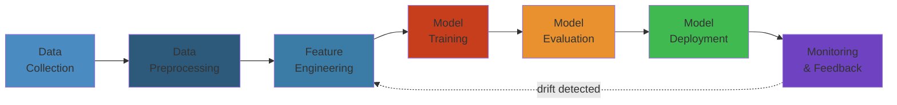

# 01 — AI/ML Engineering

The complete artificial intelligence and machine learning knowledge base—from mathematical foundations to production deployment. Covers classical ML, deep learning, large language models, agentic AI, MLOps, and the full lifecycle of building and operating AI systems at scale.




## Table of Contents

- [Fundamentals](#fundamentals)
  - [Linear Algebra](#linear-algebra)
  - [Probability & Statistics](#probability--statistics)
  - [Calculus & Optimization](#calculus--optimization)
  - [Information Theory](#information-theory)
- [Classical Machine Learning](#classical-machine-learning)
  - [Supervised Learning](#supervised-learning)
  - [Unsupervised Learning](#unsupervised-learning)
  - [Ensemble Methods](#ensemble-methods)
  - [Feature Engineering](#feature-engineering)
  - [Model Evaluation](#model-evaluation)
- [Deep Learning](#deep-learning)
  - [Neural Network Fundamentals](#neural-network-fundamentals)
  - [Architectures](#architectures)
  - [Training Techniques](#training-techniques)
  - [Computer Vision](#computer-vision)
  - [Natural Language Processing](#natural-language-processing)
- [LLM Engineering](#llm-engineering)
  - [Transformer Architecture](#transformer-architecture)
  - [Pre-training & Fine-tuning](#pre-training--fine-tuning)
  - [Prompt Engineering](#prompt-engineering)
  - [RAG Systems](#rag-systems)
  - [Model Alignment](#model-alignment)
  - [Quantization & Optimization](#quantization--optimization)
- [Agentic AI](#agentic-ai)
  - [Agent Frameworks](#agent-frameworks)
  - [Tool Use & Function Calling](#tool-use--function-calling)
  - [Multi-Agent Systems](#multi-agent-systems)
  - [Planning & Reasoning](#planning--reasoning)
  - [Memory & State](#memory--state)
- [MLOps](#mlops)
  - [Experiment Tracking](#experiment-tracking)
  - [Model Registry & Versioning](#model-registry--versioning)
  - [Feature Stores](#feature-stores)
  - [Training Pipelines](#training-pipelines)
  - [Model Serving](#model-serving)
  - [Monitoring & Observability](#monitoring--observability)
- [AI in Production](#ai-production)
  - [A/B Testing & Evaluation](#ab-testing--evaluation)
  - [Bias & Fairness](#bias--fairness)
  - [Safety & Guardrails](#safety--guardrails)
  - [Cost Optimization](#cost-optimization)
  - [Regulatory Compliance](#regulatory-compliance)
- [Learning Path](#learning-path)
- [Cross-References](#cross-references)

---

## Fundamentals

### Linear Algebra

The language of machine learning. Every model operation—forward pass, backpropagation, attention, embeddings—is linear algebra.

- **Vectors** — dot product, norm, projection, orthogonalization (Gram-Schmidt), basis, linear independence
- **Matrices** — multiplication, transpose, inverse, determinant, rank; types: symmetric, orthogonal, positive-definite
- **Matrix Decompositions** — LU, QR, Cholesky, eigenvalue decomposition, SVD (singular value decomposition)
- **Eigenvalues & Eigenvectors** — characteristic polynomial, eigendecomposition, PCA connection
- **Vector Spaces** — span, null space, column space, dimension, linear transformations
- **Applications** — word embeddings, matrix factorization (collaborative filtering), dimensionality reduction, graph neural networks (adjacency spectral properties)

### Probability & Statistics

Modeling uncertainty—the foundation for inference, prediction, and learning from data.

- **Probability Foundations** — axioms, conditional probability, Bayes' theorem, law of total probability
- **Random Variables** — discrete/continuous, PDF, PMF, CDF; expectation, variance, moments
- **Distributions** — Bernoulli, Binomial, Poisson, Uniform, Gaussian, Exponential, Beta, Gamma, Dirichlet
- **Joint & Conditional** — marginalization, chain rule, independence, covariance, correlation
- **Bayesian Statistics** — prior, likelihood, posterior, conjugate priors, Bayesian inference, MCMC, variational inference
- **Frequentist Statistics** — MLE, confidence intervals, hypothesis testing (p-values, t-test, chi-squared), ANOVA

### Calculus & Optimization

Training = minimizing a loss function. Understanding gradients and optimization is essential.

- **Differential Calculus** — derivatives, chain rule, partial derivatives, gradients, Jacobian, Hessian
- **Integral Calculus** — integration basics, expectations as integrals
- **Vector Calculus** — gradient of scalar functions, Jacobian of vector functions, Hessian matrices
- **Unconstrained Optimization** — gradient descent variants (SGD, momentum, Adam, RMSprop, AdaGrad), convergence analysis
- **Constrained Optimization** — Lagrange multipliers, KKT conditions, duality
- **Automatic Differentiation** — forward mode, reverse mode (backpropagation), computational graphs
- **Second-Order Methods** — Newton's method, quasi-Newton (BFGS, L-BFGS)

### Information Theory

Quantifying information, uncertainty, and divergence—critical for loss functions, tree splitting, and representation learning.

- **Entropy** — Shannon entropy, joint entropy, conditional entropy, cross-entropy
- **KL Divergence** — asymmetric measure of distribution difference; connections to cross-entropy loss
- **Mutual Information** — quantifying dependence, feature selection
- **Information Gain** — decision tree splitting criteria (ID3, C4.5, CART)
- **Rate-Distortion Theory** — compression, variational autoencoders (VAE bound)

---

## Classical Machine Learning

### Supervised Learning

- **Linear Models** — linear regression, logistic regression, ridge/lasso/elastic-net regularization
- **Decision Trees** — CART, ID3, C4.5; pruning, regularization, interpretability
- **Support Vector Machines** — maximum margin classification, kernel trick (RBF, polynomial), soft margin
- **k-Nearest Neighbors** — distance metrics, curse of dimensionality, KD-trees, ball trees
- **Naive Bayes** — generative classification, Gaussian/Multinomial/Bernoulli variants, independence assumption
- **Neural Networks (shallow)** — perceptron, multi-layer perceptron, activation functions, backpropagation

### Unsupervised Learning

- **Clustering** — k-means, DBSCAN, hierarchical clustering, Gaussian mixture models, spectral clustering
- **Dimensionality Reduction** — PCA, t-SNE, UMAP, LDA, autoencoders, feature selection techniques
- **Anomaly Detection** — isolation forest, one-class SVM, LOF, autoencoder-based, statistical methods
- **Association Rules** — Apriori, FP-Growth, market basket analysis

### Ensemble Methods

- **Bagging** — Bootstrap aggregating, random forests, out-of-bag error
- **Boosting** — AdaBoost, gradient boosting (XGBoost, LightGBM, CatBoost), stacking
- **Voting & Averaging** — soft/hard voting, weighted ensembles
- **Blending & Stacking** — meta-learners, cross-validation stacking

### Feature Engineering

- Encoding — one-hot, label, ordinal, target encoding, hashing, embeddings
- Scaling — standardization, normalization, robust scaling, power transforms
- Feature Selection — filter (correlation, mutual info), wrapper (RFE, forward selection), embedded (L1, tree importance)
- Feature Construction — polynomials, interactions, domain-specific aggregations, temporal features
- Dimensionality Reduction — PCA for feature compression, feature hashing

### Model Evaluation

- **Metrics** — accuracy, precision, recall, F1, ROC-AUC, PR-AUC, log loss, MSE, MAE, R-squared, MAPE
- **Cross-Validation** — k-fold, stratified, leave-one-out, group k-fold, time-series split
- **Bias-Variance Tradeoff** — underfitting vs overfitting, regularization, learning curves
- **Hyperparameter Tuning** — grid search, random search, Bayesian optimization (Optuna, Hyperopt), early stopping
- **Statistical Tests** — McNemar's test, paired t-test, Wilcoxon signed-rank for model comparison

---

## Deep Learning

### Neural Network Fundamentals

- **Architecture** — layers (dense, convolutional, recurrent), activation functions (ReLU, GELU, sigmoid, tanh, SwiGLU)
- **Forward & Backward Pass** — computational graphs, chain rule, gradient flow
- **Loss Functions** — cross-entropy, MSE, contrastive loss, triplet loss, CTC loss
- **Regularization** — L1/L2 weight decay, dropout, batch normalization, layer normalization, label smoothing, stochastic depth
- **Initialization** — Xavier/Glorot, He, LeCun, orthogonal; impact of initialization on training dynamics
- **Normalization** — batch norm, layer norm, instance norm, group norm; where and why each applies

### Architectures

- **CNNs** — convolution, pooling, stride, padding; architectures (ResNet, EfficientNet, MobileNet, ConvNeXt); depthwise separable convolution; applications: image classification, detection, segmentation
- **RNNs & LSTMs** — vanishing gradients, gated cells (LSTM, GRU), bidirectional RNNs; sequence modeling
- **Transformers** — self-attention, multi-head attention, positional encoding, encoder-decoder; vision transformers (ViT, DETR)
- **GANs** — generator, discriminator, adversarial training, conditional GANs, StyleGAN, diffusion models
- **Autoencoders** — vanilla, denoising, variational (VAE), masked autoencoders
- **Diffusion Models** — forward/reverse process, DDPM, DDIM, latent diffusion, score-based models
- **Mixture of Experts** — sparse MoE, routing, load balancing; used in large-scale models

### Training Techniques

- **Optimizers** — SGD, momentum, Nesterov, AdaGrad, RMSprop, Adam(W), Lion, Sophia
- **Learning Rate Schedules** — step decay, cosine annealing, warmup + decay, cyclical LR, OneCycle
- **Gradient Handling** — clipping, accumulation, checkpointing, gradient noise
- **Mixed Precision Training** — FP16/BF16/FP8, loss scaling, AMP (automatic mixed precision)
- **Distributed Training** — DDP (data parallel), FSDP (fully sharded), tensor parallelism, pipeline parallelism, sequence parallelism
- **Data Augmentation** — cropping, flipping, rotation, color jitter, MixUp, CutMix, RandAugment; for NLP: back-translation, span masking

### Computer Vision

- Image classification, object detection (YOLO, Faster R-CNN, DETR), semantic/instance segmentation, pose estimation
- Self-supervised learning (SimCLR, BYOL, MAE, DINO), CLIP for vision-language
- Video understanding (3D CNNs, Video Transformers, I3D), optical flow

### Natural Language Processing

- Tokenization (BPE, WordPiece, SentencePiece, Unigram), subword algorithms
- Sequence labeling (NER, POS tagging), text classification, summarization, translation, QA
- Encoder-only (BERT, RoBERTa, DeBERTa), decoder-only (GPT family, LLaMA, Mistral), encoder-decoder (T5, BART)
- Long-context modeling (RoPE, ALiBi, sparse attention, sliding window, linear attention)

---

## LLM Engineering

### Transformer Architecture

- **Self-Attention** — scaled dot-product, multi-head, causal masking, KV caching; compute complexity O(n²)
- **Positional Encodings** — sinusoidal (original), learned, RoPE (rotary), ALiBi, relative position bias
- **Feed-Forward Layers** — FFN, SwiGLU, gated variants; expansion ratios; activation choices
- **Normalization Placement** — pre-norm vs post-norm (most modern: pre-norm with RMSNorm)
- **Architecture Variants** — encoder-only, decoder-only, encoder-decoder; which for which task

### Pre-training & Fine-tuning

- **Pre-training Objectives** — next-token prediction (autoregressive), masked LM, denoising autoencoding, prefix LM
- **Data Curation** — deduplication, filtering, tokenization, mixture proportions (data mixing), curriculum learning
- **Scaling Laws** — Kaplan et al., Chinchilla; optimal model size vs data; compute-optimal training
- **Fine-tuning Strategies** — full fine-tuning, LoRA, QLoRA, AdaLoRA, IA³, prefix tuning, prompt tuning, adapter layers
- **Instruction Tuning** — supervised fine-tuning (SFT) on instruction datasets, data quality vs quantity, decontamination

### Prompt Engineering

- **Techniques** — zero-shot, few-shot, chain-of-thought (CoT), tree-of-thought, ReAct, self-consistency, least-to-most
- **Structured Prompts** — system prompt, user prompt, assistant prefix; XML/markdown formatting, schema enforcement
- **Output Control** — constrained decoding, JSON mode, structured output parsing, logit biasing, repetition penalty
- **Context Windows** — managing long contexts, sliding window, summarization for context, RAG augmentation

### RAG Systems

- **Indexing** — chunking strategies (fixed, semantic, recursive), document parsing, metadata extraction
- **Embedding Models** — retrieval quality, dimensionality (384, 768, 1024, 1536), multilingual, fine-tuned retrieval
- **Vector Stores** — FAISS, Pinecone, Qdrant, Weaviate, Milvus, Chroma; HNSW, IVF indexes
- **Retrieval** — dense retrieval, sparse retrieval (BM25), hybrid search, re-ranking, ColBERT, late interaction
- **Generation** — retrieved context integration, citation generation, faithfulness evaluation
- **Advanced RAG** — multi-hop RAG, agentic RAG, self-RAG, CRAG, adaptive retrieval, recursive retrieval

### Model Alignment

- **RLHF** — reward modeling, PPO optimization, KL penalty; alignment tax
- **DPO & Variants** — direct preference optimization (DPO), IPO, KTO, ORPO; simpler than RLHF
- **Constitutional AI** — self-critique, revision, constitutional principles
- **Red Teaming** — adversarial testing, jailbreak detection, prompt injection, automated red-teaming
- **Safety** — refusal behavior, content filtering, harmlessness, bias mitigation

### Quantization & Optimization

- **Post-Training Quantization** — INT8, INT4, FP8, NF4 (for QLoRA); calibration, per-channel vs per-tensor
- **Quantization-Aware Training** — simulated quantization, straight-through estimator
- **Pruning** — unstructured vs structured, magnitude pruning, SparseGPT, Wanda; 2:4 sparsity (NVIDIA)
- **Distillation** — knowledge distillation, logit matching, feature distillation; student-teacher frameworks
- **Inference Optimization** — FlashAttention (v2/v3), PagedAttention, continuous batching, prefix caching, speculative decoding, tensorRT, ONNX Runtime, vLLM, TGI

---

## Agentic AI

### Agent Frameworks

- **Architecture** — agent loop (observe → think → act), LLM as reasoning engine
- **Frameworks** — LangChain, CrewAI, AutoGen, Semantic Kernel, Dify, Coze
- **Agent Types** — conversational, task-oriented, autonomous, research, coding (Devin, Cursor)
- **State Management** — session state, conversation history, persistent memory (vector + structured)

### Tool Use & Function Calling

- **Function Calling** — OpenAI tool format, Anthropic tool use; schema definition, parameter binding, result routing
- **Tool Categories** — search/retrieval, file I/O, code execution (sandboxes), web browsing, API calling, database queries, computation
- **Tool Selection** — dynamic tool choice, tool masking, tool retrieval (many tools), forced tool call
- **Sandboxing** — containerized execution (Docker, Firecracker, gVisor), code interpreters (Jupyter kernels), network isolation

### Multi-Agent Systems

- **Communication** — direct messaging, broadcast, shared memory, blackboard pattern
- **Coordination** — hierarchical (manager-worker), peer-to-peer, debate/competition, voting, consensus
- **Specialization** — role-based agents (planner, coder, reviewer, tester, executor), handoff protocols
- **Orchestration** — sequential (pipeline), DAG, dynamic routing, swarm intelligence

### Planning & Reasoning

- **Task Decomposition** — hierarchical planning, subgoal decomposition, dependency graphs
- **ReAct Pattern** — reasoning + acting interleaved, observation tracking
- **Reflection & Self-Critique** — self-evaluation, error correction, iterative improvement
- **World Models** — internal representation of environment, simulation, lookahead

### Memory & State

- **Short-Term Memory** — conversation sliding window, recent context
- **Long-Term Memory** — vector store, key-value store, knowledge graph, episodic memory
- **Memory Operations** — write, read, consolidation, retrieval, forgetting/eviction
- **State Persistence** — checkpointing, serialization, recovery; distributed agent state

---

## MLOps

### Experiment Tracking

- Tools: MLflow, Weights & Biases, Neptune, Comet, TensorBoard
- Tracking: hyperparameters, metrics, artifacts, code version, environment
- Reproducibility: seeding, containerization, environment locking, data versioning

### Model Registry & Versioning

- Version management, stage transitions (staging → production), model lineage
- Tools: MLflow Model Registry, Sagemaker Model Registry, DVC, Hugging Face Hub

### Feature Stores

- Online vs offline serving; point-in-time correctness; feature consistency
- Tools: Feast, Tecton, SageMaker Feature Store, Databricks Feature Store

### Training Pipelines

- Data pipeline: validation, cleaning, transformation, augmentation, batching
- Training orchestration: distributed training, hyperparameter sweeps, checkpointing
- CI for ML: data validation, model testing, integration tests, training CI/CD
- Tools: TFX, Kubeflow, SageMaker Pipelines, Flyte, Airflow

### Model Serving

- **Online Serving** — real-time inference, REST/gRPC endpoints, batching, autoscaling
  - Tools: NVIDIA Triton, TorchServe, MLflow serving, Seldon Core, BentoML
  - Optimization: model compilation, quantization, ONNX, TensorRT
- **Offline Serving** — batch inference, Spark-based scoring, scheduled predictions
- **Edge Deployment** — TFLite, CoreML, ONNX Runtime mobile, TensorRT for edge, web (ONNX.js, WebLLM)

### Monitoring & Observability

- Prediction monitoring: data drift, concept drift, feature drift, outlier detection
- Performance monitoring: latency, throughput, error rates, resource utilization (GPU/CPU/memory)
- Model degradation: accuracy decay, stale model detection, alerting
- Tools: Evidently, WhyLabs, Arize, Fiddler, Grafana + Prometheus custom metrics

---

## AI in Production

### A/B Testing & Evaluation

- Online evaluation: interleaved experiments, A/B testing, MAB (multi-armed bandit)
- Offline evaluation: held-out sets, cross-validation, backtesting, counterfactual evaluation
- Human evaluation: annotation, rating scales, pairwise comparison, LMSYS Chatbot Arena methodology
- Automated eval: LLM-as-judge (MT-Bench, AlpacaEval, Arena-Hard), unit tests for model behavior

### Bias & Fairness

- Bias types: demographic, representation, measurement, aggregation, evaluation
- Fairness metrics: demographic parity, equal opportunity, equalized odds, predictive parity
- Mitigation: pre-processing (data reweighting), in-processing (adversarial debiasing, fairness constraints), post-processing

### Safety & Guardrails

- Guardrail frameworks: Guardrails AI, NVIDIA NeMo Guardrails, LLM Guard, Lakera
- Types: input guardrails (toxicity, jailbreak, prompt injection), output guardrails (hallucination, PII, safety)
- Rate limiting, access control, audit logging, human-in-the-loop review

### Cost Optimization

- Inference cost: model size, quantization, batching, caching, KV cache optimization
- Training cost: spot instances, preemptible VMs, transfer learning, efficient architectures
- Cloud cost: GPU availability zones, reserved capacity, spot market strategies
- Monitoring: cost per prediction, per user, per agent step; budget alerts

### Regulatory Compliance

- EU AI Act, GDPR, CCPA, HIPAA, SOX
- Model documentation: model cards, data sheets, impact assessments
- Explainability: SHAP, LIME, integrated gradients, attention visualization
- Data governance: data lineage, retention, anonymization, consent, right to deletion

---

## Code Examples

### Linear Regression (Gradient Descent)

```python
import numpy as np

class LinearRegression:
    def __init__(self, learning_rate=0.01, iterations=1000):
        self.lr = learning_rate
        self.iters = iterations
        self.m, self.b = 0, 0

    def fit(self, X, y):
        n = len(X)
        for _ in range(self.iters):
            y_pred = self.m * X + self.b
            dm = (-2/n) * np.sum(X * (y - y_pred))
            db = (-2/n) * np.sum(y - y_pred)
            self.m -= self.lr * dm
            self.b -= self.lr * db

    def predict(self, X):
        return self.m * X + self.b

# Usage
X = np.array([1, 2, 3, 4, 5])
y = np.array([2, 4, 5, 4, 5])
model = LinearRegression()
model.fit(X, y)
print(model.predict(np.array([6])))
```

### k-Means Clustering

```python
import numpy as np

class KMeans:
    def __init__(self, k=3, max_iters=100):
        self.k = k
        self.max_iters = max_iters

    def fit(self, X):
        # Random initialization
        idx = np.random.choice(len(X), self.k, replace=False)
        self.centroids = X[idx]

        for _ in range(self.max_iters):
            # Assign clusters
            distances = np.sqrt(((X - self.centroids[:, np.newaxis])**2).sum(axis=2))
            labels = np.argmin(distances, axis=0)

            # Update centroids
            new_centroids = np.array([X[labels == i].mean(axis=0) for i in range(self.k)])
            if np.allclose(self.centroids, new_centroids):
                break
            self.centroids = new_centroids

        return labels

# Usage with scikit-learn
from sklearn.cluster import KMeans
X = np.random.rand(100, 2)
kmeans = KMeans(n_clusters=3, random_state=42)
labels = kmeans.fit_predict(X)
```

### Decision Tree (CART Algorithm)

```python
from sklearn.tree import DecisionTreeClassifier
from sklearn.datasets import load_iris
from sklearn.model_selection import train_test_split
from sklearn.metrics import accuracy_score

# Load data
iris = load_iris()
X_train, X_test, y_train, y_test = train_test_split(
    iris.data, iris.target, test_size=0.2, random_state=42
)

# Train tree
tree = DecisionTreeClassifier(max_depth=5, criterion='gini', random_state=42)
tree.fit(X_train, y_train)

# Evaluate
y_pred = tree.predict(X_test)
print(f"Accuracy: {accuracy_score(y_test, y_pred):.3f}")

# Feature importance
for name, importance in zip(iris.feature_names, tree.feature_importances_):
    print(f"{name}: {importance:.3f}")
```

### Neural Network (PyTorch)

```python
import torch
import torch.nn as nn
import torch.optim as optim
from torch.utils.data import DataLoader, TensorDataset

# Define simple network
class SimpleNN(nn.Module):
    def __init__(self, input_size=10, hidden_size=32, output_size=2):
        super().__init__()
        self.fc1 = nn.Linear(input_size, hidden_size)
        self.relu = nn.ReLU()
        self.fc2 = nn.Linear(hidden_size, output_size)

    def forward(self, x):
        x = self.fc1(x)
        x = self.relu(x)
        x = self.fc2(x)
        return x

# Training loop
model = SimpleNN()
criterion = nn.CrossEntropyLoss()
optimizer = optim.Adam(model.parameters(), lr=0.001)

# Dummy data
X = torch.randn(100, 10)
y = torch.randint(0, 2, (100,))
dataset = TensorDataset(X, y)
loader = DataLoader(dataset, batch_size=32)

# Train
for epoch in range(5):
    for X_batch, y_batch in loader:
        optimizer.zero_grad()
        logits = model(X_batch)
        loss = criterion(logits, y_batch)
        loss.backward()
        optimizer.step()
    print(f"Epoch {epoch+1}, Loss: {loss.item():.3f}")
```

### Transformer Attention (PyTorch)

```python
import torch
import torch.nn.functional as F

def attention(query, key, value, mask=None):
    """Multi-head attention: (batch, seq_len, d_model)"""
    scores = torch.matmul(query, key.transpose(-2, -1)) / (query.shape[-1] ** 0.5)
    if mask is not None:
        scores = scores.masked_fill(mask == 0, -1e9)
    weights = F.softmax(scores, dim=-1)
    output = torch.matmul(weights, value)
    return output, weights

# Usage
batch_size, seq_len, d_model = 2, 5, 64
Q = torch.randn(batch_size, seq_len, d_model)
K = torch.randn(batch_size, seq_len, d_model)
V = torch.randn(batch_size, seq_len, d_model)
output, weights = attention(Q, K, V)
print(f"Output shape: {output.shape}, Weights shape: {weights.shape}")
```

### RAG (Retrieval-Augmented Generation)

```python
from transformers import AutoTokenizer, AutoModelForCausalLM
from sentence_transformers import SentenceTransformer
import numpy as np

# Embedding model for retrieval
embedding_model = SentenceTransformer('all-MiniLM-L6-v2')

# Knowledge base documents
docs = [
    "Python is a high-level programming language.",
    "Machine learning is a subset of artificial intelligence.",
    "Neural networks are inspired by biological neurons."
]
doc_embeddings = embedding_model.encode(docs)

# Query
query = "What is machine learning?"
query_embedding = embedding_model.encode(query)

# Retrieve top-k documents
scores = np.dot(doc_embeddings, query_embedding)
top_k_idx = np.argsort(scores)[-3:][::-1]
retrieved_docs = [docs[i] for i in top_k_idx]

# Generate with context
context = "\n".join(retrieved_docs)
prompt = f"Context:\n{context}\n\nQuestion: {query}\n\nAnswer:"
print(f"Prompt:\n{prompt}")
```

---

## Learning Path

1. **Stage 1** — Math foundations: linear algebra, probability, calculus, optimization basics
2. **Stage 2** — Classical ML: supervised learning, scikit-learn, model evaluation, feature engineering
3. **Stage 3** — Deep learning: neural nets, CNNs, RNNs, Transformers, PyTorch/TensorFlow
4. **Stage 4** — LLM engineering: Transformers deep dive, pre-training, fine-tuning, prompting, RAG
5. **Stage 5** — Agentic AI: agent frameworks, tool use, multi-agent, planning
6. **Stage 6** — MLOps & production: experiment tracking, serving, monitoring, cost optimization, safety

---

## Cross-References

| Domain | Connection |
|--------|-----------|
| [00 — Foundations](/00-foundations/) | Linear algebra, probability, optimization, and algorithmic thinking underpin all ML |
| [02 — Data Engineering](/02-data-engineering/) | Data pipelines, feature engineering, storage formats are prerequisites for ML at scale |
| [03 — Backend](/03-backend/) | Model serving, API design, performance optimization for ML services |
| [05 — Cloud](/05-cloud/) | GPU compute, managed ML services (SageMaker, Vertex AI, Bedrock), infrastructure for training |
| [06 — DevOps](/06-devops/) | CI/CD for ML, infrastructure as code for training clusters, MLOps pipelines |
| [07 — Kubernetes](/07-kubernetes/) | Model serving at scale, GPU scheduling, inference orchestrators (KServe, BentoML) |
| [08 — Databases](/08-databases/) | Vector databases, feature stores, model metadata storage, experiment tracking backends |
| [09 — Distributed Systems](/09-distributed-systems/) | Distributed training, model parallelism, consensus for model registry |
| [10 — Messaging](/10-messaging/) | Event-driven ML pipelines, streaming inference, async model communication |
| [14 — SRE/Observability](/14-sre-observability/) | ML system monitoring, drift detection, alerting, model health metrics |
| [15 — System Design](/15-system-design/) | Designing ML systems at scale, recommendation systems, search ranking |

---

## Related

- [Databases](/08-databases/) — Vector search, embeddings storage
- [Python Backend](/03-backend/) — ML inference APIs
- [Cloud Platforms](/05-cloud/) — GPU/TPU infrastructure
- [Data Engineering](/02-data-engineering/) — Training data pipelines
- [Performance Engineering](/18-performance-engineering/) — Model optimization
