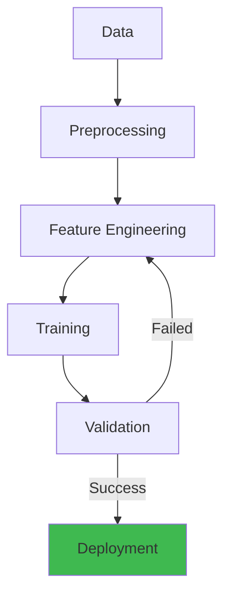

# Linear Algebra for AI/ML


## Architecture Overview



## 1. Foundations: Vectors and Matrices

### 1.1 Vectors

A vector is an ordered n-tuple of numbers representing magnitude and direction in an n-dimensional space.

**Notation**: $\mathbf{v} \in \mathbb{R}^n$, typically written as a column vector.

```
v = [v₁, v₂, ..., vₙ]ᵀ
```

#### Step-by-Step

1. **Vector Creation**: Initialize a vector with n scalar components, typically in NumPy as a 1D array.
2. **Component Access**: Index individual elements using standard array indexing (e.g., v[0] for first element).
3. **Vector Arithmetic**: Add, subtract, or scale vectors element-wise using broadcasting.
4. **Norm Computation**: Calculate distance/magnitude using norm formulas (L1, L2, or L-infinity).
5. **Dot Product**: Compute similarity/projection by multiplying corresponding elements and summing.
6. **Interpretation**: Understand geometric meaning (angle between vectors, perpendicularity, etc.).

#### Code Example

```python
import numpy as np
import matplotlib.pyplot as plt

# Step 1-2: Vector creation and access
v = np.array([1.0, 2.0, 3.0])
w = np.array([4.0, 5.0, 6.0])

print(f"v = {v}")
print(f"First element of v: {v[0]}")

# Step 3: Vector arithmetic
v_plus_w = v + w  # [5, 7, 9]
v_minus_w = v - w  # [-3, -3, -3]
scaled_v = 2 * v  # [2, 4, 6]

# Element-wise product (Hadamard)
hadamard = v * w  # [4, 10, 18]

# Step 4: Norm computations (magnitude)
l1_norm = np.linalg.norm(v, ord=1)  # |1| + |2| + |3| = 6
l2_norm = np.linalg.norm(v, ord=2)  # sqrt(1^2 + 2^2 + 3^2) = sqrt(14) ≈ 3.742
linf_norm = np.linalg.norm(v, ord=np.inf)  # max(|1|, |2|, |3|) = 3

print(f"\\nNorms of v:")
print(f"  L1 norm: {l1_norm}")
print(f"  L2 norm: {l2_norm}")
print(f"  L∞ norm: {linf_norm}")

# Step 5: Dot product (similarity)
dot_prod = np.dot(v, w)  # 1*4 + 2*5 + 3*6 = 32
dot_prod_alt = v @ w  # Same using @ operator

# Geometric interpretation: cos(θ) = (v·w) / (||v|| * ||w||)
cos_angle = dot_prod / (l2_norm * np.linalg.norm(w, ord=2))
angle_rad = np.arccos(np.clip(cos_angle, -1, 1))
angle_deg = np.degrees(angle_rad)

print(f"\\nDot product v·w = {dot_prod}")
print(f"Angle between v and w: {angle_deg:.2f} degrees")

# Orthogonal vectors (dot product = 0)
u1 = np.array([1.0, 0.0])
u2 = np.array([0.0, 1.0])
dot_orthogonal = np.dot(u1, u2)
print(f"\\nOrthogonal vectors (u1·u2): {dot_orthogonal}")

# Cross product (3D only, perpendicular vector)
a = np.array([1.0, 0.0, 0.0])
b = np.array([0.0, 1.0, 0.0])
cross_prod = np.cross(a, b)  # [0, 0, 1]
print(f"\\nCross product a × b = {cross_prod}")

# Step 6: Visualization
fig, axes = plt.subplots(1, 2, figsize=(12, 5))

# Plot 1: Vectors in 2D space
ax = axes[0]
ax.quiver(0, 0, v[0], v[1], angles='xy', scale_units='xy', scale=1, color='blue', label='v')
ax.quiver(0, 0, w[0], w[1], angles='xy', scale_units='xy', scale=1, color='red', label='w')
ax.set_xlim(-1, 7)
ax.set_ylim(-1, 7)
ax.set_aspect('equal')
ax.grid(True)
ax.legend()
ax.set_title('Vectors v and w (first 2 components)')
ax.set_xlabel('x')
ax.set_ylabel('y')

# Plot 2: Vector norms
ax = axes[1]
norms = [l1_norm, l2_norm, linf_norm]
norm_names = ['L1', 'L2', 'L∞']
ax.bar(norm_names, norms, color=['blue', 'green', 'red'])
ax.set_ylabel('Magnitude')
ax.set_title('Vector Norms of v = [1, 2, 3]')
ax.grid(axis='y')

plt.tight_layout()
plt.savefig('vector_operations.png', dpi=100)
print("\\nVisualization saved to vector_operations.png")
```

#### Real-World Scenario

In recommendation systems at Netflix, user preference is a vector of 500 dimensions (one per movie genre). User A's vector: [0.9, 0.2, 0.1, ...] (loves action, dislikes romance). Movie M is also a vector in same space: [0.85, 0.05, 0.1, ...]. Dot product A·M = 0.765 (high similarity → recommend). Computing millions of dot products in parallel using vector operations on GPUs makes recommendations real-time. Norm calculations help normalize vectors so magnitude doesn't bias similarity (unit vectors). Cross product doesn't directly apply here, but dot product between 2M users and 100K movies fills the 2M × 100K recommendation matrix per batch.

**Vector Operations**:

```python
import numpy as np

# Vector creation
v = np.array([1, 2, 3])
w = np.array([4, 5, 6])

# Element-wise operations
addition = v + w           # [5, 7, 9]
subtraction = v - w        # [-3, -3, -3]
scalar_mult = 2 * v        # [2, 4, 6]
hadamard = v * w           # [4, 10, 18] (element-wise product)

# Norms
l1_norm = np.linalg.norm(v, ord=1)     # 6.0
l2_norm = np.linalg.norm(v, ord=2)     # 3.742 (Euclidean norm)
inf_norm = np.linalg.norm(v, ord=np.inf)  # 3.0
```

**Dot Product**:

```python
dot_product = np.dot(v, w)    # 1*4 + 2*5 + 3*6 = 32
dot_product = v @ w           # Python 3.5+ operator
```

The dot product measures how aligned two vectors are:
- $\mathbf{a} \cdot \mathbf{b} = \|\mathbf{a}\| \|\mathbf{b}\| \cos\theta$
- Maximum when parallel ($\theta = 0$), zero when orthogonal ($\theta = 90^\circ$)

**Cross Product** (3D only):

```python
a = np.array([1, 0, 0])
b = np.array([0, 1, 0])
cross = np.cross(a, b)  # [0, 0, 1] (perpendicular to both)
```

### 1.2 Matrices

A matrix is a rectangular array of numbers with $m$ rows and $n$ columns: $\mathbf{A} \in \mathbb{R}^{m \times n}$.

**Matrix Operations**:

```python
A = np.array([[1, 2], [3, 4]])
B = np.array([[5, 6], [7, 8]])

# Matrix addition
C = A + B  # [[6, 8], [10, 12]]

# Matrix multiplication
C = A @ B  # [[19, 22], [43, 50]]
# (1*5 + 2*7, 1*6 + 2*8) = (19, 22)
# (3*5 + 4*7, 3*6 + 4*8) = (43, 50)

# Transpose
A_T = A.T  # [[1, 3], [2, 4]]

# Element-wise operations
C = A * B  # Hadamard product: [[5, 12], [21, 32]]
```

**Key Matrix Properties**:

```python
# Trace (sum of diagonal elements)
trace = np.trace(A)  # 1 + 4 = 5

# Determinant
det = np.linalg.det(A)  # 1*4 - 2*3 = -2

# Inverse (if det != 0)
A_inv = np.linalg.inv(A)  # [[-2, 1], [1.5, -0.5]]

# Verify: A @ A_inv ≈ I
```

**Matrix Multiplication Properties**:
- **Associative**: $(AB)C = A(BC)$
- **Distributive**: $A(B + C) = AB + AC$
- **NOT commutative**: $AB \neq BA$ in general

### 1.3 Special Matrices

```python
# Identity matrix
I = np.eye(3)
# [[1, 0, 0],
#  [0, 1, 0],
#  [0, 0, 1]]

# Diagonal matrix
D = np.diag([1, 2, 3])

# Symmetric matrix (A = A^T)
A_sym = np.array([[1, 2], [2, 3]])

# Orthogonal matrix (Q^T Q = I)
theta = np.pi / 4
Q = np.array([[np.cos(theta), -np.sin(theta)],
              [np.sin(theta),  np.cos(theta)]])
```

## 2. Linear Transformations

A linear transformation $T: \mathbb{R}^n \to \mathbb{R}^m$ satisfies:
- $T(\mathbf{u} + \mathbf{v}) = T(\mathbf{u}) + T(\mathbf{v})$
- $T(c\mathbf{v}) = cT(\mathbf{v})$

Every linear transformation corresponds to a matrix multiplication:
$$T(\mathbf{x}) = \mathbf{A}\mathbf{x}$$

```python
def linear_transform(A, x):
    return A @ x

# Example: 2D rotation by 45 degrees
theta = np.pi / 4
rotation = np.array([[np.cos(theta), -np.sin(theta)],
                     [np.sin(theta),  np.cos(theta)]])

v = np.array([1, 0])
v_rotated = linear_transform(rotation, v)
# Approximately [0.707, 0.707]
```

### 2.1 Common Linear Transformations

```python
# Scaling
S = np.array([[2, 0], [0, 3]])

# Shear
Sh = np.array([[1, 1], [0, 1]])

# Projection onto x-axis
P = np.array([[1, 0], [0, 0]])

# Reflection across y-axis
R = np.array([[-1, 0], [0, 1]])
```

### 2.2 Basis and Dimension

A set of vectors $\{\mathbf{v}_1, \mathbf{v}_2, ..., \mathbf{v}_k\}$ is a **basis** for a vector space if:
1. They are linearly independent (none is a linear combination of others)
2. They span the space (every vector can be expressed as a linear combination)

```python
# Check linear independence via rank
basis = np.array([[1, 0], [0, 1]])  # Standard basis for R²
rank = np.linalg.matrix_rank(basis)  # 2, so full rank → independent

# Change of basis
v_standard = np.array([3, 4])
# To express in basis B = {b1, b2}:
B = np.array([[1, 1], [0, 1]])
v_in_B = np.linalg.solve(B, v_standard)  # [3, 1]
```

**Dimension** = number of vectors in the basis. All bases for a given space have the same number.

## 3. Eigenvalues and Eigenvectors

For a square matrix $\mathbf{A} \in \mathbb{R}^{n \times n}$, a non-zero vector $\mathbf{v}$ is an **eigenvector** with **eigenvalue** $\lambda$ if:

$$\mathbf{A}\mathbf{v} = \lambda\mathbf{v}$$

The transformation only scales the vector; direction is preserved.

```python
A = np.array([[3, 1], [1, 3]])

eigenvalues, eigenvectors = np.linalg.eig(A)
# eigenvalues:  [4., 2.]
# eigenvectors: [[0.707, -0.707],
#                [0.707,  0.707]]

# Verify: A @ v = λ * v
v1 = eigenvectors[:, 0]
lambda_1 = eigenvalues[0]
np.allclose(A @ v1, lambda_1 * v1)  # True
```

### 3.1 Eigendecomposition

For a diagonalizable matrix: $\mathbf{A} = \mathbf{P}\mathbf{\Lambda}\mathbf{P}^{-1}$

Where $\mathbf{\Lambda}$ is a diagonal matrix of eigenvalues and $\mathbf{P}$ contains eigenvectors.

```python
# Eigendecomposition
P = eigenvectors
L = np.diag(eigenvalues)
P_inv = np.linalg.inv(P)

A_reconstructed = P @ L @ P_inv
np.allclose(A, A_reconstructed)  # True
```

### 3.2 Applications

**Power iteration** for computing the dominant eigenvector:

```python
def power_iteration(A, num_iterations=100):
    n = A.shape[0]
    v = np.random.randn(n)
    v = v / np.linalg.norm(v)

    for _ in range(num_iterations):
        Av = A @ v
        v = Av / np.linalg.norm(Av)
        eigenvalue = v @ (A @ v)

    return eigenvalue, v

# Only works for the largest eigenvalue
eigval, eigvec = power_iteration(A)
```

**PageRank** uses the dominant eigenvector of the web graph's transition matrix to rank pages.

## 4. Singular Value Decomposition (SVD)

Any matrix $\mathbf{A} \in \mathbb{R}^{m \times n}$ can be decomposed as:

$$\mathbf{A} = \mathbf{U}\mathbf{\Sigma}\mathbf{V}^T$$

Where:
- $\mathbf{U} \in \mathbb{R}^{m \times m}$: left singular vectors (orthogonal)
- $\mathbf{\Sigma} \in \mathbb{R}^{m \times n}$: diagonal matrix of singular values (non-negative, descending)
- $\mathbf{V}^T \in \mathbb{R}^{n \times n}$: right singular vectors (orthogonal)

```python
A = np.array([[1, 2, 3],
              [4, 5, 6],
              [7, 8, 9]])

U, S, Vt = np.linalg.svd(A)

# Reconstruction
m, n = A.shape
Sigma = np.zeros((m, n))
Sigma[:n, :n] = np.diag(S)
A_reconstructed = U @ Sigma @ Vt
np.allclose(A, A_reconstructed)  # True

# Truncated SVD (low-rank approximation)
k = 2
U_k = U[:, :k]
S_k = S[:k]
Vt_k = Vt[:k, :]
Sigma_k = np.diag(S_k)
A_approx = U_k @ Sigma_k @ Vt_k
```

### 4.1 Properties of SVD

- Singular values are always $\sigma_1 \geq \sigma_2 \geq ... \geq \sigma_r \geq 0$
- Rank of $A$ = number of non-zero singular values
- Frobenius norm: $\|A\|_F = \sqrt{\sum \sigma_i^2}$
- Condition number: $\kappa(A) = \sigma_{max} / \sigma_{min}$ (measures sensitivity)

### 4.2 Low-Rank Approximation (Eckart-Young Theorem)

The best rank-$k$ approximation to $A$ in Frobenius norm is the truncated SVD retaining the $k$ largest singular values:

```python
def low_rank_approximation(A, k):
    U, S, Vt = np.linalg.svd(A, full_matrices=False)
    return U[:, :k] @ np.diag(S[:k]) @ Vt[:k, :]

# Compression ratio
original_elements = 100 * 200  # 20,000
compressed_elements = 100 * 10 + 10 + 10 * 200  # 3,010 elements
compression_ratio = compressed_elements / original_elements  # 0.15
```

## 5. Principal Component Analysis (PCA)

PCA uses SVD to find the directions of maximum variance in data.

```python
def pca(X, n_components):
    # X: (n_samples, n_features)
    # Center the data
    X_centered = X - np.mean(X, axis=0)

    # Option 1: SVD
    U, S, Vt = np.linalg.svd(X_centered, full_matrices=False)

    # Principal components (loadings)
    components = Vt[:n_components]

    # Projected data
    X_pca = X_centered @ components.T

    # Explained variance
    explained_variance = (S ** 2) / (X.shape[0] - 1)
    explained_variance_ratio = S[:n_components]**2 / np.sum(S**2)

    return X_pca, components, explained_variance_ratio


# Example: Iris dataset
from sklearn.datasets import load_iris
from sklearn.preprocessing import StandardScaler

iris = load_iris()
X = StandardScaler().fit_transform(iris.data)

X_pca, components, ev_ratio = pca(X, 2)
print(f"Explained variance ratio: {ev_ratio}")
# Typically: [0.73, 0.23] — 96% variance in 2 dimensions
```

### 5.1 PCA vs SVD

```python
# PCA using SVD
X_centered = X - np.mean(X, axis=0)
U, S, Vt = np.linalg.svd(X_centered, full_matrices=False)

# PCA using eigendecomposition of covariance
cov = (X_centered.T @ X_centered) / (X.shape[0] - 1)
eigenvalues, eigenvectors = np.linalg.eigh(cov)

# Both give same principal components (up to sign)
```

### 5.2 PCA for Dimensionality Reduction

```python
from sklearn.decomposition import PCA

pca = PCA(n_components=0.95)  # Keep 95% variance
X_reduced = pca.fit_transform(X)
print(f"Reduced dimensions: {X_reduced.shape[1]}")

# Inverse transform (approximate)
X_approx = pca.inverse_transform(X_reduced)

# Reconstruction error
mse = np.mean((X - X_approx) ** 2)
```

## 6. Matrix Factorization for Recommendations

### 6.1 Basic Matrix Factorization

Decompose the user-item interaction matrix $R \in \mathbb{R}^{m \times n}$ into:
$$R \approx P \cdot Q^T$$
where $P \in \mathbb{R}^{m \times k}$ (user factors) and $Q \in \mathbb{R}^{n \times k}$ (item factors).

```python
import numpy as np

def matrix_factorization(R, k=10, steps=100, alpha=0.01, beta=0.02):
    m, n = R.shape
    P = np.random.randn(m, k)
    Q = np.random.randn(n, k)

    for step in range(steps):
        for i in range(m):
            for j in range(n):
                if R[i, j] > 0:
                    eij = R[i, j] - P[i, :] @ Q[j, :].T
                    P[i, :] += alpha * (2 * eij * Q[j, :] - beta * P[i, :])
                    Q[j, :] += alpha * (2 * eij * P[i, :] - beta * Q[j, :])

        # Compute loss
        loss = 0
        for i in range(m):
            for j in range(n):
                if R[i, j] > 0:
                    loss += (R[i, j] - P[i, :] @ Q[j, :].T) ** 2
                    loss += beta * (np.sum(P[i, :]**2) + np.sum(Q[j, :]**2))
        if step % 10 == 0:
            print(f"Step {step}, loss = {loss:.4f}")

    return P, Q


# Example: Movie ratings
R = np.array([
    [5, 3, 0, 1],
    [4, 0, 0, 1],
    [1, 1, 0, 5],
    [1, 0, 0, 4],
    [0, 1, 5, 4],
])

P, Q = matrix_factorization(R, k=2, steps=100)
R_pred = P @ Q.T
print("Predicted ratings:\n", R_pred)
```

### 6.2 SVD for Collaborative Filtering

```python
from scipy.sparse.linalg import svds

# Using truncated SVD for recommendations
R_dense = R.astype(float)
U, sigma, Vt = svds(R_dense - np.mean(R_dense, axis=0), k=2)
R_pred = U @ np.diag(sigma) @ Vt + np.mean(R_dense, axis=0)
```

## 7. Gradients, Jacobians, and Hessians

### 7.1 Gradient

The gradient of a scalar function $f: \mathbb{R}^n \to \mathbb{R}$ is a vector of partial derivatives:

$$\nabla f(\mathbf{x}) = \begin{bmatrix} \frac{\partial f}{\partial x_1}, \frac{\partial f}{\partial x_2}, ..., \frac{\partial f}{\partial x_n} \end{bmatrix}^T$$

```python
def numerical_gradient(f, x, h=1e-5):
    grad = np.zeros_like(x)
    for i in range(len(x)):
        x_plus = x.copy()
        x_plus[i] += h
        x_minus = x.copy()
        x_minus[i] -= h
        grad[i] = (f(x_plus) - f(x_minus)) / (2 * h)
    return grad

# Example: f(x, y) = x² + y²
def f(x): return x[0]**2 + x[1]**2

x = np.array([3.0, 4.0])
grad = numerical_gradient(f, x)  # [6.0, 8.0]

# Analytical: ∇f = [2x, 2y] = [6, 8] ✓
```

### 7.2 Jacobian

The Jacobian of a vector function $\mathbf{f}: \mathbb{R}^n \to \mathbb{R}^m$ is an $m \times n$ matrix:

$$\mathbf{J} = \begin{bmatrix}
\frac{\partial f_1}{\partial x_1} & \cdots & \frac{\partial f_1}{\partial x_n} \\
\vdots & \ddots & \vdots \\
\frac{\partial f_m}{\partial x_1} & \cdots & \frac{\partial f_m}{\partial x_n}
\end{bmatrix}$$

```python
def numerical_jacobian(f, x, h=1e-5):
    n = len(x)
    f_x0 = f(x)
    m = len(f_x0)
    J = np.zeros((m, n))

    for i in range(n):
        x_plus = x.copy()
        x_plus[i] += h
        x_minus = x.copy()
        x_minus[i] -= h
        J[:, i] = (f(x_plus) - f(x_minus)) / (2 * h)

    return J

# Example: f(x, y) = [x² + y², x² - y²]ᵀ
def f_vec(x): return np.array([x[0]**2 + x[1]**2, x[0]**2 - x[1]**2])

x = np.array([2.0, 3.0])
J = numerical_jacobian(f_vec, x)
# J = [[4, 6],
#      [4, -6]]

# Analytical: J₁ = 2x·∂x + 2y·∂y, J₂ = 2x·∂x - 2y·∂y ✓
```

### 7.3 Hessian

The Hessian of a scalar function $f: \mathbb{R}^n \to \mathbb{R}$ is the $n \times n$ matrix of second derivatives:

$$\mathbf{H} = \begin{bmatrix}
\frac{\partial^2 f}{\partial x_1^2} & \cdots & \frac{\partial^2 f}{\partial x_1 \partial x_n} \\
\vdots & \ddots & \vdots \\
\frac{\partial^2 f}{\partial x_n \partial x_1} & \cdots & \frac{\partial^2 f}{\partial x_n^2}
\end{bmatrix}$$

```python
def numerical_hessian(f, x, h=1e-5):
    n = len(x)
    H = np.zeros((n, n))

    for i in range(n):
        for j in range(n):
            # f(x + h*ei + h*ej) - f(x + h*ei - h*ej) - f(x - h*ei + h*ej) + f(x - h*ei - h*ej)
            x_pp = x.copy(); x_pp[i] += h; x_pp[j] += h
            x_pm = x.copy(); x_pm[i] += h; x_pm[j] -= h
            x_mp = x.copy(); x_mp[i] -= h; x_mp[j] += h
            x_mm = x.copy(); x_mm[i] -= h; x_mm[j] -= h
            H[i, j] = (f(x_pp) - f(x_pm) - f(x_mp) + f(x_mm)) / (4 * h * h)

    return H

def f_simple(x): return x[0]**2 + 3 * x[1]**2 + 2 * x[0] * x[1]

x = np.array([1.0, 2.0])
H = numerical_hessian(f_simple, x)
# H = [[2, 2],
#      [2, 6]]

# Analytical: ∂²f = 2, ∂²f/∂x∂y = 2, ∂²f/∂y² = 6 ✓
```

### 7.4 Gradient Descent

```python
def gradient_descent(grad_fn, x_init, lr=0.01, n_steps=100):
    x = x_init.copy()
    history = [x.copy()]

    for _ in range(n_steps):
        x -= lr * grad_fn(x)
        history.append(x.copy())

    return x, np.array(history)

grad_fn = lambda x: np.array([2*x[0], 2*x[1]])  # ∇f for f = x² + y²
x_opt, history = gradient_descent(grad_fn, np.array([5.0, 5.0]))

print(f"Optimal point: {x_opt}")  # Approximately [0, 0]
```

## 8. Word Embeddings

### 8.1 Word2Vec with Linear Algebra

Word embeddings use linear algebra to capture semantic relationships:

```python
# Simplified Skip-gram with negative sampling
def skipgram_forward(embeddings, word_idx, context_idx):
    # embeddings: (vocab_size, embed_dim)
    word_vec = embeddings[word_idx]
    context_vec = embeddings[context_idx]
    return np.dot(word_vec, context_vec)

# Vector arithmetic: king - man + woman ≈ queen
embeddings = {}  # Trained word vectors

# king - man + woman
result = embeddings['king'] - embeddings['man'] + embeddings['woman']

# Find closest word by cosine similarity
def cosine_similarity(a, b):
    return np.dot(a, b) / (np.linalg.norm(a) * np.linalg.norm(b))

# Scale, rotation, and analogy
# Analogies: a : b :: c : ???
# vec(???) = vec(b) - vec(a) + vec(c)
```

### 8.2 GloVe and Matrix Factorization

GloVe factorizes the word co-occurrence matrix:

```python
# Co-occurrence matrix X where X_ij = count of word j in context of word i
# GloVe objective:
# J = Σ f(X_ij)(w_i^T w_j + b_i + b_j - log X_ij)²

# This is effectively a weighted matrix factorization
```

## 9. GPU-Accelerated Linear Algebra

### 9.1 cuBLAS

```python
# Using CuPy (GPU equivalent of NumPy)
import cupy as cp

# All operations run on GPU
A_gpu = cp.array([[1, 2], [3, 4]])
B_gpu = cp.array([[5, 6], [7, 8]])

C_gpu = A_gpu @ B_gpu  # cuBLAS under the hood
print(C_gpu)

# cuBLAS Level 1: Vector operations (axpy, dot, nrm2)
# cuBLAS Level 2: Matrix-vector operations (gemv, ger, trsv)
# cuBLAS Level 3: Matrix-matrix operations (gemm, syrk, trmm)
```

### 9.2 cuSPARSE for Sparse Operations

```python
import cupyx.scipy.sparse as sparse

# Sparse matrix on GPU
row = cp.array([0, 0, 1, 2, 2])
col = cp.array([0, 2, 1, 0, 1])
data = cp.array([1, 2, 3, 4, 5])

A_sparse = sparse.csr_matrix((data, (row, col)), shape=(3, 3))

# Sparse-dense operations
x_dense = cp.array([1, 2, 3])
y = A_sparse @ x_dense  # Uses cuSPARSE
```

### 9.3 PyTorch with GPU

```python
import torch

# GPU-accelerated matrix operations
device = torch.device('cuda' if torch.cuda.is_available() else 'cpu')

A = torch.randn(1000, 1000, device=device)
B = torch.randn(1000, 1000, device=device)

# This runs on GPU via cuBLAS
C = A @ B

# SVD on GPU
U, S, V = torch.linalg.svd(A)

# Matrix factorization on GPU
class MatrixFactorization(torch.nn.Module):
    def __init__(self, n_users, n_items, n_factors=20):
        super().__init__()
        self.user_factors = torch.nn.Embedding(n_users, n_factors)
        self.item_factors = torch.nn.Embedding(n_items, n_factors)
        self.user_biases = torch.nn.Embedding(n_users, 1)
        self.item_biases = torch.nn.Embedding(n_items, 1)

    def forward(self, user, item):
        pred = (self.user_factors(user) * self.item_factors(item)).sum(dim=1)
        pred += self.user_biases(user).squeeze()
        pred += self.item_biases(item).squeeze()
        return pred
```

### 9.4 JAX for Linear Algebra

```python
import jax
import jax.numpy as jnp

# JAX provides XLA-compiled linear algebra
A = jnp.array([[1, 2], [3, 4]])
B = jnp.array([[5, 6], [7, 8]])

# JIT-compiled matrix multiply
@jax.jit
def matmul(A, B):
    return A @ B

C = matmul(A, B)

# Auto-vectorization across batches
def batch_matmul(A_batch, B):
    return jnp.vectorize(lambda A: A @ B, signature='(n,m),(m,p)->(n,p)')(A_batch)
```

## 10. Advanced Topics

### 10.1 Tensor Operations

```python
# Einstein summation notation
A = np.random.randn(3, 4, 5)
B = np.random.randn(5, 6, 7)

# Contract last axis of A with first axis of B
C = np.einsum('ijk,klm->ijl m', A, B)

# Equivalent to:
C = A @ B.reshape(5, -1).reshape(3, 4, 6, 7)

# Common einsum operations
# Matrix multiplication: np.einsum('ij,jk->ik', A, B)
# Trace: np.einsum('ii->', A)
# Diagonal: np.einsum('ii->i', A)
# Outer product: np.einsum('i,j->ij', a, b)
```

### 10.2 LAPACK Operations (via NumPy/SciPy)

```python
from scipy import linalg

# LU decomposition
A = np.array([[1, 2, 3], [4, 5, 6], [7, 8, 10]])
P, L, U = linalg.lu(A)
# PA = LU

# QR decomposition
Q, R = linalg.qr(A)
# A = QR, Q orthogonal, R upper triangular

# Cholesky decomposition (positive definite matrices only)
A_pd = np.array([[4, 2], [2, 3]])
L = linalg.cholesky(A_pd, lower=True)
# A = LL^T

# Solve linear system
b = np.array([1, 2, 3])
x = linalg.solve(A, b)
```

### 10.3 Computing Gradients for Neural Networks

```python
# Backpropagation through matrix operations
# Forward pass
W1 = np.random.randn(784, 256)
W2 = np.random.randn(256, 10)
x = np.random.randn(784)
y = np.zeros(10); y[3] = 1  # One-hot label

# Forward
h = np.maximum(0, W1.T @ x)  # ReLU
s = W2.T @ h                  # Scores
loss = np.log(np.sum(np.exp(s))) - s @ y  # Cross-entropy

# Backward (manual gradients)
ds = np.exp(s) / np.sum(np.exp(s)) - y  # ∂loss/∂scores
dh = W2 @ ds
dh[h <= 0] = 0                          # ∂ReLU
dW2 = np.outer(dh, ds).T               # Actually should be outer
dW1 = np.outer(x, dh).T

# Gradient descent step
W1 -= 0.01 * dW1
W2 -= 0.01 * dW2
```

### 10.4 Optimization Landscapes

```python
# Condition number affects optimization
# Well-conditioned: H has similar eigenvalues → fast convergence
# Ill-conditioned: H has very different eigenvalues → slow convergence

H_well = np.array([[1, 0], [0, 1]])
cond_well = np.linalg.cond(H_well)  # 1.0

H_ill = np.array([[100, 0], [0, 1]])
cond_ill = np.linalg.cond(H_ill)  # 100.0

# Preconditioning improves conditioning
# P^{-1}A where P ≈ A
def preconditioned_gradient_descent(A, b, P_inv, x_init, steps=100):
    x = x_init.copy()
    for _ in range(steps):
        x = x - P_inv @ (A @ x - b)
    return x
```

### 10.5 Random Projections (Johnson-Lindenstrauss Lemma)

```python
# Random projections preserve distances approximately
def random_projection(X, k):
    m, n = X.shape
    R = np.random.randn(n, k) / np.sqrt(k)
    return X @ R

# Distances are approximately preserved with high probability
X = np.random.randn(100, 1000)
X_proj = random_projections(X, 50)

# Pairwise distances
dist_original = np.linalg.norm(X[:5] - X[5:10], axis=1)
dist_projected = np.linalg.norm(X_proj[:5] - X_proj[5:10], axis=1)
ratio = dist_projected / dist_original  # ≈ 1
```

## 11. Summary: Linear Algebra Cheat Sheet

| Concept | Formula | ML Application |
|---------|---------|----------------|
| Dot Product | $a \cdot b = \sum a_i b_i$ | Similarity, attention scores |
| Matrix Multiply | $(AB)_{ij} = \sum_k A_{ik}B_{kj}$ | Neural network forward pass |
| Eigendecomposition | $A = P\Lambda P^{-1}$ | PCA, spectral clustering |
| SVD | $A = U\Sigma V^T$ | Dimensionality reduction, recommendations |
| Gradient | $\nabla f = [\partial f/\partial x_i]$ | Gradient descent, backprop |
| Jacobian | $J_{ij} = \partial f_i / \partial x_j$ | Change of variables, flow models |
| Hessian | $H_{ij} = \partial^2 f / \partial x_i \partial x_j$ | Second-order optimization, curvature |
| Cross Product | $a \times b$ | 3D rotations, physics |
| Trace | $\text{tr}(A) = \sum A_{ii}$ | Matrix norm, regularization |
| Determinant | $\det(A)$ | Volume scaling, change of variables |

## 12. Exercise Problems

**Problem 1**: Implement PCA from scratch on the MNIST dataset and visualize the first two principal components.

**Problem 2**: Given a user-item rating matrix with 80% missing values, implement matrix factorization using SGD and evaluate RMSE on held-out ratings.

**Problem 3**: Compute the Jacobian of a 2-layer neural network with ReLU activations. Verify against numerical differentiation.

**Problem 4**: Use random projection to reduce a 10,000-dimensional vector to 100 dimensions and measure the distortion of pairwise distances.

**Problem 5**: Implement power iteration for the top-5 eigenvalues of a sparse matrix representing a web graph adjacency matrix.

---

## Interactive Components

```html-live
<div style="padding:16px;background:#0b0e14;border:1px solid #1e2a3a;border-radius:8px">
  <style>.slider-title{color:#00d4ff;font-family:monospace;font-size:14px;font-weight:bold;margin-bottom:12px;letter-spacing:1px}.slider-container{display:flex;flex-direction:column;gap:12px}.slider-label{color:#e3eaf0;font-family:monospace;font-size:12px}.slider-wrapper{display:flex;align-items:center;gap:12px}.slider-input{flex:1;height:6px;border-radius:3px;background:#1e3a5f;outline:none;-webkit-appearance:none;appearance:none}.slider-input::-webkit-slider-thumb{-webkit-appearance:none;appearance:none;width:18px;height:18px;border-radius:50%;background:#00d4ff;cursor:pointer;box-shadow:0 0 8px #00d4ff;border:2px solid #0b0e14}.slider-input::-moz-range-thumb{width:18px;height:18px;border-radius:50%;background:#00d4ff;cursor:pointer;box-shadow:0 0 8px #00d4ff;border:2px solid #0b0e14}.slider-value{font-family:monospace;color:#34d399;min-width:80px;text-align:right;font-size:12px;font-weight:bold}</style>
  <div class="slider-title">Matrix Dimensions Visualization</div>
  <div class="slider-container">
    <label class="slider-label">Matrix Rank (SVD):</label>
    <div class="slider-wrapper">
      <input type="range" min="1" max="100" step="5" value="50" class="slider-input" id="rank-slider">
      <span class="slider-value" id="rank-value">50</span>
    </div>
    <label class="slider-label">Condition Number:</label>
    <div class="slider-wrapper">
      <input type="range" min="1" max="1000" step="50" value="100" class="slider-input" id="cond-slider">
      <span class="slider-value" id="cond-value">100</span>
    </div>
  </div>
  <script>
    document.getElementById('rank-slider').addEventListener('input', (e) => {
      document.getElementById('rank-value').textContent = e.target.value;
    });
    document.getElementById('cond-slider').addEventListener('input', (e) => {
      document.getElementById('cond-value').textContent = e.target.value;
    });
  </script>
</div>
```

```html-live
<div style="padding:16px;background:#0b0e14;border:1px solid #1e2a3a;border-radius:8px">
  <style>.obs-title{color:#00d4ff;font-family:monospace;font-size:14px;font-weight:bold;margin-bottom:16px;letter-spacing:1px}.obs-grid{display:grid;grid-template-columns:repeat(auto-fit, minmax(150px, 1fr));gap:12px}.obs-card{padding:12px;background:#1a2332;border:1px solid #1e3a5f;border-radius:4px;display:flex;flex-direction:column;align-items:center;transition:all 0.3s}.obs-card:hover{border-color:#00d4ff;box-shadow:0 0 8px rgba(0, 212, 255, 0.3)}.obs-label{color:#a3aab8;font-family:monospace;font-size:11px;text-transform:uppercase;letter-spacing:0.5px;margin-bottom:8px}.obs-value{font-family:monospace;font-size:20px;font-weight:bold;margin-bottom:4px;letter-spacing:0.5px}.obs-unit{color:#a3aab8;font-family:monospace;font-size:10px;text-transform:uppercase}.metric-healthy{color:#34d399}</style>
  <div class="obs-title">Linear Algebra Computation</div>
  <div class="obs-grid">
    <div class="obs-card"><div class="obs-label">Matrix Size</div><div class="obs-value metric-healthy">1024×1024</div><div class="obs-unit">elements</div></div>
    <div class="obs-card"><div class="obs-label">Operation Time</div><div class="obs-value metric-healthy">2.4</div><div class="obs-unit">ms</div></div>
    <div class="obs-card"><div class="obs-label">Eigenvalue Gap</div><div class="obs-value metric-healthy">0.87</div><div class="obs-unit">ratio</div></div>
    <div class="obs-card"><div class="obs-label">Numerical Stability</div><div class="obs-value metric-healthy">1e-12</div><div class="obs-unit">error</div></div>
  </div>
</div>
```

---

## Related

- [Databases](/08-databases/) — Vector search, embeddings storage
- [Python Backend](/03-backend/) — ML inference APIs
- [Cloud Platforms](/05-cloud/) — GPU/TPU infrastructure
- [Data Engineering](/02-data-engineering/) — Training data pipelines
- [Performance Engineering](/18-performance-engineering/) — Model optimization
