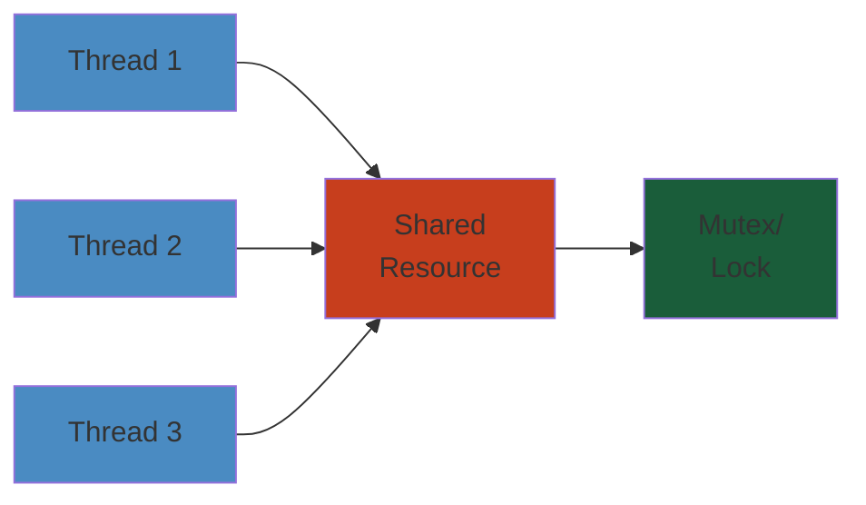
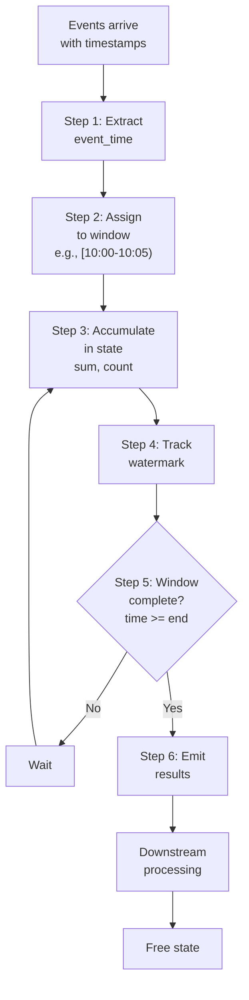

# Stream Processing




## Stream Processing Fundamentals

### What is Stream Processing?

Stream processing is a programming paradigm that treats data as a continuous, unbounded sequence of events. Unlike batch processing (where data is finite and processed in bulk), stream processing reacts to events as they arrive.

### Unbounded Data

```
Batch (Bounded):
  +----------+          +-----------+
  | Data Set | -------> | Process   | --> Result
  | (finite) |          | (once)    |
  +----------+          +-----------+

Stream (Unbounded):
  +----------+
  | Event 1  | --\
  +----------+    \
  +----------+     --> +-----------+
  | Event 2  | ------> | Process   | --> Result
  +----------+     --> | (ongoing) |
  +----------+    /    +-----------+
  | Event 3  | --/
  +----------+
    ...         (infinite)

Key difference:
  Batch: "Give me the answer for this finite data"
  Stream: "Keep updating me as new data arrives"
```

### Time Domains

```
Event Generation         Ingestion Time           Processing Time
  (sensor reads)        (Kafka received)        (Flink processes)
        |                     |                       |
  10:00:01.000         10:00:01.050            10:00:01.100
  10:00:01.050         10:00:01.060            10:00:01.120
  10:00:01.020         10:00:01.070            10:00:01.150
  10:00:01.030         10:00:01.080            10:00:01.160
  10:00:01.010         10:00:01.090            10:00:01.170

  Out-of-order arrival in event time:
    Expected order: 1.000, 1.010, 1.020, 1.030, 1.050
    Actual arrival: 1.000, 1.050, 1.020, 1.030, 1.010
```

### Windowing

Windows partition the infinite stream into finite chunks for aggregation:

```
Tumbling Window (fixed, non-overlapping):
[0-5)  [5-10)  [10-15)  [15-20)  [20-25)  [25-30)

Sliding Window (fixed, overlapping):
[0-10)
  [5-15)
    [10-20)
      [15-25)
        [20-30)

Session Window (dynamic, gap-based):
[--session 1--]  [--session 2--]    [--session 3--]
  Events at: 1,3,5   12,15,18,20      25,28
  Gap: > 5 minute inactivity
```

#### Step-by-Step

1. **Event Timestamp Extraction**: Each event is tagged with its event time (when it was generated, not processed).
2. **Window Assignment**: Streaming engine assigns each event to one or more windows based on its timestamp (e.g., event at 10:03 → [10:00-10:05) tumbling window).
3. **State Accumulation**: Events are accumulated in-memory state keyed by (window, group_key), building aggregates incrementally.
4. **Watermark Tracking**: System tracks a "watermark"—a threshold indicating no more events before this time will arrive (used to detect late events).
5. **Window Closure**: When watermark passes window end + allowed lateness, window is considered complete and results are emitted.
6. **Result Emission**: Final aggregated result (sum, count, etc.) for the window is output to downstream system, state freed.

#### Code Example

```python
from pyspark.sql import SparkSession
from pyspark.sql.functions import col, window, sum as spark_sum, count, from_unixtime
from pyspark.sql.types import StructType, StructField, IntegerType, LongType
import time

# Create SparkSession with streaming support
spark = SparkSession.builder \
    .appName("StreamWindowExample") \
    .getOrCreate()

spark.sparkContext.setLogLevel("ERROR")

# Simulate Kafka source (in practice, read from Kafka)
# Events: (timestamp, user_id, amount)
events_schema = StructType([
    StructField("timestamp", LongType()),
    StructField("user_id", IntegerType()),
    StructField("amount", IntegerType()),
])

# Step 1: Create streaming DataFrame from socket source (for demo)
streaming_df = spark.readStream \
    .format("socket") \
    .option("host", "localhost") \
    .option("port", 9999) \
    .load()

# For demo, use static data
import pandas as pd
df_static = pd.DataFrame({
    "timestamp": [int(time.time() * 1000) + i * 1000 for i in range(10)],
    "user_id": [1, 1, 2, 2, 1, 3, 3, 2, 3, 1],
    "amount": [100, 200, 150, 175, 50, 300, 100, 80, 90, 70],
})

df = spark.createDataFrame(df_static)

# Step 2-3: Assign events to 5-minute tumbling windows
windowed_df = df \
    .withColumn("event_time", from_unixtime(col("timestamp") / 1000)) \
    .groupBy(
        window(col("event_time"), "5 minutes"),  # Tumbling window
        col("user_id")
    ) \
    .agg(
        spark_sum("amount").alias("total_amount"),
        count("*").alias("event_count")
    )

# Step 4-5: For streaming, set watermark for late data
# (commented since we're using static data)
# windowed_df_with_watermark = df \
#     .withWatermark("event_time", "2 minutes") \
#     .groupBy(window(col("event_time"), "5 minutes"), col("user_id")) \
#     .agg(spark_sum("amount").alias("total_amount"))

# Step 6: Display results
windowed_df.show(truncate=False)

print("\\nWindow statistics:")
windowed_df.select("user_id", "total_amount", "event_count").show()

spark.stop()
```

#### Real-World Scenario

At Lyft, ride-request stream processes 500K+ events/second. Windowing: (1) each request event tagged with timestamp from mobile device, (2) engine assigns to 1-minute tumbling windows by location (geohash), (3) state accumulates requests per location: sum of requests, avg surge factor, (4) watermark tracks that events 2+ min old won't arrive (network is fast), (5) after 1 min + 30s allowed lateness, window closes and results sent to surge pricing engine, (6) state freed. If a late event arrives (rider had network blip), watermark already passed—event discarded to prevent re-computation.  System never waits more than 90s to emit pricing decisions, enabling real-time surges.

#### Diagram



### Watermarks

Watermarks track the progress of event time:

```
Event Time Flow:
  10:00  10:05  10:10  10:15  10:20  10:25
    |      |      |      |      |      |
  Event A (on time)
  Event B (on time)
  Watermark: 10:05
           Event C (late, before watermark - included)
           Event D (late, after watermark - discarded)
           Watermark: 10:10
                   Event E (too late, discarded)
                   Watermark: 10:15

Stream:
  [A@10:00][B@10:05][C@10:03][D@10:08][E@10:02]
  Watermark progress:
    10:00 -> 10:05 -> 10:05 -> 10:10 -> 10:10
    (after B, WM=10:05; C is late but within tolerated lateness)
```

**Watermark calculation strategies**:
- **Bounded out-of-orderness**: `max(event_time) - max_lateness`
- **Percentile-based**: Track event time distribution, set watermark at p99
- **Custom**: Idle-source handling, punctuated watermarks

## Kafka Streams

### Overview

Kafka Streams is a lightweight stream processing library that runs as a Java application (no separate processing cluster). It uses Kafka as both source and sink, providing exactly-once processing semantics.

### KStream, KTable, GlobalKTable

```java
// KStream: record stream (changelog of events)
KStream<String, Event> events = builder.stream(
    "events",
    Consumed.with(Serdes.String(), eventSerde)
);

// Each record is an independent event
// Stateless operations: filter, map, flatMap
KStream<String, Event> validEvents = events.filter(
    (key, event) -> event.isValid()
);

// KTable: changelog (upsert stream, key-based)
KTable<String, User> users = builder.table(
    "users",
    Consumed.with(Serdes.String(), userSerde)
);

// Each record is an upsert (last update per key wins)
// Stateful operations: groupBy, aggregate, join

// GlobalKTable: fully replicated on all instances
GlobalKTable<String, Config> config = builder.globalTable(
    "config",
    Consumed.with(Serdes.String(), configSerde)
);

// Every instance has the complete config table
// No need to co-partition when joining with KStream
```

**State diagram**:
```
Kafka Topic: user-clicks
+--------+--------+--------+--------+
| K1, V1 | K2, V2 | K1, V3 | K3, V4 |
+--------+--------+--------+--------+

KTable "user-clicks":
  Key K1: V1 -> V3 (latest value for key K1 is V3)
  Key K2: V2
  Key K3: V4

KStream "user-clicks":
  Record 1: (K1, V1)
  Record 2: (K2, V2)
  Record 3: (K1, V3)  -- independent record, does NOT replace V1
  Record 4: (K3, V4)
```

### State Stores

State stores enable stateful operations in Kafka Streams:

```java
// State store configuration
StoreBuilder<KeyValueStore<String, Long>> storeBuilder =
    Stores.keyValueStoreBuilder(
        Stores.persistentKeyValueStore("count-store"),
        Serdes.String(),
        Serdes.Long()
    )
    .withLoggingEnabled(new HashMap<>())  // Change log topic for fault tolerance
    .withCachingEnabled();

builder.addStateStore(storeBuilder);

// Processor with state
KStream<String, Event> events = builder.stream("events");

events.process(
    () -> new Processor<String, Event>() {
        private KeyValueStore<String, Long> kvStore;

        @Override
        public void init(ProcessorContext context) {
            this.kvStore = (KeyValueStore<String, Long>)
                context.getStateStore("count-store");
        }

        @Override
        public void process(String key, Event value) {
            Long count = kvStore.get(key);
            if (count == null) count = 0L;
            kvStore.put(key, count + 1);
            context().forward(key, count + 1);
        }
    },
    "count-store"
);
```

**Store types**:
- `persistentKeyValueStore`: RocksDB-backed (disk)
- `inMemoryKeyValueStore`: In-memory HashMap
- `persistentWindowStore`: Keyed by time windows
- `persistentSessionStore`: Keyed by session windows

### Exactly-Once Semantics

```java
// Enable exactly-once processing
Properties props = new Properties();
props.put(StreamsConfig.PROCESSING_GUARANTEE_CONFIG,
          StreamsConfig.EXACTLY_ONCE_V2);  // EOS-v2 (Kafka 2.5+)

// EOS-v2 provides:
// - Atomic writes to multiple topics
// - Exactly-once state store updates
// - Exactly-once input/output

// Transactional producer under the hood:
// 1. Read from source topic (offset stored in consumer group)
// 2. Process record (state store update + output)
// 3. Commit: atomic write to output topic + offset + state store
//    (all within a single Kafka transaction)

// Failure recovery:
// - Uncommitted transactions are rolled back
// - State stores restored from changelog topics
// - No duplicate processing
```

### Interactive Queries

Kafka Streams state stores can be queried directly from external applications:

```java
// Queryable state store
KStream<String, Long> counts = events
    .groupByKey()
    .count(
        Materialized.<String, Long, KeyValueStore<Bytes, byte[]>>as(
            "count-store"
        ).withKeySerde(Serdes.String())
         .withValueSerde(Serdes.Long())
    );

// Expose for external queries
// In the application:
ReadOnlyKeyValueStore<String, Long> store =
    streams.store(
        StoreQueryParameters.fromNameAndType(
            "count-store",
            QueryableStoreTypes.keyValueStore()
        )
    );

// External query via REST endpoint
@GET
@Path("/count/{key}")
public long getCount(@PathParam("key") String key) {
    return store.get(key);  // Query local state store
}

// For distributed queries:
// The query might need to route to the correct instance
// (same partition as the key)
```

## Change Data Capture (CDC)

### CDC Overview

Change Data Capture captures database changes (INSERT, UPDATE, DELETE) and streams them to downstream systems:

```
Source Database (Postgres/MySQL)        Target Systems
  +------------------+
  | Write-ahead Log   |              +------------------+
  | (WAL/Binlog)      | ---+------> | Kafka Topic      |
  +------------------+    |         | (events table)   |
        |                  |         +------------------+
        | CDC Tool         |         +------------------+
        | (Debezium)       |-------> | Kafka Topic      |
        |                  |         | (users table)    |
        |                  |         +------------------+
        |                  |         +------------------+
        |                  |-------> | Kafka Topic      |
        |                  |         | (orders table)   |
        |                  |         +------------------+
```

### Debezium

Debezium is an open-source CDC platform built on Kafka Connect:

```json
// Debezium Postgres connector config (connector.properties)
{
  "name": "inventory-connector",
  "config": {
    "connector.class": "io.debezium.connector.postgresql.PostgresConnector",
    "database.hostname": "postgres",
    "database.port": "5432",
    "database.user": "debezium",
    "database.password": "dbz",
    "database.dbname": "inventory",
    "database.server.name": "dbserver1",
    "plugin.name": "pgoutput",           // PostgreSQL 10+ native output plugin
    "slot.name": "debezium_slot",

    // Schema evolution
    "schema.history.internal.kafka.bootstrap.servers": "kafka:9092",
    "schema.history.internal.kafka.topic": "schemahistory.inventory",

    // Event routing
    "topic.prefix": "inventory",
    "table.include.list": "public.customers,public.orders",

    // Transformations
    "transforms": "unwrap,reroute",
    "transforms.unwrap.type": "io.debezium.transforms.ExtractNewRecordState",
    "transforms.unwrap.drop.tombstones": "false",
    "transforms.unwrap.delete.handling.mode": "rewrite",

    // Snapshot + streaming
    "snapshot.mode": "initial",          // Snapshot first, then stream changes
    "poll.interval.ms": "1000",
    "max.batch.size": "2048"
  }
}
```

**Debezium message format**:

```json
// INSERT: key = {id: 1001}, value (before+after)
{
  "schema": {...},
  "payload": {
    "op": "c",                           // c=create, u=update, d=delete, r=read
    "ts_ms": 1700000000000,
    "source": {
      "db": "inventory",
      "table": "customers",
      "lsn": 123456789,
      "snapshot": "false"
    },
    "before": null,
    "after": {
      "id": 1001,
      "first_name": "Alice",
      "last_name": "Johnson",
      "email": "alice@example.com"
    }
  }
}

// UPDATE:
{
  "op": "u",
  "before": {"id": 1001, "first_name": "Alice", ...},
  "after":  {"id": 1001, "first_name": "Alice Updated", ...}
}

// DELETE:
{
  "op": "d",
  "before": {"id": 1001, ...},
  "after": null
}
```

### Kafka Connect

Kafka Connect is a framework for streaming data between Kafka and external systems:

```
Source Connectors:
  Database (JDBC, Debezium) -> Kafka
  Filesystem (HDFS, S3) -> Kafka
  MQ (MQTT, JMS) -> Kafka
  REST API (HTTP) -> Kafka

Sink Connectors:
  Kafka -> Database (JDBC, Cassandra, MongoDB)
  Kafka -> S3/HDFS (Parquet, Avro, JSON)
  Kafka -> Elasticsearch/OpenSearch
  Kafka -> Snowflake/BigQuery
  Kafka -> Redis/Memcached
```

```json
// JDBC Sink connector
{
  "name": "postgres-sink",
  "config": {
    "connector.class": "io.confluent.connect.jdbc.JdbcSinkConnector",
    "tasks.max": "4",
    "topics": "enriched-orders",
    "connection.url": "jdbc:postgresql://postgres:5432/analytics",
    "connection.user": "analytics_user",
    "insert.mode": "upsert",
    "pk.mode": "record_key",
    "pk.fields": "id",
    "auto.create": "true",
    "auto.evolve": "true",   // Evolve schema when source changes
    "batch.size": "1000"
  }
}
```

### Schema Registry

Confluent Schema Registry provides centralized schema management:

```
Producer -> Schema Registry -> Avro serializer -> Kafka -> Avro deserializer -> Consumer
               |                                                    |
               | Register schema v1                                Schema lookup
               | Get schema ID (1)                                 Return schema
               +--------------------------------------------------------+

On the wire (Kafka message):
  [Magic byte (0)][Schema ID (4 bytes)][Avro binary payload]
        1              4                variable length
```

```java
// Producer with schema registry
Properties props = new Properties();
props.put("bootstrap.servers", "localhost:9092");
props.put("key.serializer", "org.apache.kafka.common.serialization.StringSerializer");
props.put("value.serializer", "io.confluent.kafka.serializers.KafkaAvroSerializer");
props.put("schema.registry.url", "http://schema-registry:8081");
props.put("auto.register.schemas", "true");

// Avro schema from registry
String userSchema = "{\"type\":\"record\",\"name\":\"User\",\"fields\":[" +
    "{\"name\":\"id\",\"type\":\"int\"}," +
    "{\"name\":\"name\",\"type\":\"string\"}" +
"]}";

// Producer sends Avro record; schema is auto-registered
```

## Stream Processing Patterns

### Filter

```java
// Kafka Streams filter
KStream<String, Event> highValueEvents = events.filter(
    (key, event) -> event.getAmount() > 1000.0
);

// Flink filter
DataStream<Event> highValue = events.filter(event -> event.getAmount() > 1000.0);
```

### Enrich

```java
// Stream-table join (enrich event with user data)
KStream<String, Event> events = ...
KTable<String, User> users = ...

KStream<String, EnrichedEvent> enriched = events.join(
    users,                                             // KTable
    (event, user) -> new EnrichedEvent(event, user),    // Joiner
    Joined.with(Serdes.String(), eventSerde, userSerde)
);

// GlobalKTable join (every instance has the full lookup table)
KStream<String, Event> events = ...
GlobalKTable<String, Config> config = ...

KStream<String, EnrichedEvent> enriched = events.leftJoin(
    config,
    (key, event) -> event.getConfigKey(),               // Key extractor
    (event, config) -> new EnrichedEvent(event, config)  // Joiner
);
```

### Aggregate

```java
// Windowed aggregation
KTable<Windowed<String>, Long> hourlyCounts = events
    .groupBy((key, event) -> event.getType())
    .windowedBy(TimeWindows.ofSizeWithNoGrace(Duration.ofHours(1)))
    .count()
    .toStream()
    .map((windowedKey, count) -> KeyValue.pair(
        windowedKey.key() + "@" + windowedKey.window().start(),
        count
    ));
```

### Sessionization

```java
// User sessionization (group events into sessions)
KTable<Windowed<String>, Long> sessions = events
    .groupByKey()
    .windowedBy(SessionWindows.with(Duration.ofMinutes(30)))
    .count();

// Custom session window logic
KStream<String, UserSession> sessions = events
    .groupByKey()
    .aggregate(
        UserSession::new,
        (key, event, session) -> session.addEvent(event),
        Materialized.with(Serdes.String(), userSessionSerde)
    )
    .suppress(Suppressed.untilWindowCloses(unbounded()))  // Emit only when window closes
    .toStream();
```

### Anomaly Detection

```java
// Simple threshold-based anomaly
KStream<String, Alert> alerts = events
    .filter((key, event) -> event.getValue() > event.getThreshold())
    .map((key, event) -> KeyValue.pair(
        key,
        new Alert(key, event.getValue(), event.getThreshold(), "Threshold exceeded")
    ));

// Rate-based anomaly (detect sudden spikes)
KTable<Windowed<String>, Long> rate = events
    .groupByKey()
    .windowedBy(SlidingWindows.of(Duration.ofMinutes(5)))
    .count();

KStream<String, Alert> spikeAlerts = rate
    .toStream()
    .filter((key, count) -> count > calculateExpectedRate(key) * 3);
```

## Real-Time ETL Patterns

### Streaming Ingestion

```
Source Systems           Ingestion Layer          Streaming Pipeline
+------------+          +----------------+        +----------------+
| App Logs   | -------> | Kafka Topic:   | -----> | Flink/KS Job   |
| (HTTP)     |          | raw-logs       |        | Parse/Validate |
+------------+          +----------------+        | Filter/Dedup   |
+------------+          +----------------+        | Enrich         |
| DB Changes | -------> | Kafka Topic:   | -----> +-------+--------+
| (CDC)      |          | db-cdc         |                |
+------------+          +----------------+                v
+------------+          +----------------+        +----------------+
| IoT Sensors| -------> | Kafka Topic:   |        | Output Topics  |
| (MQTT)     |          | sensor-data    |        | - cleaned-logs |
+------------+          +----------------+        | - enriched-cdc |
                                                  +-------+--------+
                                                          |
                                                          v
                                                  +----------------+
                                                  | Sink Connectors |
                                                  | (S3/DB/ES)     |
                                                  +----------------+
```

### Streaming Analytics

```python
# PyFlink real-time analytics pipeline
env = StreamExecutionEnvironment.get_execution_environment()

# Source: Kafka
kafka_source = FlinkKafkaConsumer(
    "page-views",
    SimpleStringSchema(),
    {"bootstrap.servers": "localhost:9092", "group.id": "analytics"}
)

source = env.add_source(kafka_source)

# Parse JSON
parsed = source.map(json.loads)

# Key by page URL
keyed = parsed.key_by(lambda x: x["url"])

# Tumbling window: count views per minute
from pyflink.datastream.window import TumblingProcessingTimeWindows

windowed = keyed.window(TumblingProcessingTimeWindows.of(Time.minutes(1)))

# Aggregate
class ViewCount(AggregateFunction):
    def create_accumulator(self): return 0
    def add(self, value, acc): return acc + 1
    def get_result(self, acc): return {"views": acc}
    def merge(self, a, b): return a + b

counts = windowed.aggregate(ViewCount())

# Sink: Kafka
counts.add_sink(FlinkKafkaProducer(
    "page-view-counts",
    SimpleStringSchema(),
    {"bootstrap.servers": "localhost:9092"},
    semantic=Semantic.EXACTLY_ONCE
))

env.execute("Real-time Page View Analytics")
```

### Streaming to Lakehouse

```
Stream -> Kafka -> Flink -> Parquet on S3 -> Iceberg/Delta Table
                                          
Pipeline:
1. Flink reads from Kafka with event-time processing
2. Applies watermarking + windowing for correctness
3. Writes to S3 staging directory as Parquet files
4. Commits files to Iceberg/Delta table via manifest/log

Checkpointing:
  - Flink checkpoints S3 file write positions
  - On failure, restarts from last checkpoint (exactly-once)
  - Files committed on successful checkpoint

Configuration:
  StreamingFileSink sink = StreamingFileSink
      .forRowFormat(new Path("s3://data/staging/"), encoder)
      .withBucketAssigner(new DateTimeBucketAssigner<>("yyyy/MM/dd/HH"))
      .withRollingPolicy(
          DefaultRollingPolicy.create()
              .withRolloverInterval(TimeUnit.MINUTES.toMillis(60))
              .withInactivityInterval(TimeUnit.MINUTES.toMillis(5))
              .withMaxPartSize(256 * 1024 * 1024)
              .build()
      )
      .build();
```

## Backpressure

### Reactive Streams

Backpressure is the mechanism for signaling capacity through the stream:

```
Fast Producer                    Slow Consumer
  |                                  |
  |--- Event 1 ------------------->  |
  |--- Event 2 ------------------->  |
  |--- Event 3 ---X                  | (buffer full)
  |--- Event 4 ---X                  |
  |         |                        |
  |<--- backpressure signal ---------|
  |         |                        |
  | (stops producing)                | (processes events)
  |         |                        |
  |<--- request(n) ------------------|
  |--- Event 3 ------------------->  |
  |--- Event 4 ------------------->  |
```

**Reactive Streams API**:
```java
// Publisher: emits events
Publisher<Event> publisher = ...;
publisher.subscribe(new Subscriber<Event>() {
    private Subscription subscription;
    private static final int REQUEST_SIZE = 100;

    @Override
    public void onSubscribe(Subscription s) {
        this.subscription = s;
        s.request(REQUEST_SIZE);  // Request 100 events initially
    }

    @Override
    public void onNext(Event event) {
        process(event);
        subscription.request(1);  // Request one more after processing
    }

    @Override
    public void onError(Throwable t) { ... }
    @Override
    public void onComplete() { ... }
});
```

### Kafka Consumer Lag

Consumer lag indicates how far behind the consumer is:

```
Producer -> [Kafka Partition] -> Consumer Group -> Processing
              ^                      ^
              |                      |
        Write offset             Read offset
              |                      |
              +----------+-----------+
                         |
                   Consumer Lag = Write offset - Read offset

Diagram:
  Partition 0:
  [0][1][2][3][4][5][6][7][8][9][10][11][12][13][14][15][16]
   ^              ^
   |              |
  Read: 3       Write: 16
  Lag: 13 messages
```

**Monitoring lag**:
```bash
# Kafka CLI
kafka-consumer-groups --bootstrap-server localhost:9092 \
    --group my-consumer \
    --describe

# Output:
# TOPIC     PARTITION  CURRENT-OFFSET  LOG-END-OFFSET  LAG
# events    0          3000            3500            500
# events    1          2800            3200            400
# events    2          3100            3600            500
```

**Handling high lag**:
1. Increase consumer parallelism (more partitions + consumers)
2. Optimize processing (batch writes, async I/O)
3. Scale out (add more consumer instances)
4. Rate limit producer (if possible)

### Flink Checkpoint Backpressure

Flink's checkpoint alignment introduces backpressure:

```
Operator:
  Input 1: [A][B][C][BARRIER][D][E]...(buffered during alignment)
  Input 2: [X][BARRIER][Y][Z]...

During alignment:
  - Input 1 received BARRIER first
  - Input 1 data after barrier is BUFFERED (not processed)
  - This creates backpressure on input 1 source
  - Input 2 must catch up (barrier not yet received)
  - Once both barriers received -> state snapshot -> release buffers

Unaligned checkpoints (Flink 1.11+):
  - No alignment phase
  - Input 1 keeps processing while barriers from input 2 arrive
  - Barrier + unprocessed data is included in checkpoint
  - Faster, but checkpoint size may be larger
```

## Lambda vs Kappa Architecture

### Lambda Architecture

```
Batch Layer                          Speed Layer (Streaming)
+------------------+                +------------------+
| All data         |                | Recent data      |
| (batch compute)  |                | (stream compute) |
|                  |                |                  |
| +--------------+ |                | +--------------+ |
| | Batch View   | |                | | Real-time    | |
| | (complete)   | |                | | View         | |
| +--------------+ |                | +--------------+ |
+------------------+                +------------------+
        |                                      |
        +----------+ Serving Layer +-----------+
                   |               |
                   v               v
            +----------------------------+
            | Merged Results             |
            | (batch + real-time)        |
            +----------------------------+

Challenges:
  - Two codebases (batch + stream)
  - Different logic, hard to maintain
  - Merging results is complex
  - Reconciliation between batch and stream
```

### Kappa Architecture

Kappa simplifies by using a single streaming pipeline:

```
Kappa Architecture (unified):
+------------------+
| All data         |
| (immutable log)  |
|                  |
| +--------------+ |
| | Kafka Topic  | |
| +--------------+ |
+------------------+
        |
        | Stream processing (Flink/Kafka Streams)
        v
+------------------+
| Single Pipeline  |
| (re-runnable)    |
|                  |
| Stateful compute |
| Windowing        |
| Exactly-once     |
+------------------+
        |
        v
+------------------+
| Output (serving) |
+------------------+

Key insight:
  - If you can reprocess the entire log, you don't need a batch layer
  - Stream processor handles both historical (replay) and real-time data
  - One codebase, one pipeline, one set of semantics
```

### When to Use What

```
Use Lambda when:
  - You already have a batch pipeline
  - Streaming cannot achieve historical accuracy
  - Business requires both exact batch and approximate real-time views
  - Your stream processor cannot handle full historical replay
  - Example: Pre-computed aggregations + real-time rollups

Use Kappa when:
  - Your stream processor supports exactly-once and reprocessing
  - You can store the full data in Kafka
  - Low operational complexity is a priority
  - Your streaming framework scales to handle historical data volume
  - Example: Real-time analytics, CDC ingestion, event-driven microservices

Real-world hybrid:
  Most architectures are "Kappa-like" with:
    - Stream processing as primary
    - Batch jobs for:
      - Backfilling after schema changes
      - Data quality reconciliations
      - Monthly/quarterly financial computations
      - Machine learning model training
```

---

## Interactive Components

```html-live
<div style="display:flex;flex-direction:column;align-items:center;gap:8px;padding:16px;background:#0b0e14;border:1px solid #1e2a3a;border-radius:8px">
  <style>@keyframes flow-pulse{0%,100%{opacity:.3;transform:translateY(0)}50%{opacity:1;transform:translateY(-2px)}}.flow-title{color:#00d4ff;font-family:monospace;font-size:14px;font-weight:bold;margin-bottom:8px}.flow-node{display:inline-block;padding:8px 16px;border-radius:4px;font-size:12px;font-family:monospace;color:#e3eaf0;background:#1e3a5f;border:1px solid #00d4ff}.flow-arrow{color:#00d4ff;font-size:16px;animation:flow-pulse 1.5s infinite}</style>
  <div class="flow-title">Stream Processing: Event Flow</div>
  <div style="display:flex;flex-direction:column;align-items:center;gap:6px">
    <div class="flow-node">Events Arrive</div>
    <div class="flow-arrow">↓</div>
    <div class="flow-node">Parsing/Validation</div>
    <div class="flow-arrow">↓</div>
    <div class="flow-node">Windowing</div>
    <div class="flow-arrow">↓</div>
    <div class="flow-node">Aggregation</div>
    <div class="flow-arrow">↓</div>
    <div class="flow-node">Results Emitted</div>
  </div>
</div>
```

```html-live
<div style="padding:16px;background:#0b0e14;border:1px solid #1e2a3a;border-radius:8px">
  <style>.obs-title{color:#00d4ff;font-family:monospace;font-size:14px;font-weight:bold;margin-bottom:16px}.obs-grid{display:grid;grid-template-columns:repeat(auto-fit, minmax(150px, 1fr));gap:12px}.obs-card{padding:12px;background:#1a2332;border:1px solid #1e3a5f;border-radius:4px;display:flex;flex-direction:column;align-items:center}.obs-label{color:#a3aab8;font-family:monospace;font-size:11px;text-transform:uppercase;margin-bottom:8px}.obs-value{font-family:monospace;font-size:20px;font-weight:bold;color:#34d399}.obs-unit{color:#a3aab8;font-family:monospace;font-size:10px}</style>
  <div class="obs-title">Pipeline Throughput & Latency</div>
  <div class="obs-grid">
    <div class="obs-card"><div class="obs-label">Throughput</div><div class="obs-value">1.2M</div><div class="obs-unit">evt/s</div></div>
    <div class="obs-card"><div class="obs-label">Latency P99</div><div class="obs-value">234</div><div class="obs-unit">ms</div></div>
    <div class="obs-card"><div class="obs-label">Data Quality</div><div class="obs-value">99.8</div><div class="obs-unit">%</div></div>
    <div class="obs-card"><div class="obs-label">Uptime</div><div class="obs-value">99.99</div><div class="obs-unit">%</div></div>
  </div>
</div>
```

---

## Related

- [Databases](/08-databases/) — Data storage and querying
- [Messaging](/10-messaging/) — Event streaming (Kafka)
- [Cloud Platforms](/05-cloud/) — Data warehousing (Redshift, BigQuery)
- [Backend](/03-backend/) — Data service APIs
- [Distributed Systems](/09-distributed-systems/) — Scale and consistency
