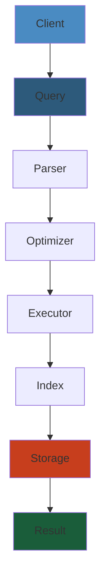
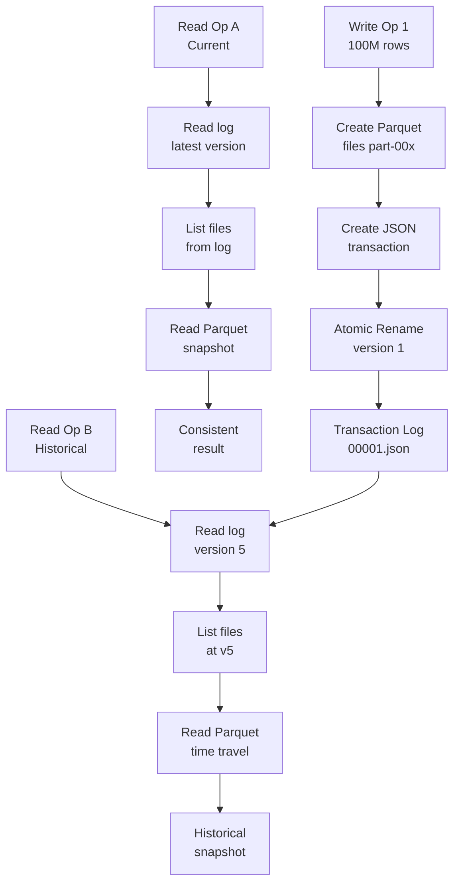
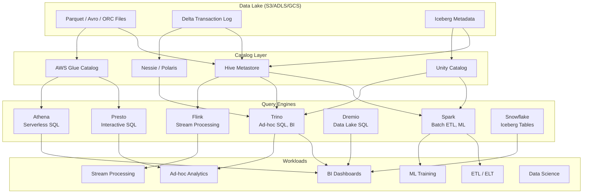

# Lakehouse Architecture




## Data Lake vs Warehouse vs Lakehouse

### Evolution

```
2000s: Data Warehouse
  +------------------+
  |   BI / Reports   |
  +------------------+
  |    SQL Engine     |
  +------------------+
  |  Proprietary      |
  |  Storage (Teradata|
  |  Oracle, Vertica) |
  |  Expensive $      |
  +------------------+

2010s: Data Lake
  +------------------+
  |   BI / ML / DS   |
  +------------------+
  |  Spark / Hive    |
  +------------------+
  |  Cheap Storage   |
  |  (S3, HDFS)      |
  |  Raw files       |
  |  (JSON, CSV,     |
  |   Parquet, Avro) |
  +------------------+

2020s: Lakehouse
  +------------------+
  |  BI / ML / DS    |
  |  + SQL + Stream  |
  +------------------+
  |  Delta / Iceberg |
  |  / Hudi          |
  |  (ACID, Time     |
  |   Travel, Schema |
  |   Enforcement)   |
  +------------------+
  |  Cheap Storage   |
  |  (S3, ADLS, GCS) |
  +------------------+
```

### Comparison Matrix

| Feature | Data Lake | Data Warehouse | Lakehouse |
|---------|-----------|---------------|-----------|
| ACID transactions | No | Yes | Yes |
| Schema enforcement | Read-time | Write-time | Write-time |
| BI tool support | Poor | Excellent | Excellent |
| ML/AI support | Excellent | Poor | Excellent |
| Storage cost | Low | High | Low |
| Compute/storage coupling | Decoupled | Tight | Decoupled |
| Time travel | No | Limited | Yes |
| Streaming | Complex | Batch only | Yes |
| Data types | Any (raw) | Structured | Any |
| Open format | Yes | No | Yes |
| Governance | Manual | Built-in | Transaction log |

### Key Insight

The lakehouse brings warehouse-grade reliability and ACID to cheap object storage by adding a **transaction log** on top of open file formats (Parquet). This gives you:

- Reliable concurrent writes (multiple writers, readers)
- Snapshot isolation (readers see consistent state)
- Time travel (query data as of any previous version)
- Schema enforcement (reject bad data at write time)

#### Step-by-Step

1. **File Storage**: Write operations create new Parquet files in object storage (S3, ADLS) which are immutable once created.
2. **Transaction Log Entry**: Each write creates a JSON file in `_delta_log/` containing metadata (files added/removed, commit timestamp, operation type).
3. **Atomic Commit**: Rename the JSON file atomically to the next version number, making the entire transaction visible instantaneously (not final write to storage).
4. **Snapshot Consistency**: Readers always read from a consistent transaction log snapshot, seeing only complete transactions, never partial writes.
5. **Time Travel**: Query engine can read from any historical transaction log version, reconstructing the table state at that point in time.
6. **Cleanup**: Older parquet files that have been removed via log entries are eventually deleted (after retention period) to save storage.

#### Code Example

```python
from pyspark.sql import SparkSession
from pyspark.sql.types import StructType, StructField, StringType, IntegerType, TimestampType
import time
from datetime import datetime

# Initialize SparkSession with Delta support
spark = SparkSession.builder \
    .appName("LakehouseExample") \
    .config("spark.sql.extensions", "io.delta.sql.DeltaSparkSessionExtension") \
    .config("spark.sql.catalog.spark_catalog", "org.apache.spark.sql.delta.catalog.DeltaCatalog") \
    .getOrCreate()

# Step 1: Create initial Parquet files in lakehouse
schema = StructType([
    StructField("user_id", IntegerType()),
    StructField("email", StringType()),
    StructField("created_at", TimestampType()),
])

data = [
    (1, "alice@example.com", datetime(2026, 1, 1)),
    (2, "bob@example.com", datetime(2026, 1, 2)),
]

df = spark.createDataFrame(data, schema=schema)

# Step 2: Write to Delta table (creates transaction log)
table_path = "s3://my-bucket/users"
df.write.format("delta").mode("overwrite").save(table_path)

# Step 3: Verify transaction log created
import os
log_path = f"{table_path}/_delta_log"
print(f"Transaction log entries created at: {log_path}")

# Step 4: Read the current version (snapshot consistent)
df_read = spark.read.format("delta").load(table_path)
print(f"Current version users: {df_read.count()}")

# Step 5: Time travel - query as of 5 minutes ago
current_time = int(time.time() * 1000)
five_min_ago = current_time - (5 * 60 * 1000)

# Would need previous writes before this works
try:
    df_past = spark.read.format("delta") \
        .option("versionAsOf", 0) \
        .load(table_path)
    print(f"Users at version 0: {df_past.count()}")
except:
    print("Version 0 only available if previous transaction exists")

# Additional write to demonstrate transaction log growth
new_data = [
    (3, "charlie@example.com", datetime(2026, 2, 1)),
]

df_new = spark.createDataFrame(new_data, schema=schema)
df_new.write.format("delta").mode("append").save(table_path)

# Step 6: Verify cleanup (optimization)
spark.sql(f"""
OPTIMIZE delta.`{table_path}`
""")

print("Lakehouse table operations complete")
spark.stop()
```

#### Real-World Scenario

At Uber, the ride events lakehouse stores 50B+ events daily. Writer 1 (mobile app events) writes events for rides, Writer 2 (backend service) writes events for ride completions. Without ACID, writes could partially overlap, corrupting the table. With Delta Lake: (1) mobile app writes 100M parquet files, (2) transaction log creates entry "add file1, file2, file3" with atomic rename, (3) backend service reads the log—sees only complete file list (no partial), (4) 3 hours later, analyst queries "SELECT * FROM rides VERSION AS OF 2 hours ago" to debug a spike. Delta log tracks all versions, analyst gets exact state from 2h prior. Meanwhile, cleanup removes obsolete parquet files from version history >30 days old to manage storage costs.

#### Diagram



## Delta Lake

### Architecture

Delta Lake by Databricks is an open-source storage layer that brings ACID transactions to Apache Spark. It uses a **transaction log** (`_delta_log`) directory alongside Parquet data files.

```
Table Directory:
  s3://data/warehouse/events/
  |
  +-- _delta_log/
  |   +-- 00000000000000000000.json    (initial commit)
  |   +-- 00000000000000000001.json    (1st add/remove)
  |   +-- 00000000000000000002.json    (2nd commit)
  |   +-- ...                          (one per transaction)
  |   +-- _last_checkpoint            (optimization for reads)
  |
  +-- part-00000-xxx.snappy.parquet    (data file v1)
  +-- part-00001-xxx.snappy.parquet
  +-- part-00002-xxx.snappy.parquet
  |
  (After OPTIMIZE, new files replace old ones:
  +-- part-00000-yyy.snappy.parquet    (compacted file)
  ...)
```

### Transaction Log

Each JSON file in the `_delta_log` directory is an **atomic commit**:

```json
// 00000000000000000001.json
{
  "commitInfo": {
    "timestamp": 1700000000000,
    "operation": "WRITE",
    "operationParameters": {"mode": "Append"},
    "isolationLevel": "Serializable"
  },
  // Files to add
  "add": {
    "path": "part-00000-xxx.snappy.parquet",
    "partitionValues": {"date": "2024-03-15"},
    "size": 268435456,
    "modificationTime": 1700000000000,
    "dataChange": true,
    "stats": "{\"numRecords\":1000000,\"minValues\":{\"id\":1},\"maxValues\":{\"id\":1000000},\"nullCount\":{\"email\":0}}"
  },
  // Files to remove (none for first write)
  "remove": {}
}
```

**Transaction log guarantees**:
- Atomic: All-or-nothing via atomic rename on object store
- Consistent: Each version is a complete snapshot of the table
- Durable: Stored on durable object storage
- Serializable: Two concurrent writers use optimistic concurrency

### ACID Properties

```
Atomicity:
  Write begins -> Write files to temp dir -> Check conditions
  -> Atomic rename _delta_log/XXXX.json
  -> Write committed (or retry on conflict)

Consistency:
  Schema enforced at write time (reject mismatched data)
  Invariants checked (NOT NULL, CHECK constraints)

Isolation:
  Read: Snapshot isolation (reader sees version N at open time)
  Write: Serializable isolation (optimistic concurrency)
  Conflicting writes: one succeeds, others retry

Durability:
  Data in S3 (11 9's durability)
  Log in S3 (same durability)
```

```python
from delta import DeltaTable, DeltaMergeBuilder

# ACID upsert (merge)
delta_table = DeltaTable.forPath(spark, "s3://data/events")

delta_table.alias("target") \
    .merge(
        updates_df.alias("source"),
        "target.event_id = source.event_id"
    ) \
    .whenMatchedUpdateAll() \
    .whenNotMatchedInsertAll() \
    .execute()
```

### Time Travel

```python
# Read latest version
df = spark.read.format("delta").load("s3://data/events")

# Read version 50
df_v50 = spark.read.format("delta") \
    .option("versionAsOf", 50) \
    .load("s3://data/events")

# Read as of timestamp
df_ts = spark.read.format("delta") \
    .option("timestampAsOf", "2024-03-15 10:00:00") \
    .load("s3://data/events")

# Restore table to version 50 (creates new commit)
delta_table.restoreToVersion(50)

# Check history
delta_table.history().show(truncate=False)
# +-------+--------+------+------------------+
# |version|operation|user  |timestamp         |
# +-------+--------+------+------------------+
# |52     |RESTORE |admin |2024-04-01 12:00  |
# |51     |WRITE   |bot   |2024-03-20 08:00  |
# |50     |WRITE   |alice |2024-03-15 10:00  |
# +-------+--------+------+------------------+
```

### Schema Enforcement

```python
# Schema on write: only allows compatible schema changes
from delta.tables import DeltaTable

df_invalid = spark.createDataFrame([
    (1, "event_a", 100.0, "extra_col"),
], schema="event_id INT, event_type STRING, value DOUBLE, extra STRING")

# This FAILS -- schema mismatch (extra column not in table)
df_invalid.write.format("delta").mode("append").save("s3://data/events")

# Schema evolution (opt-in)
df_invalid.write.format("delta") \
    .option("mergeSchema", "true") \
    .mode("append") \
    .save("s3://data/events")

# Schema validation
delta_table = DeltaTable.forPath(spark, "s3://data/events")
delta_table.schema().printTreeString()
```

### OPTIMIZE and Z-order

```python
# Compaction: merge small files into larger ones
spark.sql("OPTIMIZE delta.`s3://data/events`")

# With file size target
spark.sql("OPTIMIZE delta.`s3://data/events` WHERE date >= '2024-03-01'")

# Z-order clustering: colocate related data on disk
spark.sql("OPTIMIZE delta.`s3://data/events` ZORDER BY (user_id, event_type)")

# Auto-optimize (continuous)
spark.conf.set("spark.databricks.delta.autoCompact.enabled", "true")
spark.conf.set("spark.databricks.delta.optimizeWrite.enabled", "true")
```

**Z-order effect**:
```
Without Z-order:
  File 1: user_0..100, event_type = random
  File 2: user_101..200, event_type = random
  File 3: user_201..300, event_type = random
  Query: WHERE user_id = 42 -> scans all files

With Z-order (clustered by user_id):
  File 1: user_0..50
  File 2: user_51..100
  File 3: user_101..150
  Query: WHERE user_id = 42 -> scans only File 1

With Z-order (clustered by user_id, event_type):
  Data is reorganized so similar values are in same files
  Query on user_id or event_type reduces scan significantly
```

### Vacuum

```python
# Remove old files no longer referenced by any version
# Default retention: 7 days (must be > 168h for safety)
delta_table.vacuum(retentionHours=168)

# Dry run to see what would be deleted
delta_table.vacuum(retentionHours=168, dryRun=True)
```

**Vacuum considerations**:
- Only removes files older than `retentionHours`
- Cannot time travel past vacuum-retained versions
- Default 7 days protects against long-running queries
- Vacuum is NOT transactional with concurrent reads

### Production Operations for Delta Lake

```python
class DeltaLakeOperations:
    """Production operations for Delta Lake tables."""

    def __init__(self, spark, table_path: str):
        self.spark = spark
        self.table_path = table_path
        self.delta_table = DeltaTable.forPath(spark, table_path)

    def optimize_table(self, zorder_cols: list[str] = None,
                        file_size_target: str = "256mb") -> dict:
        """Run OPTIMIZE with optional Z-ordering."""
        if zorder_cols:
            result = self.spark.sql(
                f"OPTIMIZE delta.`{self.table_path}` "
                f"ZORDER BY ({', '.join(zorder_cols)})"
            )
        else:
            result = self.spark.sql(
                f"OPTIMIZE delta.`{self.table_path}`"
            )
        return result.toPandas().to_dict() if result else {"status": "completed"}

    def compact(self, target_file_size_mb: int = 256) -> dict:
        """Auto-compact small files."""
        self.spark.conf.set("spark.databricks.delta.autoCompact.enabled", "true")
        self.spark.conf.set("spark.databricks.delta.autoCompact.maxFileSize",
                            f"{target_file_size_mb * 1024 * 1024}")
        return {"target_file_size_mb": target_file_size_mb, "compact_enabled": True}

    def vacuum(self, retention_hours: int = 168, dry_run: bool = True) -> dict:
        """Remove old files safely."""
        result = self.delta_table.vacuum(retentionHours=retention_hours, dryRun=dry_run)
        files_to_delete = [row["path"] for row in result.collect()] if result else []
        return {
            "files_to_delete": len(files_to_delete),
            "retention_hours": retention_hours,
            "dry_run": dry_run,
            "status": "dry_run" if dry_run else "deleted"
        }

    def restore_to_version(self, version: int) -> dict:
        """Time-travel restore."""
        try:
            self.delta_table.restoreToVersion(version)
            return {"status": "restored", "version": version}
        except Exception as e:
            return {"status": "failed", "error": str(e)}

    def describe_history(self) -> list[dict]:
        """Get table operation history."""
        return self.delta_table.history().collect()

    def get_metrics(self) -> dict:
        """Get Delta table metrics."""
        history = self.describe_history()
        return {
            "total_versions": len(history),
            "last_operation": history[0]["operation"] if history else "N/A",
            "last_modified": str(history[0]["timestamp"]) if history else "N/A",
            "total_commits": len([h for h in history if h["operation"] == "WRITE"]),
            "optimize_count": len([h for h in history if h["operation"] == "OPTIMIZE"]),
        }

    def clone_table(self, target_path: str, version: int = None) -> dict:
        """Create shallow/deep clone for testing."""
        if version:
            self.spark.sql(
                f"CREATE OR REPLACE TABLE delta.`{target_path}` "
                f"SHALLOW CLONE delta.`{self.table_path}` VERSION AS OF {version}"
            )
        else:
            self.spark.sql(
                f"CREATE OR REPLACE TABLE delta.`{target_path}` "
                f"SHALLOW CLONE delta.`{self.table_path}`"
            )
        return {"source": self.table_path, "clone": target_path, "type": "shallow"}
```

### Schema Evolution Patterns

```python
class SchemaEvolution:
    """Handle schema changes across time."""

    @staticmethod
    def evolve_delta(spark, table_path: str, new_columns: dict,
                      evolution_mode: str = "add") -> dict:
        """Safely evolve Delta Lake schema."""
        evolution_map = {
            "add": f"""
                ALTER TABLE delta.`{table_path}`
                ADD COLUMNS ({', '.join(f'{k} {v}' for k, v in new_columns.items())})
            """,
            "rename": f"""
                ALTER TABLE delta.`{table_path}`
                RENAME COLUMN {list(new_columns.keys())[0]}
                TO {list(new_columns.values())[0]}
            """,
            "drop": f"""
                ALTER TABLE delta.`{table_path}`
                DROP COLUMN {list(new_columns.keys())[0]}
            """,
            "change_type": f"""
                ALTER TABLE delta.`{table_path}`
                CHANGE COLUMN {list(new_columns.keys())[0]}
                TYPE {list(new_columns.values())[0]}
            """
        }

        sql = evolution_map.get(evolution_mode)
        if sql:
            spark.sql(sql)
            return {"mode": evolution_mode, "status": "applied"}

        # For complex evolutions, use mergeSchema
        if evolution_mode == "merge":
            spark.conf.set("spark.databricks.delta.schema.autoMerge.enabled", "true")
            return {"mode": "auto_merge", "status": "enabled"}
        return {"error": f"Unknown evolution mode: {evolution_mode}"}

    @staticmethod
    def evolve_iceberg(spark, catalog: str, table: str,
                        new_columns: dict) -> dict:
        """Safely evolve Iceberg schema."""
        for col_name, col_type in new_columns.items():
            spark.sql(f"""
                ALTER TABLE {catalog}.{table}
                ADD COLUMN {col_name} {col_type}
            """)
        spark.sql(f"""
            ALTER TABLE {catalog}.{table}
            SET TBLPROPERTIES ('write.schema-evolution-mode' = 'merge')
        """)
        return {"status": "evolved", "new_columns": list(new_columns.keys())}

    @staticmethod
    def backward_compatible_check(old_schema: set, new_schema: set) -> dict:
        """Check if schema change is backward compatible."""
        removed = old_schema - new_schema
        if removed:
            return {
                "compatible": False,
                "reason": f"Columns removed: {removed}. "
                          f"Removing columns may break downstream queries."
            }

        # Adding columns is always backward compatible
        added = new_schema - old_schema
        if added:
            return {
                "compatible": True,
                "warning": f"New columns {added} will be NULL for old data."
            }

        return {"compatible": True}

    @staticmethod
    def versioned_schema_migration(spark, table_path: str,
                                     migrations: list[dict]) -> list[dict]:
        """Apply versioned schema migrations (like Alembic for data)."""
        results = []
        for migration in migrations:
            version = migration["version"]
            sql = migration["sql"]
            try:
                spark.sql(sql)
                results.append({
                    "version": version,
                    "status": "applied",
                    "sql": sql[:80] + "..."
                })
            except Exception as e:
                results.append({
                    "version": version,
                    "status": "failed",
                    "error": str(e)
                })
                break
        return results


# Schema evolution compatibility matrix
SCHEMA_COMPATIBILITY = {
    "add_column": {
        "delta": True,
        "iceberg": True,
        "hudi": True,
        "backward_compatible": True,
        "forward_compatible": True
    },
    "drop_column": {
        "delta": True,
        "iceberg": True,
        "hudi": True,
        "backward_compatible": False,
        "forward_compatible": True
    },
    "rename_column": {
        "delta": True,
        "iceberg": True,
        "hudi": True,
        "backward_compatible": False,
        "forward_compatible": False
    },
    "change_type": {
        "delta": "limited (widening only)",
        "iceberg": True,
        "hudi": True,
        "backward_compatible": "depends on change",
        "forward_compatible": "depends on change"
    },
    "reorder_columns": {
        "delta": True,
        "iceberg": True,
        "hudi": False,
        "backward_compatible": True,
        "forward_compatible": True
    }
}
```

### Partition Evolution

```python
class PartitionManagement:
    """Manage partition schemes across lakehouse formats."""

    @staticmethod
    def evolve_iceberg_partitions(spark, catalog: str, table: str,
                                    new_partition_spec: str) -> dict:
        """Iceberg supports partition evolution without rewrite."""
        spark.sql(f"""
            ALTER TABLE {catalog}.{table}
            SET PARTITION SPEC ({new_partition_spec})
        """)
        return {
            "format": "iceberg",
            "table": f"{catalog}.{table}",
            "new_spec": new_partition_spec,
            "note": "Old data retains old partition scheme. "
                    "Queries automatically read both."
        }

    @staticmethod
    def delta_requires_rewrite(spark, table_path: str,
                                new_partition_cols: list[str]) -> dict:
        """Delta requires full rewrite to change partitioning."""
        return {
            "format": "delta",
            "required_steps": [
                f"1. Read current data: df = spark.read.format('delta').load('{table_path}')",
                f"2. Drop existing table or write to new path",
                f"3. Write with new partition: "
                f"df.write.format('delta').partitionBy({new_partition_cols}).save('{table_path}_v2')",
                f"4. Migrate applications to new path"
            ],
            "warning": "Partition evolution requires full data rewrite in Delta. "
                       "Plan for downtime or use dual-writes during migration."
        }

    @staticmethod
    def add_partition_to_hudi(spark, table_path: str,
                               new_partition_col: str) -> dict:
        """Add new partition column to Hudi table."""
        return {
            "format": "hudi",
            "strategy": "Write data with new partition column. Hudi automatically "
                       "creates new partition directories.",
            "old_data": "Remains in existing partition structure."
        }

    @staticmethod
    def hidden_partitioning_example(spark) -> str:
        """Iceberg hidden partitioning — partition transforms applied automatically."""
        queries = """
-- Create table with hidden partitioning
CREATE TABLE events (
    event_id BIGINT,
    event_ts TIMESTAMP,
    amount DOUBLE,
    user_id STRING
)
USING iceberg
PARTITIONED BY (days(event_ts), bucket(16, user_id))

-- Query without mentioning partition column
-- Iceberg automatically prunes to matching partitions
SELECT count(*), days(event_ts) as day
FROM events
WHERE event_ts >= '2024-01-01'
  AND event_ts < '2024-02-01'
GROUP BY days(event_ts)

-- No need to know partition scheme — Iceberg handles it
"""
        return queries

    @staticmethod
    def recommend_partition_strategy(data_volume_gb: float,
                                       query_patterns: list[str]) -> dict:
        """Recommend partition strategy based on data and query patterns."""
        recommendations = []
        if data_volume_gb > 1000:
            recommendations.append("Daily partitioning (dates) + bucketing")

        if any("time_range" in q for q in query_patterns):
            recommendations.append("Partition by date/hour column")
        if any("dimension_filter" in q for q in query_patterns):
            recommendations.append("Consider Z-order or secondary partition")

        return {
            "data_volume_gb": data_volume_gb,
            "recommendations": recommendations,
            "iceberg_hidden_partitioning": "Recommended for multi-engine access",
            "delta_zorder": "Best for single-engine (Databricks/Spark)"
        }
```

### Table Maintenance and Optimization

```python
class TableMaintenance:
    """Routine maintenance operations for lakehouse tables."""

    def __init__(self, spark, table_format: str = "delta"):
        self.spark = spark
        self.format = table_format

    def run_maintenance(self, table_path: str, operations: list[str] = None) -> dict:
        """Run standard maintenance operations."""
        if not operations:
            operations = ["optimize", "vacuum", "expire_snapshots",
                         "remove_orphans", "analyze"]

        results = {}
        for op in operations:
            method = getattr(self, op, None)
            if method:
                try:
                    results[op] = method(table_path)
                except Exception as e:
                    results[op] = {"status": "failed", "error": str(e)}
        return results

    def optimize(self, table_path: str) -> dict:
        if self.format == "delta":
            self.spark.sql(f"OPTIMIZE delta.`{table_path}`")
        elif self.format == "iceberg":
            self.spark.sql(
                f"CALL spark_catalog.system.rewrite_data_files("
                f"table => '{table_path}', strategy => 'sort', "
                f"sort_order => 'ts DESC')"
            )
        return {"operation": "optimize", "table": table_path}

    def vacuum(self, table_path: str, hours: int = 168) -> dict:
        if self.format == "delta":
            DeltaTable.forPath(self.spark, table_path).vacuum(hours)
        return {"operation": "vacuum", "retention_hours": hours}

    def expire_snapshots(self, table_path: str, older_than_days: int = 7) -> dict:
        if self.format == "iceberg":
            cutoff = f"TIMESTAMP '{datetime.now() - timedelta(days=older_than_days)}'"
            self.spark.sql(
                f"CALL spark_catalog.system.expire_snapshots("
                f"table => '{table_path}', older_than => {cutoff})"
            )
        return {"operation": "expire_snapshots", "retention_days": older_than_days}

    def remove_orphans(self, table_path: str) -> dict:
        if self.format == "iceberg":
            self.spark.sql(
                f"CALL spark_catalog.system.remove_orphan_files("
                f"table => '{table_path}')"
            )
        return {"operation": "remove_orphans"}

    def analyze(self, table_path: str) -> dict:
        """Compute table statistics for query optimization."""
        if self.format == "delta":
            self.spark.sql(f"ANALYZE TABLE delta.`{table_path}` COMPUTE STATISTICS")
        elif self.format == "iceberg":
            self.spark.sql(f"ANALYZE TABLE {table_path} COMPUTE STATISTICS")
        return {"operation": "analyze", "status": "completed"}

    def auto_maintenance_schedule(self, table_path: str,
                                    frequency: str = "daily") -> dict:
        """Suggested maintenance schedule."""
        schedules = {
            "daily": ["optimize", "analyze"],
            "weekly": ["optimize", "vacuum", "analyze"],
            "monthly": ["optimize", "vacuum", "expire_snapshots",
                       "remove_orphans", "analyze"]
        }
        return {
            "table": table_path,
            "frequency": frequency,
            "operations": schedules.get(frequency, schedules["daily"]),
            "best_practices": [
                "Run OPTIMIZE after large writes",
                "VACUUM with 7-day retention (minimum 168 hours)",
                "Expire Iceberg snapshots older than 7 days",
                "ANALYZE table after major data changes",
                "Run maintenance during low-traffic periods"
            ]
        }
```

## Apache Iceberg

### Architecture

Apache Iceberg is a table format designed for large analytic datasets. It introduces a **three-level metadata hierarchy**:

```
Catalog (Hive Metastore / AWS Glue / Nessie)
  |
  +-- Table: my_db.events
       |
       +-- Metadata Layer
       |   |
       |   +-- v1.metadata.json
       |   |    (current version pointer)
       |   |    +-- Schema, partition spec, sort order
       |   |    +-- Snapshot list (0, 1, 2, ...)
       |   |    +-- Location: root path
       |   |
       |   +-- snap-00000001-xxx.avro
       |   |    (Snapshot: list of manifest files)
       |   |
       |   +-- snap-00000002-yyy.avro
       |        (Snapshot: list of manifest files)
       |
       +-- Manifest Layer
       |   |
       |   +-- manifest-aaa.avro
       |   |    (List of data files + column stats)
       |   |    +-- part-00000.parquet, min_id=1, max_id=1000
       |   |    +-- part-00001.parquet, min_id=1001, max_id=2000
       |   |
       |   +-- manifest-bbb.avro (newer version)
       |
       +-- Data Layer (Parquet / Avro / ORC)
           |
           +-- data/date=2024-03-15/
           |   +-- part-00000.parquet
           |   +-- part-00001.parquet
           |
           +-- data/date=2024-03-16/
               +-- part-00000.parquet
```

### Table Format

```sql
-- Create Iceberg table
CREATE TABLE events (
    event_id BIGINT,
    user_id STRING,
    event_type STRING,
    amount DOUBLE,
    ts TIMESTAMP
)
USING iceberg
PARTITIONED BY (days(ts))  -- Hidden partitioning
LOCATION 's3://data/iceberg/events';

-- Write data
INSERT INTO events VALUES (1, 'alice', 'purchase', 29.99, TIMESTAMP '2024-03-15 10:00:00');

-- Snapshot isolation query
SELECT count(*) FROM events FOR SYSTEM_VERSION AS OF 1;
SELECT count(*) FROM events FOR SYSTEM_TIME AS OF '2024-03-15 12:00:00';
```

### Manifest Files

Manifests are Avro files listing data files with column statistics:

```
Manifest Entry:
  - File path: s3://data/warehouse/events/part-00000.parquet
  - File format: PARQUET
  - Partition data: days(ts)=2024-03-15
  - Record count: 1,000,000
  - File size: 256 MB
  - Column statistics:
    event_id: min=1, max=1000000, null_count=0
    user_id: min_size=4, max_size=20, null_count=5
    amount: min=0.99, max=999.99, null_count=50
    ts: min=2024-01-01, max=2024-03-15, null_count=0
```

### Partitioning Evolution

Iceberg supports **partition evolution** — changing the partition scheme without rewriting data:

```sql
-- Table initially partitioned by days(ts)
ALTER TABLE events SET PARTITION SPEC (
    days(ts), bucket(16, user_id)
);
-- Old data: only days(ts) partitions
-- New data: days(ts) + bucket(user_id) partitions
-- Queries: read both partition specs transparently
```

### Hidden Partitioning

Iceberg automatically computes partition values from data:

```sql
-- No need to specify partition column in WHERE clause
-- Iceberg knows that ts = '2024-03-15' maps to partition days(ts)=2024-03-15

SELECT * FROM events WHERE ts >= '2024-03-15' AND ts < '2024-03-16'
-- Automatically prunes to partition days(ts)=2024-03-15

-- Vs traditional Hive partitioning (user must specify partition column):
SELECT * FROM hive_events WHERE event_date = '2024-03-15'  -- Must know partition column
```

### Snapshot Isolation

Iceberg uses **serializable snapshot isolation**:

```
Writer 1: Start transaction (snapshot N)
  -> Write new data files
  -> Create manifest listing new files
  -> Create snapshot N+1 pointing to new manifests
  -> Commit: atomic swap of current snapshot pointer

Writer 2: Start transaction (snapshot N, concurrent with Writer 1)
  -> Same process
  -> Commit attempt fails (snapshot pointer changed)
  -> Retry: read new snapshot N+1, re-apply conflict detection
```

**Concurrency model**:
- Optimistic concurrency (no locks)
- Retry on conflict (max 4 retries by default)
- Catalog-level atomic compare-and-swap (HMS notification, DynamoDB lock)

### Iceberg in Practice

```python
# Spark SQL with Iceberg
spark.sql("""
    MERGE INTO events AS t
    USING updates AS s
    ON t.event_id = s.event_id
    WHEN MATCHED THEN UPDATE SET *
    WHEN NOT MATCHED THEN INSERT *
""")

# Compaction via Spark
spark.sql("CALL spark_catalog.system.rewrite_data_files('db.events')")

# Expire old snapshots
spark.sql("CALL spark_catalog.system.expire_snapshots('db.events', TIMESTAMP '2024-01-01')")

# Remove orphan files
spark.sql("CALL spark_catalog.system.remove_orphan_files('db.events')")
```

## Apache Hudi

### Architecture

Apache Hudi (Hadoop Upserts Deletes and Incrementals) is designed for incremental data processing and streaming ingestion.

### Copy-on-Write (COW)

```
Write: Merge input with existing file group
  Input: rows to update/insert

  File Group:
    v1 (base): part-00000.parquet (id range 1-1000)

  Step 1: Read v1 file
  Step 2: Merge input records into file
  Step 3: Write new v2 base file (v1 + changes)
  Step 4: Mark v1 as deleted, v2 as active

Reads: Read v2 directly (single file) -- fast reads
Writes: Full file rewrite -- expensive for small upserts
```

### Merge-on-Read (MOR)

```
Write: Append delta to separate log files
  File Group:
    v1 (base): part-00000.parquet (id range 1-1000)

  Insert: write to new log file
    +-- .log.1 (delta: inserts 1001-1050)

  Update: write to delta log
    +-- .log.1 (delta: updates to id 100-200)

Reads:
  Snapshot read: merge base + delta (slower, but always fresh)
  Read-optimized: read base only (fast, stale data)
  Incremental read: read only delta logs since last commit

Compaction (async):
  Merge base + delta files into new base file
  v2 (base): part-00000.parquet (merged)
  Delete log files
```

### Incremental Queries

```python
# Hudi incremental query (process only changed rows)
incremental_df = spark.read \
    .format("hudi") \
    .option("hoodie.datasource.query.type", "incremental") \
    .option("hoodie.datasource.read.begin.instanttime", "20240315000000") \
    .option("hoodie.datasource.read.end.instanttime", "20240316000000") \
    .load("s3://data/hudi/events")

# Stream from Hudi (continual processing)
streaming_df = spark.readStream \
    .format("hudi") \
    .option("hoodie.datasource.query.type", "streaming") \
    .option("hoodie.datasource.streaming.enable", "true") \
    .load("s3://data/hudi/events")
```

### Clustering

```python
# Hudi clustering reorganizes data for query efficiency
spark.sql("CALL run_clustering(table => 'hudi_events', order => 'user_id')")

# Configuration
spark.conf.set("hoodie.clustering.inline", "true")  # Inline with writes
spark.conf.set("hoodie.clustering.inline.max.commits", "4")  # Every 4 commits
spark.conf.set("hoodie.clustering.plan.strategy.target.file.max.bytes", "268435456")
spark.conf.set("hoodie.clustering.plan.strategy.sort.columns", "user_id")
```

### MOR Compaction

```python
# Inline compaction (immediate)
spark.conf.set("hoodie.compact.inline", "true")
spark.conf.set("hoodie.compact.inline.max.delta.commits", "5")  # After 5 delta commits

# Async compaction (separate Spark job)
spark-submit --class org.apache.hudi.utilities.HoodieCompactor \
    --table-type MERGE_ON_READ \
    --base-path s3://data/hudi/events

# Delta commits threshold (trigger compaction)
spark.conf.set("hoodie.compaction.delta.commits", "10")
spark.conf.set("hoodie.compaction.delta.seconds", "3600")
```

## Comparison: Delta vs Iceberg vs Hudi

### Feature Matrix

| Feature | Delta Lake | Apache Iceberg | Apache Hudi |
|---------|-----------|----------------|-------------|
| Origin | Databricks | Netflix/Expedia | Uber |
| Format | Parquet + JSON log | Parquet/Avro/ORC + Avro manifests | Parquet/Avro + HFile logs |
| Open source | Yes (Linux Foundation) | Yes (Apache) | Yes (Apache) |
| ACID isolation | Serializable | Serializable | Snapshot |
| Time travel | Yes (version/timestamp) | Yes (version/timestamp) | Yes (via commits) |
| Schema evolution | Add/drop/rename/comment | Add/drop/rename/reorder | Add/drop/rename |
| Partition evolution | No (rewrite required) | Yes | No |
| Hidden partitioning | No | Yes | No |
| Merge/Upsert | MERGE SQL | MERGE SQL | Write API + SQL |
| Incremental queries | Change Data Feed | Incremental read | Native incremental |
| Streaming ingest | Auto-compact | Rewrite data files | COW/MOR + compaction |
| Clustering/Z-order | Z-order | Sort-order + rewrite | Clustering |
| Catalog | Hive, AWS Glue, custom | Hive, Glue, Nessie, REST | Hive, Glue |
| Query engines | Spark, Trino, Flink, Presto | Spark, Trino, Flink, Presto, Dremio | Spark, Trino, Flink, Presto |
| Performance (reads) | Good | Excellent (manifest pruning) | Good |
| Performance (writes) | Good | Good | Excellent (MOR) |

### Decision Guide

```
Use Delta Lake when:
  - You're in a Databricks/Spark-centric ecosystem
  - You need simple, production-tested ACID
  - Z-order clustering fits your query patterns
  - You want auto-optimize for streaming ingestion
  - You need Unity Catalog integration

Use Apache Iceberg when:
  - You need multi-engine support (Trino, Spark, Flink, Dremio)
  - Partition evolution is important (changing partition schemes)
  - Hidden partitioning simplifies queries
  - REST catalog gives you Git-like branching (Nessie)
  - You want the best read performance via manifest pruning
  - You're building a truly open lakehouse

Use Apache Hudi when:
  - Streaming/batch ingestion with upserts is your primary pattern
  - MOR helps balance write speed with read consistency
  - You need native incremental queries (CDC pipelines)
  - Clustering for query performance
  - You're at Uber-scale with high-frequency updates

Migration paths:
  - Parquet tables -> Delta Lake (add _delta_log)
  - Hive tables -> Iceberg (migrate with spark.sql.catalog)
  - Hive tables -> Hudi (hoodie.datasource.write.operation)
```

## Multi-Engine Architecture

### Architecture Pattern

Modern lakehouses are designed for **multi-engine access** — different engines for different workloads on the same data:



### Engine Selection by Workload

| Engine | Best For | Format Support | Concurrency | Latency |
|--------|----------|---------------|-------------|---------|
| Spark SQL | ETL, complex transforms, ML | Delta, Iceberg, Hudi | Low | Minutes |
| Trino | Interactive SQL, BI dashboards | Delta, Iceberg, Hudi | High | Seconds |
| Flink SQL | Stream processing, CDC | Delta, Iceberg, Hudi | Medium | Milliseconds |
| Presto | SQL analytics, ad-hoc | Iceberg, Hudi | High | Seconds |
| Dremio | Data lake SQL, reflections | Delta, Iceberg, Hudi | High | Seconds |
| Athena | Serverless queries | Delta (through Glue), Iceberg | High | Seconds |
| Snowflake | Iceberg tables, warehouse | Iceberg | High | Seconds |

### Concurrent Engine Access Patterns

```python
class MultiEngineCoordinator:
    """Coordinate multiple engines accessing the same lakehouse tables."""

    def __init__(self, catalog_type: str = "hive"):
        self.catalog_type = catalog_type
        self.active_engines = set()

    def register_engine(self, engine_name: str, format: str):
        self.active_engines.add((engine_name, format))
        return self._get_compatibility(engine_name, format)

    def _get_compatibility(self, engine: str, format: str) -> dict:
        compatibility_matrix = {
            ("spark", "delta"): "native",
            ("spark", "iceberg"): "native",
            ("trino", "delta"): "connector",
            ("trino", "iceberg"): "native",
            ("flink", "delta"): "connector",
            ("flink", "iceberg"): "native",
            ("athena", "iceberg"): "native",
            ("athena", "delta"): "glue_catalog",
            ("snowflake", "iceberg"): "native",
        }
        return {
            "engine": engine,
            "format": format,
            "integration": compatibility_matrix.get((engine, format), "limited"),
            "concurrent_access": self._check_concurrent_access(engine, format)
        }

    def _check_concurrent_access(self, engine: str, format: str) -> dict:
        """Check if multiple engines can write to the same table concurrently."""
        if format == "delta":
            return {
                "supported": True,
                "mechanism": "Optimistic concurrency via transaction log",
                "warning": "Concurrent writes across different engines may have "
                          "compatibility issues. Prefer Spark + Trino (read-only)"
            }
        elif format == "iceberg":
            return {
                "supported": True,
                "mechanism": "Serializable snapshot isolation via catalog",
                "warning": "Use REST/Nessie catalog for cross-engine write support"
            }
        return {"supported": False}

    def recommend_setup(self, workloads: list[str]) -> dict:
        """Recommend engine + catalog setup based on workloads."""
        has_etl = "etl" in workloads
        has_bi = "bi" in workloads
        has_streaming = "streaming" in workloads
        has_ml = "ml" in workloads

        engines = ["spark"]
        if has_bi:
            engines.append("trino")
        if has_streaming:
            engines.append("flink")

        catalog = "nessie" if len(engines) > 2 else "hive"

        return {
            "recommended_engines": engines,
            "table_format": "iceberg",
            "catalog": catalog,
            "setup_notes": [
                f"Use Iceberg format for multi-engine compatibility",
                f"Deploy {catalog} catalog for cross-engine metadata",
                f"Use Trino for BI queries to avoid Spark contention",
                f"Set up Trino's delta-lake connector if Delta format required"
            ]
        }


# Multi-engine SQL examples
MULTI_ENGINE_EXAMPLES = """
-- Spark: Complex ETL
INSERT INTO db.events
SELECT user_id, event_type, count(*) as event_count
FROM db.raw_events
GROUP BY user_id, event_type;

-- Trino: BI Dashboard (same table)
SELECT event_type, count(*), avg(event_count)
FROM db.events
WHERE ds BETWEEN '2024-01-01' AND '2024-01-31'
GROUP BY event_type;

-- Flink: Stream enrichment (same table)
INSERT INTO db.events
SELECT user_id, event_type, 1 as event_count
FROM kafka_stream;

-- All three engines read/write the same Iceberg table
-- via the same catalog with snapshot isolation
"""
```

## Query Engines

### Trino

Trino (formerly Presto SQL) is a distributed SQL query engine designed for large-scale analytics.

```sql
-- Connect to Iceberg table via Trino
SELECT COUNT(*), event_type
FROM iceberg.db.events
WHERE ts >= TIMESTAMP '2024-03-01'
GROUP BY event_type;

-- Trino connector config (etc/catalog/iceberg.properties)
-- connector.name=iceberg
-- iceberg.catalog.type=hive
-- hive.metastore.uri=thrift://metastore:9083
```

**Connector matrix**:

| Engine | Delta | Iceberg | Hudi | Hive |
|--------|-------|---------|------|------|
| Trino | Yes (delta-lake connector) | Yes (iceberg connector) | Yes (hudi connector) | Yes |
| Presto | Limited | Yes | Yes | Yes |
| Spark SQL | Native | Native | Native | Native |
| Athena | Yes (through Glue) | Yes (Glue catalog) | Limited | Yes |
| Snowflake | Yes (UniCatalog) | Yes (Iceberg tables) | No | No |
| Dremio | Yes | Yes | Yes | Yes |

### Performance Considerations

```sql
-- Trino: pushdown projections and predicates
EXPLAIN (TYPE DISTRIBUTED)
SELECT event_type, count(*)
FROM events
WHERE ts >= DATE '2024-03-01'
  AND amount > 100
GROUP BY event_type;
-- Output shows:
--   - Predicate pushdown: ts >= 2024-03-01 AND amount > 100
--   - Projection pushdown: event_type only
--   - Partition pruning: only scans date >= 2024-03-01 directories
```

## Catalog

### Hive Metastore

The traditional catalog for Hive/Spark tables:

```
Spark/Trino/Flink --> Hive Metastore (HMS)
                       |
                       +-- Database --> Table --> Partition
                       |
                       +-- Thrift API (port 9083)
                       |
                       +-- Backend (MySQL/Postgres)
                       |
                       +-- Stores: schema, partition metadata, location
```

### AWS Glue Catalog

Serverless catalog on AWS:

```
AWS Glue Catalog:
  - REST API (replace Hive Metastore)
  - Integrated with Athena, Redshift Spectrum, EMR
  - Crawlers to auto-discover schema
  - Fine-grained permissions (Lake Formation)
  - Serverless (no infrastructure to manage)

Configuration:
  spark.conf.set("spark.sql.catalog.glue", "org.apache.iceberg.spark.SparkCatalog")
  spark.conf.set("spark.sql.catalog.glue.catalog-impl", "org.apache.iceberg.aws.glue.GlueCatalog")
  spark.conf.set("spark.sql.catalog.glue.io-impl", "org.apache.iceberg.aws.s3.S3FileIO")
```

### Nessie (Catalog with Git-like Branching)

Nessie brings Git semantics to data lakes:

```
Nessie Catalog:
  Branch: main
    |
    +-- Commit: Table events v1
    +-- Commit: Table events v2 (add column)
    +-- Commit: Table users v1 (new table)
    |
  Branch: dev (from main@v2)
    |
    +-- Commit: Rewrite events partition scheme
    |
  Branch: feature-experiment (from dev@v3)
    |
    +-- Commit: Add experimental columns
    |
  Tag: release-2024.03
    |
    +-- Points to main@v3
```

```sql
-- Trino with Nessie catalog
SELECT * FROM nessie.events.main;            -- Main branch
SELECT * FROM nessie.events.dev;             -- Dev branch
SELECT count(*) FROM nessie.events.main;     -- Current production

-- Nessie operations
CREATE BRANCH dev IN nessie FROM main;
MERGE dev INTO main IN nessie;
```

**Nessie benefits**:
- Isolated experimentation (branch before schema changes)
- Reproducible queries (query by commit hash)
- Zero-copy branching (metadata only, not data)
- CI/CD for data (PR → merge to main)

## Interview Questions

1. **What's the difference between Delta Lake's transaction log and Iceberg's metadata layer?**
   - Delta: JSON-based transaction log in `_delta_log/` directory, each file is a commit
   - Iceberg: Three-layer hierarchy (metadata → manifests → data files), Avro-based manifests
   - Delta's log is simpler and easier to inspect; Iceberg's manifest structure enables better partition pruning and multi-engine support

2. **How does time travel work in Delta vs Iceberg?**
   - Delta: Each JSON commit is a version; readers see the table state at the time of opening the transaction log
   - Iceberg: Each snapshot is a pointer to a manifest list; atomic swap of current snapshot in catalog
   - Both support version-based and timestamp-based queries
   - Vacuum/expire_snapshots removes old versions

3. **Explain the trade-offs between Delta, Iceberg, and Hudi for a new lakehouse?**
   - Delta: Best for Databricks/Spark-centric teams, simpler to operate, Z-order clustering
   - Iceberg: Best for multi-engine access (Trino, Flink, Spark), partition evolution, hidden partitioning
   - Hudi: Best for streaming ingestion with upserts, MOR for write-heavy workloads
   - Decision factors: engine ecosystem, partition requirements, update patterns

4. **How does manifest-based pruning in Iceberg improve query performance?**
   - Manifests store min/max statistics for each data file's columns
   - Queries with WHERE clauses eliminate entire manifest entries (files) without reading them
   - This reduces scan to only relevant files, unlike Hive partitioning which requires directory listing
   - Result: faster queries, especially on high-cardinality columns

5. **What happens during a Delta Lake OPTIMIZE operation?**
   - Small files are compacted into larger files (default target: 256MB)
   - Z-order: data is reorganized so similar values colocate in the same files
   - Old files are marked for removal (new JSON commit)
   - Optimize is idempotent and can be run on table subsets with WHERE clause
   - Auto-optimize can run continuously for streaming ingestion

6. **Design a multi-engine lakehouse architecture with Spark, Trino, and Flink?**
   - Choose Iceberg as the table format (best multi-engine support)
   - Use REST/Nessie catalog for unified metadata across engines
   - Deploy Trino for BI/analytics queries (high concurrency)
   - Use Spark for ETL and ML training
   - Use Flink for streaming ingestion
   - All engines read/write the same Iceberg tables via the catalog
   - Snapshot isolation prevents conflicts between batch and streaming writes

7. **How do you handle schema evolution across multiple consumers?**
   - Adding columns: safe (backward compatible, old data gets NULL)
   - Removing columns: dangerous for downstream consumers
   - Renaming columns: break consumers using old name
   - Best practice: add-only evolution with explicit deprecation periods
   - Use schema registry for consumer notification
   - Iceberg's hidden partitioning reduces need for partition schema changes

---

## Interactive Components

```html-live
<div style="display:flex;flex-direction:column;align-items:center;gap:8px;padding:16px;background:#0b0e14;border:1px solid #1e2a3a;border-radius:8px">
  <style>@keyframes flow-pulse{0%,100%{opacity:.3;transform:translateY(0)}50%{opacity:1;transform:translateY(-2px)}}.flow-title{color:#00d4ff;font-family:monospace;font-size:14px;font-weight:bold;margin-bottom:8px}.flow-node{display:inline-block;padding:8px 16px;border-radius:4px;font-size:12px;font-family:monospace;color:#e3eaf0;background:#1e3a5f;border:1px solid #00d4ff}.flow-arrow{color:#00d4ff;font-size:16px;animation:flow-pulse 1.5s infinite}</style>
  <div class="flow-title">Lakehouse Data Flow: Sources → Ingestion → Serving</div>
  <div style="display:flex;flex-direction:column;align-items:center;gap:6px">
    <div class="flow-node">Data Sources</div>
    <div class="flow-arrow">↓</div>
    <div class="flow-node">Iceberg/Delta Lake</div>
    <div class="flow-arrow">↓</div>
    <div class="flow-node">Schema & Metadata</div>
    <div class="flow-arrow">↓</div>
    <div class="flow-node">SQL Queries</div>
    <div class="flow-arrow">↓</div>
    <div class="flow-node">Analytics & ML</div>
  </div>
</div>
```

```html-live
<div style="padding:16px;background:#0b0e14;border:1px solid #1e2a3a;border-radius:8px">
  <style>.obs-title{color:#00d4ff;font-family:monospace;font-size:14px;font-weight:bold;margin-bottom:16px}.obs-grid{display:grid;grid-template-columns:repeat(auto-fit, minmax(150px, 1fr));gap:12px}.obs-card{padding:12px;background:#1a2332;border:1px solid #1e3a5f;border-radius:4px;display:flex;flex-direction:column;align-items:center}.obs-label{color:#a3aab8;font-family:monospace;font-size:11px;text-transform:uppercase;margin-bottom:8px}.obs-value{font-family:monospace;font-size:20px;font-weight:bold;color:#34d399}.obs-unit{color:#a3aab8;font-family:monospace;font-size:10px}</style>
  <div class="obs-title">Lakehouse Query Performance</div>
  <div class="obs-grid">
    <div class="obs-card"><div class="obs-label">Table Count</div><div class="obs-value">847</div><div class="obs-unit">tables</div></div>
    <div class="obs-card"><div class="obs-label">Query Latency</div><div class="obs-value">2.1</div><div class="obs-unit">sec</div></div>
    <div class="obs-card"><div class="obs-label">Storage Used</div><div class="obs-value">2.3</div><div class="obs-unit">PB</div></div>
    <div class="obs-card"><div class="obs-label">ACID Versions</div><div class="obs-value">1.2K</div><div class="obs-unit">snapshots</div></div>
  </div>
</div>
```

---

## Related

- [Databases](/08-databases/) — Data storage and querying
- [Messaging](/10-messaging/) — Event streaming (Kafka)
- [Cloud Platforms](/05-cloud/) — Data warehousing (Redshift, BigQuery)
- [Backend](/03-backend/) — Data service APIs
- [Distributed Systems](/09-distributed-systems/) — Scale and consistency


## Practical Example

See code examples above for practical usage patterns.