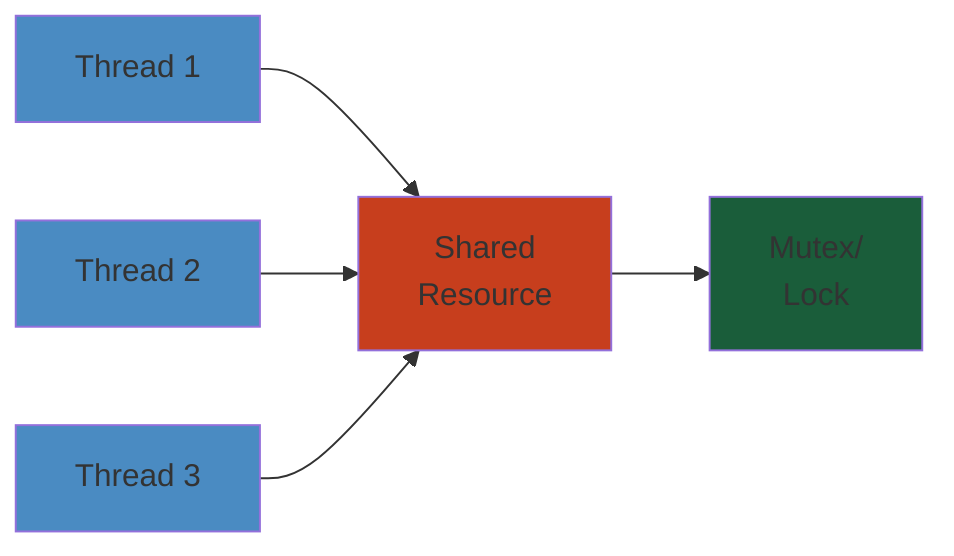
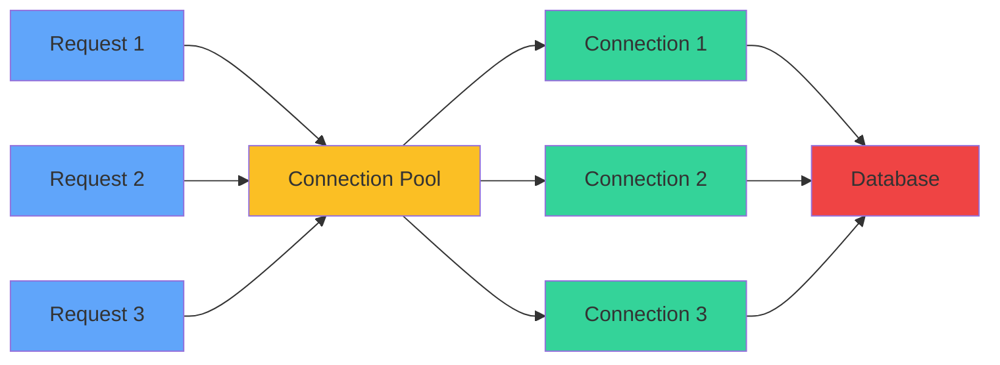
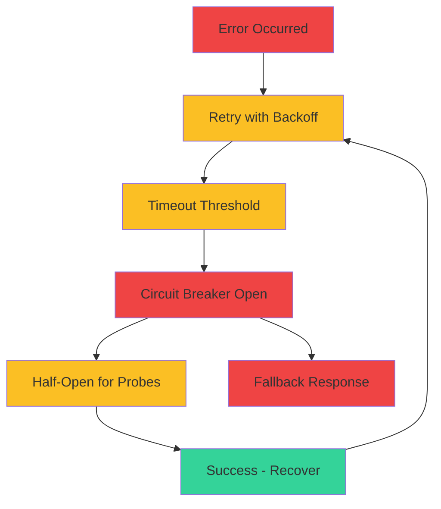

# 03 — Backend Engineering

The art and science of building server-side systems that power applications—APIs, services, data processing, authentication, and integration. Backend engineering covers language-specific mastery, API design, architecture patterns, performance optimization, and production operations.




> **Simulate**: [Request Lifecycle V2](./request-lifecycle-v2.html) — Watch latency propagate through layers, timeouts cascade, retries amplify load.

## Table of Contents

- [Languages](#languages)
  - [Java](#java)
  - [Go](#go)
  - [Python](#python)
  - [TypeScript](#typescript)
- [API Design](#api-design)
  - [REST](#rest)
  - [GraphQL](#graphql)
  - [gRPC](#grpc)
- [Backend Patterns](#backend-patterns)
  - [Architecture Patterns](#architecture-patterns)
  - [Design Patterns](#design-patterns)
  - [Concurrency Patterns](#concurrency-patterns)
- [Server Architecture](#server-architecture)
  - [Runtimes & Frameworks](#runtimes--frameworks)
  - [Request Lifecycle](#request-lifecycle)
  - [Connection Management](#connection-management)
- [Performance Engineering](#performance-engineering)
  - [Profiling & Benchmarking](#profiling--benchmarking)
  - [Caching Strategies](#caching-strategies)
  - [Database Performance](#database-performance)
- [Production Operations](#production-operations)
  - [Observability](#observability)
  - [Deployment](#deployment)
  - [Resilience](#resilience)
- [Learning Path](#learning-path)
- [Cross-References](#cross-references)

---

## Languages

### Java

The enterprise standard. Mature ecosystem, strong typing, JVM performance.

- **Core** — OOP, interfaces, abstract classes, generics, annotations, enums; records, sealed classes (Java 17+), pattern matching, virtual threads (Loom)
- **Concurrency** — Thread, Runnable, Callable, Future, CompletableFuture, ExecutorService, ForkJoinPool; synchronized, volatile, Locks, Atomics, Concurrent collections
- **JVM Internals** — class loading, bytecode, JIT compilation (C1/C2), GC (G1, ZGC, Shenandoah), memory model (JMM), heap/stack/metaspace, profiling (JFR, JMC, async-profiler)
- **Ecosystem** — Spring Boot (dominant), Micronaut, Quarkus; Hibernate/JPA, JDBC, Flyway; JUnit 5, Mockito, Testcontainers; Maven/Gradle; Netty, Vert.x
- **Build & Deployment** — Maven/Gradle, shading, multi-module projects; Docker + Jlink (custom JRE), GraalVM native-image

### Go

Cloud-native default. Simplicity, fast compilation, excellent concurrency.

- **Core** — goroutines, channels (buffered/unbuffered), select, sync primitives (Mutex, RWMutex, WaitGroup, Cond, Once, Pool), context, interface composition, error handling
- **Standard Library** — net/http, encoding/json, database/sql, io, sync, context, testing/benchmark; most cloud-native tools are in Go
- **Concurrency Model** — CSP (Communicating Sequential Processes); goroutine scheduling (M:N), work stealing, GOMAXPROCS
- **Performance** — escape analysis, inlining, bounds check elimination, PGO (profile-guided optimization); GC tuning (GOGC, memory limit)
- **Tooling** — go modules, go vet, staticcheck, pprof, trace, delve debugger; wire for DI, sqlc for type-safe SQL

### Python

The versatile workhorse. Data science, ML, scripting, API servers.

- **Core** — duck typing, decorators, generators, context managers, metaclasses, descriptors; typing (PEP 484, Pydantic for validation)
- **Async** — asyncio, event loop, coroutines, tasks, futures, async/await; uvloop for speed; trio (structured concurrency), anyio
- **Web Frameworks** — FastAPI (modern, async-native, OpenAPI auto-docs), Django (batteries-included), Flask (lightweight), Starlette (async core)
- **Data** — NumPy, Pandas, Polars (fast), Dask (distributed), SQLAlchemy, Alembic, psycopg (async)
- **Performance** — profiling (cProfile, py-spy, pyright), C extensions (Cython, C extensions), multiprocessing vs threading vs asyncio
- **Packaging** — pip, poetry, uv (fast), rye, conda; build systems (setuptools, hatch, flit)

### TypeScript

The full-stack language. Typed JavaScript with excellent tooling.

- **Type System** — structural typing, generics, utility types (Partial, Pick, Omit, Record, ReturnType), conditional types, mapped types, template literal types
- **Runtime** — Node.js (V8 libuv, event loop, worker_threads), Deno (secure, TypeScript-native), Bun (fast, built-in bundler/test runner)
- **Frameworks** — NestJS (modular, DI, decorators), Express (minimalist), Fastify (fast, schema-based), Hono (lightweight, multi-runtime)
- **Async** — Promises, async/await, EventEmitter, Streams, backpressure handling
- **Tooling** — tsc, esbuild (bundling), SWC (compilation), Biome/ESLint (linting), Vitest/Jest (testing), Prisma/Drizzle (ORM)

---

## API Design

### REST

Architectural style for networked APIs. Constraint-based: stateless, cacheable, uniform interface.

- **Resource Modeling** — nouns, not verbs; URL structure (collection, item, sub-resource); HATEOAS (links)
- **HTTP Methods** — GET (read), POST (create), PUT (replace), PATCH (partial update), DELETE; idempotency, safety
- **Status Codes** — 200, 201, 204, 400, 401, 403, 404, 409, 422, 429, 500, 502, 503
- **Versioning** — URL path (/v1/), header (Accept-Version), content negotiation
- **Pagination** — cursor-based (recommended), offset-based, keyset pagination; page size limits
- **Validation** — request validation, error response format (RFC 7807 Problem Details), input sanitization
- **Documentation** — OpenAPI/Swagger spec, code-first vs design-first; Stoplight, Redoc

### GraphQL

Query language for APIs. Client specifies exact data needs.

- **Schema** — types, queries, mutations, subscriptions; input types, enums, unions, interfaces, scalars
- **Resolver Pattern** — DataLoader for batching + caching; n+1 prevention; field-level permissions
- **Execution** — root value resolver, field resolver chain; query complexity analysis, depth limiting, cost analysis
- **Federation** — Apollo Federation, GraphQL Mesh; composing multiple subgraphs into one supergraph
- **Performance** — persisted queries, response caching, automatic persisted queries (APQ), deduplication
- **Tooling** — Apollo Server, Yoga, Hot Chocolate; GraphiQL, Apollo Studio, GraphQL Inspector

### gRPC

High-performance RPC using HTTP/2 and Protocol Buffers. Default for microservice communication.

- **Service Definition** — `.proto` files, service + rpc definitions, message types, field numbers, oneof, maps
- **RPC Types** — unary, server-streaming, client-streaming, bidirectional streaming
- **HTTP/2** — multiplexed streams, header compression (HPACK), flow control, stream prioritization
- **Interceptors** — client/server middleware for logging, auth, metrics, rate limiting
- **Load Balancing** — client-side LB (lookaside), service mesh (Istio), headless services
- **Tooling** — protoc, Buf (lint/breaking changes), grpcurl, grpc-web, gRPC-health-probe

---

## Backend Patterns

### Architecture Patterns

- **Monolith** — single deployable; simple, but hard to scale team/deploy independently
- **Microservices** — independently deployable services; bounded contexts, domain events, choreography vs orchestration
- **Event-Driven** — async communication via event bus; event sourcing, CQRS; eventual consistency
- **Serverless** — FaaS (Lambda, Cloud Functions), managed services; scale to zero, cold starts
- **Clean Architecture** — dependency inversion, layers (entities → use cases → interface adapters → frameworks)
- **Hexagonal (Ports & Adapters)** — core business logic isolated, adapters for external communication

### Design Patterns

- **Creational** — Singleton, Factory, Abstract Factory, Builder, Prototype
- **Structural** — Adapter, Facade, Proxy, Decorator, Composite, Bridge
- **Behavioral** — Strategy, Observer, Command, Chain of Responsibility, Template Method, State, Visitor
- **Enterprise** — Repository, Unit of Work, Data Mapper, Service Layer, DTO, DAO
- **Modern** — Circuit Breaker, Bulkhead, Retry + Backoff, Saga, Outbox, Transactional Outbox

### Concurrency Patterns

- **Fan-out/Fan-in** — distribute work to multiple goroutines/tasks, aggregate results
- **Pipeline** — stages connected by channels; each stage processes + passes to next
- **Worker Pool** — bounded goroutine/thread pool, job queue; rate limiting
- **Pub/Sub** — broadcast to multiple consumers, topic-based routing
- **Actor Model** — (Akka, Proto.Actor) isolated actors, message passing, supervision

---

## Server Architecture

### Runtimes & Frameworks

- **JVM** — Spring Boot (auto-configuration, embedded Tomcat/Netty, Actuator), Quarkus (fast boot, GraalVM), Micronaut (compile-time DI)
- **Go** — net/http (stdlib), Chi, Gin, Echo, Fiber; Fx/Uber for dependency injection
- **Python** — FastAPI (async, OpenAPI), Django (ORM, admin, auth), Flask (micro)
- **TypeScript** — NestJS (modular, opinionated), Express, Fastify, Hono

### Request Lifecycle

- **HTTP Server** — accept TCP conn → TLS termination → HTTP parsing → route matching → middleware chain → handler → response → logging
- **Middleware** — auth, rate limiting, logging, tracing, compression, CORS, request ID, timeout, recovery
- **Context Propagation** — request-scoped values (tenant ID, user ID, trace ID, deadline); Go context, Java MDC, Python contextvars

```mermaid
sequenceDiagram
    participant Client
    participant HTTPServer as HTTP Server
    participant Router
    participant Middleware
    participant Handler
    participant Service
    participant DB as Database
    Client->>HTTPServer: TCP Connection + TLS
    HTTPServer->>HTTPServer: Parse HTTP Request
    HTTPServer->>Router: Route Matching
    Router->>Middleware: Middleware Chain
    Middleware->>Handler: Handler Execution
    Handler->>Service: Call Service Layer
    Service->>DB: Query/Update
    DB-->>Service: Result
    Service-->>Handler: Response
    Handler-->>Middleware: Serialize Response
    Middleware-->>HTTPServer: Response Ready
    HTTPServer-->>Client: HTTP Response
    HTTPServer->>HTTPServer: Log Request
    style Client fill:#60a5fa
    style HTTPServer fill:#fbbf24
    style Router fill:#fbbf24
    style Middleware fill:#fbbf24
    style Handler fill:#fbbf24
    style Service fill:#fbbf24
    style DB fill:#ef4444
```

### Connection Management

- **Connection Pooling** — database (HikariCP, pgx), HTTP (keepalive), gRPC; pool sizing, max lifetime, validation
- **Rate Limiting** — token bucket, leaky bucket, sliding window; per-user, per-IP, per-endpoint
- **Graceful Shutdown** — SIGTERM → stop accepting → drain in-flight → cleanup → exit; health check endpoints for load balancer



---

## Performance Engineering

### Profiling & Benchmarking

- **CPU Profiling** — flame graphs, call graphs, hot methods; async-profiler (Java), pprof (Go), py-spy (Python), clinic (Node)
- **Memory Profiling** — heap dumps, allocation profiling, GC analysis, leak detection
- **Benchmarking** — JMH (Java), testing.B (Go), pytest-benchmark (Python), autocannon/Artillery (HTTP benchmarks)
- **Latency Analysis** — percentile distributions (p50, p99, p999), tail latency, coordinated omission

### Caching Strategies

- **Cache Types** — in-memory (local), distributed (Redis, Memcached), CDN (edge), HTTP (browser)
- **Patterns** — cache-aside, read-through, write-through, write-behind, refresh-ahead
- **Invalidation** — TTL-based, event-driven (cache eviction on data change), versioned keys
- **Pitfalls** — cache stampede, thundering herd, stale data, cache/memory size planning

```mermaid
sequenceDiagram
    participant Client
    participant Handler
    participant Cache
    participant DB as Database
    Client->>Handler: Request Data
    Handler->>Cache: Check Cache
    alt Cache Hit
        Cache-->>Handler: Return Cached Data
        Handler-->>Client: Response
    else Cache Miss
        Handler->>DB: Query Database
        DB-->>Handler: Data
        Handler->>Cache: Store in Cache
        Handler-->>Client: Response
    end
    style Client fill:#60a5fa
    style Handler fill:#fbbf24
    style Cache fill:#34d399
    style DB fill:#ef4444
```

### Database Performance

- **Indexing** — B-tree, hash, GIN/GiST, covering indexes; index-only scans; composite index column order
- **Query Optimization** — EXPLAIN ANALYZE, execution plan reading, query rewriting, CTEs, window functions
- **Connection Pool Sizing** — rule of thumb: (core_count * 2) + effective_spindle_count; too many = context thrash
- **Read/Write Splitting** — primary for writes, replicas for reads; replication lag handling

---

## Production Operations

### Observability

- **Logging** — structured JSON logs, log levels, correlation IDs; tools: ELK, Loki, Datadog
- **Metrics** — RED method (Rate, Errors, Duration), USE method (Utilization, Saturation, Errors); Prometheus + Grafana
- **Tracing** — distributed tracing (OpenTelemetry, Jaeger, Zipkin); trace context propagation, sampling strategies

### Deployment

- **CI/CD** — automated build, test, deploy; canary deploys, blue-green, rolling updates
- **Environment Management** — dev, staging, prod; feature flags, environment parity
- **Immutable Infrastructure** — bake artifacts (not at runtime), versioned images

### Resilience

- **Timeouts** — connect, read, write timeouts; client-side timeouts (circuit breaker's trip threshold)
- **Retries** — exponential backoff + jitter; retry budgets; idempotency keys
- **Circuit Breaker** — tripped by error rate; half-open for recovery probes
- **Bulkhead** — isolate resources (connection pools, thread pools per dependency)
- **Health Checks** — liveness (is app alive?), readiness (can it serve traffic?), startup (first ready?)



---

## Code Examples

### Go: HTTP Server + Middleware

```go
package main

import (
    "fmt"
    "log"
    "net/http"
    "time"
)

// Middleware for logging
func loggingMiddleware(next http.Handler) http.Handler {
    return http.HandlerFunc(func(w http.ResponseWriter, r *http.Request) {
        start := time.Now()
        next.ServeHTTP(w, r)
        log.Printf("%s %s took %v", r.Method, r.URL.Path, time.Since(start))
    })
}

func helloHandler(w http.ResponseWriter, r *http.Request) {
    fmt.Fprintf(w, "Hello, %s!", r.URL.Query().Get("name"))
}

func main() {
    mux := http.NewServeMux()
    mux.HandleFunc("/hello", helloHandler)
    
    // Wrap with middleware
    handler := loggingMiddleware(mux)
    
    log.Fatal(http.ListenAndServe(":8080", handler))
}
```

### Python: FastAPI with Async

```python
from fastapi import FastAPI, HTTPException
from pydantic import BaseModel
from typing import Optional
import asyncio

app = FastAPI()

class User(BaseModel):
    id: int
    name: str
    email: str

users_db = {}

@app.get("/users/{user_id}")
async def get_user(user_id: int) -> User:
    if user_id not in users_db:
        raise HTTPException(status_code=404, detail="User not found")
    return users_db[user_id]

@app.post("/users")
async def create_user(user: User) -> dict:
    users_db[user.id] = user
    return {"status": "created", "user": user}

@app.get("/health")
async def health_check():
    # Simulate async work
    await asyncio.sleep(0.1)
    return {"status": "healthy"}

# Run: uvicorn script:app --reload
```

### Java: Spring Boot REST Controller

```java
import org.springframework.boot.SpringApplication;
import org.springframework.boot.autoconfigure.SpringBootApplication;
import org.springframework.web.bind.annotation.*;
import java.util.HashMap;
import java.util.Map;

@SpringBootApplication
public class Application {
    public static void main(String[] args) {
        SpringApplication.run(Application.class, args);
    }
}

@RestController
@RequestMapping("/api/users")
class UserController {
    private Map<Integer, User> users = new HashMap<>();

    @GetMapping("/{id}")
    public User getUser(@PathVariable int id) {
        return users.getOrDefault(id, null);
    }

    @PostMapping
    public Map<String, String> createUser(@RequestBody User user) {
        users.put(user.getId(), user);
        return Map.of("status", "created");
    }

    @GetMapping("/health")
    public Map<String, String> health() {
        return Map.of("status", "healthy");
    }
}

class User {
    private int id;
    private String name;
    private String email;
    
    // Getters/Setters
    public int getId() { return id; }
    public void setId(int id) { this.id = id; }
    public String getName() { return name; }
    public void setName(String name) { this.name = name; }
    public String getEmail() { return email; }
    public void setEmail(String email) { this.email = email; }
}
```

### TypeScript: Express.js REST API

```typescript
import express, { Request, Response } from 'express';

interface User {
    id: number;
    name: string;
    email: string;
}

const app = express();
app.use(express.json());

const users: Map<number, User> = new Map();

// Middleware: request logging
app.use((req: Request, res: Response, next) => {
    console.log(`${req.method} ${req.path}`);
    next();
});

// Routes
app.get('/users/:id', (req: Request, res: Response) => {
    const user = users.get(parseInt(req.params.id));
    if (!user) {
        return res.status(404).json({ error: 'User not found' });
    }
    res.json(user);
});

app.post('/users', (req: Request, res: Response) => {
    const user: User = req.body;
    users.set(user.id, user);
    res.status(201).json({ status: 'created', user });
});

app.get('/health', (req: Request, res: Response) => {
    res.json({ status: 'healthy' });
});

app.listen(8080, () => {
    console.log('Server running on port 8080');
});
```

### Goroutines & Channels

```go
package main

import (
    "fmt"
    "sync"
    "time"
)

func worker(id int, jobs <-chan int, results chan<- int) {
    for j := range jobs {
        fmt.Printf("Worker %d processing job %d\n", id, j)
        time.Sleep(time.Second)
        results <- j * 2
    }
}

func main() {
    jobs := make(chan int, 5)
    results := make(chan int, 5)
    
    // Start 3 workers
    for w := 1; w <= 3; w++ {
        go worker(w, jobs, results)
    }
    
    // Send jobs
    for j := 1; j <= 5; j++ {
        jobs <- j
    }
    close(jobs)
    
    // Collect results
    for i := 0; i < 5; i++ {
        fmt.Println("Result:", <-results)
    }
}
```

### Java: Concurrent Collections

```java
import java.util.concurrent.*;
import java.util.*;

public class ConcurrencyExample {
    public static void main(String[] args) throws InterruptedException {
        // Thread pool
        ExecutorService executor = Executors.newFixedThreadPool(4);
        
        // Concurrent map
        ConcurrentHashMap<String, Integer> counters = new ConcurrentHashMap<>();
        
        // Submit tasks
        for (int i = 0; i < 10; i++) {
            executor.submit(() -> {
                counters.putIfAbsent("count", 0);
                counters.computeIfPresent("count", (k, v) -> v + 1);
            });
        }
        
        executor.shutdown();
        executor.awaitTermination(5, TimeUnit.SECONDS);
        
        System.out.println("Final count: " + counters.get("count"));
    }
}
```

---

## Learning Path

1. **Stage 1** — Pick one language (Java, Go, Python, or TS) and become proficient: syntax, data structures, standard library, testing
2. **Stage 2** — HTTP, REST API design, basic web framework, databases (SQL + ORM), authentication (JWT, OAuth2)
3. **Stage 3** — Advanced: concurrency, caching, profiling, API design (REST + GraphQL + gRPC), design patterns
4. **Stage 4** — Architecture: microservices, event-driven, observability, resilience patterns
5. **Stage 5** — Production: deployment (CI/CD, containers), monitoring, performance tuning, scaling

---

## Cross-References

| Domain | Connection |
|--------|-----------|
| [00 — Foundations](/00-foundations/) | Data structures, algorithms, complexity analysis are daily tools for backend engineers |
| [01 — AI/ML](/01-ai-ml/) | Model serving infrastructure, embedding-based features, AI-powered API features |
| [02 — Data Engineering](/02-data-engineering/) | Backend services often feed/read from data pipelines; CDC patterns, event-driven ETL |
| [04 — Frontend](/04-frontend/) | Backend APIs consumed by frontend; BFF pattern, SSR hydration, real-time WebSocket |
| [05 — Cloud](/05-cloud/) | Compute (EC2, GKE, ECS), managed DBs (RDS, Cloud SQL), load balancers, auto-scaling |
| [06 — DevOps](/06-devops/) | CI/CD for backend services, Docker image building, infrastructure as code |
| [08 — Databases](/08-databases/) | Every backend service connects to a database; query design, connection management, migrations |
| [09 — Distributed Systems](/09-distributed-systems/) | Microservice communication, consistency, distributed transactions, consensus for coordination |
| [10 — Messaging](/10-messaging/) | Async integration of services, event-driven patterns, message queues for decoupling |
| [11 — Networking](/11-networking/) | HTTP/gRPC protocol details, TCP tuning, DNS resolution, TLS termination |

## Language Comparison

| Feature | Java | Go | Python | TypeScript |
|---|---|---|---|---|
| **Typing** | Static, strong | Static, strong | Dynamic, duck | Static, gradual (any) |
| **Concurrency** | Threads + Loom (virtual threads) | Goroutines + channels (built-in) | asyncio (library) | event loop (Node.js) |
| **Compilation** | JIT (JVM) | AOT (native binary) | Interpreted (C Python) | JIT (V8) / transpiled |
| **Memory** | GC (G1/ZGC/Shenandoah) | GC (concurrent) | GC (ref counting + generational) | GC (V8 Orinoco) |
| **Startup** | Slow (JVM warmup) | Fast (native binary) | Fast (interpreted) | Fast (but V8 warmup) |
| **Deployment** | JAR/WAR (JRE needed) | Single binary | pip + interpreter | npm + Node.js |
| **Ecosystem** | Maven/Gradle, Spring | Go modules, stdlib rich | pip, Django/FastAPI | npm, React/Next.js |
| **Best For** | Enterprise, big data, Android | CLI, networking, microservices | Data science, scripting, web | Web frontend, full-stack |

## Key Topics by Language

| Language | Architecture | Concurrency | Performance | Testing |
|---|---|---|---|---|
| Java | `01-oop-concepts` → `12-spring-boot` | `04-multithreading` + `15-concurrency-deep-dive` | `19-performance-tuning` | `18-testing-advanced` |
| Go | `01-goroutines-channels` | `01-goroutines-channels` (built-in) | `03-go-profiling` | Testing (std `testing` pkg) |
| Python | `01-python-internals` | `03-python-concurrency-async` | `01-python-internals` (GIL) | `04-python-testing-packaging` |
| TypeScript | `01-types-system-deep-dive` | Event loop (Node.js eventemitter) | `03-internals-performance` | Jest / Vitest |

---

