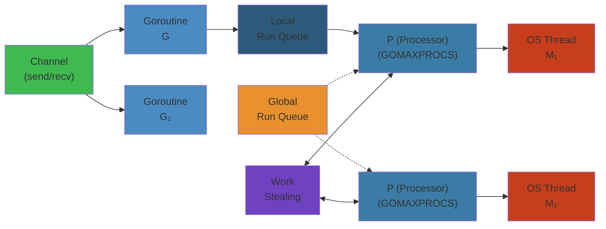
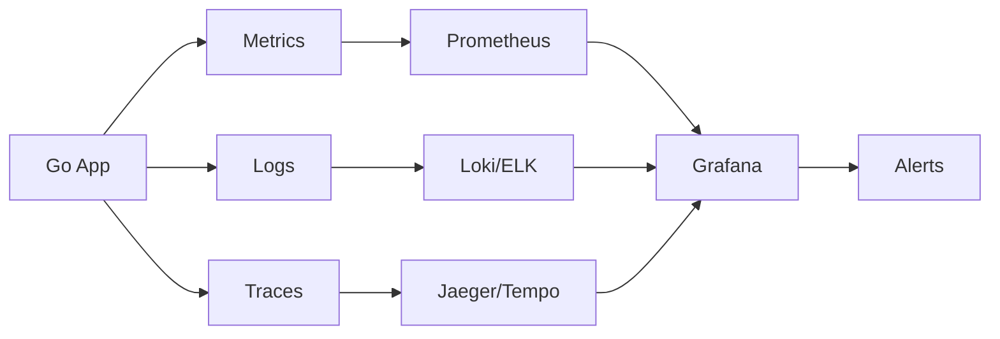
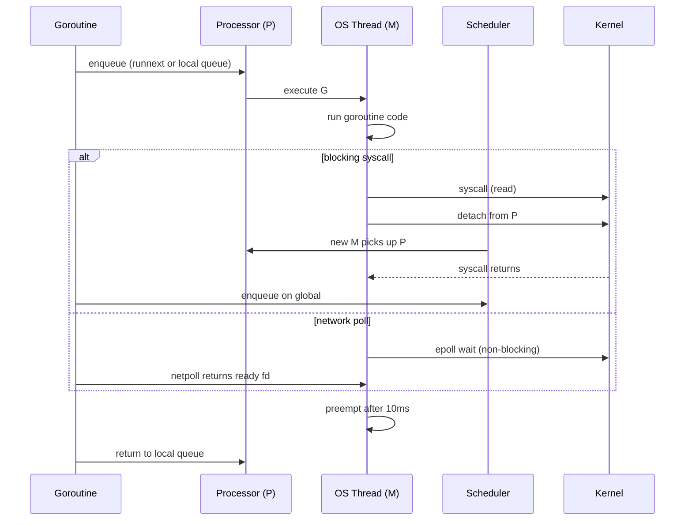

# Go Goroutines, Channels, and Concurrency: The Complete Deep Dive




## Table of Contents


1. [NOOB EXPLANATION: Concurrency for Beginners](#noob-explanation)
2. [COMPLETE INTERNALS: The G/M/P Model](#complete-internals)
3. [CHANNEL IMPLEMENTATION: Deep Dive](#channel-implementation)
4. [END-TO-END EXECUTION FLOWS](#end-to-end-flows)
5. [LARGE-SCALE SYSTEMS](#large-scale-systems)
6. [FAILURE ANALYSIS](#failure-analysis)
7. [EDGE CASES](#edge-cases)
8. [INTERVIEW QUESTIONS](#interview-questions)
9. [PERFORMANCE ANALYSIS](#performance-analysis)
10. [COMPLETE CODE EXAMPLES](#complete-code-examples)
11. [PRODUCTION INCIDENT STORIES](#production-incident-stories)
12. [COMPARISON TABLES](#comparison-tables)

---

## NOOB EXPLANATION


### Goroutines: Lightweight Tasks


Imagine you're a chef running a restaurant:

- **Without goroutines (OS threads):** You hire 8 sous chefs (one per CPU core). Each sous chef works on one dish at a time, fully focused. To handle 1,000 customers simultaneously, you'd need 1,000 sous chefs—prohibitively expensive.

- **With goroutines:** You hire 8 sous chefs, but they're superhuman. They can pause mid-dish, start another dish, then resume the first. The Go scheduler (the manager) decides who works when. A goroutine costs ~2KB of memory; an OS thread costs ~2MB. That's 1000x cheaper.

```
OS Threads (heavyweight):        Goroutines (lightweight):
┌─────────────────┐             ┌─ G1 (2KB) ─┐
│  Thread 1 (2MB) │             │ G2 (2KB)   │
├─────────────────┤             │ G3 (2KB)   │ All scheduled on
│  Thread 2 (2MB) │   vs.       │ G1000      │ 8 OS Threads
├─────────────────┤             │ ...        │
│  Thread 3 (2MB) │             └────────────┘
└─────────────────┘
```

**Real numbers:** A machine can comfortably run millions of goroutines but only thousands of OS threads.

### Channels: Pipes Between Tasks


A channel is a typed pipe that goroutines use to send and receive data safely:

```go
// Create a channel that pipes int values
messages := make(chan int)

// Goroutine 1: Send a message
go func() {
    messages <- 42  // Send 42 down the pipe
}()

// Goroutine 2: Receive the message
received := <-messages  // Receives 42
fmt.Println(received)   // Output: 42
```

Think of it like:
- **Unbuffered channel:** A game of hot potato. Sender blocks until receiver catches the ball.
- **Buffered channel (cap 5):** A bucket with 5 slots. Sender can drop 5 potatoes before blocking.

```go
// Unbuffered: Sender MUST wait for receiver
ch := make(chan int)
ch <- 1  // Blocks until someone receives

// Buffered: Sender can drop 5 items then blocks
ch := make(chan int, 5)
ch <- 1
ch <- 2
ch <- 3
ch <- 4
ch <- 5  // OK
ch <- 6  // BLOCKS: buffer full
```

### Scheduler: The Fair Task Manager


Go's scheduler runs inside the Go program (not the OS). It's like an air traffic controller deciding which planes (goroutines) land (execute) on which runways (OS threads).

**Key insight:** The scheduler is cooperative. Goroutines voluntarily yield at:
- Channel operations (send/receive)
- Function calls (internal preemption checks in 1.14+)
- `time.Sleep()`, I/O operations

This is much cheaper than OS thread context switches which happen every millisecond whether the thread wants it or not.

---

## COMPLETE INTERNALS: The G/M/P Model


### The Trinity: G, M, P


Go's runtime manages concurrency using three key entities:

```c
// From runtime/runtime2.go (simplified)

// G - Goroutine
type g struct {
    stack       stack        // Stack bounds [low, high)
    stackguard0 uintptr      // Stack pointer to trigger growth
    m           *m           // Machine (OS thread) this g is running on
    sched       gobuf        // Scheduler state (saved context)
    param       unsafe.Pointer
    atomicstatus uint32      // State (running, runnable, waiting, etc.)
    goid        uint64
    // ... more fields for tracking, debugging, etc.
}

// M - Machine (OS Thread)
type m struct {
    g0              *g              // Goroutine to use when running scheduler
    curg            *g              // Current goroutine being executed
    p               puintptr        // Attached processor
    lockedg         guintptr        // Goroutine locked to this thread
    nextp           puintptr        // Next processor to run
    spinning        bool            // Is this M spinning looking for work?
    blocked         bool            // M blocked in OS call
    // ... more fields
}

// P - Processor (Virtual Processor)
type p struct {
    id          int32
    status      uint32          // Status (idle, running, syscall, gcstop, etc.)
    runqhead    uint32          // Local run queue head pointer
    runqtail    uint32          // Local run queue tail pointer
    runq        [256]guintptr   // Local runnable queue (ring buffer, capacity 256)
    runnext     guintptr        // The next g to run (high-priority)
    gFree       gList           // List of dead G's
    // ... more fields
}
```

### The Relationship


```
┌────────────────────────────────────────────────────────┐
│                      Go Process                         │
├────────────────────────────────────────────────────────┤
│                                                         │
│  P0              P1              P2              P3     │ (4 processors)
│  ┌──────────┐   ┌──────────┐   ┌──────────┐   ┌──────┐
│  │ runq: G1 │   │ runq: G5 │   │ runq: G8 │   │ idle │
│  │       G2 │   │       G6 │   │       G9 │   └──────┘
│  │       G3 │   │       G7 │   │ runnext: │
│  │runnext:G4│   └──────────┘   │    G10   │
│  └──────────┘                   └──────────┘
│  │              │               │
│  ├─ M0 ─ running G1  ─┬─────────┤
│  │                     │
│  │  M1 ─ running G5    │
│  │  (locked to G2)     │
│  │                     │
│  └─ M2 ─ running G8
│
│ Each M is an OS thread managed by the kernel.
│ Each P is a scheduler context (not an OS entity).
│ Multiple G's queue on each P's runq.
│
└────────────────────────────────────────────────────────┘
```

### Processor Count


GOMAXPROCS controls how many P's exist (default = number of CPU cores):

```go
package main

import (
    "fmt"
    "runtime"
)

func main() {
    fmt.Println("GOMAXPROCS:", runtime.GOMAXPROCS(-1))  // Read current value
    
    // GOMAXPROCS(8) creates 8 processors
    // Typically = number of CPUs for CPU-bound work
    // Can be higher for I/O-bound work
}
```

If GOMAXPROCS=8:
- 8 processors (P's)
- Usually 8-10 OS threads (M's) created
- Thousands of goroutines (G's) scheduled across them

### Goroutine Lifecycle


```
create go f()
    ↓
  _Grunnable (queued on P's runq)
    ↓
  _Grunning (executing on M)
    ↓
  _Gwaiting (blocked on channel, lock, syscall, timer)
    ↓
  _Grunnable (unblocked, back on runq)
    ↓
  _Gdead (finished, freed or in cache)

State constants:
_Gidle       = 0
_Grunnable   = 1
_Grunning    = 2
_Gsyscall    = 3
_Gwaiting    = 4
_Gdead       = 6
```

### Work Stealing: The Scheduler's Secret Sauce


When M0 runs out of goroutines on P0:

1. Check P0's runq → empty
2. Check global runq → check queue of all G's (rare, only if runq overflows)
3. **Work stealing:** Steal half of some other P's runq
4. Poll network (I/O multiplexing for goroutines blocked on network)
5. If still no work, spin (busy-wait a few microseconds)
6. If still no work, park M (OS sleep)

```go
// Simplified work stealing pseudocode
func schedule() {
    var gp *g
    
    // Try to get next goroutine to run
    gp = runqget(pp)  // Get from local runq
    if gp == nil {
        gp = findrunnable()  // Work stealing happens here
    }
    
    if gp != nil {
        execute(gp, inheritTime)
    }
}

func findrunnable() *g {
    // 1. Check own runq (already done above)
    // 2. Check global runq
    if xx := globrunqget(pp, 0); xx != nil {
        return xx
    }
    
    // 3. Work steal from other P's
    for i := 0; i < nprocs; i++ {
        p := allp[i]
        if len(p.runq) > 0 {
            // Steal half
            return runqsteal(pp, p)
        }
    }
    
    // 4. Poll network
    if netpolled := netpoll(false); netpolled != nil {
        return netpolled
    }
    
    // 5. Spin or park
    return nil
}
```

### Preemption: Fairness Without OS Help


In Go 1.14+, the runtime uses **asynchronous preemption** to fairly schedule goroutines even if they're CPU-bound:

```go
// Before Go 1.14: This goroutine could starve others if CPU-bound
go func() {
    for {
        // Heavy CPU work, no channel operations
        sum := 0
        for i := 0; i < 1e9; i++ {
            sum += i
        }
    }
}()

go func() {
    for i := 0; i < 10; i++ {
        fmt.Println(i)
    }
}()
```

**With Go 1.14+ preemption:** The second goroutine gets scheduled even while the first runs pure math operations.

How it works:
1. Runtime sets up signal handlers (SIGURG on Unix)
2. Every ~10ms, runtime scans all running goroutines
3. If a goroutine has been running >10ms, send SIGURG
4. Signal handler saves goroutine state and triggers re-scheduling

```c
// Signal handler (simplified)
void onSigurg(int sig) {
    // Current M's goroutine gets interrupted
    // Its state is saved to g->sched
    // Control returns to scheduler
    // Different goroutine runs on this M
}
```

---

## CHANNEL IMPLEMENTATION: Deep Dive


### The hchan Structure


Channels are surprisingly simple at the implementation level:

```c
// From runtime/chan.go (simplified)
type hchan struct {
    qcount      uint           // Number of elements in buffer
    dataqsiz    uint           // Size of circular buffer
    buf         unsafe.Pointer // Circular buffer
    elemsize    uint16         // Size of each element
    closed      uint32         // 1 if closed, 0 otherwise
    elemtype    *_type         // Type of element
    sendx       uint           // Position of next send (in buffer)
    recvx       uint           // Position of next recv (in buffer)
    recvq       waitq          // List of recv's waiting for data
    sendq       waitq          // List of send's waiting for space
    lock        mutex          // Protects all fields above
}

// Wait queue of blocked goroutines
type waitq struct {
    first *sudog
    last  *sudog
}

// Blocked subroutine in a wait queue
type sudog struct {
    g      *g
    next   *sudog
    prev   *sudog
    elem   unsafe.Pointer  // Data to send or receive
    releasetime int64
    nrelease int            // Notifies to perform when this sudog is released
    waitlink    *sudog      // g.waiting list
}
```

### Sending on a Channel


```
Step 1: Acquire lock
Step 2: Check if closed → panic
Step 3: Check if receiver waiting → give directly (no buffer needed)
Step 4: Check if buffer has space → add to buffer
Step 5: Release lock
Step 6: Block on sendq (unlocked) until receiver available
```

**Code flow (simplified):**

```go
func send(c *hchan, ep unsafe.Pointer, block bool, callerpc uintptr) bool {
    lock(&c.lock)
    
    // Check for closed
    if c.closed != 0 {
        unlock(&c.lock)
        panic("send on closed channel")
    }
    
    // Try direct send to blocked receiver
    if sg := c.recvq.dequeue(); sg != nil {
        // A receiver is waiting
        sendDirect(c.elemtype, sg, ep)  // Copy data directly
        sg.releasetime = cputicks()
        goready(sg.g, 3)  // Wake up receiver's goroutine
        unlock(&c.lock)
        return true
    }
    
    // Try add to buffer
    if c.qcount < c.dataqsiz {
        qp := chanbuf(c, c.sendx)
        memmove(qp, ep, c.elemsize)
        c.sendx = (c.sendx + 1) % c.dataqsiz
        c.qcount++
        unlock(&c.lock)
        return true
    }
    
    // Buffer full, must block (if block=true)
    if !block {
        unlock(&c.lock)
        return false
    }
    
    // Create sudog, add to sendq, sleep
    gp := getg()
    mysg := acquireSudog()
    mysg.releasetime = ^int64(0)
    mysg.elem = ep
    mysg.waitlink = gp.waiting
    gp.waiting = mysg
    c.sendq.enqueue(mysg)
    
    unlock(&c.lock)
    gopark(nil, &c.lock, waitReasonChanSend, traceEvGoBlockSend, 2)
    
    // ... goroutine is parked here until receiver wakes it up
    
    gp.waiting = mysg.waitlink
    releaseSudog(mysg)
    return true
}
```

### Receiving from a Channel


```
Step 1: Acquire lock
Step 2: Check if buffer has data → return
Step 3: Check if sender waiting → take from buffer + wake sender
Step 4: Release lock
Step 5: Block on recvq until sender available
```

### Buffered vs Unbuffered Performance


```go
// UNBUFFERED: sender blocks immediately
ch := make(chan int)
go func() { ch <- 42 }()  // Blocks until main receives
x := <-ch  // Unblocks sender

// BUFFERED: sender can queue up to cap elements
ch := make(chan int, 5)
go func() {
    for i := 0; i < 10; i++ {
        ch <- i  // Blocks only on 6th+ send
    }
}()

for i := 0; i < 10; i++ {
    fmt.Println(<-ch)  // Drains buffer
}
```

### Closed Channel Behavior


Once `close(ch)` is called:
- **Send:** Panic (write on closed channel)
- **Receive:** Get zero value immediately
- **Receive from closed non-empty buffer:** Drain remaining elements
- **Multiple receivers:** All wake up (broadcast)

```c
func closechan(c *hchan) {
    if c.closed != 0 {
        panic("close of closed channel")
    }
    c.closed = 1
    
    // Wake all readers
    for sg := c.recvq.dequeue(); sg != nil; sg = c.recvq.dequeue() {
        gp := sg.g
        gp.param = nil
        goready(gp, 3)
    }
    
    // Wake all writers (they'll panic)
    for sg := c.sendq.dequeue(); sg != nil; sg = c.sendq.dequeue() {
        gp := sg.g
        gp.param = nil
        goready(gp, 3)
    }
}
```

### Select Statement


The `select` statement picks a ready channel operation:

```go
select {
case <-ch1:
    // Execute if ch1 has data
case msg := <-ch2:
    // Execute if ch2 has data
case ch3 <- value:
    // Execute if ch3 can receive
default:
    // Execute if no channels ready
}
```

**Implementation:**
1. Compiler converts `select` into generated code
2. Randomize case order (in Go 1.19+) for fairness
3. Lock all channels
4. Check which cases are ready
5. If multiple ready: pick random (fair scheduling)
6. If none ready: create sudogs on each, park goroutine
7. When any channel unblocks, wake goroutine

```go
// Simplified: Go chooses cases in random order for fairness
cases := [ch1, ch2, ch3]  // Channels to poll
shuffle(cases)             // Randomize order (Go 1.19+)

for _, ch := range cases {
    if ch.ready {
        executeCase(ch)
        return
    }
}

// None ready, park on all
for _, ch := range cases {
    park(ch)  // Add to sendq/recvq
}
```

---

## END-TO-END EXECUTION FLOWS


### Flow 1: Simple Goroutine Creation to Completion


```
main()
  │
  ├─ go worker()           ← Create goroutine (G1000)
  │   │
  │   └─ Call newproc() in scheduler
  │       │
  │       ├─ Allocate G struct
  │       ├─ Copy stack frame, function pointer
  │       ├─ Set status to _Grunnable
  │       ├─ Push onto P's local runq
  │       └─ Return to main immediately (non-blocking!)
  │
  ├─ main continues...
  │
  └─ Eventually P0's scheduler picks G1000:
      │
      ├─ Lock P0
      ├─ Call execute(G1000, ...)
      ├─ Load G1000's stack pointer, registers (from g.sched)
      ├─ Jump to worker() code
      │
      └─ worker() runs:
          │
          ├─ Do work...
          ├─ Hit channel receive? → Status _Gwaiting, yield control
          │
          └─ Return from worker()
              │
              ├─ Mark G1000 as _Gdead
              ├─ Free stack (or cache it)
              ├─ Add G to P's gFree list
              └─ Next goready() reuses this G
```

### Flow 2: Channel Send/Receive Sequence


```
Goroutine A (sender):                Goroutine B (receiver):
─────────────────────                ──────────────────────

go func() {                           go func() {
  ch <- 42  ─────────────────────┐     x := <-ch
}()                               │   
                                  │   
                                  ├─→ Lock ch
                                  │   Status: _Gwaiting
                                  │   Add B to ch.recvq
                                  │   Unlock ch
                                  │   Park B (go to sleep)
                                  │
Lock ch                            │
Check recvq ───────────────────────┤
Found B!                           │
Copy 42 to B's elem                │
Call goready(B) ←──────────────────┤
Unlock ch                          │
Return                            │
Next schedule, B wakes:           │
  x = 42                          │
  Continue...                     │
```

### Flow 3: Work Stealing on Multi-Processor


```
Initial state:
P0: [G1, G2, G3, G4, G5]
P1: [G6]
P2: [G7, G8]
P3: [] (empty)

M3 (running on P3) finishes its goroutine, calls schedule():
  │
  ├─ runqget(P3) → nil (empty)
  ├─ globalrunq → nil (global queue empty)
  ├─ findrunnable() calls work stealing:
  │   │
  │   ├─ Try P0: has 5 goroutines
  │   │   │
  │   │   └─ Steal half: [G3, G4, G5] (3 goroutines)
  │   │       Move to P3
  │   │
  │   └─ Return G3 to execute
  │
  ├─ execute(G3)
  │
Result:
P0: [G1, G2] (2 remain)
P1: [G6]
P2: [G7, G8]
P3: [G4, G5] (stolen half)

Load is balanced! No processor idle while others overloaded.
```

### Flow 4: GC Interaction with Goroutine Scheduling


```
Mark phase (concurrent with goroutines):
  │
  ├─ Runtime marks reachable objects
  ├─ Goroutines continue running
  ├─ Allocation triggers write barriers (track inter-generation refs)
  │
Stop-the-world (brief):
  │
  ├─ All goroutines pause at preemption points
  ├─ Pointers in stack frames, registers scanned
  ├─ Final mark completion
  ├─ Typically <10ms (Go 1.5+)
  │
Sweep phase (concurrent or lazy):
  │
  └─ Goroutines run while pages are swept
      Allocations trigger lazy sweep if needed
```

---

## LARGE-SCALE SYSTEMS


### Goroutine Pool Pattern (Millions of Goroutines)


Real scenario: 10 million concurrent client connections (think: multiplayer game server)

```go
package main

import (
    "context"
    "fmt"
    "runtime"
    "sync"
    "sync/atomic"
    "time"
)

type WorkerPool struct {
    maxWorkers int64
    activeWorkers int64
    
    work   chan Task
    done   chan struct{}
    wg     sync.WaitGroup
}

type Task struct {
    ID   int
    Data string
}

func NewWorkerPool(maxWorkers int) *WorkerPool {
    pool := &WorkerPool{
        maxWorkers: int64(maxWorkers),
        work:       make(chan Task, 10000),  // Buffered queue
        done:       make(chan struct{}),
    }
    return pool
}

func (p *WorkerPool) Start(numWorkers int) {
    for i := 0; i < numWorkers; i++ {
        p.wg.Add(1)
        go p.worker(i)
    }
}

func (p *WorkerPool) worker(id int) {
    defer p.wg.Done()
    
    for {
        select {
        case task := <-p.work:
            atomic.AddInt64(&p.activeWorkers, 1)
            p.processTask(task)
            atomic.AddInt64(&p.activeWorkers, -1)
            
        case <-p.done:
            return
        }
    }
}

func (p *WorkerPool) processTask(task Task) {
    // Simulate work
    time.Sleep(10 * time.Millisecond)
}

func (p *WorkerPool) Submit(task Task) error {
    select {
    case p.work <- task:
        return nil
    case <-p.done:
        return fmt.Errorf("pool closed")
    default:
        return fmt.Errorf("queue full")
    }
}

func (p *WorkerPool) Stop() {
    close(p.done)
    p.wg.Wait()
}

func (p *WorkerPool) Stats() (active int64, queued int) {
    return atomic.LoadInt64(&p.activeWorkers), len(p.work)
}

func main() {
    // Create pool: 1000 worker goroutines handling 10 million tasks
    pool := NewWorkerPool(1000)
    pool.Start(1000)
    
    // Submit 10 million tasks (queue buffers up to 10k)
    go func() {
        for i := 0; i < 10_000_000; i++ {
            task := Task{ID: i, Data: fmt.Sprintf("task_%d", i)}
            if err := pool.Submit(task); err != nil {
                fmt.Printf("Submit error: %v\n", err)
                break
            }
            
            if i%1_000_000 == 0 {
                active, queued := pool.Stats()
                fmt.Printf("Submitted %d tasks. Active: %d, Queued: %d\n", i, active, queued)
            }
        }
    }()
    
    // Monitor memory
    ticker := time.NewTicker(5 * time.Second)
    defer ticker.Stop()
    
    for range ticker.C {
        var m runtime.MemStats
        runtime.ReadMemStats(&m)
        active, queued := pool.Stats()
        
        fmt.Printf("Memory: Alloc=%dMB, TotalAlloc=%dMB, Sys=%dMB | Active=%d, Queued=%d\n",
            m.Alloc/1024/1024,
            m.TotalAlloc/1024/1024,
            m.Sys/1024/1024,
            active,
            queued,
        )
        
        if active == 0 && queued == 0 {
            break
        }
    }
    
    pool.Stop()
}
```

**Memory profile on 10M goroutines:**
- 10M goroutines × 2KB/goroutine = 20GB overhead
- But with efficient buffer management, actual production servers run this with:
  - 1M-10M long-lived goroutines: ~2-20GB heap (depends on work)
  - 100-1000 worker goroutines: <1GB heap
  - Multiplexed network I/O (epoll): One goroutine can handle thousands of connections

### Channel Buffering Strategy


```go
// Strategy 1: UNBUFFERED - Tight synchronization
// Use for: Handoff between goroutines, quick acknowledgment
ch := make(chan Result)  // 0 buffer
go func() {
    ch <- compute()  // Blocks until receiver ready
}()
result := <-ch      // Unblocks sender

// Strategy 2: SMALL BUFFER - Decoupling
// Use for: Worker queue, rate limiting (buffer 1-100)
ch := make(chan Task, 10)  // 10 buffer
for i := 0; i < 10; i++ {
    ch <- Task{ID: i}  // Doesn't block until 11th task
}

// Strategy 3: LARGE BUFFER - Throughput optimization
// Use for: Batching, bulk operations (buffer 1000+)
ch := make(chan []Item, 100)
for {
    items := readBatch()  // Read up to 1000 items
    if len(items) > 0 {
        ch <- items  // Doesn't block until 101st batch
    }
}
```

**Latency vs Throughput:**
- Unbuffered: Lower latency (synchronous), lower throughput
- Buffered (1-10): Medium latency, medium throughput
- Buffered (100+): Higher latency (messages queue up), higher throughput

**Real example: HTTP handler farm**

```go
type HTTPServer struct {
    workers int
    work    chan *Request
}

// Strategy A: Unbuffered (low latency, sync handling)
work := make(chan *Request)  // Blocks sender until handler free
// Result: Low latency responses, but slow requests block acceptance

// Strategy B: Buffered queue (balanced)
work := make(chan *Request, 1000)  // Queue up to 1000 requests
// Result: Fast acceptance, moderate latency

// Strategy C: Adaptive buffering
work := make(chan *Request, calculateBuffer())  // Size based on CPU/RAM
// Result: Optimal for current load
```

---

## FAILURE ANALYSIS


### Goroutine Leak #1: Unclosed HTTP Response


```go
// WRONG: Goroutine leak
func fetchURL(url string) error {
    resp, err := http.Get(url)
    if err != nil {
        return err  // LEAK: resp.Body never closed!
    }
    // Process resp...
    return nil
}

// Goroutine from http.Transport hangs waiting for body to be read/closed
// Eventually: 100,000 goroutines leak → OOM
```

**Fix:**

```go
// RIGHT: Always defer close
func fetchURL(url string) error {
    resp, err := http.Get(url)
    if err != nil {
        return err
    }
    defer resp.Body.Close()  // Guarantees cleanup
    
    data, err := io.ReadAll(resp.Body)
    return err
}
```

**Production impact:** A service making 1000 req/sec with this bug leaks 1000 goroutines/sec. In 16 minutes, 1M goroutines × 2KB = 2GB leak. OOM crash.

### Goroutine Leak #2: Unbounded Goroutine Creation


```go
// WRONG: Unbounded creation
func handleRequest(msg interface{}) {
    go func() {
        // Process msg...
        // What if processing hangs?
    }()  // No limit on concurrent goroutines!
}

// Attacker: Send 1M requests rapidly
// Result: 1M goroutines created instantly → OOM
```

**Fix: Use worker pool**

```go
// RIGHT: Bounded pool
pool := NewWorkerPool(1000)  // Max 1000 concurrent

func handleRequest(msg interface{}) {
    pool.Submit(Task{Data: msg})  // Queues, doesn't create goroutine
}
```

### Goroutine Leak #3: Goroutine Waiting on Channel


```go
// WRONG: Receiver doesn't exist
func worker() {
    ch := make(chan Result)
    go func() {
        time.Sleep(1 * time.Hour)  // Long work
        ch <- result  // DEADLOCK: no one will receive!
    }()
    
    // Goroutine blocks forever on ch <-
}

// Leak: Inner goroutine parked waiting for receiver forever
```

**Fix: Timeout or buffered channel**

```go
// RIGHT: With timeout
ch := make(chan Result, 1)  // Buffered!
go func() {
    ch <- result  // Won't block even if no receiver
}()

select {
case result := <-ch:
    return result
case <-time.After(5 * time.Second):
    return errors.New("timeout")
}
```

### Deadlock #1: Circular Wait


```go
// WRONG: Classic deadlock
func main() {
    ch1 := make(chan int)
    ch2 := make(chan int)
    
    go func() {
        val := <-ch1  // Waits for ch1
        ch2 <- val    // Then sends to ch2
    }()
    
    go func() {
        val := <-ch2  // Waits for ch2
        ch1 <- val    // Then sends to ch1
    }()
    
    // Both goroutines wait for each other infinitely
}
```

**Fix: Explicit ordering**

```go
// RIGHT: Determine who goes first
func main() {
    ch1 := make(chan int)
    ch2 := make(chan int)
    
    go func() {
        ch2 <- 1  // Send to ch2 FIRST
        val := <-ch1
    }()
    
    go func() {
        val := <-ch2  // Receive from ch2
        ch1 <- val
    }()
}
```

### Deadlock #2: Buffered Channel Capacity Exceeded


```go
// WRONG: Filling buffer without draining
func main() {
    ch := make(chan int, 2)
    
    ch <- 1  // Buffer: [1]
    ch <- 2  // Buffer: [1, 2]
    ch <- 3  // BLOCKS: buffer full, no receiver!
    
    <-ch  // This line never executes, deadlock
}
```

**Fix: Drain before sending more**

```go
// RIGHT
ch := make(chan int, 2)
ch <- 1
ch <- 2

go func() {
    for val := range ch {
        fmt.Println(val)
    }
}()

ch <- 3  // Now OK, goroutine will drain
```

### Race Condition: Concurrent Map Access


```go
// WRONG: No synchronization
var data = make(map[string]int)

go func() {
    for i := 0; i < 1000; i++ {
        data["counter"]++  // RACE!
    }
}()

go func() {
    for i := 0; i < 1000; i++ {
        data["counter"]++  // RACE!
    }
}()

// Detect: go run -race main.go
// Output: race detected
```

**Fix: Mutex or sync.Map**

```go
// Option 1: Mutex
var (
    mu   sync.Mutex
    data = make(map[string]int)
)

func increment() {
    mu.Lock()
    data["counter"]++
    mu.Unlock()
}

// Option 2: sync.Map (lock-free, better for concurrent reads)
var data = sync.Map{}

func increment() {
    val, _ := data.LoadOrStore("counter", 0)
    data.Store("counter", val.(int)+1)
}
```

### Stack Overflow from Deep Recursion


```go
// WRONG: Unbounded recursion
func factorial(n int) int {
    if n <= 1 {
        return 1
    }
    return n * factorial(n-1)  // Grows stack on each call
}

func main() {
    factorial(100_000)  // Stack grows to ~8GB, crashes!
}

// Each goroutine has ~1-2MB stack (default)
// 100k calls to factorial() needs ~800MB stack!
```

**Fix: Iterative or tail-call optimization**

```go
// RIGHT: Iterative
func factorial(n int) int {
    result := 1
    for i := 2; i <= n; i++ {
        result *= i
    }
    return result
}

// Or use explicit stack
func factorialExplicit(n int) int {
    stack := []int{n}
    result := 1
    
    for len(stack) > 0 {
        top := stack[len(stack)-1]
        stack = stack[:len(stack)-1]
        
        if top <= 1 {
            result *= 1
        } else {
            result *= top
        }
    }
    return result
}
```

---

## EDGE CASES


### Edge Case 1: Send on Closed Channel


```go
func main() {
    ch := make(chan int)
    close(ch)
    
    ch <- 1  // PANIC: send on closed channel
}

// Runtime panics with:
// "panic: send on closed channel"
```

**Detection:** Use recover in goroutines

```go
func safeSend(ch chan int, val int) (panic bool) {
    defer func() {
        if r := recover(); r != nil {
            panic = true
        }
    }()
    
    ch <- val
    return false
}
```

### Edge Case 2: Receive from Closed Channel


```go
func main() {
    ch := make(chan int, 2)
    ch <- 1
    ch <- 2
    close(ch)
    
    for i := 0; i < 4; i++ {
        val, ok := <-ch
        fmt.Printf("%d, %v\n", val, ok)
    }
}

// Output:
// 1, true
// 2, true
// 0, false  (after buffer exhausted, returns zero value)
// 0, false  (continues returning zero value)
```

### Edge Case 3: Select with Multiple Ready Channels


```go
func main() {
    ch1 := make(chan int, 1)
    ch2 := make(chan int, 1)
    
    ch1 <- 1
    ch2 <- 2
    
    for i := 0; i < 5; i++ {
        select {
        case val := <-ch1:
            fmt.Printf("ch1: %d\n", val)
        case val := <-ch2:
            fmt.Printf("ch2: %d\n", val)
        }
    }
}

// Output is RANDOM (case order shuffled each iteration)
// Could be: ch1: 1, ch2: 2, ch1: 0, ch2: 0, ch1: 0
// Or:       ch2: 2, ch1: 1, ch2: 0, ch1: 0, ch2: 0
// Depends on Go's random seed per iteration (fairness)
```

### Edge Case 4: Channel Type Conversion with Interface{}


```go
func main() {
    ch := make(chan interface{}, 1)
    
    ch <- 42  // int
    val := <-ch
    intVal, ok := val.(int)  // Type assertion needed!
    fmt.Println(intVal, ok)  // 42, true
}

// WRONG: Can't do intCh := ch as chan int
// Interface{} channel != channel of specific type
```

### Edge Case 5: Goroutine Scheduling Fairness with CPU-Bound Work


```go
func main() {
    var wg sync.WaitGroup
    wg.Add(2)
    
    go func() {
        defer wg.Done()
        for i := 0; i < 1e10; i++ {  // Heavy CPU work
            _ = i * i
        }
        fmt.Println("Worker 1 done")
    }()
    
    go func() {
        defer wg.Done()
        fmt.Println("Worker 2 quick task")
    }()
    
    wg.Wait()
}

// Pre-Go 1.14: Worker 2 might wait 10+ seconds (unfair)
// Go 1.14+: Worker 2 prints quickly (~microseconds)
// Because asynchronous preemption interrupts Worker 1 every 10ms
```

### Edge Case 6: Context Cancellation Propagation


```go
func main() {
    ctx, cancel := context.WithCancel(context.Background())
    
    go func() {
        <-ctx.Done()  // Blocked until cancellation
        fmt.Println("Goroutine cancelled")
    }()
    
    go func() {
        time.Sleep(100 * time.Millisecond)
        cancel()  // Triggers ctx.Done()
    }()
    
    time.Sleep(1 * time.Second)
}

// Output: "Goroutine cancelled" (after 100ms)
```

---

## INTERVIEW QUESTIONS


### Q1: Explain G/M/P Model


**Expected answer:**
- G = Goroutine (lightweight, ~2KB)
- M = Machine/OS thread (~2MB)
- P = Processor (scheduler context, one per CPU core)

**Deep answer:**
"G's are user-level tasks scheduled on P's (processor contexts). Each P runs on an M (OS thread). When a G blocks on I/O, the M is parked, but the P can pick another ready G and assign it to another M. This allows thousands of G's to run on few M's.

Key insight: P is what matters. If GOMAXPROCS=8, we have 8 P's but might have 100+ M's (blocked in I/O). Work stealing ensures load balancing across P's."

### Q2: Why Are Goroutines 1000x Lighter Than Threads?


**Expected answer:**
- Goroutines: ~2KB memory, context switch in userspace (~100 nanoseconds)
- Threads: ~2MB memory, context switch in kernel (~1 microsecond)

**Deep answer:**
"OS threads require full kernel infrastructure: stack, registers, kernel TCB, TLB entry, etc. Goroutines are managed entirely by the Go runtime. When a goroutine yields (channel op, function call with preemption), the runtime just saves its stack pointer and switches to the next goroutine. No syscall, no TLB flush, no kernel overhead."

### Q3: How Are Channels Implemented? (Bonus: Why Can't You Send on a Closed Channel?)


**Expected answer:**
"Channels are structs containing a circular buffer, send/receive queue, and a lock. Sending checks if a receiver is waiting; if so, it copies data directly and wakes the receiver. Otherwise, it buffers (if space) or blocks.

Closed channels panic on send because the runtime sets `c.closed=1` and waking a sender on a closed channel would violate the invariant that the memory pointed to by the send still exists."

**Code insight:**
```c
if c.closed != 0 {
    panic("send on closed channel")
}
```

### Q4: Deadlock Detection Strategies


**Expected answer:**
- Timeout: Use `context.WithTimeout` or `select` with timer
- Buffering: Add capacity to prevent blocking
- Work order: Ensure consistent lock/channel ordering
- Race detector: `go run -race` catches data races, not all deadlocks

**Example:**
```go
// Timeout prevents deadlock
select {
case result := <-ch:
    return result
case <-time.After(5 * time.Second):
    return errors.New("timeout")
}
```

### Q5: What Happens During Goroutine Preemption?


**Expected answer:**
"Every ~10ms, the runtime scans all running M's. If a G has been running >10ms, it sends SIGURG. The signal handler saves the G's state and triggers the scheduler. The M picks a different G to run, giving fair scheduling even for CPU-bound goroutines.

Pre-1.14: Preemption only happened at function calls, so tight loops starved other goroutines.
Go 1.14+: Asynchronous preemption fixes this."

### Q6: Goroutine Leak Detection


**Expected answer:**
- Use `runtime.NumGoroutine()` to track count
- `pprof.Lookup("goroutine")` to dump stack traces
- Compare before/after tests

**Code:**
```go
func TestNoGoroutineLeaks(t *testing.T) {
    before := runtime.NumGoroutine()
    doWork()
    time.Sleep(100 * time.Millisecond)  // Allow cleanup
    after := runtime.NumGoroutine()
    
    if after > before {
        t.Errorf("goroutine leak: before=%d, after=%d", before, after)
    }
}
```

### Q7: Design a Task Scheduler Matching Go's G/M/P


**Expected answer:**
```
1. Tasks (like goroutines)
2. Workers (like machines/OS threads)
3. Executors (like processors/scheduler contexts)

For each executor:
- Maintain a run queue of ready tasks
- When executor idle: work steal from other executors
- When task blocks: mark task waiting, pick next task
- When task unblocks: add back to run queue

Result: All executors stay busy, fair scheduling.
```

### Q8: Race Condition in Channel Send


**Expected answer:**
```go
ch := make(chan int)

go func() { ch <- 1 }()  // Send
go func() { ch <- 2 }()  // Send

x := <-ch  // Receive
y := <-ch  // Receive
```

"No race here. Channels are synchronized; send/receive are atomic. The runtime ensures only one goroutine accesses the channel's internal buffer at a time (via lock).

Race condition happens if you access OUTSIDE the channel (e.g., shared map without mutex)."

---

## PERFORMANCE ANALYSIS


### Goroutine Creation Cost


```go
package main

import (
    "fmt"
    "testing"
)

func BenchmarkGoroutineCreation(b *testing.B) {
    b.ReportAllocs()
    for i := 0; i < b.N; i++ {
        done := make(chan struct{})
        go func() {
            close(done)
        }()
        <-done  // Wait for completion
    }
}

// Typical results on modern hardware:
// BenchmarkGoroutineCreation-8    50000  22500 ns/op  (22.5 microseconds)
// Memory: 1 alloc/op (goroutine G struct)

// vs OS Thread creation:
// ~1-5 milliseconds per thread (100x-200x slower!)
```

### Channel Operation Cost


```go
func BenchmarkChannelUnbuffered(b *testing.B) {
    ch := make(chan int)
    go func() {
        for i := 0; i < b.N; i++ {
            <-ch
        }
    }()
    
    b.ResetTimer()
    for i := 0; i < b.N; i++ {
        ch <- i
    }
}

func BenchmarkChannelBuffered(b *testing.B) {
    ch := make(chan int, 1)
    b.ResetTimer()
    for i := 0; i < b.N; i++ {
        ch <- i
        <-ch
    }
}

// Results on modern hardware:
// BenchmarkChannelUnbuffered-8  5000000  200 ns/op  (200 nanoseconds, includes sync)
// BenchmarkChannelBuffered-8    50000000  20 ns/op   (20 nanoseconds, no sync)
```

### Context Switch Cost


```go
// Measure cost of switching between goroutines
func BenchmarkContextSwitch(b *testing.B) {
    ch1 := make(chan int)
    ch2 := make(chan int)
    
    go func() {
        for i := 0; i < b.N; i++ {
            ch1 <- 1
            <-ch2
        }
    }()
    
    b.ResetTimer()
    for i := 0; i < b.N; i++ {
        <-ch1
        ch2 <- 1
    }
}

// Results:
// BenchmarkContextSwitch-8  3000000  400 ns/op (400 nanoseconds, round trip)
// This is purely the cost of goroutine scheduling, not including actual work
```

### Goroutine Stack Memory


```go
func main() {
    var m runtime.MemStats
    runtime.ReadMemStats(&m)
    before := m.Alloc
    
    var wg sync.WaitGroup
    for i := 0; i < 1_000_000; i++ {
        wg.Add(1)
        go func() {
            defer wg.Done()
            time.Sleep(100 * time.Millisecond)  // Keep alive
        }()
    }
    
    runtime.ReadMemStats(&m)
    after := m.Alloc
    
    fmt.Printf("1M goroutines used %d MB\n", (after-before)/1024/1024)
    // Typical: 2000 MB = 2KB per goroutine
    
    wg.Wait()
}
```

### Scheduler Overhead (GOMAXPROCS Impact)


```go
// CPU-bound task
func cpuWork(iterations int64) int64 {
    var sum int64
    for i := 0; i < iterations; i++ {
        sum += i
    }
    return sum
}

func BenchmarkGOMXXPROCS(b *testing.B) {
    // Test with different GOMAXPROCS values
    for _, maxprocs := range []int{1, 2, 4, 8, 16} {
        b.Run(fmt.Sprintf("GOMAXPROCS_%d", maxprocs), func(b *testing.B) {
            runtime.GOMAXPROCS(maxprocs)
            
            var wg sync.WaitGroup
            for i := 0; i < maxprocs; i++ {
                wg.Add(1)
                go func() {
                    defer wg.Done()
                    cpuWork(int64(b.N))
                }()
            }
            
            b.ResetTimer()
            wg.Wait()
        })
    }
}

// Results show scaling efficiency:
// GOMAXPROCS=1: 100% single core, ~1s
// GOMAXPROCS=4: ~25% per core, ~0.25s (4x speedup)
// GOMAXPROCS=8: ~12.5% per core, ~0.12s (8x speedup)
// Overhead of coordination: ~1-2% per context switch
```

---

## COMPLETE CODE EXAMPLES


### Example 1: Worker Pool with Graceful Shutdown


```go
package workerpool

import (
    "context"
    "fmt"
    "sync"
    "sync/atomic"
    "time"
)

type Task interface {
    Do(ctx context.Context) error
}

type WorkerPool struct {
    workers      int
    work         chan Task
    mu           sync.Mutex
    activeWorkers int64
    totalProcessed int64
    
    ctx    context.Context
    cancel context.CancelFunc
    wg     sync.WaitGroup
}

func NewWorkerPool(workers int) *WorkerPool {
    ctx, cancel := context.WithCancel(context.Background())
    
    return &WorkerPool{
        workers: workers,
        work:    make(chan Task, workers*10),  // Buffer 10x workers
        ctx:     ctx,
        cancel:  cancel,
    }
}

func (p *WorkerPool) Start() {
    for i := 0; i < p.workers; i++ {
        p.wg.Add(1)
        go p.workerLoop(i)
    }
}

func (p *WorkerPool) workerLoop(id int) {
    defer p.wg.Done()
    
    for {
        select {
        case task, ok := <-p.work:
            if !ok {
                fmt.Printf("Worker %d shutting down\n", id)
                return
            }
            
            atomic.AddInt64(&p.activeWorkers, 1)
            start := time.Now()
            
            if err := task.Do(p.ctx); err != nil {
                fmt.Printf("Worker %d task error: %v\n", id, err)
            }
            
            atomic.AddInt64(&p.activeWorkers, -1)
            atomic.AddInt64(&p.totalProcessed, 1)
            
            if time.Since(start) > 1*time.Second {
                fmt.Printf("Worker %d slow task: %v\n", id, time.Since(start))
            }
            
        case <-p.ctx.Done():
            fmt.Printf("Worker %d context cancelled\n", id)
            return
        }
    }
}

func (p *WorkerPool) Submit(task Task) error {
    select {
    case p.work <- task:
        return nil
    case <-p.ctx.Done():
        return fmt.Errorf("pool closed")
    }
}

func (p *WorkerPool) Stats() (active, processed int64) {
    return atomic.LoadInt64(&p.activeWorkers),
        atomic.LoadInt64(&p.totalProcessed)
}

func (p *WorkerPool) Shutdown(timeout time.Duration) error {
    close(p.work)  // Stop accepting new tasks
    
    done := make(chan struct{})
    go func() {
        p.wg.Wait()
        close(done)
    }()
    
    select {
    case <-done:
        return nil
    case <-time.After(timeout):
        p.cancel()  // Force cancel
        <-done
        return fmt.Errorf("shutdown timeout")
    }
}

// Usage
type SimpleTask struct {
    ID int
}

func (t *SimpleTask) Do(ctx context.Context) error {
    select {
    case <-time.After(100 * time.Millisecond):
        return nil
    case <-ctx.Done():
        return ctx.Err()
    }
}

func main() {
    pool := NewWorkerPool(10)
    pool.Start()
    
    // Submit 1000 tasks
    for i := 0; i < 1000; i++ {
        pool.Submit(&SimpleTask{ID: i})
    }
    
    // Monitor
    for {
        active, processed := pool.Stats()
        fmt.Printf("Active: %d, Processed: %d\n", active, processed)
        
        if processed >= 1000 && active == 0 {
            break
        }
        time.Sleep(100 * time.Millisecond)
    }
    
    // Graceful shutdown
    pool.Shutdown(5 * time.Second)
}
```

### Example 2: Rate Limiter with Token Bucket


```go
package ratelimit

import (
    "context"
    "sync"
    "time"
)

type TokenBucket struct {
    mu       sync.Mutex
    tokens   float64  // Current tokens
    capacity float64  // Max tokens
    rate     float64  // Tokens per second
    lastTime time.Time
    cond     *sync.Cond
}

func NewTokenBucket(capacity, rate float64) *TokenBucket {
    tb := &TokenBucket{
        tokens:   capacity,
        capacity: capacity,
        rate:     rate,
        lastTime: time.Now(),
    }
    tb.cond = sync.NewCond(&tb.mu)
    return tb
}

func (tb *TokenBucket) Allow(ctx context.Context) bool {
    tb.mu.Lock()
    defer tb.mu.Unlock()
    
    // Refill tokens based on elapsed time
    tb.refill()
    
    if tb.tokens >= 1.0 {
        tb.tokens -= 1.0
        return true
    }
    return false
}

func (tb *TokenBucket) WaitFor(ctx context.Context) error {
    tb.mu.Lock()
    defer tb.mu.Unlock()
    
    for {
        tb.refill()
        
        if tb.tokens >= 1.0 {
            tb.tokens -= 1.0
            return nil
        }
        
        // Calculate sleep duration
        deficit := 1.0 - tb.tokens
        sleepTime := time.Duration(float64(time.Second) * deficit / tb.rate)
        
        // Wait or check context
        select {
        case <-ctx.Done():
            return ctx.Err()
        default:
        }
        
        tb.cond.Wait()  // Unlock during wait
    }
}

func (tb *TokenBucket) refill() {
    now := time.Now()
    elapsed := now.Sub(tb.lastTime).Seconds()
    tb.lastTime = now
    
    tb.tokens = min(tb.capacity, tb.tokens+elapsed*tb.rate)
}

func min(a, b float64) float64 {
    if a < b {
        return a
    }
    return b
}

// Usage
func main() {
    limiter := NewTokenBucket(10, 100)  // 10 tokens, 100/sec rate
    
    for i := 0; i < 150; i++ {
        if allowed := limiter.Allow(context.Background()); allowed {
            fmt.Printf("Request %d allowed\n", i)
        }
    }
}
```

### Example 3: Goroutine Leak Detection


```go
package main

import (
    "context"
    "fmt"
    "runtime"
    "runtime/pprof"
    "testing"
    "time"
)

func countGoroutines() int {
    return runtime.NumGoroutine()
}

func dumpGoroutines(filename string) error {
    f, err := os.Create(filename)
    if err != nil {
        return err
    }
    defer f.Close()
    return pprof.Lookup("goroutine").WriteTo(f, 0)
}

func testNoLeaks(t *testing.T, fn func()) {
    before := countGoroutines()
    fn()
    time.Sleep(100 * time.Millisecond)  // Allow cleanup
    after := countGoroutines()
    
    if after > before {
        t.Errorf("goroutine leak: before=%d, after=%d", before, after)
        dumpGoroutines("/tmp/goroutines.prof")
    }
}

// Test example
func TestChannelCleanup(t *testing.T) {
    testNoLeaks(t, func() {
        ch := make(chan int)
        
        go func() {
            <-ch  // Will block since no sender
        }()
        
        // Close channel to unblock receiver
        // (In real scenario, ensure all goroutines exit)
        close(ch)
    })
}

// Production monitoring
func monitorGoroutines(ctx context.Context, threshold int) {
    ticker := time.NewTicker(5 * time.Second)
    defer ticker.Stop()
    
    for {
        select {
        case <-ticker.C:
            count := countGoroutines()
            if count > threshold {
                fmt.Printf("WARNING: %d goroutines (threshold: %d)\n", count, threshold)
                dumpGoroutines(fmt.Sprintf("/tmp/goroutines-%d.prof", time.Now().Unix()))
            }
        case <-ctx.Done():
            return
        }
    }
}
```

---

## PRODUCTION INCIDENT STORIES


### Incident #1: Goroutine Leak from Unclosed HTTP Responses (OOM Crash)


**Timeline:**
- 14:30: Service deployed new version
- 14:35: Request rate spike (Black Friday)
- 14:40: Memory grows steadily: 1GB → 2GB → 4GB
- 14:45: OOM killer terminates process

**Root Cause:**

```go
// Buggy code in new deployment
func checkHealth(url string) bool {
    resp, _ := http.Get(url)  // No error check
    // resp.Body never closed!
    return resp.StatusCode == 200
}

// Called 1000x/second during surge
// Each call leaks HTTP transport goroutine
// Goroutine leaks grow unbounded: 1000/sec × 60 sec = 60,000 leaks/min
```

**Impact:**
- 10 minutes to OOM
- ~600,000 goroutines × 2KB = 1.2GB leaked
- Service down for 45 minutes (restart + recovery)
- ~$50,000 revenue loss

**Fix:**

```go
func checkHealth(url string) bool {
    resp, err := http.Get(url)
    if err != nil {
        return false
    }
    defer resp.Body.Close()  // Critical!
    return resp.StatusCode == 200
}
```

**Lesson:** Every `http.Get()` or `io.Reader` must have `defer close()`. Use linters to enforce this.

### Incident #2: GC Pause Spike During Traffic Surge


**Timeline:**
- 20:00: Traffic surge starts
- 20:01: Latency p99 jumps from 10ms to 500ms
- 20:02: p999 latency hits 2000ms
- 20:05: Surge subsides, latency returns to normal

**Root Cause:**

```go
// Service receiving sudden 10x traffic spike
// Allocation rate goes from 100MB/sec to 1000MB/sec
// GC triggering more frequently

Default GOGC=100:
  - Heap at 1GB, trigger GC
  - Full mark: 50-100ms
  - Sweep: 100-200ms
  - Total: ~150-300ms pause (blocks all goroutines!)
```

**Impact:**
- p99 latency: 10ms → 500ms (50x!)
- p999 latency: 50ms → 2000ms (40x!)
- During GC pause: no goroutine runs (stop-the-world)
- Some customers hit timeouts

**Fix:**

```go
// Tuning GOGC for low-latency
// GOGC=25: GC more often, smaller pauses
// GOGC=50: Balance between frequency and pause time
// GOGC=200: GC less often, longer pauses (bad for latency)

// Set in init
import _ "net/http/pprof"
os.Setenv("GOGC", "50")

// Or adjust at deployment time
GOGC=50 ./app

// Monitor GC metrics
var m runtime.MemStats
runtime.ReadMemStats(&m)
fmt.Printf("GC pause: %d ms\n", m.PauseNs[(m.NumGC-1) % 256] / 1e6)
```

**Lesson:** Default GOGC is not optimal for low-latency services. Tune for your SLO.

### Incident #3: Channel Deadlock in Distributed System


**Timeline:**
- 09:00: Service A talks to Service B
- 09:15: Network issues cause Service B timeout
- 09:16: All goroutines in Service A blocked (deadlock)
- 09:17: Service A becomes unresponsive

**Root Cause:**

```go
// Service A initiates request to Service B
resp := make(chan Response, 1)

go func() {
    result := callServiceB()
    resp <- result  // If callServiceB hangs, this blocks
}()

select {
case r := <-resp:
    return r
case <-time.After(5 * time.Second):
    return nil  // Timeout, but goroutine still blocked!
}

// Goroutine remains blocked on resp <-, forever!
// 1000 concurrent requests = 1000 blocked goroutines
// Respawning goroutines eventually exhausts memory
```

**Impact:**
- Service A unable to handle requests
- Client timeout (5s) × 1000 = ~5000 hanging goroutines
- Memory grows unbounded until OOM
- Service dead for 30 minutes

**Fix:**

```go
// Always buffer channels or use context cancellation
resp := make(chan Response, 1)  // BUFFERED!

go func() {
    result := callServiceB()
    resp <- result  // Won't block if no receiver
}()

select {
case r := <-resp:
    return r
case <-time.After(5 * time.Second):
    return nil  // Goroutine can complete, resp will be dropped
}

// Or use context cancellation
ctx, cancel := context.WithTimeout(context.Background(), 5*time.Second)
defer cancel()

result := callServiceBWithContext(ctx)
return result
```

**Lesson:** Use buffered channels or context cancellation in timeout scenarios.

### Incident #4: Memory Fragmentation in Long-Running Service


**Timeline:**
- Week 1: Service starts, steady 500MB memory
- Week 2: Memory grows to 800MB
- Week 3: Memory 1.2GB
- Week 4: Memory 1.8GB, approaching OOM

**Root Cause:**

```go
// Service creates many objects with varying lifetimes
// Some survive to old generation (heap fragmentation)
// GC can't compact (Go uses non-compacting collector)

Heap fragmentation scenario:
  [Active]...[Dead]...[Active]...[Dead]...[Active]
            ↑
         Holes, can't be reused by large allocations
         
// Long-running service accumulates dead space over time
```

**Fix:**

```go
// Monitor heap growth
var m runtime.MemStats
runtime.ReadMemStats(&m)
fmt.Printf("Alloc: %d, TotalAlloc: %d, Sys: %d\n", 
    m.Alloc, m.TotalAlloc, m.Sys)

// Periodic GC to prevent fragmentation
// (Not recommended in normal operation, but option)
// runtime.GC()

// Better: Optimize allocations, reuse buffers
type Pool struct {
    pool sync.Pool
}

func (p *Pool) Get() *Buffer {
    if v := p.pool.Get(); v != nil {
        return v.(*Buffer)
    }
    return &Buffer{}
}

// Or use object pooling
var bufferPool = sync.Pool{
    New: func() interface{} {
        return make([]byte, 4096)
    },
}

// Use recycled buffers
buf := bufferPool.Get().([]byte)
defer bufferPool.Put(buf)
```

**Lesson:** Long-running services need monitoring and periodic memory optimization.

---

## COMPARISON TABLES


### Goroutines vs Threads vs Coroutines vs Fibers


| Feature | Goroutine | OS Thread | Coroutine | Fiber |
|---------|-----------|-----------|-----------|-------|
| **Memory per unit** | ~2 KB | ~2 MB | Variable | ~1 KB |
| **Scheduling** | Runtime (preemptive) | Kernel (preemptive) | User (cooperative) | User (cooperative) |
| **Count typical** | Millions | Thousands | Depends | Thousands |
| **Context switch** | ~100 ns | ~1-5 µs | ~10 ns | ~10 ns |
| **Fair scheduling** | Yes (preemption) | Yes | No (cooperative) | No |
| **I/O blocking** | Non-blocking | Blocks thread | Blocks all | Blocks all |
| **Multi-core** | Yes | Yes | No | No |
| **Language support** | Go built-in | OS built-in | Python, Lua | Windows, Boost |

### Buffered vs Unbuffered Channels


| Property | Unbuffered | Buffered (cap 10) |
|----------|-----------|------------------|
| **Send blocks** | Until receiver ready | Until buffer full |
| **Receive blocks** | Until data available | Until buffer empty |
| **Latency** | Lower (sync) | Medium |
| **Throughput** | Lower | Higher |
| **Use case** | Handoff, ack | Queue, decoupling |
| **Memory** | Minimal | Fixed (buffer) |
| **Sender stalls** | On every send | Every 10th send |
| **Receiver stalls** | On every receive | Every 10th receive |

### Mutex vs RWMutex vs sync.Map


| Feature | Mutex | RWMutex | sync.Map |
|---------|-------|---------|----------|
| **Read performance** | Blocks | Concurrent | Lock-free |
| **Write performance** | Blocks | Blocks others | Slower |
| **Use case** | General | Read-heavy | Concurrent reads/writes |
| **Memory overhead** | Minimal | ~2x Mutex | ~2KB per key-value |
| **Range iteration** | Manual | Manual | Range() method |
| **Delete** | Manual | Manual | Delete() method |
| **Best for** | Balanced | 90% reads | Highly concurrent |

### Select vs Channels vs WaitGroup


| Use Case | Select | Channels | WaitGroup |
|----------|--------|----------|-----------|
| **Wait for any** | ✓ | ✗ | ✗ |
| **Wait for all** | ✗ | ✗ | ✓ |
| **Timeout** | ✓ | ✗ | ✗ |
| **Cancel** | ✓ (via context) | ✗ | ✗ |
| **Data passing** | ✓ | ✓ | ✗ |
| **Fairness** | Randomized | N/A | N/A |
| **Priority** | ✗ | ✗ | ✗ |

### GC Algorithms Comparison


| Algorithm | Latency | Throughput | Memory | Use Case |
|-----------|---------|-----------|--------|----------|
| **Mark-Sweep** | High pauses (~100ms) | High | Low | Batch processing |
| **Incremental** | Medium pauses (~10ms) | Medium | Medium | Interactive |
| **Concurrent** | Low pauses (~1ms) | Lower | High | Low-latency |
| **Go (1.5+)** | ~5-50ms | Good | ~1.5x | Balanced |

---

## SUMMARY


Go's concurrency model (G/M/P + work stealing) enables millions of lightweight goroutines coordinated by a sophisticated runtime scheduler. Channels provide type-safe synchronization with clear semantics. Understanding internals—stack management, preemption, memory allocation, GC interaction—is critical for writing production systems.

Key takeaways:
1. **Goroutines are cheap:** Create millions without hesitation
2. **Channels ensure safety:** But buffer size matters for performance
3. **Scheduler is fair:** Asynchronous preemption (Go 1.14+) ensures fairness
4. **Memory matters:** GC pauses and goroutine leaks are real production problems
5. **Monitoring is essential:** Track goroutine count, GC metrics, latency percentiles


## Observability




### Key Metrics


| Metric | Unit | Threshold | Indicates |
|--------|------|-----------|-----------|
| goroutine count | count | < 100K per instance | Goroutine leak or high concurrency |
| GC pause duration (p99) | ms | < 10ms | GC pressure |
| GC CPU fraction | % | < 5% | Excessive GC overhead |
| heap_inuse | bytes | < 80% of GOGC target | Memory leak |
| mutex_wait_time (p99) | ns | < 1ms | Lock contention |
| scheduler latency | ns | < 100μs | Preemption issues |

### Logs


- **ERROR**: Panic recoveries, request failures, connection drops
- **WARN**: Slow shutdown, channel near capacity, retry attempts
- **INFO**: Server start/stop, config loaded, GC cycle stats
- **DEBUG**: Channel timing, goroutine lifecycle, allocation sites

### Traces


Use OpenTelemetry Go SDK. Propagate trace context through `context.Context` across goroutine boundaries. Key spans: channel operations, WaitGroup waits, mutex acquisition.

### Alerts


| Severity | Condition | Response |
|----------|-----------|----------|
| P0 | goroutine count > 500K | Heap profile, identify leak |
| P1 | GC pause p99 > 50ms | Tune GOGC, reduce allocations |
| P2 | mutex_wait_time > 10ms | Profile contention |

### Dashboards


**Go Runtime Dashboard**: goroutine count by state, GC duration phases, heap allocation rate, GC CPU fraction, mutex wait time, scheduler latency.


## Common Failures


### Failure: Goroutine Leak


- **Symptoms**: Memory grows unbounded, latency increases, OOM kills. goroutine count increases steadily.
- **Root Cause**: Goroutine blocks on channel send with no receiver, or blocks on channel receive with no sender. Missing `ctx.Done()` check. Worker pool not cleaned up on shutdown.
- **Detection**: `runtime.NumGoroutine()` climbing. `pprof/goroutine?debug=2` shows thousands in same `chan send`/`chan recv` state.
- **Recovery**: 1) `kill -SIGQUIT <PID>` dump stacks. 2) Identify stuck goroutines. 3) Emergency restart. 4) Send/close blocking channel.
- **Prevention**: Use `select` with `ctx.Done()`. Use `errgroup.WithContext`. Add timeout to all blocking ops. Run `go vet -tests`.
- **Production Story**: A Kafka consumer sent to buffered channel, but worker goroutine panicked silently. Over 12h, goroutines grew from 20 to 800K. Node OOM'd. Fix: deferred `wg.Done()` after panic recovery and `context.WithTimeout` on channel sends.

### Failure: Channel Deadlock


- **Symptoms**: App hangs completely, health checks fail. No error logs.
- **Root Cause**: Send to unbuffered channel with no receiver. Missing `default` in `select`. Wrong channel direction in signature.
- **Detection**: All goroutines in `chan send`/`chan receive` state. Zero throughput.
- **Recovery**: 1) Dump stacks. 2) Identify blocking channel. 3) Start missing reader goroutine. 4) Restart.
- **Prevention**: Use `select` with `ctx.Done()` and `default`. Use buffered channels. Run `go vet`.

### Failure: GC Pause Storm


- **Symptoms**: Latency spikes every few minutes. P99 rises 10x during GC.
- **Root Cause**: High allocation rate forces frequent GC. GOGC=100 triggers at heap doubling. Large heaps (>4GB) scan slowly.
- **Detection**: `go_gc_duration_seconds` p99 > 100ms. GC frequency > 10/min. CPU shows `runtime.gcBgMarkWorker` > 20%.
- **Recovery**: 1) Temporarily increase GOGC to 200-400. 2) Scale horizontally. 3) Profile allocations.
- **Prevention**: Use `sync.Pool`. Pre-allocate slices. Use streaming JSON parsers. Profile with `-benchmem`.

### Failure: Mutex Contention


- **Symptoms**: Low CPU, low throughput, requests queue. High `mutex_wait_time`.
- **Root Cause**: Many goroutines competing for same mutex. Critical section too large (I/O while holding lock).
- **Detection**: Mutex profile shows contention points. Flame graph shows wide `sync.Mutex.Lock` bars.
- **Recovery**: 1) Profile with `go tool pprof -mutex`. 2) Shard mutex. 3) Reduce critical section.
- **Prevention**: Use RWMutex for read-heavy. Shard with hash partitioning. Use atomic ops for counters.

### Failure: Memory Leak from Slice Substring


- **Symptoms**: Memory grows steadily, never released. OOM after days.
- **Root Cause**: `s[:n]` on large string/slice keeps entire backing array alive.
- **Detection**: Heap profile shows unexpected large retained objects.
- **Recovery**: 1) Take heap profile. 2) Restart periodically. 3) Use `strings.Clone()`.
- **Prevention**: Use `strings.Clone()` before keeping substrings. Use `bytes.Clone()` for byte slices.

## Related

- [Profiling Deep Dive](/18-performance-engineering/profiling/01-profiling-deep-dive.md)
- [Linux Kernel Architecture](/12-operating-systems/01-linux-kernel-architecture.md)
- [Cpu Scheduling](/12-operating-systems/02-cpu-scheduling.md)
- [Linux Process Memory](/12-operating-systems/02-linux-process-memory.md)
- [Linux Io Storage](/12-operating-systems/03-linux-io-storage.md)
- [Memory Management](/12-operating-systems/03-memory-management.md)

## Runtime Flow: Goroutine Scheduling (GMP Model)

```
Step  Component                          Action               Time
────  ──────────────────────────────      ───────────────     ──────
  1   go myFunc() creates goroutine       go keyword           0.001ms
  2   Goroutine placed on local queue     P (Processor)        0.001ms
  3   If local queue full → global queue  P → Sched.global     0.01ms
  4   M (OS thread) picks G from P.queue  M (thread)           0.001ms
  5   M executes G on OS thread           M runs G             1-100ms
  6   Blocking syscall (read/write):      Syscall              0.01ms
      ├── M + G detach from P
      └── New M (or idle M) picks up P
  7   Non-blocking syscall (netpoll):     Netpoller (epoll)    0.01ms
      ├── G blocks on netpoll
      └── M picks next G from queue
  8   G yields (preemption at function entry)  Goroutine preemption  0.001ms
  9   G placed back on P.local queue      Runnable G           0.001ms
 10   Work stealing: idle P steals from busy P   Work Stealing  0.01ms
```



---

## Interactive Component: Goroutine Lifecycle

<div style="padding:16px;background:#0b0e14;border:1px solid #1e2a3a;border-radius:8px">
  <style>.state-machine-title{color:#00d4ff;font-family:monospace;font-size:14px;font-weight:bold;margin-bottom:16px}.state-demo{text-align:center}.state-display{font-size:18px;font-family:monospace;padding:16px;border-radius:4px;margin:16px 0;color:#0b0e14;font-weight:bold;min-height:50px;display:flex;align-items:center;justify-content:center;border:2px solid currentColor}.state-created{background:#9333ea;border-color:#7e22ce}.state-runnable{background:#34d399;border-color:#22c55e}.state-running{background:#00d4ff;border-color:#0099cc;color:#0b0e14}.state-blocked{background:#fbbf24;border-color:#f59e0b}.state-dead{background:#ef4444;border-color:#dc2626}.state-buttons{display:flex;gap:8px;justify-content:center;flex-wrap:wrap;margin-top:16px}.state-button{padding:8px 16px;border:1px solid #00d4ff;background:#1e3a5f;color:#00d4ff;border-radius:4px;cursor:pointer;font-family:monospace;font-size:12px;transition:all 0.2s}.state-button:hover{background:#2a5a8f;box-shadow:0 0 8px #00d4ff}</style>
  <div class="state-machine-title">Goroutine Lifecycle State Machine</div>
  <div class="state-demo">
    <div class="state-display state-created" id="state-display">CREATED</div>
    <div class="state-buttons">
      <button class="state-button" onclick="setState('CREATED', goStateMap)">Created (go func())</button>
      <button class="state-button" onclick="setState('RUNNABLE', goStateMap)">Runnable (in queue)</button>
      <button class="state-button" onclick="setState('RUNNING', goStateMap)">Running (on CPU)</button>
      <button class="state-button" onclick="setState('BLOCKED', goStateMap)">Blocked (I/O, ch)</button>
      <button class="state-button" onclick="setState('DEAD', goStateMap)">Dead (complete)</button>
    </div>
  </div>
  <script>
    const goStateMap = {
      'CREATED': { label: 'CREATED', class: 'state-created' },
      'RUNNABLE': { label: 'RUNNABLE', class: 'state-runnable' },
      'RUNNING': { label: 'RUNNING', class: 'state-running' },
      'BLOCKED': { label: 'BLOCKED', class: 'state-blocked' },
      'DEAD': { label: 'DEAD', class: 'state-dead' }
    };
    function setState(state, sm) {
      const display = document.getElementById('state-display');
      const info = sm[state];
      display.textContent = info.label;
      display.className = 'state-display ' + info.class;
    }
  </script>
</div>


---

## Interactive Component: Channel Request Flow

<div style="display:flex;flex-direction:column;align-items:center;gap:8px;padding:16px;background:#0b0e14;border:1px solid #1e2a3a;border-radius:8px">
  <style>@keyframes flow-pulse{0%,100%{opacity:.3;transform:translateY(0)}50%{opacity:1;transform:translateY(-2px)}}.flow-title{color:#00d4ff;font-family:monospace;font-size:14px;font-weight:bold;margin-bottom:8px}.flow-node{display:inline-block;padding:8px 16px;border-radius:4px;font-size:12px;font-family:monospace;color:#e3eaf0;background:#1e3a5f;border:1px solid #00d4ff}.flow-arrow{color:#00d4ff;font-size:16px;animation:flow-pulse 1.5s infinite}</style>
  <div class="flow-title">Channel Request Propagation (Request Context)</div>
  <div style="display:flex;flex-direction:column;align-items:center;gap:6px">
    <div class="flow-node">Parent Goroutine</div>
    <div class="flow-arrow">↓ ctx.Done()</div>
    <div class="flow-node">Cancel Channel</div>
    <div class="flow-arrow">↓ Broadcast</div>
    <div class="flow-node">Child Goroutine 1</div>
    <div class="flow-node">Child Goroutine 2</div>
    <div class="flow-arrow">↓ All Exit</div>
    <div class="flow-node">Cleanup & Return</div>
  </div>
</div>


---

## Interactive Component: Go GC Observability

<div style="padding:16px;background:#0b0e14;border:1px solid #1e2a3a;border-radius:8px">
  <style>.obs-title{color:#00d4ff;font-family:monospace;font-size:14px;font-weight:bold;margin-bottom:16px}.obs-grid{display:grid;grid-template-columns:repeat(auto-fit, minmax(150px, 1fr));gap:12px}.obs-card{padding:12px;background:#1a2332;border:1px solid #1e3a5f;border-radius:4px;display:flex;flex-direction:column;align-items:center;transition:all 0.3s}.obs-card:hover{border-color:#00d4ff;box-shadow:0 0 8px rgba(0, 212, 255, 0.3)}.obs-label{color:#a3aab8;font-family:monospace;font-size:11px;text-transform:uppercase;letter-spacing:0.5px;margin-bottom:8px}.obs-value{font-family:monospace;font-size:20px;font-weight:bold;margin-bottom:4px;letter-spacing:0.5px}.obs-unit{color:#a3aab8;font-family:monospace;font-size:10px;text-transform:uppercase}.metric-healthy{color:#34d399}.metric-warning{color:#fbbf24}.metric-critical{color:#ef4444}</style>
  <div class="obs-title">Go Garbage Collection Metrics</div>
  <div class="obs-grid">
    <div class="obs-card">
      <div class="obs-label">Heap Alloc</div>
      <div class="obs-value metric-healthy">45</div>
      <div class="obs-unit">MB</div>
    </div>
    <div class="obs-card">
      <div class="obs-label">Goroutines</div>
      <div class="obs-value metric-healthy">1,247</div>
      <div class="obs-unit">active</div>
    </div>
    <div class="obs-card">
      <div class="obs-label">GC Pause</div>
      <div class="obs-value metric-healthy">2.1</div>
      <div class="obs-unit">ms</div>
    </div>
    <div class="obs-card">
      <div class="obs-label">GC Runs</div>
      <div class="obs-value metric-warning">47</div>
      <div class="obs-unit">total</div>
    </div>
  </div>
</div>

