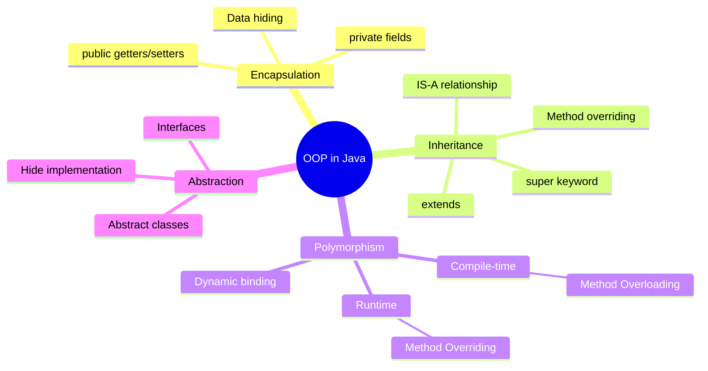

# 🧱 Java OOP Concepts — Complete Deep Dive

**Related**: [Collections Framework](/03-backend/java/02-collections-framework.md) · [Exception Handling](/03-backend/java/03-exception-handling.md) · [Design Patterns in Java](/03-backend/java/14-design-patterns-in-java.md)

---

## Table of Contents


- [The Big Picture](#-the-big-picture)
- [1. Encapsulation](#1-encapsulation)
- [2. Inheritance](#2-inheritance)
- [3. Polymorphism](#3-polymorphism)
- [4. Abstraction](#4-abstraction)
- [Access Modifiers Deep Dive](#-access-modifiers-deep-dive)
- [Association, Aggregation, Composition](#-association-aggregation-composition)
- [Object Lifecycle Flow](#-object-lifecycle-flow)
- [Interface vs Abstract Class](#-interface-vs-abstract-class)
- [SOLID Principles in Java](#-solid-principles-in-java)
- [Common Pitfalls](#-common-pitfalls)
- [Simplest Mental Model](#-simplest-mental-model)

---

## 🧭 The Big Picture


```text
                    ┌─────────────────────────────┐
                    │      OOP Principles         │
                    ├─────────────┬───────────────┤
                    │  WHAT       │    HOW        │
                    ├─────────────┼───────────────┤
                    │ Encapsulation│ Data Hiding  │
                    │ Inheritance  │ Code Reuse   │
                    │ Polymorphism │ One Name Many│
                    │             │  Behaviors   │
                    │ Abstraction  │ Hide Complexity│
                    └─────────────┴───────────────┘
```



---

## 1. Encapsulation


**Definition**: Bundling data (fields) and methods that operate on that data, restricting direct access.

### The Problem


```java
// ❌ BAD — no encapsulation
class BankAccount {
    double balance;  // anyone can modify directly
}

BankAccount acc = new BankAccount();
acc.balance = -1000;  // no protection!
```

### The Solution


```java
// ✅ GOOD — encapsulated
class BankAccount {
    private double balance;  // data hiding

    public BankAccount(double initialBalance) {
        if (initialBalance < 0) {
            throw new IllegalArgumentException("Balance cannot be negative");
        }
        this.balance = initialBalance;
    }

    public double getBalance() {
        return balance;
    }

    public void deposit(double amount) {
        if (amount <= 0) {
            throw new IllegalArgumentException("Deposit must be positive");
        }
        this.balance += amount;
    }

    public void withdraw(double amount) {
        if (amount <= 0) {
            throw new IllegalArgumentException("Amount must be positive");
        }
        if (amount > balance) {
            throw new IllegalStateException("Insufficient funds");
        }
        this.balance -= amount;
    }
}
```

### Flow: Encapsulation in Action


```text
External Code ──call──> deposit(100)
                            │
                            ▼
                    ┌───────────────┐
                    │  Validation   │
                    │  amount > 0 ? │
                    └───────┬───────┘
                            │ valid
                            ▼
                    ┌───────────────┐
                    │  this.balance │
                    │  += amount    │
                    └───────┬───────┘
                            │
                            ▼
                    ┌───────────────┐
                    │  return void  │
                    └───────────────┘
```

### Key Benefits


| Benefit | Explanation |
|---------|-------------|
| Data hiding | Fields are private, controlled via methods |
| Validation | Business rules enforced before state change |
| Maintainability | Internal impl changes don't break callers |
| Debugging | Single point of control for state mutations |

---

## 2. Inheritance


**Definition**: Creating a new class from an existing class. Child inherits fields and methods from parent.

### Syntax


```java
// Parent class
class Animal {
    protected String name;
    protected int age;

    public Animal(String name, int age) {
        this.name = name;
        this.age = age;
    }

    public void eat() {
        System.out.println(name + " is eating");
    }

    public void sleep() {
        System.out.println(name + " is sleeping");
    }
}

// Child class
class Dog extends Animal {
    private String breed;

    public Dog(String name, int age, String breed) {
        super(name, age);  // call parent constructor
        this.breed = breed;
    }

    // Override parent method
    @Override
    public void eat() {
        System.out.println(name + " the dog is eating kibble");
    }

    // Child-specific method
    public void bark() {
        System.out.println("Woof! Woof!");
    }
}
```

### Constructor Chain Flow


```text
new Dog("Rex", 3, "German Shepherd")
                │
                ▼
        ┌──────────────────┐
        │ Dog(String, int, │
        │ String)          │
        │ super(name, age) │──────┐
        └──────────────────┘      │
                                  ▼
                        ┌──────────────────┐
                        │ Animal(String,   │
                        │ int)             │
                        │ this.name = name │
                        │ this.age = age   │
                        └────────┬─────────┘
                                 │ returns
                                 ▼
        ┌──────────────────┐
        │ this.breed =     │
        │ breed            │
        └──────────────────┘
```

### Types of Inheritance


| Type | Java Support | Example |
|------|-------------|---------|
| Single | ✅ Yes | `class A extends B` |
| Multilevel | ✅ Yes | `class A extends B extends C` |
| Hierarchical | ✅ Yes | `class B extends A`, `class C extends A` |
| Multiple (classes) | ❌ No | Diamond Problem |
| Multiple (interfaces) | ✅ Yes | `class A implements X, Y, Z` |
| Hybrid | ❌ No | Combination of multiple + hierarchical |

### The Diamond Problem


```java
interface InterfaceA {
    default void doSomething() { System.out.println("A"); }
}

interface InterfaceB {
    default void doSomething() { System.out.println("B"); }
}

// Must resolve ambiguity
class MyClass implements InterfaceA, InterfaceB {
    @Override
    public void doSomething() {
        InterfaceA.super.doSomething();  // choose A
    }
}
```

---

## 3. Polymorphism


**Definition**: One interface, multiple implementations.

### Compile-Time (Method Overloading)


```java
class Calculator {
    public int add(int a, int b) {
        return a + b;
    }

    public int add(int a, int b, int c) {
        return a + b + c;
    }

    public double add(double a, double b) {
        return a + b;
    }
}

// Usage
Calculator calc = new Calculator();
calc.add(2, 3);        // calls int,int version
calc.add(2, 3, 4);     // calls int,int,int version
calc.add(2.5, 3.5);    // calls double,double version
```

### Runtime (Method Overriding)


```java
class Shape {
    double area() { return 0; }
}

class Circle extends Shape {
    private double radius;

    Circle(double radius) { this.radius = radius; }

    @Override
    double area() { return Math.PI * radius * radius; }
}

class Rectangle extends Shape {
    private double w, h;

    Rectangle(double w, double h) { this.w = w; this.h = h; }

    @Override
    double area() { return w * h; }
}

// Runtime polymorphism
Shape s1 = new Circle(5);
Shape s2 = new Rectangle(4, 6);

System.out.println(s1.area());  // 78.54 (Circle)
System.out.println(s2.area());  // 24.0 (Rectangle)
```

### Polymorphism Flow (Dynamic Binding)


```text
Shape s = new Circle(5);
s.area()

    │
    ▼
┌─────────────────────┐
│ Compiler checks:    │
│ Does Shape have     │
│ area() method?      │  → Yes (even if it returns 0)
└──────────┬──────────┘
           ▼
┌─────────────────────┐
│ JVM at runtime:     │
│ Check object type   │
│ (Circle)            │
│ Call Circle.area()  │  → Returns πr²
└─────────────────────┘
```

### Overloading vs Overriding


| Aspect | Overloading | Overriding |
|--------|-------------|------------|
| Name | Same | Same |
| Parameters | Must differ | Must match |
| Return type | Can differ | Same or covariant |
| Access modifier | Can change | Cannot reduce visibility |
| `static` | Can overload | Cannot override |
| `private` | Can overload | Cannot override |
| Binding | Compile-time (static) | Runtime (dynamic) |
| `@Override` | Not needed | Recommended |

---

## 4. Abstraction


**Definition**: Hiding implementation details, exposing only essential features.

### Abstract Class


```java
abstract class Database {
    protected String connectionString;

    public Database(String connectionString) {
        this.connectionString = connectionString;
    }

    // Concrete method
    public void connect() {
        System.out.println("Connecting to " + connectionString);
    }

    // Abstract method — must be implemented by subclass
    public abstract void executeQuery(String query);

    public abstract void close();
}

class MySQLDatabase extends Database {
    public MySQLDatabase(String connStr) {
        super(connStr);
    }

    @Override
    public void executeQuery(String query) {
        System.out.println("MySQL executing: " + query);
    }

    @Override
    public void close() {
        System.out.println("Closing MySQL connection");
    }
}

class PostgreSQLDatabase extends Database {
    public PostgreSQLDatabase(String connStr) {
        super(connStr);
    }

    @Override
    public void executeQuery(String query) {
        System.out.println("PostgreSQL executing: " + query);
    }

    @Override
    public void close() {
        System.out.println("Closing PostgreSQL connection");
    }
}
```

### Interface


```java
interface PaymentGateway {
    // Constants (implicitly public static final)
    double TRANSACTION_FEE = 0.02;

    // Abstract methods (implicitly public abstract)
    boolean processPayment(double amount, String currency);
    PaymentStatus getStatus(String transactionId);
    void refund(String transactionId);

    // Default method (Java 8+)
    default void logTransaction(String transactionId) {
        System.out.println("Transaction: " + transactionId);
    }

    // Static method (Java 8+)
    static PaymentGateway getDefault() {
        return new StripeGateway();
    }
}

class StripeGateway implements PaymentGateway {
    @Override
    public boolean processPayment(double amount, String currency) {
        // Stripe API logic
        return true;
    }

    @Override
    public PaymentStatus getStatus(String transactionId) {
        return PaymentStatus.SUCCESS;
    }

    @Override
    public void refund(String transactionId) {
        System.out.println("Stripe refund processed");
    }
}
```

### Abstract Class vs Interface


| Aspect | Abstract Class | Interface |
|--------|---------------|-----------|
| Keyword | `abstract class` | `interface` |
| Multiple inheritance | ❌ Single | ✅ Multiple |
| Constructors | ✅ Yes | ❌ No |
| Instance variables | ✅ Any type | ❌ Only static final |
| Methods | Abstract + concrete | Abstract + default + static |
| Access modifiers | All | `public` only (Java 8-), private (Java 9+) |
| State | Can hold state | No state |
| `final` methods | ✅ Yes | ❌ Not applicable |
| When to use | "IS-A" relationship, shared state | "CAN-DO" capability contract |

---

## 🔐 Access Modifiers Deep Dive


```text
                    ┌─────────────────────────────┐
                    │       Access Modifiers      │
                    ├────────┬────────┬───────────┤
                    │ Class  │ Package│ Subclass  │ World  │
                    ├────────┼────────┼───────────┼────────┤
     public         │   ✅   │   ✅   │    ✅    │   ✅  │
     protected      │   ✅   │   ✅   │    ✅    │   ❌  │
     default(none)  │   ✅   │   ✅   │    ❌    │   ❌  │
     private        │   ✅   │   ❌   │    ❌    │   ❌  │
                    └────────┴────────┴───────────┴────────┘
```

### Best Practices


```java
public class BestPractice {
    // Fields: private
    private String name;
    private int age;

    // Constructors: public
    public BestPractice(String name, int age) {
        this.name = name;
        this.age = age;
    }

    // Getters: public
    public String getName() { return name; }

    // Setters with validation: public
    public void setAge(int age) {
        if (age < 0 || age > 150) {
            throw new IllegalArgumentException("Invalid age");
        }
        this.age = age;
    }

    // Internal helpers: private
    private void validateState() {
        // internal validation logic
    }

    // Protected for subclasses: protected
    protected void doInternalLogic() {
        // subclasses can override
    }
}
```

---

## 🔗 Association, Aggregation, Composition


```text
Relationship Types:

Association          ────────  "uses a"
   │                              Student ────> Course
   │
   ▼
Aggregation          ◇───────  "has a" (weak)
   │                              Department ◇─── Employee
   │                              (Employee can exist without Department)
   │
   ▼
Composition          ◆───────  "has a" (strong)
                                    Car ◆── Engine
                                    (Engine cannot exist without Car)
```

| Type | Strength | Lifetime | Example |
|------|----------|----------|---------|
| Association | Weak | Independent | `class Student { Course[] courses; }` |
| Aggregation | Medium | Independent owner | `class Department { List<Employee> employees; }` |
| Composition | Strong | Same lifetime | `class Car { Engine engine; }` |

### Code Examples


```java
// ASSOCIATION — weak, no ownership
class Student {
    private String name;
    // Student knows about Course, but Course exists independently
    void attend(Course course) {
        System.out.println("Attending " + course.getName());
    }
}

// AGGREGATION — weak ownership
class Department {
    private String name;
    private List<Employee> employees;  // Employee can exist without Department

    public Department(String name) {
        this.name = name;
        this.employees = new ArrayList<>();
    }

    public void addEmployee(Employee emp) {
        employees.add(emp);  // emp created outside
    }
}

// COMPOSITION — strong ownership
class Car {
    private Engine engine;  // Engine created with Car, dies with Car

    public Car(String type) {
        this.engine = new Engine(type);  // Engine lifecycle tied to Car
    }

    // Inner class — tight coupling
    class Engine {
        private String type;

        Engine(String type) { this.type = type; }
        void start() { System.out.println(type + " engine started"); }
    }

    void start() { engine.start(); }
}
```

---

## 🔄 Object Lifecycle Flow


```text
                    ┌──────────────────────┐
                    │   Class Loading       │
                    │ (ClassLoader loads    │
                    │  .class bytecode)     │
                    └──────────┬───────────┘
                               │
                               ▼
                    ┌──────────────────────┐
                    │ Static Initialization│
                    │ (static blocks,      │
                    │  static fields)      │
                    └──────────┬───────────┘
                               │
                    ┌──────────┴───────────┐
                    │                      │
                    ▼                      ▼
        ┌──────────────────┐    ┌──────────────────┐
        │ new ClassName()  │    │ Class.forName()  │
        │ (explicit)       │    │ (reflection)     │
        └────────┬─────────┘    └────────┬─────────┘
                 │                       │
                 └──────────┬────────────┘
                            ▼
                    ┌──────────────────────┐
                    │ Memory Allocation    │
                    │ (heap: fields zero)  │
                    └──────────┬───────────┘
                               │
                    ┌──────────┴───────────┐
                    │                      │
                    ▼                      ▼
        ┌──────────────────┐    ┌──────────────────┐
        │ Instance Init    │    │ Constructor      │
        │ (instance vars,  │───>│ (initialization) │
        │  init blocks)    │    │                  │
        └──────────────────┘    └────────┬─────────┘
                                         │
                                         ▼
                    ┌──────────────────────┐
                    │   Object in Use      │
                    │ (methods called,     │
                    │  fields accessed)    │
                    └──────────┬───────────┘
                               │
                               ▼
                    ┌──────────────────────┐
                    │  Garbage Collected   │
                    │ (no more references) │
                    └──────────────────────┘
```

### Initialization Order


```java
class Demo {
    // 1. Static variables
    static int staticVar = initStatic();

    // 2. Static initializer block
    static {
        System.out.println("Static block");
    }

    // 3. Instance variables
    String name = "default";

    // 4. Instance initializer block
    {
        System.out.println("Instance block");
    }

    // 5. Constructor (last)
    public Demo(String name) {
        this.name = name;
        System.out.println("Constructor");
    }

    static int initStatic() {
        System.out.println("Static variable init");
        return 42;
    }
}
```

### `==` vs `.equals()` Flow


```text
String a = new String("hello");
String b = new String("hello");

a == b   ❌ false  (different memory addresses)
a.equals(b)  ✅ true  (same content)

┌─────────────────────────────────────┐
│             a (reference)           │
│         ┌─────────────────┐         │
│         │ 0x1234          │         │
│         └────────┬────────┘         │
│                  ▼                  │
│         ┌─────────────────┐         │
│         │ "hello"         │         │
│         │ (String object) │         │
│         └─────────────────┘         │
│                                     │
│             b (reference)           │
│         ┌─────────────────┐         │
│         │ 0x5678          │         │
│         └────────┬────────┘         │
│                  ▼                  │
│         ┌─────────────────┐         │
│         │ "hello"         │         │
│         │ (String object) │         │
│         └─────────────────┘         │
└─────────────────────────────────────┘
         a == b  → compare 0x1234 vs 0x5678 → false
         a.equals(b) → compare "hello" vs "hello" → true
```

---

## 📐 SOLID Principles in Java


### S — Single Responsibility


```java
// ❌ BAD — handles both reporting AND saving
class Invoice {
    void calculateTotal() { /* ... */ }
    void printToPDF() { /* ... */ }
    void saveToDatabase() { /* ... */ }
}

// ✅ GOOD — each class has one reason to change
class Invoice {
    void calculateTotal() { /* ... */ }
}
class InvoicePrinter {
    void printToPDF(Invoice invoice) { /* ... */ }
}
class InvoiceRepository {
    void save(Invoice invoice) { /* ... */ }
}
```

### O — Open/Closed


```java
// ❌ BAD — need to modify this to add new shapes
class AreaCalculator {
    double calculate(Object shape) {
        if (shape instanceof Circle) { /* ... */ }
        else if (shape instanceof Rectangle) { /* ... */ }
        // must add new else-if for every new shape
    }
}

// ✅ GOOD — open for extension, closed for modification
interface Shape {
    double area();
}

class Circle implements Shape {
    final double radius;
    Circle(double r) { this.radius = r; }
    public double area() { return Math.PI * radius * radius; }
}

class Rectangle implements Shape {
    final double w, h;
    Rectangle(double w, double h) { this.w = w; this.h = h; }
    public double area() { return w * h; }
}

// No modification needed — new shapes just implement Shape
class AreaCalculator {
    double totalArea(Shape[] shapes) {
        double total = 0;
        for (Shape s : shapes) total += s.area();
        return total;
    }
}
```

### L — Liskov Substitution


```java
// ❌ BAD — violates LSP
class Rectangle {
    private int w, h;
    void setWidth(int w) { this.w = w; }
    void setHeight(int h) { this.h = h; }
    int area() { return w * h; }
}

class Square extends Rectangle {
    @Override
    void setWidth(int w) {
        super.setWidth(w);
        super.setHeight(w);  // breaks expectation
    }

    @Override
    void setHeight(int h) {
        super.setHeight(h);
        super.setWidth(h);   // breaks expectation
    }
}

// ✅ GOOD — separate hierarchy
interface Shape { int area(); }

class Rectangle implements Shape {
    final int w, h;
    Rectangle(int w, int h) { this.w = w; this.h = h; }
    public int area() { return w * h; }
}

class Square implements Shape {
    final int side;
    Square(int side) { this.side = side; }
    public int area() { return side * side; }
}
```

### I — Interface Segregation


```java
// ❌ BAD — fat interface
interface Worker {
    void work();
    void eat();
    void sleep();
}

class Robot implements Worker {
    public void work() { /* OK */ }
    public void eat() { throw new UnsupportedOperationException(); }  // ❌
    public void sleep() { throw new UnsupportedOperationException(); }  // ❌
}

// ✅ GOOD — segregated interfaces
interface Workable { void work(); }
interface Eatable { void eat(); }
interface Sleepable { void sleep(); }

class Human implements Workable, Eatable, Sleepable {
    public void work() { /* ... */ }
    public void eat() { /* ... */ }
    public void sleep() { /* ... */ }
}

class Robot implements Workable {
    public void work() { /* ... */ }
}
```

### D — Dependency Inversion


```java
// ❌ BAD — high-level depends on low-level concrete class
class EmailService {
    void send(String msg) { /* SMTP logic */ }
}

class Notification {
    private EmailService email = new EmailService();  // concrete dependency
    void send(String msg) { email.send(msg); }
}

// ✅ GOOD — both depend on abstraction
interface MessageSender {
    void send(String message);
}

class EmailSender implements MessageSender {
    public void send(String msg) { /* SMTP logic */ }
}

class SMSSender implements MessageSender {
    public void send(String msg) { /* SMS logic */ }
}

class Notification {
    private final MessageSender sender;  // depends on abstraction

    Notification(MessageSender sender) {  // dependency injection
        this.sender = sender;
    }

    void send(String msg) { sender.send(msg); }
}

// Usage
Notification notif = new Notification(new EmailSender());
Notification notif2 = new Notification(new SMSSender());
```

---

## ⚠️ Common Pitfalls


| Pitfall | Issue | Fix |
|---------|-------|-----|
| Public fields | No encapsulation | Always `private` |
| `==` with Strings | Reference comparison | `.equals()` for content |
| Forgetting `super()` | Constructor chain broken | Explicit `super()` call |
| Covariant arrays | Runtime `ArrayStoreException` | Use generics instead |
| Overriding without `@Override` | Typo creates overload instead | Always use `@Override` |
| Protected = package+children | Overexposure | Prefer private + public API |
| Deep inheritance trees | Fragile base class | Favor composition over inheritance |
| Mutable fields in `hashCode()` | Broken collections | Use immutable fields |

---

## 🧠 Simplest Mental Model


```text
ENCAPSULATION  =  Your phone. You interact with screen + buttons (public API).
                   The battery, circuits, wires (private internals) are hidden.

INHERITANCE    =  Child inherits traits from parent. Same DNA base,
                   but with own unique features added.

POLYMORPHISM   =  Same remote control button "Power".
                   Press it on TV → TV turns on.
                   Press it on AC → AC turns on.
                   Same action, different behavior.

ABSTRACTION    =  Driving a car. You use steering wheel + pedals (interface).
                   You don't need to know how the engine works internally.
```

---

**Next**: [Collections Framework](/03-backend/java/02-collections-framework.md) — Lists, Sets, Maps, Queues, Trees

## Related

- [Jvm Performance](/18-performance-engineering/jvm-tuning/01-jvm-performance.md)
- [Cap Consistency](/09-distributed-systems/01-cap-consistency.md)
- [Consensus Replication](/09-distributed-systems/01-consensus-replication.md)
- [Consensus Raft](/09-distributed-systems/02-consensus-raft.md)
- [Distributed Transactions](/09-distributed-systems/02-distributed-transactions.md)
- [Distributed Caching](/09-distributed-systems/03-distributed-caching.md)

---

## Interactive Component: Java Heap Memory Observability

<div style="padding:16px;background:#0b0e14;border:1px solid #1e2a3a;border-radius:8px">
  <style>.obs-title{color:#00d4ff;font-family:monospace;font-size:14px;font-weight:bold;margin-bottom:16px}.obs-grid{display:grid;grid-template-columns:repeat(auto-fit, minmax(150px, 1fr));gap:12px}.obs-card{padding:12px;background:#1a2332;border:1px solid #1e3a5f;border-radius:4px;display:flex;flex-direction:column;align-items:center;transition:all 0.3s}.obs-card:hover{border-color:#00d4ff;box-shadow:0 0 8px rgba(0, 212, 255, 0.3)}.obs-label{color:#a3aab8;font-family:monospace;font-size:11px;text-transform:uppercase;letter-spacing:0.5px;margin-bottom:8px}.obs-value{font-family:monospace;font-size:20px;font-weight:bold;margin-bottom:4px;letter-spacing:0.5px}.obs-unit{color:#a3aab8;font-family:monospace;font-size:10px;text-transform:uppercase}.metric-healthy{color:#34d399}.metric-warning{color:#fbbf24}.metric-critical{color:#ef4444}</style>
  <div class="obs-title">JVM Heap Memory Metrics</div>
  <div class="obs-grid">
    <div class="obs-card">
      <div class="obs-label">Heap Used</div>
      <div class="obs-value metric-warning">712</div>
      <div class="obs-unit">MB</div>
    </div>
    <div class="obs-card">
      <div class="obs-label">Heap Max</div>
      <div class="obs-value metric-healthy">1024</div>
      <div class="obs-unit">MB</div>
    </div>
    <div class="obs-card">
      <div class="obs-label">GC Pause</div>
      <div class="obs-value metric-healthy">85</div>
      <div class="obs-unit">ms</div>
    </div>
    <div class="obs-card">
      <div class="obs-label">Eden Usage</div>
      <div class="obs-value metric-healthy">45</div>
      <div class="obs-unit">%</div>
    </div>
  </div>
</div>


---

## Interactive Component: Exception Cascade Simulator

<div style="padding:16px;background:#0b0e14;border:1px solid #1e2a3a;border-radius:8px">
  <style>.cascade-title{color:#00d4ff;font-family:monospace;font-size:14px;font-weight:bold;margin-bottom:16px}.cascade-stages{display:flex;flex-direction:column;gap:12px;margin-bottom:16px}.cascade-stage{display:flex;align-items:center;gap:12px}.cascade-label{color:#e3eaf0;font-family:monospace;font-size:12px;min-width:120px}.cascade-indicator{width:24px;height:24px;border-radius:4px;background:#34d399;border:2px solid #22c55e;transition:all 0.3s}.cascade-indicator.failing{background:#ef4444;border-color:#dc2626;box-shadow:0 0 12px #ef4444;animation:cascade-fail 0.6s ease-out}@keyframes cascade-fail{0%{transform:scale(1);opacity:1}100%{transform:scale(1.2);opacity:0.8}}.cascade-controls{display:flex;gap:8px;flex-wrap:wrap}.cascade-button{padding:8px 16px;border:1px solid #00d4ff;background:#1e3a5f;color:#00d4ff;border-radius:4px;cursor:pointer;font-family:monospace;font-size:12px;transition:all 0.2s}.cascade-button:hover{background:#2a5a8f;box-shadow:0 0 8px #00d4ff}</style>
  <div class="cascade-title">Exception Stack Unwinding Cascade</div>
  <div class="cascade-stages">
    <div class="cascade-stage"><span class="cascade-label">Method A</span><div class="cascade-indicator" data-stage="a"></div></div>
    <div class="cascade-stage"><span class="cascade-label">Method B (try)</span><div class="cascade-indicator" data-stage="b"></div></div>
    <div class="cascade-stage"><span class="cascade-label">Method C (finally)</span><div class="cascade-indicator" data-stage="c"></div></div>
    <div class="cascade-stage"><span class="cascade-label">Stack Unwound</span><div class="cascade-indicator" data-stage="d"></div></div>
  </div>
  <div class="cascade-controls">
    <button class="cascade-button" onclick="throwException()">Throw Exception</button>
    <button class="cascade-button" onclick="resetException()">Reset</button>
  </div>
  <script>
    function throwException() {
      const stages = ['a', 'b', 'c', 'd'];
      let delay = 0;
      stages.forEach((id) => {
        setTimeout(() => {
          document.querySelector('[data-stage="'+id+'"]').classList.add('failing');
        }, delay);
        delay += 300;
      });
    }
    function resetException() {
      document.querySelectorAll('[data-stage]').forEach(s => s.classList.remove('failing'));
    }
  </script>
</div>

