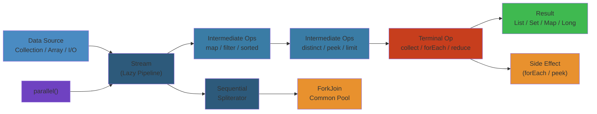

# ➡️ Java Streams & Lambda — Complete Deep Dive

**Related**: [Collections Framework](/03-backend/java/02-collections-framework.md) · [Generics](/03-backend/java/08-generics.md) · [Exception Handling](/03-backend/java/03-exception-handling.md)

---




## Table of Contents


- [Lambda Expressions](#-lambda-expressions)
- [1. Lambda Syntax](#1-lambda-syntax)
- [2. Functional Interfaces](#2-functional-interfaces)
- [3. Method & Constructor References](#3-method--constructor-references)
- [4. Stream API Overview](#4-stream-api-overview)
- [5. Stream Creation](#5-stream-creation)
- [6. Intermediate Operations](#6-intermediate-operations)
- [7. Terminal Operations](#7-terminal-operations)
- [8. Collectors](#8-collectors)
- [9. Parallel Streams](#9-parallel-streams)
- [10. Stream Internals & Lazy Evaluation](#10-stream-internals--lazy-evaluation)
- [Common Pitfalls](#-common-pitfalls)
- [Simplest Mental Model](#-simplest-mental-model)

---

## 🧭 Lambda Expressions


### What is a Lambda?


```text
A lambda is an anonymous function — a block of code you can pass around.

Before Java 8:
  button.addActionListener(new ActionListener() {
      @Override
      public void actionPerformed(ActionEvent e) {
          System.out.println("Clicked!");
      }
  });

With Java 8+:
  button.addActionListener(e -> System.out.println("Clicked!"));
```

---

## 1. Lambda Syntax


### Full Syntax


```java
// (parameters) -> { body }
(int a, int b) -> { return a + b; }

// Single parameter → omit parentheses
a -> { return a * 2; }

// Single expression → omit braces and return
a -> a * 2

// No parameters
() -> System.out.println("Hello")

// Multiple lines → braces required
(String s) -> {
    String upper = s.toUpperCase();
    System.out.println(upper);
    return upper;
}
```

### Type Inference


```java
// Compiler infers types from context
// Variable assignment
Comparator<String> byLength = (s1, s2) -> Integer.compare(s1.length(), s2.length());

// Method parameter
List<String> list = Arrays.asList("a", "bb", "ccc");
list.sort((a, b) -> Integer.compare(a.length(), b.length()));

// Can specify types explicitly if needed
list.sort((String a, String b) -> Integer.compare(a.length(), b.length()));
```

### Variable Capture


```java
// Lambdas can capture effectively-final variables
public class CaptureExample {
    public void process() {
        int base = 10;  // effectively final (not modified)
        // base = 20;   // would NOT compile if uncommented

        Runnable r = () -> {
            int result = base * 2;  // captures base
            System.out.println(result);
        };
        r.run();
    }

    public void processWithMutation() {
        // Capture mutable objects
        List<Integer> results = new ArrayList<>();

        Runnable r = () -> {
            results.add(42);  // OK — object is mutable, reference is final
            System.out.println(results);
        };
        r.run();
    }

    // Capture 'this' (refers to enclosing instance)
    private int instanceVar = 5;

    public void method() {
        Runnable r = () -> {
            System.out.println(this.instanceVar);  // captures 'this'
        };
        r.run();
    }
}
```

---

## 2. Functional Interfaces


### Core Functional Interfaces


| Interface | Input | Output | Abstract Method |
|-----------|-------|--------|-----------------|
| `Predicate<T>` | T | boolean | `test(T)` |
| `Consumer<T>` | T | void | `accept(T)` |
| `Function<T,R>` | T | R | `apply(T)` |
| `Supplier<T>` | None | T | `get()` |
| `UnaryOperator<T>` | T | T | `apply(T)` |
| `BinaryOperator<T>` | T,T | T | `apply(T,T)` |

### Specialized Variants


```java
// Primitive specializations (avoid boxing)
IntPredicate       // int → boolean
LongConsumer       // long → void
DoubleFunction<R>  // double → R
ToIntFunction<T>   // T → int
IntUnaryOperator   // int → int
ObjIntConsumer<T>  // (T, int) → void

// Bi-variants (2 inputs)
BiPredicate<T, U>    // (T, U) → boolean
BiConsumer<T, U>     // (T, U) → void
BiFunction<T, U, R>  // (T, U) → R
```

### Examples


```java
// Predicate — filtering
Predicate<String> isEmpty = s -> s.isEmpty();
Predicate<String> notNull = Objects::nonNull;
Predicate<String> combined = notNull.and(isEmpty.negate());

// Consumer — side effects
Consumer<String> print = System.out::println;
Consumer<String> log = s -> logger.info(s);
Consumer<String> both = print.andThen(log);

// Function — transformation
Function<String, Integer> toLength = String::length;
Function<Integer, String> toString = Object::toString;
Function<String, String> composed = toString.compose(toLength);

// Supplier — lazy generation
Supplier<Double> random = Math::random;
Supplier<String> config = () -> loadFromFile("config.txt");

// Operator — same type in and out
UnaryOperator<String> toUpper = String::toUpperCase;
BinaryOperator<Integer> max = Integer::max;
```

### @FunctionalInterface Annotation


```java
// Compiler-enforced — interface has exactly ONE abstract method
@FunctionalInterface
interface Transformer<T, R> {
    R transform(T input);
    // default methods OK
    default void log() { System.out.println("Transform called"); }
    // static methods OK
    static <T> Transformer<T, T> identity() { return t -> t; }
}

// Usage
Transformer<String, Integer> length = s -> s.length();
int len = length.transform("hello");  // 5
```

---

## 3. Method & Constructor References


### Types


```text
┌────────────────────────────────────────────────────────────────┐
│                    Method References                            │
├──────────────┬──────────────────────┬──────────────────────────┤
│ Type         │ Syntax               │ Example                  │
├──────────────┼──────────────────────┼──────────────────────────┤
│ Static       │ Class::staticMethod  │ Integer::parseInt        │
│ Instance     │ instance::method     │ list::add                │
│ (bound)      │                      │                          │
│ Instance     │ Class::instanceMethod│ String::length           │
│ (unbound)    │                      │                          │
│ Constructor  │ Class::new           │ ArrayList::new           │
│ Array        │ Type[]::new          │ int[]::new              │
└──────────────┴──────────────────────┴──────────────────────────┘
```

### Examples


```java
// Static method reference
Function<String, Integer> parser = Integer::parseInt;
// Equivalent: s -> Integer.parseInt(s)

// Bound instance reference (specific object)
List<String> list = new ArrayList<>();
Consumer<String> adder = list::add;
// Equivalent: s -> list.add(s)

// Unbound instance reference (class type)
Function<String, Integer> length = String::length;
// Equivalent: s -> s.length()
BiPredicate<String, String> equals = String::equals;
// Equivalent: (a, b) -> a.equals(b)

// Constructor reference
Supplier<List<String>> listCreator = ArrayList::new;
// Equivalent: () -> new ArrayList<>()
Function<String, StringBuilder> sbCreator = StringBuilder::new;
// Equivalent: s -> new StringBuilder(s)

// Array constructor reference
IntFunction<int[]> arrayCreator = int[]::new;
// Equivalent: size -> new int[size]
```

---

## 4. Stream API Overview


### What is a Stream?


```text
A sequence of elements supporting sequential and parallel
aggregate operations.

NOT a data structure → doesn't store elements.
Pulls from a source (collection, array, generator, I/O).

Pipeline: source → 0+ intermediate ops (lazy) → terminal op (eager)

                    ┌─────────────────────────────┐
                    │     Stream Pipeline          │
                    ├─────────────────────────────┤
                    │                             │
                    │  ┌─────────┐                │
                    │  │ Source  │                │
                    │  │ (data)  │                │
                    │  └────┬────┘                │
                    │       │                     │
                    │       ▼                     │
                    │  ┌─────────┐                │
                    │  │ filter  │  lazy          │
                    │  └────┬────┘                │
                    │       │                     │
                    │       ▼                     │
                    │  ┌─────────┐                │
                    │  │  map    │  lazy          │
                    │  └────┬────┘                │
                    │       │                     │
                    │       ▼                     │
                    │  ┌─────────┐                │
                    │  │ sorted │  lazy           │
                    │  └────┬────┘                │
                    │       │                     │
                    │       ▼                     │
                    │  ┌─────────┐                │
                    │  │ collect │  TERMINAL!     │
                    │  └─────────┘  (data flows)  │
                    │                             │
                    └─────────────────────────────┘
```

---

## 5. Stream Creation


### From Collections


```java
List<String> list = Arrays.asList("a", "b", "c");
Stream<String> stream = list.stream();             // sequential
Stream<String> parallel = list.parallelStream();    // parallel

Set<Integer> set = new HashSet<>(Arrays.asList(1, 2, 3));
Stream<Integer> setStream = set.stream();

Map<String, Integer> map = new HashMap<>();
Stream<Map.Entry<String, Integer>> entryStream = map.entrySet().stream();
Stream<String> keyStream = map.keySet().stream();
Stream<Integer> valueStream = map.values().stream();
```

### From Arrays


```java
String[] arr = {"a", "b", "c"};
Stream<String> stream = Arrays.stream(arr);
Stream<String> partial = Arrays.stream(arr, 0, 2);  // "a", "b"

// Primitive arrays
int[] nums = {1, 2, 3};
IntStream intStream = Arrays.stream(nums);
```

### From Values


```java
Stream<String> stream = Stream.of("a", "b", "c");
Stream<Integer> empty = Stream.empty();
Stream<Integer> single = Stream.of(42);
```

### From Ranges


```java
IntStream range = IntStream.range(0, 10);      // 0..9
IntStream closedRange = IntStream.rangeClosed(0, 10); // 0..10

LongStream longRange = LongStream.range(0L, 100L);
```

### From Files


```java
// Stream of lines from file
try (Stream<String> lines = Files.lines(Paths.get("file.txt"))) {
    lines.filter(l -> !l.isEmpty())
         .forEach(System.out::println);
} catch (IOException e) {
    e.printStackTrace();
}
```

### From Generators


```java
// Infinite stream — use with limit!
Stream<Double> randoms = Stream.generate(Math::random);
Stream<Integer> evens = Stream.iterate(0, n -> n + 2);

// Java 9+: iterate with predicate (finite)
Stream<Integer> numbers = Stream.iterate(0, n -> n < 100, n -> n + 2);

// Builder
Stream<String> built = Stream.<String>builder()
    .add("a")
    .add("b")
    .add("c")
    .build();
```

### Primitive Streams


| Type | Stream | IntStream | LongStream | DoubleStream |
|------|--------|-----------|------------|--------------|
| Element | T | int | long | double |
| Average | ❌ | `average()` | `average()` | `average()` |
| Sum | ❌ | `sum()` | `sum()` | `sum()` |
| Summary | ❌ | `summaryStatistics()` | Same | Same |

---

## 6. Intermediate Operations


### filter


```java
List<Integer> numbers = Arrays.asList(1, 2, 3, 4, 5, 6);

List<Integer> evens = numbers.stream()
    .filter(n -> n % 2 == 0)
    .collect(Collectors.toList());  // [2, 4, 6]

// With Predicate composition
Predicate<Integer> isEven = n -> n % 2 == 0;
Predicate<Integer> isPositive = n -> n > 0;

numbers.stream()
    .filter(isEven.and(isPositive))
    .forEach(System.out::println);
```

### map


```java
List<String> words = Arrays.asList("hello", "world", "java");

List<Integer> lengths = words.stream()
    .map(String::length)
    .collect(Collectors.toList());  // [5, 5, 4]

List<String> upper = words.stream()
    .map(String::toUpperCase)
    .collect(Collectors.toList());  // [HELLO, WORLD, JAVA]
```

### flatMap


```java
// Flatten nested structures
List<List<Integer>> nested = Arrays.asList(
    Arrays.asList(1, 2),
    Arrays.asList(3, 4),
    Arrays.asList(5, 6)
);

List<Integer> flattened = nested.stream()
    .flatMap(Collection::stream)
    .collect(Collectors.toList());  // [1, 2, 3, 4, 5, 6]

// Split strings into words
List<String> sentences = Arrays.asList("Hello World", "Java Streams", "Flat Map");

List<String> words = sentences.stream()
    .flatMap(s -> Arrays.stream(s.split(" ")))
    .collect(Collectors.toList());  // [Hello, World, Java, Streams, Flat, Map]

// flatMap with Optional (Java 9+)
List<Optional<String>> optionals = Arrays.asList(
    Optional.of("a"),
    Optional.empty(),
    Optional.of("b")
);

List<String> values = optionals.stream()
    .flatMap(Optional::stream)
    .collect(Collectors.toList());  // [a, b]
```

### distinct, sorted, peek


```java
List<Integer> numbers = Arrays.asList(3, 1, 4, 1, 5, 9, 2, 6, 5, 3, 5);

// distinct — removes duplicates
List<Integer> distinct = numbers.stream()
    .distinct()
    .collect(Collectors.toList());  // [3, 1, 4, 5, 9, 2, 6]

// sorted
List<Integer> sortedAsc = numbers.stream()
    .sorted()
    .collect(Collectors.toList());  // [1, 1, 2, 3, 3, 4, 5, 5, 5, 6, 9]

List<Integer> sortedDesc = numbers.stream()
    .sorted(Comparator.reverseOrder())
    .collect(Collectors.toList());  // [9, 6, 5, 5, 5, 4, 3, 3, 2, 1, 1]

// peek — for debugging (intermediate consumer)
List<Integer> debugged = numbers.stream()
    .filter(n -> n > 3)
    .peek(n -> System.out.println("After filter: " + n))
    .map(n -> n * 2)
    .peek(n -> System.out.println("After map: " + n))
    .collect(Collectors.toList());
```

### limit, skip, takeWhile, dropWhile


```java
List<Integer> numbers = Arrays.asList(1, 2, 3, 4, 5, 6, 7, 8, 9, 10);

List<Integer> first3 = numbers.stream()
    .limit(3)
    .collect(Collectors.toList());  // [1, 2, 3]

List<Integer> after3 = numbers.stream()
    .skip(3)
    .collect(Collectors.toList());  // [4, 5, 6, 7, 8, 9, 10]

// Java 9+: takeWhile — take while condition is true
List<Integer> whileLess6 = numbers.stream()
    .takeWhile(n -> n < 6)
    .collect(Collectors.toList());  // [1, 2, 3, 4, 5]

// Java 9+: dropWhile — drop while condition is true, then take rest
List<Integer> dropped = numbers.stream()
    .dropWhile(n -> n < 6)
    .collect(Collectors.toList());  // [6, 7, 8, 9, 10]
```

### Intermediate Operation Summary


| Operation | Purpose | Returns |
|-----------|---------|---------|
| `filter(Predicate)` | Select elements matching condition | Stream<T> |
| `map(Function)` | Transform elements | Stream<R> |
| `flatMap(Function)` | Flatten nested streams | Stream<R> |
| `distinct()` | Remove duplicates (via equals) | Stream<T> |
| `sorted()`/`sorted(Comparator)` | Sort elements | Stream<T> |
| `peek(Consumer)` | Debug, side effect | Stream<T> |
| `limit(long)` | Truncate to size | Stream<T> |
| `skip(long)` | Discard first N | Stream<T> |
| `takeWhile(Predicate)` (9+) | Take while true | Stream<T> |
| `dropWhile(Predicate)` (9+) | Discard while true | Stream<T> |
| `mapToInt`/`mapToLong`/`mapToDouble` | Map to primitive | IntStream etc. |

---

## 7. Terminal Operations


### forEach / forEachOrdered


```java
// forEach — order NOT guaranteed for parallel streams
Stream.of("a", "b", "c").forEach(System.out::println);

// forEachOrdered — guaranteed order (even in parallel)
Stream.of("a", "b", "c").parallel()
    .forEachOrdered(System.out::println);  // always a, b, c
```

### collect


```java
List<String> result = stream.collect(Collectors.toList());
List<String> result = stream.collect(Collectors.toUnmodifiableList()); // Java 10+
Set<String> set = stream.collect(Collectors.toSet());
Map<K, V> map = stream.collect(Collectors.toMap(keyMapper, valueMapper));
```

### reduce


```java
List<Integer> numbers = Arrays.asList(1, 2, 3, 4, 5);

// Sum with initial value
int sum = numbers.stream()
    .reduce(0, Integer::sum);  // 15 (0+1+2+3+4+5)

// Optional result (no identity)
Optional<Integer> sumOpt = numbers.stream()
    .reduce(Integer::sum);  // Optional[15]

// Max
Optional<Integer> max = numbers.stream()
    .reduce(Integer::max);  // Optional[5]

// String concatenation
String concat = Stream.of("a", "b", "c")
    .reduce("", (a, b) -> a + b);  // "abc"
```

### min / max / count


```java
Optional<Integer> min = numbers.stream()
    .min(Integer::compareTo);

Optional<Integer> max = numbers.stream()
    .max(Comparator.naturalOrder());

long count = numbers.stream()
    .filter(n -> n > 2)
    .count();
```

### anyMatch / allMatch / noneMatch


```java
List<Integer> numbers = Arrays.asList(2, 4, 6, 8, 10);

boolean anyEven = numbers.stream().anyMatch(n -> n % 2 == 0);  // true
boolean allEven = numbers.stream().allMatch(n -> n % 2 == 0);  // true
boolean noneOdd = numbers.stream().noneMatch(n -> n % 2 == 1); // true
```

### findFirst / findAny


```java
List<Integer> numbers = Arrays.asList(1, 2, 3, 4, 5);

Optional<Integer> first = numbers.stream()
    .filter(n -> n > 3)
    .findFirst();  // Optional[4]

Optional<Integer> any = numbers.parallelStream()
    .filter(n -> n > 3)
    .findAny();  // Optional[4 or 5] (non-deterministic in parallel!)
```

### toArray


```java
Object[] objArr = stream.toArray();
String[] strArr = stream.toArray(String[]::new);
Integer[] intArr = stream.toArray(Integer[]::new);
```

### Primitive Terminal Operations


```java
IntStream is = IntStream.range(1, 6);

is.sum();         // 15
is.average();     // OptionalDouble[3.0]
is.min();         // OptionalInt[1]
is.max();         // OptionalInt[5]

IntSummaryStatistics stats = IntStream.range(1, 6)
    .summaryStatistics();
// stats.getCount(), getSum(), getMin(), getMax(), getAverage()
```

---

## 8. Collectors


### toList / toSet / toMap


```java
// toList
List<String> list = stream.collect(Collectors.toList());
List<String> unmodifiable = stream.collect(Collectors.toUnmodifiableList()); // 10+

// toSet
Set<String> set = stream.collect(Collectors.toSet());

// toMap
Map<Integer, String> map = stream.collect(
    Collectors.toMap(String::length, Function.identity(), (a, b) -> a)
);

// toMap with specific Map type
stream.collect(Collectors.toMap(
    String::length,
    Function.identity(),
    (a, b) -> a,  // merge function for duplicates
    TreeMap::new   // map supplier
));
```

### joining


```java
String joined = Stream.of("a", "b", "c")
    .collect(Collectors.joining());  // "abc"

String withCommas = Stream.of("a", "b", "c")
    .collect(Collectors.joining(", "));  // "a, b, c"

String wrapped = Stream.of("a", "b", "c")
    .collect(Collectors.joining(", ", "[", "]"));  // "[a, b, c]"
```

### groupingBy


```java
List<String> words = Arrays.asList(
    "apple", "banana", "apricot", "blueberry", "cherry"
);

// Group by first letter
Map<Character, List<String>> byFirstLetter = words.stream()
    .collect(Collectors.groupingBy(s -> s.charAt(0)));
// {a=[apple, apricot], b=[banana, blueberry], c=[cherry]}

// Group with downstream collector
Map<Character, Long> countByFirstLetter = words.stream()
    .collect(Collectors.groupingBy(
        s -> s.charAt(0),
        Collectors.counting()
    ));
// {a=2, b=2, c=1}

// Group with value transformation
Map<Character, List<Integer>> lengthsByFirst = words.stream()
    .collect(Collectors.groupingBy(
        s -> s.charAt(0),
        Collectors.mapping(String::length, Collectors.toList())
    ));
// {a=[5, 7], b=[7, 9], c=[6]}

// Group with sorting
Map<Character, List<String>> sortedGroups = words.stream()
    .collect(Collectors.groupingBy(
        s -> s.charAt(0),
        TreeMap::new,  // sorted map
        Collectors.toList()
    ));
```

### partitioningBy


```java
List<Integer> numbers = Arrays.asList(1, 2, 3, 4, 5, 6);

Map<Boolean, List<Integer>> partitioned = numbers.stream()
    .collect(Collectors.partitioningBy(n -> n % 2 == 0));
// {false=[1, 3, 5], true=[2, 4, 6]}

// Partition with downstream
Map<Boolean, Long> countByParity = numbers.stream()
    .collect(Collectors.partitioningBy(
        n -> n % 2 == 0,
        Collectors.counting()
    ));
// {false=3, true=3}
```

### summarizing / averaging / summing


```java
IntSummaryStatistics stats = numbers.stream()
    .collect(Collectors.summarizingInt(Integer::intValue));

Double avg = numbers.stream()
    .collect(Collectors.averagingInt(Integer::intValue));  // 3.5

Integer sum = numbers.stream()
    .collect(Collectors.summingInt(Integer::intValue));  // 21
```

### Custom Collector


```java
// Custom collector: collect into ArrayList
Collector<String, ?, List<String>> toArrayList = Collector.of(
    ArrayList::new,         // supplier: create container
    ArrayList::add,         // accumulator: add element
    (left, right) -> {      // combiner: merge containers (parallel)
        left.addAll(right);
        return left;
    },
    Collector.Characteristics.IDENTITY_FINISH  // finisher is identity
);

List<String> result = stream.collect(toArrayList);
```

---

## 9. Parallel Streams


### How Parallel Streams Work


```text
                    ┌─────────────────────┐
                    │   Stream Source      │
                    │   [1,2,3,4,5,6,7,8] │
                    └──────────┬──────────┘
                               │
                    ┌──────────┴──────────┐
                    │    Spliterator       │
                    │  split into chunks   │
                    └─┬─────┬──────┬──────┘
                      │     │      │
              ┌───────┘     │      └───────┐
              ▼             ▼              ▼
        ┌──────────┐  ┌──────────┐  ┌──────────┐
        │ ForkJoin │  │ ForkJoin │  │ ForkJoin │
        │ Pool     │  │ Pool     │  │ Pool     │
        │ [1,2]    │  │ [3,4]    │  │ [5,6,7,8] │
        └────┬─────┘  └────┬─────┘  └────┬─────┘
             │             │             │
             ▼             ▼             ▼
        ┌──────────┐  ┌──────────┐  ┌──────────┐
        │ filter   │  │ filter   │  │ filter   │
        │ map      │  │ map      │  │ map      │
        │ reduce   │  │ reduce   │  │ reduce   │
        └────┬─────┘  └────┬─────┘  └────┬─────┘
             │             │             │
             └──────┬──────┴──────┬──────┘
                    │             │
                    ▼             ▼
              ┌─────────────────────────┐
              │    Combine results      │
              │    (combiner function)  │
              └─────────────────────────┘
```

### When to Use Parallel Streams


```java
// GOOD: large dataset, independent operations, CPU-intensive
long sum = LongStream.range(0, 10_000_000)
    .parallel()
    .filter(n -> n % 2 == 0)
    .sum();  // ~2x faster

// BAD: small dataset
IntStream.range(0, 100)
    .parallel()  // overhead > benefit
    .forEach(System.out::println);

// BAD: blocking operations
IntStream.range(0, 10)
    .parallel()
    .forEach(i -> {
        Thread.sleep(1000);  // blocks all pool threads!
    });

// BAD: non-thread-safe state
List<Integer> result = new ArrayList<>();  // NOT thread-safe!
IntStream.range(0, 100)
    .parallel()
    .forEach(i -> result.add(i));  // race condition!

// GOOD: thread-safe collector
List<Integer> result = IntStream.range(0, 100)
    .parallel()
    .boxed()
    .collect(Collectors.toList());  // thread-safe
```

### Parallel Stream Rules


```text
✓ Use when:
  • Large dataset (>10k elements)
  • CPU-intensive operations
  • Independent operations (no shared mutable state)
  • Stream operations are associative (for reduce)

✗ Avoid when:
  • Small dataset (overhead dominates)
  • I/O or blocking operations
  • Shared mutable state
  • Operations with non-associative combine function
  • Ordered operations that require global order (findFirst)
  • Nested parallel streams (pool starvation)
```

---

## 10. Stream Internals & Lazy Evaluation


### Pipeline Internal Flow


```java
List<String> result = stream
    .filter(s -> s.length() > 3)
    .map(String::toUpperCase)
    .limit(2)
    .collect(Collectors.toList());
```

```text
Internal Execution (NOT collecting all then processing):

Stream elements: ["a", "hello", "be", "world", "java"]

Step-by-step (one element at a time):

element "a":
  filter: "a".length() > 3? → false → SKIP

element "hello":
  filter: "hello".length() > 3? → true
  map: "hello".toUpperCase() → "HELLO"
  limit: count=1 ≤2 → PASS
  collect: add to result

element "be":
  filter: "be".length() > 3? → false → SKIP

element "world":
  filter: "world".length() > 3? → true
  map: "world".toUpperCase() → "WORLD"
  limit: count=2 ≤2 → PASS
  collect: add to result

element "java":
  limit: count=3 >2 → STOP (don't even filter!)
```

### Lazy Evaluation Proof


```java
// Lazy: nothing printed until terminal operation
Stream<String> stream = Stream.of("a", "b", "c")
    .filter(s -> {
        System.out.println("filter: " + s);
        return s.length() > 0;
    })
    .map(s -> {
        System.out.println("map: " + s);
        return s.toUpperCase();
    });

System.out.println("Stream created — no ops executed yet!");

// Terminal operation triggers everything
List<String> result = stream.collect(Collectors.toList());

// Output:
// Stream created — no ops executed yet!
// filter: a
// map: a
// filter: b
// map: b
// filter: c
// map: c
```

### Short-circuiting


```java
// Operations that can terminate early:
// limit(), findFirst(), findAny(), anyMatch(), allMatch(), noneMatch()

// Example — findFirst short-circuits
Optional<String> first = Stream.of("a", "bb", "ccc", "dddd")
    .filter(s -> {
        System.out.println("Checking: " + s);
        return s.length() > 1;
    })
    .findFirst();

// Output (only processes until first match):
// Checking: a
// Checking: bb
// result: Optional[bb]

// allMatch can also short-circuit
boolean allEven = Stream.of(2, 4, 5, 6)
    .allMatch(n -> {
        System.out.println("Checking: " + n);
        return n % 2 == 0;
    });
// Output:
// Checking: 2
// Checking: 4
// Checking: 5  → false, stops here
```

### Spliterator


```java
// Spliterator is the internal engine for stream traversal + splitting
// For parallel streams, split() divides data for ForkJoinPool

List<String> list = Arrays.asList("a", "b", "c", "d", "e", "f");

Spliterator<String> spliterator = list.spliterator();
Spliterator<String> secondHalf = spliterator.trySplit();  // splits!

// spliterator: ["a", "b", "c"]
// secondHalf:  ["d", "e", "f"]

// Characteristics (bit flags):
// ORDERED, DISTINCT, SORTED, SIZED, NONNULL, IMMUTABLE,
// CONCURRENT, SUBSIZED
Spliterator<String> split = list.spliterator();
split.hasCharacteristics(Spliterator.ORDERED);  // true
split.hasCharacteristics(Spliterator.SORTED);   // false
```

---

## ⚠️ Common Pitfalls


| Pitfall | Example | Fix |
|---------|---------|-----|
| Reusing stream | `stream.forEach(...); stream.count();` | Create new stream each time |
| Modifying source | Filter while modifying list | Collect first |
| Infinite stream | `Stream.generate(Math::random).forEach(System.out::println)` | Add limit() |
| Forgetting terminal op | `stream.filter(x -> x > 5)` — nothing happens | Add terminal op |
| Parallel + non-thread-safe | `forEach(list::add)` | Use collect() instead |
| Nested parallel streams | Two parallel streams in pipeline | Use single parallel stream |
| `findFirst` in parallel | Slower than `findAny` | Use `findAny` if order doesn't matter |
| Side effects in map | `map(x -> { count++; return x*2; })` | Use map for transformation only |
| Unnecessary boxing | `Stream<Integer>` for primitives | Use IntStream, LongStream, etc. |
| Empty Optional in flatMap | Filtering manually | Use `flatMap(Optional::stream)` |

---

## 🧠 Simplest Mental Model


```text
LAMBDA         =  "Hey Java, here's a quick one-liner function I need right now."

STREAM         =  A conveyor belt in a factory. Items go in one end,
                  get processed along the way, and come out the other end.

INTERMEDIATE   =  Stations on the conveyor belt: filter (inspect items),
OP                 map (transform items), sorted (rearrange).
                   They don't start until the terminal button is pressed.

TERMINAL OP    =  The "OFF" button at the end. When pressed, the whole
                  conveyor belt starts moving. Until then, nothing happens.

LAZY           =  A chef who waits until the customer says "I'm ready to eat"
                  before starting to cook. Prepares one dish fully before
                  starting the next (vertical processing).

FILTER         =  A quality inspector who rejects bad parts.

MAP            =  A painter who changes each item's color.

FLATMAP        =  Opening a box of smaller boxes and putting all
                  individual items on the belt.

REDUCE         =  Combining all items into one: "merge all ingredients
                  into a single soup."

COLLECT        =  Packing all processed items into a new container.

PARALLEL STREAM = Having multiple conveyor belts with multiple workers.
                  Great for big jobs, but overhead to set up.
                  Workers must work independently (no shared tools!).

PREDICATE      =  A yes/no question: "Is this item heavier than 5kg?"
```

---

**Next**: [Generics](/03-backend/java/08-generics.md) — Type safety, wildcards, type erasure

## Related

- [Jvm Performance](/18-performance-engineering/jvm-tuning/01-jvm-performance.md)
- [Cap Consistency](/09-distributed-systems/01-cap-consistency.md)
- [Consensus Replication](/09-distributed-systems/01-consensus-replication.md)
- [Consensus Raft](/09-distributed-systems/02-consensus-raft.md)
- [Distributed Transactions](/09-distributed-systems/02-distributed-transactions.md)
- [Distributed Caching](/09-distributed-systems/03-distributed-caching.md)

---

## Interactive Component: Java Thread Lifecycle

<div style="padding:16px;background:#0b0e14;border:1px solid #1e2a3a;border-radius:8px">
  <style>.state-machine-title{color:#00d4ff;font-family:monospace;font-size:14px;font-weight:bold;margin-bottom:16px}.state-demo{text-align:center}.state-display{font-size:18px;font-family:monospace;padding:16px;border-radius:4px;margin:16px 0;color:#0b0e14;font-weight:bold;min-height:50px;display:flex;align-items:center;justify-content:center;border:2px solid currentColor}.state-new{background:#9333ea;border-color:#7e22ce}.state-runnable{background:#34d399;border-color:#22c55e}.state-running{background:#00d4ff;border-color:#0099cc;color:#0b0e14}.state-waiting{background:#fbbf24;border-color:#f59e0b}.state-terminated{background:#ef4444;border-color:#dc2626}.state-buttons{display:flex;gap:8px;justify-content:center;flex-wrap:wrap;margin-top:16px}.state-button{padding:8px 16px;border:1px solid #00d4ff;background:#1e3a5f;color:#00d4ff;border-radius:4px;cursor:pointer;font-family:monospace;font-size:12px;transition:all 0.2s}.state-button:hover{background:#2a5a8f;box-shadow:0 0 8px #00d4ff}</style>
  <div class="state-machine-title">Java Thread Lifecycle State Machine</div>
  <div class="state-demo">
    <div class="state-display state-new" id="state-display">NEW</div>
    <div class="state-buttons">
      <button class="state-button" onclick="setState('NEW', javaStateMap)">New (created)</button>
      <button class="state-button" onclick="setState('RUNNABLE', javaStateMap)">Runnable (start())</button>
      <button class="state-button" onclick="setState('RUNNING', javaStateMap)">Running (scheduler)</button>
      <button class="state-button" onclick="setState('WAITING', javaStateMap)">Waiting (lock/wait)</button>
      <button class="state-button" onclick="setState('TERMINATED', javaStateMap)">Terminated (done)</button>
    </div>
  </div>
  <script>
    const javaStateMap = {
      'NEW': { label: 'NEW', class: 'state-new' },
      'RUNNABLE': { label: 'RUNNABLE', class: 'state-runnable' },
      'RUNNING': { label: 'RUNNING', class: 'state-running' },
      'WAITING': { label: 'WAITING', class: 'state-waiting' },
      'TERMINATED': { label: 'TERMINATED', class: 'state-terminated' }
    };
    function setState(state, sm) {
      const display = document.getElementById('state-display');
      const info = sm[state];
      display.textContent = info.label;
      display.className = 'state-display ' + info.class;
    }
  </script>
</div>


---

## Interactive Component: Java Heap Memory Observability

<div style="padding:16px;background:#0b0e14;border:1px solid #1e2a3a;border-radius:8px">
  <style>.obs-title{color:#00d4ff;font-family:monospace;font-size:14px;font-weight:bold;margin-bottom:16px}.obs-grid{display:grid;grid-template-columns:repeat(auto-fit, minmax(150px, 1fr));gap:12px}.obs-card{padding:12px;background:#1a2332;border:1px solid #1e3a5f;border-radius:4px;display:flex;flex-direction:column;align-items:center;transition:all 0.3s}.obs-card:hover{border-color:#00d4ff;box-shadow:0 0 8px rgba(0, 212, 255, 0.3)}.obs-label{color:#a3aab8;font-family:monospace;font-size:11px;text-transform:uppercase;letter-spacing:0.5px;margin-bottom:8px}.obs-value{font-family:monospace;font-size:20px;font-weight:bold;margin-bottom:4px;letter-spacing:0.5px}.obs-unit{color:#a3aab8;font-family:monospace;font-size:10px;text-transform:uppercase}.metric-healthy{color:#34d399}.metric-warning{color:#fbbf24}.metric-critical{color:#ef4444}</style>
  <div class="obs-title">JVM Heap Memory Metrics</div>
  <div class="obs-grid">
    <div class="obs-card">
      <div class="obs-label">Heap Used</div>
      <div class="obs-value metric-warning">712</div>
      <div class="obs-unit">MB</div>
    </div>
    <div class="obs-card">
      <div class="obs-label">Heap Max</div>
      <div class="obs-value metric-healthy">1024</div>
      <div class="obs-unit">MB</div>
    </div>
    <div class="obs-card">
      <div class="obs-label">GC Pause</div>
      <div class="obs-value metric-healthy">85</div>
      <div class="obs-unit">ms</div>
    </div>
    <div class="obs-card">
      <div class="obs-label">Eden Usage</div>
      <div class="obs-value metric-healthy">45</div>
      <div class="obs-unit">%</div>
    </div>
  </div>
</div>


---

## Interactive Component: Thread Pool Configuration

<div style="padding:16px;background:#0b0e14;border:1px solid #1e2a3a;border-radius:8px">
  <style>.slider-title{color:#00d4ff;font-family:monospace;font-size:14px;font-weight:bold;margin-bottom:12px}.slider-container{display:flex;flex-direction:column;gap:12px}.slider-label{color:#e3eaf0;font-family:monospace;font-size:12px}.slider-wrapper{display:flex;align-items:center;gap:12px}.slider-input{flex:1;height:6px;border-radius:3px;background:#1e3a5f;outline:none;-webkit-appearance:none;appearance:none}.slider-input::-webkit-slider-thumb{-webkit-appearance:none;appearance:none;width:18px;height:18px;border-radius:50%;background:#00d4ff;cursor:pointer;box-shadow:0 0 8px #00d4ff;border:2px solid #0b0e14}.slider-input::-moz-range-thumb{width:18px;height:18px;border-radius:50%;background:#00d4ff;cursor:pointer;box-shadow:0 0 8px #00d4ff;border:2px solid #0b0e14}.slider-value{font-family:monospace;color:#34d399;min-width:80px;text-align:right;font-size:12px;font-weight:bold}</style>
  <div class="slider-title">Thread Pool Configuration</div>
  <div class="slider-container">
    <label class="slider-label">Core Pool Size:</label>
    <div class="slider-wrapper">
      <input type="range" min="1" max="64" value="8" class="slider-input" id="pool-slider">
      <span class="slider-value" id="pool-value">8 threads</span>
    </div>
  </div>
  <script>
    const slider = document.getElementById('pool-slider');
    const value = document.getElementById('pool-value');
    slider.addEventListener('input', (e) => { value.textContent = e.target.value + ' threads'; });
  </script>
</div>


---

## Interactive Component: Exception Cascade Simulator

<div style="padding:16px;background:#0b0e14;border:1px solid #1e2a3a;border-radius:8px">
  <style>.cascade-title{color:#00d4ff;font-family:monospace;font-size:14px;font-weight:bold;margin-bottom:16px}.cascade-stages{display:flex;flex-direction:column;gap:12px;margin-bottom:16px}.cascade-stage{display:flex;align-items:center;gap:12px}.cascade-label{color:#e3eaf0;font-family:monospace;font-size:12px;min-width:120px}.cascade-indicator{width:24px;height:24px;border-radius:4px;background:#34d399;border:2px solid #22c55e;transition:all 0.3s}.cascade-indicator.failing{background:#ef4444;border-color:#dc2626;box-shadow:0 0 12px #ef4444;animation:cascade-fail 0.6s ease-out}@keyframes cascade-fail{0%{transform:scale(1);opacity:1}100%{transform:scale(1.2);opacity:0.8}}.cascade-controls{display:flex;gap:8px;flex-wrap:wrap}.cascade-button{padding:8px 16px;border:1px solid #00d4ff;background:#1e3a5f;color:#00d4ff;border-radius:4px;cursor:pointer;font-family:monospace;font-size:12px;transition:all 0.2s}.cascade-button:hover{background:#2a5a8f;box-shadow:0 0 8px #00d4ff}</style>
  <div class="cascade-title">Exception Stack Unwinding Cascade</div>
  <div class="cascade-stages">
    <div class="cascade-stage"><span class="cascade-label">Method A</span><div class="cascade-indicator" data-stage="a"></div></div>
    <div class="cascade-stage"><span class="cascade-label">Method B (try)</span><div class="cascade-indicator" data-stage="b"></div></div>
    <div class="cascade-stage"><span class="cascade-label">Method C (finally)</span><div class="cascade-indicator" data-stage="c"></div></div>
    <div class="cascade-stage"><span class="cascade-label">Stack Unwound</span><div class="cascade-indicator" data-stage="d"></div></div>
  </div>
  <div class="cascade-controls">
    <button class="cascade-button" onclick="throwException()">Throw Exception</button>
    <button class="cascade-button" onclick="resetException()">Reset</button>
  </div>
  <script>
    function throwException() {
      const stages = ['a', 'b', 'c', 'd'];
      let delay = 0;
      stages.forEach((id) => {
        setTimeout(() => {
          document.querySelector('[data-stage="'+id+'"]').classList.add('failing');
        }, delay);
        delay += 300;
      });
    }
    function resetException() {
      document.querySelectorAll('[data-stage]').forEach(s => s.classList.remove('failing'));
    }
  </script>
</div>

