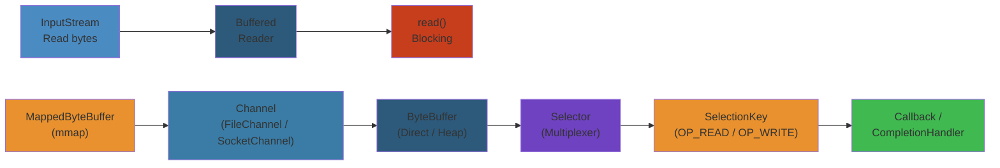

# 📂 Java I/O & NIO — Complete Deep Dive

**Related**: [Exception Handling](/03-backend/java/03-exception-handling.md) · [Streams & Lambda](/03-backend/java/07-streams-lambda.md) · [Java 8+ Features](/03-backend/java/11-java-8-features.md)

---




## Table of Contents


- [I/O vs NIO Overview](#-io-vs-nio-overview)
- [1. InputStream & OutputStream](#1-inputstream--outputstream)
- [2. Reader & Writer](#2-reader--writer)
- [3. File I/O (Legacy)](#3-file-io-legacy)
- [4. NIO.2 Path & Files](#4-nio2-path--files)
- [5. NIO Channels & Buffers](#5-nio-channels--buffers)
- [6. NIO Selectors (Non-blocking)](#6-nio-selectors-non-blocking)
- [7. Serialization](#7-serialization)
- [8. Compression](#8-compression)
- [9. Memory-Mapped Files](#9-memory-mapped-files)
- [Common Pitfalls](#-common-pitfalls)
- [Simplest Mental Model](#-simplest-mental-model)

---

## 🧭 I/O vs NIO Overview


```text
                    ┌──────────────────────────────────────┐
                    │       Java I/O (java.io)             │
                    ├──────────────────────────────────────┤
                    │  • Stream-oriented (one byte at a    │
                    │    time or buffered)                  │
                    │  • Blocking I/O                       │
                    │  • InputStream/OutputStream (binary)  │
                    │  • Reader/Writer (text)               │
                    │  • File, FileInputStream, etc.        │
                    └──────────────────────────────────────┘

                    ┌──────────────────────────────────────┐
                    │       Java NIO (java.nio)            │
                    ├──────────────────────────────────────┤
                    │  • Buffer-oriented (blocks of data)  │
                    │  • Non-blocking I/O (Selectors)      │
                    │  • Channels (FileChannel, SocketCh)  │
                    │  • NIO.2 (java.nio.file) — Path,     │
                    │    Files, WatchService               │
                    └──────────────────────────────────────┘
```

| Aspect | I/O (java.io) | NIO (java.nio) |
|--------|--------------|----------------|
| Direction | Stream (one direction) | Channel (bidirectional) |
| Data unit | Byte/Character | Buffer |
| Blocking | Always blocking | Can be non-blocking |
| Performance | Buffer inside JVM | OS-level buffer access |
| File ops | File class (limited) | Path + Files (rich API) |
| Since | Java 1.0 | Java 1.4 (NIO), Java 7 (NIO.2) |

---

## 1. InputStream & OutputStream


### Hierarchy


```text
InputStream (abstract)
  ├── FileInputStream        — Read from file
  ├── ByteArrayInputStream   — Read from byte array
  ├── BufferedInputStream    — Buffered read (wraps another stream)
  ├── ObjectInputStream      — Read serialized objects
  ├── DataInputStream        — Read primitives
  ├── PipedInputStream       — Read from PipedOutputStream
  └── FilterInputStream      — Base for decorating

OutputStream (abstract)
  ├── FileOutputStream       — Write to file
  ├── ByteArrayOutputStream  — Write to byte array
  ├── BufferedOutputStream   — Buffered write
  ├── ObjectOutputStream     — Write serialized objects
  ├── DataOutputStream       — Write primitives
  ├── PipedOutputStream      — Write to PipedInputStream
  └── FilterOutputStream     — Base for decorating
```

### Reading Bytes


```java
// Basic FileInputStream
try (FileInputStream fis = new FileInputStream("input.dat")) {
    int byteData;
    while ((byteData = fis.read()) != -1) {  // read one byte
        System.out.print((char) byteData);
    }
}

// Buffered — much faster for large files
try (BufferedInputStream bis = new BufferedInputStream(
        new FileInputStream("input.dat"))) {
    byte[] buffer = new byte[8192];
    int bytesRead;
    while ((bytesRead = bis.read(buffer)) != -1) {
        // process buffer[0..bytesRead]
        System.out.write(buffer, 0, bytesRead);
    }
}
```

### Writing Bytes


```java
// Basic FileOutputStream
try (FileOutputStream fos = new FileOutputStream("output.dat")) {
    String data = "Hello, World!";
    fos.write(data.getBytes());
}

// Append mode
try (FileOutputStream fos = new FileOutputStream("log.txt", true)) {
    fos.write("New log entry\n".getBytes());
}

// Buffered
try (BufferedOutputStream bos = new BufferedOutputStream(
        new FileOutputStream("output.dat"))) {
    bos.write("Large data".getBytes());
    bos.flush();  // force write to disk
}
```

### DataInputStream / DataOutputStream


```java
// Writing primitives
try (DataOutputStream dos = new DataOutputStream(
        new FileOutputStream("data.bin"))) {
    dos.writeInt(42);
    dos.writeDouble(3.14159);
    dos.writeUTF("Hello, Java!");
}

// Reading primitives
try (DataInputStream dis = new DataInputStream(
        new FileInputStream("data.bin"))) {
    int i = dis.readInt();         // 42
    double d = dis.readDouble();   // 3.14159
    String s = dis.readUTF();      // "Hello, Java!"
}
```

### ByteArrayInputStream / ByteArrayOutputStream


```java
// In-memory stream operations
byte[] source = {0x48, 0x65, 0x6C, 0x6C, 0x6F};  // "Hello" in ASCII

try (ByteArrayInputStream bais = new ByteArrayInputStream(source)) {
    int data;
    while ((data = bais.read()) != -1) {
        System.out.print((char) data);  // H e l l o
    }
}

// Collect output in byte array
try (ByteArrayOutputStream baos = new ByteArrayOutputStream()) {
    baos.write("Part 1".getBytes());
    baos.write("Part 2".getBytes());

    byte[] result = baos.toByteArray();  // all bytes combined
    System.out.println(new String(result));  // "Part 1Part 2"
}
```

### Stream Flow


```text
Reading a file:

                    ┌───────────────────┐
                    │  Application       │
                    └────────┬──────────┘
                             │ read()
                             ▼
                    ┌───────────────────┐
                    │ BufferedInputStream│
                    │ (8KB internal buffer)│
                    └────────┬──────────┘
                             │ bulk read (native)
                             ▼
                    ┌───────────────────┐
                    │ FileInputStream   │
                    │ (native)          │
                    └────────┬──────────┘
                             │ system call (read)
                             ▼
                    ┌───────────────────┐
                    │  OS / Disk         │
                    └───────────────────┘

Writing (BufferedOutputStream):

    write() → fill buffer (8KB)
    when buffer full → flush to FileOutputStream → native write → disk
    flush() or close() → force remaining buffer to disk
```

---

## 2. Reader & Writer


### Hierarchy


```text
Reader (abstract)
  ├── FileReader           — Read text file
  ├── BufferedReader       — Buffered + readLine()
  ├── InputStreamReader    — Bytes → chars (with charset)
  ├── StringReader         — From String
  └── CharArrayReader      — From char array

Writer (abstract)
  ├── FileWriter           — Write text file
  ├── BufferedWriter       — Buffered + newLine()
  ├── OutputStreamWriter   — Chars → bytes (with charset)
  ├── StringWriter         — To String
  ├── PrintWriter          — Formatted text output
  └── CharArrayWriter      — To char array
```

### Reading Text


```java
// FileReader (platform default encoding)
try (FileReader fr = new FileReader("file.txt")) {
    int ch;
    while ((ch = fr.read()) != -1) {
        System.out.print((char) ch);
    }
}

// BufferedReader + readLine()
try (BufferedReader br = new BufferedReader(new FileReader("file.txt"))) {
    String line;
    while ((line = br.readLine()) != null) {
        System.out.println(line);
    }
}

// With specific charset
try (BufferedReader br = new BufferedReader(
        new InputStreamReader(
            new FileInputStream("file.txt"),
            StandardCharsets.UTF_8))) {
    String line;
    while ((line = br.readLine()) != null) {
        System.out.println(line);
    }
}
```

### Writing Text


```java
// FileWriter
try (FileWriter fw = new FileWriter("output.txt")) {
    fw.write("Hello, World!\n");
    fw.write("Second line\n");
}

// BufferedWriter
try (BufferedWriter bw = new BufferedWriter(new FileWriter("output.txt"))) {
    bw.write("First line");
    bw.newLine();  // platform-independent line separator
    bw.write("Second line");
}

// PrintWriter — formatted output
try (PrintWriter pw = new PrintWriter(new FileWriter("log.txt"))) {
    pw.println("Error occurred at: " + new Date());
    pw.printf("Value: %d, Name: %s%n", 42, "Alice");
    pw.format("Pi = %.2f%n", Math.PI);
}
```

### InputStreamReader / OutputStreamWriter (Bridges)


```text
                    ┌─────────────────────────┐
                    │   Reader / Writer        │
                    │   (character oriented)   │
                    └──────────┬──────────────┘
                               │
                    ┌──────────┴──────────────┐
                    │ InputStreamReader /      │
                    │ OutputStreamWriter        │
                    │ (chars ↔ bytes with      │
                    │  charset encoding)       │
                    └──────────┬──────────────┘
                               │
                    ┌──────────┴──────────────┐
                    │   InputStream /          │
                    │   OutputStream           │
                    │   (byte oriented)        │
                    └─────────────────────────┘
```

### Common Charsets


```java
Charset utf8 = StandardCharsets.UTF_8;
Charset utf16 = StandardCharsets.UTF_16;
Charset ascii = StandardCharsets.US_ASCII;
Charset iso8859 = StandardCharsets.ISO_8859_1;

// Convert bytes to string with specific charset
byte[] bytes = {0x48, 0xC3, 0xA9, 0x6C, 0x6C, 0xC3, 0xB6};
String str = new String(bytes, StandardCharsets.UTF_8);  // "Héllö"
```

---

## 3. File I/O (Legacy)


### File Class


```java
File file = new File("/path/to/file.txt");

// Properties
file.exists();          // true/false
file.isFile();          // true
file.isDirectory();     // false
file.getName();         // "file.txt"
file.getParent();       // "/path/to"
file.getPath();         // "/path/to/file.txt"
file.getAbsolutePath(); // full path
file.length();          // size in bytes
file.lastModified();    // timestamp

// Operations
file.createNewFile();   // create empty file
file.mkdir();           // create directory
file.mkdirs();          // create dirs + parents
file.delete();          // delete file
file.renameTo(new File("/new/path"));  // rename/move

// Listing files
File dir = new File("/path/to/dir");
String[] names = dir.list();               // filenames
File[] files = dir.listFiles();            // File objects
File[] filtered = dir.listFiles((d, name) -> name.endsWith(".txt"));  // filter
```

### RandomAccessFile


```java
// Read/write at arbitrary positions (not a stream!)
try (RandomAccessFile raf = new RandomAccessFile("file.dat", "rw")) {
    // Read
    raf.seek(100);                // jump to position 100
    int data = raf.readInt();     // read int at position 100

    // Write
    raf.seek(200);                // jump to position 200
    raf.writeLong(System.currentTimeMillis());  // write at 200

    // File pointer
    long pos = raf.getFilePointer();  // current position
    long len = raf.length();          // file size

    // Append
    raf.seek(raf.length());       // go to end
    raf.writeUTF("appended text");
}
```

---

## 4. NIO.2 Path & Files


### Path API


```java
// Creating paths
Path path = Path.of("/usr/local/bin");
Path path2 = Paths.get("/usr/local/bin");  // older API
Path relative = Path.of("docs", "file.txt");  // "docs/file.txt"
Path home = Path.of(System.getProperty("user.home"));

// Path operations
path.getFileName();              // "bin"
path.getParent();                // "/usr/local"
path.getRoot();                  // "/"
path.getNameCount();             // 3 (usr, local, bin)
path.getName(0);                 // "usr"
path.subpath(0, 2);              // "usr/local"

// Resolving
Path base = Path.of("/home/user");
Path resolved = base.resolve("docs/file.txt");  // /home/user/docs/file.txt
Path sibling = base.resolveSibling("other.txt"); // /home/other.txt

// Relativize
Path p1 = Path.of("/a/b/c");
Path p2 = Path.of("/a/b/d/e");
Path rel = p1.relativize(p2);  // "../d/e"

// Normalize
Path messy = Path.of("/a/./b/../c/file.txt");
Path clean = messy.normalize();  // "/a/c/file.txt"

// Convert
path.toAbsolutePath();   // full path
path.toFile();           // convert to legacy File
path.toUri();            // file:///usr/local/bin
```

### Files Utility Class


```java
// Reading
byte[] allBytes = Files.readAllBytes(Path.of("file.dat"));
String content = Files.readString(Path.of("file.txt"));    // Java 11+
List<String> lines = Files.readAllLines(Path.of("file.txt"));

// Try-with-resources for streaming
try (Stream<String> lines = Files.lines(Path.of("file.txt"))) {
    lines.filter(l -> !l.isEmpty())
         .forEach(System.out::println);
}

// Writing
Files.write(Path.of("output.txt"), "Hello".getBytes());
Files.writeString(Path.of("output.txt"), "Hello");        // Java 11+
Files.write(Path.of("lines.txt"), List.of("line1", "line2"));

// Copy / Move / Delete
Files.copy(source, target, StandardCopyOption.REPLACE_EXISTING);
Files.move(source, target, StandardCopyOption.ATOMIC_MOVE);
Files.delete(path);
boolean deleted = Files.deleteIfExists(path);

// Create
Files.createFile(path);
Files.createDirectory(path);
Files.createDirectories(path);  // create parent dirs too
Path tmp = Files.createTempFile("prefix", ".txt");
Path tmpDir = Files.createTempDirectory("prefix");

// File attributes
Files.exists(path);
Files.isRegularFile(path);
Files.isDirectory(path);
Files.isReadable(path);
Files.isWritable(path);
Files.size(path);
Files.getLastModifiedTime(path);

// Set attributes
Files.setAttribute(path, "dos:hidden", true);
```

### Walking the File Tree


```java
// Walk directory tree (depth-first)
try (Stream<Path> stream = Files.walk(Path.of("/home/user"))) {
    stream.filter(Files::isRegularFile)
          .forEach(System.out::println);
}

// Walk with max depth
Files.walk(Path.of("/home/user"), 3)
     .filter(p -> p.toString().endsWith(".java"))
     .forEach(System.out::println);

// Find files matching a pattern
Files.find(Path.of("/home/user"),
            Integer.MAX_VALUE,
            (path, attrs) -> attrs.isRegularFile()
                          && path.toString().endsWith(".txt"))
     .forEach(System.out::println);
```

### WatchService (File Change Monitoring)


```java
public class FileWatcher {
    public static void main(String[] args) throws IOException {
        Path dir = Path.of("/home/user/watchdir");

        WatchService watcher = FileSystems.getDefault().newWatchService();
        dir.register(watcher,
            StandardWatchEventKinds.ENTRY_CREATE,
            StandardWatchEventKinds.ENTRY_MODIFY,
            StandardWatchEventKinds.ENTRY_DELETE
        );

        while (true) {
            WatchKey key;
            try {
                key = watcher.take();  // blocks
            } catch (InterruptedException e) {
                return;
            }

            for (WatchEvent<?> event : key.pollEvents()) {
                WatchEvent.Kind<?> kind = event.kind();
                Path filename = (Path) event.context();

                System.out.println(kind + ": " + filename);

                if (kind == StandardWatchEventKinds.OVERFLOW) {
                    continue;  // events lost
                }
            }

            if (!key.reset()) {  // reset to receive more events
                break;  // directory inaccessible
            }
        }
    }
}
```

---

## 5. NIO Channels & Buffers


### Channel Types


```java
// FileChannel — read/write/mmap files
FileChannel fileChannel = FileChannel.open(path, StandardOpenOption.READ);

// SocketChannel — TCP client
SocketChannel socketChannel = SocketChannel.open(new InetSocketAddress(host, port));

// ServerSocketChannel — TCP server
ServerSocketChannel serverChannel = ServerSocketChannel.open();
serverChannel.bind(new InetSocketAddress(port));

// DatagramChannel — UDP
DatagramChannel datagramChannel = DatagramChannel.open();
```

### Buffer Operations


```text
Buffer (abstract)
  ├── ByteBuffer
  ├── CharBuffer
  ├── ShortBuffer
  ├── IntBuffer
  ├── LongBuffer
  ├── FloatBuffer
  └── DoubleBuffer
```

### Buffer Anatomy


```text
    Position (read/write position)
       │
       ▼
┌────┬────┬────┬────┬────┬────┬────┬────┐
│    │    │ ✅ │ ✅ │    │    │    │    │
└────┴────┴────┴────┴────┴────┴────┴────┘
 0    1    2    3    4    5    6    7

 capacity = 8 (total size)
 limit    = 5 (available data)
 position = 2 (current read/write position)

Key methods:
  flip()   : limit = position; position = 0;  (prepare for read)
  clear()  : position = 0; limit = capacity;   (prepare for write)
  compact(): copy unread data to start; position after last
  rewind() : position = 0; (re-read)
  hasRemaining(): position < limit
  remaining(): limit - position
```

### Using FileChannel


```java
// Reading with FileChannel + ByteBuffer
try (FileChannel channel = FileChannel.open(
        Path.of("input.dat"), StandardOpenOption.READ)) {

    ByteBuffer buffer = ByteBuffer.allocate(8192);
    int bytesRead = channel.read(buffer);  // read into buffer

    while (bytesRead != -1) {
        buffer.flip();  // prepare buffer for reading

        while (buffer.hasRemaining()) {
            System.out.print((char) buffer.get());
        }

        buffer.clear();  // prepare buffer for writing
        bytesRead = channel.read(buffer);
    }
}

// Writing with FileChannel
try (FileChannel channel = FileChannel.open(
        Path.of("output.dat"),
        StandardOpenOption.CREATE,
        StandardOpenOption.WRITE)) {

    ByteBuffer buffer = ByteBuffer.allocate(8192);
    buffer.put("Hello, NIO!".getBytes());
    buffer.flip();          // prepare for read (write to channel)

    while (buffer.hasRemaining()) {
        channel.write(buffer);
    }
}
```

### Scatter / Gather


```java
// Scattering read — read into multiple buffers
ByteBuffer header = ByteBuffer.allocate(128);
ByteBuffer body = ByteBuffer.allocate(1024);

ByteBuffer[] buffers = {header, body};
long bytesRead = channel.read(buffers);  // fills header first, then body

header.flip();
body.flip();

// Gathering write — write from multiple buffers
ByteBuffer headerOut = ByteBuffer.wrap("Header\n".getBytes());
ByteBuffer bodyOut = ByteBuffer.wrap("Body content\n".getBytes());

channel.write(new ByteBuffer[] {headerOut, bodyOut});
```

### Transfer Between Channels


```java
// Zero-copy transfer between channels
// (No copying through application memory — OS-level optimized)
try (FileChannel source = FileChannel.open(Path.of("source.big"));
     FileChannel target = FileChannel.open(
         Path.of("dest.big"),
         StandardOpenOption.CREATE,
         StandardOpenOption.WRITE)) {

    // Transfer entire file
    source.transferTo(0, source.size(), target);

    // Or transferFrom
    target.transferFrom(source, 0, source.size());
}
```

---

## 6. NIO Selectors (Non-blocking)


### Selector Architecture


```text
                    ┌──────────────────────────┐
                    │     Selector             │
                    │  (multiplexer)            │
                    │                           │
                    │  ┌─────────────────────┐  │
                    │  │ Selection Keys Set  │  │
                    │  │ ┌────┬────┬────┬──┐ │  │
                    │  │ │Ch1 │Ch2 │Ch3 │..│ │  │
                    │  │ └────┴────┴────┴──┘ │  │
                    │  └─────────────────────┘  │
                    └──────────────────────────┘
                               │
        ┌──────────────────────┼──────────────────────┐
        │                      │                      │
        ▼                      ▼                      ▼
┌──────────────┐     ┌──────────────┐      ┌──────────────┐
│ SocketCh 1   │     │ SocketCh 2   │      │ SocketCh 3   │
│ (READ ready) │     │ (WRITE ready)│      │ (ACCEPT)     │
└──────────────┘     └──────────────┘      └──────────────┘
```

### Non-blocking Server


```java
public class NonBlockingServer {
    public static void main(String[] args) throws IOException {
        Selector selector = Selector.open();

        ServerSocketChannel serverChannel = ServerSocketChannel.open();
        serverChannel.configureBlocking(false);  // NON-BLOCKING!
        serverChannel.bind(new InetSocketAddress(8080));
        serverChannel.register(selector, SelectionKey.OP_ACCEPT);

        System.out.println("Server listening on port 8080");

        while (true) {
            selector.select();  // blocks until at least one channel ready

            Set<SelectionKey> keys = selector.selectedKeys();
            Iterator<SelectionKey> iterator = keys.iterator();

            while (iterator.hasNext()) {
                SelectionKey key = iterator.next();
                iterator.remove();  // MUST remove after processing

                if (key.isAcceptable()) {
                    acceptClient(selector, key);
                } else if (key.isReadable()) {
                    readFromClient(key);
                }
            }
        }
    }

    private static void acceptClient(Selector selector, SelectionKey key)
            throws IOException {
        ServerSocketChannel server = (ServerSocketChannel) key.channel();
        SocketChannel client = server.accept();
        client.configureBlocking(false);
        client.register(selector, SelectionKey.OP_READ);
        System.out.println("Client connected: " + client.getRemoteAddress());
    }

    private static void readFromClient(SelectionKey key) throws IOException {
        SocketChannel client = (SocketChannel) key.channel();
        ByteBuffer buffer = ByteBuffer.allocate(256);
        int bytesRead = client.read(buffer);

        if (bytesRead == -1) {
            client.close();  // connection closed
            return;
        }

        buffer.flip();
        byte[] data = new byte[buffer.limit()];
        buffer.get(data);
        System.out.println("Received: " + new String(data));

        // Echo back
        buffer.rewind();
        client.write(buffer);
    }
}
```

### Non-blocking vs Blocking


| Aspect | Blocking I/O | Non-blocking NIO |
|--------|-------------|-------------------|
| Threads | One per connection | One thread handles many connections |
| Scalability | Limited by thread count | High (scale to 10K+ connections) |
| Complexity | Simple code | More complex |
| Latency | Consistent | Can vary |
| Best for | Low concurrency, simple | High concurrency, chat servers, proxies |

---

## 7. Serialization


### Serializable Interface


```java
// Mark interface — no methods to implement
public class Person implements Serializable {
    private static final long serialVersionUID = 1L;  // version control

    private String name;
    private int age;
    private transient String password;  // NOT serialized!

    // Constructor, getters, setters...
}

// Serialize
try (ObjectOutputStream oos = new ObjectOutputStream(
        new FileOutputStream("person.ser"))) {
    oos.writeObject(new Person("Alice", 30, "secret123"));
}

// Deserialize
try (ObjectInputStream ois = new ObjectInputStream(
        new FileInputStream("person.ser"))) {
    Person p = (Person) ois.readObject();
    System.out.println(p.getName());  // "Alice"
    System.out.println(p.getPassword());  // null (transient)
}
```

### serialVersionUID


```java
// If not declared, JVM computes one from class structure
// Problem: minor changes (adding a field) changes UID → InvalidClassException

// Always declare explicitly:
private static final long serialVersionUID = 1L;

// If you changed the class and want backward compatibility:
private static final long serialVersionUID = 1L;  // same UID
// Requires that new fields have default values, old fields can be dropped
```

### Custom Serialization


```java
public class SecureData implements Serializable {
    private static final long serialVersionUID = 1L;
    private String data;
    private transient String encrypted;  // not serialized directly

    // Custom serialization logic
    @Serial
    private void writeObject(ObjectOutputStream out) throws IOException {
        out.defaultWriteObject();  // write non-transient fields
        out.writeObject(encrypt(data));  // write encrypted version
    }

    @Serial
    private void readObject(ObjectInputStream in)
            throws IOException, ClassNotFoundException {
        in.defaultReadObject();  // read non-transient fields
        this.encrypted = (String) in.readObject();
        this.data = decrypt(encrypted);
    }

    // readObjectNoData — if serialization stream doesn't have class data
    @Serial
    private void readObjectNoData() throws ObjectStreamException {
        this.data = "default";
    }

    // writeReplace — substitute object during serialization
    @Serial
    private Object writeReplace() {
        if (data.contains("secret")) {
            return new HiddenData("***");  // replace with proxy
        }
        return this;
    }

    // readResolve — substitute during deserialization
    @Serial
    private Object readResolve() {
        return new SecureData(data);  // replace with proper instance
    }
}
```

### Externalizable


```java
// Full control over serialization (not just marker interface)
public class CustomObject implements Externalizable {
    private String name;
    private int value;

    public CustomObject() {
        // MUST have public no-arg constructor
    }

    @Override
    public void writeExternal(ObjectOutput out) throws IOException {
        out.writeUTF(name);
        out.writeInt(value * 2);  // custom encoding
    }

    @Override
    public void readExternal(ObjectInput in)
            throws IOException, ClassNotFoundException {
        this.name = in.readUTF();
        this.value = in.readInt() / 2;  // custom decoding
    }
}
```

---

## 8. Compression


### GZIP


```java
// Compress
try (GZIPOutputStream gz = new GZIPOutputStream(
        new FileOutputStream("file.gz"))) {
    gz.write("Hello, compressed world!".getBytes());
}

// Decompress
try (GZIPInputStream gz = new GZIPInputStream(
        new FileInputStream("file.gz"))) {
    byte[] buffer = new byte[1024];
    int len = gz.read(buffer);
    System.out.println(new String(buffer, 0, len));
}
```

### ZIP


```java
// Create ZIP
try (ZipOutputStream zos = new ZipOutputStream(
        new FileOutputStream("archive.zip"))) {

    // Add file 1
    zos.putNextEntry(new ZipEntry("file1.txt"));
    zos.write("Content of file 1".getBytes());
    zos.closeEntry();

    // Add file 2
    zos.putNextEntry(new ZipEntry("subdir/file2.txt"));
    zos.write("Content of file 2".getBytes());
    zos.closeEntry();
}

// Read ZIP
try (ZipInputStream zis = new ZipInputStream(
        new FileInputStream("archive.zip"))) {
    ZipEntry entry;
    while ((entry = zis.getNextEntry()) != null) {
        System.out.println("Extracting: " + entry.getName());
        byte[] buffer = new byte[1024];
        int len;
        while ((len = zis.read(buffer)) > 0) {
            System.out.write(buffer, 0, len);
        }
        zis.closeEntry();
    }
}
```

---

## 9. Memory-Mapped Files


```java
// Map file directly into memory (zero-copy for OS)
// Ideal for large files, random access

try (RandomAccessFile file = new RandomAccessFile("large.dat", "rw");
     FileChannel channel = file.getChannel()) {

    // Map entire file (or region) into memory
    MappedByteBuffer buffer = channel.map(
        FileChannel.MapMode.READ_WRITE,
        0,                     // position
        channel.size()         // size
    );

    // Read/write directly to mapped memory (like ByteBuffer)
    buffer.putInt(0, 42);        // write int at offset 0
    buffer.putLong(8, 123L);     // write long at offset 8

    int value = buffer.getInt(0);    // read int at offset 0
    long longVal = buffer.getLong(8); // read long at offset 8

    // Force changes to disk
    buffer.force();
}
```

### Memory Mapping Flow


```text
                    ┌─────────────────────┐
                    │   Java Application  │
                    │   MappedByteBuffer  │
                    └──────────┬──────────┘
                               │ direct access
                               ▼
                    ┌─────────────────────┐
                    │   Virtual Memory    │
                    │   (process address  │
                    │    space)           │
                    └──────────┬──────────┘
                               │ page fault → OS loads
                               ▼
                    ┌─────────────────────┐
                    │   Physical Memory   │
                    │   (page cache)      │
                    └──────────┬──────────┘
                               │
                               ▼
                    ┌─────────────────────┐
                    │   Disk File         │
                    └─────────────────────┘

Benefits:
  ✓ No explicit read()/write() system calls
  ✓ Automatic paging by OS
  ✓ Shared across processes (same file)
  ✓ ~10x faster for random access

Risks:
  ✗ Page faults can cause unpredictable latency
  ✗ Large mappings consume virtual address space
  ✗ Changes not flushed to disk until force()
```

---

## ⚠️ Common Pitfalls


| Pitfall | Issue | Fix |
|---------|-------|-----|
| Not closing streams | Resource leak | try-with-resources |
| Default charset | Platform-dependent behavior | Always specify `StandardCharsets.UTF_8` |
| `File#delete()` fails silently | File still open | Check return value or use `Files.delete()` |
| Reading past EOF | -1 from read() | Check for -1 in loop |
| Not flushing buffer | Data loss | `flush()` or `close()` |
| SerialVersionUID mismatch | InvalidClassException | Always declare serialVersionUID |
| `transient` forgotten | Sensitive data leaked | Mark password, tokens as transient |
| MappedByteBuffer on huge files | OutOfMemoryError | Map regions, not whole file |
| Channel not set non-blocking | Selector doesn't work | `configureBlocking(false)` before register |
| Not removing SelectionKey | Key processed repeatedly | `iterator.remove()` after processing |

---

## 🧠 Simplest Mental Model


```text
INPUTSTREAM    =  A water pipe bringing data INTO your program.
OUTPUTSTREAM   =  A water pipe sending data OUT of your program.

BUFFERED       =  A bucket. Instead of carrying one drop at a time,
                   you carry a full bucket. Much more efficient.

READER/WRITER  =  A translator that converts bytes (raw water) into
                   characters (structured bottles). Knows about text.

NIO CHANNEL    =  A bidirectional tunnel. Data flows both ways.
                   Unlike streams which are one-way pipes.

NIO BUFFER     =  A container you fill then empty. Position tells you
                   where you are. Flip to switch from writing to reading.

SELECTOR       =  A receptionist in a call center. Instead of one
                   employee per caller, one receptionist monitors
                   all lines and routes calls as they come in.

MEMORY-MAPPED  =  Using the file as if it were RAM. The OS handles
                   loading pages as you access them. Like a bookshelf
                   where books appear magically when you reach for them.

SERIALIZATION  =  Taking a snapshot of an object and saving it to a file.
                   Deserialization = restoring the object from the snapshot.

TRANSIENT      =  "Don't take a photo of this field." Like a fingerprint
                   or password — it's part of the object but shouldn't
                   be saved.
```

---

**Next**: [Annotations & Reflection](/03-backend/java/10-annotations-reflection.md) — Meta-programming in Java


## Practical Example


See code examples above for practical usage patterns.

## Related

- [Jvm Performance](/18-performance-engineering/jvm-tuning/01-jvm-performance.md)
- [Cap Consistency](/09-distributed-systems/01-cap-consistency.md)
- [Consensus Replication](/09-distributed-systems/01-consensus-replication.md)
- [Consensus Raft](/09-distributed-systems/02-consensus-raft.md)
- [Distributed Transactions](/09-distributed-systems/02-distributed-transactions.md)
- [Distributed Caching](/09-distributed-systems/03-distributed-caching.md)

---

## Interactive Component: Java Thread Lifecycle

<div style="padding:16px;background:#0b0e14;border:1px solid #1e2a3a;border-radius:8px">
  <style>.state-machine-title{color:#00d4ff;font-family:monospace;font-size:14px;font-weight:bold;margin-bottom:16px}.state-demo{text-align:center}.state-display{font-size:18px;font-family:monospace;padding:16px;border-radius:4px;margin:16px 0;color:#0b0e14;font-weight:bold;min-height:50px;display:flex;align-items:center;justify-content:center;border:2px solid currentColor}.state-new{background:#9333ea;border-color:#7e22ce}.state-runnable{background:#34d399;border-color:#22c55e}.state-running{background:#00d4ff;border-color:#0099cc;color:#0b0e14}.state-waiting{background:#fbbf24;border-color:#f59e0b}.state-terminated{background:#ef4444;border-color:#dc2626}.state-buttons{display:flex;gap:8px;justify-content:center;flex-wrap:wrap;margin-top:16px}.state-button{padding:8px 16px;border:1px solid #00d4ff;background:#1e3a5f;color:#00d4ff;border-radius:4px;cursor:pointer;font-family:monospace;font-size:12px;transition:all 0.2s}.state-button:hover{background:#2a5a8f;box-shadow:0 0 8px #00d4ff}</style>
  <div class="state-machine-title">Java Thread Lifecycle State Machine</div>
  <div class="state-demo">
    <div class="state-display state-new" id="state-display">NEW</div>
    <div class="state-buttons">
      <button class="state-button" onclick="setState('NEW', javaStateMap)">New (created)</button>
      <button class="state-button" onclick="setState('RUNNABLE', javaStateMap)">Runnable (start())</button>
      <button class="state-button" onclick="setState('RUNNING', javaStateMap)">Running (scheduler)</button>
      <button class="state-button" onclick="setState('WAITING', javaStateMap)">Waiting (lock/wait)</button>
      <button class="state-button" onclick="setState('TERMINATED', javaStateMap)">Terminated (done)</button>
    </div>
  </div>
  <script>
    const javaStateMap = {
      'NEW': { label: 'NEW', class: 'state-new' },
      'RUNNABLE': { label: 'RUNNABLE', class: 'state-runnable' },
      'RUNNING': { label: 'RUNNING', class: 'state-running' },
      'WAITING': { label: 'WAITING', class: 'state-waiting' },
      'TERMINATED': { label: 'TERMINATED', class: 'state-terminated' }
    };
    function setState(state, sm) {
      const display = document.getElementById('state-display');
      const info = sm[state];
      display.textContent = info.label;
      display.className = 'state-display ' + info.class;
    }
  </script>
</div>


---

## Interactive Component: Java Heap Memory Observability

<div style="padding:16px;background:#0b0e14;border:1px solid #1e2a3a;border-radius:8px">
  <style>.obs-title{color:#00d4ff;font-family:monospace;font-size:14px;font-weight:bold;margin-bottom:16px}.obs-grid{display:grid;grid-template-columns:repeat(auto-fit, minmax(150px, 1fr));gap:12px}.obs-card{padding:12px;background:#1a2332;border:1px solid #1e3a5f;border-radius:4px;display:flex;flex-direction:column;align-items:center;transition:all 0.3s}.obs-card:hover{border-color:#00d4ff;box-shadow:0 0 8px rgba(0, 212, 255, 0.3)}.obs-label{color:#a3aab8;font-family:monospace;font-size:11px;text-transform:uppercase;letter-spacing:0.5px;margin-bottom:8px}.obs-value{font-family:monospace;font-size:20px;font-weight:bold;margin-bottom:4px;letter-spacing:0.5px}.obs-unit{color:#a3aab8;font-family:monospace;font-size:10px;text-transform:uppercase}.metric-healthy{color:#34d399}.metric-warning{color:#fbbf24}.metric-critical{color:#ef4444}</style>
  <div class="obs-title">JVM Heap Memory Metrics</div>
  <div class="obs-grid">
    <div class="obs-card">
      <div class="obs-label">Heap Used</div>
      <div class="obs-value metric-warning">712</div>
      <div class="obs-unit">MB</div>
    </div>
    <div class="obs-card">
      <div class="obs-label">Heap Max</div>
      <div class="obs-value metric-healthy">1024</div>
      <div class="obs-unit">MB</div>
    </div>
    <div class="obs-card">
      <div class="obs-label">GC Pause</div>
      <div class="obs-value metric-healthy">85</div>
      <div class="obs-unit">ms</div>
    </div>
    <div class="obs-card">
      <div class="obs-label">Eden Usage</div>
      <div class="obs-value metric-healthy">45</div>
      <div class="obs-unit">%</div>
    </div>
  </div>
</div>


---

## Interactive Component: Exception Cascade Simulator

<div style="padding:16px;background:#0b0e14;border:1px solid #1e2a3a;border-radius:8px">
  <style>.cascade-title{color:#00d4ff;font-family:monospace;font-size:14px;font-weight:bold;margin-bottom:16px}.cascade-stages{display:flex;flex-direction:column;gap:12px;margin-bottom:16px}.cascade-stage{display:flex;align-items:center;gap:12px}.cascade-label{color:#e3eaf0;font-family:monospace;font-size:12px;min-width:120px}.cascade-indicator{width:24px;height:24px;border-radius:4px;background:#34d399;border:2px solid #22c55e;transition:all 0.3s}.cascade-indicator.failing{background:#ef4444;border-color:#dc2626;box-shadow:0 0 12px #ef4444;animation:cascade-fail 0.6s ease-out}@keyframes cascade-fail{0%{transform:scale(1);opacity:1}100%{transform:scale(1.2);opacity:0.8}}.cascade-controls{display:flex;gap:8px;flex-wrap:wrap}.cascade-button{padding:8px 16px;border:1px solid #00d4ff;background:#1e3a5f;color:#00d4ff;border-radius:4px;cursor:pointer;font-family:monospace;font-size:12px;transition:all 0.2s}.cascade-button:hover{background:#2a5a8f;box-shadow:0 0 8px #00d4ff}</style>
  <div class="cascade-title">Exception Stack Unwinding Cascade</div>
  <div class="cascade-stages">
    <div class="cascade-stage"><span class="cascade-label">Method A</span><div class="cascade-indicator" data-stage="a"></div></div>
    <div class="cascade-stage"><span class="cascade-label">Method B (try)</span><div class="cascade-indicator" data-stage="b"></div></div>
    <div class="cascade-stage"><span class="cascade-label">Method C (finally)</span><div class="cascade-indicator" data-stage="c"></div></div>
    <div class="cascade-stage"><span class="cascade-label">Stack Unwound</span><div class="cascade-indicator" data-stage="d"></div></div>
  </div>
  <div class="cascade-controls">
    <button class="cascade-button" onclick="throwException()">Throw Exception</button>
    <button class="cascade-button" onclick="resetException()">Reset</button>
  </div>
  <script>
    function throwException() {
      const stages = ['a', 'b', 'c', 'd'];
      let delay = 0;
      stages.forEach((id) => {
        setTimeout(() => {
          document.querySelector('[data-stage="'+id+'"]').classList.add('failing');
        }, delay);
        delay += 300;
      });
    }
    function resetException() {
      document.querySelectorAll('[data-stage]').forEach(s => s.classList.remove('failing'));
    }
  </script>
</div>

