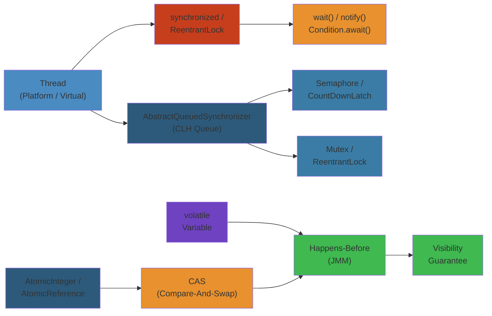
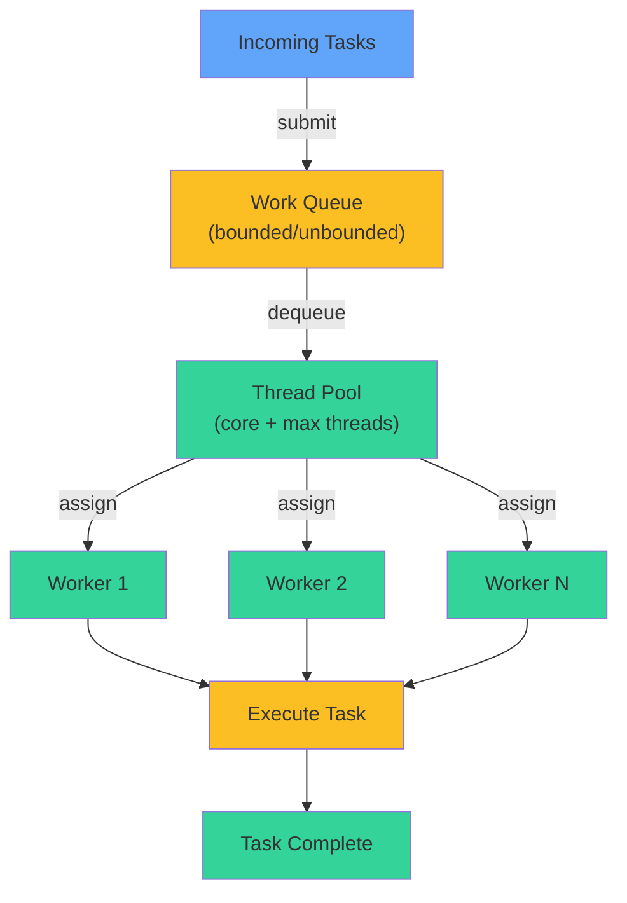
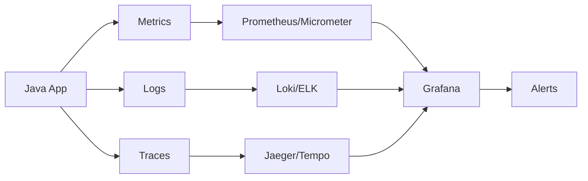
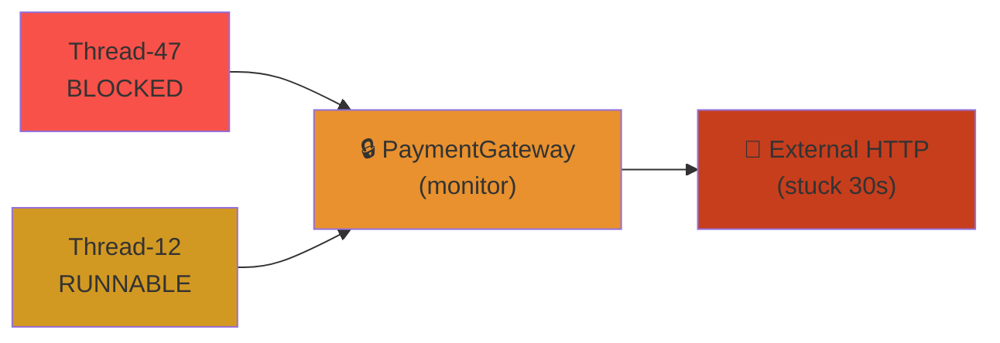

# 🧵 Java Concurrency Deep Dive — Complete Deep Dive




## Table of Contents


- [Java Memory Model](#java-memory-model)
- [Thread Lifecycle](#thread-lifecycle)
- [Thread Safety](#thread-safety)
- [java.util.concurrent Collections](#javautilconcurrent-collections)
- [Executors & Thread Pools](#executors--thread-pools)
- [Virtual Threads](#virtual-threads)
- [Synchronizers](#synchronizers)
- [Locks & AQS](#locks--aqs)
- [Atomic Variables & Striped64](#atomic-variables--striped64)
- [False Sharing](#false-sharing)
- [ThreadLocal](#threadlocal)
- [CompletableFuture](#completablefuture)

---

## Java Memory Model


```text
┌─────────────────────────────────────────────────────┐
│                  Java Memory Model                    │
├───────────────┬─────────────────────┬───────────────┤
│   Thread 1    │     Shared Heap     │   Thread 2    │
│   ┌───────┐   │  ┌───────────────┐  │   ┌───────┐   │
│   │ L1 $  │   │  │   Object X    │  │   │ L1 $  │   │
│   └───────┘   │  │  field = 42   │  │   └───────┘   │
│   ┌───────┐   │  └───────────────┘  │   ┌───────┐   │
│   │Local $│   │                     │   │Local $│   │
│   └───────┘   └─────────────────────┘   └───────┘   │
└─────────────────────────────────────────────────────┘
```

**Happens-Before Rules**: volatile write → volatile read, synchronized unlock → lock, thread.start() → any action in thread, thread.join() → subsequent actions, transitive.

```java
// volatile: guarantees visibility, prevents reordering
private volatile boolean running = true;

public void stop() { running = false; }  // write: flush to main memory
public void runLoop() {
    while (running) {}  // read: fetch from main memory, not cache
}

// final fields: guaranteed visible after constructor completes
class SafePublication {
    private final int x;
    private final int[] arr;  // final ref, but array contents NOT final

    SafePublication(int x, int[] arr) {
        this.x = x;
        this.arr = arr.clone();  // defensive copy
    }
}
```

## Thread Lifecycle


```text
┌──────────┐  start()  ┌──────────┐  acquire lock  ┌──────────┐
│  NEW     │ ────────→ │ RUNNABLE │ ─────────────→ │ BLOCKED  │
└──────────┘           └──────────┘                 └──────────┘
                          │                               │
                          │ wait()/park()                 │ notify()/unlock
                          ↓                               ↓
                     ┌──────────┐                   ┌──────────┐
                     │ WAITING  │                   │ RUNNABLE │
                     └──────────┘                   └──────────┘
                          │                               │
                          │ sleep(ms)/wait(timeout)        │ run() completes
                          ↓                               ↓
                     ┌──────────────┐               ┌──────────┐
                     │TIMED_WAITING │               │TERMINATED│
                     └──────────────┘               └──────────┘
```

```java
Thread t = new Thread(() -> System.out.println("Work"));
System.out.println(t.getState()); // NEW
t.start();
System.out.println(t.getState()); // RUNNABLE
t.join();
System.out.println(t.getState()); // TERMINATED
```

## Thread Safety


| Strategy | Mechanism | Use Case |
|----------|-----------|----------|
| Immutability | final fields, no setters | Value objects |
| Defensive copies | copy before returning | Internal state protection |
| Synchronized | intrinsic lock | Coarse-grained locking |
| Concurrent collections | Lock-free/CAS | High-throughput |

```java
// Immutability
record Point(double x, double y) {}  // all fields final, no mutators

// Defensive copies
public class Person {
    private final Date birthDate;
    public Person(Date birthDate) {
        this.birthDate = new Date(birthDate.getTime()); // defensive copy in
    }
    public Date getBirthDate() {
        return (Date) birthDate.clone(); // defensive copy out
    }
}

// Synchronized collections (poor scaling under contention)
Map<String, String> syncMap = Collections.synchronizedMap(new HashMap<>());
// Concurrent collections (better)
ConcurrentHashMap<String, String> chm = new ConcurrentHashMap<>();
```

## java.util.concurrent Collections


```text
ConcurrentHashMap Evolution:
┌─────────────────────────────────────────────────────┐
│ Java 7: Segmented Lock                               │
│ ┌──────┐ ┌──────┐ ┌──────┐         ┌──────┐        │
│ │Seg 0 │ │Seg 1 │ │Seg 2 │   ...   │Seg 15│        │
│ │Lock  │ │Lock  │ │Lock  │         │Lock  │        │
│ └──────┘ └──────┘ └──────┘         └──────┘        │
│                                                      │
│ Java 8+: CAS + synchronized for collisions           │
│ ┌─────────────────────────────────────────────────┐ │
│ │ Node[] table: CAS for first insert per bucket   │ │
│ │ synchronized on head node for collisions         │ │
│ │ Tree bins for high-collision buckets (TREEIFY)  │ │
│ └─────────────────────────────────────────────────┘ │
└─────────────────────────────────────────────────────┘
```

```java
// BlockingQueue implementations
BlockingQueue<Runnable> queue1 = new ArrayBlockingQueue<>(100); // bounded, fair
BlockingQueue<Runnable> queue2 = new LinkedBlockingQueue<>();   // optionally bounded
BlockingQueue<Runnable> queue3 = new PriorityBlockingQueue<>(); // priority order
BlockingQueue<Delayed> queue4 = new DelayQueue<>();             // delayed elements
BlockingQueue<Runnable> queue5 = new SynchronousQueue<>();      // handoff, no capacity
TransferQueue<Runnable> queue6 = new LinkedTransferQueue<>();   // transfer + queue
BlockingDeque<Runnable> queue7 = new LinkedBlockingDeque<>();   // double-ended

// CopyOnWriteArrayList: snapshot iterator, no ConcurrentModificationException
CopyOnWriteArrayList<String> cowList = new CopyOnWriteArrayList<>();
cowList.add("a");  // copies entire array
for (String s : cowList) {  // safe even if other thread modifies
    cowList.add("b");       // iterator sees snapshot
}
```

## Executors & Thread Pools

### Thread Pool Executor Flow



### ExecutorService Thread Pool


```text
ThreadPoolExecutor Anatomy:
┌───────────────────────────────────────────────────────┐
│  ThreadPoolExecutor                                    │
│  ┌─────────────┐  submits   ┌──────────────────────┐ │
│  │   Caller    │ ─────────→│  WorkQueue (Runnable) │ │
│  └─────────────┘            └──────────┬───────────┘ │
│                                        │              │
│  ┌─────────────────────────────────────┴──────────┐  │
│  │     Worker Threads                              │  │
│  │  ┌──────┐ ┌──────┐ ┌──────┐  ┌──────┐          │  │
│  │  │ T1   │ │ T2   │ │ T3   │  │ T4   │          │  │
│  │  └──────┘ └──────┘ └──────┘  └──────┘          │  │
│  └─────────────────────────────────────────────────┘  │
│  corePoolSize=4 maxPoolSize=8 keepAliveTime=60s      │
│  RejectedExecutionHandler: AbortPolicy(default)      │
└───────────────────────────────────────────────────────┘
```

```java
ThreadPoolExecutor executor = new ThreadPoolExecutor(
    4,                          // corePoolSize
    8,                          // maxPoolSize
    60, TimeUnit.SECONDS,       // keepAliveTime
    new LinkedBlockingQueue<>(100), // workQueue
    Executors.defaultThreadFactory(),
    new ThreadPoolExecutor.CallerRunsPolicy() // rejection handler
);

// ForkJoinPool: work-stealing
ForkJoinPool pool = ForkJoinPool.commonPool();

RecursiveTask<Long> task = new RecursiveTask<>() {
    private final long[] arr; private final int lo, hi;
    static final int THRESHOLD = 10_000;

    @Override protected Long compute() {
        if (hi - lo <= THRESHOLD) {
            long sum = 0;
            for (int i = lo; i < hi; i++) sum += arr[i];
            return sum;
        }
        int mid = (lo + hi) >>> 1;
        RecursiveTask<Long> left = new RecursiveTask(arr, lo, mid);
        RecursiveTask<Long> right = new RecursiveTask(arr, mid, hi);
        left.fork();           // push to local deque
        long rightRes = right.compute();
        long leftRes = left.join();  // steal if empty
        return leftRes + rightRes;
    }
};
pool.invoke(task);
```

## Virtual Threads


```java
// Virtual threads (Project Loom, Java 21+)
Thread vThread = Thread.startVirtualThread(() -> {
    System.out.println("Running on: " + Thread.currentThread());
});

// ExecutorService that uses virtual threads
try (var executor = Executors.newVirtualThreadPerTaskExecutor()) {
    executor.submit(() -> doWork());
}

// Structured concurrency (Java 21 preview → 22 finalized)
try (var scope = new StructuredTaskScope.ShutdownOnFailure()) {
    Future<String> user = scope.fork(() -> fetchUser());
    Future<Integer> orders = scope.fork(() -> fetchOrders());
    scope.join();               // wait for all
    scope.throwIfFailed();      // propagate failure
    String result = user.resultNow() + orders.resultNow();
}

// ScopedValue (replacement for ThreadLocal with virtual threads)
private static final ScopedValue<String> REQUEST_ID = ScopedValue.newInstance();

void handle(HttpRequest req) {
    ScopedValue.where(REQUEST_ID, req.requestId())
               .run(() -> processRequest());
}

void processRequest() {
    String rid = REQUEST_ID.get();  // inherited by virtual threads
}

// Pinning: virtual thread pinned to carrier thread
// synchronized blocks cause pinning → prefer ReentrantLock
```

## Synchronizers


```java
// CountDownLatch: one-time barrier
CountDownLatch latch = new CountDownLatch(3);
// worker threads: latch.countDown();
latch.await(); // blocks until count reaches 0

// CyclicBarrier: reusable barrier with optional action
CyclicBarrier barrier = new CyclicBarrier(3, () -> System.out.println("All arrived"));
// worker threads: barrier.await(); barrier.reset();

// Semaphore: permits
Semaphore semaphore = new Semaphore(10); // 10 concurrent permits
semaphore.acquire();
semaphore.release();

// Exchanger: pair-wise exchange
Exchanger<String> exchanger = new Exchanger<>();
// Thread A: String received = exchanger.exchange("from A");
// Thread B: String received = exchanger.exchange("from B");

// Phaser: flexible multi-phase barrier
Phaser phaser = new Phaser(); // party count 0
phaser.bulkRegister(5);       // register 5 parties
phaser.arriveAndAwaitAdvance(); // phase advancement
phaser.arriveAndDeregister();
```

## Locks & AQS


```text
AQS (AbstractQueuedSynchronizer):
┌─────────────────────────────────────────────┐
│  AbstractQueuedSynchronizer (AQS)            │
│  state: int (volatile)                       │
│  ┌───┐ ┌───┐ ┌───┐ ┌───┐                   │
│  │ T1│→│ T2│→│ T3│→│ T4│   CLH Queue      │
│  └───┘ └───┘ └───┘ └───┘                   │
│  tryAcquire() → CAS on state                │
│  tryRelease() → CAS decrement state         │
│  acquireShared() / releaseShared()          │
└─────────────────────────────────────────────┘
```

```java
// ReentrantLock: replacement for synchronized
ReentrantLock lock = new ReentrantLock(true); // fair
lock.lock();
try {
    // critical section
} finally {
    lock.unlock();
}

// Condition: per-lock wait/notify
Condition notFull = lock.newCondition();
Condition notEmpty = lock.newCondition();
notEmpty.await();
notFull.signal();

// ReentrantReadWriteLock: readers share, writer exclusive
ReentrantReadWriteLock rwLock = new ReentrantReadWriteLock();
Lock readLock = rwLock.readLock();
Lock writeLock = rwLock.writeLock();

// StampedLock: optimistic reads (better throughput)
StampedLock stampedLock = new StampedLock();
long stamp = stampedLock.tryOptimisticRead();
int x = state; // read without lock
if (!stampedLock.validate(stamp)) { // conflicted?
    stamp = stampedLock.readLock();  // fall back to pessimistic
    try { x = state; } finally { stampedLock.unlockRead(stamp); }
}
```

## Atomic Variables & Striped64


```java
// Basic atomics
AtomicInteger count = new AtomicInteger(0);
count.incrementAndGet();   // CAS-based
count.getAndSet(10);
count.compareAndSet(10, 20);

AtomicReference<String> ref = new AtomicReference<>("initial");
ref.updateAndGet(s -> s + "_updated");

// LongAdder: Striped64-based, better for high-contention counters
LongAdder adder = new LongAdder();
adder.increment();   // striped across CPU caches
adder.add(5);
long sum = adder.sum(); // sum then reset

// LongAccumulator: custom reduction
LongAccumulator max = new LongAccumulator(Long::max, 0L);
max.accumulate(42);
max.accumulate(7);
max.get(); // 42

// Striped64: internally uses Cell[] array, one per contended CPU core
```

## False Sharing


```text
┌─────────────────────────────────────┐
│           Cache Line (64 bytes)      │
│  ┌──────┐┌──────┐┌──────┐┌──────┐  │
│  │T1 var││ padding││T2 var││     │  │
│  └──────┘└──────┘└──────┘└──────┘  │
│  Core1 write ─→ invalidation ─→ Core2│
└─────────────────────────────────────┘
```

```java
// @Contended: prevent false sharing (needs JVM flag -XX:-RestrictContended)
@jdk.internal.vm.annotation.Contended
class CounterCell {
    volatile long value;
}

// Manual padding (pre-Java 8)
class PaddedLong {
    volatile long value;
    long p1, p2, p3, p4, p5, p6; // padding fields
}
```

## ThreadLocal


```java
// ThreadLocal: per-thread value
private static final ThreadLocal<SimpleDateFormat> dateFormat =
    ThreadLocal.withInitial(() -> new SimpleDateFormat("yyyy-MM-dd"));

String formatted = dateFormat.get().format(new Date());
dateFormat.remove(); // prevent memory leak in thread pools

// InheritableThreadLocal: inherited by child threads
private static final InheritableThreadLocal<String> context =
    new InheritableThreadLocal<>();
context.set("parent-value");
// new Thread(...) inherits parent's value

// WARNING: in thread pools, threads are reused → stale values
// always call remove() in finally block
```

## CompletableFuture


```java
CompletableFuture<String> future = CompletableFuture
    .supplyAsync(() -> fetchData())           // async in ForkJoinPool
    .thenApply(s -> s + " processed")         // thenApply: sync transform
    .thenCompose(s -> asyncTransform(s))      // thenCompose: flatMap
    .thenAccept(System.out::println)          // thenAccept: consumer
    .exceptionally(ex -> "fallback")           // recover from error
    .handle((res, ex) -> ex != null ? "recovered" : res); // always called

// Combine multiple futures
CompletableFuture<String> combined = CompletableFuture
    .allOf(f1, f2, f3)
    .thenApply(v -> Stream.of(f1, f2, f3)
        .map(CompletableFuture::join)
        .collect(Collectors.joining()));

// Timeouts
future.orTimeout(5, TimeUnit.SECONDS);        // TimeoutException
future.completeOnTimeout("default", 5, TimeUnit.SECONDS);

// Delayed execution
CompletableFuture<String> delayed = new CompletableFuture<>();
ScheduledExecutorService scheduler = Executors.newScheduledThreadPool(1);
scheduler.schedule(() -> delayed.complete("delayed"), 1, TimeUnit.SECONDS);
```

## Simplest Mental Model


> **Java concurrency = happens-before + CAS + queues + structured concurrency**
>
> - **JMM**: volatile writes publish to all threads; synchronized provides mutual exclusion + visibility
> - **Locks**: built on AQS (CAS + CLH queue); StampedLock has optimistic reads
> - **Collections**: ConcurrentHashMap uses CAS for writes (Java 8+)
> - **Thread pools**: ForkJoinPool steals; virtual threads multiplex onto carrier threads
> - **CompletableFuture**: async pipeline with error recovery
> - **False sharing**: avoid multiple hot fields on same cache line
> - **ThreadLocal**: per-thread, but clean up in pools (remove on shutdown)


## Practical Example


See code examples above for practical usage patterns.

## Observability




### Key Metrics


| Metric | Unit | Threshold | Indicates |
|--------|------|-----------|-----------|
| JVM heap used | % | < 75% | Memory pressure |
| GC pause (p99) | ms | < 100ms | GC tuning needed |
| Young GC frequency | /min | < 10 | Object allocation rate |
| Full GC frequency | /min | 0 (ideally) | Memory leak or metaspace |
| Thread count | count | < 500 | Thread pool exhaustion |
| Connection pool usage | % | < 80% | Database pool saturation |
| Class loading rate | classes/s | < 100 | Dynamic class generation |
| File descriptor count | count | < 70% of ulimit | FD leak |

### Logs


- **ERROR**: Uncaught exceptions, OOM, stack traces, connection pool exhaustion, thread starvation
- **WARN**: Slow queries, long GC pauses, retry attempts, deprecated API usage
- **INFO**: Server start/stop, context initialization, config loaded, scheduled tasks
- **DEBUG**: SQL queries with params, request/response headers, method entry/exit timing

### Traces


Use Micrometer Tracing (formerly Spring Cloud Sleuth) or OpenTelemetry Java SDK. Propagate trace context via MDC for log correlation.

### Alerts


| Severity | Condition | Response |
|----------|-----------|----------|
| P0 | Full GC > 1 in 5min | Heap dump, identify leak |
| P0 | Error rate > 5% | Rollback, check heap |
| P1 | GC pause > 1s | Tune GC, reduce heap pressure |
| P1 | Thread starvation | Increase pool, check deadlocks |
| P2 | Heap > 85% for 10min | Schedule capacity increase |

### Dashboards


**JVM Dashboard**: heap usage (young/old/metaspace), GC pause (count, duration per generation), thread states (runnable/blocked/waiting), class loading, JIT compilation time, file descriptor count.


## Common Failures


### Failure: OutOfMemoryError


- **Symptoms**: Application crashes with `java.lang.OutOfMemoryError`. Heap dump on exit. 503s from load balancer.
- **Root Cause**: Memory leak (unclosed streams, collections growing unbounded, ThreadLocal not cleaned). Heap too small for workload. Metaspace leak from dynamic class loading.
- **Detection**: `jstat -gcutil <pid> 1s` shows Old Gen filling. `jmap -histo:live <pid>` shows leaking class count. GC logs show Full GC repeatedly.
- **Recovery**: 1) Increase heap with `-Xmx`. 2) Enable `-XX:+HeapDumpOnOutOfMemoryError`. 3) Analyze heap dump with Eclipse MAT. 4) Restart with increased resources.
- **Prevention**: Profile with `jprofiler`/`async-profiler`. Set `-Xmx` high enough. Use `-XX:+ExitOnOutOfMemoryError` for fail-fast. Implement proper resource cleanup in `finally`/`try-with-resources`.

### Failure: Full GC Storm


- **Symptoms**: Latency spikes, CPU high, throughput drops. GC log shows Full GC events in quick succession.
- **Root Cause**: Old Gen fills up faster than concurrent GC can clear. Large object allocation (direct to Old Gen). GC fragmentation. Too many concurrent GC threads competing.
- **Detection**: GC logs show Full GC events. `jstat -gcutil` shows Old Gen at > 90% after GC. `jmap -histo` shows large byte arrays.
- **Recovery**: 1) Increase heap size. 2) Switch to G1GC or ZGC. 3) Reduce allocation rate. 4) Enable `-XX:+UseStringDeduplication`.
- **Prevention**: Use G1GC with `-XX:MaxGCPauseMillis=200`. Set `-XX:G1HeapRegionSize=16m`. Monitor allocation rate with async-profiler.

### Failure: Thread Pool Exhaustion


- **Symptoms**: "RejectedExecutionException" in logs. Tasks queue up and time out. Deadlock between thread pools.
- **Root Cause**: Task submitted faster than thread pool can process. Thread pool queue bounded. Deadlock where pool A waits for pool B, pool B waits for pool A.
- **Detection**: `jstack` shows threads in `parking to await` or `locked`. `ThreadPoolExecutor` metrics show queue size growing. Active count = pool size.
- **Recovery**: 1) `jstack` dump for deadlock analysis. 2) Emergency increase pool size. 3) Reduce task submission rate. 4) Restart.
- **Prevention**: Use separate thread pools for different workloads. Set appropriate queue capacity and rejection policy. Monitor pool active count and queue depth. Use `ThreadPoolExecutor` with `CallerRunsPolicy` as safety net.

### Failure: ClassLoader Leak


- **Symptoms**: Metaspace grows unbounded, Full GC on Metaspace, eventually OOM: Metaspace.
- **Root Cause**: Application redeploy (Tomcat) creates new ClassLoader each time. Old ClassLoader not garbage collected because some reference (often from a library thread) holds it alive. Common with thread pools initialized at deploy time.
- **Detection**: `jstat -gcutil` shows Metaspace usage climbing. Heap dump shows many `ClassLoader` instances. PermGen/Metaspace GC before OOM.
- **Recovery**: 1) Restart application server. 2) Increase Metaspace size. 3) Patch library holding ClassLoader reference.
- **Prevention**: Always use `ThreadFactory` that sets daemon threads. Use `Thread.setContextClassLoader(null)` for library threads. Test redeploy with `Profiler` to verify ClassLoader cleanup.

### Failure: Deadlock


- **Symptoms**: Threads stuck, no progress, application partially frozen. Thread dump shows threads in BLOCKED state all holding locks others need.
- **Root Cause**: Circular lock dependency. Two+ threads each hold a lock and wait for another thread's lock. Classic dining philosophers.
- **Detection**: `jstack` shows deadlock detection: "Found one Java-level deadlock". Thread state: BLOCKED on a lock held by another thread that's waiting on this thread's lock.
- **Recovery**: 1) Kill the stuck threads or restart JVM. 2) `jstack -l <pid>` to identify deadlocked threads. 3) Fix locking order in code.
- **Prevention**: Always acquire locks in consistent order. Use `tryLock` with timeout instead of `synchronized`. Use `java.util.concurrent` classes. Enable `-XX:+PrintConcurrentLocks`.

## Related

- [Jvm Performance](/18-performance-engineering/jvm-tuning/01-jvm-performance.md)
- [Cap Consistency](/09-distributed-systems/01-cap-consistency.md)
- [Consensus Replication](/09-distributed-systems/01-consensus-replication.md)
- [Consensus Raft](/09-distributed-systems/02-consensus-raft.md)
- [Distributed Transactions](/09-distributed-systems/02-distributed-transactions.md)
- [Distributed Caching](/09-distributed-systems/03-distributed-caching.md)

## Debugging Walkthrough: Thread Dump Analysis

### Scenario: Production app is slow — no errors, just high response times.

```
# Step 1: Capture thread dump (3 dumps, 5s apart)
$ jstack -l <PID> > threaddump1.txt
$ sleep 5 && jstack -l <PID> > threaddump2.txt
$ sleep 5 && jstack -l <PID> > threaddump3.txt

# Step 2: Look for BLOCKED threads
$ grep -c "BLOCKED" threaddump*.txt        # Count blocked threads
$ grep -B5 "BLOCKED" threaddump1.txt       # Find what's blocked

# Step 3: Look for RUNNABLE threads stuck in the same place
$ grep -A20 "RUNNABLE" threaddump1.txt | head -40

# Step 4: Analyze a suspicious thread
"http-nio-8080-exec-47" #47 daemon prio=5 os_prio=0 cpu=1234.56ms
    java.lang.Thread.State: BLOCKED (on object monitor)
    at com.myapp.OrderService.processPayment(OrderService.java:142)
    - waiting to lock <0x00000000deadbeef> (a com.myapp.PaymentGateway)
    at com.myapp.OrderController.checkout(OrderController.java:55)
    
"http-nio-8080-exec-12" #12 daemon prio=5 os_prio=0 cpu=5678.90ms
    java.lang.Thread.State: RUNNABLE
    at java.net.SocketInputStream.socketRead0(Native Method)
    at ...HttpClient.execute (stuck reading response)
    - locked <0x00000000deadbeef> (a com.myapp.PaymentGateway)
```

### Diagnosis

| Symptom | Pattern | Root Cause |
|---|---|---|
| Many BLOCKED threads waiting on same monitor | Lock contention | External call (HTTP) holds lock while waiting |
| One RUNNABLE thread holding the lock | Lock owner stuck in I/O | Downstream service slow / timeout too high |
| CPU low but threads blocked | Not CPU-bound | I/O-bound contention |

### Fix
1. Reduce timeout on external HTTP call (30s → 2s)
2. Use `ReentrantLock` with `tryLock(timeout)` instead of `synchronized`
3. Add circuit breaker for external dependencies
4. Pool connections with timeout: `httpClient.connectTimeout(Duration.ofSeconds(2))`



## Deep Internals: Virtual Threads (Project Loom)

### Why Virtual Threads?
OS threads cost ~1MB stack + kernel context switch (~1μs). Virtual threads: ~10KB + user-space yield (~0.01μs). Create millions, not thousands.

```
Platform Thread:                     Virtual Thread:
┌─────────────────────────────┐      ┌─────────────────────┐
│ Stack: 1MB (pre-allocated)  │      │ Stack: 10KB (grows)  │
│ TCB: kernel-managed         │      │ Continuation (heap)  │
│ Context switch: ~1μs (HW)   │      │ Yield: ~0.01μs       │
│ Max: ~10K per 8GB RAM       │      │ Max: millions        │
│ Blocked → OS suspends       │      │ Blocked → unmount    │
└─────────────────────────────┘      └─────────────────────┘
```

### Virtual Thread Lifecycle

```mermaid
stateDiagram-v1
    [*] --> MOUNTED: Thread.start()
    MOUNTED --> UNMOUNTED: Blocking op (I/O, lock, sleep)
    UNMOUNTED --> RUNNABLE: I/O ready, lock available
    RUNNABLE --> MOUNTED: Carrier thread available
    MOUNTED --> [*]: Thread completes
    UNMOUNTED --> CARRIER: Mounted on carrier thread
    CARRIER --> MOUNTED: Running on carrier
    CARRIER --> UNMOUNTED: Yield (park())
```

### Mounting & Unmounting

```
Step  Mode    Location                        Description
────  ─────── ──────────────────────────────  ──────────────────────
  1   Carrier Thread (ForkJoinPool)           Virtual thread starts
  2   Mount   VirtualThread.mount()           Copy continuation → carrier stack
  3   Run     vt.execute(continuation)         Run user code
  4   Block   SocketInputStream.read()         I/O → park()
  5   Unmount VirtualThread.unmount()          Save stack to heap
  6   Park    Carrier picks next virtual       No OS thread blocked!
```

### When Virtual Threads Shine

| Workload | Platform Threads | Virtual Threads |
|---|---|---|
| **Many concurrent I/O** | Thread pool exhaustion, context switch overhead | 100K+ concurrent connections |
| **Request-per-thread** | Limited by OS thread count | Natural model, no thread pool sizing |
| **Deep call stacks** | Stack overflow at 1000 frames | Growable stack (start ~10KB) |
| **Fine-grained locking** | Contention unless tuned | `ReentrantLock` friendly (park/unpark) |

### Virtual Threads vs Reactive

| Aspect | Reactive (WebFlux) | Virtual Threads |
|---|---|---|
| **Programming model** | Callback/Mono/Flux | Imperative (synchronous-looking) |
| **Stack traces** | Obscured (lambda chains) | Full, readable stack traces |
| **Learning curve** | Steep (compose operators) | None (just write blocking code) |
| **Debugging** | Hard (reactive chains) | Easy (linear code) |
| **Throughput** | Excellent | Comparable |
| **When to use** | Existing reactive stack | New services, sync codebases |

### Gotchas

```
❌ synchronized (pinning — locks carrier thread)
✅ ReentrantLock (unmounts virtual thread)

❌ ThreadLocal with many threads (memory per thread)
✅ ScopedValue (cheaper, inheritable)

❌ Pooled virtual threads (defeats purpose)
✅ Create new: Thread.startVirtualThread(() -> ...)

❌ Blocking in synchronized block → pins carrier
✅ Use java.util.concurrent locks
```

---

## Interactive Component: Java Thread Lifecycle

<div style="padding:16px;background:#0b0e14;border:1px solid #1e2a3a;border-radius:8px">
  <style>.state-machine-title{color:#00d4ff;font-family:monospace;font-size:14px;font-weight:bold;margin-bottom:16px}.state-demo{text-align:center}.state-display{font-size:18px;font-family:monospace;padding:16px;border-radius:4px;margin:16px 0;color:#0b0e14;font-weight:bold;min-height:50px;display:flex;align-items:center;justify-content:center;border:2px solid currentColor}.state-new{background:#9333ea;border-color:#7e22ce}.state-runnable{background:#34d399;border-color:#22c55e}.state-running{background:#00d4ff;border-color:#0099cc;color:#0b0e14}.state-waiting{background:#fbbf24;border-color:#f59e0b}.state-terminated{background:#ef4444;border-color:#dc2626}.state-buttons{display:flex;gap:8px;justify-content:center;flex-wrap:wrap;margin-top:16px}.state-button{padding:8px 16px;border:1px solid #00d4ff;background:#1e3a5f;color:#00d4ff;border-radius:4px;cursor:pointer;font-family:monospace;font-size:12px;transition:all 0.2s}.state-button:hover{background:#2a5a8f;box-shadow:0 0 8px #00d4ff}</style>
  <div class="state-machine-title">Java Thread Lifecycle State Machine</div>
  <div class="state-demo">
    <div class="state-display state-new" id="state-display">NEW</div>
    <div class="state-buttons">
      <button class="state-button" onclick="setState('NEW', javaStateMap)">New (created)</button>
      <button class="state-button" onclick="setState('RUNNABLE', javaStateMap)">Runnable (start())</button>
      <button class="state-button" onclick="setState('RUNNING', javaStateMap)">Running (scheduler)</button>
      <button class="state-button" onclick="setState('WAITING', javaStateMap)">Waiting (lock/wait)</button>
      <button class="state-button" onclick="setState('TERMINATED', javaStateMap)">Terminated (done)</button>
    </div>
  </div>
  <script>
    const javaStateMap = {
      'NEW': { label: 'NEW', class: 'state-new' },
      'RUNNABLE': { label: 'RUNNABLE', class: 'state-runnable' },
      'RUNNING': { label: 'RUNNING', class: 'state-running' },
      'WAITING': { label: 'WAITING', class: 'state-waiting' },
      'TERMINATED': { label: 'TERMINATED', class: 'state-terminated' }
    };
    function setState(state, sm) {
      const display = document.getElementById('state-display');
      const info = sm[state];
      display.textContent = info.label;
      display.className = 'state-display ' + info.class;
    }
  </script>
</div>


---

## Interactive Component: Java Heap Memory Observability

<div style="padding:16px;background:#0b0e14;border:1px solid #1e2a3a;border-radius:8px">
  <style>.obs-title{color:#00d4ff;font-family:monospace;font-size:14px;font-weight:bold;margin-bottom:16px}.obs-grid{display:grid;grid-template-columns:repeat(auto-fit, minmax(150px, 1fr));gap:12px}.obs-card{padding:12px;background:#1a2332;border:1px solid #1e3a5f;border-radius:4px;display:flex;flex-direction:column;align-items:center;transition:all 0.3s}.obs-card:hover{border-color:#00d4ff;box-shadow:0 0 8px rgba(0, 212, 255, 0.3)}.obs-label{color:#a3aab8;font-family:monospace;font-size:11px;text-transform:uppercase;letter-spacing:0.5px;margin-bottom:8px}.obs-value{font-family:monospace;font-size:20px;font-weight:bold;margin-bottom:4px;letter-spacing:0.5px}.obs-unit{color:#a3aab8;font-family:monospace;font-size:10px;text-transform:uppercase}.metric-healthy{color:#34d399}.metric-warning{color:#fbbf24}.metric-critical{color:#ef4444}</style>
  <div class="obs-title">JVM Heap Memory Metrics</div>
  <div class="obs-grid">
    <div class="obs-card">
      <div class="obs-label">Heap Used</div>
      <div class="obs-value metric-warning">712</div>
      <div class="obs-unit">MB</div>
    </div>
    <div class="obs-card">
      <div class="obs-label">Heap Max</div>
      <div class="obs-value metric-healthy">1024</div>
      <div class="obs-unit">MB</div>
    </div>
    <div class="obs-card">
      <div class="obs-label">GC Pause</div>
      <div class="obs-value metric-healthy">85</div>
      <div class="obs-unit">ms</div>
    </div>
    <div class="obs-card">
      <div class="obs-label">Eden Usage</div>
      <div class="obs-value metric-healthy">45</div>
      <div class="obs-unit">%</div>
    </div>
  </div>
</div>


---

## Interactive Component: Thread Pool Configuration

<div style="padding:16px;background:#0b0e14;border:1px solid #1e2a3a;border-radius:8px">
  <style>.slider-title{color:#00d4ff;font-family:monospace;font-size:14px;font-weight:bold;margin-bottom:12px}.slider-container{display:flex;flex-direction:column;gap:12px}.slider-label{color:#e3eaf0;font-family:monospace;font-size:12px}.slider-wrapper{display:flex;align-items:center;gap:12px}.slider-input{flex:1;height:6px;border-radius:3px;background:#1e3a5f;outline:none;-webkit-appearance:none;appearance:none}.slider-input::-webkit-slider-thumb{-webkit-appearance:none;appearance:none;width:18px;height:18px;border-radius:50%;background:#00d4ff;cursor:pointer;box-shadow:0 0 8px #00d4ff;border:2px solid #0b0e14}.slider-input::-moz-range-thumb{width:18px;height:18px;border-radius:50%;background:#00d4ff;cursor:pointer;box-shadow:0 0 8px #00d4ff;border:2px solid #0b0e14}.slider-value{font-family:monospace;color:#34d399;min-width:80px;text-align:right;font-size:12px;font-weight:bold}</style>
  <div class="slider-title">Thread Pool Configuration</div>
  <div class="slider-container">
    <label class="slider-label">Core Pool Size:</label>
    <div class="slider-wrapper">
      <input type="range" min="1" max="64" value="8" class="slider-input" id="pool-slider">
      <span class="slider-value" id="pool-value">8 threads</span>
    </div>
  </div>
  <script>
    const slider = document.getElementById('pool-slider');
    const value = document.getElementById('pool-value');
    slider.addEventListener('input', (e) => { value.textContent = e.target.value + ' threads'; });
  </script>
</div>


---

## Interactive Component: Exception Cascade Simulator

<div style="padding:16px;background:#0b0e14;border:1px solid #1e2a3a;border-radius:8px">
  <style>.cascade-title{color:#00d4ff;font-family:monospace;font-size:14px;font-weight:bold;margin-bottom:16px}.cascade-stages{display:flex;flex-direction:column;gap:12px;margin-bottom:16px}.cascade-stage{display:flex;align-items:center;gap:12px}.cascade-label{color:#e3eaf0;font-family:monospace;font-size:12px;min-width:120px}.cascade-indicator{width:24px;height:24px;border-radius:4px;background:#34d399;border:2px solid #22c55e;transition:all 0.3s}.cascade-indicator.failing{background:#ef4444;border-color:#dc2626;box-shadow:0 0 12px #ef4444;animation:cascade-fail 0.6s ease-out}@keyframes cascade-fail{0%{transform:scale(1);opacity:1}100%{transform:scale(1.2);opacity:0.8}}.cascade-controls{display:flex;gap:8px;flex-wrap:wrap}.cascade-button{padding:8px 16px;border:1px solid #00d4ff;background:#1e3a5f;color:#00d4ff;border-radius:4px;cursor:pointer;font-family:monospace;font-size:12px;transition:all 0.2s}.cascade-button:hover{background:#2a5a8f;box-shadow:0 0 8px #00d4ff}</style>
  <div class="cascade-title">Exception Stack Unwinding Cascade</div>
  <div class="cascade-stages">
    <div class="cascade-stage"><span class="cascade-label">Method A</span><div class="cascade-indicator" data-stage="a"></div></div>
    <div class="cascade-stage"><span class="cascade-label">Method B (try)</span><div class="cascade-indicator" data-stage="b"></div></div>
    <div class="cascade-stage"><span class="cascade-label">Method C (finally)</span><div class="cascade-indicator" data-stage="c"></div></div>
    <div class="cascade-stage"><span class="cascade-label">Stack Unwound</span><div class="cascade-indicator" data-stage="d"></div></div>
  </div>
  <div class="cascade-controls">
    <button class="cascade-button" onclick="throwException()">Throw Exception</button>
    <button class="cascade-button" onclick="resetException()">Reset</button>
  </div>
  <script>
    function throwException() {
      const stages = ['a', 'b', 'c', 'd'];
      let delay = 0;
      stages.forEach((id) => {
        setTimeout(() => {
          document.querySelector('[data-stage="'+id+'"]').classList.add('failing');
        }, delay);
        delay += 300;
      });
    }
    function resetException() {
      document.querySelectorAll('[data-stage]').forEach(s => s.classList.remove('failing'));
    }
  </script>
</div>

