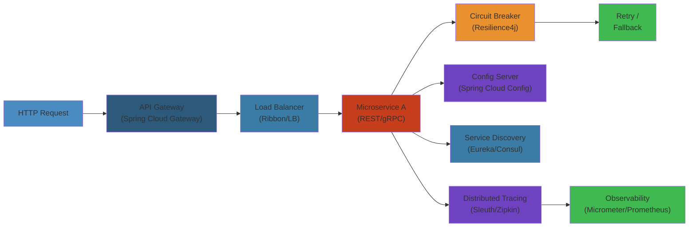
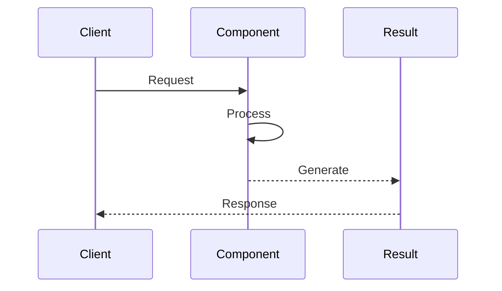
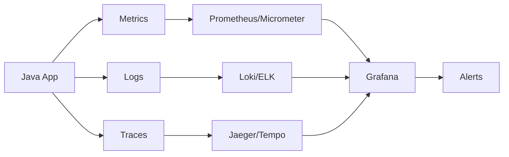

# 🌱 Spring Boot Advanced — Complete Deep Dive




## Table of Contents


- [Auto-Configuration](#auto-configuration)
- [Actuator](#actuator)
- [Testing](#testing)
- [Externalized Configuration](#externalized-configuration)
- [Spring Data](#spring-data)
- [Security](#security)
- [Resilience](#resilience)
- [Cloud](#cloud)

---

## Auto-Configuration




```java
// @Conditional annotations
@ConditionalOnClass(name = "com.zaxxer.hikari.HikariDataSource")
@ConditionalOnMissingBean(DataSource.class)
@ConditionalOnProperty(name = "app.feature.enabled", havingValue = "true", matchIfMissing = false)
@ConditionalOnResource(resources = "classpath:config.properties")
@ConditionalOnWebApplication(type = ConditionalOnWebApplication.Type.SERVLET)
@ConditionalOnExpression("${app.advanced:false} and ${app.feature.enabled:true}")

// Custom auto-configuration
@AutoConfiguration
@EnableConfigurationProperties(MyProperties.class)
public class MyAutoConfiguration {

    @Bean
    @ConditionalOnMissingBean
    public MyService myService(MyProperties props) {
        return new MyService(props.getUrl());
    }
}
```

## Actuator


```text
Actuator Endpoints:
┌─────────────────────────────────────────────────────┐
│  Endpoint          Path             Sensitive        │
│  ────────────────────────────────────────────────   │
│  health            /actuator/health  false          │
│  info              /actuator/info    false          │
│  metrics           /actuator/metrics  true          │
│  env               /actuator/env      true          │
│  configprops       /actuator/configprops true       │
│  loggers           /actuator/loggers  true          │
│  heapdump          /actuator/heapdump true          │
│  threaddump        /actuator/threaddump true        │
│  mappings          /actuator/mappings true          │
│  scheduledtasks    /actuator/scheduledtasks true    │
│  shutdown          /actuator/shutdown  POST-only    │
└─────────────────────────────────────────────────────┘
```

```java
// Custom health indicator
@Component
public class DatabaseHealthIndicator implements HealthIndicator {
    @Override
    public Health health() {
        try {
            jdbcTemplate.queryForObject("SELECT 1", Integer.class);
            return Health.up()
                .withDetail("database", "PostgreSQL")
                .withDetail("pool", "active: " + activeConnections())
                .build();
        } catch (Exception e) {
            return Health.down(e).build();
        }
    }
}

// Custom endpoint
@Endpoint(id = "cache")
public class CacheEndpoint {
    @ReadOperation
    public Map<String, Object> cacheStats() {
        return Map.of("hits", hitCount, "misses", missCount);
    }

    @WriteOperation
    public void clearCache() { cacheManager.getCache("default").clear(); }
}
```

## Testing


```java
// @SpringBootTest: full context
@SpringBootTest(webEnvironment = WebEnvironment.RANDOM_PORT)
class ApplicationIntegrationTest {
    @Autowired
    private TestRestTemplate restTemplate;

    @Test
    void fullIntegration() {
        ResponseEntity<String> resp = restTemplate.getForEntity("/api/users", String.class);
        assertThat(resp.getStatusCode()).is2xxSuccessful();
    }
}

// @WebMvcTest: only web layer
@WebMvcTest(UserController.class)
class UserControllerTest {
    @Autowired
    private MockMvc mockMvc;

    @MockBean
    private UserService userService;

    @Test
    void testGetUser() throws Exception {
        given(userService.findById(1L)).willReturn(new User("alice"));
        mockMvc.perform(get("/users/1"))
            .andExpect(status().isOk())
            .andExpect(jsonPath("$.name").value("alice"));
    }
}

// @DataJpaTest: only JPA layer
@DataJpaTest
@AutoConfigureTestDatabase(replace = AutoConfigureTestDatabase.Replace.NONE)
class UserRepositoryTest {
    @Autowired
    private UserRepository userRepository;

    @Test
    void testSaveAndFind() {
        userRepository.save(new User("bob"));
        assertThat(userRepository.findByName("bob")).isPresent();
    }
}

// Testcontainers
@SpringBootTest
@Testcontainers
class DatabaseTest {
    @Container
    static PostgreSQLContainer<?> postgres = new PostgreSQLContainer<>("postgres:15");

    @DynamicPropertySource
    static void properties(DynamicPropertyRegistry registry) {
        registry.add("spring.datasource.url", postgres::getJdbcUrl);
        registry.add("spring.datasource.username", postgres::getUsername);
        registry.add("spring.datasource.password", postgres::getPassword);
    }
}
```

## Externalized Configuration


```text
Property Source Ordering (highest priority first):
┌─────────────────────────────────────────────────────┐
│  1. Devtools global settings                         │
│  2. @TestPropertySource on tests                     │
│  3. @SpringBootTest properties                       │
│  4. Command line arguments (--server.port=9090)     │
│  5. SPRING_APPLICATION_JSON                          │
│  6. ServletConfig init parameters                    │
│  7. JNDI attributes                                  │
│  8. System properties (-Dkey=value)                  │
│  9. OS environment variables                         │
│  10. application-{profile}.properties                │
│  11. application.properties                          │
│  12. @PropertySource on config classes               │
│  13. Default properties (SpringApplication.setDef)   │
└─────────────────────────────────────────────────────┘
```

```java
// @ConfigurationProperties
@ConfigurationProperties(prefix = "app.datasource")
@Validated
public class DataSourceProperties {
    @NotEmpty
    private String url;
    private String username;
    @Min(1) @Max(100)
    private int maxPoolSize = 10;

    // getters & setters
}

// Custom converter for property binding
@ConfigurationPropertiesBinding
@Component
public class DurationConverter implements Converter<String, Duration> {
    @Override
    public Duration convert(String source) {
        return Duration.parse("PT" + source);
    }
}

// profile-conditional
// application-dev.yaml:
// app:
//   feature:
//     enabled: true
```

## Spring Data


```java
// Spring Data JPA Repository with advanced features
public interface UserRepository extends JpaRepository<User, Long>,
    JpaSpecificationExecutor<User>, QuerydslPredicateExecutor<User> {

    // derived query
    @Query("SELECT u FROM User u JOIN FETCH u.orders WHERE u.email = :email")
    Optional<User> findByEmail(@Param("email") String email);

    // Specifications: dynamic queries
    static Specification<User> hasName(String name) {
        return (root, query, cb) ->
            name == null ? null : cb.equal(root.get("name"), name);
    }

    static Specification<User> olderThan(int age) {
        return (root, query, cb) ->
            cb.greaterThan(root.get("age"), age);
    }
}

// Auditing
@EntityListeners(AuditingEntityListener.class)
public class BaseEntity {
    @CreatedDate
    private LocalDateTime createdAt;
    @LastModifiedDate
    private LocalDateTime updatedAt;
    @CreatedBy
    private String createdBy;
}

// Multi-tenancy
@Component
public class TenantInterceptor implements HandlerInterceptor {
    @Override
    public boolean preHandle(HttpServletRequest req, HttpServletResponse resp, Object h) {
        String tenantId = req.getHeader("X-Tenant-Id");
        TenantContext.setCurrentTenant(tenantId);
        return true;
    }
}
```

## Security


```java
@Configuration
@EnableWebSecurity
@EnableMethodSecurity  // enables @PreAuthorize etc.
public class SecurityConfig {

    @Bean
    SecurityFilterChain filterChain(HttpSecurity http) throws Exception {
        return http
            .authorizeHttpRequests(auth -> auth
                .requestMatchers("/api/public/**").permitAll()
                .requestMatchers("/api/admin/**").hasRole("ADMIN")
                .anyRequest().authenticated()
            )
            .oauth2ResourceServer(OAuth2ResourceServerConfigurer::jwt)
            .csrf(csrf -> csrf.disable()) // for REST API
            .sessionManagement(sm -> sm.sessionCreationPolicy(STATELESS))
            .build();
    }

    @Bean
    JwtDecoder jwtDecoder() {
        return NimbusJwtDecoder.withJwkSetUri("https://auth.example.com/.well-known/jwks.json")
            .build();
    }
}

// Method-level security
@RestController
public class AdminController {
    @GetMapping("/admin/users")
    @PreAuthorize("hasRole('ADMIN')")
    public List<User> listUsers(@AuthenticationPrincipal Jwt jwt) {
        return userService.findAll();
    }

    @PostMapping("/api/orders")
    @PreAuthorize("@orderSecurity.canCreate(#request.userId)")
    public Order create(@RequestBody OrderRequest request) {
        return orderService.create(request);
    }
}
```

## Resilience


```java
@Configuration
public class ResilienceConfig {

    @Bean
    public CircuitBreaker circuitBreaker() {
        return CircuitBreaker.ofDefaults("orderService");
    }

    @Bean
    public Customizer<Resilience4JCircuitBreakerFactory> factoryCustomizer() {
        return factory -> factory.configure(
            builder -> builder
                .slidingWindowSize(100)
                .minimumNumberOfCalls(10)
                .failureRateThreshold(50)
                .waitDurationInOpenState(Duration.ofSeconds(10))
                .permittedNumberOfCallsInHalfOpenState(5),
            "orderService"
        );
    }
}

// @CircuitBreaker annotation
@Service
public class OrderService {
    @CircuitBreaker(name = "orderService", fallbackMethod = "fallbackOrder")
    public Order getOrder(Long id) {
        return orderClient.fetchOrder(id);
    }

    private Order fallbackOrder(Long id, Throwable t) {
        log.warn("Circuit open for order {}, returning cached", id);
        return cache.get(id);
    }

    @Retry(name = "paymentService", maxAttempts = 3, backoff = @Backoff(delay = 500))
    public Payment processPayment(PaymentRequest req) {
        return paymentClient.charge(req);
    }

    @RateLimiter(name = "apiLimiter", fallbackMethod = "rateLimited")
    public ApiResponse callExternalApi(Request req) {
        return externalClient.call(req);
    }
}
```

## Cloud


```java
// Service Discovery (Consul/Eureka)
@LoadBalanced
@Bean
public WebClient.Builder loadBalancedWebClient() {
    return WebClient.builder();
}

// API Gateway with Spring Cloud Gateway
@Bean
public RouteLocator customRoutes(RouteLocatorBuilder builder) {
    return builder.routes()
        .route("user-service", r -> r
            .path("/api/users/**")
            .filters(f -> f
                .circuitBreaker(c -> c
                    .setName("userServiceCB")
                    .setFallbackUri("forward:/fallback/users"))
                .retry(3)
                .prefixPath("/internal"))
            .uri("lb://user-service"))
        .route("order-service", r -> r
            .path("/api/orders/**")
            .filters(f -> f
                .addRequestHeader("X-Gateway", "true"))
            .uri("lb://order-service"))
        .build();
}

// Distributed tracing (Spring Cloud Sleuth / Micrometer Tracing)
// Just add dependency; Sleuth adds traceId/spanId to MDC
// Zipkin: send spans via HTTP or Kafka
//
// application.properties:
// management.zipkin.tracing.endpoint=http://zipkin:9411/api/v2/spans
// management.tracing.sampling.probability=1.0

// Spring Cloud Function / Stream
@Bean
public Function<String, String> uppercase() {
    return value -> value.toUpperCase();
}

// Cloud Bus (propagate config changes)
// POST /actuator/busrefresh
```

## Simplest Mental Model


> **Spring Boot = auto-configuration + starters + externalized config + actuator**
>
> - **Auto-configuration**: conditionally register beans based on classpath, properties, missing beans
> - **Actuator**: production-ready endpoints (health, metrics, env, loggers)
> - **Testing**: slice tests (`@WebMvcTest`, `@DataJpaTest`) + full `@SpringBootTest` + Testcontainers
> - **Config**: property source ordering, `@ConfigurationProperties` with validation, relaxed binding
> - **Security**: OAuth2 resource server + JWT decoder + method security with SpEL
> - **Resilience**: CircuitBreaker + Retry + RateLimiter with fallbacks
> - **Cloud**: service discovery + load-balanced WebClient + API gateway + distributed tracing


## Comparison Table


| Aspect | Option A | Option B | Trade-off |
| ---- | ---- | ---- | ---- |
| Performance | High | Medium | Speed vs Simplicity |
| Complexity | High | Low | Features vs Ease of Use |
| Scalability | Excellent | Good | Horizontal vs Vertical |
| Cost | High | Low | Features vs Budget |

## Observability




### Key Metrics


| Metric | Unit | Threshold | Indicates |
|--------|------|-----------|-----------|
| JVM heap used | % | < 75% | Memory pressure |
| GC pause (p99) | ms | < 100ms | GC tuning needed |
| Young GC frequency | /min | < 10 | Object allocation rate |
| Full GC frequency | /min | 0 (ideally) | Memory leak or metaspace |
| Thread count | count | < 500 | Thread pool exhaustion |
| Connection pool usage | % | < 80% | Database pool saturation |
| Class loading rate | classes/s | < 100 | Dynamic class generation |
| File descriptor count | count | < 70% of ulimit | FD leak |

### Logs


- **ERROR**: Uncaught exceptions, OOM, stack traces, connection pool exhaustion, thread starvation
- **WARN**: Slow queries, long GC pauses, retry attempts, deprecated API usage
- **INFO**: Server start/stop, context initialization, config loaded, scheduled tasks
- **DEBUG**: SQL queries with params, request/response headers, method entry/exit timing

### Traces


Use Micrometer Tracing (formerly Spring Cloud Sleuth) or OpenTelemetry Java SDK. Propagate trace context via MDC for log correlation.

### Alerts


| Severity | Condition | Response |
|----------|-----------|----------|
| P0 | Full GC > 1 in 5min | Heap dump, identify leak |
| P0 | Error rate > 5% | Rollback, check heap |
| P1 | GC pause > 1s | Tune GC, reduce heap pressure |
| P1 | Thread starvation | Increase pool, check deadlocks |
| P2 | Heap > 85% for 10min | Schedule capacity increase |

### Dashboards


**JVM Dashboard**: heap usage (young/old/metaspace), GC pause (count, duration per generation), thread states (runnable/blocked/waiting), class loading, JIT compilation time, file descriptor count.


## Common Failures


### Failure: OutOfMemoryError


- **Symptoms**: Application crashes with `java.lang.OutOfMemoryError`. Heap dump on exit. 503s from load balancer.
- **Root Cause**: Memory leak (unclosed streams, collections growing unbounded, ThreadLocal not cleaned). Heap too small for workload. Metaspace leak from dynamic class loading.
- **Detection**: `jstat -gcutil <pid> 1s` shows Old Gen filling. `jmap -histo:live <pid>` shows leaking class count. GC logs show Full GC repeatedly.
- **Recovery**: 1) Increase heap with `-Xmx`. 2) Enable `-XX:+HeapDumpOnOutOfMemoryError`. 3) Analyze heap dump with Eclipse MAT. 4) Restart with increased resources.
- **Prevention**: Profile with `jprofiler`/`async-profiler`. Set `-Xmx` high enough. Use `-XX:+ExitOnOutOfMemoryError` for fail-fast. Implement proper resource cleanup in `finally`/`try-with-resources`.

### Failure: Full GC Storm


- **Symptoms**: Latency spikes, CPU high, throughput drops. GC log shows Full GC events in quick succession.
- **Root Cause**: Old Gen fills up faster than concurrent GC can clear. Large object allocation (direct to Old Gen). GC fragmentation. Too many concurrent GC threads competing.
- **Detection**: GC logs show Full GC events. `jstat -gcutil` shows Old Gen at > 90% after GC. `jmap -histo` shows large byte arrays.
- **Recovery**: 1) Increase heap size. 2) Switch to G1GC or ZGC. 3) Reduce allocation rate. 4) Enable `-XX:+UseStringDeduplication`.
- **Prevention**: Use G1GC with `-XX:MaxGCPauseMillis=200`. Set `-XX:G1HeapRegionSize=16m`. Monitor allocation rate with async-profiler.

### Failure: Thread Pool Exhaustion


- **Symptoms**: "RejectedExecutionException" in logs. Tasks queue up and time out. Deadlock between thread pools.
- **Root Cause**: Task submitted faster than thread pool can process. Thread pool queue bounded. Deadlock where pool A waits for pool B, pool B waits for pool A.
- **Detection**: `jstack` shows threads in `parking to await` or `locked`. `ThreadPoolExecutor` metrics show queue size growing. Active count = pool size.
- **Recovery**: 1) `jstack` dump for deadlock analysis. 2) Emergency increase pool size. 3) Reduce task submission rate. 4) Restart.
- **Prevention**: Use separate thread pools for different workloads. Set appropriate queue capacity and rejection policy. Monitor pool active count and queue depth. Use `ThreadPoolExecutor` with `CallerRunsPolicy` as safety net.

### Failure: ClassLoader Leak


- **Symptoms**: Metaspace grows unbounded, Full GC on Metaspace, eventually OOM: Metaspace.
- **Root Cause**: Application redeploy (Tomcat) creates new ClassLoader each time. Old ClassLoader not garbage collected because some reference (often from a library thread) holds it alive. Common with thread pools initialized at deploy time.
- **Detection**: `jstat -gcutil` shows Metaspace usage climbing. Heap dump shows many `ClassLoader` instances. PermGen/Metaspace GC before OOM.
- **Recovery**: 1) Restart application server. 2) Increase Metaspace size. 3) Patch library holding ClassLoader reference.
- **Prevention**: Always use `ThreadFactory` that sets daemon threads. Use `Thread.setContextClassLoader(null)` for library threads. Test redeploy with `Profiler` to verify ClassLoader cleanup.

### Failure: Deadlock


- **Symptoms**: Threads stuck, no progress, application partially frozen. Thread dump shows threads in BLOCKED state all holding locks others need.
- **Root Cause**: Circular lock dependency. Two+ threads each hold a lock and wait for another thread's lock. Classic dining philosophers.
- **Detection**: `jstack` shows deadlock detection: "Found one Java-level deadlock". Thread state: BLOCKED on a lock held by another thread that's waiting on this thread's lock.
- **Recovery**: 1) Kill the stuck threads or restart JVM. 2) `jstack -l <pid>` to identify deadlocked threads. 3) Fix locking order in code.
- **Prevention**: Always acquire locks in consistent order. Use `tryLock` with timeout instead of `synchronized`. Use `java.util.concurrent` classes. Enable `-XX:+PrintConcurrentLocks`.

## Related

- [Jvm Performance](/18-performance-engineering/jvm-tuning/01-jvm-performance.md)
- [Cap Consistency](/09-distributed-systems/01-cap-consistency.md)
- [Consensus Replication](/09-distributed-systems/01-consensus-replication.md)
- [Consensus Raft](/09-distributed-systems/02-consensus-raft.md)
- [Distributed Transactions](/09-distributed-systems/02-distributed-transactions.md)
- [Distributed Caching](/09-distributed-systems/03-distributed-caching.md)

---

## Interactive Component: Java Thread Lifecycle

<div style="padding:16px;background:#0b0e14;border:1px solid #1e2a3a;border-radius:8px">
  <style>.state-machine-title{color:#00d4ff;font-family:monospace;font-size:14px;font-weight:bold;margin-bottom:16px}.state-demo{text-align:center}.state-display{font-size:18px;font-family:monospace;padding:16px;border-radius:4px;margin:16px 0;color:#0b0e14;font-weight:bold;min-height:50px;display:flex;align-items:center;justify-content:center;border:2px solid currentColor}.state-new{background:#9333ea;border-color:#7e22ce}.state-runnable{background:#34d399;border-color:#22c55e}.state-running{background:#00d4ff;border-color:#0099cc;color:#0b0e14}.state-waiting{background:#fbbf24;border-color:#f59e0b}.state-terminated{background:#ef4444;border-color:#dc2626}.state-buttons{display:flex;gap:8px;justify-content:center;flex-wrap:wrap;margin-top:16px}.state-button{padding:8px 16px;border:1px solid #00d4ff;background:#1e3a5f;color:#00d4ff;border-radius:4px;cursor:pointer;font-family:monospace;font-size:12px;transition:all 0.2s}.state-button:hover{background:#2a5a8f;box-shadow:0 0 8px #00d4ff}</style>
  <div class="state-machine-title">Java Thread Lifecycle State Machine</div>
  <div class="state-demo">
    <div class="state-display state-new" id="state-display">NEW</div>
    <div class="state-buttons">
      <button class="state-button" onclick="setState('NEW', javaStateMap)">New (created)</button>
      <button class="state-button" onclick="setState('RUNNABLE', javaStateMap)">Runnable (start())</button>
      <button class="state-button" onclick="setState('RUNNING', javaStateMap)">Running (scheduler)</button>
      <button class="state-button" onclick="setState('WAITING', javaStateMap)">Waiting (lock/wait)</button>
      <button class="state-button" onclick="setState('TERMINATED', javaStateMap)">Terminated (done)</button>
    </div>
  </div>
  <script>
    const javaStateMap = {
      'NEW': { label: 'NEW', class: 'state-new' },
      'RUNNABLE': { label: 'RUNNABLE', class: 'state-runnable' },
      'RUNNING': { label: 'RUNNING', class: 'state-running' },
      'WAITING': { label: 'WAITING', class: 'state-waiting' },
      'TERMINATED': { label: 'TERMINATED', class: 'state-terminated' }
    };
    function setState(state, sm) {
      const display = document.getElementById('state-display');
      const info = sm[state];
      display.textContent = info.label;
      display.className = 'state-display ' + info.class;
    }
  </script>
</div>


---

## Interactive Component: Java Heap Memory Observability

<div style="padding:16px;background:#0b0e14;border:1px solid #1e2a3a;border-radius:8px">
  <style>.obs-title{color:#00d4ff;font-family:monospace;font-size:14px;font-weight:bold;margin-bottom:16px}.obs-grid{display:grid;grid-template-columns:repeat(auto-fit, minmax(150px, 1fr));gap:12px}.obs-card{padding:12px;background:#1a2332;border:1px solid #1e3a5f;border-radius:4px;display:flex;flex-direction:column;align-items:center;transition:all 0.3s}.obs-card:hover{border-color:#00d4ff;box-shadow:0 0 8px rgba(0, 212, 255, 0.3)}.obs-label{color:#a3aab8;font-family:monospace;font-size:11px;text-transform:uppercase;letter-spacing:0.5px;margin-bottom:8px}.obs-value{font-family:monospace;font-size:20px;font-weight:bold;margin-bottom:4px;letter-spacing:0.5px}.obs-unit{color:#a3aab8;font-family:monospace;font-size:10px;text-transform:uppercase}.metric-healthy{color:#34d399}.metric-warning{color:#fbbf24}.metric-critical{color:#ef4444}</style>
  <div class="obs-title">JVM Heap Memory Metrics</div>
  <div class="obs-grid">
    <div class="obs-card">
      <div class="obs-label">Heap Used</div>
      <div class="obs-value metric-warning">712</div>
      <div class="obs-unit">MB</div>
    </div>
    <div class="obs-card">
      <div class="obs-label">Heap Max</div>
      <div class="obs-value metric-healthy">1024</div>
      <div class="obs-unit">MB</div>
    </div>
    <div class="obs-card">
      <div class="obs-label">GC Pause</div>
      <div class="obs-value metric-healthy">85</div>
      <div class="obs-unit">ms</div>
    </div>
    <div class="obs-card">
      <div class="obs-label">Eden Usage</div>
      <div class="obs-value metric-healthy">45</div>
      <div class="obs-unit">%</div>
    </div>
  </div>
</div>


---

## Interactive Component: Thread Pool Configuration

<div style="padding:16px;background:#0b0e14;border:1px solid #1e2a3a;border-radius:8px">
  <style>.slider-title{color:#00d4ff;font-family:monospace;font-size:14px;font-weight:bold;margin-bottom:12px}.slider-container{display:flex;flex-direction:column;gap:12px}.slider-label{color:#e3eaf0;font-family:monospace;font-size:12px}.slider-wrapper{display:flex;align-items:center;gap:12px}.slider-input{flex:1;height:6px;border-radius:3px;background:#1e3a5f;outline:none;-webkit-appearance:none;appearance:none}.slider-input::-webkit-slider-thumb{-webkit-appearance:none;appearance:none;width:18px;height:18px;border-radius:50%;background:#00d4ff;cursor:pointer;box-shadow:0 0 8px #00d4ff;border:2px solid #0b0e14}.slider-input::-moz-range-thumb{width:18px;height:18px;border-radius:50%;background:#00d4ff;cursor:pointer;box-shadow:0 0 8px #00d4ff;border:2px solid #0b0e14}.slider-value{font-family:monospace;color:#34d399;min-width:80px;text-align:right;font-size:12px;font-weight:bold}</style>
  <div class="slider-title">Thread Pool Configuration</div>
  <div class="slider-container">
    <label class="slider-label">Core Pool Size:</label>
    <div class="slider-wrapper">
      <input type="range" min="1" max="64" value="8" class="slider-input" id="pool-slider">
      <span class="slider-value" id="pool-value">8 threads</span>
    </div>
  </div>
  <script>
    const slider = document.getElementById('pool-slider');
    const value = document.getElementById('pool-value');
    slider.addEventListener('input', (e) => { value.textContent = e.target.value + ' threads'; });
  </script>
</div>


---

## Interactive Component: Exception Cascade Simulator

<div style="padding:16px;background:#0b0e14;border:1px solid #1e2a3a;border-radius:8px">
  <style>.cascade-title{color:#00d4ff;font-family:monospace;font-size:14px;font-weight:bold;margin-bottom:16px}.cascade-stages{display:flex;flex-direction:column;gap:12px;margin-bottom:16px}.cascade-stage{display:flex;align-items:center;gap:12px}.cascade-label{color:#e3eaf0;font-family:monospace;font-size:12px;min-width:120px}.cascade-indicator{width:24px;height:24px;border-radius:4px;background:#34d399;border:2px solid #22c55e;transition:all 0.3s}.cascade-indicator.failing{background:#ef4444;border-color:#dc2626;box-shadow:0 0 12px #ef4444;animation:cascade-fail 0.6s ease-out}@keyframes cascade-fail{0%{transform:scale(1);opacity:1}100%{transform:scale(1.2);opacity:0.8}}.cascade-controls{display:flex;gap:8px;flex-wrap:wrap}.cascade-button{padding:8px 16px;border:1px solid #00d4ff;background:#1e3a5f;color:#00d4ff;border-radius:4px;cursor:pointer;font-family:monospace;font-size:12px;transition:all 0.2s}.cascade-button:hover{background:#2a5a8f;box-shadow:0 0 8px #00d4ff}</style>
  <div class="cascade-title">Exception Stack Unwinding Cascade</div>
  <div class="cascade-stages">
    <div class="cascade-stage"><span class="cascade-label">Method A</span><div class="cascade-indicator" data-stage="a"></div></div>
    <div class="cascade-stage"><span class="cascade-label">Method B (try)</span><div class="cascade-indicator" data-stage="b"></div></div>
    <div class="cascade-stage"><span class="cascade-label">Method C (finally)</span><div class="cascade-indicator" data-stage="c"></div></div>
    <div class="cascade-stage"><span class="cascade-label">Stack Unwound</span><div class="cascade-indicator" data-stage="d"></div></div>
  </div>
  <div class="cascade-controls">
    <button class="cascade-button" onclick="throwException()">Throw Exception</button>
    <button class="cascade-button" onclick="resetException()">Reset</button>
  </div>
  <script>
    function throwException() {
      const stages = ['a', 'b', 'c', 'd'];
      let delay = 0;
      stages.forEach((id) => {
        setTimeout(() => {
          document.querySelector('[data-stage="'+id+'"]').classList.add('failing');
        }, delay);
        delay += 300;
      });
    }
    function resetException() {
      document.querySelectorAll('[data-stage]').forEach(s => s.classList.remove('failing'));
    }
  </script>
</div>

