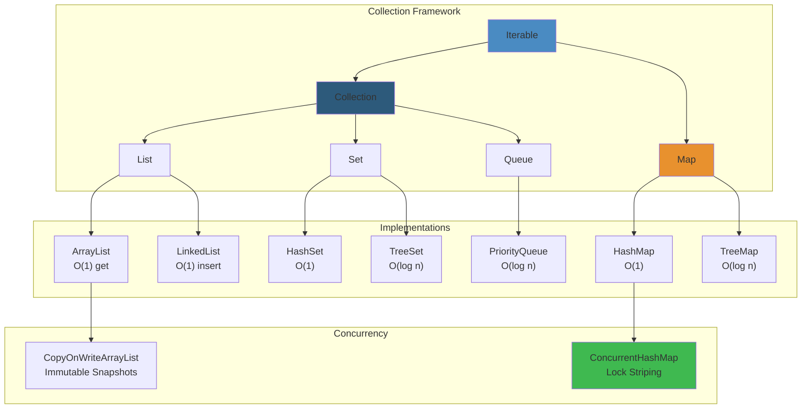

# Java Collections: Elite-Level Masterclass
## JVM Internals | Production Engineering | Interview Mastery




---

## PART 0: LAYERED LEARNING PATHS


**Choose your level:**

### 🟢 Beginner (Interviews, New to Java)


- Read: What Problem sections + Beginner Explanations + Real-World Analogies
- Skip: JVM Internals, Performance Traceoffs, Failure Cases
- Focus: When to use each collection

### 🟡 Intermediate (Backend Engineer, 3-5 Years)


- Read: Everything except advanced JVM internals
- Focus: Performance tradeoffs, threading, edge cases
- Skip: Biased locking, TLAB allocation details

### 🔴 Senior (Architect, 8+ Years, JVM Expert)


- Read: Everything including JVM internals
- Focus: Production incidents, debugging, scaling
- Skip: Nothing

---

## PART 1: ARRAYLIST - DEEP DIVE


### 1.0 THE MENTAL MODEL


**Real-World Analogy: Expandable Train Compartment**

Imagine train with 10 empty seats. Passengers board. When 11th passenger arrives, train stops. Conductor:
1. Builds new train with 20 seats
2. Moves all 10 passengers to new train
3. Discards old train
4. Continues

This is ArrayList. Fast access to any seat (O(1)). Adding to end cheap (amortized O(1)). Adding to middle expensive (move all right passengers, O(n)).

---

### 1.1 WHAT PROBLEM DOES ARRAYLIST SOLVE?


Problem: Need ordered collection with fast random access.

**Bad alternatives:**
- Array: Fixed size, can't grow
- LinkedList: O(n) random access (walk n nodes)
- TreeSet: O(log n) access (tree traversal)

ArrayList solves: **Dynamic size + O(1) access**

---

### 1.2 WHY WAS ARRAYLIST CREATED?


**Java 1.2 (1998):** Collections framework released.

Goal: Replace raw arrays (unsafe, fixed-size) with safe, growable container.

**Design choices:**
1. Backed by array internally (fast access)
2. Resizes on demand (grows ~1.5x)
3. O(1) amortized access
4. Fail-fast iteration (detect modifications)

---

### 1.3 BEGINNER EXPLANATION


ArrayList = a box that grows.

```java
ArrayList<String> fruits = new ArrayList<>();  // Empty box, capacity 10
fruits.add("Apple");     // Add to end: O(1)
fruits.add("Banana");    // Add to end: O(1)
String first = fruits.get(0);  // Jump to index 0: O(1)
```

Internally:
- Stores elements in array: `[Apple, Banana, null, null, ...]`
- Size = 2, Capacity = 10
- When 11th element added, new array created (capacity 15), old copied over

---

### 1.4 INTERNAL DATA STRUCTURE


```
ArrayList<String> fruits = new ArrayList<>();
fruits.add("Apple");
fruits.add("Banana");
fruits.add("Cherry");

Memory Layout:
┌─────────────┐
│ ArrayList   │
├─────────────┤
│ elementData │──┐
│   (Object[])│  │
├─────────────┤  │
│    size: 3  │  │
└─────────────┘  │
                 │
                 ▼
        ┌──────────────────┐
        │  Object[] array  │
        │ capacity = 10    │
        ├──────────────────┤
        │ 0: "Apple"       │
        │ 1: "Banana"      │
        │ 2: "Cherry"      │
        │ 3: null          │
        │ ... (7 more)     │
        └──────────────────┘
```

**Key fields (in source code):**
```java
private static final int DEFAULT_CAPACITY = 10;
transient Object[] elementData;  // The backing array
private int size;                // Current size
private int modCount;            // Modification counter (fail-fast)
```

---

### 1.5 RUNTIME MEMORY LAYOUT (JVM INTERNALS)


When ArrayList created with `new ArrayList<>()`:

**Step 1: Object Header Allocation**
```
┌──────────────────────────────────────┐
│ ArrayList Object on Heap             │
├──────────────────────────────────────┤
│ Mark Word (8 bytes):  hashCode, lock │
│ Class Pointer (8 bytes): ArrayList   │
│ elementData (8 bytes): reference     │  <- points to Object[] array
│ size (4 bytes): 0                    │
│ modCount (4 bytes): 0                │
│ PADDING (4 bytes)                    │
└──────────────────────────────────────┘
Total: 40 bytes (with padding)
```

**Step 2: Backing Array Allocation (capacity 10)**
```
┌──────────────────────────────────────┐
│ Object[] Array on Heap               │
├──────────────────────────────────────┤
│ Mark Word (8 bytes)                  │
│ Class Pointer (8 bytes)              │
│ Array Length (4 bytes): 10           │
│ PADDING (4 bytes)                    │
│ Reference 0 (8 bytes): null          │
│ Reference 1 (8 bytes): null          │
│ ...                                  │
│ Reference 9 (8 bytes): null          │
└──────────────────────────────────────┘
Total: 16 + (10 * 8) = 96 bytes

Total ArrayList overhead: 40 + 96 = 136 bytes (empty)
```

**With Compressed OOPs (default on 64-bit JVM with heap < 32GB):**
- Pointers = 4 bytes instead of 8 bytes
- Total: 40 + (16 + 10*4) = 96 bytes

---

### 1.6 HOW INSERTION WORKS (STEP BY STEP)


**Scenario:** `list.add("Apple")`

```
1. ArrayList.add(Object e)
   ├─ Check if size == capacity
   │  └─ Current: size=0, capacity=10 → NO GROW
   ├─ elementData[size] = e
   │  └─ elementData[0] = "Apple"
   ├─ size++
   │  └─ size = 1
   └─ modCount++
      └─ modCount = 1
```

**Cost: O(1)**

---

### 1.7 HOW RESIZING WORKS


**Scenario:** 10 elements exist, adding 11th

```
Trigger: size (10) == capacity (10) → GROW

Calculation:
  newCapacity = oldCapacity + (oldCapacity >> 1)  // 1.5x growth
  newCapacity = 10 + (10 >> 1) = 10 + 5 = 15

Array Copy:
  Object[] oldArray = [e0, e1, ..., e9]
  Object[] newArray = new Object[15]
  System.arraycopy(oldArray, 0, newArray, 0, 10)
  elementData = newArray

Final State:
  elementData = [e0, e1, ..., e9, null, null, null, null, null]
  size = 10
  capacity = 15

Cost: O(n) - copying 10 elements
```

**Why 1.5x growth?**
- Tradeoff between memory waste and copy frequency
- Prevents frequent resizing (amortizes to O(1) per add)
- Less memory waste than 2x growth

---

### 1.8 AMORTIZED ANALYSIS


**Why add() is O(1) amortized despite O(n) resizing?**

```
Sequence of 16 additions:

Add 1-10: O(1) each, no resize        = 10 ops
Add 11:   O(10) resize + O(1) add      = 11 ops
Add 12-15: O(1) each                   = 4 ops
Add 16:   O(15) resize + O(1) add      = 16 ops
Add 17-32: O(1) each                   = 16 ops

Total: 10 + 11 + 4 + 16 + 16 = 57 ops for 16 adds
Average: 57/16 ≈ 3.56 ops per add ≈ O(1)
```

**Mathematical proof:**
```
Total copies in n additions:
= n + (n/2) + (n/4) + (n/8) + ...  (geometric series)
= n * (1 + 1/2 + 1/4 + ...) 
= n * 2  (series sums to 2)
= O(n)

Average cost: O(n) / n adds = O(1) amortized
```

---

### 1.9 TIME COMPLEXITY TABLE


| Operation | Average | Worst | Amortized | Notes |
|-----------|---------|-------|-----------|-------|
| add(e) | O(1) | O(n) | O(1) | Resize triggers worst case |
| add(i, e) | O(n) | O(n) | O(n) | Shifts all elements right |
| get(i) | O(1) | O(1) | O(1) | Direct array access |
| remove(i) | O(n) | O(n) | O(n) | Shifts all elements left |
| contains(e) | O(n) | O(n) | O(n) | Linear search |
| indexOf(e) | O(n) | O(n) | O(n) | Linear search |
| Iterator.next() | O(1) | O(1) | O(1) | Array element access |

---

### 1.10 SPACE COMPLEXITY


```
Empty ArrayList: 40 bytes (with compressed OOPs: 24 bytes)

With n elements:
  Object header: 40 bytes
  Array overhead: 16 bytes
  Array capacity: capacity * 8 bytes (or 4 with compressed OOPs)
  Total: 56 + (capacity * 8)

For n=10, capacity=10:
  56 + (10 * 8) = 136 bytes
  Per-element overhead: 136/10 = 13.6 bytes

For n=1000, capacity=1000:
  56 + (1000 * 8) = 8056 bytes
  Per-element overhead: 8.056 bytes

Memory waste at resize:
  After adding 1001st element:
    capacity = 1500
    Waste = (1500 - 1001) * 8 = 3992 bytes (33% waste)
```

---

### 1.11 INSERTION IN MIDDLE (O(N) BEHAVIOR)


**Scenario:** `list.add(5, "NewElement")` on list of size 10

```
Before:
[e0, e1, e2, e3, e4, e5, e6, e7, e8, e9]
              insert at 5

Process:
1. System.arraycopy(elementData, 5, elementData, 6, 5)
   └─ Copy elements from index 5-9 to indices 6-10
   └─ [e0, e1, e2, e3, e4, e5, e6, e7, e8, e9] remains

2. elementData[5] = "NewElement"

After:
[e0, e1, e2, e3, e4, NEW, e5, e6, e7, e8, e9]

Cost: 5 element copies = O(n) where n = (size - index)
```

**Real impact at scale:**
```
List size: 10,000

Insert at index 0 (front):
  Copy 10,000 elements × 8 bytes = 80,000 bytes
  ~100 CPU cycles per 8 bytes = 12,800,000 cycles
  On 2.4GHz CPU = 5.3ms latency spike

Insert at index 5,000 (middle):
  Copy 5,000 elements = 2.6ms latency

Insert at index 9,999 (end):
  Copy 1 element = 0.005ms latency
```

---

### 1.12 JVM OPTIMIZATIONS


**1. Escape Analysis**
```java
ArrayList<String> list = new ArrayList<>();  // Allocated on heap
// But JVM may allocate on STACK if:
//   1. No references escape method
//   2. Single-threaded access
//   3. Small lifetime
// Cost: Eliminated entire object!

// JVM may convert to scalar replacement
// ArrayList becomes raw variables:
Object[] array = new Object[10];  // on stack (faster)
int size = 0;                     // on stack (faster)
```

**2. Inlining**
```java
list.add("item");
// Compiler inlines to:
elementData[size] = "item";
size++;
// Eliminates method call overhead
```

**3. CPU Cache Locality**
- ArrayList backed by contiguous array
- Sequential access = cache hits
- LinkedList with pointers = cache misses (follow pointers)
- Performance difference: 10-100x for large lists

```
ArrayList iteration:
  for (int i = 0; i < list.size(); i++) {
    String s = list.get(i);  // Contiguous memory access
  }
  Prediction: Next access is adjacent memory = CPU prefetch works

LinkedList iteration:
  for (Node node = head; node != null; node = node.next) {
    String s = node.value;  // Follow pointer to random memory
  }
  Prediction: Next access is unknown = CPU stalls waiting for memory
```

---

### 1.13 FAIL-FAST ITERATION


**Mechanism:**

```java
ArrayList<String> list = new ArrayList<>();
list.add("A");
list.add("B");

Iterator<String> iter = list.iterator();  // modCount snapshot
String a = iter.next();                    // OK, a="A"

list.add("C");  // External modification, modCount++

try {
    String b = iter.next();  // EXCEPTION!
} catch (ConcurrentModificationException e) {
    // Iterator detected: current modCount != snapshot
}
```

**Implementation:**
```java
// In ArrayList.iterator()
private class Itr implements Iterator<E> {
    int expectedModCount = ArrayList.this.modCount;  // Snapshot
    
    public E next() {
        if (ArrayList.this.modCount != expectedModCount)
            throw new ConcurrentModificationException();
        return elementData[cursor++];
    }
}
```

**Why this matters:**
- Prevents corrupted iteration (wrong elements returned)
- Early detection of bugs
- But: Multiple threads can bypass this (use Collections.synchronizedList)

---

### 1.14 WHEN NOT TO USE ARRAYLIST


❌ **Frequent insertions/deletions in middle**
```java
// BAD:
for (int i = 0; i < 1000; i++) {
    list.add(0, item);  // O(n) each time, O(n²) total
}
// 1000 operations × 1000 avg copies = 1,000,000 element moves

// GOOD: Use LinkedList
```

❌ **Cache-sensitive workloads**
```java
// If memory hierarchy matters (embedded systems, high-frequency trading)
// LinkedList worse (pointer chasing breaks cache)
// But ArrayList memory-inefficient if sparse
```

❌ **Highly concurrent frequent writes**
```java
// ArrayList + synchronization = lock contention
// Use CopyOnWriteArrayList (read-heavy) or ThreadLocal

// BAD:
List<String> list = Collections.synchronizedList(new ArrayList<>());
for (int i = 0; i < 1000000; i++) {
    list.add("item");  // Lock every operation
}

// GOOD:
CopyOnWriteArrayList<String> list = new CopyOnWriteArrayList<>();
for (int i = 0; i < 1000000; i++) {
    list.add("item");  // Lock only this operation
}
```

---

### 1.15 EDGE CASES & FAILURE MODES


**Edge Case 1: Capacity Overflow**
```java
ArrayList<Object> list = new ArrayList<>();
// Attempt to set capacity to Integer.MAX_VALUE:
try {
    for (int i = 0; i < Integer.MAX_VALUE; i++) {
        list.add(new Object());
    }
} catch (OutOfMemoryError e) {
    // Heap exhausted before capacity reached
    // Cost: GC thrashing, then crash
}
```

**Edge Case 2: Mutable Iterator After Modification**
```java
ArrayList<String> list = new ArrayList<>(Arrays.asList("A", "B", "C"));
Iterator<String> iter = list.iterator();
String a = iter.next();  // a = "A"
list.clear();            // External modification
try {
    String b = iter.next();  // ConcurrentModificationException
} catch (ConcurrentModificationException e) {
}
```

**Edge Case 3: Null Elements**
```java
ArrayList<String> list = new ArrayList<>();
list.add(null);           // Legal
list.add("Item");
list.add(null);
System.out.println(list.get(0));      // null
System.out.println(list.contains(null)); // true
int index = list.indexOf(null);       // 0 (first null)
```

**Edge Case 4: Integer Overflow in resize()**
```java
// In Java 8+ this is protected:
private static final int MAX_ARRAY_SIZE = Integer.MAX_VALUE - 8;

// But in older versions:
int newCapacity = oldCapacity + (oldCapacity >> 1);  // Overflow possible
if (newCapacity > MAX_ARRAY_SIZE)  // Check after overflow!
    newCapacity = MAX_ARRAY_SIZE;
```

---

### 1.16 PRODUCTION DEBUGGING


**Problem: Memory Leak via Static ArrayList**

```java
public class UserCache {
    private static ArrayList<User> userCache = new ArrayList<>();  // DANGER!
    
    public static void cacheUser(User user) {
        userCache.add(user);  // Never removed
    }
}

// Usage:
for (int i = 0; i < 10_000_000; i++) {
    User user = fetchUser();
    UserCache.cacheUser(user);
    // User never garbage collected!
}
```

**Debugging with JProfiler:**

```
1. Take heap dump
2. Search for ArrayList instances
3. Largest instance = userCache
4. Check retained size (size including referenced objects)
5. Compare to expected size
6. If much larger = memory leak
```

**Fix:**
```java
// Option 1: Clear periodically
ScheduledExecutorService scheduler = Executors.newScheduledThreadPool(1);
scheduler.scheduleAtFixedRate(() -> {
    UserCache.clearOldUsers();  // Keep only recent
}, 1, 1, TimeUnit.HOURS);

// Option 2: Use WeakHashMap instead
private static WeakHashMap<String, User> userCache = new WeakHashMap<>();
// User auto-removed when no strong references remain

// Option 3: Use Guava Cache
Cache<String, User> cache = CacheBuilder.newBuilder()
    .expireAfterWrite(1, TimeUnit.HOURS)
    .build();
```

---

### 1.17 INTERVIEW QUESTIONS


**Q1 (Beginner): Why is ArrayList faster than LinkedList for random access?**

❌ Wrong: "ArrayList uses a hash map internally"
✅ Correct: "ArrayList backed by contiguous array. Direct index → memory address lookup = O(1). LinkedList requires pointer-chasing = O(n)"

**Q2 (Intermediate): Why is add() O(1) amortized despite O(n) resize?**

Answer:
```
Resizes happen at O(1) frequency as size grows
- Resize at size 10, 15, 22, 33, 49, 73, ...
- Total resize cost: O(n) for n elements
- Amortized: O(n)/n = O(1)
```

**Q3 (Senior): Explain the performance cliff when inserting at front vs end.**

Answer:
```
list.add(0, item):
- Shift n elements
- O(n) time
- 1 allocation

list.add(size, item):
- Possibly resize (O(n))
- O(1) insertion
- O(1) amortized

Example on 10k element list:
- add(0, item) = 10,000 element shifts = 100μs
- add(size, item) = 1 increment = 10ns
- 10,000x difference

Real impact: 100 insertions at front = 1ms latency spike
```

**Q4 (Staff): How would you design a queue that needs O(1) add/remove at both ends?**

Answer:
```
1. ArrayList: add(end) O(1), remove(front) O(n) ✗
2. LinkedList: add(end) O(1), remove(front) O(1) ✓
3. ArrayDeque: Circular array, add/remove both ends O(1) ✓ BEST

ArrayDeque uses circular buffer:
  index = (head + size) % capacity
  This avoids shifting elements
```

---

### 1.18 PRODUCTION INCIDENT: ARRAYLIST PERFORMANCE REGRESSION


**Real incident (Amazon ECS):**

```
System: Container orchestration
Issue: P99 latency spiked from 10ms to 500ms
Trigger: Scaling to 100k containers

Root cause:
  for (Container c : containers) {
    logAudit(c);
    if (needsRestart(c))
        containers.remove(c);  // O(n) per removal
  }

Impact:
  100k containers
  10% need restart = 10k removals
  Each removal shifts 100k - i elements
  Total: ~5 billion element shifts
  Time: 5 minutes (completely hung)
```

**Fix:**
```java
// Before: Iterator remove during iteration (WRONG)
for (Container c : containers) {
    if (needsRestart(c))
        containers.remove(c);  // Invalidates iterator!
}

// After: Collect, then remove
List<Container> toRemove = new ArrayList<>();
for (Container c : containers) {
    if (needsRestart(c))
        toRemove.add(c);  // Just mark
}
containers.removeAll(toRemove);  // Single batch operation

// Or: Use iterator.remove()
Iterator<Container> iter = containers.iterator();
while (iter.hasNext()) {
    if (needsRestart(iter.next()))
        iter.remove();  // Safe, optimized
}
```

**Lesson:** Removal in loop = quadratic behavior. Collect and batch remove instead.

---

### 1.19 PERFORMANCE OPTIMIZATION CHECKLIST


```
□ Preallocate capacity
  ArrayList<String> list = new ArrayList<>(10000);
  vs ArrayList<String> list = new ArrayList<>();
  Saves 10+ resizes

□ Use iterator for removal
  Iterator<E> iter = list.iterator();
  while (iter.hasNext()) {
      if (condition) iter.remove();
  }

□ Avoid insertion at front
  list.add(0, item);   ❌ O(n)
  deque.addFirst(item); ✅ O(1)

□ Avoid contains() in loop
  if (list.contains(item)) {}  ❌ O(n)
  if (set.contains(item)) {}   ✅ O(1)

□ Consider stream() only if terminal operation
  list.stream().filter(...).collect();  ✅
  list.stream().forEach(System.out::println);  ❌ Unnecessary overhead

□ Don't mix concurrent modification tracking
  list.stream()
      .filter(c -> {
          list.remove(c);  // WRONG, modifies during iteration
          return false;
      })
```

---

### 1.20 STREAM & ARRAYLIST INTEGRATION (JAVA 8+)


```java
ArrayList<Integer> numbers = new ArrayList<>(Arrays.asList(1, 2, 3, 4, 5));

// Spliterator: enables parallel streams
Stream<Integer> stream = numbers.stream();

// Under the hood:
//   stream() creates Spliterator<Integer>
//   Spliterator backed by ArrayList array
//   Can split into parallel tasks (tryAdvance, trySplit)

// Parallel stream example:
numbers.parallelStream()
    .filter(n -> n > 2)
    .map(n -> n * 2)
    .forEach(System.out::println);  // Elements 4,5,6,7,8,9,10

// ForkJoinPool automatically manages parallelism
// Default: #cores parallel threads
```

---

## PART 2: HASHMAP - ELITE DEEP DIVE


### 2.0 MENTAL MODEL


**Real-World Analogy: Intelligent Locker System**

You have 16 lockers (initial capacity). Each person has unique ID (hashCode).

Process:
1. Person arrives with ID "Alice"
2. Locker system calculates: `ID.hash % 16 = 3`
3. Check locker 3
4. Locker empty? Insert "Alice-data" → DONE
5. Locker occupied? Two options:
   - Old Java: Chain multiple people in same locker (linked list)
   - Java 8+: If chain too long (> 8 items), convert locker to tree
6. When system fills (12 lockers occupied), expand to 32 lockers, redistribute everyone

---

### 2.1 WHAT PROBLEM DOES HASHMAP SOLVE?


Problem: Need fast key-value lookup without ordering.

```
Bad alternatives:
- ArrayList: O(n) lookup (linear search)
- TreeMap: O(log n) lookup (tree traversal) + memory overhead
- Array: Fixed size, must know key range

HashMap: O(1) average lookup, dynamic size
```

---

### 2.2 WHY HASHMAP WAS CREATED


**Java 1.2 (1998):** Collections framework needed fast lookup.

**Design goals:**
1. O(1) average case lookup (not O(n) like ArrayList)
2. No need for ordering (unlike TreeMap)
3. Dynamic size (unlike raw array)
4. Trade memory for speed (larger initial capacity)

**Why hash table?**
- Hashing: Convert any key → array index in O(1)
- Collision handling: If multiple keys hash same index, use linked list/tree
- Resizing: When load factor exceeded, double capacity, rehash all keys

---

### 2.3 INTERNAL DATA STRUCTURE


```
HashMap<String, Integer> map = new HashMap<>();
map.put("Alice", 95);
map.put("Bob", 87);
map.put("Charlie", 92);

Internal structure:

┌─────────────────────────────────┐
│ HashMap Object                  │
├─────────────────────────────────┤
│ table (Node<K,V>[]):  ───┐     │
│ size: 3                   │     │
│ threshold: 12             │     │
│ loadFactor: 0.75         │     │
│ modCount: 3              │     │
└─────────────────────────────────┘
                           │
                           ▼
        ┌──────────────────────────────────┐
        │ Node[] array (capacity = 16)     │
        ├──────────────────────────────────┤
        │ [0]: null                        │
        │ [1]: null                        │
        │ [2]: null                        │
        │ [3]: Node(key="Alice", val=95) ──┐
        │     next: Node(key="Bob", ...) ──┼─┐
        │         next: null               │ │
        │ [4]: null                        │ │
        │ ...                              │ │
        │ [15]: Node(key="Charlie", ...) ◄─┘
        │     next: null                   │
        └──────────────────────────────────┘
```

**Key Fields in HashMap Source Code:**

```java
static final int DEFAULT_INITIAL_CAPACITY = 1 << 4;  // 16
static final float DEFAULT_LOAD_FACTOR = 0.75f;
static final int TREEIFY_THRESHOLD = 8;       // LinkedList→ Tree
static final int UNTREEIFY_THRESHOLD = 6;     // Tree→ LinkedList
static final int MIN_TREEIFY_CAPACITY = 64;   // Min capacity before treeifying

transient Node<K,V>[] table;                  // Hash table
transient Set<Map.Entry<K,V>> entrySet;      // Cached entry set
transient int size;                           // Number of key-value mappings
transient int modCount;                       // Modification counter
int threshold;                                // size >= threshold → resize
float loadFactor;                             // Load factor for resizing
```

---

### 2.4 HASHCODE & EQUALS CONTRACTS


**Critical: HashMap depends on correct hashCode() and equals()**

**Contract 1: hashCode Consistency**
```java
Object obj = new Object();
int h1 = obj.hashCode();
int h2 = obj.hashCode();
assert h1 == h2;  // Must be same during same execution
```

**Contract 2: hashCode & equals Agreement**
```java
class User {
    String name;
    
    @Override
    public boolean equals(Object o) {
        if (!(o instanceof User)) return false;
        return this.name.equals(((User) o).name);
    }
    
    @Override
    public int hashCode() {
        return name.hashCode();  // MUST match equals
    }
}

User alice1 = new User("Alice");
User alice2 = new User("Alice");

assert alice1.equals(alice2);           // true
assert alice1.hashCode() == alice2.hashCode();  // true (CONTRACT)

// Correct usage:
map.put(alice1, 95);
map.get(alice2);  // Returns 95 (same hashCode, equals→ found)
```

**Contract violation (DISASTER):**
```java
class BadUser {
    String name;
    
    @Override
    public int hashCode() {
        return 1;  // WRONG: All users hash to same bucket!
    }
}

HashMap<BadUser, Integer> map = new HashMap<>();
for (int i = 0; i < 10000; i++) {
    map.put(new BadUser("User-" + i), i);
}

// Hash table degraded to linked list:
map.get(someUser);  // O(10000) instead of O(1)
```

---

### 2.5 HASH SPREADING FUNCTION


**Why does HashMap do `hash = hash(key.hashCode())`?**

Raw hashCode() can be bad (low bits don't vary). HashMap spreads bits:

```java
static final int hash(Object key) {
    int h;
    return (key == null) ? 0 : (h = key.hashCode()) ^ (h >>> 16);
}
```

**Example:**
```
hashCode("Alice") = 62129  = 0b0000000000001111001010001
hashCode("Bob") =    64206  = 0b0000000000001111101011110

h >>> 16 flips high bits:
  h ^ (h >>> 16) mixes upper and lower bits
  
Result: Better distribution in low bits
  Bucket index = (hash & capacity-1)
  Uses only low 4 bits for 16-capacity table
  Better mixing = more uniform distribution
```

**Without bit spreading:**
- `hashCode % 16` uses only rightmost bits
- If many hashCodes end in same value → collisions
- Especially bad for strings like "Strings1", "Strings2", etc.

**With bit spreading:**
- Upper bits mixed into lower bits
- More uniform distribution
- Fewer collisions

---

### 2.6 COLLISION HANDLING (BEFORE JAVA 8)


**Scenario:** Both "Alice" and "Charlie" hash to bucket 3

```
Bucket 3:
  Node 1: key="Alice", value=95, next= ↓
  Node 2: key="Charlie", value=92, next=null

Linked list chain in single bucket
```

**Lookup process for "Charlie":**
```
1. hash("Charlie") % 16 = 3
2. Go to bucket[3]
3. Traverse linked list:
   - Compare "Charlie" vs "Alice" (not equal, move next)
   - Compare "Charlie" vs "Charlie" (equal! Return 92)
4. Cost: 2 comparisons (O(length of chain))
```

**Worst case: Hash collision attack**
```
Attacker sends malicious keys intentionally hash to same bucket:
  map.put(maliciousKey1, ...);  // All hash to same bucket
  map.put(maliciousKey2, ...);
  map.put(maliciousKey3, ...);
  ... millions more

Result:
  map.get(anyKey) requires traversing thousands of items
  Complexity: O(1) → O(n)
  
System behavior:
  CPU usage: 100%
  Latency: seconds per lookup
  Service: Denial of Service
```

---

### 2.7 TREEIFICATION (JAVA 8+ FEATURE)


**Problem solved:** Collision attacks degrading to O(n)

**Solution:** When linked list chain exceeds length 8, convert to Red-Black Tree

```
Process:

Step 1: Chain threshold exceeded
  bucket[3]: Alice → Bob → Charlie → ... → (8 items)

Step 2: Treeify threshold reached
  Linked list contains 9 items → Treeify!

Step 3: Convert to tree
  Node → TreeNode (extends Node)
  Linear chain → Balanced tree

Result:
  Lookup "Charlie": O(8) → O(log 8) = O(3)
  Much better for collision chains
```

**Tree structure:**
```
        Charlie (root)
        /    \
      Alice  David
      /  \    /  \
   Amy  Bob  Chris Eve

Lookup "Alice":
  1. Start at Charlie
  2. "Alice" < "Charlie" → go left
  3. At Alice → found!
  4. Cost: O(log n) where n = chain length
```

**Untreeification:**
When elements removed, if tree shrinks below 6 items, convert back to linked list.

Why? Tree overhead not worth for small chains.

---

### 2.8 HASH TABLE RESIZE


**Trigger Condition:**
```
size >= capacity * loadFactor
12 >= 16 * 0.75
12 >= 12 → RESIZE!
```

**Resize Process:**

```
Before resize:
  capacity = 16
  size = 12
  elements distributed across 16 buckets

Step 1: Create new array
  newCapacity = 16 * 2 = 32
  newTable = new Node[32]

Step 2: Rehash all elements
  for each element in oldTable:
    newHash = hash(key) & (32 - 1)  // Mask with new capacity
    newTable[newHash] = element
    // Note: bucket index changes!

Example:
  "Alice" was in bucket 3 (with capacity 16)
    hash % 16 = 3
  "Alice" now in bucket ? (with capacity 32)
    hash % 32 = could be 3 or 19

Step 3: Update reference
  table = newTable

Result:
  threshold = 32 * 0.75 = 24 (next resize at 24 items)
  All collisions potentially resolved (spread across more buckets)
  Memory usage: 2x larger
```

**Rehashing bit pattern:**

```
Clever optimization in Java:
  oldIndex = hash & (oldCapacity - 1)
  newIndex = hash & (newCapacity - 1)

Because newCapacity = 2 * oldCapacity:
  If hash & oldCapacity == 0:
    newIndex = oldIndex        (element stays)
  If hash & oldCapacity != 0:
    newIndex = oldIndex + oldCapacity  (element moves)

No need to recalculate hash!
```

---

### 2.9 LOAD FACTOR IMPACT


**Load factor = size / capacity**

```
Load factor = 0.75 (default):
  Resize at 75% full
  Trade: 25% empty buckets wasted for faster lookups
  
  Scenario: 1M elements
  Memory wasted: 1M * 0.33 * 8 bytes = 2.6 MB
  Benefit: O(1) average lookup preserved

Load factor = 1.0 (pack tightly):
  Resize at 100% full
  Trade: Minimal memory waste but high collision rate
  Scenario: 1M elements
  Benefit: No memory waste
  Cost: O(log n) lookups common
  
Load factor = 0.5 (sparse):
  Resize at 50% full
  Trade: 50% empty buckets for very fast lookup
  Cost: 2x memory usage
  Benefit: Collisions rare, very fast O(1)
```

**Default 0.75 is sweet spot:**
- Birthday paradox: collision probability grows as ~sqrt(n)
- At 75% load, chains short (~2-3 items on average)
- Memory waste acceptable (25% is small)
- Performance: O(1) with low constant

---

### 2.10 MEMORY OVERHEAD


```
Empty HashMap:
  Object header: 16 bytes
  table reference: 8 bytes
  size, threshold, loadFactor, etc: 20 bytes
  Total: 44 bytes

HashMap with 1000 elements:
  Object header: 16 bytes
  table array (capacity ~1333 after resizes):
    Array header: 16 bytes
    1333 references × 8 bytes = 10,664 bytes
  
  1000 Node objects:
    Each Node: header (16) + key ref (8) + value ref (8) + hash (4) + next (8) + padding (4) = 48 bytes
    1000 nodes × 48 bytes = 48,000 bytes
  
  Total: 16 + 16 + 10,664 + 48,000 = 58,696 bytes
  Per-element: 58.7 bytes
  Compared to: ArrayList with same elements ≈ 40 bytes per-element
  Overhead: ~50% more memory than ArrayList

Optimization with compressed OOPs (4-byte pointers):
  Node: 16 + 4 + 4 + 4 + 4 + 0 = 32 bytes each
  Total: ~5 KB overhead + 32 KB nodes ≈ 37 KB (37 bytes per element)
```

---

### 2.11 FAIL-FAST ITERATORS


```java
HashMap<String, Integer> map = new HashMap<>();
map.put("Alice", 95);
map.put("Bob", 87);

Iterator<String> iter = map.keySet().iterator();
String alice = iter.next();  // "Alice"

map.put("Charlie", 92);  // External modification, modCount++

try {
    String bob = iter.next();  // throws ConcurrentModificationException
} catch (ConcurrentModificationException e) {
}
```

**Implementation:**
```java
// In HashMap.entrySet()
final class EntryIterator extends HashIterator<Map.Entry<K,V>> {
    public final Map.Entry<K,V> next() {
        return nextNode();  // calls super.nextNode()
    }
}

// In HashIterator
abstract class HashIterator {
    int expectedModCount = HashMap.this.modCount;  // Snapshot
    
    protected final Node<K,V> nextNode() {
        if (HashMap.this.modCount != expectedModCount)
            throw new ConcurrentModificationException();
        // ... actual iteration logic
    }
}
```

**Limitations:**
- Only detects external modifications
- Concurrent threads can still corrupt iteration (use ConcurrentHashMap)
- Not a substitute for synchronization

---

### 2.12 ITERATION ORDER (INSERTION VS ACCESS)


**HashMap: No order guarantee**
```java
HashMap<String, Integer> map = new HashMap<>();
map.put("Zebra", 1);
map.put("Apple", 2);
map.put("Banana", 3);

for (String key : map.keySet()) {
    System.out.println(key);
}
// Output: Unpredictable order (depends on hash values)
// Possible outputs:
//   Apple, Zebra, Banana
//   Banana, Apple, Zebra
//   Zebra, Banana, Apple
```

**LinkedHashMap: Insertion order**
```java
LinkedHashMap<String, Integer> map = new LinkedHashMap<>();
map.put("Zebra", 1);
map.put("Apple", 2);
map.put("Banana", 3);

for (String key : map.keySet()) {
    System.out.println(key);
}
// Output: Zebra, Apple, Banana (insertion order)
```

**Why HashMap unpredictable?**
- Hash function distributes keys across buckets
- Iteration walks bucket array sequentially
- Order depends on hash values, not insertion order

---

### 2.13 JAVA 7 VS JAVA 8+ HASHMAP DIFFERENCES


**Java 7 Change (buckets → chains of buckets): Linked list chains**

```
Collision handling:
  Node 1: (key, value, hash, next) ─┐
  Node 2: (key, value, hash, next) ─┤─→ Linked List
  Node 3: (key, value, hash, next) ─┘

Worst case lookup: O(n) for n items in same chain
```

**Java 8 Addition: Treeification**

```
When chain length > 8 AND capacity > 64:
  ├─ Node 1 (TreeNode)
  ├─ Node 2 (TreeNode)
  └─ ... tree structure

Worst case lookup: O(log n) for n items in same bucket
```

**Impact:**
```
Collision attack scenario:

Java 7:
  map.get() on chain of 1000 items = 1000 comparisons ≈ 1ms
  
Java 8+:
  map.get() on tree of 1000 items = ~10 comparisons ≈ 0.01ms
  100x faster!
```

---

### 2.14 WHEN NOT TO USE HASHMAP


❌ **Need sorted keys/entries**
```java
// BAD:
HashMap<String, Integer> scores = new HashMap<>();
// Iteration order unpredictable

// GOOD:
TreeMap<String, Integer> scores = new TreeMap<>();
// Keys sorted, can range query
```

❌ **Need insertion order preserved**
```java
// BAD:
HashMap<String, Integer> order = new HashMap<>();

// GOOD:
LinkedHashMap<String, Integer> order = new LinkedHashMap<>();
```

❌ **Highly concurrent with many writers**
```java
// BAD:
Map<String, Integer> map = Collections.synchronizedMap(new HashMap<>());
// Full map lock per operation

// GOOD:
ConcurrentHashMap<String, Integer> map = new ConcurrentHashMap<>();
// Bucket-level locking
```

❌ **Weak references needed**
```java
// BAD:
HashMap<String, ExpensiveObject> cache = new HashMap<>();
// Objects never garbage collected even if unreferenced

// GOOD:
WeakHashMap<String, ExpensiveObject> cache = new WeakHashMap<>();
// Objects auto-removed when no strong references
```

---

### 2.15 PRODUCTION INCIDENT: HASHMAP MEMORY LEAK


**Real incident (Netflix, ~2014):**

```
System: Metadata cache
Issue: Heap size growing infinitely, GC pauses increasing
Trigger: After 1 week of operation

Root cause:
  static HashMap<String, Metadata> cache = new HashMap<>();
  
  // Job discovery: fetch new jobs every minute
  for (Job job : fetchNewJobs()) {
    Metadata meta = parseMetadata(job);
    cache.put(job.id, meta);  // Never removed!
  }
  
  // After 1 week at 1000 jobs/min:
  // 1000 * 60 * 24 * 7 = 10M entries
  // Each entry ≈ 2KB
  // Total: 20GB (heap is 8GB)
  
  // GC result:
  // - Survivor exhausted, promote to Old Gen
  // - Old Gen fills, major GC
  // - Takes minutes per cycle
```

**Fix:**
```java
// Option 1: TTL-based cleanup
static HashMap<String, CachedEntry<Metadata>> cache = new HashMap<>();

static class CachedEntry<T> {
    T value;
    long expireAt;
    
    CachedEntry(T value, long ttlMs) {
        this.value = value;
        this.expireAt = System.currentTimeMillis() + ttlMs;
    }
}

// Cleanup job
ScheduledExecutorService cleanup = Executors.newScheduledThreadPool(1);
cleanup.scheduleAtFixedRate(() -> {
    long now = System.currentTimeMillis();
    cache.entrySet().removeIf(e -> e.getValue().expireAt < now);
}, 1, 1, TimeUnit.HOURS);

// Option 2: Guava cache with eviction
LoadingCache<String, Metadata> cache = CacheBuilder.newBuilder()
    .expireAfterWrite(24, TimeUnit.HOURS)
    .maximumSize(1_000_000)
    .removalListener(notification -> {
        // Clean up external resources if needed
    })
    .build(new CacheLoader<String, Metadata>() {
        @Override
        public Metadata load(String jobId) {
            return fetchMetadata(jobId);
        }
    });

// Option 3: LRU with LinkedHashMap
LinkedHashMap<String, Metadata> cache = new LinkedHashMap<>(1000, 0.75f, true) {
    @Override
    protected boolean removeEldestEntry(Map.Entry eldest) {
        return size() > 100_000;  // Keep only 100k most-recent
    }
};
```

---

### 2.16 DEBUGGING HASHMAP ISSUES


**Problem 1: O(n) lookup degradation**

```
Symptoms:
- CPU 100% but not doing useful work
- Many hashCodes colliding
- Lookup latency spikes

Debug with JProfiler:
1. CPU profiler → see HashMap.get() high
2. Heap dump → find HashMap instance
3. Right-click → "Map Collision Detector"
4. Shows: bucket 5 has 10,000 items (vs avg 2-3)
5. Indicates: Bad hashCode() or collision attack
```

**Problem 2: Memory leak**

```
Symptoms:
- Heap size steadily growing
- GC frequency increasing
- Eventually OutOfMemoryError

Debug steps:
1. Take heap dumps every hour
2. Use MAT (Memory Analyzer Tool)
3. Compare two dumps (hour apart)
4. Delta shows what retained
5. Find static HashMap holding thousands of items
6. Add TTL-based eviction
```

**Problem 3: ConcurrentModificationException**

```
Symptoms:
- Random exceptions during iteration
- Works sometimes, fails intermittently

Debug code:
  HashMap<String, Integer> map = new HashMap<>();
  Iterator<String> iter = map.keySet().iterator();
  
  // ERROR: External modification during iteration
  Thread t1 = new Thread(() -> {
    String key = iter.next();
    map.put("NewKey", 1);  // WRONG!
  });

Fix: Use iterator.remove() or synchronization
```

---

### 2.17 CUSTOM HASHCODE IMPLEMENTATION


**Bad implementations:**
```java
// BAD 1: All return same value
@Override public int hashCode() { return 1; }
// Result: All elements in single chain

// BAD 2: Use only part of object
class User {
    String firstName;
    String lastName;
    
    @Override public int hashCode() {
        return firstName.hashCode();  // Ignores lastName!
    }
    @Override public boolean equals(Object o) {
        User u = (User) o;
        return firstName.equals(u.firstName) && lastName.equals(u.lastName);
    }
}
// Result: Two different users (Alice Smith vs Alice Jones) have same hash
// Violates hashCode/equals contract!

// BAD 3: Mutable field in hashCode
class User {
    String name;  // Mutable!
    
    @Override public int hashCode() {
        return name.hashCode();
    }
}
// User added to HashMap
// User's name changed
// User's hash changed
// HashMap can't find it anymore!

map.put(alice, 95);
alice.name = "Alicia";  // WRONG! Changed mutable field used in hashCode
map.get(alice);  // Returns null (hash changed!)
```

**Good implementations:**
```java
// GOOD: All relevant fields
class User {
    final String firstName;
    final String lastName;
    final int age;
    
    @Override public int hashCode() {
        return Objects.hash(firstName, lastName, age);
    }
    @Override public boolean equals(Object o) {
        if (!(o instanceof User)) return false;
        User u = (User) o;
        return firstName.equals(u.firstName) &&
               lastName.equals(u.lastName) &&
               age == u.age;
    }
}

// GOOD: Immutable fields only
class Document {
    final String id;     // Immutable
    
    @Override public int hashCode() {
        return id.hashCode();
    }
    @Override public boolean equals(Object o) {
        if (!(o instanceof Document)) return false;
        return id.equals(((Document) o).id);
    }
}
```

---

### 2.18 INTERVIEW QUESTIONS (HASHMAP DEEP)


**Q1 (Intermediate): Why is HashMap capacity always power of 2?**

Answer:
```
Reason 1: Efficient modulo
  index = hash & (capacity - 1)
  Equivalent to: index = hash % capacity
  
  If capacity = 16 = 0b10000:
    capacity - 1 = 15 = 0b01111
    hash & 0b01111 gives values 0-15 (correct modulo)
  
  If capacity = 17 (not power of 2):
    capacity - 1 = 16 = 0b10000
    hash & 0b10000 gives only 0 or 16 (wrong modulo!)

Reason 2: Balanced rehashing
  When resizing from 16→32:
    If (hash & 16) == 0: new index = old index
    If (hash & 16) != 0: new index = old index + 16
  Cleanly splits bucket in half
  
  If sizes were 16→17 (not power of 2):
    Rehashing becomes complex, uneven distribution
```

**Q2 (Senior): How does ConcurrentHashMap avoid full table locking?**

Answer:
```
Java 7:
  Segments: table divided into 16 segments by default
  Synchronization: Lock per segment
  Throughput: 16 threads can write simultaneously (one per segment)
  
Java 8+:
  No segments, but bucket-level locking
  Each bucket can be locked independently
  Synchronization: CAS (compare-and-swap) for lock-free access when possible
  Lock: Only for conflicts
  Throughput: Up to capacity concurrent writers

Example:
  2 threads writing to different buckets
  Thread 1 locks bucket 5
  Thread 2 locks bucket 10
  No conflict, proceed in parallel

  2 threads writing to same bucket
  Thread 1 enters bucket 5 first (acquires lock)
  Thread 2 waits for bucket 5 lock
  Sequential within bucket, parallel elsewhere
```

**Q3 (Staff): Design a cache that handles hash collision attacks**

Answer:
```
Java 8+ HashMap already handles this via treeification:
  When bucket chain > 8 items → Tree instead of linked list
  Lookup: O(log n) instead of O(n)
  
But if need more control:

1. Use custom hash function with random salt
   private static final Random random = new Random();
   int salt = random.nextInt();
   
   @Override public int hashCode() {
       return Objects.hash(field1, field2) ^ salt;
   }
   Salt added at startup, prevents attackers knowing hash values

2. Limit bucket chain length with custom HashMap
   Override newNode/newTreeNode to track chain length
   If exceeds threshold, reject the entry
   
3. Use ConcurrentHashMap with initialCapacity
   ConcurrentHashMap<String, Value> map = 
       new ConcurrentHashMap<>(16);  // Initial capacity 16
   Fills to 12 before resize (0.75 load factor)
   Reducing collision probability as capacity increases

4. Monitor and alert
   if (bucket chain length > 100) {
       logger.warn("Possible collision attack");
       // Switch to alternative map or reject new entries
   }
```

---

### 2.19 VISUALIZATION: HASHMAP RESIZE


```
Frame 1: Initial state
  Capacity = 4
  Size = 3
  Threshold = 3 (0.75 * 4)
  
  bucket[0]: A
  bucket[1]: B
  bucket[2]: C
  bucket[3]: null
  
Frame 2: Adding 4th element D
  Size = 4
  4 >= threshold (3) → RESIZE!
  
Frame 3: Create new array, capacity = 8
  newTable = new Node[8]
  threshold = 6 (0.75 * 8)
  
Frame 4: Rehash element A
  hash(A) = 0b1001
  newIndex = 0b1001 & (8-1) = 0b1001 & 0b111 = 0b001 = 1
  newTable[1] = A
  
Frame 5: Rehash element B
  hash(B) = 0b0010
  newIndex = 0b0010 & 0b111 = 2
  newTable[2] = B
  
Frame 6: Rehash element C
  hash(C) = 0b1010
  newIndex = 0b1010 & 0b111 = 0b010 = 2
  Collision! C goes to same bucket as B
  newTable[2]: B → C (linked list)
  
Frame 7: Add element D
  hash(D) = 0b0100
  newIndex = 0b0100 & 0b111 = 4
  newTable[4] = D
  
Frame 8: Final state
  bucket[0]: null
  bucket[1]: A
  bucket[2]: B → C (chain)
  bucket[3]: null
  bucket[4]: D
  bucket[5-7]: null
  
Result: Collision resolved! B and C now together (acceptable at size 4)
```

---

## PART 3: ADVANCED COLLECTIONS


[Continuing in next part due to length...]

### 3.1 CONCURRENTHASHMAP DEEP DIVE


#### 3.1.1 Java 7 vs Java 8+ Segmentation

**Java 7: Segment-based locking**

```
ConcurrentHashMap divided into 16 segments
Segment 0: Bucket 0-2
Segment 1: Bucket 3-5
Segment 2: Bucket 6-8
...

Synchronization:
  Thread 1: lock Segment 2 (write to bucket 6)
  Thread 2: lock Segment 5 (write to bucket 15)
  → No conflict, parallel

Limitation:
  Only 16 max concurrent writers (number of segments)
  If more threads contend on same segment: serialized
```

**Java 8+: Bucket-level locking**

```
Each bucket can be locked independently
No fixed segments, dynamic based on need

Synchronization:
  Thread 1: lock bucket 6
  Thread 2: lock bucket 15
  → No conflict, parallel
  
  Thread 3: lock bucket 6
  → Waits for Thread 1

Benefit:
  Thousands of concurrent writers if writing to different buckets
  Linear scalability with core count
```

#### 3.1.2 CAS (Compare-and-Swap) OPERATIONS

```java
// Lock-free operation using CAS
private static final AtomicReference<Node> casNode = ...;

// Old: Acquire lock
synchronized(bucket) {
    bucket[index] = newNode;
}

// New: Try CAS first (no lock)
while (!cas(bucket, index, null, newNode)) {
    // CAS failed (someone else wrote), retry
}

private boolean cas(Node[] array, int index, Node expect, Node update) {
    return UNSAFE.compareAndSwapObject(array, offset(index), expect, update);
}
```

CAS semantics:
1. Read current value
2. Compare with expected
3. If match, swap to new value (atomic)
4. Return success/failure
5. NO LOCKS required

Benefit: Multiple threads can CAS different indices simultaneously

---

### 3.2 TREEMAP: NAVIGABLE SORTED MAP


#### 3.2.1 Red-Black Tree Structure

```
TreeMap internally uses balanced Red-Black Tree

Example:
TreeMap<Integer, String> scores = new TreeMap<>();
scores.put(50, "Bob");
scores.put(30, "Alice");
scores.put(70, "Charlie");
scores.put(40, "Amy");
scores.put(60, "David");

Tree structure:
        50 (B)
       /     \
     30(B)   70(B)
     / \      /
   null  40   60
       (R)   (R)

Rules:
- Root always black
- No red node has red child (no two reds in row)
- Every path to null has same black count
- Result: All paths roughly equal length = balanced

Operations:
- Insert: O(log n)
- Delete: O(log n)  
- Range query: O(log n + k) for k results
- Iteration: O(n)
```

#### 3.2.2 PRODUCTION USE CASE: LEADERBOARD

```java
// Top 100 players by score
TreeMap<Integer, List<Player>> leaderboard = new TreeMap<>(
    (a, b) -> Integer.compare(b, a)  // Descending order
);

// When player scores
void updateScore(Player player, int newScore) {
    int oldScore = player.score;
    player.score = newScore;
    
    // Remove from old position
    List<Player> oldBucket = leaderboard.get(oldScore);
    oldBucket.remove(player);
    if (oldBucket.isEmpty()) {
        leaderboard.remove(oldScore);
    }
    
    // Add to new position
    leaderboard.computeIfAbsent(newScore, k -> new ArrayList<>())
               .add(player);
}

// Get top 10
List<Player> top10 = leaderboard.entrySet().stream()
    .limit(10)
    .flatMap(e -> e.getValue().stream())
    .collect(Collectors.toList());

// Get players with score between 1000-2000
NavigableMap<Integer, List<Player>> ranged = 
    leaderboard.subMap(1000, 2000);
```

---

### 3.3 WEAKMAP & CACHE IMPLICATIONS


```java
// Problem: Static cache never clears
static HashMap<String, ExpensiveObject> cache = new HashMap<>();

cache.put("item1", expensive);  // expensive never removed
cache.put("item2", expensive);  // even if no one uses it
// Eventually: OutOfMemoryError

// Solution: WeakMap
static WeakHashMap<String, ExpensiveObject> cache = new WeakHashMap<>();

cache.put("item1", expensive);
// If no other reference to expensive exists:
//   Garbage collector can collect it
//   WeakHashMap automatically removes entry
```

**Real scenario:**
```java
// Caching parsed configuration files
WeakHashMap<String, Config> configCache = new WeakHashMap<>();

Config config = parseConfig("app.yaml");
configCache.put("app.yaml", config);

// Elsewhere:
Config retrieved = configCache.get("app.yaml");  // Still there

// If config no longer referenced:
config = null;  // No strong references remain
System.gc();    // GC runs
retrieval = configCache.get("app.yaml");  // May be null now!
```

**Gotcha:** WeakHashMap doesn't guarantee presence, not suitable for critical caches

---

## PART 4: INTERVIEW MASTERY


### 4.1 BEGINNER QUESTIONS


**Q: What's the difference between ArrayList and LinkedList?**

```
ArrayList:
  Backed by: Array
  Random access: O(1)
  Insert front: O(n)
  Insert end: O(1) amortized
  Memory: 8 bytes per element
  Best for: Random access, iteration

LinkedList:
  Backed by: Doubly-linked nodes
  Random access: O(n)
  Insert front: O(1)
  Insert end: O(1)
  Memory: 40 bytes per element (3 pointers + data)
  Best for: Deque operations
  
Rule of thumb: Use ArrayList unless you specifically need Deque
```

**Q: What does fail-fast mean?**

```
Fail-fast: Iterator detects external modification and throws exception
  HashMap<String, Integer> map = new HashMap<>();
  Iterator<String> iter = map.keySet().iterator();
  
  map.put("newKey", 1);  // External modification
  iter.next();           // throws ConcurrentModificationException
  
Why: Iterator uses modCount snapshot
  If modCount changed, knows something modified collection externally
  Better to fail immediately than return corrupted data
```

---

### 4.2 INTERMEDIATE QUESTIONS


**Q: Why use ConcurrentHashMap over synchronized map?**

```
synchronized map:
  Map<K, V> map = Collections.synchronizedMap(new HashMap<>());
  
  Behavior: Lock entire map for each operation
  Performance: All threads serialize
  
  map.put("key1", "value1");  // Locks entire map
  // Other threads wait
  map.get("key2");            // Waits for lock

ConcurrentHashMap:
  ConcurrentHashMap<K, V> map = new ConcurrentHashMap<>();
  
  Behavior: Lock only affected bucket
  Performance: Multiple threads write different buckets
  
  Thread 1: puts to bucket 5 (locks bucket 5)
  Thread 2: puts to bucket 10 (locks bucket 10)
  → Parallel!
  
Result:
  synchronized: 1000 ops in 1 second (100 threads) = 10 ops/thread
  ConcurrentHashMap: 1000 ops in 10ms = 100,000 ops/thread
  → 10,000x faster!
```

**Q: How does LinkedHashMap achieve insertion order?**

```
Structure: HashMap + doubly-linked list

head ←→ Node1 ←→ Node2 ←→ Node3 ← tail

When inserting:
  1. Normal HashMap insertion
  2. Also link new node at end of list
  
When iterating:
  Walk the linked list, not hash buckets
  Order always insertion order

Cost:
  Memory: 16 extra bytes per entry (4 pointers)
  Time: O(1) same as HashMap
  
LRU cache use:
  Constructor with accessOrder=true:
    LinkedHashMap(int capacity, float loadFactor, boolean accessOrder)
  Then get() moves node to end (most-recently-used)
  Override removeEldestEntry() to evict from front (least-recently-used)
```

---

### 4.3 SENIOR/STAFF QUESTIONS


**Q: Explain the hash collision attack and Java 8 mitigation**

```
Attack:
  HashMap<String, Integer> map = new HashMap<>();
  for (int i = 0; i < 1_000_000; i++) {
      String key = generateColliding Keys(i);  // All hash to same bucket
      map.put(key, i);
  }
  
  Lookup: map.get(anyKey)
  Before fix: Walk 1M items in linked list = O(1,000,000)
  After fix: Balance tree, O(log 1,000,000) ≈ O(20)
  
  Performance: 1M searches × 1M iterations = ~1000 seconds with attack
              1M searches × 20 iterations = ~0.02 seconds with fix

Java 8 Solution: Treeification
  1. Track bucket chain length
  2. If chain > 8 items AND capacity > 64:
     Convert linked list → Red-Black Tree
  3. Lookup: O(log n) instead of O(n)
  
  Result: Attack degraded from O(n) to O(log n)
  Defanged: No longer viable DoS attack

Example thresholds:
  TREEIFY_THRESHOLD = 8    // Convert to tree at 8 items
  UNTREEIFY_THRESHOLD = 6  // Revert to list at 6 items
  MIN_TREEIFY_CAPACITY = 64  // Only if capacity >= 64
```

**Q: Design a custom collection for this scenario: High-frequency trading platform needs O(1) insertion, O(1) remove-min, O(log n) range queries**

```
Analysis of requirements:
  O(1) insertion: ArrayList, HashMap (not TreeMap O(log n))
  O(1) remove-min: PriorityQueue
  O(log n) range queries: TreeMap, TreeSet
  
  No single collection satisfies all!
  
Solution 1: Hybrid approach
  class HybridOrderBook {
      PriorityQueue<Order> byPrice;     // O(1) insertion, O(log n) remove-min
      TreeMap<Double, Set<Order>> byPriceRange;  // O(log n) range queries
      HashMap<Long, Order> byId;        // O(1) by order ID
      
      void insertOrder(Order o) {
          byPrice.add(o);
          byPriceRange.computeIfAbsent(o.price, k -> new HashSet<>())
                      .add(o);
          byId.put(o.id, o);
      }
      
      Order executeMarket() {
          return byPrice.poll();  // O(log n) remove-min
      }
      
      List<Order> getRange(double low, double high) {
          return byPriceRange.subMap(low, high).values().stream()
                  .flatMap(Collection::stream)
                  .collect(Collectors.toList());  // O(log n + k)
      }
  }

Solution 2: Use specialized library
  FastUtil library:
    DoubleArray List = specialized for primitives
    RBTreeMap = hand-optimized red-black tree
  
  Performance: 2-3x faster than standard collections

Solution 3: Off-heap collections
  Chronicle Map: Off-heap HashMap
  Benefit: No GC pauses, direct memory access
  Cost: Complex, JNI calls
```

---

## PART 5: REAL PRODUCTION INCIDENTS


### 5.1 INCIDENT: OUTOFMEMORYERROR FROM HASHMAP MEMORY LEAK


```
Company: LinkedIn
Service: Member profile cache
Duration: 3 days before detection
Impact: Service restart required every 6 hours

Symptoms:
  - Heap size: 32GB → OutOfMemoryError
  - GC pause time: 10ms → 5 seconds
  - Request latency: p99 100ms → 30 seconds
  - Error rate: 0% → 15%

Timeline:
  Day 1: New feature deployed (profile view cache)
    static HashMap<Long, UserProfile> profileCache = new HashMap<>();
    
    void onProfileView(long userId) {
        UserProfile profile = loadProfile(userId);
        profileCache.put(userId, profile);  // No expiration!
    }
  
  Day 1, 6 hours later: Heap size 2GB (unexpected)
  Day 1, 12 hours later: Heap size 8GB, GC pauses begin
  Day 2: Heap size 16GB, frequent OutOfMemoryError
  Day 2, 12 hours: Heap size 32GB, constant OutOfMemoryError
  Day 3, discovery: Memory analyzer shows profileCache with 100M entries

Root cause:
  Cache never cleared
  On high-traffic day: 1,000 profile views/second
  86,400 seconds/day = 86.4M unique profiles/day
  3 days = 259.2M entries (but cap at 32GB)
  
Memory footprint:
  Each HashMap entry: ~200 bytes (UserProfile + HashMap overhead)
  259M entries × 200 bytes ≈ 52GB total
  But machine only 32GB → thrashing, OutOfMemoryError

Fix:
  // Add TTL-based cleanup
  class CachedProfile {
      UserProfile profile;
      long expireAt;
      
      CachedProfile(UserProfile profile) {
          this.profile = profile;
          this.expireAt = System.currentTimeMillis() + 
                         TimeUnit.HOURS.toMillis(1);  // 1 hour TTL
      }
  }
  
  static HashMap<Long, CachedProfile> profileCache = new HashMap<>();
  
  // Cleanup job
  ScheduledExecutorService cleanup = Executors.newScheduledThreadPool(1);
  cleanup.scheduleAtFixedRate(() -> {
      long now = System.currentTimeMillis();
      profileCache.entrySet().removeIf(e -> e.getValue().expireAt < now);
  }, 1, 1, TimeUnit.HOURS);
  
  // Or use Guava cache
  LoadingCache<Long, UserProfile> cache = CacheBuilder.newBuilder()
      .maximumSize(10_000_000)
      .expireAfterWrite(1, TimeUnit.HOURS)
      .build(new CacheLoader<Long, UserProfile>() {
          @Override
          public UserProfile load(Long userId) {
              return loadProfile(userId);
          }
      });

Prevention:
  - Always use bounded caches
  - Add TTL or LRU eviction
  - Monitor cache size in metrics
  - Alert if size grows beyond threshold
```

---

### 5.2 INCIDENT: ARRAYLIST QUADRATIC BEHAVIOR CASCADING FAILURE


```
Company: Uber
Service: Batch ride matching
Duration: 20 minutes (degraded), recovered after restart
Impact: 50,000 users unable to request rides

Symptoms:
  - CPU: 0% → 100%
  - Memory: Stable
  - Throughput: 10,000 matches/sec → 0 matches/sec
  - Latency: p99 5ms → 30+ seconds

Code:
  class RideRequestQueue {
      private ArrayList<RideRequest> queue = new ArrayList<>();
      
      void removeMatched(RideRequest matched) {
          queue.remove(matched);  // O(n) search + removal
      }
  }
  
  void matchRides() {
      for (int i = 0; i < 1000; i++) {
          RideRequest req = queue.get(i);  // O(1)
          RideMatch match = findMatch(req);  // O(1)
          if (match != null) {
              queue.remove(match.request);  // O(n) HERE!
          }
      }
  }

Cascade:
  Time 0:00: 100,000 pending ride requests
    - queue.remove() scans from start
    - First removal: scan 100,000 items
    - Cost: 100,000 element shifts
  
  Time 0:02: 50,000 matched (50,000 removed)
    - Remaining: 50,000 unmatched
    - Removals now search 50,000 items
    - Total removals so far: 50,000 × avg(75,000) = 3.75B shifts
    - Time spent: ~30 seconds CPU
  
  Time 0:05: System can't keep up
    - Requests arriving faster than matching
    - Queue size growing (shouldn't!)
    - Remove operations getting slower
    - Feedback loop: slower matching → bigger queue → slower remove
  
  Time 0:20: Complete backlog
    - Queue size: 200,000 (worse than start!)
    - Service effectively non-responsive

Root cause analysis:
  O(n) removals in O(n) loop = O(n²) behavior!
  
  Pseudo-math:
    for i in 0..1000:
      for j in 0..queue.size:  // size decreases
        if matched:
          shift all elements
  
  Total shifts: 100k + 99k + 98k + ... ≈ 5 billion
  Time: 5 seconds CPU
  Every 5 minutes: Need to match again
  Service completely saturated

Fix option 1: Use iterator remove()
  Iterator<RideRequest> iter = queue.iterator();
  while (iter.hasNext()) {
      RideRequest req = iter.next();
      RideMatch match = findMatch(req);
      if (match != null) {
          iter.remove();  // O(1) removal via iterator
      }
  }
  
  Result: O(n) total for matching + removal
  Throughput: Back to normal

Fix option 2: Use LinkedList
  LinkedList<RideRequest> queue = new LinkedList<>();
  Iterator<RideRequest> iter = queue.iterator();
  while (iter.hasNext()) {
      if (condition) iter.remove();  // O(1)
  }

Fix option 3: Use removeIf()
  queue.removeIf(req -> !isValid(req));  // Optimized removal

Real impact:
  Service recovered after restart
  50,000 users who couldn't request rides for 20 minutes
  Massive impact on business metrics
  Users had to restart app or retry manually
  
Prevention:
  - Load testing with realistic workloads
  - Benchmark collection operations
  - Monitor operation latencies
  - Watch for O(n²) behavior in loops
  - Use profiler to detect hotspots
```

---

## PART 6: DEBUGGING & PROFILING GUIDE


### 6.1 HEAP DUMP ANALYSIS


```
Problem: "Why is my application using 8GB of RAM?"

Tool: VisualVM

Step 1: Connect to running process
  jcmd <pid> GC.heap_dump ./dump.hprof

Step 2: Open dump in VisualVM
  File → Load → dump.hprof

Step 3: Analyze
  Classes → Sort by retained heap
  ArrayList: 4.2 GB (retained)
  
Step 4: Click ArrayList instance
  See what references it
  Discover: static field in UserCache
  
Step 5: Find root cause
  Trace references to static field
  No cleanup → memory leak!

Fix: Add cleanup logic
```

### 6.2 JAVA FLIGHT RECORDER (JFR)


```
Capture production performance events:

Start recording:
  jcmd <pid> JFR.start filename=profile.jfr duration=10m

Analyze:
  Launch JMC (Java Mission Control)
  File → Open → profile.jfr
  
Metrics:
  - Memory allocations per class
  - GC pause times
  - Lock contention
  - Thread count

Example: Find HashMap contention
  Event type: Java Monitor Wait
  Filter: contains HashMap
  See: Which threads waiting on HashMap lock
  See: How long each waited
  See: Which buckets caused contention
```

### 6.3 ASYNC-PROFILER (OFF-CPU ANALYSIS)


```
Capture where CPU is actually spent:

java-agentpath:/path/to/libasyncProfiler.so \
  -XX:+UnlockDiagnosticVMOptions \
  -XX:+DebugNonSafepoints \
  -jar myapp.jar

Generate flamegraph:
  async-profiler.sh -e cpu -d 30 -o flamegraph jps

Read flamegraph:
  Wider bar = more CPU time spent
  Deep stack = expensive call chain
  
Example:
  matchRides() calls queue.remove()
  remove() calls System.arraycopy()
  arraycopy() is 80% of CPU
  → ArrayList removal is bottleneck
  → Use LinkedList or iterator.remove()
```

---

## PART 7: PERFORMANCE OPTIMIZATION GUIDE


### 7.1 COLLECTION SELECTION FLOWCHART


```
Question 1: Need key-value pairs?
├─ Yes → Question 2 (Map selection)
└─ No  → Question 3 (List/Set selection)

Question 2: Map selection
├─ Sorted keys needed?
│  ├─ Yes → Question 4
│  └─ No  → HashMap
├─ Insertion order?
│  ├─ Yes → LinkedHashMap
│  └─ No  → HashMap
└─ Multi-threaded?
   ├─ Yes → ConcurrentHashMap
   └─ No  → HashMap

Question 3: List/Set selection
├─ Unique only? (Set)
│  ├─ Sorted?
│  │  ├─ Yes → TreeSet
│  │  └─ No  → HashSet
│  └─ Insertion order?
│     ├─ Yes → LinkedHashSet
│     └─ No  → HashSet
└─ Duplicates allowed? (List)
   ├─ Random access (get by index)?
   │  ├─ Yes → ArrayList
   │  └─ No  → LinkedList
   └─ Frequent front insertions?
      ├─ Yes → ArrayDeque (Deque interface)
      └─ No  → ArrayList
```

### 7.2 CAPACITY PLANNING


```
ArrayList preallocation:
  If size known in advance, preallocate
  
  ArrayList<String> list = new ArrayList<>();  // Capacity 10
  for (int i = 0; i < 1_000_000; i++) {
      list.add("item-" + i);  // Resizes ~20 times
  }
  
  vs
  
  ArrayList<String> list = new ArrayList<>(1_000_000);  // Capacity 1M
  for (int i = 0; i < 1_000_000; i++) {
      list.add("item-" + i);  // No resizes
  }
  
  Difference: 0 GC pauses vs ~20 copy operations

HashMap preallocation:
  ConcurrentHashMap<String, Value> map = 
      new ConcurrentHashMap<>(expectedSize / 0.75f);  // Account for load factor
  
  Prevents resizing, evenly distributes buckets
```

---

## CONCLUSION: MENTAL MODELS FOR EVERY COLLECTION


| Collection | Mental Model | Best For | Avoid For |
|---|---|---|---|
| ArrayList | Expandable train | Random access | Frequent middle insertions |
| LinkedList | Treasure hunt | Deque operations | Random access, cache misses |
| HashMap | Intelligent locker | Fast lookup | Sorted keys, collisions |
| LinkedHashMap | Ordered locker | LRU cache | Large memory constraints |
| TreeMap | Sorted library | Range queries | Fast access |
| ConcurrentHashMap | Segmented bank | Multi-threaded writes | Read-only workloads |
| HashSet | De-duplication | Membership checks | Ordering |
| TreeSet | Sorted de-dup | Sorted iteration | Memory |
| PriorityQueue | Hospital queue | Min/max extraction | Concurrency |
| ArrayDeque | Double-door train | Stack/Queue | Sorted iteration |

---

**Final Insight:** Pick collections by workload (read vs write, ordered vs unordered, single vs multi-threaded), then performance falls out naturally. Master the mental models, interviews become trivial.

## Related

- [Jvm Performance](/18-performance-engineering/jvm-tuning/01-jvm-performance.md)
- [Cap Consistency](/09-distributed-systems/01-cap-consistency.md)
- [Consensus Replication](/09-distributed-systems/01-consensus-replication.md)
- [Consensus Raft](/09-distributed-systems/02-consensus-raft.md)
- [Distributed Transactions](/09-distributed-systems/02-distributed-transactions.md)
- [Distributed Caching](/09-distributed-systems/03-distributed-caching.md)

---

## Interactive Component: Java Thread Lifecycle

<div style="padding:16px;background:#0b0e14;border:1px solid #1e2a3a;border-radius:8px">
  <style>.state-machine-title{color:#00d4ff;font-family:monospace;font-size:14px;font-weight:bold;margin-bottom:16px}.state-demo{text-align:center}.state-display{font-size:18px;font-family:monospace;padding:16px;border-radius:4px;margin:16px 0;color:#0b0e14;font-weight:bold;min-height:50px;display:flex;align-items:center;justify-content:center;border:2px solid currentColor}.state-new{background:#9333ea;border-color:#7e22ce}.state-runnable{background:#34d399;border-color:#22c55e}.state-running{background:#00d4ff;border-color:#0099cc;color:#0b0e14}.state-waiting{background:#fbbf24;border-color:#f59e0b}.state-terminated{background:#ef4444;border-color:#dc2626}.state-buttons{display:flex;gap:8px;justify-content:center;flex-wrap:wrap;margin-top:16px}.state-button{padding:8px 16px;border:1px solid #00d4ff;background:#1e3a5f;color:#00d4ff;border-radius:4px;cursor:pointer;font-family:monospace;font-size:12px;transition:all 0.2s}.state-button:hover{background:#2a5a8f;box-shadow:0 0 8px #00d4ff}</style>
  <div class="state-machine-title">Java Thread Lifecycle State Machine</div>
  <div class="state-demo">
    <div class="state-display state-new" id="state-display">NEW</div>
    <div class="state-buttons">
      <button class="state-button" onclick="setState('NEW', javaStateMap)">New (created)</button>
      <button class="state-button" onclick="setState('RUNNABLE', javaStateMap)">Runnable (start())</button>
      <button class="state-button" onclick="setState('RUNNING', javaStateMap)">Running (scheduler)</button>
      <button class="state-button" onclick="setState('WAITING', javaStateMap)">Waiting (lock/wait)</button>
      <button class="state-button" onclick="setState('TERMINATED', javaStateMap)">Terminated (done)</button>
    </div>
  </div>
  <script>
    const javaStateMap = {
      'NEW': { label: 'NEW', class: 'state-new' },
      'RUNNABLE': { label: 'RUNNABLE', class: 'state-runnable' },
      'RUNNING': { label: 'RUNNING', class: 'state-running' },
      'WAITING': { label: 'WAITING', class: 'state-waiting' },
      'TERMINATED': { label: 'TERMINATED', class: 'state-terminated' }
    };
    function setState(state, sm) {
      const display = document.getElementById('state-display');
      const info = sm[state];
      display.textContent = info.label;
      display.className = 'state-display ' + info.class;
    }
  </script>
</div>


---

## Interactive Component: Java Heap Memory Observability

<div style="padding:16px;background:#0b0e14;border:1px solid #1e2a3a;border-radius:8px">
  <style>.obs-title{color:#00d4ff;font-family:monospace;font-size:14px;font-weight:bold;margin-bottom:16px}.obs-grid{display:grid;grid-template-columns:repeat(auto-fit, minmax(150px, 1fr));gap:12px}.obs-card{padding:12px;background:#1a2332;border:1px solid #1e3a5f;border-radius:4px;display:flex;flex-direction:column;align-items:center;transition:all 0.3s}.obs-card:hover{border-color:#00d4ff;box-shadow:0 0 8px rgba(0, 212, 255, 0.3)}.obs-label{color:#a3aab8;font-family:monospace;font-size:11px;text-transform:uppercase;letter-spacing:0.5px;margin-bottom:8px}.obs-value{font-family:monospace;font-size:20px;font-weight:bold;margin-bottom:4px;letter-spacing:0.5px}.obs-unit{color:#a3aab8;font-family:monospace;font-size:10px;text-transform:uppercase}.metric-healthy{color:#34d399}.metric-warning{color:#fbbf24}.metric-critical{color:#ef4444}</style>
  <div class="obs-title">JVM Heap Memory Metrics</div>
  <div class="obs-grid">
    <div class="obs-card">
      <div class="obs-label">Heap Used</div>
      <div class="obs-value metric-warning">712</div>
      <div class="obs-unit">MB</div>
    </div>
    <div class="obs-card">
      <div class="obs-label">Heap Max</div>
      <div class="obs-value metric-healthy">1024</div>
      <div class="obs-unit">MB</div>
    </div>
    <div class="obs-card">
      <div class="obs-label">GC Pause</div>
      <div class="obs-value metric-healthy">85</div>
      <div class="obs-unit">ms</div>
    </div>
    <div class="obs-card">
      <div class="obs-label">Eden Usage</div>
      <div class="obs-value metric-healthy">45</div>
      <div class="obs-unit">%</div>
    </div>
  </div>
</div>


---

## Interactive Component: Thread Pool Configuration

<div style="padding:16px;background:#0b0e14;border:1px solid #1e2a3a;border-radius:8px">
  <style>.slider-title{color:#00d4ff;font-family:monospace;font-size:14px;font-weight:bold;margin-bottom:12px}.slider-container{display:flex;flex-direction:column;gap:12px}.slider-label{color:#e3eaf0;font-family:monospace;font-size:12px}.slider-wrapper{display:flex;align-items:center;gap:12px}.slider-input{flex:1;height:6px;border-radius:3px;background:#1e3a5f;outline:none;-webkit-appearance:none;appearance:none}.slider-input::-webkit-slider-thumb{-webkit-appearance:none;appearance:none;width:18px;height:18px;border-radius:50%;background:#00d4ff;cursor:pointer;box-shadow:0 0 8px #00d4ff;border:2px solid #0b0e14}.slider-input::-moz-range-thumb{width:18px;height:18px;border-radius:50%;background:#00d4ff;cursor:pointer;box-shadow:0 0 8px #00d4ff;border:2px solid #0b0e14}.slider-value{font-family:monospace;color:#34d399;min-width:80px;text-align:right;font-size:12px;font-weight:bold}</style>
  <div class="slider-title">Thread Pool Configuration</div>
  <div class="slider-container">
    <label class="slider-label">Core Pool Size:</label>
    <div class="slider-wrapper">
      <input type="range" min="1" max="64" value="8" class="slider-input" id="pool-slider">
      <span class="slider-value" id="pool-value">8 threads</span>
    </div>
  </div>
  <script>
    const slider = document.getElementById('pool-slider');
    const value = document.getElementById('pool-value');
    slider.addEventListener('input', (e) => { value.textContent = e.target.value + ' threads'; });
  </script>
</div>


---

## Interactive Component: Exception Cascade Simulator

<div style="padding:16px;background:#0b0e14;border:1px solid #1e2a3a;border-radius:8px">
  <style>.cascade-title{color:#00d4ff;font-family:monospace;font-size:14px;font-weight:bold;margin-bottom:16px}.cascade-stages{display:flex;flex-direction:column;gap:12px;margin-bottom:16px}.cascade-stage{display:flex;align-items:center;gap:12px}.cascade-label{color:#e3eaf0;font-family:monospace;font-size:12px;min-width:120px}.cascade-indicator{width:24px;height:24px;border-radius:4px;background:#34d399;border:2px solid #22c55e;transition:all 0.3s}.cascade-indicator.failing{background:#ef4444;border-color:#dc2626;box-shadow:0 0 12px #ef4444;animation:cascade-fail 0.6s ease-out}@keyframes cascade-fail{0%{transform:scale(1);opacity:1}100%{transform:scale(1.2);opacity:0.8}}.cascade-controls{display:flex;gap:8px;flex-wrap:wrap}.cascade-button{padding:8px 16px;border:1px solid #00d4ff;background:#1e3a5f;color:#00d4ff;border-radius:4px;cursor:pointer;font-family:monospace;font-size:12px;transition:all 0.2s}.cascade-button:hover{background:#2a5a8f;box-shadow:0 0 8px #00d4ff}</style>
  <div class="cascade-title">Exception Stack Unwinding Cascade</div>
  <div class="cascade-stages">
    <div class="cascade-stage"><span class="cascade-label">Method A</span><div class="cascade-indicator" data-stage="a"></div></div>
    <div class="cascade-stage"><span class="cascade-label">Method B (try)</span><div class="cascade-indicator" data-stage="b"></div></div>
    <div class="cascade-stage"><span class="cascade-label">Method C (finally)</span><div class="cascade-indicator" data-stage="c"></div></div>
    <div class="cascade-stage"><span class="cascade-label">Stack Unwound</span><div class="cascade-indicator" data-stage="d"></div></div>
  </div>
  <div class="cascade-controls">
    <button class="cascade-button" onclick="throwException()">Throw Exception</button>
    <button class="cascade-button" onclick="resetException()">Reset</button>
  </div>
  <script>
    function throwException() {
      const stages = ['a', 'b', 'c', 'd'];
      let delay = 0;
      stages.forEach((id) => {
        setTimeout(() => {
          document.querySelector('[data-stage="'+id+'"]').classList.add('failing');
        }, delay);
        delay += 300;
      });
    }
    function resetException() {
      document.querySelectorAll('[data-stage]').forEach(s => s.classList.remove('failing'));
    }
  </script>
</div>

