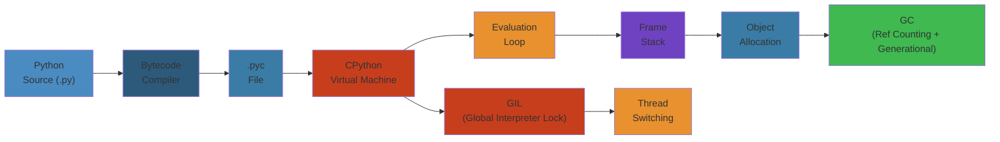

# 🐍 Python — Complete Deep Dive

**Related**: [Advanced Python](/03-backend/python/02-python-advanced.md) · [Python Docs](https://docs.python.org/3/)

---




## Table of Contents


- [Data Types](#-data-types-mutable-vs-immutable)
- [Control Flow](#-control-flow)
- [Comprehensions](#-comprehensions)
- [Functions](#-functions)
- [Iterators vs Generators](#-iterators-vs-generators)
- [Modules and Packages](#-modules-and-packages)
- [OOP](#-oop)
- [Context Managers](#-context-managers)
- [Exception Handling](#-exception-handling)
- [Logging](#-logging)
- [pip / venv / Poetry](#-pip--venv--poetry)
- [Typing / Type Hints](#-typing--type-hints)
- [asyncio Basics](#-asyncio-basics)
- [Threading vs Multiprocessing vs Async](#-threading-vs-multiprocessing-vs-async)
- [Common Pitfalls](#-common-pitfalls)
- [Simplest Mental Model](#-simplest-mental-model)

---

## 🧭 Data Types — Mutable vs Immutable


```text
┌──────────────────────────────────────────────────┐
│                Python Data Types                  │
├─────────────┬──────────┬─────────────────────────┤
│  Category   │ Mutable  │  Types                  │
├─────────────┼──────────┼─────────────────────────┤
│ Numeric     │  No      │ int, float, complex      │
│ Sequence    │  No      │ str, bytes, tuple        │
│ Sequence    │  Yes     │ list                     │
│ Set         │  Yes     │ set, frozenset (no)      │
│ Mapping     │  Yes     │ dict                     │
│ Boolean     │  No      │ bool                     │
│ None        │  No      │ NoneType                 │
└─────────────┴──────────┴─────────────────────────┘
```

Key insight: Immutable types create **new objects** on modification. Mutable types are modified **in-place** — multiple references share the same object.

```python
# Immutable: str
s = "hello"
s.upper()        # returns NEW string, original unchanged
# Mutable: list
lst = [1, 2, 3]
lst.append(4)    # modifies IN PLACE

# Trap: mutable default args
def add_item(item, lst=[]):   # BAD — list is shared across calls
    lst.append(item)
    return lst

def add_item(item, lst=None): # GOOD
    if lst is None:
        lst = []
    lst.append(item)
    return lst

# Trap: tuple of mutable
t = ([1], [2])
t[0].append(3)   # Works! tuple is immutable, but its contents may not be
```

### String interning


Python interns short strings and small integers for performance:

```python
a = "hello"
b = "hello"
a is b  # True (CPython interning)

c = "hello world!"
d = "hello world!"
c is d  # False (too long for interning)
```

### `==` vs `is`


```python
a = [1, 2, 3]
b = [1, 2, 3]
a == b   # True — value equality
a is b   # False — different objects
```

---

## 🧭 Control Flow


```python
# if / elif / else
x = 10
if x > 10:
    print(">10")
elif x == 10:
    print("==10")
else:
    print("<10")

# for loops
for i in range(5):
    pass

for idx, val in enumerate(["a", "b"]):
    pass

for k, v in {"x": 1}.items():
    pass

# while
while condition:
    pass

# match / case (Python 3.10+)
match value:
    case 1:
        print("one")
    case 2 | 3:
        print("two or three")
    case _:
        print("default")

# match with patterns
match point:
    case (0, 0):
        print("origin")
    case (x, 0):
        print(f"on x-axis at {x}")
    case (x, y):
        print(f"at ({x}, {y})")
```

### Short-circuit evaluation


```python
# and, or short-circuit
result = risky_function() or "default"
result = validated and process(validated)
```

### Walrus operator `:=` (3.8+)


```python
if (n := len(items)) > 10:
    print(f"Got {n} items")

while (chunk := file.read(8192)):
    process(chunk)
```

---

## 🧭 Comprehensions


```python
# List comprehension — eager, evaluates immediately
squares = [x**2 for x in range(10) if x % 2 == 0]

# Dict comprehension
square_map = {x: x**2 for x in range(5)}

# Set comprehension
unique = {x % 3 for x in range(10)}

# Generator expression — lazy, evaluates on iteration
gen = (x**2 for x in range(10))  # <generator object>
next(gen)  # 0

# Nested comprehension
matrix = [[i + j for j in range(3)] for i in range(3)]

# Flat map
flat = [x for row in matrix for x in row]
```

### Performance comparison


```text
Method                    Time (10M items)
───────────────────────────────────────────
For loop append           0.65s
List comprehension        0.45s  ← fastest
map()                     0.50s
Generator expression      iterates lazily (O(1) memory)
```

---

## 🧭 Functions


```python
# Positional, keyword, default, *args, **kwargs
def func(a, b, *args, c=10, **kwargs):
    print(a, b, args, c, kwargs)

func(1, 2, 3, 4, c=20, x=100, y=200)

# Keyword-only arguments (after *)
def kw_only(a, b, *, verbose=False):
    pass

# Positional-only arguments (Python 3.8+, before /)
def pos_only(a, b, /, c):
    pass
```

### Closures


```python
def make_multiplier(n):
    def multiplier(x):
        return x * n
    return multiplier

double = make_multiplier(2)
double(5)  # 10
```

### Decorators


```python
import functools

def timer(func):
    @functools.wraps(func)
    def wrapper(*args, **kwargs):
        start = time.perf_counter()
        result = func(*args, **kwargs)
        elapsed = time.perf_counter() - start
        print(f"{func.__name__} took {elapsed:.4f}s")
        return result
    return wrapper

@timer
def slow_function():
    time.sleep(1)
```

### Lambdas


```python
add = lambda x, y: x + y
sorted(items, key=lambda x: x[1])
filter(lambda x: x > 0, numbers)
```

### `functools.partial`


```python
from functools import partial

def power(base, exp):
    return base ** exp

square = partial(power, exp=2)
cube = partial(power, exp=3)
```

---

## 🧭 Iterators vs Generators


```text
┌──────────────────────────────────────────────────────────┐
│            Iterable vs Iterator vs Generator              │
├──────────────┬───────────────────────────────────────────┤
│ Iterable     │ Has __iter__() returning iterator          │
│              │ e.g. list, tuple, str, dict, set           │
├──────────────┼───────────────────────────────────────────┤
│ Iterator     │ Has __iter__() + __next__()                │
│              │ One-pass, exhausted after iteration        │
├──────────────┼───────────────────────────────────────────┤
│ Generator    │ Iterator created with yield / gen expr     │
│              │ Lazy, stateful, can be infinite            │
└──────────────┴───────────────────────────────────────────┘
```

```python
# Iterator protocol
class Counter:
    def __init__(self, limit):
        self.limit = limit
        self.n = 0

    def __iter__(self):
        return self

    def __next__(self):
        if self.n >= self.limit:
            raise StopIteration
        value = self.n
        self.n += 1
        return value

# Generator function
def fibonacci():
    a, b = 0, 1
    while True:
        yield a
        a, b = b, a + b

fib = fibonacci()
[next(fib) for _ in range(5)]  # [0, 1, 1, 2, 3]

# Generator closing
def gen():
    try:
        yield 1
        yield 2
    finally:
        print("cleaned up")
g = gen()
next(g)
g.close()  # triggers finally
```

### `yield from` — delegating to subgenerator


```python
def chain(*iterables):
    for it in iterables:
        yield from it

list(chain([1, 2], "abc"))  # [1, 2, 'a', 'b', 'c']
```

---

## 🧭 Modules and Packages


```text
my_package/
├── __init__.py          # marks directory as package
├── module_a.py
├── module_b.py
└── sub_package/
    ├── __init__.py
    └── module_c.py
```

### `__init__.py` roles


```python
# Import submodules on package import
from . import module_a, module_b

# Control `from package import *`
__all__ = ["module_a", "module_b"]

# Package-level configuration
VERSION = "1.0.0"
```

### Import styles


```python
# Absolute imports (preferred)
from my_package.sub_package import module_c
from my_package import module_a

# Relative imports (use within package)
from . import module_a
from ..sub_package import module_c

# __all__ controls exported names
from package import *  # only names in __all__
```

### Module search path


```text
1. Current directory / script directory
2. PYTHONPATH environment variable
3. Standard library paths
4. site-packages (third-party)

Accessed via: sys.path
```

---

## 🧭 OOP


```python
# Class basics
class Animal:
    species = "Mammal"  # class variable

    def __init__(self, name):
        self.name = name  # instance variable

    def speak(self):
        raise NotImplementedError

    @classmethod
    def create_unknown(cls):
        return cls("unknown")

    @staticmethod
    def is_valid_name(name):
        return bool(name) and len(name) > 0

# Inheritance & MRO
class Dog(Animal):
    def speak(self):
        return "Woof"

class Cat(Animal):
    def speak(self):
        return "Meow"

# MRO — Method Resolution Order (C3 linearization)
class A: pass
class B(A): pass
class C(A): pass
class D(B, C): pass
D.__mro__  # D -> B -> C -> A -> object
```

### Properties


```python
class Temperature:
    def __init__(self, celsius=0):
        self._celsius = celsius

    @property
    def fahrenheit(self):
        return self._celsius * 9/5 + 32

    @fahrenheit.setter
    def fahrenheit(self, value):
        self._celsius = (value - 32) * 5/9
```

### Descriptors


```python
class PositiveNumber:
    def __set_name__(self, owner, name):
        self.name = f"_{name}"

    def __get__(self, obj, objtype=None):
        return getattr(obj, self.name, 0)

    def __set__(self, obj, value):
        if value < 0:
            raise ValueError("Must be positive")
        setattr(obj, self.name, value)

class Order:
    quantity = PositiveNumber()
    price = PositiveNumber()
```

### `__slots__`


```python
class Point:
    __slots__ = ("x", "y")  # no __dict__, saves memory

    def __init__(self, x, y):
        self.x = x
        self.y = y

# Memory: __slots__ ~56 bytes/object vs __dict__ ~168 bytes
```

### Metaclasses


```python
# Metaclass: class that creates classes
class SingletonMeta(type):
    _instances = {}

    def __call__(cls, *args, **kwargs):
        if cls not in cls._instances:
            cls._instances[cls] = super().__call__(*args, **kwargs)
        return cls._instances[cls]

class Singleton(metaclass=SingletonMeta):
    pass
```

### Abstract Base Classes


```python
from abc import ABC, abstractmethod

class Shape(ABC):
    @abstractmethod
    def area(self):
        pass

    @abstractmethod
    def perimeter(self):
        pass

class Circle(Shape):
    def __init__(self, radius):
        self.radius = radius

    def area(self):
        return 3.14 * self.radius ** 2

    def perimeter(self):
        return 2 * 3.14 * self.radius
```

### Dataclasses (Python 3.7+)


```python
from dataclasses import dataclass, field

@dataclass(order=True)
class Person:
    name: str
    age: int = 0
    tags: list = field(default_factory=list)
    email: str = field(default="", repr=False)

    def __post_init__(self):
        if self.age < 0:
            raise ValueError("Age must be positive")

# Generates __init__, __repr__, __eq__, __hash__, __lt__, etc.
```

---

## 🧭 Context Managers


```python
# Using with statement
with open("file.txt", "r") as f:
    content = f.read()

# Custom context manager
class ManagedFile:
    def __enter__(self):
        self.file = open("file.txt", "r")
        return self.file

    def __exit__(self, exc_type, exc_val, exc_tb):
        self.file.close()
        return False  # re-raise exceptions

# contextlib utilities
from contextlib import contextmanager, suppress, closing

@contextmanager
def managed_file(filename):
    f = open(filename, "r")
    try:
        yield f
    finally:
        f.close()

# Suppress specific exceptions
with suppress(FileNotFoundError):
    os.remove("missing.txt")
```

### `contextlib.ContextDecorator`


```python
from contextlib import ContextDecorator

class timeout(ContextDecorator):
    def __enter__(self):
        signal.alarm(self.seconds)
        return self

    def __exit__(self, *exc):
        signal.alarm(0)
        return False

@timeout(seconds=5)
def slow_query():
    pass
```

---

## 🧭 Exception Handling


```python
# Basic try / except / else / finally
try:
    result = risky_operation()
except ValueError as e:
    print(f"Value error: {e}")
except (TypeError, RuntimeError) as e:
    print(f"Other error: {e}")
else:
    print(f"Success: {result}")  # runs if no exception
finally:
    cleanup()  # always runs

# Raise
raise ValueError("invalid input")
raise  # re-raise current exception

# Exception chaining
try:
    divide(1, 0)
except ZeroDivisionError as e:
    raise RuntimeError("Calculation failed") from e

# Custom exceptions
class PaymentError(Exception):
    def __init__(self, code, message):
        self.code = code
        self.message = message
        super().__init__(f"[{code}] {message}")

# assert (use for debugging, not validation)
assert result is not None, "Result should not be None"
```

### Best practices


```python
# Catch specific exceptions, not bare except
# BAD
try:
    ...
except:
    pass

# GOOD
try:
    ...
except OSError:
    pass

# EAFP vs LBYL
# EAFP (Easier to Ask Forgiveness than Permission) — Pythonic
try:
    result = dict["key"]
except KeyError:
    result = "default"

# LBYL (Look Before You Leap)
if "key" in dict:
    result = dict["key"]
else:
    result = "default"
```

---

## 🧭 Logging


```python
import logging

# Configuration
logging.basicConfig(
    level=logging.INFO,
    format="%(asctime)s [%(levelname)s] %(name)s: %(message)s",
    datefmt="%Y-%m-%d %H:%M:%S",
)

logger = logging.getLogger(__name__)

logger.debug("Debug message")    # 10
logger.info("Info message")      # 20
logger.warning("Warning")        # 30
logger.error("Error")            # 40
logger.critical("Critical")      # 50

# Avoid f-strings in logging — use lazy formatting
logger.debug("Value: %s", expensive_call())  # only formatted at log level

# Handlers
handler = logging.StreamHandler()
handler.setLevel(logging.ERROR)
logger.addHandler(handler)

# File rotation
from logging.handlers import RotatingFileHandler
handler = RotatingFileHandler("app.log", maxBytes=1e6, backupCount=5)
```

---

## 🧭 \_\_name__ == '\_\_main__'


```python
# Guard — code only runs when script is executed directly
def main():
    parser = argparse.ArgumentParser()
    args = parser.parse_args()
    print(f"Running {args}")

if __name__ == "__main__":
    main()
```

```text
┌──────────────────────────────────────────────────────┐
│ __name__ when imported: "module_name"                 │
│ __name__ when executed: "__main__"                    │
│                                                       │
│ Without guard, imported module executes all code!     │
└──────────────────────────────────────────────────────┘
```

---

## 🧭 pip / venv / Poetry


```bash
# venv — built-in virtual environment
python -m venv .venv
source .venv/bin/activate
pip install requests

# pip — package installer
pip install -r requirements.txt
pip freeze > requirements.txt

# Poetry — modern dependency management
poetry new my_project
poetry add requests
poetry add --dev pytest
poetry build
```

```text
┌───────────────┬────────────────┬──────────────────────┐
│   Tool        │  Lock file     │  Key feature         │
├───────────────┼────────────────┼──────────────────────┤
│ pip           │ requirements   │ Simple, universal    │
│               │ .txt           │                      │
│ pipenv        │ Pipfile.lock   │ Pipfile + lock       │
│ poetry        │ poetry.lock    │ Build + publish      │
│ pdm           │ pdm.lock       │ PEP 582, no venv     │
└───────────────┴────────────────┴──────────────────────┘
```

---

## 🧭 Typing / Type Hints


```python
from typing import (
    List, Dict, Tuple, Set, Optional, Union, Any,
    Callable, Iterator, Generator, TypeVar, Generic,
    Protocol, Literal, Final, TypedDict, NewType,
)

name: str = "Alice"
count: int = 42
items: list[int] = [1, 2, 3]
mapping: dict[str, int] = {"a": 1}
maybe: Optional[str] = None  # same as str | None
either: Union[int, float] = 1.5  # same as int | float (3.10+)

def greet(name: str, age: int = 0) -> str:
    return f"{name} is {age}"

# Callable
callback: Callable[[int, str], bool]

# TypeVar — generics
T = TypeVar("T")
def first(items: list[T]) -> T:
    return items[0]

# Protocol — structural subtyping (duck typing)
class Drawable(Protocol):
    def draw(self) -> None: ...

def render(obj: Drawable):
    obj.draw()

# TypedDict
class Point(TypedDict):
    x: float
    y: float

p: Point = {"x": 1.0, "y": 2.0}

# Literal
def set_mode(mode: Literal["r", "w", "a"]) -> None: ...

# NewType
UserId = NewType("UserId", int)
uid: UserId = UserId(42)

# Final
MAX_RETRIES: Final = 3
```

---

## 🧭 asyncio Basics


```text
┌──────────────────────────────────────────────────────┐
│  asyncio = cooperative multitasking on single thread  │
│                                                       │
│  ┌────────┐  ┌────────┐  ┌────────┐                  │
│  │coroutine│  │coroutine│  │coroutine│                 │
│  └────┬───┘  └────┬───┘  └────┬───┘                  │
│       │           │           │                       │
│  ┌────┴───────────┴───────────┴────┐                  │
│  │        Event Loop               │                  │
│  │  (select/epoll/kqueue)           │                  │
│  └──────────────────────────────────┘                  │
└──────────────────────────────────────────────────────┘
```

```python
import asyncio

# Coroutine
async def fetch_data(url: str) -> dict:
    async with aiohttp.ClientSession() as session:
        async with session.get(url) as response:
            return await response.json()

# Running
result = asyncio.run(fetch_data("https://api.example.com"))

# Tasks — run concurrently
async def main():
    task1 = asyncio.create_task(fetch_data("/url1"))
    task2 = asyncio.create_task(fetch_data("/url2"))
    results = await asyncio.gather(task1, task2)

# Awaitables
async def example():
    # Coroutine (await directly)
    await fetch_data("/url1")

    # Task (wraps coroutine, runs concurrently)
    task = asyncio.create_task(fetch_data("/url2"))
    await task

    # Future (lower-level, task extends Future)
    future = asyncio.Future()
    future.set_result(42)
    await future

# Event loop
loop = asyncio.get_event_loop()
loop.run_until_complete(main())
loop.close()
```

### asyncio best practices


```python
# Timeout
try:
    async with asyncio.timeout(5):
        result = await fetch_data()
except TimeoutError:
    print("Timed out")

# Semaphore — limit concurrency
sem = asyncio.Semaphore(10)
async def bounded_fetch(url):
    async with sem:
        return await fetch_data(url)

# asyncio.wait — fine-grained control
done, pending = await asyncio.wait(
    [task1, task2],
    timeout=5.0,
    return_when=asyncio.FIRST_COMPLETED,
)
```

---

## 🧭 Threading vs Multiprocessing vs Async


```text
┌──────────────┬──────────────┬──────────────┬──────────────┐
│              │  threading    │ multiprocess │   asyncio     │
├──────────────┼──────────────┼──────────────┼──────────────┤
│ Model        │ OS threads   │ OS processes │ Event loop    │
│ Concurrency  │ Preemptive   │ Preemptive   │ Cooperative   │
│ GIL          │ Affected     │ Bypassed     │ Not affected  │
│ CPU-bound    │ ❌ Slow      │ ✅ Fast     │ ❌ Slow      │
│ I/O-bound    │ ✅ Good     │ ✅ Good     │ ✅ Best      │
│ Memory       │ Shared       │ Separate     │ Shared        │
│ Overhead     │ Medium       │ High         │ Low           │
│ Data races   │ Possible     │ Low risk     │ Rare          │
└──────────────┴──────────────┴──────────────┴──────────────┘
```

```python
# Threading — GIL limits CPU-bound tasks
import threading

def worker(n):
    print(f"Thread {n}")

threads = [threading.Thread(target=worker, args=(i,)) for i in range(5)]
for t in threads: t.start()
for t in threads: t.join()

# Multiprocessing — separate processes, bypass GIL
import multiprocessing as mp

def cpu_heavy(n):
    return sum(i * i for i in range(n))

with mp.Pool(4) as pool:
    results = pool.map(cpu_heavy, [1000000] * 4)

# Shared memory
import multiprocessing.shared_memory as shm
# Or use mp.Queue, mp.Value, mp.Array
```

### GIL — Global Interpreter Lock


```text
┌──────────────────────────────────────────────────────┐
│  GIL: mutex that allows only ONE thread to execute   │
│  Python bytecode at a time                           │
│                                                       │
│  Effect:                                              │
│    • Multi-threaded CPU-bound: slower than single     │
│    • Multi-threaded I/O-bound: good (GIL released     │
│      during I/O, sleep, C extensions)                 │
│    • multiprocessing: bypasses GIL entirely            │
│                                                       │
│  GIL removed? Not fully — PEP 703 (nogil) in progress │
│  Free-threaded Python 3.13 (experimental)              │
└──────────────────────────────────────────────────────┘
```

---

## 🧭 Common Pitfalls


```python
# 1. Mutable default arguments (see above)

# 2. Late binding closures
funcs = [lambda: i for i in range(5)]
[f() for f in funcs]  # [4, 4, 4, 4, 4] — i is looked up at call time

# Fix: default argument
funcs = [lambda i=i: i for i in range(5)]

# 3. Modifying list while iterating
items = [1, 2, 3, 4]
for item in items:
    if item % 2 == 0:
        items.remove(item)  # BUG: skips elements
# Fix: iterate over copy
for item in items[:]:
    if item % 2 == 0:
        items.remove(item)

# 4. Chained exceptions losing context
# Use `raise ... from original` (see exceptions section)

# 5. Circular imports
# Solution: import inside function, restructure modules

# 6. is vs == for integers
a = 256
b = 256
a is b  # True (small int cache  -5..256)
c = 257
d = 257
c is d  # False (depends on implementation)

# 7. Shared mutable class variables
class Bad:
    items = []  # shared across all instances
```

---

## 🧭 Simplest Mental Model


```text
Python is a BLUEPRINT INTERPRETER:

┌──────────────────────────────────────────────────────┐
│  You write Python code                               │
│         │                                            │
│         ▼                                            │
│  CPython compiler → bytecode (.pyc)                  │
│         │                                            │
│         ▼                                            │
│  Python Virtual Machine (stack-based)                │
│         │                                            │
│  ┌──────┴─────────────────────────────────────────┐ │
│  │  Everything is an OBJECT                        │ │
│  │  • Variables are NAMES bound to objects          │ │
│  │  • Types are CLASSES (even int, str)             │ │
│  │  • Classes are OBJECTS (metaclasses)             │ │
│  │  • Functions are OBJECTS (callable)             │ │
│  └─────────────────────────────────────────────────┘ │
│                                                       │
│  Key consequences:                                    │
│  • Names can be rebound — no constants                │
│  • Mutable vs Immutable determines behavior           │
│  • GIL limits CPU-bound threads                       │
│  • Duck typing: "if it walks like a duck..."          │
└──────────────────────────────────────────────────────┘
```

## Related

- [Readme](/02-data-engineering/README.md)
- [Data Governance](/02-data-engineering/data-quality-governance/01-data-governance.md)
- [Airflow Dagster](/02-data-engineering/orchestration/01-airflow-dagster.md)
- [Apache Spark](/02-data-engineering/processing/01-apache-spark.md)
- [Apache Flink](/02-data-engineering/processing/02-apache-flink.md)
- [Columnar Storage](/02-data-engineering/storage-formats/01-columnar-storage.md)

---

## Interactive Component: Python Coroutine State Machine

<div style="padding:16px;background:#0b0e14;border:1px solid #1e2a3a;border-radius:8px">
  <style>.state-machine-title{color:#00d4ff;font-family:monospace;font-size:14px;font-weight:bold;margin-bottom:16px}.state-demo{text-align:center}.state-display{font-size:18px;font-family:monospace;padding:16px;border-radius:4px;margin:16px 0;color:#0b0e14;font-weight:bold;min-height:50px;display:flex;align-items:center;justify-content:center;border:2px solid currentColor}.state-created{background:#9333ea;border-color:#7e22ce}.state-suspended{background:#fbbf24;border-color:#f59e0b}.state-running{background:#00d4ff;border-color:#0099cc;color:#0b0e14}.state-done{background:#34d399;border-color:#22c55e}.state-buttons{display:flex;gap:8px;justify-content:center;flex-wrap:wrap;margin-top:16px}.state-button{padding:8px 16px;border:1px solid #00d4ff;background:#1e3a5f;color:#00d4ff;border-radius:4px;cursor:pointer;font-family:monospace;font-size:12px;transition:all 0.2s}.state-button:hover{background:#2a5a8f;box-shadow:0 0 8px #00d4ff}</style>
  <div class="state-machine-title">Python Async/Await Coroutine States</div>
  <div class="state-demo">
    <div class="state-display state-created" id="state-display">CREATED</div>
    <div class="state-buttons">
      <button class="state-button" onclick="setState('CREATED', pyAsyncStateMap)">Created (def async)</button>
      <button class="state-button" onclick="setState('SUSPENDED', pyAsyncStateMap)">Suspended (await)</button>
      <button class="state-button" onclick="setState('RUNNING', pyAsyncStateMap)">Running (resumed)</button>
      <button class="state-button" onclick="setState('DONE', pyAsyncStateMap)">Done (completed)</button>
    </div>
  </div>
  <script>
    const pyAsyncStateMap = {
      'CREATED': { label: 'CREATED', class: 'state-created' },
      'SUSPENDED': { label: 'SUSPENDED', class: 'state-suspended' },
      'RUNNING': { label: 'RUNNING', class: 'state-running' },
      'DONE': { label: 'DONE', class: 'state-done' }
    };
    function setState(state, sm) {
      const display = document.getElementById('state-display');
      const info = sm[state];
      display.textContent = info.label;
      display.className = 'state-display ' + info.class;
    }
  </script>
</div>


---

## Interactive Component: Python Thread State Machine

<div style="padding:16px;background:#0b0e14;border:1px solid #1e2a3a;border-radius:8px">
  <style>.state-machine-title{color:#00d4ff;font-family:monospace;font-size:14px;font-weight:bold;margin-bottom:16px}.state-demo{text-align:center}.state-display{font-size:18px;font-family:monospace;padding:16px;border-radius:4px;margin:16px 0;color:#0b0e14;font-weight:bold;min-height:50px;display:flex;align-items:center;justify-content:center;border:2px solid currentColor}.state-start{background:#9333ea;border-color:#7e22ce}.state-active{background:#34d399;border-color:#22c55e}.state-running{background:#00d4ff;border-color:#0099cc;color:#0b0e14}.state-blocked{background:#fbbf24;border-color:#f59e0b}.state-stopped{background:#ef4444;border-color:#dc2626}.state-buttons{display:flex;gap:8px;justify-content:center;flex-wrap:wrap;margin-top:16px}.state-button{padding:8px 16px;border:1px solid #00d4ff;background:#1e3a5f;color:#00d4ff;border-radius:4px;cursor:pointer;font-family:monospace;font-size:12px;transition:all 0.2s}.state-button:hover{background:#2a5a8f;box-shadow:0 0 8px #00d4ff}</style>
  <div class="state-machine-title">Python Thread State Machine</div>
  <div class="state-demo">
    <div class="state-display state-start" id="state-display">START</div>
    <div class="state-buttons">
      <button class="state-button" onclick="setState('START', pyThreadStateMap)">Start (created)</button>
      <button class="state-button" onclick="setState('ACTIVE', pyThreadStateMap)">Active (queued)</button>
      <button class="state-button" onclick="setState('RUNNING', pyThreadStateMap)">Running (GIL owned)</button>
      <button class="state-button" onclick="setState('BLOCKED', pyThreadStateMap)">Blocked (I/O)</button>
      <button class="state-button" onclick="setState('STOPPED', pyThreadStateMap)">Stopped (done)</button>
    </div>
  </div>
  <script>
    const pyThreadStateMap = {
      'START': { label: 'START', class: 'state-start' },
      'ACTIVE': { label: 'ACTIVE', class: 'state-active' },
      'RUNNING': { label: 'RUNNING', class: 'state-running' },
      'BLOCKED': { label: 'BLOCKED', class: 'state-blocked' },
      'STOPPED': { label: 'STOPPED', class: 'state-stopped' }
    };
    function setState(state, sm) {
      const display = document.getElementById('state-display');
      const info = sm[state];
      display.textContent = info.label;
      display.className = 'state-display ' + info.class;
    }
  </script>
</div>


---

## Interactive Component: Python GIL Contention Metrics

<div style="padding:16px;background:#0b0e14;border:1px solid #1e2a3a;border-radius:8px">
  <style>.obs-title{color:#00d4ff;font-family:monospace;font-size:14px;font-weight:bold;margin-bottom:16px}.obs-grid{display:grid;grid-template-columns:repeat(auto-fit, minmax(150px, 1fr));gap:12px}.obs-card{padding:12px;background:#1a2332;border:1px solid #1e3a5f;border-radius:4px;display:flex;flex-direction:column;align-items:center;transition:all 0.3s}.obs-card:hover{border-color:#00d4ff;box-shadow:0 0 8px rgba(0, 212, 255, 0.3)}.obs-label{color:#a3aab8;font-family:monospace;font-size:11px;text-transform:uppercase;letter-spacing:0.5px;margin-bottom:8px}.obs-value{font-family:monospace;font-size:20px;font-weight:bold;margin-bottom:4px;letter-spacing:0.5px}.obs-unit{color:#a3aab8;font-family:monospace;font-size:10px;text-transform:uppercase}.metric-healthy{color:#34d399}.metric-warning{color:#fbbf24}.metric-critical{color:#ef4444}</style>
  <div class="obs-title">Python GIL Contention Observability</div>
  <div class="obs-grid">
    <div class="obs-card">
      <div class="obs-label">Active Threads</div>
      <div class="obs-value metric-healthy">8</div>
      <div class="obs-unit">threads</div>
    </div>
    <div class="obs-card">
      <div class="obs-label">GIL Contention</div>
      <div class="obs-value metric-warning">67</div>
      <div class="obs-unit">%</div>
    </div>
    <div class="obs-card">
      <div class="obs-label">Lock Wait Time</div>
      <div class="obs-value metric-critical">245</div>
      <div class="obs-unit">ms</div>
    </div>
    <div class="obs-card">
      <div class="obs-label">Switch Events</div>
      <div class="obs-value metric-warning">1,892</div>
      <div class="obs-unit">count</div>
    </div>
  </div>
</div>


---

## Interactive Component: Python Memory Observability

<div style="padding:16px;background:#0b0e14;border:1px solid #1e2a3a;border-radius:8px">
  <style>.obs-title{color:#00d4ff;font-family:monospace;font-size:14px;font-weight:bold;margin-bottom:16px}.obs-grid{display:grid;grid-template-columns:repeat(auto-fit, minmax(150px, 1fr));gap:12px}.obs-card{padding:12px;background:#1a2332;border:1px solid #1e3a5f;border-radius:4px;display:flex;flex-direction:column;align-items:center;transition:all 0.3s}.obs-card:hover{border-color:#00d4ff;box-shadow:0 0 8px rgba(0, 212, 255, 0.3)}.obs-label{color:#a3aab8;font-family:monospace;font-size:11px;text-transform:uppercase;letter-spacing:0.5px;margin-bottom:8px}.obs-value{font-family:monospace;font-size:20px;font-weight:bold;margin-bottom:4px;letter-spacing:0.5px}.obs-unit{color:#a3aab8;font-family:monospace;font-size:10px;text-transform:uppercase}.metric-healthy{color:#34d399}.metric-warning{color:#fbbf24}.metric-critical{color:#ef4444}</style>
  <div class="obs-title">Python Memory Profiling</div>
  <div class="obs-grid">
    <div class="obs-card">
      <div class="obs-label">RSS (Resident)</div>
      <div class="obs-value metric-warning">342</div>
      <div class="obs-unit">MB</div>
    </div>
    <div class="obs-card">
      <div class="obs-label">VMS (Virtual)</div>
      <div class="obs-value metric-healthy">458</div>
      <div class="obs-unit">MB</div>
    </div>
    <div class="obs-card">
      <div class="obs-label">Objects Tracked</div>
      <div class="obs-value metric-healthy">127K</div>
      <div class="obs-unit">count</div>
    </div>
    <div class="obs-card">
      <div class="obs-label">RefCount Cycles</div>
      <div class="obs-value metric-healthy">89</div>
      <div class="obs-unit">runs</div>
    </div>
  </div>
</div>

