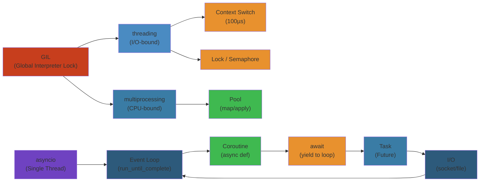
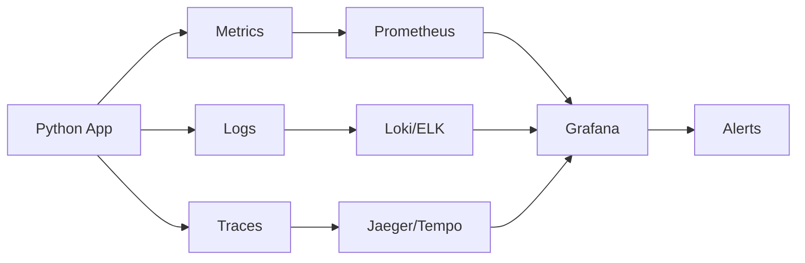

# ⚡ Python Concurrency & Async — Complete Deep Dive

> **Scope**: GIL internals, threading, multiprocessing, asyncio, Trio, Curio, uvloop, concurrent.futures, subprocess, shared memory, signal handling

---




## 📑 Table of Contents


1. [The GIL — Why It Exists & How It Works](#1-the-gil--why-it-exists--how-it-works)
2. [Threading Deep Dive](#2-threading-deep-dive)
3. [Multiprocessing Deep Dive](#3-multiprocessing-deep-dive)
4. [Asyncio Deep Dive](#4-asyncio-deep-dive)
5. [Trio & Structured Concurrency](#5-trio--structured-concurrency)
6. [uvloop & Curio](#6-uvloop--curio)
7. [concurrent.futures](#7-concurrentfutures)
8. [Subprocess & Signals](#8-subprocess--signals)
9. [Parallelism vs Concurrency](#9-parallelism-vs-concurrency)
10. [Simplest Mental Model](#10-simplest-mental-model)

---

## 1. The GIL — Why It Exists & How It Works


```
┌─────────────────────────────────────────────────────────┐
│              CPython Interpreter (one process)           │
│  ┌──────────────────────────────────────────────────┐   │
│  │                  GIL (Big Lock)                   │   │
│  │  ┌──────┐  ┌──────┐  ┌──────┐  ┌──────┐        │   │
│  │  │Thread│  │Thread│  │Thread│  │Thread│  ...    │   │
│  │  │  1   │  │  2   │  │  3   │  │  4   │        │   │
│  │  └──┬───┘  └──┬───┘  └──┬───┘  └──┬───┘        │   │
│  │     │Only one │executes │bytecode  │at a time   │   │
│  │     └─────────┴─────────┴──────────┘            │   │
│  └──────────────────────────────────────────────────┘   │
└─────────────────────────────────────────────────────────┘
```

The Global Interpreter Lock (GIL) is a mutex that prevents multiple native threads from executing Python bytecode simultaneously. It exists because CPython's memory management is **not thread-safe** — the reference counting (`Py_INCREF`/`Py_DECREF`) and garbage collector need protection.

### Bytecode Execution & Switching


```python
import sys

# See the current switch interval (default 5ms = 500 checks/sec)
print(sys.getswitchinterval())  # 0.005

# Voluntary switching: thread releases GIL when blocking on I/O
# Preemptive switching: GIL is released every ~100 bytecode instructions
#   (controlled by sys.setswitchinterval)

# Lower interval = more fair scheduling, more overhead
sys.setswitchinterval(0.001)  # 1ms — aggressive switching
```

**Voluntary release**: Threads release the GIL when doing I/O (disk, network, socket), sleeping, or waiting on locks.

**Preemptive release**: Every `sys.getswitchinterval()` seconds (default 5ms), the running thread checks if another thread is waiting for the GIL. If so, it yields.

### GIL Removal Efforts


| Project | Approach | Status |
|---------|----------|--------|
| **nogil** (Python 3.9 fork) | Per-interpreter locks, free-threaded | Merged into CPython 3.13 (experimental) |
| **PEP 703** | Make GIL optional via `--disable-gil` | Accepted, experimental in 3.13 |
| **Subinterpreters** (PEP 554) | Isolated interpreters, each with own GIL | `interpreters` module in 3.12+ |
| **Jython / IronPython** | No GIL (JVM/CLR threads) | Legacy, not CPython |

```python
# Python 3.13+ free-threaded mode (compile with --disable-gil)
# Multiple threads can run bytecode simultaneously!
# https://peps.python.org/pep-0703/
```

---

## 2. Threading Deep Dive


```
Threading Decision:
┌──────────────────────┐
│ Is the task CPU-bound? │
├─────────┬────────────┤
│   YES   │     NO     │
│   Use   │   Is it   │
│  multi- │   I/O     │
│ process │   bound?  │
│  ing    ├─────┬─────┤
│         │ YES │ NO  │
│         │ Use │ Use │
│         │sync │thread│
│         │ or  │ or   │
│         │async│async │
└─────────┴─────┴─────┘
```

### Thread Basics


```python
import threading
import time

def worker(name: str, delay: float):
    print(f"[{name}] Starting")
    time.sleep(delay)
    print(f"[{name}] Done after {delay}s")

# Create & start threads
threads = []
for i in range(3):
    t = threading.Thread(target=worker, args=(f"Worker-{i}", i), daemon=False)
    threads.append(t)
    t.start()

# Wait for all to finish
for t in threads:
    t.join()

print("All threads done")
```

### Daemon Threads


```python
# Daemon thread = killed when main thread exits
# Good for background tasks, monitoring, heartbeats

def background_monitor():
    while True:
        print("💓 heartbeat...")
        time.sleep(1)

d = threading.Thread(target=background_monitor, daemon=True)
d.start()
time.sleep(3)
print("Main exiting — daemon dies with me")
```

### Synchronisation Primitives


```python
import threading

# Lock — basic mutual exclusion
lock = threading.Lock()
lock.acquire()
try:
    # critical section
    pass
finally:
    lock.release()

# RLock — re-entrant (same thread can acquire multiple times)
rlock = threading.RLock()  # refcount per thread

# Semaphore — limit concurrent access (e.g., DB pool of 5)
sem = threading.Semaphore(5)

# Event — one thread signals others
event = threading.Event()
# ... in waiting thread: event.wait()
# ... in signalling thread: event.set()

# Condition — like Event + Lock, for producer-consumer
cv = threading.Condition()
# cv.notify() / cv.notify_all() / cv.wait()

# Barrier — synchronize N threads at a rendezvous point
barrier = threading.Barrier(3)  # wait until 3 threads arrive
```

### ThreadPoolExecutor


```python
from concurrent.futures import ThreadPoolExecutor

def io_task(url: str) -> int:
    # pretend HTTP request
    time.sleep(0.5)
    return len(url)

with ThreadPoolExecutor(max_workers=10) as ex:
    futures = [ex.submit(io_task, f"https://site.com/{i}") for i in range(20)]
    results = [f.result() for f in futures]
    print(results)
```

### Thread-Local Storage


```python
# Each thread gets its own copy of data
local_data = threading.local()

def worker():
    local_data.x = 42  # unique per thread
    print(f"{threading.current_thread().name}: {local_data.x}")

threading.Thread(target=worker).start()
threading.Thread(target=worker).start()
```

### Queue — Thread-Safe Communication


```python
import queue

q = queue.Queue(maxsize=10)

# Producer
q.put(item, block=True, timeout=5.0)

# Consumer
try:
    item = q.get(block=True, timeout=1.0)
except queue.Empty:
    pass

# queue.LifoQueue = stack
# queue.PriorityQueue = heap-ordered
```

---

## 3. Multiprocessing Deep Dive


```python
import multiprocessing as mp

def cpu_intensive(n: int) -> int:
    total = 0
    for i in range(n):
        total += i ** 2
    return total

# Process — basic unit
p = mp.Process(target=cpu_intensive, args=(10_000_000,))
p.start()
p.join()

# Pool — parallel map
with mp.Pool(processes=4) as pool:
    results = pool.map(cpu_intensive, [5_000_000, 5_000_000, 5_000_000])
    print(results)
```

### Start Methods on macOS


```python
# macOS defaults to 'spawn' (safer, slower)
# 'fork' — copy parent memory (unsafe on macOS, deprecated)
# 'forkserver' — fork from a clean server process
# 'spawn' — start fresh interpreter process

mp.set_start_method('spawn', force=True)  # set at top of __main__

# or via context
ctx = mp.get_context('spawn')
p = ctx.Process(target=cpu_intensive, args=(5_000_000,))
```

### IPC Mechanisms


```python
# Queue — thread-safe, process-safe (pickle-based)
q = mp.Queue()
q.put(obj)
obj = q.get()

# Pipe — two-way connection (faster than Queue)
parent_conn, child_conn = mp.Pipe()
parent_conn.send(data)
data = child_conn.recv()

# Manager — shared namespace across processes
mgr = mp.Manager()
shared_dict = mgr.dict()  # also list, Value, Array, Namespace
shared_dict['key'] = 'value'

# Shared memory (Python 3.8+) — zero-copy
from multiprocessing import shared_memory
shm = shared_memory.SharedMemory(name='my_shm', create=True, size=1024)
# buffer = shm.buf  # memoryview, no serialization overhead
```

### ProcessPoolExecutor


```python
from concurrent.futures import ProcessPoolExecutor

with ProcessPoolExecutor(max_workers=4) as ex:
    futures = [ex.submit(cpu_intensive, n) for n in [10_000_000, 20_000_000]]
    for f in futures:
        print(f.result())
```

### Synchronisation in Multiprocessing


```python
# Same primitives as threading, but process-safe
lock = mp.Lock()
rlock = mp.RLock()
sem = mp.Semaphore(3)
event = mp.Event()
cond = mp.Condition()
barrier = mp.Barrier(4)
```

---

## 4. Asyncio Deep Dive


```
Event Loop Lifecycle:
┌──────────┐    ┌──────────────┐    ┌────────────┐
│  Create   │───▶│   Schedule   │───▶│   Run      │
│  Loop     │    │   Tasks      │    │   Loop     │
└──────────┘    └──────────────┘    └─────┬──────┘
                                          │
                                    ┌─────▼──────┐
                                    │  Poll I/O   │
                                    │  Run call-  │◀──── coroutines yield
                                    │  backs      │      (await) back here
                                    └─────┬──────┘
                                          │
                                    ┌─────▼──────┐
                                    │  Complete   │
                                    │  & Return   │
                                    └────────────┘
```

### Core Concepts


```python
import asyncio

# Coroutine — async function
async def fetch_data(url: str) -> dict:
    # simulate I/O
    await asyncio.sleep(0.5)
    return {"url": url, "status": 200}

# Task — scheduled coroutine (runs concurrently)
async def main():
    # Run one coroutine
    data = await fetch_data("/api/1")

    # Run many concurrently
    tasks = [
        asyncio.create_task(fetch_data(f"/api/{i}"))
        for i in range(10)
    ]
    results = await asyncio.gather(*tasks)

    # as_completed — process results as they arrive
    for coro in asyncio.as_completed(tasks):
        result = await coro
        print(result)

    # wait — fine-grained control
    done, pending = await asyncio.wait(
        tasks, timeout=2.0, return_when=asyncio.FIRST_COMPLETED
    )

    # Cancel remaining
    for task in pending:
        task.cancel()

asyncio.run(main())  # creates + runs event loop
```

### Timeouts & Shielding


```python
# Timeout — raise exception after deadline
try:
    async with asyncio.timeout(5.0):  # Python 3.12+ new API
        result = await slow_operation()
except TimeoutError:
    print("Timed out!")

# Older API (3.7-3.11)
result = await asyncio.wait_for(slow_operation(), timeout=5.0)

# Shield — protect from outer cancellation
async def critical():
    await asyncio.shield(non_cancellable_operation())
```

### Synchronisation in Asyncio


```python
# asyncio.Lock, Semaphore, Event, Condition — similar to threading but async
sem = asyncio.Semaphore(5)  # limit concurrent connections

async def fetch_with_limit(url: str):
    async with sem:
        return await fetch_data(url)

# asyncio.Queue — async producer-consumer
q = asyncio.Queue(maxsize=100)
await q.put(item)
item = await q.get()
```

### TaskGroup (Python 3.11+)


```python
# Structured concurrency — if one task fails, all are cancelled
async def main():
    async with asyncio.TaskGroup() as tg:
        t1 = tg.create_task(fetch_data("/a"))
        t2 = tg.create_task(fetch_data("/b"))
        t3 = tg.create_task(fetch_data("/c"))
    # All tasks done (or exception raised)
```

### Eager Tasks (Python 3.12+)


```python
# Task starts executing immediately without yielding to event loop first
# Useful for tiny coroutines where yielding overhead is significant
async def main():
    task = asyncio.Task(small_coro(), eager_start=True)
    result = await task
```

### Async Generators & Context Managers


```python
# Async generator
async def read_lines(path: str):
    async with asyncio.open_file(path) as f:
        async for line in f:  # async for
            yield line.strip()

# Async context manager
class DatabaseConnection:
    async def __aenter__(self):
        self.conn = await create_connection()
        return self.conn

    async def __aexit__(self, *exc):
        await self.conn.close()

async with DatabaseConnection() as conn:
    await conn.query("SELECT 1")
```

---

## 5. Trio & Structured Concurrency


```python
import trio

# Trio: structured concurrency via nurseries
# All children MUST finish before the nursery block exits

async def fetch(url: str):
    await trio.sleep(0.5)
    return f"data from {url}"

async def main():
    async with trio.open_nursery() as nursery:
        nursery.start_soon(fetch, "/api/a")
        nursery.start_soon(fetch, "/api/b")
        nursery.start_soon(fetch, "/api/c")
    # All done here

# Cancellation scopes — fine-grained cancellation
async def main():
    with trio.move_on_after(2.0):  # cancels after 2s, no exception
        result = await slow_op()

    with trio.fail_after(2.0):  # raises TooSlowError after 2s
        result = await slow_op()
```

**Key differences from asyncio**:
- No implicit `Task` objects floating around
- `nursery` guarantees all children complete before exiting
- Cancellation scopes are hierarchical
- No `gather` / `wait` / `as_completed` — use nurseries

---

## 6. uvloop & Curio


```python
# uvloop — libuv-based event loop (2-4x faster than asyncio default)
# libuv is the library behind Node.js

import uvloop
import asyncio

uvloop.install()  # replaces default event loop with uvloop.Loop
# Now asyncio.run(main()) uses uvloop

# Or set explicitly:
asyncio.set_event_loop_policy(uvloop.EventLoopPolicy())

# Benchmark: uvloop ~400K req/s vs default ~200K req/s
```

```
uvloop Architecture:
┌──────────────────────────────┐
│       asyncio API            │
├──────────────────────────────┤
│      uvloop (Cython)         │
├──────────────────────────────┤
│      libuv (C library)       │
│  ┌────┬────┬────┬────┬────┐  │
│  │epoll│kqueue│IOCP│event│timer│
│  └────┴────┴────┴────┴────┘  │
└──────────────────────────────┘
```

**Curio** — minimal async framework by David Beazley:
```python
import curio

async def main():
    async with curio.TaskGroup() as g:
        await g.spawn(fetch, "/api")
```

---

## 7. concurrent.futures


```python
from concurrent.futures import (
    ThreadPoolExecutor,
    ProcessPoolExecutor,
    Future,
    as_completed,
    wait,
    FIRST_COMPLETED,
)

# Future — represents asynchronous result
executor = ThreadPoolExecutor(max_workers=5)
future: Future = executor.submit(cpu_intensive, 5_000_000)

# Callback — fires when future completes
def on_done(f: Future):
    print(f"Result: {f.result()}")

future.add_done_callback(on_done)

# Wait for first completion
futures = [executor.submit(cpu_intensive, n) for n in range(8)]
done, not_done = wait(futures, timeout=2.0, return_when=FIRST_COMPLETED)

# As completed — iterate as results arrive
for f in as_completed(futures):
    print(f.result())

# map — apply function to iterable (blocking, order-preserving)
results = executor.map(cpu_intensive, range(10))
```

---

## 8. Subprocess & Signals


```python
import subprocess
import asyncio
import signal

# Synchronous
p = subprocess.Popen(
    ["ls", "-la"],
    stdout=subprocess.PIPE,
    stderr=subprocess.PIPE,
    text=True,
)
stdout, stderr = p.communicate(timeout=5)

# Convenience
result = subprocess.run(
    ["python", "-c", "print('hello')"],
    capture_output=True,
    text=True,
    check=True,
)
print(result.stdout)

# Async subprocess
async def run_cmd(cmd: str):
    proc = await asyncio.create_subprocess_shell(
        cmd,
        stdout=asyncio.subprocess.PIPE,
        stderr=asyncio.subprocess.PIPE,
    )
    stdout, stderr = await proc.communicate()
    return stdout.decode()

# Signal handlers — NOT thread-safe!
# Must be set in main thread only
def handle_sigint(signum, frame):
    print("Caught SIGINT, shutting down...")
    sys.exit(0)

signal.signal(signal.SIGINT, handle_sigint)
```

---

## 9. Parallelism vs Concurrency


```
┌────────────────────────────────────────────────────────────┐
│              Concurrency (deal with many things)           │
│  ┌──────┐ ┌──────┐ ┌──────┐                               │
│  │ Task │ │ Task │ │ Task │  Interleaved execution       │
│  │  A   │ │  B   │ │  C   │  (single core)               │
│  └──┬───┘ └──┬───┘ └──┬───┘                               │
│     └────────┴─────────┘                                  │
├────────────────────────────────────────────────────────────┤
│              Parallelism (do many things at once)          │
│  ┌──────┐                                                   │
│  │Core 0│── Task A                                        │
│  ├──────┤                                                   │
│  │Core 1│── Task B                                        │
│  ├──────┤                                                   │
│  │Core 2│── Task C                                        │
│  └──────┘                                                   │
└────────────────────────────────────────────────────────────┘
```

**GIL impact on different workloads**:

| Workload | Threading | Multiprocessing | Asyncio |
|----------|-----------|-----------------|---------|
| CPU-bound (numpy) | ❌ GIL bound | ✅ True parallel | ❌ N/A |
| CPU-bound (pure Python) | ❌ Slower than serial | ✅ ~Nx faster | ❌ N/A |
| I/O-bound (HTTP, DB) | ✅ Good | 🟡 Overkill | ✅ Best |
| Mixed CPU+I/O | 🟡 Partial | ✅ Best | 🟡 Limited |

---

## 10. Simplest Mental Model


```
┌─────────────────────────────────────────────────────────────┐
│              PYTHON CONCURRENCY — MENTAL MODEL              │
├─────────────────────────────────────────────────────────────┤
│                                                             │
│  🧵 THREADING = many waiters, one cook (GIL)               │
│     Good when waiters spend most time waiting (I/O)         │
│                                                             │
│  🏭 MULTIPROCESSING = many kitchens, each with own cook    │
│     Good when cooking is CPU-heavy                          │
│     Cost: memory per kitchen, IPC overhead                  │
│                                                             │
│  🔄 ASYNCIO = one cook, one waiter, but super-efficient    │
│     switching (cooperative multitasking)                    │
│     Good when mostly waiting on I/O                         │
│     Cost: must use async libraries everywhere               │
│                                                             │
│  📦 CHOOSE BY:                                              │
│     CPU-bound  → multiprocessing                            │
│     I/O-bound  → asyncio (or threads if sync libs)          │
│     Both       → multiprocessing + asyncio hybrid           │
│                                                             │
└─────────────────────────────────────────────────────────────┘
```


## Practical Example


```python
# Basic usage
result = function()
print(result)
```

## Observability




### Key Metrics


| Metric | Unit | Threshold | Indicates |
|--------|------|-----------|-----------|
| Request latency (p99) | ms | < 500ms | Application performance |
| GIL contention | % | < 10% | CPU-bound threads blocking |
| Thread count | count | < 200 | Thread pool exhaustion |
| Connection pool size | count | < 80% of max | Pool exhaustion risk |
| GC pause (Python) | ms | < 50ms | Reference cycle overhead |
| Memory RSS | MB | < 80% limit | Memory leak risk |

### Logs


- **ERROR**: Unhandled exceptions, connection failures, import errors, OOM
- **WARN**: Slow API endpoints, retry attempts, pool exhaustion approaching
- **INFO**: Server start/stop, worker lifecycle, config loaded
- **DEBUG**: Per-request timing, async task trace, GC collection stats

### Traces


Use OpenTelemetry Python SDK. Auto-instrument popular frameworks (Flask, FastAPI, Django). Propagate trace context via HTTP headers and message headers.

### Alerts


| Severity | Condition | Response |
|----------|-----------|----------|
| P0 | Error rate > 5% | Roll back recent deploy |
| P1 | p99 latency > 2s | Profile and identify slowdown |
| P1 | Connection pool > 90% | Increase pool size |
| P2 | Memory > 80% limit | Check for memory leak |

### Dashboards


**Python Runtime Dashboard**: request latency (p50/p95/p99), error rate by endpoint, GC pauses, thread pool utilization, memory usage, connection pool status.


## Common Failures


### Failure: Memory Leak from Cyclic References


- **Symptoms**: RSS grows continuously, eventually OOM. Python GC runs frequently. Objects not freed.
- **Root Cause**: Objects define `__del__` methods AND participate in reference cycles. Cyclic GC (gc.garbage) can't collect objects with `__del__`. Common with circular parent-child references in ORM models.
- **Detection**: `gc.get_objects()` count increasing. `gc.garbage` list populated. `objgraph.show_growth()` shows unreclaimed objects.
- **Recovery**: 1) Force GC: `gc.collect()`. 2) Inspect `gc.garbage`. 3) Add more instances. 4) Restart periodically.
- **Prevention**: Avoid `__del__` in classes that could be cyclic. Use `weakref` for parent references. Use `gc.set_debug(gc.DEBUG_LEAK)` in development. Test with `tracemalloc`.

### Failure: GIL Contention


- **Symptoms**: High CPU but low throughput. CPU-bound threads don't improve performance. Adding threads makes it worse.
- **Root Cause**: Python's GIL prevents multiple threads from executing Python bytecode simultaneously. Threads waiting for GIL introduce context switch overhead. CPU-bound tasks in threads don't parallelize.
- **Detection**: `perf top` shows `PyEval_EvalFrameEx` at high CPU. `py-spy` shows threads in `__pthread_cond_wait` (waiting for GIL).
- **Recovery**: 1) Use multiprocessing instead of threading. 2) Use async/await for I/O. 3) Move CPU work to C extensions.
- **Prevention**: Use `multiprocessing` for CPU-bound work. Use `asyncio` for I/O-bound. Use Numba/Cython for numerical work.

### Failure: Pickle Deserialization Attack


- **Symptoms**: Unauthorized code execution. Remote command execution. RCE vulnerability.
- **Root Cause**: `pickle.loads()` on untrusted data executes arbitrary Python code during deserialization. Attackers craft malicious pickle payloads.
- **Detection**: IDS/IPS alert on pickle payloads. Security audit finding. Unusual processes spawned.
- **Recovery**: 1) Rotate all credentials. 2) Patch immediately. 3) Audit all pickle usage. 4) Incident response.
- **Prevention**: Never unpickle untrusted data. Use JSON or messagepack instead. If pickle required, sign payloads with HMAC. Use `pickle.Unpickler` with restricted `find_class`.

### Failure: Slow Import at Startup


- **Symptoms**: Cold start takes > 30s. Container health check fails. Serverless function cold start > 5s.
- **Root Cause**: Lazy imports in module scope. Heavy libraries imported at module level. Circular imports causing repeated resolution.
- **Detection**: Profile startup with `python -X importtime -c "import app" 2> import.log` then `tuna import.log`.
- **Recovery**: 1) Move imports into functions. 2) Use lazy loading. 3) Remove unused imports.
- **Prevention**: Audit imports with `flake8-import-order`. Use `importlib.import_module` for heavy deps. Profile startup time in CI.

### Failure: asyncio Task Leak


- **Symptoms**: Memory grows, event loop runs forever, tasks never complete. asyncio.Task count increases monotonically.
- **Root Cause**: `create_task()` called but task never awaited. Task falls through to garbage collection with "Task was destroyed but it is pending" warning. Common in fire-and-forget patterns.
- **Detection**: `asyncio.all_tasks()` count growing. Warning logs: "Task was destroyed but it is pending". Event loop may be blocked.
- **Recovery**: 1) Cancel leaked tasks: `asyncio.gather(*asyncio.all_tasks(), return_exceptions=True)`. 2) Restart.
- **Prevention**: Track created tasks in a set and ensure completion. Use `TaskGroup` (Python 3.11+). Always `await` or `task.cancel()`. Add task count monitoring.

## Related

- [Readme](/02-data-engineering/README.md)
- [Data Governance](/02-data-engineering/data-quality-governance/01-data-governance.md)
- [Airflow Dagster](/02-data-engineering/orchestration/01-airflow-dagster.md)
- [Apache Spark](/02-data-engineering/processing/01-apache-spark.md)
- [Apache Flink](/02-data-engineering/processing/02-apache-flink.md)
- [Columnar Storage](/02-data-engineering/storage-formats/01-columnar-storage.md)

---

## Interactive Component: Python Coroutine State Machine

<div style="padding:16px;background:#0b0e14;border:1px solid #1e2a3a;border-radius:8px">
  <style>.state-machine-title{color:#00d4ff;font-family:monospace;font-size:14px;font-weight:bold;margin-bottom:16px}.state-demo{text-align:center}.state-display{font-size:18px;font-family:monospace;padding:16px;border-radius:4px;margin:16px 0;color:#0b0e14;font-weight:bold;min-height:50px;display:flex;align-items:center;justify-content:center;border:2px solid currentColor}.state-created{background:#9333ea;border-color:#7e22ce}.state-suspended{background:#fbbf24;border-color:#f59e0b}.state-running{background:#00d4ff;border-color:#0099cc;color:#0b0e14}.state-done{background:#34d399;border-color:#22c55e}.state-buttons{display:flex;gap:8px;justify-content:center;flex-wrap:wrap;margin-top:16px}.state-button{padding:8px 16px;border:1px solid #00d4ff;background:#1e3a5f;color:#00d4ff;border-radius:4px;cursor:pointer;font-family:monospace;font-size:12px;transition:all 0.2s}.state-button:hover{background:#2a5a8f;box-shadow:0 0 8px #00d4ff}</style>
  <div class="state-machine-title">Python Async/Await Coroutine States</div>
  <div class="state-demo">
    <div class="state-display state-created" id="state-display">CREATED</div>
    <div class="state-buttons">
      <button class="state-button" onclick="setState('CREATED', pyAsyncStateMap)">Created (def async)</button>
      <button class="state-button" onclick="setState('SUSPENDED', pyAsyncStateMap)">Suspended (await)</button>
      <button class="state-button" onclick="setState('RUNNING', pyAsyncStateMap)">Running (resumed)</button>
      <button class="state-button" onclick="setState('DONE', pyAsyncStateMap)">Done (completed)</button>
    </div>
  </div>
  <script>
    const pyAsyncStateMap = {
      'CREATED': { label: 'CREATED', class: 'state-created' },
      'SUSPENDED': { label: 'SUSPENDED', class: 'state-suspended' },
      'RUNNING': { label: 'RUNNING', class: 'state-running' },
      'DONE': { label: 'DONE', class: 'state-done' }
    };
    function setState(state, sm) {
      const display = document.getElementById('state-display');
      const info = sm[state];
      display.textContent = info.label;
      display.className = 'state-display ' + info.class;
    }
  </script>
</div>


---

## Interactive Component: Python Thread State Machine

<div style="padding:16px;background:#0b0e14;border:1px solid #1e2a3a;border-radius:8px">
  <style>.state-machine-title{color:#00d4ff;font-family:monospace;font-size:14px;font-weight:bold;margin-bottom:16px}.state-demo{text-align:center}.state-display{font-size:18px;font-family:monospace;padding:16px;border-radius:4px;margin:16px 0;color:#0b0e14;font-weight:bold;min-height:50px;display:flex;align-items:center;justify-content:center;border:2px solid currentColor}.state-start{background:#9333ea;border-color:#7e22ce}.state-active{background:#34d399;border-color:#22c55e}.state-running{background:#00d4ff;border-color:#0099cc;color:#0b0e14}.state-blocked{background:#fbbf24;border-color:#f59e0b}.state-stopped{background:#ef4444;border-color:#dc2626}.state-buttons{display:flex;gap:8px;justify-content:center;flex-wrap:wrap;margin-top:16px}.state-button{padding:8px 16px;border:1px solid #00d4ff;background:#1e3a5f;color:#00d4ff;border-radius:4px;cursor:pointer;font-family:monospace;font-size:12px;transition:all 0.2s}.state-button:hover{background:#2a5a8f;box-shadow:0 0 8px #00d4ff}</style>
  <div class="state-machine-title">Python Thread State Machine</div>
  <div class="state-demo">
    <div class="state-display state-start" id="state-display">START</div>
    <div class="state-buttons">
      <button class="state-button" onclick="setState('START', pyThreadStateMap)">Start (created)</button>
      <button class="state-button" onclick="setState('ACTIVE', pyThreadStateMap)">Active (queued)</button>
      <button class="state-button" onclick="setState('RUNNING', pyThreadStateMap)">Running (GIL owned)</button>
      <button class="state-button" onclick="setState('BLOCKED', pyThreadStateMap)">Blocked (I/O)</button>
      <button class="state-button" onclick="setState('STOPPED', pyThreadStateMap)">Stopped (done)</button>
    </div>
  </div>
  <script>
    const pyThreadStateMap = {
      'START': { label: 'START', class: 'state-start' },
      'ACTIVE': { label: 'ACTIVE', class: 'state-active' },
      'RUNNING': { label: 'RUNNING', class: 'state-running' },
      'BLOCKED': { label: 'BLOCKED', class: 'state-blocked' },
      'STOPPED': { label: 'STOPPED', class: 'state-stopped' }
    };
    function setState(state, sm) {
      const display = document.getElementById('state-display');
      const info = sm[state];
      display.textContent = info.label;
      display.className = 'state-display ' + info.class;
    }
  </script>
</div>


---

## Interactive Component: Python GIL Contention Metrics

<div style="padding:16px;background:#0b0e14;border:1px solid #1e2a3a;border-radius:8px">
  <style>.obs-title{color:#00d4ff;font-family:monospace;font-size:14px;font-weight:bold;margin-bottom:16px}.obs-grid{display:grid;grid-template-columns:repeat(auto-fit, minmax(150px, 1fr));gap:12px}.obs-card{padding:12px;background:#1a2332;border:1px solid #1e3a5f;border-radius:4px;display:flex;flex-direction:column;align-items:center;transition:all 0.3s}.obs-card:hover{border-color:#00d4ff;box-shadow:0 0 8px rgba(0, 212, 255, 0.3)}.obs-label{color:#a3aab8;font-family:monospace;font-size:11px;text-transform:uppercase;letter-spacing:0.5px;margin-bottom:8px}.obs-value{font-family:monospace;font-size:20px;font-weight:bold;margin-bottom:4px;letter-spacing:0.5px}.obs-unit{color:#a3aab8;font-family:monospace;font-size:10px;text-transform:uppercase}.metric-healthy{color:#34d399}.metric-warning{color:#fbbf24}.metric-critical{color:#ef4444}</style>
  <div class="obs-title">Python GIL Contention Observability</div>
  <div class="obs-grid">
    <div class="obs-card">
      <div class="obs-label">Active Threads</div>
      <div class="obs-value metric-healthy">8</div>
      <div class="obs-unit">threads</div>
    </div>
    <div class="obs-card">
      <div class="obs-label">GIL Contention</div>
      <div class="obs-value metric-warning">67</div>
      <div class="obs-unit">%</div>
    </div>
    <div class="obs-card">
      <div class="obs-label">Lock Wait Time</div>
      <div class="obs-value metric-critical">245</div>
      <div class="obs-unit">ms</div>
    </div>
    <div class="obs-card">
      <div class="obs-label">Switch Events</div>
      <div class="obs-value metric-warning">1,892</div>
      <div class="obs-unit">count</div>
    </div>
  </div>
</div>


---

## Interactive Component: Python Memory Observability

<div style="padding:16px;background:#0b0e14;border:1px solid #1e2a3a;border-radius:8px">
  <style>.obs-title{color:#00d4ff;font-family:monospace;font-size:14px;font-weight:bold;margin-bottom:16px}.obs-grid{display:grid;grid-template-columns:repeat(auto-fit, minmax(150px, 1fr));gap:12px}.obs-card{padding:12px;background:#1a2332;border:1px solid #1e3a5f;border-radius:4px;display:flex;flex-direction:column;align-items:center;transition:all 0.3s}.obs-card:hover{border-color:#00d4ff;box-shadow:0 0 8px rgba(0, 212, 255, 0.3)}.obs-label{color:#a3aab8;font-family:monospace;font-size:11px;text-transform:uppercase;letter-spacing:0.5px;margin-bottom:8px}.obs-value{font-family:monospace;font-size:20px;font-weight:bold;margin-bottom:4px;letter-spacing:0.5px}.obs-unit{color:#a3aab8;font-family:monospace;font-size:10px;text-transform:uppercase}.metric-healthy{color:#34d399}.metric-warning{color:#fbbf24}.metric-critical{color:#ef4444}</style>
  <div class="obs-title">Python Memory Profiling</div>
  <div class="obs-grid">
    <div class="obs-card">
      <div class="obs-label">RSS (Resident)</div>
      <div class="obs-value metric-warning">342</div>
      <div class="obs-unit">MB</div>
    </div>
    <div class="obs-card">
      <div class="obs-label">VMS (Virtual)</div>
      <div class="obs-value metric-healthy">458</div>
      <div class="obs-unit">MB</div>
    </div>
    <div class="obs-card">
      <div class="obs-label">Objects Tracked</div>
      <div class="obs-value metric-healthy">127K</div>
      <div class="obs-unit">count</div>
    </div>
    <div class="obs-card">
      <div class="obs-label">RefCount Cycles</div>
      <div class="obs-value metric-healthy">89</div>
      <div class="obs-unit">runs</div>
    </div>
  </div>
</div>

