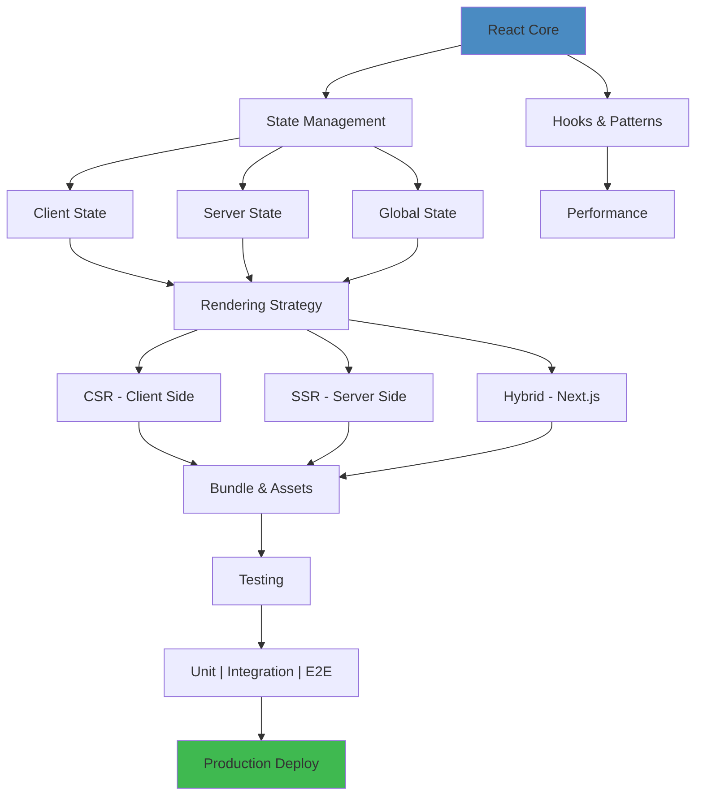
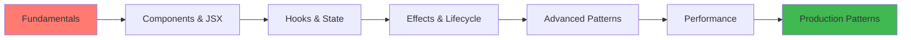
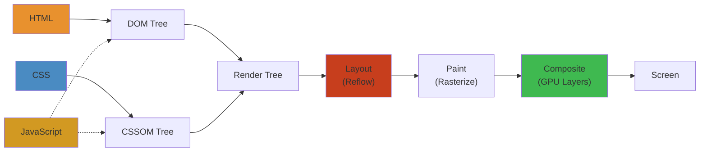

# 04 — Frontend Engineering

Building user interfaces and client-side applications. The frontend domain spans the React ecosystem, frameworks (Next.js, Remix, SvelteKit), state management, rendering strategies, performance optimization, testing, and production patterns for web applications.

## Frontend Architecture Stack



## Recommended Learning Sequence



## Table of Contents

- [React Ecosystem](#react-ecosystem)
  - [React Core](#react-core)
  - [React Hooks](#react-hooks)
  - [React Patterns](#react-patterns)
  - [React Performance](#react-performance)
  - [React Ecosystem Tools](#react-ecosystem-tools)
- [Frameworks](#frameworks)
  - [Next.js](#nextjs)
  - [Remix](#remix)
  - [Svelte / SvelteKit](#svelte--sveltekit)
  - [Other Frameworks](#other-frameworks)
- [State Management](#state-management)
  - [Client State](#client-state)
  - [Server State](#server-state)
  - [Global State](#global-state)
  - [URL State](#url-state)
- [Rendering](#rendering)
  - [Rendering Strategies](#rendering-strategies)
  - [Hydration](#hydration)
  - [Streaming & Suspense](#streaming--suspense)
- [Performance Optimization](#performance-optimization)
  - [Core Web Vitals](#core-web-vitals)
  - [Bundle Optimization](#bundle-optimization)
  - [Image & Asset Optimization](#image--asset-optimization)
  - [Rendering Performance](#rendering-performance)
- [Testing](#testing)
  - [Unit Testing](#unit-testing)
  - [Integration Testing](#integration-testing)
  - [E2E Testing](#e2e-testing)
  - [Visual Testing](#visual-testing)
- [Production Patterns](#production-patterns)
  - [Authentication & Authorization](#authentication--authorization)
  - [Error Handling](#error-handling)
  - [Internationalization](#internationalization)
  - [Accessibility](#accessibility)
  - [Security](#security)
- [Learning Path](#learning-path)
- [Cross-References](#cross-references)

---

## React Ecosystem

### React Core

- **Components** — function components (modern), class components (legacy); composition over inheritance
- **JSX** — declarative UI syntax, expressions, conditional rendering, keys
- **Virtual DOM** — reconciliation, diffing algorithm, fiber architecture; why keys matter
- **Refs** — useRef (mutable values, DOM access), forwardRef, callback refs
- **Portals** — rendering outside parent DOM hierarchy (modals, tooltips)
- **Error Boundaries** — catch rendering errors, fallback UI (class component feature)

### React Hooks

- **State** — useState (local), useReducer (complex state), lazy initializer
- **Effects** — useEffect, useLayoutEffect (synchronous DOM mutations), useInsertionEffect (CSS-in-JS)
- **Refs** — useRef, useImperativeHandle (exposing ref methods)
- **Memoization** — useMemo (values), useCallback (functions), React.memo (component)
- **Context** — useContext, context providers, when to use vs prop drilling vs state management
- **Custom Hooks** — extracting reusable stateful logic; hook composition patterns
- **Concurrent** — useTransition (non-urgent state updates), useDeferredValue (deferring stale data)
- **New (React 19+)** — use() hook (reading promises/context in render), actions, form hooks (useFormStatus, useFormState)

### React Patterns

- **Compound Components** — implicit state sharing via context (e.g., `<Select> <Option /> </Select>`)
- **Render Props** — passing render function as prop (largely replaced by hooks)
- **Higher-Order Components** — wrapping components to share logic (HOC pattern)
- **Controlled vs Uncontrolled** — form inputs managed by React state vs DOM
- **Custom Hooks** — encapsulating and reusing stateful logic
- **Suspense Boundaries** — loading states for data fetching, code splitting

### React Performance

- **Avoiding Re-renders** — React.memo, useMemo, useCallback, keys stability
- **Code Splitting** — dynamic import(), React.lazy, Suspense; route-based splitting
- **List Virtualization** — react-window, react-virtuoso; rendering only visible rows
- **Profiling** — React DevTools Profiler, flame graphs, render count, why-did-you-render
- **Bailout** — understanding when React skips rendering a component

### React Ecosystem Tools

| Tool | Purpose |
|------|---------|
| **TanStack Query** | Server state management, caching, refetching, optimistic updates |
| **Zustand** | Lightweight global state (hooks-based, no boilerplate) |
| **React Router** | Client-side routing (loaders, actions, nested routes) |
| **TanStack Router** | Type-safe router, file-based routing alternative |
| **React Hook Form** | Performant forms, validation integration (Zod, Yup) |
| **Framer Motion** | Declarative animations, gestures, layout animations |
| **React Aria** | Accessible UI primitives from Adobe |
| **Radix UI** | Unstyled, accessible component primitives |

---

## Frameworks

### Next.js

The leading React meta-framework. Full-stack React with SSR, SSG, and API routes.

- **Routing** — file-based (App Router), layout nesting, loading/error UI, parallel routes, route groups, intercepted routes
- **Rendering** — SSR, SSG, ISR (incremental static regeneration), RSC (React Server Components), streaming
- **Data Fetching** — server components (async, direct DB), client components (TanStack Query), route handlers (API endpoints), server actions (form mutations)
- **Caching** — full-route cache, data cache, client-side router cache, stale-while-revalidate
- **Image Optimization** — next/image, automatic WebP/AVIF, lazy loading, responsive sizes
- **Middleware** — Edge Functions for auth, redirects, geolocation, A/B testing

### Remix

Full-stack web framework by the React Router team. Web standards-first, progressive enhancement.

- **Nested Routes** — layouts, outlets, shared loaders; parallel data loading
- **Data Patterns** — loader (GET data), action (POST/PUT/DELETE mutations), revalidation after actions
- **Progressive Enhancement** — works without JS, enhanced with JS; form-based mutations
- **Resource Routes** — API endpoints, file downloads, webhooks
- **Error Handling** — error boundaries per route, caught/expected errors

### Svelte / SvelteKit

Compile-time framework. Minimal runtime, reactive by default.

- **Svelte Reactivity** — reactive statements (`$:`), stores, runes (Svelte 5)
- **SvelteKit** — file-based routing, load functions, form actions, server-only modules (`+server.ts`)
- **No Virtual DOM** — direct DOM updates, compile-time optimization
- **Transitions** — built-in animations, fly/slide/fade transitions, crossfade

### Other Frameworks

- **Astro** — content-focused, MPA islands, partial hydration, zero JS by default
- **Solid.js** — fine-grained reactivity, no VDOM, signals, SolidStart (meta-framework)
- **Qwik** — resumability, lazy-loading, no hydration; designed for instant loading
- **Nuxt** — Vue meta-framework, SSR, SSG, modules, auto-imports

---

## State Management

### Client State

- **Local** — useState, useReducer (component-scoped)
- **URL State** — query params, path params (source of truth for list views, filters)
- **Persisted** — localStorage, IndexedDB, sessionStorage

### Server State

- **TanStack Query** — cache, background refetch, stale-while-revalidate, optimistic updates, infinite queries, mutations
- **SWR** — stale-while-revalidate, focused revalidation, pagination
- **RTK Query** — Redux Toolkit's data fetching and caching layer

### Global State

- **Zustand** — minimal, hooks-based, no provider, middleware (persist, devtools, immer)
- **Jotai** — atomic state (Recoil-like), derived state, async atoms
- **Valtio** — proxy-based, mutable state, automatic re-renders
- **Redux Toolkit** — opinionated Redux, slices, createAsyncThunk, RTK Query

### URL State

- Next.js searchParams, useSearchParams
- React Router search params, URLSearchParams
- Serialization patterns: encode complex state into query strings, push vs replace

---

## Rendering

### Rendering Strategies

| Strategy | Description | Use Case |
|----------|-------------|----------|
| **CSR** | Client-Side Rendering — JS renders in browser | Dashboards, authenticated apps |
| **SSR** | Server-Side Rendering — HTML generated per request | Dynamic content, SEO-needed |
| **SSG** | Static Site Generation — HTML at build time | Blogs, marketing pages, docs |
| **ISR** | Incremental Static Regeneration — SSG with revalidation | Product pages, e-commerce |
| **RSC** | React Server Components — server-only, zero JS | Data-heavy, high-authentication pages |
| **Streaming** | Send HTML in chunks as it renders | Slow data sources, improving TT nibble |
| **MPA** | Multi-Page App — full page navigation | Content-heavy sites (Astro) |

### Hydration

- **Full Hydration** — standard: server HTML + make interactive client-side
- **Partial Hydration** — hydrate only interactive islands (Astro, Isles)
- **Progressive Hydration** — hydrate as user scrolls/interacts
- **Resumability** — no hydration; serialize state, resume on interaction (Qwik)

### Streaming & Suspense

- **Suspense Boundaries** — loading fallback while data loads; triggers streaming
- **Streaming SSR** — send HTML shell → suspense boundaries stream content as ready; improves TTFB
- **Selective Hydration** — browser hydrates components as they stream in; priorities based on user interaction

---

## Performance Optimization

### Core Web Vitals

- **LCP (Largest Contentful Paint)** — &lt;2.5s; caused by images, hero content; fix: optimize images, preload, SSR key content
- **FID / INP (Interaction to Next Paint)** — &lt;200ms; caused by long tasks, heavy JS; fix: code splitting, debounce, web workers
- **CLS (Cumulative Layout Shift)** — &lt;0.1; caused by ads, images without dimensions, fonts; fix: set dimensions, reserve space, font-display: swap

### Bundle Optimization

- **Code Splitting** — dynamic import(), route-based splitting, component-level splitting
- **Tree Shaking** — dead code elimination; side effects in package.json, ES module imports
- **Bundle Analysis** — webpack-bundle-analyzer, vite-bundle-visualizer, source-map-explorer
- **Lazy Loading** — React.lazy + Suspense, intersection observer for "below fold"
- **Deduplication** — hoisting (npm/yarn), resolutions (overrides), pnpm strict mode

### Image & Asset Optimization

- **Formats** — WebP (default), AVIF (better compression), SVG for icons
- **Responsive Images** — srcset, sizes, picture element; next/image, nuxt/image
- **Lazy Loading** — loading="lazy" for images/iframes, IntersectionObserver
- **Font Optimization** — subset fonts, font-display: swap, preload critical fonts; next/font, @fontsource

### Rendering Performance

- **Avoid Re-render Cascades** — context splitting (separate concerns), state colocation, React.memo with caution
- **Windowing** — react-window, react-virtuoso for large lists/tables
- **Debounce / Throttle** — input handlers, resize events, scroll listeners
- **Web Workers** — offload heavy computation (PDF generation, image processing)
- **RequestIdleCallback** — defer non-urgent work

---

## Testing

### Unit Testing

- **Vitest** — fast, Vite-native, compatible with Jest API; happy-dom for browser APIs
- **Testing Library** — React Testing Library, queries by accessibility (getByRole, findByText); user-centric
- **Component Tests** — render → query → assert behavior; avoid testing implementation details

### Integration Testing

- **MSW (Mock Service Worker)** — intercept network requests at the service worker level; test full flows
- **Playwright Component Tests** — run components in real browsers
- **Storybook Tests** — interaction tests for stories (play functions)

### E2E Testing

- **Playwright** — cross-browser, auto-wait, codegen, trace viewer, visual comparison
- **Cypress** — real browser, time travel, network stubbing; evolving for component + E2E
- **Testing Library + Playwright** — accessible selectors for E2E

### Visual Testing

- **Chromatic** — Storybook-based visual regression, cloud service
- **Playwright Visual Comparisons** — pixel-to-pixel diff, screenshot-based
- **Percy** — automated visual review

---

## Production Patterns

### Authentication & Authorization

- **Session-based** — httpOnly cookies, session stores (Redis, DB)
- **JWT** — access + refresh tokens, stateless auth; security considerations (storage, XSS, CSRF)
- **OAuth2 / OIDC** — social login, SSO (Auth0, Clerk, NextAuth.js)
- **Authorization** — RBAC, ABAC, claims/permissions; frontend: route guards, component-level

### Error Handling

- **Error Boundaries** — catch render errors, log, show recovery UI
- **API Error Handling** — consistent error formatting, status codes, error boundaries at route level
- **Sentry / Highlight** — error tracking, source maps, user context, breadcrumbs
- **Fallback UI** — placeholder, retry button, offline indicator

### Internationalization

- **next-intl** — Next.js i18n, routing, message extraction
- **react-i18next** — mature, namespaces, interpolation, pluralization
- **FormatJS** — ICU message syntax, number/date formatting
- **Runtime Loading** — load translations lazily, content negotiation, sub-path routing

### Accessibility

- **WCAG 2.2** — A, AA, AAA levels; semantic HTML, aria attributes, keyboard navigation, focus management
- **Screen Readers** — NVDA, VoiceOver, JAWS; testing patterns
- **Color Contrast** — 4.5:1 (normal text), 3:1 (large text); tools: axe, Lighthouse, WAVE
- **Testing** — axe-core, jest-axe, Playwright accessibility snapshots

### Security

- **XSS** — React auto-escapes, dangerouslySetInnerHTML caution, CSP headers
- **CSRF** — SameSite cookies, anti-CSRF tokens
- **CSP** — Content Security Policy headers, script-src, style-src, report-uri
- **HTTPS** — always, HSTS headers; mixed content prevention
- **Subresource Integrity** — SRI hashes for CDN scripts

---

## Learning Path

1. **Stage 1** — HTML, CSS, JavaScript fundamentals; DOM manipulation, browser DevTools
2. **Stage 2** — React core: components, hooks, state, effects, forms, routing (React Router)
3. **Stage 3** — Framework: Next.js (App Router), server components, data fetching, SSR/SSG/ISR
4. **Stage 4** — State management (TanStack Query, Zustand), performance optimization, testing
5. **Stage 5** — Production: accessibility, internationalization, security, CI/CD, monitoring

---

## Cross-References

| Domain | Connection |
|--------|-----------|
| [03 — Backend](/03-backend/) | API consumption (REST/GraphQL/gRPC), BFF pattern, server-side rendering requires backend service |
| [05 — Cloud](/05-cloud/) | CDN deployment (CloudFront, Fastly, Vercel Edge), hosting (S3 + CloudFront, AWS Amplify), serverless functions |
| [06 — DevOps](/06-devops/) | Frontend CI/CD, build pipelines, preview deployments (Vercel, Netlify), Docker for SSR apps |
| [11 — Networking](/11-networking/) | HTTP/2 multiplexing, CDN routing, TLS termination, DNS resolution impact on page load |
| [17 — Software Architecture](/17-software-architecture/) | Frontend architecture patterns (micro-frontends, module federation), design systems |

---

## Related

- [Networking](/11-networking/) — HTTP, performance, optimization
- [Security](/13-security/) — CORS, authentication, XSS prevention
- [Backend](/03-backend/) — API design and contracts
- [Performance Engineering](/18-performance-engineering/) — Browser rendering
- [Testing](/19-testing/) — E2E and component testing

## Frontend Technology Comparison

| Layer | React | Vue | Svelte | Solid |
|---|---|---|---|---|
| **Rendering** | Virtual DOM (reconciliation) | Virtual DOM (snapshot) | Compiler (no VDOM) | Compiled (no VDOM) |
| **State Mgmt** | useState/Reducer + Context | ref/reactive + Pinia | writable/stores | createSignal/createEffect |
| **Bundle Size** | ~40KB (min+gzip) | ~20KB | ~5KB | ~7KB |
| **Learning Curve** | Medium (JSX) | Low (templates) | Low (declarative) | Medium (JSX-like) |
| **Ecosystem** | Massive (Next.js, Remix) | Large (Nuxt, Vuetify) | Growing (SvelteKit) | Growing (SolidStart) |
| **Rendering** | CSR/SSR/SSG (Next.js) | CSR/SSR/SSG (Nuxt) | SSR/SSG (SvelteKit) | CSR/SSR (SolidStart) |
| **Performance** | Good (virtual DOM diff) | Good | Excellent (no VDOM) | Excellent (fine-grained) |
| **TypeScript** | Excellent | Good | Good | Excellent |

## Performance Optimization Patterns

| Pattern | Technique | Impact |
|---|---|---|
| **Code Splitting** | `React.lazy()` + Suspense | Reduce initial JS bundle by 30-60% |
| **Memoization** | `React.memo`, `useMemo`, `useCallback` | Prevent unnecessary re-renders |
| **Virtualization** | `react-window`, `react-virtuoso` | Render only visible items in lists |
| **Image Optimization** | lazy loading, WebP, srcset | Reduce image payload by 50-80% |
| **Bundle Analysis** | `webpack-bundle-analyzer` | Identify large dependencies |
| **Caching** | Service Worker, CDN, HTTP caching | Eliminate network requests for repeat visits |
| **Preloading** | `<link rel=preload>`, DNS prefetch | Reduce perceived latency |

## Deep Internals: Browser Rendering Pipeline

### The Critical Rendering Path

```
Step  Component          Time    What Happens
────  ────────────────   ─────   ──────────────────────────────────
  1   HTML Parse         5-50ms  Tokenize → DOM tree (incremental)
  2   CSS Parse          2-10ms  Tokenize → CSSOM tree (blocking)
  3   Render Tree        1-5ms   DOM + CSSOM → visible nodes only
  4   Layout (Reflow)    5-50ms  Calculate positions & sizes
  5   Paint              5-20ms  Rasterize layers (pixels → bitmaps)
  6   Compositing        1-5ms   Layer compositing (GPU)
  7   Display            0.1ms   Paint to screen (vsync)
```



### Layers & Compositing

```
Why layers?
Every repaint = re-rasterize.
If you isolate changes to a layer, only THAT layer re-paints.

┌──────────────────────────────────────┐
│  Root Layer (viewport)               │
│  ┌────────────────────────────────┐  │
│  │ Layer 1: Fixed header          │  │  ← Re-paints only when header changes
│  └────────────────────────────────┘  │
│  ┌────────────────────────────────┐  │
│  │ Layer 2: Scrollable content    │  │  ← Re-paints only on content change
│  └────────────────────────────────┘  │
│  ┌────────────────────────────────┐  │
│  │ Layer 3: Animating sidebar     │  │  ← GPU-composited, no paint needed!
│  └────────────────────────────────┘  │
└──────────────────────────────────────┘
```

### What Triggers What

| Action | Layout | Paint | Composite | Cost |
|---|---|---|---|---|
| `width: 50%` | ✅ Full | ✅ | ✅ | 💀 |
| `position: absolute` | ✅ Self + children | ✅ | ✅ | 💀 |
| `color: red` | ❌ | ✅ Self | ✅ | 👍 |
| `transform: translate()` | ❌ | ❌ | ✅ (GPU) | 🚀 |
| `opacity: 0.5` | ❌ | ❌ | ✅ (GPU) | 🚀 |
| `will-change: transform` | ❌ | ❌ | ✅ (promotes layer) | 👍 |

### Performance Rules

```
🚀 Prefer transform + opacity for animations (GPU composited)
👍 Promote layers: will-change: transform (sparingly!)
💀 Avoid layout-triggering animations (top, left, width, height)
💀 Avoid forced synchronous layouts (reading offsetHeight after setting style)
💀 Avoid paint-heavy properties (box-shadow, border-radius on large areas)
```
