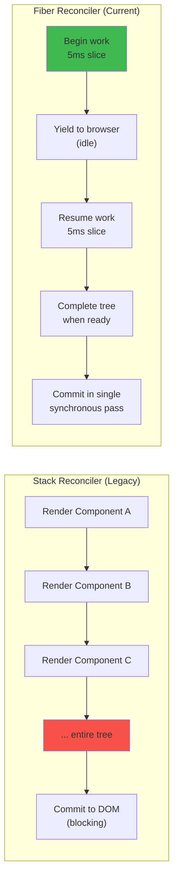
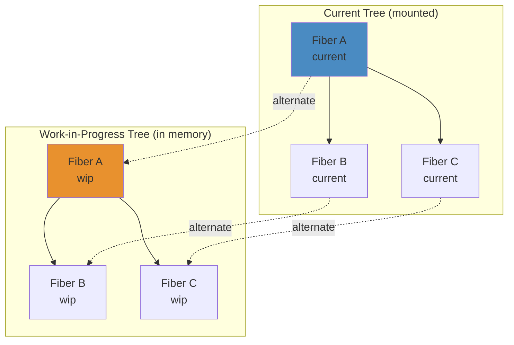
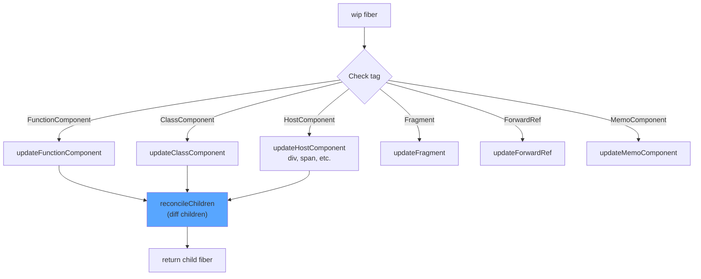
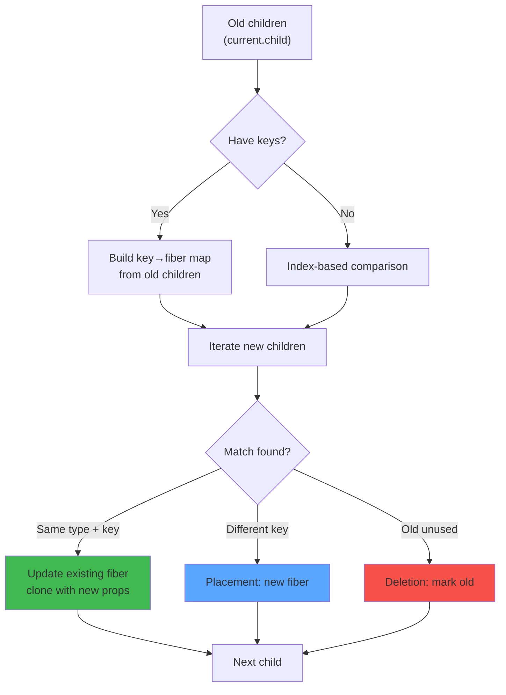
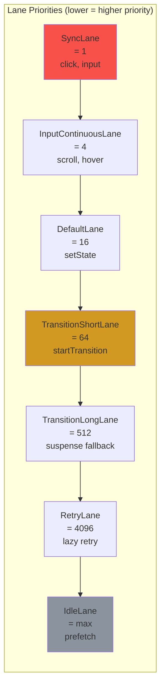

# React Fiber Architecture — Complete Deep Dive

## WHAT
Fiber is React's **core reconciliation engine** — a complete rewrite of the stack reconciler introduced in React 16. Each Fiber node represents a unit of work with a corresponding React element.

## WHY
The old stack reconciler was **synchronous and uninterruptible**. Once reconciliation started, it blocked the main thread until the entire tree was processed (hundreds of ms → visible jank). Fiber enables **interruptible, priority-based rendering**.



> 🎮 **Interactive**: [Fiber Reconciliation Visualizer](/04-frontend/react/39-visual-simulations/fiber-reconciliation.html) — step through beginWork/completeWork/commit phases

## INTERNALS

### Fiber Node Structure

```typescript
interface Fiber {
  // Identity
  tag: WorkTag;           // FunctionComponent = 0, ClassComponent = 1, HostComponent = 5, etc.
  key: string | null;
  elementType: any;
  type: any;              // The component function/class/string
  
  // Tree structure (linked list)
  return: Fiber | null;   // Parent fiber
  child: Fiber | null;    // First child
  sibling: Fiber | null;  // Next sibling
  
  // Work
  pendingProps: any;
  memoizedProps: any;
  memoizedState: any;     // Hooks state linked list
  updateQueue: any;
  
  // Effects
  flags: Flags;           // Placement = 2, Update = 4, Deletion = 8, etc.
  subtreeFlags: Flags;
  deletions: Fiber[] | null;
  
  // Lanes (priority)
  lanes: Lanes;
  childLanes: Lanes;
  
  // Alternate (current ↔ work-in-progress double buffer)
  alternate: Fiber | null;
}
```

### The Double-Buffering Pattern



React never mutates the current tree. It clones fibers from current → work-in-progress (via `alternate`), performs work on wip, then swaps the pointer on commit.

## RENDER FLOW

```
1. setState() / useState() dispatch
2. Scheduler: determine priority (Lanes)
3. scheduleUpdateOnFiber(fiber, lane)
4. markRootUpdated(root, lane)
5. ensureRootIsScheduled(root)
   └── performConcurrentWorkOnRoot
       └── workLoopConcurrent()
           ├── shouldYield() → check remaining time
           ├── performUnitOfWork(unit)
           │   ├── beginWork(current, wip)
           │   │   ├── mount: createFiberFromElement
           │   │   ├── update: reconcileChildren
           │   │   └── diff: reconcileChildFibers
           │   ├── completeUnitOfWork(wip)
           │   │   └── completeWork(current, wip)
           │   └── bubble up
           └── workLoopConcurrent (recursive or yield)
           
6. finishConcurrentRender(root)
   └── commitRoot(root)
       ├── commitBeforeMutationEffects
       ├── commitMutationEffects (DOM mutations)
       └── commitLayoutEffects (useLayoutEffect)
```

### BeginWork Flow



## RECONCILIATION FLOW

### reconcileChildren Algorithm



### Keyed Reconciliation Example

```
Old: <li key="a"/> <li key="b"/> <li key="c"/> <li key="d"/>
New: <li key="a"/> <li key="c"/> <li key="e"/> <li key="b"/>

Step 1: Build key map from old: {a:0, b:1, c:2, d:3}
Step 2: Iterate new (index 0-3):
  i=0: key="a" → old match at idx 0 → UPDATE (no move)
  i=1: key="c" → old match at idx 2 → UPDATE + MOVE (shift before b)
  i=2: key="e" → no match → PLACEMENT (insert)
  i=3: key="b" → old match at idx 1 → UPDATE + MOVE (after e)
Step 3: "d" unused → DELETION
```

### Without Keys (index-based)

```
Old: [<li>A</li>, <li>B</li>, <li>C</li>]
New: [<li>B</li>, <li>C</li>, <li>D</li>]

Step: All three are "updated" in place with new text content
      D is inserted at end
      Result: FULL re-render of all 3 items (wasteful)
```

## LANES (Priority System)



## EDGE CASES

| Scenario | What Happens | Why |
|---|---|---|
| **setState during render** | Queued, processed in current render | `setState(fn)` in render → causes re-render with new state |
| **setState in useEffect** | Triggers a new render after commit | Async state updates |
| **Multiple setStates in one tick** | Batched into one render (React 18+) | Automatic batching |
| **Concurrent mode interruption** | WIP tree is discarded, restarted from current | Starvation prevention |
| **Suspense with fallback** | Render pauses, shows fallback, retries | Content visibility |

## PERFORMANCE

| Operation | Cost | Optimized By |
|---|---|---|
| Fiber creation | O(n) tree nodes | Keyed reconciliation |
| Reconciliation | O(n) diff (no key) / O(n) with key map | Stable keys |
| Commit | O(mutations) | Minimal DOM ops |
| Effect cleanup | O(effects) | Proper deps arrays |

## FAILURES

| Failure | Root Cause | Debugging |
|---|---|---|
| **Infinite render loop** | `setState` in useEffect without deps | Check deps array |
| **Stale closure** | Callback captures old state | Use ref or functional update |
| **Key mismatch** | Index keys cause incorrect reconciliation | Use stable IDs |
| **Memory leak** | Subscriptions not cleaned up in useEffect | Check return cleanup |

## INTERVIEW QUESTIONS

**Beginner:** What is the Virtual DOM and why does React use it?
**Intermediate:** Explain how Fiber enables concurrent rendering.
**Senior:** How does the reconciliation algorithm work with and without keys?
**Staff:** Design a priority system for rendering — how would you implement lane-based scheduling?

## PRODUCTION USAGE

- **Meta**: Fiber powers Facebook's newsfeed with 100K+ components on screen
- **Vercel**: Concurrent rendering enables instant transitions in Next.js App Router
- **Netflix**: Fiber's interruptibility prevents jank during UI updates on low-end devices
