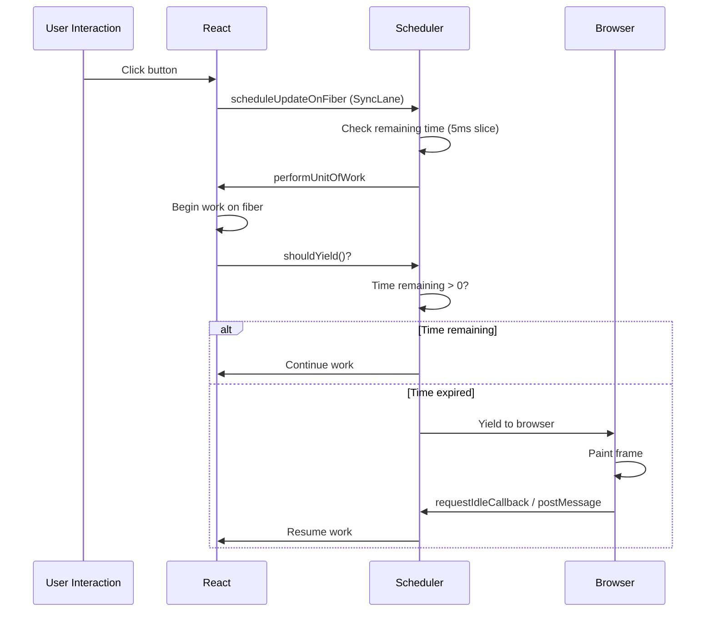

# React Scheduler & Lane System

> 🎮 **Interactive**: [State Batching Visualizer](/04-frontend/react/39-visual-simulations/state-batching.html) — compare React 18 auto-batching vs legacy mode

## WHAT
The Scheduler coordinates **when** work happens. Lanes define **what priority** that work has. Together they enable React's cooperative scheduling — rendering in 5ms chunks, yielding to the browser between chunks.

## WHY
Without the Scheduler, a single `setState` could block the main thread for 50-200ms. This causes:

- Dropped frames (jank)
- Unresponsive inputs
- Poor INP (Interaction to Next Paint)
- Bad Core Web Vitals

The Scheduler solves this by **time-slicing** work into units that fit within a single frame budget (~16ms at 60fps).

## HOW



## INTERNALS

### Lane Bitmask Design

```typescript
// Each lane is a power of 2 (bitmask)
const SyncLane =  0b0000000000000000000000000000001;  // 1
const InputContinuousLane = 0b0000000000000000000000000000010;  // 2
const DefaultLane = 0b0000000000000000000000000000100;  // 4
const TransitionShortLane = 0b0000000000000000000000000010000;  // 16
const TransitionLongLane = 0b0000000000000000000000001000000;  // 64
const RetryLane = 0b0000000000000000000000010000000;  // 128
const IdleLane =  0b1000000000000000000000000000000;  // ~2^30
```

Lanes use bitwise operations for O(1) priority checks:

```typescript
// Check if lane is included
function includesSomeLane(set: Lanes, subset: Lanes): boolean {
  return (set & subset) !== 0;
}

// Get highest priority lane
function getHighestPriorityLane(lanes: Lanes): Lane {
  return lanes & -lanes; // Isolate lowest set bit
}

// Example
const pending = SyncLane | DefaultLane | TransitionShortLane;
const highest = getHighestPriorityLane(pending); // SyncLane
```

### The Work Loop

```typescript
function workLoopConcurrent() {
  while (workInProgress !== null && !shouldYield()) {
    performUnitOfWork(workInProgress);
  }
}

function shouldYield(): boolean {
  const currentTime = performance.now();
  // 5ms time slice (frameBudget = 5ms)
  return currentTime - startTime > 5;
}
```

### Priority Inversion Prevention

React prevents **starvation** by tracking how long a low-priority update has been pending. If it exceeds a threshold, it's **upgraded** to a higher priority lane.

```typescript
function markStarvedLanes(root, expirationTime) {
  const pending = root.pendingLanes;
  let lane = 1;
  for (; lane < TotalLanes; lane <<= 1) {
    if ((pending & lane) !== 0) {
      const expiration = getLaneExpiration(lane);
      if (expiration <= expirationTime) {
        root.expiredLanes |= lane; // Force immediate execution
      }
    }
  }
}
```

## RENDER FLOW

```
User types in input (SyncLane)
  ↓
scheduleUpdateOnFiber -> SyncLane
  ↓
performSyncWorkOnRoot (immediate, no yielding)
  ↓
Re-render entire tree synchronously
  ↓
Commit (DOM mutations)
  ↓
Browser paints

User clicks "search" (DefaultLane from onClick)
  ↓
startTransition wraps it (TransitionShortLane)
  ↓
scheduleUpdateOnFiber -> Transition priority
  ↓
workLoopConcurrent (5ms slices)
  ↓
yield to browser between slices
  ↓
Complete when done
  ↓
Commit
```

## EDGE CASES

| Case | Behavior |
|---|---|
| **Multiple sync updates** | Processed in a single synchronous render (batched) |
| **Transition interrupted by sync** | Sync renders first, transition restarts |
| **Expired transition** | Upgraded to sync to prevent starvation |
| **Suspense during transition** | Shows previous UI (delayed transition) |

## PRODUCTION USAGE

- **Next.js App Router**: Transitions power instant page navigations
- **Vercel**: `startTransition` enables optimistic UI for data mutations
- **Meta**: Newsfeed uses lanes to prioritize visible content over off-screen

## INTERVIEW QUESTIONS

**Senior**: How does `startTransition` differ from `setTimeout`?
**Staff**: Design a scheduling system that supports interruption, priorities, and starvation prevention. How would React's lane system need to change for 240Hz displays?
