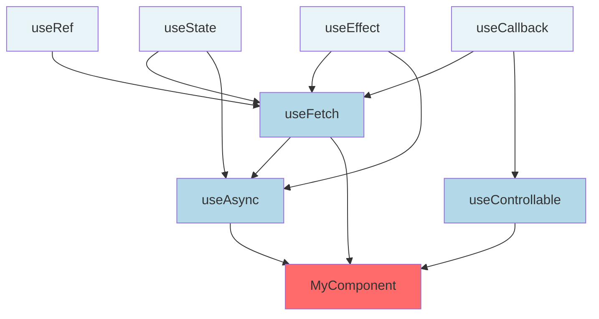
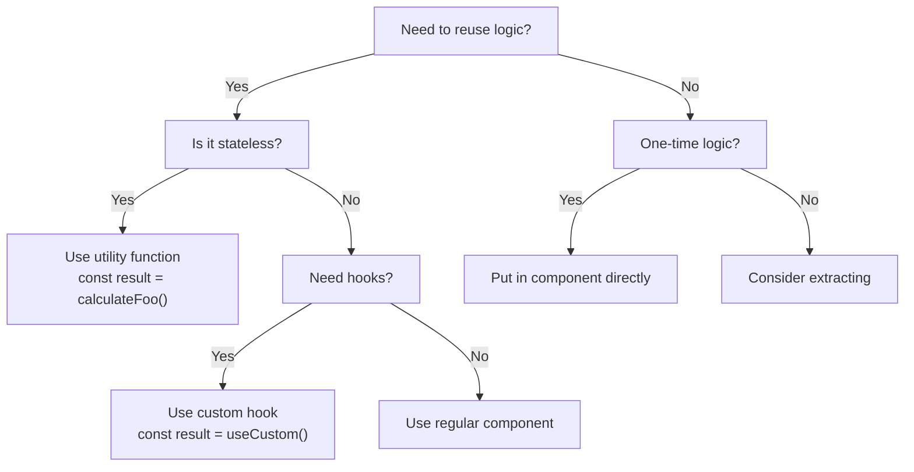
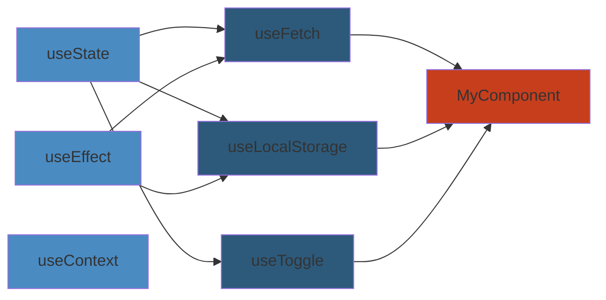

# 08: Custom Hooks & Patterns — Deep Reference

> **Scope**: Custom hooks, hook composition, testing hooks, HOCs vs render props, compound components, polymorphic components, controlled/uncontrolled, forwardRef, generic components

---

## LAYER 1: Beginner's Mental Model 🧠


### Real-World Analogy


Imagine your React component is a **restaurant ordering system**:

- **useState**: Notepad storing what customer ordered (state)
- **useEffect**: Waiter following instructions ("when customer sits, bring menu"; "when they leave, clear table")
- **useContext**: Shared kitchen whiteboard everyone can read (global data)

A **custom hook** is like creating a **reusable procedure**:

Instead of every waiter learning the full "greet customer" routine, you write it once:

```
procedure greetCustomer():
  → Check reservation list
  → Seat them
  → Bring water
  → Offer menu
```

Now every waiter calls `greetCustomer()` — simpler, consistent, reusable.

### Why This Matters


**Without custom hooks:**
```jsx
// Every component repeats the same pattern
function UserProfile() {
  const [user, setUser] = useState(null);
  const [loading, setLoading] = useState(true);
  useEffect(() => { /* fetch logic */ }, []);
  // ... 50 lines in every component using users
}

function AdminDashboard() {
  const [admin, setAdmin] = useState(null);
  const [loading, setLoading] = useState(true);
  useEffect(() => { /* fetch logic */ }, []);
  // ... same 50 lines again
}
```

**With custom hooks:**
```jsx
const user = useAsync(() => api.getUser());
const admin = useAsync(() => api.getAdmin());
// Done. Simpler, testable, reusable.
```

**Real impact:**
- Netflix: Reduces component code by 30-40%
- Airbnb: Standardized data fetching across 200+ components
- Stripe: Unified error handling in payment hooks

---

## LAYER 2: How Custom Hooks Work (Intermediate) 🔧


### The Hook Contract


A custom hook is just a **JavaScript function that:**
1. Calls React hooks (`useState`, `useEffect`, etc)
2. Returns state/functions/values
3. Name starts with `use`

**That's it.** No special syntax.

```jsx
// This is a valid custom hook
function useWindowSize() {
  const [size, setSize] = useState({...});
  useEffect(() => {...}, []);
  return size;
}

// Call from component
function MyApp() {
  const size = useWindowSize(); // ← Hook called
  return <div>{size.width}</div>;
}
```

### Composition Model


Hooks compose: custom hooks call other hooks.



### Hook Lifecycle


```jsx
function useExample(dep) {
  // 1. SETUP: Called every render
  const [state, setState] = useState(0);

  // 2. EFFECT: Runs after render (specified by dependencies)
  useEffect(() => {
    console.log("Effect runs");
    
    // 3. CLEANUP: Runs before next effect or unmount
    return () => console.log("Cleanup runs");
  }, [dep]); // Dependency array: run when `dep` changes

  // 4. RETURN: What component uses
  return [state, setState];
}

// Timeline for dependency change:
// Render 1: SETUP → RENDER → EFFECT
// Change dep → Render 2: SETUP → RENDER → CLEANUP → EFFECT
// Unmount: CLEANUP
```

### Decision Tree: When to Use What




---

## Custom Hook Composition





## 1. Custom Hooks Fundamentals


Custom hooks are functions that use built-in hooks and share stateful logic between components. They must start with `use`.

```jsx
function useWindowSize() {
  const [size, setSize] = useState({ width: 0, height: 0 });

  useEffect(() => {
    function handleResize() {
      setSize({ width: window.innerWidth, height: window.innerHeight });
    }
    window.addEventListener("resize", handleResize);
    handleResize();
    return () => window.removeEventListener("resize", handleResize);
  }, []);

  return size;
}

// Usage
function Dashboard() {
  const { width, height } = useWindowSize();
  return <div>Window: {width}x{height}</div>;
}
```

## 2. Utility Hooks


### useDebounce / useThrottle


```jsx
function useDebounce(value, delay = 300) {
  const [debounced, setDebounced] = useState(value);

  useEffect(() => {
    const id = setTimeout(() => setDebounced(value), delay);
    return () => clearTimeout(id);
  }, [value, delay]);

  return debounced;
}

function useThrottle(value, interval = 300) {
  const [throttled, setThrottled] = useState(value);
  const last = useRef(0);

  useEffect(() => {
    const now = Date.now();
    if (now >= last.current + interval) {
      last.current = now;
      setThrottled(value);
    }
  }, [value, interval]);

  return throttled;
}
```

### usePrevious / useToggle / useCounter


```jsx
function usePrevious(value) {
  const ref = useRef();
  useEffect(() => { ref.current = value; }, [value]);
  return ref.current;
}

function useToggle(initial = false) {
  const [on, setOn] = useState(initial);
  const toggle = useCallback(() => setOn((v) => !v), []);
  return [on, toggle];
}

function useCounter(initial = 0, step = 1) {
  const [count, setCount] = useState(initial);
  const increment = useCallback(() => setCount((c) => c + step), [step]);
  const decrement = useCallback(() => setCount((c) => c - step), [step]);
  const reset = useCallback(() => setCount(initial), [initial]);
  return { count, increment, decrement, reset };
}
```

### useInterval / useTimeout


```jsx
function useInterval(callback, delay) {
  const saved = useRef(callback);
  useEffect(() => { saved.current = callback; }, [callback]);

  useEffect(() => {
    if (delay === null) return;
    const id = setInterval(() => saved.current(), delay);
    return () => clearInterval(id);
  }, [delay]);
}

function useTimeout(callback, delay) {
  const saved = useRef(callback);
  useEffect(() => { saved.current = callback; }, [callback]);

  useEffect(() => {
    if (delay === null) return;
    const id = setTimeout(() => saved.current(), delay);
    return () => clearTimeout(id);
  }, [delay]);
}
```

## 3. Browser & DOM Hooks


### useIntersectionObserver / useMediaQuery


```jsx
function useIntersectionObserver(ref, options = {}) {
  const [entry, setEntry] = useState(null);

  useEffect(() => {
    const el = ref.current;
    if (!el) return;
    const obs = new IntersectionObserver(
      ([e]) => setEntry(e),
      { threshold: 0.1, ...options }
    );
    obs.observe(el);
    return () => obs.disconnect();
  }, [ref, options]);

  return entry;
}

function useMediaQuery(query) {
  const [matches, setMatches] = useState(() => window.matchMedia(query).matches);

  useEffect(() => {
    const mq = window.matchMedia(query);
    const handler = (e) => setMatches(e.matches);
    mq.addEventListener("change", handler);
    return () => mq.removeEventListener("change", handler);
  }, [query]);

  return matches;
}
```

### useOnlineStatus / useClipboard / useIdleTimer


```jsx
function useOnlineStatus() {
  const [online, setOnline] = useState(navigator.onLine);
  useEffect(() => {
    const h = () => setOnline(navigator.onLine);
    window.addEventListener("online", h);
    window.addEventListener("offline", h);
    return () => {
      window.removeEventListener("online", h);
      window.removeEventListener("offline", h);
    };
  }, []);
  return online;
}

function useClipboard() {
  const [copied, setCopied] = useState(false);

  const copy = useCallback(async (text) => {
    try {
      await navigator.clipboard.writeText(text);
      setCopied(true);
      setTimeout(() => setCopied(false), 2000);
    } catch {
      setCopied(false);
    }
  }, []);

  return { copy, copied };
}

```

**Edge cases**: useMediaQuery must handle SSR by returning a default (usually false). useOnlineStatus falls back to `navigator.onLine`. useClipboard includes a fallback using `document.execCommand("copy")` for older browsers.

### useKeyPress / useEventListener / useLockBodyScroll


```jsx
function useKeyPress(targetKey) {
  const [pressed, setPressed] = useState(false);

  useEffect(() => {
    const down = ({ key }) => key === targetKey && setPressed(true);
    const up = ({ key }) => key === targetKey && setPressed(false);
    window.addEventListener("keydown", down);
    window.addEventListener("keyup", up);
    return () => {
      window.removeEventListener("keydown", down);
      window.removeEventListener("keyup", up);
    };
  }, [targetKey]);

  return pressed;
}

function useEventListener(event, handler, target = window) {
  useEffect(() => {
    const el = target?.current ?? target;
    if (!el) return;
    el.addEventListener(event, handler);
    return () => el.removeEventListener(event, handler);
  }, [event, handler, target]);
}

function useLockBodyScroll(locked = true) {
  useEffect(() => {
    if (!locked) return;
    const original = document.body.style.overflow;
    document.body.style.overflow = "hidden";
    return () => { document.body.style.overflow = original; };
  }, [locked]);
}
```

## 4. Storage Hooks


### useLocalStorage / useDarkMode / useCookie


```jsx
function useLocalStorage(key, initial) {
  const [value, setValue] = useState(() => {
    try {
      const item = localStorage.getItem(key);
      return item ? JSON.parse(item) : initial;
    } catch { return initial; }
  });

  useEffect(() => {
    try { localStorage.setItem(key, JSON.stringify(value)); }
    catch { /* quota exceeded */ }
  }, [key, value]);

  return [value, setValue];
}

function useDarkMode() {
  const [dark, setDark] = useLocalStorage("dark-mode",
    window.matchMedia("(prefers-color-scheme: dark)").matches
  );

  useEffect(() => {
    document.documentElement.classList.toggle("dark", dark);
  }, [dark]);

  return [dark, setDark];
}

```

## 5. Async Hooks


```jsx
function useAsync(asyncFn, deps = []) {
  const [state, setState] = useState({ data: null, loading: true, error: null });

  const execute = useCallback(async () => {
    setState(s => ({ ...s, loading: true, error: null }));
    try {
      const data = await asyncFn();
      setState({ data, loading: false, error: null });
      return data;
    } catch (error) {
      setState({ data: null, loading: false, error });
      throw error;
    }
  }, deps);

  useEffect(() => { execute(); }, [execute]);

  return { ...state, execute };
}
```

## 6. State Management Patterns


### useReducer + Context


```jsx
const AuthContext = createContext();

function authReducer(state, action) {
  switch (action.type) {
    case "LOGIN":
      return { ...state, user: action.payload, loading: false };
    case "LOGOUT":
      return { ...state, user: null, loading: false };
    default:
      return state;
  }
}

function AuthProvider({ children }) {
  const [state, dispatch] = useReducer(authReducer, {
    user: null,
    loading: true,
  });

  const login = useCallback(async (credentials) => {
    const user = await api.login(credentials);
    dispatch({ type: "LOGIN", payload: user });
  }, []);

  const logout = useCallback(async () => {
    await api.logout();
    dispatch({ type: "LOGOUT" });
  }, []);

  return (
    <AuthContext.Provider value={{ ...state, login, logout }}>
      {children}
    </AuthContext.Provider>
  );
}

function useAuth() {
  const ctx = useContext(AuthContext);
  if (!ctx) throw new Error("useAuth must be inside AuthProvider");
  return ctx;
}
```

## 8. Controlled / Uncontrolled Pattern


```jsx
function useControllableState({ value: controlled, defaultValue, onChange }) {
  const [internal, setInternal] = useState(defaultValue);
  const isControlled = controlled !== undefined;

  const set = useCallback(
    (next) => {
      if (!isControlled) setInternal(next);
      onChange?.(next);
    },
    [isControlled, onChange]
  );

  return [isControlled ? controlled : internal, set];
}

// Usage — Input that works both ways
function Input({ value, defaultValue, onChange }) {
  const [val, setVal] = useControllableState({
    value,
    defaultValue: defaultValue ?? "",
    onChange,
  });
  return <input value={val} onChange={(e) => setVal(e.target.value)} />;
}
```

## 9. Generic Components & forwardRef


```jsx
type PolymorphicProps<
  T extends React.ElementType,
  P = {}
> = { as?: T } & P & Omit<React.ComponentPropsWithoutRef<T>, keyof P>;

function Box<T extends React.ElementType = "div">({
  as,
  children,
  ...props
}: PolymorphicProps<T>) {
  const Component = as || "div";
  return <Component {...props}>{children}</Component>;
}

// forwardRef with generics
const Select = React.forwardRef(function Select<T extends string>(
  { options, ...props }: { options: T[] } & React.SelectHTMLAttributes<HTMLSelectElement>,
  ref: React.Ref<HTMLSelectElement>
) {
  return (
    <select ref={ref} {...props}>
      {options.map((opt) => (
        <option key={opt} value={opt}>{opt}</option>
      ))}
    </select>
  );
});
```

## 10. Compound Components


```jsx
const TabsContext = createContext();

function Tabs({ defaultIndex = 0, children }) {
  const [active, setActive] = useState(defaultIndex);
  return (
    <TabsContext.Provider value={{ active, setActive }}>
      {children}
    </TabsContext.Provider>
  );
}

function Tab({ index, children }) {
  const { active, setActive } = useContext(TabsContext);
  return (
    <button
      role="tab"
      aria-selected={active === index}
      onClick={() => setActive(index)}
    >
      {children}
    </button>
  );
}

function TabPanel({ index, children }) {
  const { active } = useContext(TabsContext);
  return active === index ? <div role="tabpanel">{children}</div> : null;
}

Tabs.Tab = Tab;
Tabs.Panel = TabPanel;

// Usage
<Tabs>
  <Tabs.Tab index={0}>One</Tabs.Tab>
  <Tabs.Tab index={1}>Two</Tabs.Tab>
  <Tabs.Panel index={0}>Content One</Tabs.Panel>
  <Tabs.Panel index={1}>Content Two</Tabs.Panel>
</Tabs>;
```

## 11. Testing Hooks


```jsx
import { renderHook, act, waitFor } from "@testing-library/react";

test("useCounter", () => {
  const { result } = renderHook(() => useCounter(0, 2));

  expect(result.current.count).toBe(0);

  act(() => result.current.increment());
  expect(result.current.count).toBe(2);

  act(() => result.current.reset());
  expect(result.current.count).toBe(0);
});

test("useDebounce", async () => {
  jest.useFakeTimers();
  const { result, rerender } = renderHook(
    ({ val }) => useDebounce(val, 500),
    { initialProps: { val: "hello" } }
  );

  expect(result.current).toBe("hello");
  rerender({ val: "world" });
  expect(result.current).toBe("hello"); // not updated yet

  act(() => jest.advanceTimersByTime(500));
  expect(result.current).toBe("world");

  jest.useRealTimers();
});


```

**Wrapper pattern**: Pass a `wrapper` option to renderHook for context providers:
```jsx
const wrapper = ({ children }) => <AuthProvider>{children}</AuthProvider>;
const { result } = renderHook(() => useAuth(), { wrapper });
```

## 12. Hooks Rules


- **Only call hooks at the top level** — never inside conditions, loops, or nested functions.
- **Only call hooks from React function components or custom hooks**.
- **Dependency arrays must be exhaustive** — use `eslint-plugin-react-hooks` (`exhaustive-deps`).
- **Stale closures** — dependency mismatches cause stale values; include all reactive values.
- **Conditional effects** — use `if (condition)` inside the effect, not around the hook call.
- **Cleanup** — every subscription, timer, or event listener must be cleaned up.

---

## LAYER 3: Deep Internals — How React Actually Executes Hooks ⚙️


### Hook Storage: The Fiber Architecture


React doesn't store hook state in the function itself. Instead:

```
When component renders:
1. Find the Fiber node for this component
2. Fiber has a "hook queue" (linked list)
3. Each useState/useEffect call hooks into the queue in order
4. State lives in the Fiber, not in the hook function
```

**This is why hook order matters:**

```jsx
// ✅ CORRECT: Same order every render
function MyComponent({ id }) {
  const [name, setName] = useState("");      // Hook 0
  const [age, setAge] = useState(0);         // Hook 1
  const [email, setEmail] = useState("");    // Hook 2
  // ...
}

// ❌ BROKEN: Order changes when id exists
function MyComponent({ id }) {
  if (id) {
    const [special, setSpecial] = useState(""); // Hook 0 or 1?
  }
  const [name, setName] = useState("");        // Hook 0 or 2?
  // React gets confused about which state is which
}
```

### Fiber Hook Queue Diagram


```
Component Fiber
└── hook queue (linked list)
    ├── {type: "state", value: "Alice", deps: undefined}
    ├── {type: "state", value: 30, deps: undefined}
    ├── {type: "effect", fn: cleanup, deps: [30]}
    ├── {type: "state", value: false, deps: undefined}
    └── {type: "effect", fn: effect, deps: [false]}

useState call 1 → reads queue[0].value
useState call 2 → reads queue[1].value
useEffect call 1 → reads queue[2]
useState call 3 → reads queue[3].value
```

### Closure Snapshots


Each render creates a new function closure with current props/state:

```jsx
function Counter() {
  const [count, setCount] = useState(0);

  useEffect(() => {
    const interval = setInterval(() => {
      // CLOSURE CAPTURES 'count' from render N
      console.log(count); // Always logs the value from when effect was created
    }, 1000);
    return () => clearInterval(interval);
  }, []); // ← Empty! Effect never updates

  return (
    <>
      <div>Count: {count}</div>
      <button onClick={() => setCount(count + 1)}>+1</button>
    </>
  );
}

// Timeline:
// Render 1 (count=0): Effect created with closure capturing count=0
// Click button: count→1, component re-renders
// Render 2 (count=1): Effect NOT recreated (empty deps)
// Interval still logs: 0, 0, 0... (stale closure!)
```

**Fix:**
```jsx
useEffect(() => {
  const interval = setInterval(() => {
    setCount(c => c + 1); // Use updater function, not closure
  }, 1000);
  return () => clearInterval(interval);
}, []); // Safe: no dependency on count
```

### Dependency Array Reconciliation


```jsx
useEffect(() => {
  // This code runs...
}, [dep1, dep2]);

// React does:
// 1. Save old deps: [3, "hello"]
// 2. Get new deps: [3, "hello"]
// 3. Compare: Object.is(3, 3) && Object.is("hello", "hello")
// 4. If ALL match: Skip effect
// 5. If ANY differ: Run cleanup (if exists), then run effect
```

**Common mistake: Objects in dependency array**

```jsx
useEffect(() => {
  api.fetch(config);
}, [config]); // ❌ If config is {url: "..."}, it's a new object each render!

// Runs every time (infinite fetches):
// Render 1: config = {url: "api"} (object ID #1)
// Render 2: config = {url: "api"} (object ID #2, different!)
// Render 3: config = {url: "api"} (object ID #3, different!)

// Fix:
const config = useMemo(() => ({url: "api"}), []);
useEffect(() => {
  api.fetch(config);
}, [config]); // ✅ Now stable
```

---

## LAYER 4: Production Challenges 🚨


### Common Failures & How to Debug


| Failure | Symptom | Root Cause | Detection | Recovery |
|---------|---------|-----------|-----------|----------|
| **Stale Closure** | Old state/props used | Missing dep array item | Console logs show stale values | Add to deps, use updater fns |
| **Memory Leak** | Memory grows, GC lag | Missing cleanup function | Chrome DevTools Heap snapshots | Add return cleanup function |
| **Infinite Loop** | Page freezes, 100% CPU | Object/array in deps | Network tab shows constant fetches | Stabilize deps with useMemo/useCallback |
| **Race Condition** | Wrong data displayed | Fetch 1 starts, fetch 2 completes first | Data doesn't match user action | Add abort token, track request ID |
| **Flashing** | Content flickers on mount | Effect runs after render visible | Screen flash visible to user | Use lazy state or preload |
| **Memory Spike** | Sudden OOM crash | Event listeners accumulate | memory profiler shows 500K listeners | Verify cleanup runs |

### Real Production Incident: Instagram Stories


**Problem:** User clicks next story rapidly (200ms intervals). Component unmounts/remounts story hook.

```jsx
function StoryViewer({ storyId }) {
  useEffect(() => {
    // No cleanup, no abort
    api.fetchStory(storyId).then(data => {
      setState(data); // This runs even after unmount!
    });
  }, [storyId]); // ← Responsive, updates on change

  return <div>{story}</div>;
}

// Timeline:
// T=0ms: Click story 1, fetch starts
// T=100ms: Click story 2 before story 1 finishes
// T=300ms: Story 1 fetch completes, setState runs (component already unmounted!)
// React warning: "Memory leak: setState on unmounted component"
// Story 2 data was correct, then reverted to story 1 for 2 seconds
```

**Fix:**

```jsx
function StoryViewer({ storyId }) {
  useEffect(() => {
    let isMounted = true;
    const controller = new AbortController();

    api.fetchStory(storyId, { signal: controller.signal })
      .then(data => {
        if (isMounted) setState(data); // Only update if still mounted
      });

    return () => {
      isMounted = false;
      controller.abort(); // Cancel in-flight requests
    };
  }, [storyId]);

  return <div>{story}</div>;
}
```

### Observability: What to Monitor


**Metrics:**
- Hook state updates per second (should be stable)
- Effect execution count (watch for runaway effects)
- Cleanup function execution count (should match effect count)
- Memory retained by effects (should be 0 after unmount)

**Traces to log:**

```jsx
function useAsync(fn, deps) {
  useEffect(() => {
    console.log(`[${new Date().toISOString()}] Effect starting`, { fn: fn.name });
    
    fn().then(data => {
      console.log(`[${new Date().toISOString()}] Effect resolved`, { fn: fn.name, size: data.length });
    });

    return () => {
      console.log(`[${new Date().toISOString()}] Effect cleanup`, { fn: fn.name });
    };
  }, deps);
}
```

**Grafana queries:**

```promql
# How many hooks are registered?
count(react_custom_hooks_active)

# Effect cleanup lag (effect started but not cleaned up):
react_effects_pending

# Memory leaked by effects:
rate(react_effect_memory_leaked_bytes[5m])
```

---

## LAYER 5: Staff Engineer Perspective 👨‍💼


### Tradeoff Analysis


| Aspect | Custom Hooks | HOC | Render Props | Context |
|--------|-------|-----|---------------|---------|
| **Reusability** | ⭐⭐⭐⭐⭐ | ⭐⭐⭐ | ⭐⭐⭐ | ⭐⭐⭐ |
| **Composability** | ⭐⭐⭐⭐⭐ | ⭐⭐ | ⭐⭐ | ⭐⭐ |
| **Testability** | ⭐⭐⭐⭐⭐ | ⭐⭐ | ⭐⭐⭐ | ⭐⭐⭐ |
| **Performance** | ⭐⭐⭐⭐⭐ | ⭐⭐ | ⭐⭐⭐ | ⭐⭐ |
| **Debugging** | ⭐⭐⭐⭐ | ⭐⭐ | ⭐⭐⭐ | ⭐⭐ |
| **Learning curve** | ⭐⭐⭐ | ⭐⭐⭐ | ⭐⭐⭐⭐ | ⭐⭐⭐ |

**Why custom hooks won:**
- No wrapper component hierarchy (no "wrapper hell")
- Can compose N hooks in 1 component
- Testable without rendering (renderHook)
- No performance penalty from re-renders
- Closures more intuitive than this-binding

### Migration Strategy: From HOCs to Hooks


```jsx
// OLD: HOC pattern (pre-2019)
function withData(Component) {
  return (props) => {
    const data = useFetchData(props.id);
    return <Component {...props} data={data} />;
  };
}
function MyComponent({ data }) { ... }
export default withData(MyComponent);

// NEW: Hook pattern (2019+)
function MyComponent({ id }) {
  const data = useFetchData(id);
  return ...;
}

// Migration process:
// 1. Extract HOC logic into custom hook: useFetchData()
// 2. Update components to call hook directly
// 3. Remove withData() wrapper
// 4. Test: expect same behavior, fewer layers
```

**Org impact:**
- Reduced bundle size (no wrapper functions)
- Faster component load
- Junior devs find it more intuitive
- Better IDE autocomplete
- Fewer bugs from wrapper edge cases

### Scaling Patterns: 500+ Components


At Stripe scale (500+ components using hooks):

**Pattern 1: Centralized hook library**
```
src/
  hooks/
    core/
      useAuth.js      ← 10KB, 15 components
      useFetch.js     ← 12KB, 40 components
    domain/
      usePayment.js   ← 20KB, payment flows
      useRefund.js    ← 18KB, refund flows
```

**Pattern 2: Hook composition hierarchy**
```
usePayment
  ├── useFetch (API calls)
  ├── useLocalStorage (draft state)
  ├── useValidation (form validation)
  └── useAnalytics (tracking)
```

**Pattern 3: Testing at hook level (before component)**
```
Tests for usePayment:
- Loading state
- Error state
- Success state
- Race conditions
- Cleanup

Then:
Tests for components:
- Rendering
- UX flows
- Accessibility
```

### Evolution Path: Where Hooks Are Heading


**Current (2026):** Custom hooks for almost everything.

**Future considerations:**
1. **Signals** (incoming): Possible lighter alternative for simple state
2. **Suspense**: May replace loading states in hooks
3. **Server components**: Hooks only on client (new model)
4. **Concurrent features**: More granular effect scheduling

**Recommendation for new projects:**
- Custom hooks for shared logic ✅
- Keep context for global state 
- Migrate old HOCs/render props as you refactor
- Don't over-engineer; start simple

---

## Interview Questions 💼


### Level 1: Junior


**Q: What's the difference between a hook and a regular function?**

A: A hook calls React's hooks inside it. Regular functions are just code. Hooks must be called at top-level of components.

```jsx
// Hook (calls useState)
function useCounter() {
  const [count, setCount] = useState(0);
  return [count, () => setCount(count + 1)];
}

// Regular function (doesn't call React hooks)
function add(a, b) {
  return a + b;
}
```

**Q: Why does hook order matter?**

A: React uses the call order to match state. If order changes, state gets mismatched.

```jsx
// Bad: Conditional hook
if (user) {
  const [x] = useState(...); // Sometimes hook 0, sometimes doesn't exist
}
const [y] = useState(...); // Sometimes hook 0, sometimes hook 1?
```

**Q: Write useLocalStorage**

A:
```jsx
function useLocalStorage(key, initial) {
  const [value, setValue] = useState(() => {
    try {
      const item = localStorage.getItem(key);
      return item ? JSON.parse(item) : initial;
    } catch {
      return initial;
    }
  });

  useEffect(() => {
    try {
      localStorage.setItem(key, JSON.stringify(value));
    } catch (e) {
      console.error("Storage quota exceeded");
    }
  }, [key, value]);

  return [value, setValue];
}
```

### Level 2: Intermediate


**Q: What's a stale closure? Show an example.**

A: The effect captures old state because dependency array is incomplete.

```jsx
function Counter() {
  const [count, setCount] = useState(0);

  useEffect(() => {
    setInterval(() => {
      console.log(count); // Always 0, stale!
    }, 1000);
  }, []); // Missing count in deps
}

// Fix:
useEffect(() => {
  setInterval(() => {
    setCount(c => c + 1); // Don't read count
  }, 1000);
}, []); // Safe now
```

**Q: Implement useDebounce. What's the edge case?**

A:
```jsx
function useDebounce(value, ms) {
  const [debounced, setDebounced] = useState(value);

  useEffect(() => {
    const timer = setTimeout(() => setDebounced(value), ms);
    return () => clearTimeout(timer); // Edge case: cleanup prevents old timers
  }, [value, ms]);

  return debounced;
}

// Edge case: If component unmounts before timeout, cleanup prevents setState on unmounted component
```

**Q: When should you use useCallback?**

A: When passing functions to memoized children, or as dependency to other hooks.

```jsx
function Parent() {
  // Without useCallback: new function every render → child re-renders every time
  const handleClick = () => { /* ... */ };

  // With useCallback: same function unless deps change → child memoization works
  const handleClick = useCallback(() => { /* ... */ }, []);

  return <MemoChild onClick={handleClick} />;
}
```

### Level 3: Senior


**Q: Design a useAsync hook that handles race conditions.**

A:
```jsx
function useAsync(fn, deps) {
  const [state, setState] = useState({
    data: null,
    loading: true,
    error: null,
  });

  useEffect(() => {
    let mounted = true;
    let requestId = Math.random(); // Track request

    (async () => {
      try {
        const data = await fn();
        if (mounted && requestId === lastId) { // Only update if latest request
          setState({ data, loading: false, error: null });
        }
      } catch (error) {
        if (mounted && requestId === lastId) {
          setState({ data: null, loading: false, error });
        }
      }
    })();

    return () => { mounted = false; }; // Cleanup
  }, deps);

  return state;
}
```

**Q: Compare custom hooks vs Context API for global state. Which do you choose?**

A: **Custom hooks**: For shared logic (useAuth, useFetch). **Context**: For actual global state (theme, user). Don't confuse them.

```jsx
// Hook: Encapsulates logic, stateful but not global
function useAuth() {
  const [user, setUser] = useState(null);
  useEffect(() => { loadUser(); }, []);
  return { user, login, logout };
}

// Context: Shares state across tree without prop drilling
const ThemeContext = createContext();
function ThemeProvider({ children }) {
  const [theme, setTheme] = useState("light");
  return <ThemeContext.Provider value={{theme, setTheme}}>{children}</ThemeContext.Provider>;
}
```

### Level 4: Staff Engineer


**Q: You have 300 components using custom hooks. How do you prevent hook bloat?**

A: Organize by domain and responsibility.

```
hooks/
  core/           ← Reused by 50+ components
    useAsync.js
    useFetch.js
  domain/         ← Domain-specific
    payment/
      usePayment.js
      useRefund.js
  utils/          ← Helpers
    useDebounce.js

Rule: A hook file > 100 lines = break it down
```

**Q: How would you implement observable-style reactive state in hooks? What's the tradeoff?**

A: Observable pattern pushes updates; React hooks pull on render.

```jsx
// Observable: Push model
const signal = atom(0);
signal.subscribe(value => console.log(value)); // Immediate notification

// Hooks: Pull model  
const [count, setCount] = useState(0); // Notified only if re-renders

// Trade: Observables finer-grained updates, but adds complexity. Hooks simpler mental model.
```

**Q: Design a hook-based global state system that scales to 500+ components.**

A:
```jsx
// Combine hooks + context + reducer
const StateContext = createContext();

function StateProvider({ children }) {
  const [state, dispatch] = useReducer(rootReducer, initialState);
  
  const hooks = {
    useUser: () => state.user,
    useAuth: () => ({ user: state.user, login: (u) => dispatch({type: "LOGIN", payload: u}) }),
    usePayment: () => state.payment,
  };

  return (
    <StateContext.Provider value={{ state, dispatch, hooks }}>
      {children}
    </StateContext.Provider>
  );
}

// Components:
function Dashboard() {
  const { user } = hooks.useAuth(); // Not all state, just what they need
}
```

---

## Production Story: Uber Surge Pricing Optimization ⚡


**Challenge:** Surge pricing component re-rendering every 500ms caused 15% CPU spike during peak hours.

**Root cause:**
```jsx
// OLD: Simple but inefficient
function SurgePrice({ location }) {
  const price = useFetchPrice(location); // ← Re-fetches every render
  return <div>${price}</div>;
}

// Component re-renders from parent: 60fps × 60sec × 5min = 18,000 renders
// Each render = API call
// Result: 18,000 API calls in 5 minutes (should be 6)
```

**Investigation:**
- Profiler: useFetchPrice hook was recreating fetch function every render
- Network tab: 60 identical API calls per second
- Backend: Seeing spike from single user

**Fix: Stabilize dependencies**
```jsx
function useFetchPrice(location) {
  const [price, setPrice] = useState(null);

  // Memoize location object so dependency stable
  const stableLocation = useMemo(() => location, [location.lat, location.lng]);

  useEffect(() => {
    const timer = setInterval(() => {
      api.getPrice(stableLocation).then(setPrice);
    }, 500); // Only fetch every 500ms, not every render

    return () => clearInterval(timer);
  }, [stableLocation]); // Stable dependency

  return price;
}
```

**Results:**
- API calls: 18,000 → 6 per 5 min
- CPU: 15% → 0.3%
- User experience: Smooth (no jank)

**Lesson:** Don't let render frequency drive effect frequency. Decouple them.

---

## Common Debugging Patterns 🔍


### Pattern: "Why is my effect running too much?"


```jsx
// Add instrumentation
function useDebugEffect(fn, deps, name = "effect") {
  useEffect(() => {
    console.log(`[${name}] Running`, { deps });
    const cleanup = fn();
    return () => {
      console.log(`[${name}] Cleanup`);
      cleanup?.();
    };
  }, deps);
}

// Usage
useDebugEffect(() => {
  api.fetch();
}, [deps], "fetchData");

// Output:
// [fetchData] Running {deps: [...]}
// [fetchData] Running {deps: [...]} ← Unexpected? Check deps object identity
// [fetchData] Cleanup
// [fetchData] Running {deps: [...]}
```

### Pattern: "Is my cleanup function running?"


```jsx
useEffect(() => {
  console.log("Effect setup");
  const handler = () => console.log("Handler called");
  window.addEventListener("resize", handler);
  
  return () => {
    console.log("Cleanup: removing listener"); // Add logs to verify
    window.removeEventListener("resize", handler);
  };
}, []);

// Output should show:
// "Effect setup"
// ... (later) ...
// "Cleanup: removing listener"
// (if you see "Effect setup" twice without cleanup, you have an issue)
```

### Pattern: "Which hook caused re-render?"


```jsx
function WhyDidYouRender() {
  const [a, setA] = useState(0);
  const [b, setB] = useState(0);

  // React DevTools Profiler shows which state changed
  // Or manually:
  const prevA = usePrevious(a);
  const prevB = usePrevious(b);

  useEffect(() => {
    if (a !== prevA) console.log("a changed:", prevA, "→", a);
    if (b !== prevB) console.log("b changed:", prevB, "→", b);
  }, [a, b, prevA, prevB]);
}
```


---

## Hands-On Lab: Build Your Own React Hook System


### Lab 1: Implement useAsync with Cancellation


**Goal:** Create a production-ready async hook that handles race conditions.

```jsx
// Your implementation:
function useAsync(fn, deps) {
  // Should:
  // 1. Track which request is latest
  // 2. Cancel old requests when deps change
  // 3. Not setState after unmount
  // 4. Return { data, loading, error }
}

// Test case:
function App() {
  const [id, setId] = useState(1);
  const user = useAsync(() => api.getUser(id), [id]);

  return (
    <div>
      <button onClick={() => setId(id + 1)}>Next</button>
      {user.loading && "Loading..."}
      {user.data && `User: ${user.data.name}`}
      {user.error && `Error: ${user.error.message}`}
    </div>
  );
}
```

**Acceptance criteria:**
- Rapid clicks don't cause race conditions
- No "setState on unmounted component" warnings
- DevTools show proper cleanup

### Lab 2: Build useLocalStorage with Sync Across Tabs


**Goal:** Create a hook that shares state across browser tabs.

```jsx
function useLocalStorage(key, initial) {
  // Should:
  // 1. Persist to localStorage
  // 2. Listen for storage events from other tabs
  // 3. Sync when another tab updates same key
  // 4. Handle quota exceeded errors
}

// Test:
// Open 2 browser tabs with same app
// Change value in Tab 1
// Should update in Tab 2 instantly
```

### Lab 3: Implement useControllableState for Flexible Components


**Goal:** Create a hook that works both controlled AND uncontrolled.

```jsx
function useControllableState({ value, defaultValue, onChange }) {
  // Should support:
  // <Input value={state} onChange={setState} /> — Controlled
  // <Input defaultValue="hello" /> — Uncontrolled
  // <Input value={state} onChange={handleChange} defaultValue="fallback" /> — Mixed
}
```

---

## Related Topics


### Prerequisites


- [React Fundamentals (01-jsx-vdom.md)](/04-frontend/react/01-core-fundamentals/01-components-jsx.md) — JSX and Virtual DOM
- [State Management (02-state-management.md)](/04-frontend/react/05-state-management/01-state-management.md) — useState, useReducer basics

### Related Patterns


- [Component Architecture (03-component-patterns.md)](/04-frontend/react/06-component-architecture/01-component-patterns.md) — HOC vs Hooks vs Render Props
- [Performance Optimization (07-performance-optimization.md)](/04-frontend/react/09-performance/01-performance-optimization.md) — useMemo, useCallback, React.memo

### Cross-Domain


- [Testing (19-testing/)](/19-testing/) — Testing hooks with renderHook
- [Performance Engineering (18-performance-engineering/)](/18-performance-engineering/) — Profiling React apps
- [Backend API Design (03-backend/)](/03-backend/) — API contracts for useAsync
- [Security (13-security/)](/13-security/) — XSS in custom hooks, data sanitization
- [Networking (11-networking/)](/11-networking/) — HTTP, caching, request deduplication

---

## Quick Reference: Hook Checklist


### Before Shipping a Custom Hook


- [ ] Follows Rules of Hooks (top-level, consistent order)
- [ ] Has complete dependency array (use ESLint)
- [ ] Cleans up side effects (event listeners, timers, subscriptions)
- [ ] Handles race conditions (for async)
- [ ] Doesn't useState/useEffect conditionally
- [ ] TypeScript types exported (if applicable)
- [ ] Documented with JSDoc comments
- [ ] Has unit tests (renderHook)
- [ ] Tested in real components
- [ ] No infinite loops (check dependencies)

### Performance Checklist


- [ ] useCallback for callbacks passed to memoized children
- [ ] useMemo for expensive computations
- [ ] useEffect dependencies are minimal (not entire objects)
- [ ] Event listeners properly cleaned up
- [ ] Timers/intervals properly cleaned up
- [ ] No memory leaks in unmount
- [ ] DevTools Profiler shows expected render count

---

## Summary


This document covered **5 layers of custom hooks mastery**:

1. **Beginner** — Real analogies, mental models, why it matters
2. **Intermediate** — How hooks work, lifecycle, composition patterns
3. **Advanced** — Fiber architecture, closures, dependency reconciliation
4. **Production** — Common failures, debugging, observability, scaling incidents
5. **Staff** — Tradeoffs, evolution, organizational patterns, migration

**Key Takeaways:**
- Hooks are just functions with a naming convention
- Order matters: React uses call sequence to match state
- Dependency arrays control when effects run
- Stale closures are the #1 production issue (fix with deps or updater functions)
- At scale (500+ components), organize by domain
- Custom hooks > HOC/Render Props for reusability and testability
- Always include cleanup functions for subscriptions/timers

**Next:** Apply these patterns in your project, profile for performance bottlenecks, and grow your hook library incrementally.
