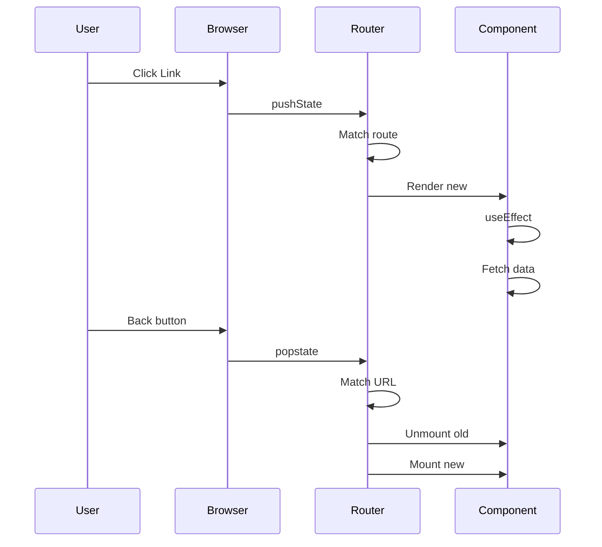
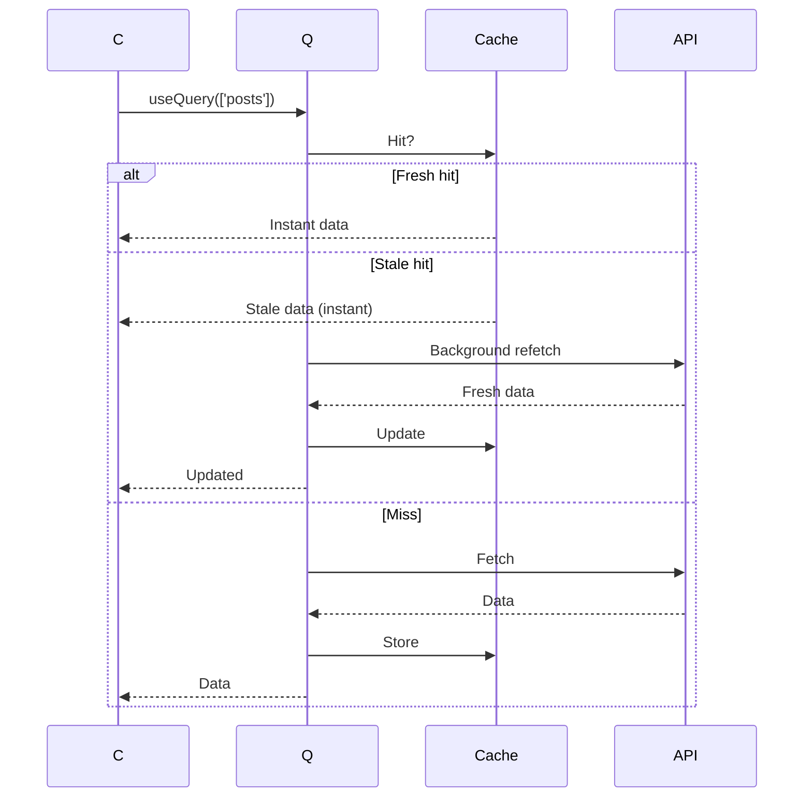
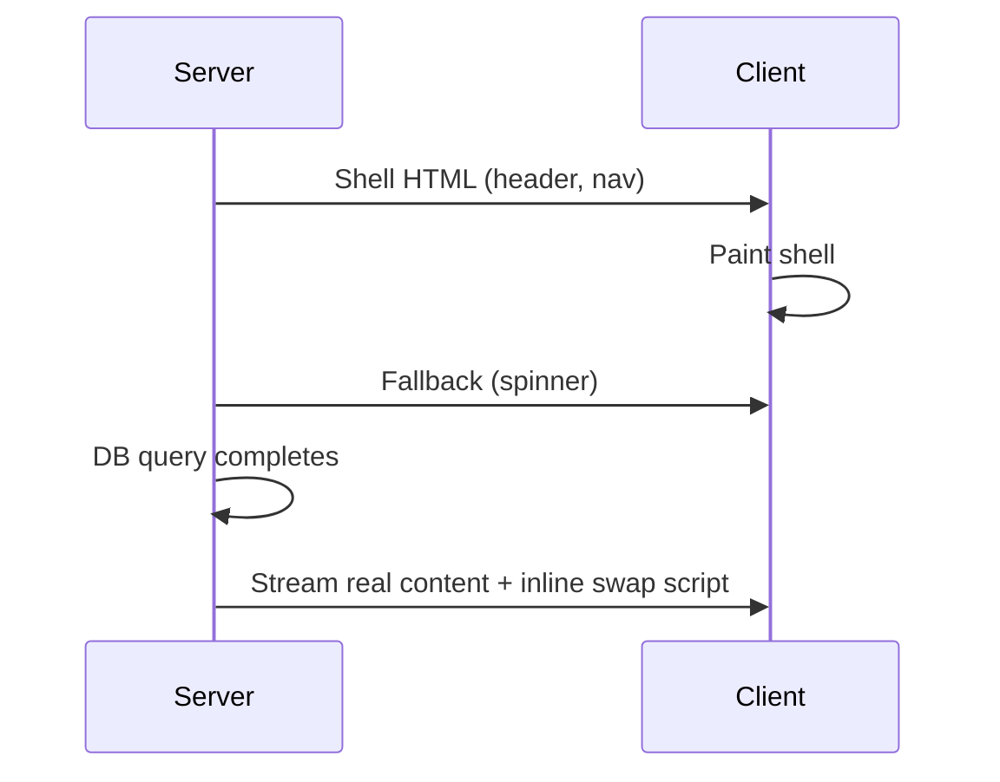
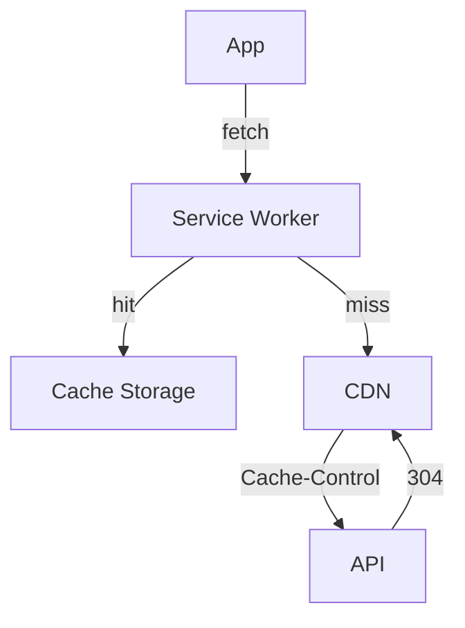
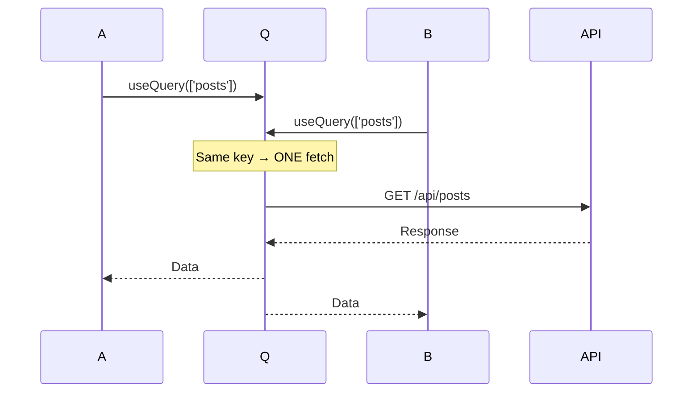
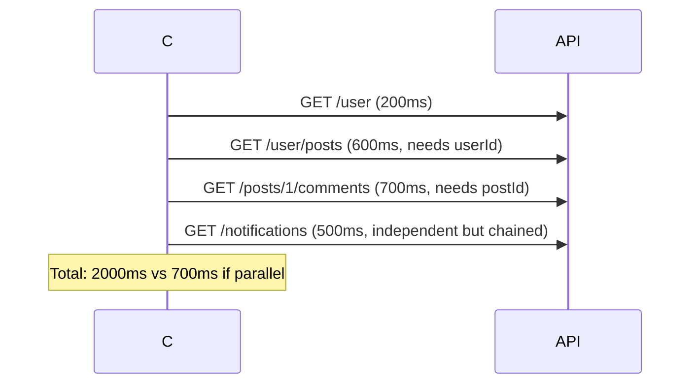

# 05: Routing & Data Fetching — Deep Reference

> **Scope**: React Router, BrowserRouter, Routes, Route, Link, NavLink, nested/index routes, URL params, search params, useParams, useSearchParams, useNavigate, useLocation, protected routes, lazy loading, layout routes, error boundaries per route, route-based code splitting, data fetching with useEffect, race conditions, AbortController, TanStack Query, useQuery, useMutation, query keys, caching, stale-while-revalidate, optimistic updates, infinite queries, server state vs client state, Suspense, use() hook, streaming SSR, parallel/sequential fetching, waterfalls, preloading, HTTP caching, service workers, prefetching, retry, timeout, cancellation, production patterns, deduplication, optimistic UI, pagination, infinite scroll, SSE, WebSocket.

---


## Router Navigation Flow





## 1. React Router Fundamentals


React Router v6 uses a nested route tree with the History API — no page reloads, only React re-renders.

```jsx
import { BrowserRouter, Routes, Route, Link, NavLink } from 'react-router-dom';

function App() {
  return (
    <BrowserRouter>
      <nav>
        <NavLink to="/" end>Home</NavLink>
        <Link to="/about">About</Link>
      </nav>
      <Routes>
        <Route path="/" element={<Home />} />
        <Route path="/about" element={<About />} />
      </Routes>
    </BrowserRouter>
  );
}
```

**Key insight**: `BrowserRouter` leverages `pushState`/`popstate`. `NavLink` provides `isActive` for styling but re-renders on every location change — for large nav menus, use `useLocation` + manual comparison.

### Route Matching


| Path | URL | Match |
|---|---|---|
| `/` | `/` | ✅ Exact |
| `/users/:id` | `/users/42` | ✅ param `id = "42"` |
| `/users/*` | `/users/42/profile` | ✅ catch-all |
| `/users/:id` | `/users/` | ❌ |

### useParams & useSearchParams


```jsx
// Route: <Route path="/users/:userId/posts/:postId" element={<Post />} />
function Post() {
  const { userId, postId } = useParams();
  const [searchParams, setSearchParams] = useSearchParams();
  const view = searchParams.get('view') || 'full';

  return (
    <div>
      <h2>User {userId}, Post {postId}</h2>
      <button onClick={() => setSearchParams({ view: 'compact' })}>Compact</button>
    </div>
  );
}
```

**Key insight**: `useSearchParams` is ideal for filters, sort, and page — state survives navigation and is shareable via URL.

### Nested Routes & Outlet


```jsx
<Routes>
  <Route path="/" element={<AppLayout />}>
    <Route index element={<Home />} />
    <Route path="users" element={<UsersLayout />}>
      <Route index element={<UsersList />} />
      <Route path=":id" element={<UserDetail />} />
    </Route>
  </Route>
</Routes>

function AppLayout() {
  return (
    <div>
      <Header />
      <main><Outlet /></main> {/* Child route renders here */}
    </div>
  );
}
```

### useNavigate & useLocation


```jsx
function LogoutButton() {
  const navigate = useNavigate();

  async function handleLogout() {
    await api.logout();
    navigate('/login', { replace: true });
  }

  return <button onClick={handleLogout}>Logout</button>;
}

// Passing state between routes
<Link to="/confirm" state={{ orderId: 42 }} />

function Confirm() {
  const { state } = useLocation();
  // state.orderId — survives SPA navigation, LOST on hard refresh
}
```

---

## 2. Advanced Routing Patterns


### Protected Routes


```jsx
function RequireAuth({ children }) {
  const { user } = useAuth();
  const location = useLocation();

  if (!user) {
    return <Navigate to="/login" state={{ from: location }} replace />;
  }
  return children;
}

// Usage
<Route path="/dashboard" element={
  <RequireAuth><Dashboard /></RequireAuth>
} />

// Redirect back after login
function LoginPage() {
  const navigate = useNavigate();
  const from = useLocation().state?.from?.pathname || '/';

  async function handleLogin() {
    await auth.login();
    navigate(from, { replace: true });
  }
}
```

### Lazy Loading & Code Splitting


```jsx
import { lazy, Suspense } from 'react';

const Dashboard = lazy(() => import('./pages/Dashboard'));
const Settings = lazy(() => import('./pages/Settings'));

function App() {
  return (
    <Suspense fallback={<PageSkeleton />}>
      <Routes>
        <Route path="/dashboard" element={<Dashboard />} />
        <Route path="/settings" element={<Settings />} />
      </Routes>
    </Suspense>
  );
}
```

**Key insight**: Each `lazy()` call creates a separate JS chunk. The browser downloads it on navigation — essential for fast initial loads.

### Layout Routes & Error Boundaries Per Route


```jsx
// Auth vs App layout
<Route element={<AuthLayout />}>
  <Route path="/login" element={<Login />} />
</Route>
<Route element={<AppLayout />}>
  <Route path="/dashboard" element={
    <ErrorBoundary fallback={<RouteErrorFallback />}>
      <Dashboard />
    </ErrorBoundary>
  } />
</Route>
```

---

## 3. Data Fetching with useEffect


### Basic Pattern


```jsx
function UserProfile({ userId }) {
  const [user, setUser] = useState(null);
  const [loading, setLoading] = useState(true);
  const [error, setError] = useState(null);

  useEffect(() => {
    let cancelled = false;
    setLoading(true);

    fetch(`/api/users/${userId}`)
      .then(r => { if (!r.ok) throw new Error(`HTTP ${r.status}`); return r.json(); })
      .then(d => { if (!cancelled) { setUser(d); setLoading(false); } })
      .catch(e => { if (!cancelled) { setError(e.message); setLoading(false); } });

    return () => { cancelled = true; };
  }, [userId]);

  if (loading) return <Spinner />;
  if (error) return <ErrorBanner message={error} />;
  return <Profile user={user} />;
}
```

### Race Conditions: The Classic Bug


```jsx
// BUG: "a" → "ab" → "abc" — responses can arrive out of order
useEffect(() => {
  fetch(`/api/search?q=${query}`)
    .then(r => r.json())
    .then(data => setResults(data)); // May overwrite newer data with stale
}, [query]);
```

**Timeline**: Fetch "a" starts, fetch "ab" starts, response "a" arrives AFTER "ab" → UI shows stale results for "a" instead of "ab".

### Fix with AbortController


```jsx
useEffect(() => {
  const controller = new AbortController();

  fetch(`/api/search?q=${query}`, { signal: controller.signal })
    .then(r => r.json())
    .then(d => setResults(d))
    .catch(e => { if (e.name !== 'AbortError') setError(e.message); });

  return () => controller.abort(); // Cancels the HTTP request
}, [query]);
```

**Key insight**: `AbortController` cancels the HTTP request at the network level. A boolean flag only prevents `setState` — the request still completes wastefully.

### Loading & Error Custom Hook


```jsx
function useFetch(url) {
  const [state, setState] = useState({ data: null, loading: true, error: null });

  useEffect(() => {
    const controller = new AbortController();
    setState(s => ({ ...s, loading: true, error: null }));

    fetch(url, { signal: controller.signal })
      .then(r => { if (!r.ok) throw new Error(`HTTP ${r.status}`); return r.json(); })
      .then(data => setState({ data, loading: false, error: null }))
      .catch(err => {
        if (err.name !== 'AbortError') {
          setState({ data: null, loading: false, error: err.message });
        }
      });

    return () => controller.abort();
  }, [url]);

  return state;
}
```

---

## 4. TanStack Query (React Query)


Replaces `useEffect`-based fetching with a cache-first, declarative approach. Server state becomes a cache management problem, not a state management problem.

### useQuery


```jsx
import { useQuery } from '@tanstack/react-query';

function Posts() {
  const { data, isLoading, error, isFetching, refetch } = useQuery({
    queryKey: ['posts'],
    queryFn: () => fetch('/api/posts').then(r => r.json()),
    staleTime: 5 * 60 * 1000,  // Fresh for 5 min
    cacheTime: 30 * 60 * 1000, // Keep 30 min after unmount
    retry: 3,
    refetchOnWindowFocus: true,
  });

  if (isLoading) return <Spinner />;
  if (error) return <Error message={error.message} />;
  return (
    <>
      {isFetching && <BackgroundRefreshIndicator />}
      <button onClick={() => refetch()}>Refresh</button>
      {data.map(p => <PostCard key={p.id} post={p} />)}
    </>
  );
}
```

### Query Keys


```javascript
['posts']                           // Simple
['posts', postId]                   // With param
['posts', { author: userId }]       // Complex
['users', userId, 'posts']          // Hierarchical
```

**Key insight**: When a query key changes, TanStack Query automatically refetches — replacing the `useEffect` dependency array pattern.

### Stale Time vs Cache Time


| | staleTime | cacheTime |
|---|---|---|
| What | How long data is considered fresh | How long cache survives after unmount |
| Default | 0 (immediately stale) | 5 minutes |
| Effect | No background refetch while fresh | Garbage collection delay |

**Key insight**: `staleTime` is the most impactful optimization. Set it high (15-30 min) for static data, 0 for real-time data.

### Caching Flow




### useMutation & Optimistic Updates


```javascript
const queryClient = useQueryClient();

const updateTodo = useMutation({
  mutationFn: (todo) => fetch(`/api/todos/${todo.id}`, {
    method: 'PUT', body: JSON.stringify(todo),
  }).then(r => r.json()),

  onMutate: async (optimistic) => {
    await queryClient.cancelQueries({ queryKey: ['todos'] });
    const previous = queryClient.getQueryData(['todos']);
    queryClient.setQueryData(['todos'], (old) =>
      old.map(t => t.id === optimistic.id ? { ...t, ...optimistic } : t)
    );
    return { previous }; // For rollback
  },

  onError: (err, vars, context) => {
    queryClient.setQueryData(['todos'], context.previous); // Rollback
    toast.error('Update failed — reverted');
  },

  onSettled: () => queryClient.invalidateQueries({ queryKey: ['todos'] }),
});
```

**Key insight**: The three-phase lifecycle (`onMutate` → `onError` rollback → `onSettled` refetch) makes the UI feel instant while guaranteeing consistency.

### Infinite Queries


```javascript
function Feed() {
  const { data, fetchNextPage, hasNextPage, isFetchingNextPage } = useInfiniteQuery({
    queryKey: ['feed'],
    queryFn: ({ pageParam }) => fetch(`/api/feed?cursor=${pageParam}`).then(r => r.json()),
    getNextPageParam: (lastPage) => lastPage.nextCursor ?? undefined,
    initialPageParam: 0,
  });

  return (
    <div>
      {data?.pages.map((page, i) => (
        <div key={i}>{page.items.map(item => <Card key={item.id} item={item} />)}</div>
      ))}
      {hasNextPage && <button onClick={fetchNextPage} disabled={isFetchingNextPage}>
        {isFetchingNextPage ? 'Loading...' : 'Load more'}
      </button>}
    </div>
  );
}
```

### Pagination (Offset-Based)


```javascript
const [page, setPage] = useState(0);

const { data, isPreviousData } = useQuery({
  queryKey: ['posts', page],
  queryFn: () => fetch(`/api/posts?page=${page}&limit=20`).then(r => r.json()),
  placeholderData: keepPreviousData, // Show previous while next loads
});
```

---

## 5. Server State vs Client State


| Dimension | Server State | Client State |
|---|---|---|
| Source of truth | Database, API | User interaction |
| Freshness | Unknown, always potentially stale | Always current |
| Sync needed | Yes (poll, WS, manual) | No |
| Loading/error states | Common | Rare |
| Examples | Posts, users, products | Theme, form input, UI state |

**Key insight**: Server state is not state management — it's CACHE management. Stale-while-revalidate, deduplication, background refetch, and cache invalidation are non-trivial to implement manually but trivial with TanStack Query.

### Cache Invalidation


```javascript
queryClient.invalidateQueries({ queryKey: ['posts'] });           // Specific
queryClient.invalidateQueries({ predicate: q => q.queryKey[0] === 'posts' }); // Filtered
queryClient.invalidateQueries();                                   // All
queryClient.setQueryData(['posts', id], newData);                   // Direct update
```

### When to Use What


| Scenario | Tool |
|---|---|
| User profile, posts, products | TanStack Query |
| Theme, locale, auth user | Context |
| Form input, toggle state | useState |
| Cart, persisted prefs | Zustand + persist |
| URL filters, page | useSearchParams |
| Complex workflows | useReducer |

Most apps need 2-3 tools: TanStack Query + Context/Zustand + useSearchParams covers 95%.

---

## 6. Suspense & Data Fetching


Suspense lets components "wait" for data before rendering.

### Suspense Boundaries


```jsx
import { Suspense } from 'react';

function Page() {
  return (
    <Suspense fallback={<BigSpinner />}>
      <Header />
      <Suspense fallback={<SmallSpinner />}>
        <SlowPanel />
      </Suspense>
    </Suspense>
  );
}
```

Nested Suspense boundaries are independent — the outer content renders while inner sections stream in.

### The use() Hook (React 19)


```jsx
import { use, Suspense } from 'react';

function fetchUser(id) {
  return fetch(`/api/users/${id}`).then(r => r.json());
}

function UserProfile({ userId }) {
  const user = use(fetchUser(userId));
  return <div>{user.name}</div>; // Waits for promise
}

function App() {
  return (
    <ErrorBoundary fallback={<ErrorFallback />}>
      <Suspense fallback={<UserSkeleton />}>
        <UserProfile userId={42} />
      </Suspense>
    </ErrorBoundary>
  );
}
```

**Key insight**: `use()` unwraps promises inline without `useEffect` or `isLoading` booleans. The component declares what it needs; React handles the async lifecycle. Error handling requires an error boundary.

### Streaming SSR


```javascript
// Server sends HTML progressively, not all at once
import { renderToPipeableStream } from 'react-dom/server';

app.get('/', (req, res) => {
  const { pipe } = renderToPipeableStream(
    <Suspense fallback={<Shell />}>
      <SlowContent />
    </Suspense>,
    { bootstrapScripts: ['/main.js'], onShellReady() { pipe(res); } }
  );
});
```



Improves LCP by sending visible shell immediately while slow data streams in.

---

## 7. Parallel & Sequential Fetching


### Waterfall (Sequential)


```javascript
// ❌ BLOCKING
const user = await fetch('/api/user').then(r => r.json());
const posts = await fetch(`/api/users/${user.id}/posts`).then(r => r.json());
// Total time: t(user) + t(posts)
```

**Necessary when**: B depends on A (e.g., need postId to fetch comments).

### Parallel


```javascript
// ✅ NON-BLOCKING
const [users, posts, notifs] = await Promise.all([
  fetch('/api/users').then(r => r.json()),
  fetch('/api/posts').then(r => r.json()),
  fetch('/api/notifications').then(r => r.json()),
]);
// Total time: max(t(users), t(posts), t(notifs))
```

**Key insight**: `Promise.all` fails fast — any rejection rejects the whole. Use `Promise.allSettled` for partial failure tolerance.

### Preloading


```jsx
// Start fetching before component mounts
const userPromise = fetchUser(userId);

function UserPage() {
  const user = use(userPromise); // Already resolving
  return <div>{user.name}</div>;
}

// Prefetch on hover (TanStack Query)
<Link
  to={`/users/${userId}`}
  onMouseEnter={() => queryClient.prefetchQuery({
    queryKey: ['users', userId],
    queryFn: () => fetch(`/api/users/${userId}`).then(r => r.json()),
  })}
>
  {children}
</Link>
```

### SWR Pattern


Always return data (cached or fresh), revalidate in background:

```javascript
function useSWR(key, fetcher) {
  return useQuery({
    queryKey: key,
    queryFn: fetcher,
    staleTime: 0,   // Always stale → always refetches
    retry: 3,
  });
  // Returns { data, error, isValidating } — always shows cached data
}
```

---

## 8. Caching & Performance


### HTTP Caching


```javascript
// Server-set headers create a multi-layer cache
fetch('/api/public-data', { headers: { 'Cache-Control': 'public, max-age=300' } });
```



### Service Worker Cache


```javascript
// service-worker.js
self.addEventListener('fetch', (event) => {
  event.respondWith(
    caches.match(event.request).then(cached => {
      const network = fetch(event.request).then(res => {
        if (res.ok) {
          const clone = res.clone();
          caches.open('api-v1').then(c => c.put(event.request, clone));
        }
        return res;
      }).catch(() => cached);
      return cached || network;
    })
  );
});
```

### Persistent Cache


```javascript
// Hydrate from localStorage on mount
function usePersistedQuery(key, fetcher) {
  const queryClient = useQueryClient();

  useEffect(() => {
    const cached = localStorage.getItem(`cache:${JSON.stringify(key)}`);
    if (cached) queryClient.setQueryData(key, JSON.parse(cached));
  }, []);

  return useQuery({
    queryKey: key,
    queryFn: fetcher,
    onSuccess: (data) => localStorage.setItem(`cache:${JSON.stringify(key)}`, JSON.stringify(data)),
  });
}
```

### Offline Mutation Queue


```javascript
const queue = [];

async function mutateWithQueue(fn) {
  if (navigator.onLine) return fn();
  queue.push(fn);
  window.addEventListener('online', async () => {
    while (queue.length) {
      try { await queue.shift()(); } catch (e) { console.error('Replay failed:', e); }
    }
  }, { once: true });
}
```

**Key insight**: A well-architected caching strategy reduces API calls by 80-95%. Combine HTTP-level (CDN headers), client-level (TanStack Query), and service worker caching.

---

## 9. Error & Edge Cases


### Retry with Exponential Backoff


```javascript
async function fetchWithRetry(url, opts = {}, retries = 3) {
  for (let i = 0; i <= retries; i++) {
    try {
      const res = await fetch(url, opts);
      if (!res.ok) throw new Error(`HTTP ${res.status}`);
      return res.json();
    } catch (err) {
      if (i === retries) throw err;
      await new Promise(r => setTimeout(r, Math.min(1000 * Math.pow(2, i) + Math.random() * 1000, 10000)));
    }
  }
}

// TanStack Query equivalent
useQuery({
  queryKey: ['data'],
  queryFn: () => fetch('/api/unstable').then(r => r.json()),
  retry: 3,
  retryDelay: (attempt) => Math.min(1000 * Math.pow(2, attempt), 10000),
  retryOnFailure: (count, error) => error.status < 500 ? false : count < 3, // Don't retry 4xx
});
```

### Timeout


```javascript
function fetchWithTimeout(url, opts = {}, timeout = 5000) {
  const controller = new AbortController();
  const id = setTimeout(() => controller.abort(), timeout);

  return fetch(url, { ...opts, signal: controller.signal })
    .finally(() => clearTimeout(id))
    .then(r => r.json())
    .catch(err => { if (err.name === 'AbortError') throw new Error('Timeout'); throw err; });
}
```

### Race Condition Prevention (Comprehensive)


```javascript
function useLatestFetch() {
  const [data, setData] = useState(null);
  const requestId = useRef(0);

  const fetch_ = useCallback(async (url) => {
    const id = ++requestId.current;
    const res = await fetch(url);
    const result = await res.json();
    if (id === requestId.current) setData(result); // Only latest wins
  }, []);

  useEffect(() => () => { requestId.current = -1; }, []); // Cleanup on unmount
  return { data, fetch: fetch_ };
}
```

### Cancellation


```javascript
// TanStack Query provides signal automatically
useQuery({
  queryKey: ['data'],
  queryFn: ({ signal }) => fetch('/api/data', { signal }).then(r => r.json()),
});

// Manual cancel
queryClient.cancelQueries({ queryKey: ['data'] });
```

### Error Boundaries for Async


```jsx
class AsyncErrorBoundary extends React.Component {
  state = { error: null };
  static getDerivedStateFromError(error) { return { error }; }
  componentDidCatch(error, info) { logError(error, info); }

  render() {
    if (this.state.error) {
      return this.props.fallback({
        error: this.state.error,
        reset: () => this.setState({ error: null }),
      });
    }
    return this.props.children;
  }
}

// Wrap Suspense + error handling together
<AsyncErrorBoundary fallback={({ error, reset }) => (
  <div><h2>Failed</h2><p>{error.message}</p><button onClick={reset}>Retry</button></div>
)}>
  <Suspense fallback={<Spinner />}>
    <DataComponent />
  </Suspense>
</AsyncErrorBoundary>
```

**Key insight**: Error boundaries only catch render/lifecycle errors. For async event handler errors, use try/catch around mutations or wrap with AsyncErrorBoundary + Suspense.

---

## 10. Production Patterns


### Request Deduplication


TanStack Query deduplicates identical in-flight requests by default:



Without TanStack Query, two rendered components fire two identical HTTP requests.

### Optimistic UI


```jsx
function LikeButton({ postId, liked }) {
  const queryClient = useQueryClient();

  const mutation = useMutation({
    mutationFn: () => fetch(`/api/posts/${postId}/like`, { method: 'POST' }),
    onMutate: async () => {
      await queryClient.cancelQueries({ queryKey: ['posts'] });
      const prev = queryClient.getQueryData(['posts']);
      queryClient.setQueryData(['posts'], (old) =>
        old.map(p => p.id === postId ? { ...p, liked: !p.liked } : p)
      );
      return { prev };
    },
    onError: (err, vars, ctx) => queryClient.setQueryData(['posts'], ctx.prev),
  });

  return <button onClick={() => mutation.mutate()} className={liked ? 'active' : ''}>
    {liked ? 'Unlike' : 'Like'}
  </button>;
}
```

### Pagination Strategies


| Strategy | UX | Trade-off |
|---|---|---|
| Offset (page/pageSize) | Page numbers | Stale if items inserted before current page |
| Cursor (cursor/limit) | "Load more" | No random page access |
| Keyset (WHERE id > x) | No duplicates, fast | Complex implementation |

### Infinite Scroll


```jsx
import { useInView } from 'react-intersection-observer';

function InfiniteFeed() {
  const { ref, inView } = useInView();
  const { data, fetchNextPage, hasNextPage, isFetchingNextPage } = useInfiniteQuery({
    queryKey: ['feed'],
    queryFn: ({ pageParam }) => fetch(`/api/feed?cursor=${pageParam}`).then(r => r.json()),
    getNextPageParam: (lastPage) => lastPage.nextCursor,
    initialPageParam: null,
  });

  useEffect(() => {
    if (inView && hasNextPage && !isFetchingNextPage) fetchNextPage();
  }, [inView, hasNextPage, isFetchingNextPage]);

  return (
    <div>
      {data?.pages.map((page, i) => (
        <div key={i}>{page.items.map(item => <Card key={item.id} item={item} />)}</div>
      ))}
      <div ref={ref}>{isFetchingNextPage && <Spinner />}</div>
    </div>
  );
}
```

### Real-Time: SSE


```javascript
function useSSE(url) {
  const queryClient = useQueryClient();

  useEffect(() => {
    const es = new EventSource(url); // Built-in auto-reconnect

    es.addEventListener('post:created', (e) => {
      queryClient.setQueryData(['posts'], (old) => [JSON.parse(e.data), ...(old || [])]);
    });
    es.addEventListener('post:updated', (e) => {
      const updated = JSON.parse(e.data);
      queryClient.setQueryData(['posts'], (old) =>
        old?.map(p => p.id === updated.id ? { ...p, ...updated } : p)
      );
    });

    return () => es.close();
  }, [url, queryClient]);
}
```

### Real-Time: WebSocket


```javascript
function useWebSocket(url) {
  const queryClient = useQueryClient();
  const ws = useRef(null);

  const connect = useCallback(() => {
    ws.current = new WebSocket(url);
    ws.current.onmessage = (e) => {
      const { type, payload } = JSON.parse(e.data);
      if (type === 'INVALIDATE') queryClient.invalidateQueries({ queryKey: [payload.key] });
      if (type === 'UPDATE') queryClient.setQueryData([payload.key, payload.id], payload.data);
    };
    ws.current.onclose = () => setTimeout(connect, 3000); // Reconnect
  }, [url]);

  useEffect(() => { connect(); return () => ws.current?.close(); }, [connect]);

  const send = useCallback((type, payload) => {
    ws.current?.send(JSON.stringify({ type, payload }));
  }, []);

  return { send, isConnected: ws.current?.readyState === WebSocket.OPEN };
}
```

### SSE vs WebSocket


| | SSE | WebSocket |
|---|---|---|
| Direction | Server → Client only | Bidirectional |
| Protocol | HTTP | WS (upgraded) |
| Auto-reconnect | Built-in | Manual |
| Use case | Live feeds, notifications | Chat, collaboration |

### Production Failure: Waterfall Causing 8s Load Time


**Scenario**: Dashboard fetches user → posts → comments → notifications sequentially.



**Fix**: Restructure API to return related data in one call, or use `Promise.all` for independent fetches.

### Data Fetching Decision Matrix


| Pattern | Complexity | UX | When |
|---|---|---|---|
| useEffect fetch | Low | Okay | Prototypes, simple pages |
| TanStack Query | Medium | Excellent | Most production apps |
| use() + Suspense | Medium | Excellent | React 19, frameworks |
| RTK Query | Medium | Good | Already on Redux |
| SWR library | Low | Good | Minimal setup |

---

## Production Checklist


- [ ] All routes wrapped with `ErrorBoundary` or route-level error boundaries
- [ ] Lazy-loaded routes with `React.lazy` + `Suspense` for code splitting
- [ ] `staleTime` set appropriately (≥30s for static data, 0 for real-time)
- [ ] Request deduplication active (TanStack Query default)
- [ ] Race conditions prevented via `AbortController` on param changes
- [ ] Retry with exponential backoff for transient failures
- [ ] Timeout set on all API fetches (5-10s default)
- [ ] Optimistic updates have rollback via `onError` snapshot restore
- [ ] Infinite queries use cursor-based pagination (not offset)
- [ ] Loading skeletons match layout — no layout shift
- [ ] Error states show retry actions
- [ ] SSE/WebSocket connections closed on unmount
- [ ] Cache invalidation triggered on mutations (not just refetch)
- [ ] Stale indicators shown for background-refreshed data
- [ ] Prefetching enabled for likely navigation targets
- [ ] `placeholderData: keepPreviousData` for pagination transitions
- [ ] No data waterfalls in critical paths
- [ ] Offline mutation queue with replay logic
- [ ] Persistent cache excludes sensitive data
- [ ] `cacheTime` > `staleTime`

---

## Related


- [Networking](/11-networking/) — HTTP, performance, optimization
- [Security](/13-security/) — CORS, authentication, XSS prevention
- [Backend](/03-backend/) — API design and contracts
- [Performance Engineering](/18-performance-engineering/) — Browser rendering
- [Testing](/19-testing/) — E2E and component testing
