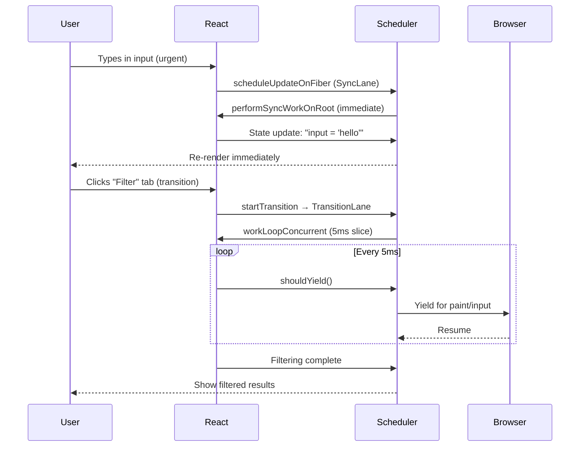
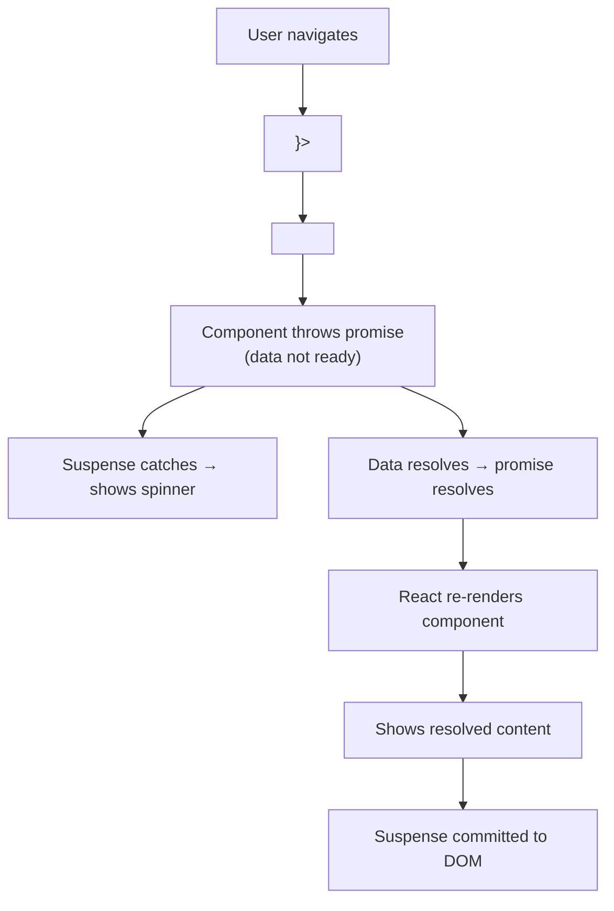

# React Concurrency — Transitions, Suspense & Concurrent Features

## WHAT
Concurrent React lets the framework **interrupt** rendering to handle higher-priority work (like typing). It can pause, resume, or discard renders — keeping the UI responsive.

## WHY
Before concurrency:
- `setState` blocks the thread until render+commit finishes
- A slow re-render (50-200ms) freezes inputs, animations, scrolling
- No way to tell React "this update is low priority"

Concurrent features solve:
- **Interruptibility**: typing stays responsive during large renders
- **Suspense**: async data without waterfall + race conditions
- **Transitions**: mark low-priority UI changes (tab switches, filtering)

## THE CONCURRENT PIPELINE



## CORE APIS

### startTransition

```typescript
import { startTransition, useState } from 'react';

function SearchPage() {
  const [query, setQuery] = useState('');
  const [results, setResults] = useState<string[]>([]);

  return (
    <input
      value={query}
      onChange={(e) => {
        setQuery(e.target.value); // Urgent: update input

        startTransition(() => {
          // Non-urgent: filter large list
          setResults(filterHugeList(e.target.value));
        });
      }}
    />
  );
}
```

### useDeferredValue

```typescript
import { useDeferredValue, useState } from 'react';

function SearchPage({ hugeList }: { hugeList: string[] }) {
  const [query, setQuery] = useState('');
  const deferredQuery = useDeferredValue(query); // Lags behind

  const isStale = query !== deferredQuery;
  const results = hugeList.filter(item =>
    item.includes(deferredQuery)
  );

  return (
    <div>
      <input value={query} onChange={e => setQuery(e.target.value)} />
      {/* Old results stay visible while re-rendering */}
      <List style={{ opacity: isStale ? 0.5 : 1 }} items={results} />
    </div>
  );
}
```

### useTransition

```typescript
import { useTransition } from 'react';

function TabSwitcher() {
  const [isPending, startTransition] = useTransition();
  const [tab, setTab] = useState('home');

  const switchTab = (next: string) => {
    startTransition(() => {
      setTab(next);
    });
  };

  return (
    <div>
      {isPending && <Spinner />} {/* Shown during transition */}
      <TabContent tab={tab} />
    </div>
  );
}
```

## SUSPENSE DATA FETCHING



```typescript
// React 19: use() hook for data fetching in render
import { Suspense, use } from 'react';

async function fetchUser(id: string): Promise<User> {
  const res = await fetch(`/api/users/${id}`);
  return res.json();
}

function UserProfile({ userId }: { userId: string }) {
  // Suspends — throws promise if data not ready
  // No useEffect, no loading state, no race conditions
  const user = use(fetchUser(userId));
  return <div>{user.name}</div>;
}

function App() {
  return (
    <Suspense fallback={<Spinner />}>
      <UserProfile userId="42" />
    </Suspense>
  );
}
```

## EDGE CASES

| Scenario | Behavior | Mitigation |
|---|---|---|
| **Transition interrupted by urgent update** | Transition is discarded, restarts from scratch | Keep input state separate from derived state |
| **Too many transitions queued** | React processes newest, discards stale | `startTransition` auto-deduplicates |
| **Suspense with slow network** | Shows fallback for entire duration | Add meaningful fallback + optimistic UI |
| **Transition never finishes** | Starvation prevention (expired → sync) | Monitor with Profiler |
| **useDeferredValue during mount** | Returns initial value immediately | No deferred rendering on first render |

## PERFORMANCE

| Feature | Cost | Benefit |
|---|---|---|
| `startTransition` | Extra scheduling overhead (~0.1ms) | Prevents jank on slow renders |
| `useDeferredValue` | Double render (old + new) | Stale UI stays responsive |
| `Suspense` | Memory for suspended tree | No manual loading states |

## INTERVIEW QUESTIONS

**Senior**: What happens if you call `setState` inside a `startTransition`? What if it's called outside?
**Staff**: Design a spreadsheet component with 10K cells. Each cell can have formulas that trigger cascading recalculations. How would you use concurrent features to keep typing responsive while formulas update?
