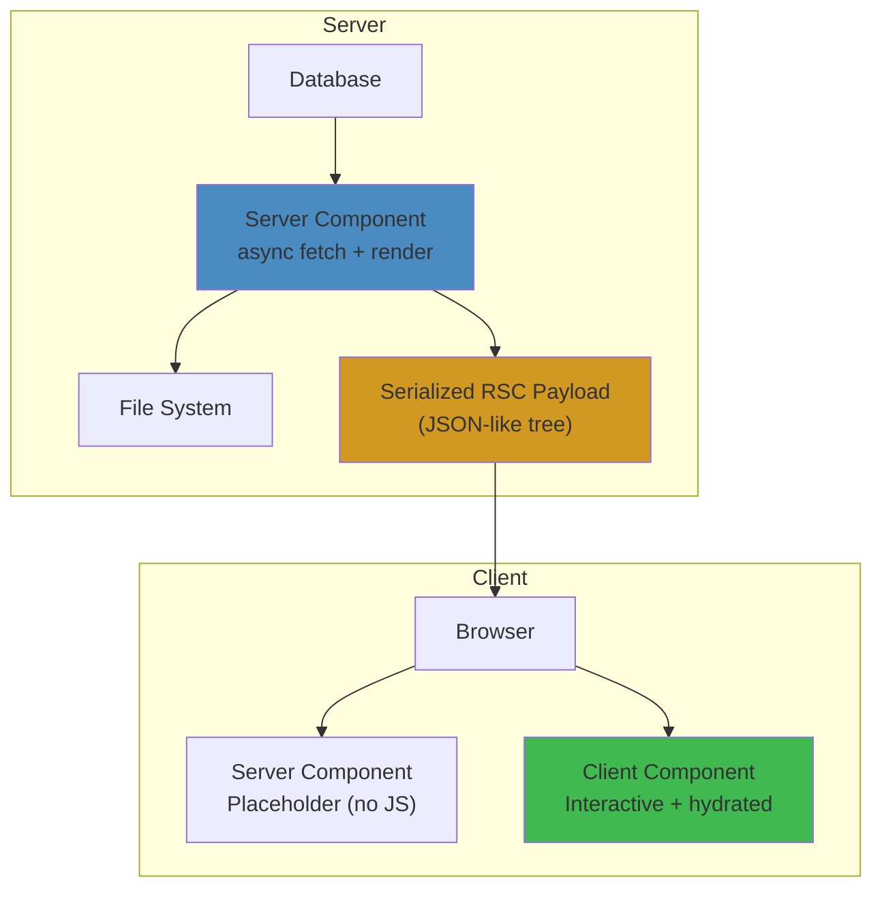
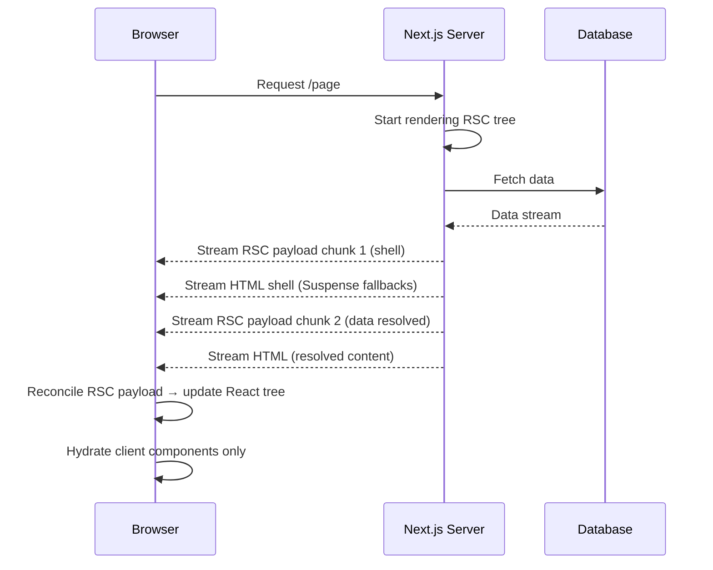

# React Server Components — Complete Deep Dive

## WHAT
React Server Components (RSC) are components that run **exclusively on the server** — they never ship to the client. They can access databases, files, and backend services directly, and they send a **serialized tree** to the client instead of JavaScript bundles.

## WHY
Before RSC, every component shipped its JavaScript to the browser — even components that only fetched data and rendered HTML. This meant:

- Massive bundle sizes (50-200KB of components the client never needed interactively)
- Waterfall: fetch → render → hydrate → fetch more → render more
- No direct access to databases (had to go through API routes)

RSC solves: **zero client-side JS for server-rendered content**, direct database access, automatic code splitting.

## HOW



## INTERNALS

### RSC Serialization Protocol

When a Server Component renders, it produces a **serialized React tree** — not HTML, not JavaScript:

```
// wire format (simplified)
J0:["$","div",null,{"className":"container","children":[
  ["$","h1",null,{"children":"Hello from server!"}],
  ["$","$","Counter",null,{"initialCount":0}]  // Client component boundary
]}]
```

Each element is: `[type, key, props, children]`. Client components are referenced by module ID (not inlined).

### The Streaming Protocol



### Client Component Boundary

```typescript
// "use client" — this file runs on client
// Everything imported here must be client-compatible
"use client";
import { useState } from 'react';

export function Counter({ initialCount }: { initialCount: number }) {
  const [count, setCount] = useState(initialCount);
  return <button onClick={() => setCount(c => c + 1)}>{count}</button>;
}
```

```typescript
// Server Component — no "use client"
// Can be async, access DB directly
import { db } from './db';

export async function Page() {
  const posts = await db.posts.findMany(); // Direct DB access!
  return (
    <div>
      {posts.map(post => <PostCard key={post.id} post={post} />)}
      <Counter initialCount={0} /> {/* Client boundary */}
    </div>
  );
}
```

## RENDER FLOW

```
1. Server receives request for /page
2. Walk RSC tree from root
3. For each Server Component:
   a. Execute async function (fetch DB, read FS)
   b. Serialize result to RSC payload format
   c. If Client Component boundary encountered:
      - Stop serializing
      - Emit reference to client module ID
4. Stream RSC payload to client (as chunks)
5. Client receives RSC payload
6. React reconciles RSC payload into client-side tree
7. Client Components are hydrated (if interactive)
```

## SERIALIZATION RULES

| Type | Can Cross Server→Client? | Example |
|---|---|---|
| Primitives | ✅ | string, number, boolean, null |
| Plain Objects | ✅ | `{ key: value }` |
| Arrays | ✅ | `[1, 2, 3]` |
| Date | ✅ | Serialized as ISO string |
| Map/Set | ✅ | Converted to array |
| Promises | ✅ (streaming) | Async components |
| Functions | ❌ | Cannot pass callbacks from server to client |
| Class instances | ❌ | No `instanceof` on client |
| Symbols | ❌ | Stripped |

## EDGE CASES

| Scenario | Behavior | Solution |
|---|---|---|
| **Function prop passed to Server Component** | Runtime error | Move interactive parts to Client Component |
| **Server Component imports client library** | Error at build time | Extract client-only code behind "use client" |
| **Nested Client→Server→Client** | Server Component inside Client Component re-renders as client | Use `children` prop pattern |
| **Streaming with slow data** | Suspense boundary shows fallback | Add meaningful fallback UI |

## PERFORMANCE

| Metric | Before RSC | With RSC |
|---|---|---|
| Bundle size for content pages | 50-200KB JS | ~0KB (server-only) |
| Time to First Byte | Dependent on client hydration | Streamed immediately |
| Data fetching | Client→API→DB waterfall | Direct DB access (1 hop) |

## PRODUCTION USAGE

- **Vercel**: Next.js App Router uses RSC by default
- **Shopify**: Hydrogen uses RSC for storefronts
- **Meta**: Testing RSC for newsfeed rendering

## INTERVIEW QUESTIONS

**Senior**: What problem do Server Components solve that SSR alone doesn't?
**Staff**: Design a architecture for a product listing page using RSC. Where do you draw client boundaries? How do you handle search/filter interactivity?
