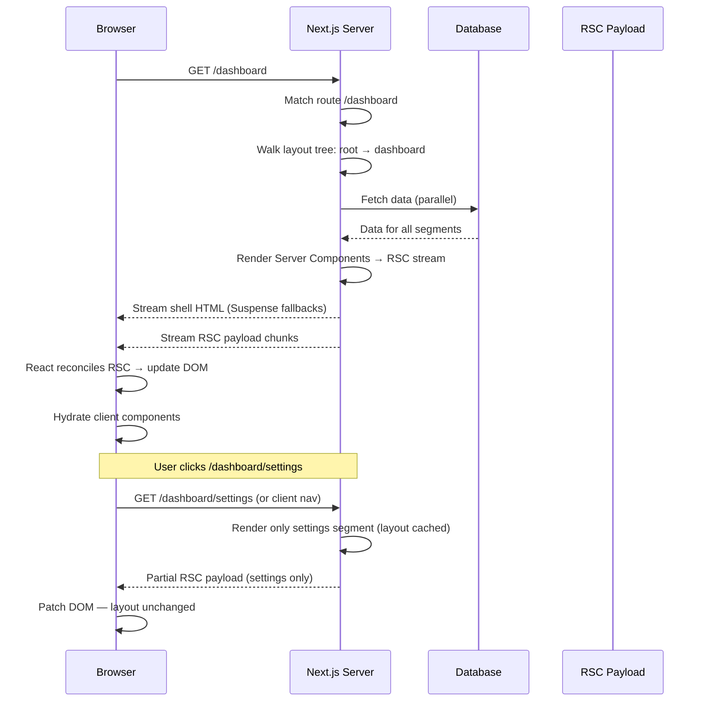

# Next.js App Router — Deep Dive

## WHAT
Next.js App Router (`app/` directory) is a **file-system based router** that combines server components, layouts, streaming, and data fetching into a single paradigm.

## WHY
Pages Router (`pages/`) required manual decisions: SSR vs SSG, client-side data fetching, shared layouts via `_app.tsx`. App Router bakes these into the framework:
- Layouts are **nested** (not stack-based)
- Data fetching is **co-located** (async components)
- Streaming is **default** (Suspense boundaries)
- Server Components are **the default** (add `"use client"` for interactivity)

## FILE CONVENTIONS

```bash
app/
├── layout.tsx         # Root layout (required) — wraps all pages
├── page.tsx           # /
├── loading.tsx        # Suspense fallback for segment
├── error.tsx          # Error boundary (catches errors in segment)
├── not-found.tsx      # 404 page
├── global.css
├── (auth)/            # Route group (no URL segment)
│   ├── login/page.tsx
│   └── register/page.tsx
├── dashboard/
│   ├── layout.tsx     # Nested layout — persists across dashboard/* pages
│   ├── page.tsx       # /dashboard
│   ├── loading.tsx
│   └── settings/
│       ├── page.tsx   # /dashboard/settings
│       └── template.tsx # Re-mounts on navigation (not persistent like layout)
├── blog/
│   ├── [slug]/
│   │   ├── page.tsx   # /blog/:slug
│   │   └── generateStaticParams.ts
│   └── page.tsx       # /blog
└── api/
    └── route.ts       # API route (GET, POST, etc.)
```

## RENDER FLOW



## LAYOUT PERSISTENCE

```typescript
// app/dashboard/layout.tsx — rendered once, persists across /dashboard/*
export default function DashboardLayout({ children }: {
  children: React.ReactNode;
}) {
  return (
    <div className="dashboard-container">
      <nav>{/* Stable — not re-rendered on nav */}</nav>
      <main>{children}</main>
    </div>
  );
}
```

## DATA FETCHING

```typescript
// Server Component — fetch directly (no API route needed)
async function getPosts() {
  const res = await fetch('https://api.example.com/posts', {
    next: { revalidate: 60 } // Incremental Static Regeneration
  });
  return res.json();
}

// Page — async, Suspense-compatible
export default async function BlogPage() {
  const posts = await getPosts();
  return (
    <ul>
      {posts.map(post => <li key={post.id}>{post.title}</li>)}
    </ul>
  );
}
```

## ERROR HANDLING

```typescript
// app/dashboard/error.tsx — catches errors in /dashboard + children
'use client'; // Error boundaries must be client components

export default function Error({ error, reset }: {
  error: Error & { digest?: string };
  reset: () => void;
}) {
  return (
    <div>
      <h2>Something went wrong!</h2>
      <p>{error.message}</p>
      <button onClick={reset}>Try again</button>
    </div>
  );
}
```

## EDGE CASES

| Scenario | Behavior | Fix |
|---|---|---|
| **Layout re-mounts on nav** | Wrong — layouts persist | Use `template.tsx` if re-mount needed |
| **Page data is stale** | Cache not revalidated | `revalidatePath()` or `revalidateTag()` |
| **Parallel routes flicker** | Route groups conflict | Use `default.js` for catch-all |
| **Intercepting routes close modal** | URL changes break modal | `(..)catch-all` pattern |

## INTERVIEW QUESTIONS

**Senior**: Compare Next.js App Router with React Router. When would you choose each?
**Staff**: Design an e-commerce site with App Router. How do you handle: product search with SSR, cart state across layouts, and real-time inventory? Where do you put server vs client boundaries?
