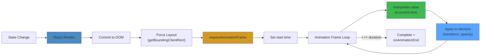
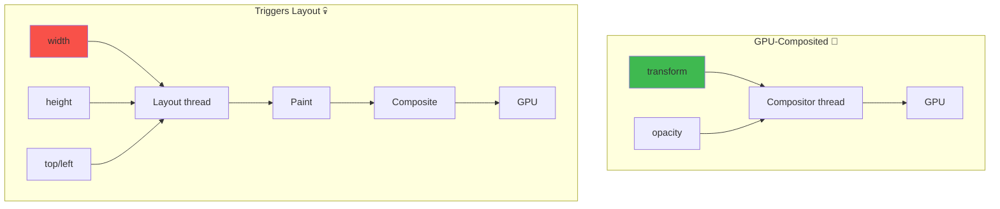

# React Animation Systems — Production Architecture

## WHAT
Animation in React isn't about visual effects — it's about **managing state transitions over time** while maintaining smooth 60fps rendering.

## WHY
Bad animations cause: jank (dropped frames), layout thrashing, memory leaks from unmounted timers, reconciliation conflicts (React re-renders mid-animation).

## ANIMATION STRATEGY COMPARISON

| Strategy | Library | Learn Curve | Bundle Size | GPU Accel | Use Case |
|---|---|---|---|---|---|
| **CSS Transitions** | None | Low | 0KB | ✅ | Simple hover/fade |
| **Declarative** | Framer Motion | Medium | 35KB | ✅ | Most UI animations |
| **Imperative** | GSAP | High | 25KB | ✅ | Complex timelines |
| **Canvas/WebGL** | PixiJS, Three.js | Very High | 200KB+ | ✅ | Games, 3D, particles |
| **Lottie** | lottie-web | Low | 100KB | ⚠️ | Designer-created animations |
| **Native Web** | Web Animations API | Low | 0KB | ✅ | Simple, no library |

## INTERNALS: The Animation Frame Pipeline



### GPU Composition vs Layout



**Rule**: Always animate `transform` and `opacity`. Never animate `width`, `height`, `top`, `left` — these trigger layout recalculations.

## REACT ANIMATION PATTERNS

### 1. CSS Transitions (Zero Deps)

```typescript
const FadeIn = ({ show, children }) => (
  <div style={{
    opacity: show ? 1 : 0,
    transition: 'opacity 300ms ease-in-out'
  }}>
    {children}
  </div>
);
```

### 2. Framer Motion (Declarative)

```typescript
import { motion, AnimatePresence } from 'framer-motion';

const PageTransition = ({ children }) => (
  <AnimatePresence mode="wait">
    <motion.div
      key={location.pathname}
      initial={{ opacity: 0, x: 100 }}
      animate={{ opacity: 1, x: 0 }}
      exit={{ opacity: 0, x: -100 }}
      transition={{ duration: 0.3, ease: 'easeInOut' }}
    >
      {children}
    </motion.div>
  </AnimatePresence>
);
```

### 3. GSAP (Imperative Complex Timelines)

```typescript
import { useRef, useEffect } from 'react';
import gsap from 'gsap';

const PageTransition = () => {
  const ref = useRef<HTMLDivElement>(null);

  useEffect(() => {
    const ctx = gsap.context(() => {
      gsap.from(ref.current, {
        opacity: 0,
        y: 50,
        duration: 0.6,
        ease: 'power3.out'
      });
    }, ref);

    return () => ctx.revert(); // Cleanup!
  }, []);

  return <div ref={ref}>Content</div>;
};
```

## PERFORMANCE

| Strategy | When to Use | Avoid When |
|---|---|---|
| **CSS transitions** | Simple enter/exit | Complex choreography |
| **Framer Motion** | Layout animations, shared layouts | 100+ simultaneous elements |
| **GSAP** | Timeline-based, scroll-linked | Simple fades |
| **Canvas/WebGL** | Particle systems, 3D | Form controls |
| **Web Animations API** | Zero-dependency, simple | Browser support gaps |

## FAILURES

| Failure | Cause | Fix |
|---|---|---|
| **Jank** | Layout-triggering properties | Use transform/opacity only |
| **Memory leak** | GSAP animation not reverted | `gsap.context()` + cleanup |
| **Framer Motion exit not working** | Missing `AnimatePresence` | Wrap in `<AnimatePresence>` |
| **Animation on unmounted component** | Async state after unmount | Check mounted ref |
| **Layout shift** | Animation changes dimensions | Use `will-change: transform` |

## INTERVIEW QUESTIONS

**Senior**: How would you animate a list where items enter, exit, and reorder? What're the performance implications?
**Staff**: Design an animation system for a Figma-like infinite canvas with 10,000+ layers. How do you cull off-screen animations? How do you handle zoom/pan with animations?
