# Design Systems in React

## WHAT
A design system is a **single source of truth** for UI components — tokens, primitives, patterns — consumed by multiple teams/products.

## WHY
Without a design system: inconsistent UI, 10 different button components, 5 color palettes, inaccessible patterns, wasted engineering time.

## THE LAYER MODEL

```mermaid
graph TB
    subgraph "Foundation"
        T["Design Tokens<br/>(color, spacing, typography)"] --> D["Design Language"]
    end
    subgraph "Primitives"
        P1["Radix UI / Headless<br/>(behavior, a11y)"] --> P2["Styled Components<br/>(visual layer)"]
    end
    subgraph "Components"
        C1["Button"] --> C2["Input"]
        C2 --> C3["Select"]
        C3 --> C4["Modal"]
    end
    subgraph "Patterns"
        PT1["Form Layout"] --> PT2["Data Table"]
        PT2 --> PT3["Wizard"]
    end
    subgraph "Consumers"
        APP1["App A"] --> APP2["App B"]
        APP2 --> APP3["Marketing Site"]
    end
    style C1 fill:#58a6ff
    style T fill:#3fb950
    style PT1 fill:#d29922
```



## DESIGN TOKENS

```typescript
// tokens.ts — single source of truth
export const tokens = {
  color: {
    brand: {
      primary: { value: '#0969da', scale: ['#ddf4ff', '#b6e3ff', ...] },
      secondary: { value: '#8250df' },
    },
    neutral: {
      background: { value: '#ffffff', dark: '#0d1117' },
      text: { value: '#1f2328', dark: '#e6edf3' },
      border: { value: '#d0d7de', dark: '#30363d' },
    },
    semantic: {
      success: { value: '#1a7f37' },
      error: { value: '#cf222e' },
      warning: { value: '#bf8700' },
    },
  },
  spacing: {
    xs: { value: '4px' },
    sm: { value: '8px' },
    md: { value: '16px' },
    lg: { value: '24px' },
    xl: { value: '32px' },
  },
  typography: {
    fontFamily: { value: 'Inter, -apple-system, sans-serif' },
    fontSize: {
      sm: { value: '14px' },
      md: { value: '16px' },
      lg: { value: '20px' },
    },
    fontWeight: {
      regular: { value: 400 },
      medium: { value: 500 },
      bold: { value: 600 },
    },
  },
  borderRadius: {
    sm: { value: '4px' },
    md: { value: '8px' },
    lg: { value: '12px' },
    full: { value: '9999px' },
  },
} as const;
```

## COMPONENT ARCHITECTURE

```typescript
// Button — composition of primitive + tokens + variant system
"use client";
import { forwardRef } from 'react';
import { tokens } from './tokens';
import { Slot } from '@radix-ui/react-slot';

type ButtonVariant = 'primary' | 'secondary' | 'danger' | 'ghost';
type ButtonSize = 'sm' | 'md' | 'lg';

interface ButtonProps extends React.ButtonHTMLAttributes<HTMLButtonElement> {
  variant?: ButtonVariant;
  size?: ButtonSize;
  asChild?: boolean; // Slot pattern — render as child element
}

const variantStyles: Record<ButtonVariant, React.CSSProperties> = {
  primary: {
    backgroundColor: tokens.color.brand.primary.value,
    color: '#ffffff',
    border: 'none',
  },
  secondary: {
    backgroundColor: 'transparent',
    color: tokens.color.brand.primary.value,
    border: `1px solid ${tokens.color.neutral.border.value}`,
  },
  danger: {
    backgroundColor: tokens.color.semantic.error.value,
    color: '#ffffff',
    border: 'none',
  },
  ghost: {
    backgroundColor: 'transparent',
    color: tokens.color.neutral.text.value,
    border: 'none',
  },
};

const sizeStyles: Record<ButtonSize, React.CSSProperties> = {
  sm: { padding: `${tokens.spacing.xs.value} ${tokens.spacing.sm.value}`, fontSize: tokens.typography.fontSize.sm.value },
  md: { padding: `${tokens.spacing.sm.value} ${tokens.spacing.md.value}`, fontSize: tokens.typography.fontSize.md.value },
  lg: { padding: `${tokens.spacing.md.value} ${tokens.spacing.lg.value}`, fontSize: tokens.typography.fontSize.lg.value },
};

export const Button = forwardRef<HTMLButtonElement, ButtonProps>(
  ({ variant = 'primary', size = 'md', asChild, style, ...props }, ref) => {
    const Comp = asChild ? Slot : 'button';
    return (
      <Comp
        ref={ref}
        style={{
          ...variantStyles[variant],
          ...sizeStyles[size],
          borderRadius: tokens.borderRadius.md.value,
          fontFamily: tokens.typography.fontFamily.value,
          fontWeight: tokens.typography.fontWeight.medium.value,
          cursor: 'pointer',
          ...style,
        }}
        {...props}
      />
    );
  }
);
Button.displayName = 'Button';
```

## TOOLING

| Tool | Purpose | Bundle Impact |
|---|---|---|
| **Radix UI** | Accessible headless primitives | ~15KB per component |
| **Stitches / Vanilla Extract** | Zero-runtime CSS-in-JS | 0KB runtime |
| **Tailwind CSS** | Utility-first tokens | ~10KB (purged) |
| **Storybook** | Component catalog + testing | Dev only |
| **Loki / Chromatic** | Visual regression testing | CI only |
| **Style Dictionary** | Token transformation (JS → CSS → iOS → Android) | Build only |

## PRODUCTION USAGE

- **GitHub Primer**: design system powering all GitHub surfaces (web, mobile, CLI)
- **Adobe Spectrum**: 40+ components, cross-product consistency
- **Shopify Polaris**: merchant-facing admin, 100+ components
- **Vercel Geist**: minimal, performance-optimized tokens

## INTERVIEW QUESTIONS

**Senior**: How do you version and distribute a design system across 50+ microfrontends?
**Staff**: Design a theming system that supports light/dark/high-contrast modes with zero runtime overhead. How do you ensure tree-shaking works across all consumers?
