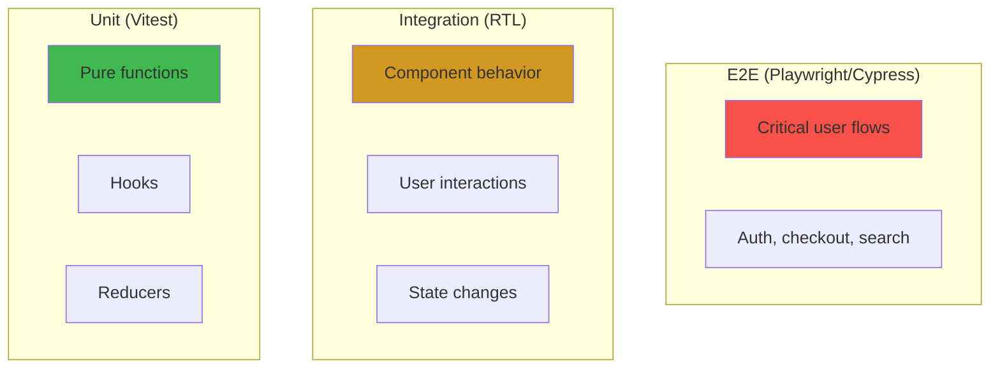

# React Testing Strategy

## WHAT
Testing React components at multiple levels: unit (logic), integration (components), e2e (user flows).

## WHY
Without tests: regressions on every deploy, manual QA bottleneck, untested error states, accessibility broken silently.

## TEST PYRAMID FOR REACT



## TOOLS

| Layer | Tool | What It Tests | Speed |
|---|---|---|---|
| **Unit** | Vitest + @testing-library/react-hooks | Hooks, utils, reducers | <1ms/test |
| **Integration** | @testing-library/react | Component rendering, events | ~10ms/test |
| **E2E** | Playwright | Full user flows, network, browser | ~1s/test |
| **Visual** | Storybook + Loki | Visual regressions, every variant | ~500ms/test |
| **A11y** | axe-core (via RTL/Playwright) | Accessibility violations | ~50ms/test |

## COMPONENT TESTING (RTL)

```typescript
// Button.test.tsx
import { render, screen, fireEvent } from '@testing-library/react';
import userEvent from '@testing-library/user-event';
import { Button } from './Button';
import { describe, it, expect, vi } from 'vitest';

describe('Button', () => {
  it('renders children text', () => {
    render(<Button>Click me</Button>);
    expect(screen.getByText('Click me')).toBeInTheDocument();
  });

  it('calls onClick when clicked', async () => {
    const onClick = vi.fn();
    render(<Button onClick={onClick}>Submit</Button>);
    await userEvent.click(screen.getByText('Submit'));
    expect(onClick).toHaveBeenCalledOnce();
  });

  it('applies variant styles', () => {
    const { container } = render(<Button variant="danger">Delete</Button>);
    expect(container.firstChild).toHaveStyle({ backgroundColor: '#cf222e' });
  });

  it('is disabled when disabled prop is set', () => {
    render(<Button disabled>Can't click</Button>);
    expect(screen.getByText("Can't click")).toBeDisabled();
  });
});
```

## HOOK TESTING

```typescript
// useCounter.test.ts
import { renderHook, act } from '@testing-library/react';
import { useCounter } from './useCounter';

describe('useCounter', () => {
  it('increments count', () => {
    const { result } = renderHook(() => useCounter(0));
    
    act(() => { result.current.increment(); });
    
    expect(result.current.count).toBe(1);
  });

  it('decrements count', () => {
    const { result } = renderHook(() => useCounter(5));
    
    act(() => { result.current.decrement(); });
    
    expect(result.current.count).toBe(4);
  });
});
```

## E2E TESTING (PLAYWRIGHT)

```typescript
// checkout.spec.ts
import { test, expect } from '@playwright/test';

test('user can complete checkout', async ({ page }) => {
  await page.goto('/products');
  
  // Add item to cart
  await page.click('[data-testid="add-to-cart"]');
  await expect(page.locator('[data-testid="cart-count"]')).toHaveText('1');
  
  // Go to checkout
  await page.click('[data-testid="checkout-btn"]');
  await page.fill('[name="email"]', 'test@example.com');
  await page.fill('[name="card"]', '4242424242424242');
  await page.click('[type="submit"]');
  
  // Verify success
  await expect(page.locator('[data-testid="order-confirmation"]')).toBeVisible();
});
```

## WHAT NOT TO TEST

| Don't Test | Why | Instead |
|---|---|---|
| Implementation details (state, refs) | Breaks on refactor | Test behavior (rendered output) |
| Third-party library internals | Not your code | Mock at boundary |
| CSS values (exact pixels) | Fragile | Visual regression testing |
| Everything | Diminishing returns | Test user-facing behavior |
| Snapshot tests (>50% of test suite) | Blind approval, large diffs | Specific assertions |

## BEST PRACTICES

1. **Test behavior, not implementation** — query by role/text, not classNames
2. **Use `userEvent` over `fireEvent`** — simulates real browser behavior (hover, keyboard)
3. **Avoid testing `useEffect` directly** — test the side effect it triggers
4. **Co-locate tests** — `Button.test.tsx` next to `Button.tsx`
5. **Run tests in CI** — fail builds on test failure

## INTERVIEW QUESTIONS

**Senior**: How do you test a component that fetches data on mount? What if it has error and loading states?
**Staff**: Design a testing strategy for a microfrontend architecture with 50 teams. How do you ensure each team's components work together without full integration tests?
