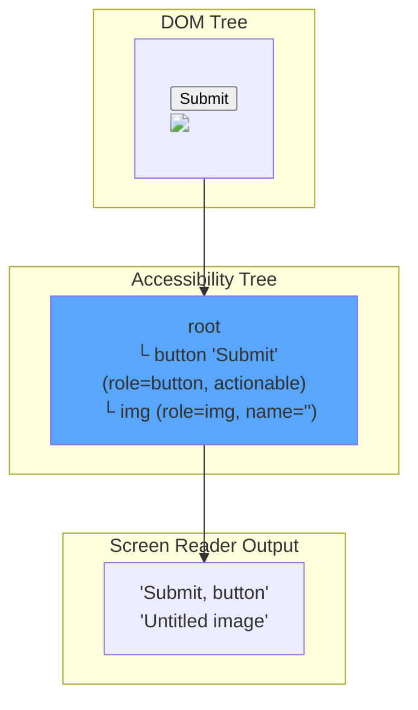
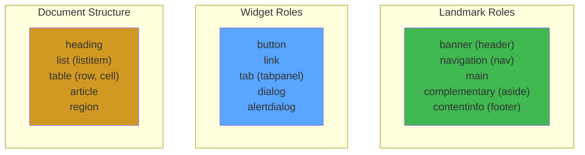

# Accessibility (a11y) in React

## WHAT
Accessibility ensures apps work for **everyone** — screen reader users, keyboard-only navigation, low vision, motor impairments, cognitive disabilities.

## WHY
- 15% of the global population has a disability
- WCAG compliance is legally required (ADA, Section 508, EU Directive)
- Accessibility bugs = conversion loss (e.g., inaccessible checkout)

## THE A11Y TREE



### What Screen Readers Hear

```html
<!-- ❌ Inaccessible -->
<div class="card" onclick="openModal()">
  <h3>Product Name</h3>
  <p>$49.99</p>
</div>
<!-- Reads: "Product Name $49.99" — no indication it's interactive -->

<!-- ✅ Accessible -->
<button class="card" onClick="openModal()" aria-label="View Product Name details">
  <h3>Product Name</h3>
  <p>$49.99</p>
</button>
<!-- Reads: "View Product Name details, button" -->
```

## CORE PATTERNS

### Semantic HTML

```typescript
// ❌ Div soup — no semantic meaning
<div onClick={handleNav}>
  <div>Home</div>
  <div>About</div>
</div>

// ✅ Semantic — navigation landmark
<nav aria-label="Main navigation">
  <ul>
    <li><a href="/">Home</a></li>
    <li><a href="/about">About</a></li>
  </ul>
</nav>
```

### Focus Management (Modals)

```typescript
"use client";
import { useEffect, useRef } from 'react';

function Modal({ isOpen, onClose, children }: {
  isOpen: boolean;
  onClose: () => void;
  children: React.ReactNode;
}) {
  const modalRef = useRef<HTMLDivElement>(null);
  const previousFocus = useRef<HTMLElement | null>(null);

  useEffect(() => {
    if (isOpen) {
      previousFocus.current = document.activeElement as HTMLElement;
      // Trap focus inside modal
      modalRef.current?.focus();
      
      const handleKeyDown = (e: KeyboardEvent) => {
        if (e.key === 'Escape') onClose();
        if (e.key === 'Tab') trapFocus(e, modalRef.current!);
      };
      
      document.addEventListener('keydown', handleKeyDown);
      // Prevent background scroll
      document.body.style.overflow = 'hidden';
      
      return () => {
        document.removeEventListener('keydown', handleKeyDown);
        document.body.style.overflow = '';
        previousFocus.current?.focus(); // Restore focus
      };
    }
  }, [isOpen, onClose]);

  if (!isOpen) return null;

  return (
    <div
      role="dialog"
      aria-modal="true"
      aria-label="Modal dialog"
      ref={modalRef}
      tabIndex={-1}
    >
      {children}
    </div>
  );
}

function trapFocus(e: KeyboardEvent, container: HTMLElement) {
  const focusable = container.querySelectorAll<HTMLElement>(
    'button, [href], input, select, textarea, [tabindex]:not([tabindex="-1"])'
  );
  const first = focusable[0];
  const last = focusable[focusable.length - 1];

  if (e.shiftKey && document.activeElement === first) {
    last.focus();
    e.preventDefault();
  } else if (!e.shiftKey && document.activeElement === last) {
    first.focus();
    e.preventDefault();
  }
}
```

### Live Regions (Dynamic Content)

```typescript
// Announce dynamic changes to screen readers
function Toast({ message, type }: { message: string; type: 'success' | 'error' }) {
  return (
    <div
      role="status"
      aria-live="polite"  // "polite" = wait until idle, "assertive" = interrupt
      aria-atomic="true"   // Read entire content, not just changed part
      className={`toast toast-${type}`}
    >
      {message}
    </div>
  );
}
```

## WAI-ARIA ROLES



## TESTING ACCESSIBILITY

```typescript
// Automated a11y testing with axe-core
import { render } from '@testing-library/react';
import { axe, toHaveNoViolations } from 'jest-axe';

expect.extend(toHaveNoViolations);

it('Button should have no a11y violations', async () => {
  const { container } = render(<Button variant="primary">Submit</Button>);
  const results = await axe(container);
  expect(results).toHaveNoViolations();
});
```

## COMMON VIOLATIONS

| Violation | Frequency | Fix |
|---|---|---|
| **Missing image alt text** | Very high | `alt="description"` or `alt=""` (decorative) |
| **Low color contrast** | High | Check WCAG AA (4.5:1 normal, 3:1 large) |
| **Missing form labels** | High | `<label htmlFor="id">` or `aria-label` |
| **Non-semantic button** | Medium | Use `<button>` not `<div onClick>` |
| **Focus not visible** | Medium | Never set `outline: none` without replacement |

## INTERVIEW QUESTIONS

**Senior**: A user reports they can't complete checkout using a screen reader. Walk through your debugging process.
**Staff**: Design a design system with accessibility as a core requirement. How do you make accessibility opt-**out** (not opt-in) for all teams?
