# React Security Guide

## WHAT
Security vulnerabilities specific to React applications — XSS, CSRF, injection, dependency risks.

## WHY
React's JSX auto-escapes output, **preventing most XSS**. But devs can bypass protections: `dangerouslySetInnerHTML`, server-side rendering, URL injection, third-party scripts.

## XSS ATTACK VECTORS

```mermaid
graph TB
    subgraph "Reflected XSS"
        R1["User clicks malicious link"] --> R2["Server reflects script in HTML"]
        R2 --> R3["Script executes in user's browser"]
    end
    subgraph "Stored XSS"
        S1["Attacker posts malicious comment"] --> S2["Server stores in DB"]
        S2 --> S3["Every visitor executes the script"]
    end
    subgraph "DOM-based XSS"
        D1["Malicious URL fragment"] --> D2["Client-side JS reads from URL"]
        D2 --> D3["Script injected via innerHTML"]
    end
    style R3 fill:#f85149
    style S3 fill:#f85149
    style D3 fill:#f85149
```



## REACT-SPECIFIC RISKS

### dangerouslySetInnerHTML

```typescript
// ❌ CRITICAL: Direct HTML injection
function Comment({ htmlContent }: { htmlContent: string }) {
  return <div dangerouslySetInnerHTML={{ __html: htmlContent }} />;
}
// Attacker posts: 

// ✅ Mitigation: sanitize first
import DOMPurify from 'dompurify';

function SafeComment({ htmlContent }: { htmlContent: string }) {
  const sanitized = DOMPurify.sanitize(htmlContent);
  return <div dangerouslySetInnerHTML={{ __html: sanitized }} />;
}
```

### URL Injection

```typescript
// ❌ javascript: URL injection
function BadLink({ url }: { url: string }) {
  return <a href={url}>Click me</a>; // <a href="javascript:alert('xss')">
}

// ✅ Validate URL protocol
function SafeLink({ url }: { url: string }) {
  const parsed = new URL(url, window.location.origin); // Throws on javascript:
  return <a href={parsed.href}>Click me</a>;
}

// ✅ Or use a URL validation function
function isValidUrl(str: string): boolean {
  try {
    const url = new URL(str);
    return ['http:', 'https:', 'mailto:'].includes(url.protocol);
  } catch { return false; }
}
```

### SSR Data Injection

```typescript
// ❌ User data inlined in SSR without escaping
<script>
  window.__INITIAL_DATA__ = ${JSON.stringify(userInput)};
  // If userInput contains </script>, it breaks out and executes arbitrary code
</script>

// ✅ Escape </script> sequences
const safeData = JSON.stringify(userInput).replace(/</g, '\\u003c');
<script>window.__INITIAL_DATA__ = {safeData};</script>
```

## CSP: CONTENT SECURITY POLICY

```typescript
// next.config.js — set CSP headers
const csp = {
  'default-src': ["'self'"],
  'script-src': ["'self'", "'strict-dynamic'"],
  'style-src': ["'self'", "'unsafe-inline'"],
  'img-src': ["'self'", 'https://*.example.com'],
  'connect-src': ["'self'", 'https://api.example.com'],
  'frame-ancestors': ["'none'"], // Prevent clickjacking
};

// next.config.js
module.exports = {
  async headers() {
    return [
      {
        source: '/(.*)',
        headers: [
          { key: 'Content-Security-Policy', value: Object.entries(csp).map(([k, v]) => `${k} ${v.join(' ')}`).join('; ') },
          { key: 'X-Frame-Options', value: 'DENY' },
          { key: 'X-Content-Type-Options', value: 'nosniff' },
          { key: 'Strict-Transport-Security', value: 'max-age=31536000; includeSubDomains' },
        ],
      },
    ];
  },
};
```

## DEPENDENCY RISKS

| Risk | Example | Mitigation |
|---|---|---|
| **Malicious package** | `event-stream` (copay) | `npm audit`, SCA tools (Snyk) |
| **Prototype pollution** | Lodash merge with `__proto__` | Use `Object.freeze` on config |
| **Supply chain attack** | Compromised maintainer | Lock files, package signing |
| **Typo squating** | `url-parser` vs `url-parse` | Verify package name |

## SECURE PATTERNS

### CSRF Protection

```typescript
// React + Next.js API routes with CSRF token
async function submitForm(formData: FormData) {
  const response = await fetch('/api/submit', {
    method: 'POST',
    headers: {
      'Content-Type': 'application/json',
      'X-CSRF-Token': getCsrfToken(), // Double-submit cookie pattern
    },
    body: JSON.stringify({ data: formData }),
    credentials: 'same-origin',
  });
}
```

### Auth Token Storage

```typescript
// ❌ Never store tokens in:
// - localStorage (accessible by any JS on same origin)
// - sessionStorage (accessible by any JS on same origin)
// - URL params (logged in server logs, referrer headers)

// ✅ Store tokens:
// - httpOnly cookie (not accessible by JS, immune to XSS)
// - In-memory (lost on refresh, requires re-auth)

// ✅ Pattern: BFF (Backend for Frontend) — no tokens on client
// Server sets httpOnly cookie after auth
// Client never sees the token
```

## INTERVIEW QUESTIONS

**Senior**: Your React app stores the auth token in localStorage. A stored XSS vulnerability is found. What's the blast radius and how do you fix it?
**Staff**: Design a secure architecture for a fintech React app. How do you handle token storage, CSP, third-party scripts (analytics, chat), and iframe embedding?
