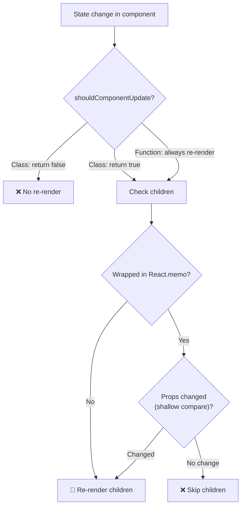
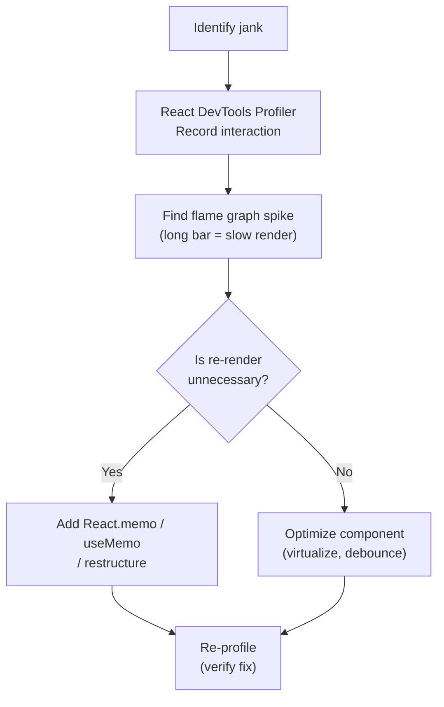

# React Render Optimization — Profiling & Debugging

> 🎮 **Interactive**: [Re-render Tree Visualizer](/04-frontend/react/39-visual-simulations/rerender-tree.html) — see which components re-render on state change, toggle `React.memo` live

## WHAT

Understanding **why** React re-renders and **how to stop unnecessary ones** — from `React.memo` to the Profiler API to compiler-driven optimizations.

## WHY

Unnecessary re-renders cause: janky interactions (heavy subtrees re-rendering on every keystroke), wasted CPU, battery drain on mobile, poor INP/FID metrics.

## THE RENDER DECISION TREE



## INTERNALS

### React.memo — Shallow Comparison

```typescript
// Manual version of what React.memo does internally
function memo(Component: React.ComponentType, areEqual?: Comparator) {
  return class MemoComponent extends React.PureComponent {
    // Uses shallowEqual by default
    // Compares Object.is on each prop
    // { a: 1 } === { a: 1 }? FALSE (new reference!)
    // 42 === 42? TRUE
    
    render() {
      return React.createElement(Component, this.props);
    }
  };
}

// Problem: inline objects create new references every render
<MemoChild config={{ theme: 'dark' }} /> // ❌ Always re-renders!

// Solution: stable references
const config = { theme: 'dark' }; // Defined outside component
<MemoChild config={config} /> // ✅ Stable reference
```

### The Profiler API

```typescript
"use client";
import { Profiler } from 'react';

function onRenderCallback(
  id: string,                    // Profiler ID
  phase: 'mount' | 'update',    // What triggered
  actualDuration: number,        // Time spent rendering (ms)
  baseDuration: number,          // Estimated time without memo
  startTime: number,             // When render started
  commitTime: number,            // When commit completed
  interactions: Set<Interaction> // What caused this
) {
  if (actualDuration > 16) { // Over budget (>1 frame at 60fps)
    console.warn(`[Perf] ${id} took ${actualDuration.toFixed(1)}ms`);
    reportToAnalytics({ id, actualDuration, phase });
  }
}

function App() {
  return (
    <Profiler id="App" onRender={onRenderCallback}>
      <ExpensiveTree />
    </Profiler>
  );
}
```

## OPTIMIZATION TECHNIQUES

### 1. useMemo — Memoize Expensive Calculations

```typescript
function Dashboard({ data }: { data: DataPoint[] }) {
  // ❌ Recalculates every render
  const stats = computeStats(data);

  // ✅ Only recalculates when data changes
  const memoizedStats = useMemo(() => computeStats(data), [data]);

  return <StatsDisplay stats={memoizedStats} />;
}
```

### 2. useCallback — Stable Function References

```typescript
function Parent() {
  // ❌ New function every render → children always re-render
  const handleClick = () => console.log('clicked');

  // ✅ Stable reference across renders (if deps unchanged)
  const stableHandle = useCallback(() => console.log('clicked'), []);

  return <Child onClick={stableHandle} />; // Reactive.lmponent.memo will work
}
```

### 3. Children Prop Pattern (Flexible Component Composition)

```typescript
// ❌ BAD: PageHeader re-renders every keystroke
function Page() {
  const [search, setSearch] = useState('');
  return (
    <div>
      <PageHeader search={search} /> {/* Updates on every search */}
      <input value={search} onChange={e => setSearch(e.target.value)} />
    </div>
  );
}

// ✅ GOOD: search state isolated to input component
function PageLayout({ header }: { header: React.ReactNode }) {
  return <div>{header}</div>;
}

function Page() {
  const [search, setSearch] = useState('');
  return (
    <PageLayout
      header={<PageHeader />} {/* Never re-renders */}
    />
  );
}
```

## PROFILING WORKFLOW



## COMMON MISTAKES

| Antipattern | Why It Hurts | Fix |
|---|---|---|
| `new Object()` in render | Always re-renders memo children | Stable reference (const outside) |
| `Array.map()` in JSX inline | New array every render | `useMemo` the mapped result |
| Arrow functions in JSX | New function every render | `useCallback` |
| Context as single store | Everything re-renders | Split context into providers |
| Lifting state too high | Whole tree re-renders | Colocate state, use children prop |

## TOOLS

### React DevTools Profiler
- Flame graph: horizontal bars = component render time
- Ranked: sorted by most expensive
- Interactions: cause-and-effect mapping

### Chrome DevTools Performance
- Record, look for "Function Call" under React work
- Long tasks (>50ms flagged in lighthouse)

## REACT COMPILER (React Forget)

React 19+ introduces an **automatic memoization compiler**:

```typescript
// Without compiler: must manually add useMemo/useCallback
function Expensive({ items, filter }) {
  const filtered = useMemo(
    () => items.filter(item => item.type === filter),
    [items, filter]
  );
  return <List items={filtered} />;
}

// With compiler: automatic memoization
// The compiler analyses dependencies and inserts memoization automatically
function Expensive({ items, filter }) {
  // Compiler handles this internally
  const filtered = items.filter(item => item.type === filter);
  return <List items={filtered} />;
}
```

## INTERVIEW QUESTIONS

**Senior**: Your page has a search input that re-renders the entire sidebar on every keystroke. How do you fix it?
**Staff**: You have a data grid with 1000 rows, each row is a complex component. What's your profiling and optimization strategy? How would the React Compiler change your approach?
