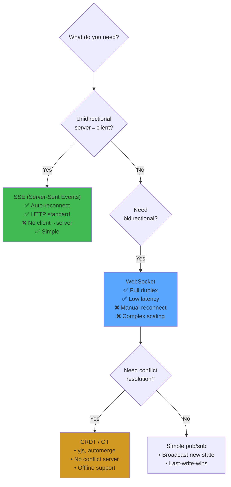

# Real-Time Systems in React

## WHAT
Real-time features — live cursors, instant messaging, collaborative editing, live dashboards — built with SSE, WebSockets, and CRDTs.

## WHY
Users expect real-time: Google Docs (collaborative editing), Figma (multiplayer design), Slack (instant messages), Notion (live presence).

## PROTOCOL CHOICE



## SSE IMPLEMENTATION

```typescript
"use client";
import { useEffect, useState, useCallback } from 'react';

function useSSE<T>(url: string): {
  data: T | null;
  error: Error | null;
  isConnected: boolean;
} {
  const [data, setData] = useState<T | null>(null);
  const [error, setError] = useState<Error | null>(null);
  const [isConnected, setIsConnected] = useState(false);

  useEffect(() => {
    const eventSource = new EventSource(url);

    eventSource.onopen = () => setIsConnected(true);
    eventSource.onerror = () => {
      setIsConnected(false);
      setError(new Error('SSE connection lost'));
      // EventSource auto-reconnects
    };

    eventSource.onmessage = (event) => {
      try {
        setData(JSON.parse(event.data));
        setError(null);
      } catch (e) {
        setError(e as Error);
      }
    };

    return () => {
      eventSource.close();
      setIsConnected(false);
    };
  }, [url]);

  return { data, error, isConnected };
}

// Usage: live stock ticker
function StockTicker({ symbol }: { symbol: string }) {
  const { data, isConnected } = useSSE<{ price: number; change: number }>(
    `/api/stocks/${symbol}/stream`
  );

  return (
    <div className={`ticker ${isConnected ? 'connected' : 'disconnected'}`}>
      <h3>{symbol}</h3>
      {data ? (
        <>
          <span className="price">${data.price.toFixed(2)}</span>
          <span className={`change ${data.change >= 0 ? 'up' : 'down'}`}>
            {data.change >= 0 ? '+' : ''}{data.change.toFixed(2)}%
          </span>
        </>
      ) : (
        <span className="loading">Connecting...</span>
      )}
    </div>
  );
}
```

## WEBSOCKET WITH RECONNECTION

```typescript
"use client";
import { useEffect, useRef, useState, useCallback } from 'react';

type WebSocketStatus = 'connecting' | 'connected' | 'disconnected';

function useWebSocket(url: string) {
  const [status, setStatus] = useState<WebSocketStatus>('disconnected');
  const wsRef = useRef<WebSocket | null>(null);
  const listenersRef = useRef<Set<(data: any) => void>>(new Set());
  const reconnectAttemptRef = useRef(0);

  const connect = useCallback(() => {
    setStatus('connecting');
    const ws = new WebSocket(url);
    wsRef.current = ws;

    ws.onopen = () => {
      setStatus('connected');
      reconnectAttemptRef.current = 0;
    };

    ws.onmessage = (event) => {
      try {
        const data = JSON.parse(event.data);
        listenersRef.current.forEach(fn => fn(data));
      } catch {}
    };

    ws.onclose = () => {
      setStatus('disconnected');
      // Exponential backoff: 1s, 2s, 4s, 8s ... max 30s
      const delay = Math.min(1000 * Math.pow(2, reconnectAttemptRef.current), 30000);
      reconnectAttemptRef.current++;
      setTimeout(connect, delay);
    };

    ws.onerror = () => ws.close();
  }, [url]);

  useEffect(() => {
    connect();
    return () => wsRef.current?.close();
  }, [connect]);

  const send = useCallback((data: object) => {
    if (wsRef.current?.readyState === WebSocket.OPEN) {
      wsRef.current.send(JSON.stringify(data));
    }
  }, []);

  const subscribe = useCallback((fn: (data: any) => void) => {
    listenersRef.current.add(fn);
    return () => listenersRef.current.delete(fn);
  }, []);

  return { status, send, subscribe };
}
```

## CRDT COLLABORATION

```typescript
// Collaborative text editing with yjs
"use client";
import { useEffect, useRef } from 'react';
import * as Y from 'yjs';
import { WebsocketProvider } from 'y-websocket';
import { QuillBinding } from 'y-quill';

function CollaborativeEditor({ docId }: { docId: string }) {
  const editorRef = useRef<HTMLDivElement>(null);

  useEffect(() => {
    // Yjs document — CRDT with automatic conflict resolution
    const doc = new Y.Doc();
    
    // WebSocket provider syncs via backend
    const provider = new WebsocketProvider(
      'wss://yjs.example.com',
      docId,
      doc
    );

    // Quill binding: yjs ↔ DOM editor
    const type = doc.getText('content');
    
    if (editorRef.current) {
      const quill = new Quill(editorRef.current);
      const binding = new QuillBinding(type, quill);
    }

    // Awareness: cursors, presence
    provider.awareness.setLocalState({
      name: localStorage.getItem('username'),
      color: getRandomColor(),
    });

    return () => {
      provider.disconnect();
      doc.destroy();
    };
  }, [docId]);

  return <div ref={editorRef} />;
}
```

## LIVE PRESENCE (WHO'S ONLINE)

```typescript
"use client";
import { useSyncExternalStore, useCallback } from 'react';

// Simple presence store using WebSocket
function createPresenceStore(ws: ReturnType<typeof useWebSocket>) {
  let presence = new Map<string, { name: string; lastSeen: number }>();

  ws.subscribe((data) => {
    if (data.type === 'presence') {
      presence.set(data.userId, {
        name: data.name,
        lastSeen: Date.now(),
      });
      // Clean up stale entries (>30s)
      for (const [id, user] of presence) {
        if (Date.now() - user.lastSeen > 30000) presence.delete(id);
      }
    }
  });

  return {
    subscribe: (callback: () => void) => {
      const interval = setInterval(callback, 1000);
      return () => clearInterval(interval);
    },
    getSnapshot: () => new Map(presence),
  };
}

function PresenceAvatars() {
  // Subscribe to external store without re-render overhead
  const presence = useSyncExternalStore(
    presenceStore.subscribe,
    presenceStore.getSnapshot,
  );

  return (
    <div className="presence-avatars">
      {Array.from(presence.values()).map(user => (
        <div key={user.name} className="avatar" title={user.name}>
          {user.name[0]}
        </div>
      ))}
    </div>
  );
}
```

## INTERVIEW QUESTIONS

**Senior**: Design a live cursor feature showing 100+ users' cursors simultaneously. How do you handle performance when every cursor move triggers a render?
**Staff**: Design a real-time collaborative whiteboard (like Figma). How do you handle: CRDT for shapes, undo/redo across users, 1000+ objects, and offline edits?
