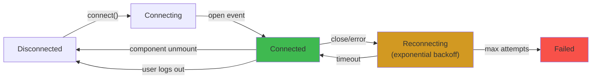

# WebSockets in React

## WHAT
WebSocket architecture patterns for React: connection lifecycle, reconnection, scaling, integration with state management.

## WHY
WebSockets enable **bidirectional, low-latency** communication. Critical for: chat, live dashboards, multiplayer, collaborative editing, real-time notifications.

## CONNECTION LIFECYCLE



## PRODUCTION WEBSOCKET HOOK

```typescript
"use client";
import { useEffect, useRef, useState, useCallback } from 'react';

type ConnectionStatus = 'connecting' | 'connected' | 'disconnected' | 'failed';

interface UseWebSocketOptions {
  url: string;
  maxRetries?: number;
  heartbeatInterval?: number; // ms — sends ping
  onMessage?: (data: unknown) => void;
}

export function useProductionWebSocket({
  url,
  maxRetries = 10,
  heartbeatInterval = 30000,
  onMessage,
}: UseWebSocketOptions) {
  const [status, setStatus] = useState<ConnectionStatus>('disconnected');
  const ws = useRef<WebSocket | null>(null);
  const retries = useRef(0);
  const heartbeatTimer = useRef<ReturnType<typeof setInterval>>();
  const mounted = useRef(true);

  const connect = useCallback(() => {
    if (!mounted.current) return;
    setStatus('connecting');

    const socket = new WebSocket(url);
    ws.current = socket;

    socket.onopen = () => {
      if (!mounted.current) return socket.close();
      setStatus('connected');
      retries.current = 0;

      // Heartbeat — detect silent disconnects
      heartbeatTimer.current = setInterval(() => {
        if (socket.readyState === WebSocket.OPEN) {
          socket.send(JSON.stringify({ type: 'ping' }));
        }
      }, heartbeatInterval);
    };

    socket.onmessage = (event) => {
      try {
        const data = JSON.parse(event.data);
        if (data.type === 'pong') return; // Ignore heartbeat response
        onMessage?.(data);
      } catch {}
    };

    socket.onclose = () => {
      clearInterval(heartbeatTimer.current);
      if (!mounted.current) return;
      setStatus('disconnected');
      scheduleReconnect();
    };

    socket.onerror = () => socket.close();
  }, [url, heartbeatInterval, onMessage]);

  const scheduleReconnect = useCallback(() => {
    if (retries.current >= maxRetries) {
      setStatus('failed');
      return;
    }

    retries.current++;
    // Exponential backoff: 1s, 2s, 4s, 8s, 16s, 30s (cap)
    const delay = Math.min(1000 * Math.pow(2, retries.current - 1), 30000);
    setTimeout(connect, delay);
  }, [maxRetries, connect]);

  useEffect(() => {
    mounted.current = true;
    connect();
    return () => {
      mounted.current = false;
      clearInterval(heartbeatTimer.current);
      ws.current?.close();
    };
  }, [connect]);

  const send = useCallback((data: object) => {
    if (ws.current?.readyState === WebSocket.OPEN) {
      ws.current.send(JSON.stringify(data));
    }
  }, []);

  return { status, send };
}
```

## INTEGRATION WITH STATE MANAGEMENT

```typescript
// Zustand store + WebSocket sync
import { create } from 'zustand';

interface ChatStore {
  messages: Message[];
  isConnected: boolean;
  sendMessage: (text: string) => void;
  connect: () => void;
}

const useChatStore = create<ChatStore>((set, get) => ({
  messages: [],
  isConnected: false,

  connect: () => {
    const ws = new WebSocket('wss://chat.example.com');

    ws.onopen = () => set({ isConnected: true });

    ws.onmessage = (event) => {
      const data = JSON.parse(event.data);
      if (data.type === 'message') {
        set(state => ({
          messages: [...state.messages, data.payload],
        }));
      }
    };

    ws.onclose = () => set({ isConnected: false });

    // Store ws reference for sending
    (window as any).__ws = ws;
  },

  sendMessage: (text: string) => {
    const ws = (window as any).__ws;
    if (ws?.readyState === WebSocket.OPEN) {
      ws.send(JSON.stringify({ type: 'message', payload: { text, timestamp: Date.now() } }));
    }
  },
}));

function ChatApp() {
  const { messages, isConnected, sendMessage, connect } = useChatStore();

  useEffect(() => { connect(); }, []);

  return (
    <div>
      <div className={`status ${isConnected ? 'online' : 'offline'}`} />
      {messages.map(msg => <ChatBubble key={msg.timestamp} message={msg} />)}
      <ChatInput onSend={sendMessage} />
    </div>
  );
}
```

## SCALING WEBSOCKETS

```mermaid
graph TB
    subgraph "Client"
        C1["Client"] --> C2["Client"]
    end
    subgraph "Edge (Load Balancer)"
        LB["WebSocket-aware<br/>Load Balancer<br/>HAProxy / Nginx"] --> |"Sticky sessions"| W1
        LB --> W2
    end
    subgraph "Server"
        W1["WS Server 1"] --> PUB["Redis Pub/Sub"]
        W2["WS Server 2"][WS Server 2] --> PUB
        PUB --> W1
        PUB --> W2
    end
    subgraph "Backend"
        W1 --> API["REST API"]
        W2 --> API
    end
    style LB fill:#d29922
    style PUB fill:#58a6ff
```

## EDGE CASES

| Scenario | Behavior | Fix |
|---|---|---|
| **Silent disconnect** (kill -9) | No close event — stale "connected" state | Heartbeat ping/pong |
| **Mobile network switch** (WiFi→5G) | Connection drops, no immediate close | Exponential backoff reconnect |
| **Rate limiting** | Server closes with 1008 status | Respect `Retry-After` header |
| **Message ordering** | Out-of-order delivery | Sequence numbers + buffer |
| **Large messages** (>1MB) | Connection may close | Chunk or compress |

## INTERVIEW QUESTIONS

**Senior**: Design a WebSocket-based chat app for 10K concurrent users. How do you handle reconnection, message ordering, and scaling across servers?
**Staff**: Your WebSocket connection drops silent for 5 minutes due to a network partition. The server has new messages. How do you ensure no messages are lost and order is preserved?
