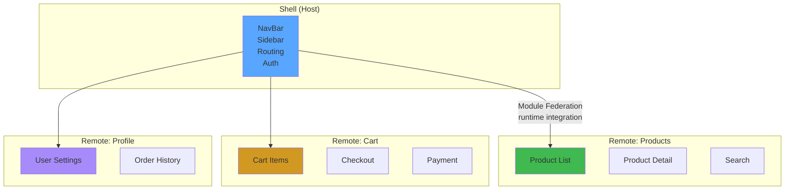

# Microfrontends with Module Federation

## WHAT
Microfrontends decompose a frontend monolith into **independently deployed** apps that compose into a single UX — each owned by a separate team.

## WHY
Monolith problems: team coupling (one CI pipeline), technology lock-in, scaling friction (50 devs on same repo). Microfrontends solve: independent deploy, tech diversity, team autonomy.

## ARCHITECTURE



## WEBPACK MODULE FEDERATION

```typescript
// host/webpack.config.js — Shell app
const { ModuleFederationPlugin } = require('webpack').container;

module.exports = {
  plugins: [
    new ModuleFederationPlugin({
      name: 'host',
      remotes: {
        products: 'products@http://localhost:3001/remoteEntry.js',
        cart: 'cart@http://localhost:3002/remoteEntry.js',
      },
      shared: {
        react: { singleton: true, requiredVersion: '^18.0.0' },
        'react-dom': { singleton: true, requiredVersion: '^18.0.0' },
        'react-router-dom': { singleton: true },
      },
    }),
  ],
};
```

```typescript
// remote/webpack.config.js — Products app
const { ModuleFederationPlugin } = require('webpack').container;

module.exports = {
  plugins: [
    new ModuleFederationPlugin({
      name: 'products',
      filename: 'remoteEntry.js',
      exposes: {
        './ProductList': './src/ProductList',
        './ProductDetail': './src/ProductDetail',
      },
      shared: {
        react: { singleton: true, requiredVersion: '^18.0.0' },
      },
    }),
  ],
};
```

```typescript
// host/src/App.tsx — Lazy load remotes
import { lazy, Suspense } from 'react';

const ProductList = lazy(() => import('products/ProductList'));
const Cart = lazy(() => import('cart/Cart'));

function App() {
  return (
    <Suspense fallback={<ShellSkeleton />}>
      <NavBar />
      <ProductList />
      <Cart />
    </Suspense>
  );
}
```

## RUNTIME INTEGRATION

```typescript
// Dynamic remote loading (not build-time)
"use client";
import { useEffect, useState, ComponentType } from 'react';

export function useRemoteComponent(url: string, scope: string, module: string) {
  const [Component, setComponent] = useState<ComponentType | null>(null);
  const [error, setError] = useState<Error | null>(null);

  useEffect(() => {
    async function load() {
      try {
        // Load remote entry script
        await loadScript(`${url}/remoteEntry.js`);
        
        // Get module from federated container
        const container = (window as any)[scope];
        await container.init(__webpack_share_scopes__.default);
        const factory = await container.get(module);
        setComponent(() => factory());
      } catch (e) {
        setError(e as Error);
      }
    }
    load();
  }, [url, scope, module]);

  return { Component, error };
}
```

## CROSS-CUTTING CONCERNS

### Shared Auth

```typescript
// Auth token shared via custom event bus
// host sends: window.dispatchEvent(new CustomEvent('auth', { detail: token }))

// remote listens:
useEffect(() => {
  const handler = (e: CustomEvent) => setToken(e.detail);
  window.addEventListener('auth', handler as EventListener);
  return () => window.removeEventListener('auth', handler as EventListener);
}, []);
```

### Navigation Between Apps

```typescript
// host exposes navigation function via global
window.__navigate = (path: string) => {
  window.dispatchEvent(new CustomEvent('navigate', { detail: path }));
};

// remote navigates:
function RemoteLink({ to, children }: { to: string; children: React.ReactNode }) {
  return (
    <a href={to} onClick={(e) => {
      e.preventDefault();
      window.__navigate?.(to);
    }}>
      {children}
    </a>
  );
}
```

## TRADE-OFFS

| Pro | Con |
|---|---|
| Independent deployments | Bundle size (shared deps duplicated) |
| Team autonomy | Runtime integration complexity |
| Tech diversity | Version mismatch (multiple React versions) |
| Scale horizontally | Testing across apps |
| Incremental adoption | Shared design system sync |

## PRODUCTION USAGE

- **IKEA**: 50+ microfrontends, team per product area
- **Zalando**: 200+ frontend modules, Garage project
- **Spotify**: Squad-aligned microfrontends
- **Upwork**: Module federation for team isolation

## INTERVIEW QUESTIONS

**Senior**: What happens when Remote A and Remote B use different React versions? How do you handle this?
**Staff**: Design a microfrontend architecture for a SaaS platform with 20 teams. How do you share: auth, navigation, design system, analytics? How do you ensure a bad deploy from one team doesn't crash the entire shell?
