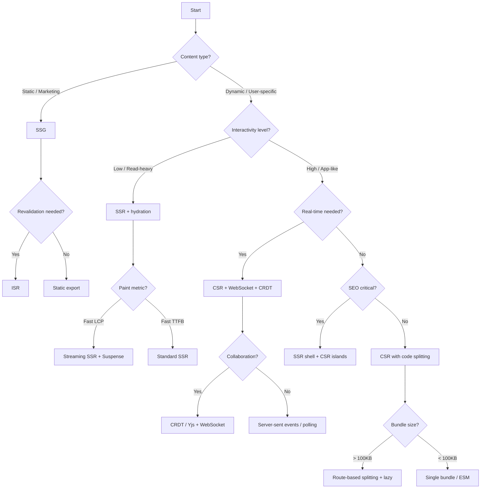

# Frontend System Design

## What Is Frontend System Design

Frontend system design is the practice of architecting large-scale web applications. Unlike algorithmic interviews (which test data structures) or component design (which tests UI implementation), system design evaluates your ability to reason about the full frontend stack: networking, rendering, state management, caching, performance budgets, and failure modes.

Examples of frontend system design questions:

| Application | Core Challenge |
|---|---|
| YouTube | Video streaming, infinite scroll, search with debounce |
| ChatGPT | Streaming tokens, conversation history, markdown rendering |
| Figma | WebGL canvas, CRDT multiplayer, undo/redo, layer trees |
| Netflix | SSR landing, profile switching, offline downloads via SW |
| Google Docs | OT/CRDT, cursor sync, rich text model, offline editing |

## Why System Design Interviews

System design interviews exist because:

- **Architectural thinking** — can you design for scale before writing a single line of code?
- **Tradeoff awareness** — every decision (CSR vs SSR, client cache vs server state) involves tradeoffs. Interviewers want to hear you reason about them.
- **Cross-boundary knowledge** — frontend architecture touches CDNs, API gateways, auth, WebSockets, and service workers. You need to speak fluently across these layers.
- **Seniority signal** — senior engineers don't just implement tickets; they define the technical direction. Design interviews are the proxy for that skill.

## Framework: 7-Step Repeatable Process

### Step 1: Requirements Gathering

**Functional requirements** capture what the app does. Ask clarifying questions:

- What are the primary user actions? (e.g., Watch Video, Search, Comment)
- Is there authentication? Multi-user collaboration?
- Does it need real-time features? (WebSockets, SSE, WebRTC)
- Should it work offline? (Service Worker, IndexedDB)

**Non-functional requirements** capture how well the app performs:

- Target Core Web Vitals: LCP < 2.5s, TBT < 200ms, CLS < 0.1
- Bundle budget: 100KB initial (gzipped), 500KB total (gzipped)
- Availability: 99.9% uptime SLA
- Internationalization: RTL support, locale-based content
- Accessibility: WCAG 2.1 AA compliance
- Device support: mobile-first, tablet, desktop

### Step 2: API Design

Define the contract between frontend and backend. Choose REST, GraphQL, or both depending on requirements.

#### REST Example — YouTube-like API

```typescript
// Videos
GET    /api/videos?page=1&limit=20&sort=trending
GET    /api/videos/:id
POST   /api/videos/:id/comments
DELETE /api/videos/:id/comments/:commentId

// Search
GET    /api/search?q=query&page=1&filter=video

// User
GET    /api/users/:id/history
POST   /api/users/:id/likes/:videoId

// Streaming
GET    /api/videos/:id/stream?quality=720p&range=bytes=0-
```

#### GraphQL Example — ChatGPT-like API

```graphql
type Conversation {
  id: ID!
  title: String!
  messages: [Message!]!
  createdAt: DateTime!
}

type Message {
  id: ID!
  role: "user" | "assistant"
  content: String!
  streaming: Boolean!
  createdAt: DateTime!
}

type Query {
  conversations(limit: Int, offset: Int): [Conversation!]!
  conversation(id: ID!): Conversation
}

type Mutation {
  sendMessage(conversationId: ID!, content: String!): Message!
  createConversation(title: String!): Conversation!
}

type Subscription {
  messageStream(conversationId: ID!): Message!
}
```

### Step 3: Component Tree

Split components into **containers** (stateful, connected to data layer) and **presentational** (pure, receives props).

#### YouTube Homepage Component Tree

```
<App>
  <AppProviders>
    <Router>
      <Header>
        <SearchBar />          // container — manages debounced input
        <UserMenu />           // container — auth state
      </Header>
      <Sidebar>
        <NavSection />         // presentational
        <SubscriptionsList />  // container — fetches user subs
      </Sidebar>
      <main>
        <VideoFeed>            // container — infinite scroll, data fetching
          <VideoCard />        // presentational
          <VideoCard />
          <InfiniteScrollTrigger />  // presentational — IntersectionObserver
        </VideoFeed>
      </main>
    </Router>
  </AppProviders>
</App>
```

#### ChatGPT Conversation Component Tree

```
<App>
  <AppProviders>
    <Sidebar>
      <ConversationList />     // container — fetches history
        <ConversationItem />   // presentational
      <NewChatButton />
    </Sidebar>
    <main>
      <ChatWindow>
        <MessageList>          // container — manages streaming state
          <Message />          // presentational — renders markdown/code
          <StreamingMessage /> // container — handles token append
        </MessageList>
        <InputArea>            // container — manages composition
          <PromptInput />      // presentational
          <SendButton />
        </InputArea>
      </ChatWindow>
    </main>
  </AppProviders>
</App>
```

### Step 4: Data Flow

Define three state categories:

| State Type | Examples | Storage |
|---|---|---|
| Server state | Video metadata, comments, search results | React Query / SWR / RTK Query |
| Client state | UI toggles, form input, scroll position | Zustand / Jotai / Context |
| URL state | Route params, search query, page number | React Router / Next.js router |

#### Server State Pattern (React Query)

```typescript
import { useInfiniteQuery } from '@tanstack/react-query';

function useVideoFeed() {
  return useInfiniteQuery({
    queryKey: ['videos', 'feed'],
    queryFn: ({ pageParam = 1 }) =>
      fetch(`/api/videos?page=${pageParam}&limit=20`).then(r => r.json()),
    getNextPageParam: (lastPage) => lastPage.nextPage ?? undefined,
    staleTime: 30_000,        // consider fresh for 30s
    gcTime: 5 * 60_000,       // keep in cache for 5 min
    refetchOnWindowFocus: false,
  });
}
```

#### Client State Pattern (Zustand)

```typescript
import { create } from 'zustand';

interface PlayerStore {
  isPlaying: boolean;
  currentTime: number;
  volume: number;
  play: () => void;
  pause: () => void;
  seek: (time: number) => void;
  setVolume: (volume: number) => void;
}

const usePlayerStore = create<PlayerStore>((set) => ({
  isPlaying: false,
  currentTime: 0,
  volume: 0.8,
  play: () => set({ isPlaying: true }),
  pause: () => set({ isPlaying: false }),
  seek: (time) => set({ currentTime: time }),
  setVolume: (volume) => set({ volume }),
}));
```

#### Optimistic Updates

```typescript
import { useMutation, useQueryClient } from '@tanstack/react-query';

function useAddComment(videoId: string) {
  const queryClient = useQueryClient();

  return useMutation({
    mutationFn: (text: string) =>
      fetch(`/api/videos/${videoId}/comments`, {
        method: 'POST',
        body: JSON.stringify({ text }),
      }).then(r => r.json()),
    onMutate: async (newComment) => {
      await queryClient.cancelQueries({ queryKey: ['comments', videoId] });
      const previous = queryClient.getQueryData(['comments', videoId]);

      queryClient.setQueryData(['comments', videoId], (old: any) => ({
        ...old,
        pages: old.pages.map((page: any, i: number) =>
          i === 0 ? { ...page, items: [{ text: newComment, optimistic: true }, ...page.items] } : page
        ),
      }));

      return { previous };
    },
    onError: (err, vars, context) => {
      queryClient.setQueryData(['comments', videoId], context?.previous);
    },
    onSettled: () => {
      queryClient.invalidateQueries({ queryKey: ['comments', videoId] });
    },
  });
}
```

### Step 5: Rendering Strategy

Choose based on content type and interactivity requirements.

| Strategy | Use Case | Tradeoff |
|---|---|---|
| **CSR** (Client-Side) | Highly interactive dashboards | Slow first paint (empty HTML) |
| **SSR** (Server-Side) | Content-rich landing pages | Higher server cost, TTFB slower |
| **SSG** (Static Generation) | Marketing pages, blogs | No dynamic data per request |
| **ISR** (Incremental Static) | Large catalogs (e-commerce) | Stale data until revalidation |
| **RSC** (React Server Components) | Mixed interactive + static | Framework lock-in (Next.js) |

#### SSR Example — Netflix Landing Page (Next.js App Router)

```typescript
// app/page.tsx
export default async function HomePage() {
  const data = await fetch('https://api.netflix.com/browse', {
    next: { revalidate: 300 },
  });
  const { featured, rows } = await data.json();

  return (
    <main>
      <HeroBanner video={featured} />
      {rows.map((row) => (
        <ContentRow key={row.id} title={row.title} items={row.items} />
      ))}
    </main>
  );
}
```

#### Streaming SSR with Suspense

```typescript
// app/browse/page.tsx
import { Suspense } from 'react';

export default function BrowsePage() {
  return (
    <main>
      <Navbar />
      <Suspense fallback={<HeroSkeleton />}>
        <HeroSection />    {/* streamed in when ready */}
      </Suspense>
      <Suspense fallback={<RowSkeleton />}>
        <TrendingRow />
      </Suspense>
      <Suspense fallback={<RowSkeleton />}>
        <ContinueWatching />
      </Suspense>
    </main>
  );
}
```

### Step 6: Performance Budget

Define measurable targets and enforce them in CI.

```javascript
// budo.config.js or lighthouse CI config
module.exports = {
  budgets: [
    {
      path: '/',
      resourceSizes: [
        { resourceType: 'script', budget: 100 * 1024 }, // 100KB JS
        { resourceType: 'stylesheet', budget: 10 * 1024 }, // 10KB CSS
      ],
      resourceCounts: [
        { resourceType: 'third-party', budget: 5 },
      ],
      timings: [
        { metric: 'interactive', budget: 2500 },
        { metric: 'first-contentful-paint', budget: 1500 },
      ],
    },
  ],
};
```

#### Code Splitting

**Route-based splitting** (recommended):

```typescript
import { lazy, Suspense } from 'react';
import { createBrowserRouter } from 'react-router-dom';

const HomePage = lazy(() => import('./pages/Home'));
const VideoPage = lazy(() => import('./pages/Video'));
const SearchResults = lazy(() => import('./pages/Search'));

export const router = createBrowserRouter([
  {
    path: '/',
    element: <Suspense fallback={<PageSkeleton />}><HomePage /></Suspense>,
  },
  {
    path: '/watch/:id',
    element: <Suspense fallback={<VideoSkeleton />}><VideoPage /></Suspense>,
  },
  {
    path: '/search',
    element: <Suspense fallback={<SearchSkeleton />}><SearchResults /></Suspense>,
  },
]);
```

**Component-based splitting** (heavy third-party libs):

```typescript
import { lazy, Suspense } from 'react';

const MarkdownEditor = lazy(() => import('./MarkdownEditor'));
const CodeHighlighter = lazy(() => import('./CodeHighlighter'));

function MessageContent({ text, language }: Props) {
  return (
    <Suspense fallback={<PlainText text={text} />}>
      {language
        ? <CodeHighlighter code={text} language={language} />
        : <MarkdownEditor content={text} />}
    </Suspense>
  );
}
```

#### Virtualization

Virtualized list skeleton — only render visible rows:

```typescript
import { useRef, useState, useEffect, useCallback } from 'react';

interface VirtualListProps<T> {
  items: T[];
  itemHeight: number;
  overscan?: number;
  renderItem: (item: T, index: number) => React.ReactNode;
}

function VirtualList<T>({ items, itemHeight, overscan = 3, renderItem }: VirtualListProps<T>) {
  const containerRef = useRef<HTMLDivElement>(null);
  const [scrollTop, setScrollTop] = useState(0);
  const [containerHeight, setContainerHeight] = useState(0);

  useEffect(() => {
    if (!containerRef.current) return;
    const observer = new ResizeObserver(([entry]) => {
      setContainerHeight(entry.contentRect.height);
    });
    observer.observe(containerRef.current);
    return () => observer.disconnect();
  }, []);

  const handleScroll = useCallback(() => {
    if (containerRef.current) {
      setScrollTop(containerRef.current.scrollTop);
    }
  }, []);

  const totalHeight = items.length * itemHeight;
  const startIndex = Math.max(0, Math.floor(scrollTop / itemHeight) - overscan);
  const endIndex = Math.min(
    items.length,
    Math.ceil((scrollTop + containerHeight) / itemHeight) + overscan
  );

  const visibleItems = items.slice(startIndex, endIndex);

  return (
    <div
      ref={containerRef}
      onScroll={handleScroll}
      style={{ height: '100%', overflowY: 'auto', position: 'relative' }}
    >
      <div style={{ height: totalHeight, position: 'relative' }}>
        {visibleItems.map((item, i) => (
          <div
            key={(item as any).id ?? i}
            style={{
              position: 'absolute',
              top: (startIndex + i) * itemHeight,
              height: itemHeight,
              width: '100%',
            }}
          >
            {renderItem(item, startIndex + i)}
          </div>
        ))}
      </div>
    </div>
  );
}
```

#### Prefetching Strategy

```typescript
function SearchBar() {
  const [query, setQuery] = useState('');
  const queryClient = useQueryClient();

  // Debounced search
  const debouncedQuery = useDebounce(query, 300);

  const { data } = useQuery({
    queryKey: ['search', debouncedQuery],
    queryFn: () => fetch(`/api/search?q=${debouncedQuery}`).then(r => r.json()),
    enabled: debouncedQuery.length > 2,
  });

  // Prefetch popular results on hover
  const prefetchResults = useCallback((term: string) => {
    queryClient.prefetchQuery({
      queryKey: ['search', term],
      queryFn: () => fetch(`/api/search?q=${term}`).then(r => r.json()),
      staleTime: 60_000,
    });
  }, [queryClient]);

  return (
    <div className="search-container">
      <input
        type="text"
        value={query}
        onChange={(e) => setQuery(e.target.value)}
        placeholder="Search..."
        aria-label="Search"
      />
      {data && (
        <SearchDropdown
          results={data}
          onHover={(term: string) => prefetchResults(term)}
        />
      )}
    </div>
  );
}

// IntersectionObserver-based prefetch for infinite scroll
function InfiniteScrollTrigger({ onVisible }: { onVisible: () => void }) {
  const ref = useRef<HTMLDivElement>(null);

  useEffect(() => {
    if (!ref.current) return;
    const observer = new IntersectionObserver(
      ([entry]) => {
        if (entry.isIntersecting) {
          onVisible();
        }
      },
      { rootMargin: '200px' }
    );
    observer.observe(ref.current);
    return () => observer.disconnect();
  }, [onVisible]);

  return <div ref={ref} style={{ height: 1 }} />;
}
```

### Step 7: Edge Cases & Failure Modes

| Scenario | Mitigation |
|---|---|
| Network offline | Service worker with stale-while-revalidate, IndexedDB cache |
| API rate limiting | Exponential backoff, retry queues, fallback UI |
| Memory leaks on long sessions | Virtualization, pagination, periodic cache GC |
| Race conditions (search) | AbortController, debounce, request deduplication |
| Large datasets (>10K items) | Windowed rendering, server-side pagination |
| Janky animations on low-end devices | `will-change` hints, GPU compositing, reduced motion media query |

```typescript
// Race condition guard with AbortController
function useSearch() {
  const [query, setQuery] = useState('');
  const debouncedQuery = useDebounce(query, 300);

  return useQuery({
    queryKey: ['search', debouncedQuery],
    queryFn: async ({ signal }) => {
      const response = await fetch(`/api/search?q=${debouncedQuery}`, { signal });
      if (!response.ok) throw new Error('Search failed');
      return response.json();
    },
    enabled: debouncedQuery.length > 2,
  });
}
```

## Key Discussions per App Type

### YouTube

**Infinite scroll** — use IntersectionObserver to detect when user nears bottom. Fetch next page via `useInfiniteQuery`. Avoid scroll position loss on navigation (save to sessionStorage or URL state).

```typescript
function VideoFeed() {
  const { data, fetchNextPage, hasNextPage, isFetchingNextPage } = useVideoFeed();

  return (
    <div>
      {data?.pages.map((page) =>
        page.videos.map((video: Video) => (
          <VideoCard key={video.id} video={video} />
        ))
      )}
      <InfiniteScrollTrigger
        onVisible={() => {
          if (hasNextPage && !isFetchingNextPage) fetchNextPage();
        }}
      />
      {isFetchingNextPage && <LoadingSpinner />}
    </div>
  );
}
```

**Video player** — use `<video>` element with HLS.js or native MSE. Handle quality switching, buffering states, and picture-in-picture.

**Comment threading** — nested replies with depth limit. Load top-level comments first, lazy-load replies on expand. Optimistic updates on post.

**Search debouncing** — 300ms debounce with `AbortSignal` to cancel stale requests.

**SSR vs CSR for first paint** — SSR the video metadata and `<meta>` tags for SEO/OG. Defer the player bundle (heavy) to hydrate client-side. Use streaming SSR to get the shell out fast.

### ChatGPT

**Streaming response** — use `ReadableStream` + `useEffect` to append tokens as they arrive.

```typescript
async function* streamResponse(url: string, body: object) {
  const response = await fetch(url, {
    method: 'POST',
    headers: { 'Content-Type': 'application/json' },
    body: JSON.stringify(body),
  });

  const reader = response.body!.getReader();
  const decoder = new TextDecoder();

  while (true) {
    const { done, value } = await reader.read();
    if (done) break;
    yield decoder.decode(value, { stream: true });
  }
}

function useStreamingMessage() {
  const [content, setContent] = useState('');
  const [isStreaming, setIsStreaming] = useState(false);

  const sendMessage = useCallback(async (text: string) => {
    setIsStreaming(true);
    setContent('');

    for await (const chunk of streamResponse('/api/chat', { message: text })) {
      setContent((prev) => prev + chunk);
    }

    setIsStreaming(false);
  }, []);

  return { content, isStreaming, sendMessage };
}
```

**Token rendering** — render in chunks to avoid blocking the main thread. Use `requestIdleCallback` or microtask scheduling for large messages.

**Conversation history** — paginate with `limit/offset`. Keep active conversation in memory. Persist to localStorage/IndexedDB for crash recovery.

**Markdown rendering + code highlighting** — lazy-load a markdown parser (`react-markdown`) and a highlighter (`prism-react-renderer`). Code-split both since they're large.

### Figma

**WebGL canvas** — use PixiJS or raw WebGL2 for rendering vector shapes. Avoid DOM for the canvas layer. Only sync minimal state to the DOM (toolbar, layer panel).

**CRDT for multiplayer** — use Yjs or automerge. Each operation is a position-based insert/delete. Avoid OT complexity — CRDTs converge without a central server.

```typescript
import * as Y from 'yjs';
import { WebsocketProvider } from 'y-websocket';

const doc = new Y.Doc();
const wsProvider = new WebsocketProvider('wss://figma-sync.example.com', 'document-id', doc);

const shapes = doc.getMap('shapes');

function addShape(shape: Shape) {
  const id = crypto.randomUUID();
  shapes.set(id, shape);
  // CRDT propagates to all peers automatically
}

function updateShape(id: string, patch: Partial<Shape>) {
  const existing = shapes.get(id);
  if (existing) {
    shapes.set(id, { ...existing, ...patch });
  }
}
```

**Undo/redo with command pattern** — each user action is a Command object with `execute()` and `undo()`. Store commands in a stack. Clear redo stack on new action after undo.

```typescript
interface Command {
  execute(): void;
  undo(): void;
}

class MoveShapeCommand implements Command {
  constructor(private shapeId: string, private delta: Vec2, private shapeMap: Y.Map<Shape>) {}

  execute() {
    const shape = this.shapeMap.get(this.shapeId);
    if (shape) {
      this.shapeMap.set(this.shapeId, {
        ...shape,
        x: shape.x + this.delta.x,
        y: shape.y + this.delta.y,
      });
    }
  }

  undo() {
    const shape = this.shapeMap.get(this.shapeId);
    if (shape) {
      this.shapeMap.set(this.shapeId, {
        ...shape,
        x: shape.x - this.delta.x,
        y: shape.y - this.delta.y,
      });
    }
  }
}

class CommandManager {
  private undoStack: Command[] = [];
  private redoStack: Command[] = [];

  execute(command: Command) {
    command.execute();
    this.undoStack.push(command);
    this.redoStack = []; // invalidate redo on new action
  }

  undo() {
    const command = this.undoStack.pop();
    if (command) {
      command.undo();
      this.redoStack.push(command);
    }
  }

  redo() {
    const command = this.redoStack.pop();
    if (command) {
      command.execute();
      this.undoStack.push(command);
    }
  }
}
```

**Layer tree virtualization** — a Figma document can have thousands of layers. Virtualize the layer panel using the same pattern shown above. Only render visible layer items + an overscan buffer.

### Netflix

**SSR for landing** — server-render the hero banner and content rows. Use Next.js App Router with streaming SSR. The initial HTML contains the hero image URL and row titles, improving LCP.

**Profile switching** — client-only route change. Keep profile context in a React Context or Zustand store. Prefetch the selected profile's data on click (before navigation resolves).

**Asset loading strategy** — prioritize hero video/image above the fold. Lazy-load row content using IntersectionObserver. Use `<link rel="preload">` for the hero poster.

```html
<link rel="preload" href="/hero-banner.webp" as="image" />
<link rel="preload" href="/fonts/netflix-sans.woff2" as="font" crossorigin />
```

**Service worker for offline downloads**:

```typescript
// sw.ts
self.addEventListener('install', (event) => {
  event.waitUntil(self.skipWaiting());
});

self.addEventListener('activate', (event) => {
  event.waitUntil(self.clients.claim());
});

// Cache video assets for offline playback
self.addEventListener('message', (event) => {
  if (event.data.type === 'CACHE_VIDEO') {
    const { url, metadata } = event.data;
    caches.open('video-cache').then((cache) => {
      cache.add(url);
      // Store metadata in IndexedDB for UI
    });
  }
});
```

### Google Docs

**OT/CRDT** — Google Docs uses OT internally. For a modern implementation, use CRDT (Yjs). Each character is a unique ID with position. Edits insert/delete by position reference. Merges are automatic.

```typescript
import * as Y from 'yjs';

const doc = new Y.Doc();
const text = doc.getText('content');

// Bind to ProseMirror or Quill
import { yCollab } from 'y-prosemirror';
import { EditorState } from 'prosemirror-state';
import { EditorView } from 'prosemirror-view';

const prosemirrorBinding = yCollab(
  text,
  // ProseMirror schema and editor view
);
```

**Cursor sync** — broadcast cursor position (line, column, selection range) via WebSocket or Yjs awareness. Render remote cursors as colored blips in the editor.

```typescript
// y-websocket awareness for cursors
const awareness = wsProvider.awareness;

awareness.setLocalStateField('cursor', {
  line: currentLine,
  column: currentColumn,
  selection: { from, to },
  color: randomColor(),
  name: userName,
});

awareness.on('change', () => {
  const states = awareness.getStates();
  // Map remote cursors to overlay elements
  states.forEach((state, clientId) => {
    if (clientId !== doc.clientID) {
      renderRemoteCursor(clientId, state.cursor);
    }
  });
});
```

**Focus management** — when a remote user selects text, don't steal focus from local user. Track which user has "control" via a flag. On mobile, dismiss the soft keyboard when focus is not local.

**Rich text model** — Quill uses a Parchment (tree-based) model; ProseMirror uses a schema-validated tree. Both are better than contentEditable directly. Choose ProseMirror for documents requiring strict schema validation (headers, lists, images).

**Offline editing** — queue operations locally via Yjs. When the connection restores, Yjs syncs all queued operations automatically. Persist the Yjs document to IndexedDB for crash resilience.

```typescript
import { IndexeddbPersistence } from 'y-indexeddb';

const ydoc = new Y.Doc();
const persistence = new IndexeddbPersistence('doc-id', ydoc);

persistence.on('synced', () => {
  console.log('Document loaded from IndexedDB');
});

// Text changes are synced to IndexedDB automatically
```

## Non-Functional Requirements

### Bundle Size Budgets

| Resource | Budget (gzipped) | Strategy |
|---|---|---|
| Initial JS (route) | 100 KB | Code-split by route, tree-shake |
| Initial CSS | 10 KB | Purge unused, extract critical CSS inline |
| Fonts | 30 KB | Subset, `font-display: swap` |
| Images (above fold) | 100 KB | WebP/AVIF, responsive srcset |
| Total JS (all routes) | 500 KB | Monorepo module sharing |
| Third-party scripts | 1 request | Defer analytics, consolidate |

### Core Web Vitals Targets

| Metric | Target | Measurement |
|---|---|---|
| LCP (Largest Contentful Paint) | < 2.5s | Hero image/video load time |
| TBT (Total Blocking Time) | < 200ms | Main thread availability |
| CLS (Cumulative Layout Shift) | < 0.1 | Reserve space for dynamic content |
| FID (First Input Delay) | < 100ms | Event handler readiness |
| INP (Interaction to Next Paint) | < 200ms | Responsiveness to taps/clicks |

### Internationalization

```typescript
import { createInstance } from 'i18next';
import { initReactI18next } from 'react-i18next';

const i18n = createInstance();

i18n.use(initReactI18next).init({
  resources: {
    en: { translation: { search: 'Search', watch: 'Watch' } },
    es: { translation: { search: 'Buscar', watch: 'Ver' } },
    ja: { translation: { search: '検索', watch: '再生' } },
  },
  lng: navigator.language.split('-')[0],
  fallbackLng: 'en',
  interpolation: { escapeValue: false },
});

// Code-split translations per locale
const en = () => import('./locales/en.json');
const es = () => import('./locales/es.json');
```

### Accessibility

- All interactive elements must be keyboard-accessible
- Live regions (`aria-live="polite"`) for dynamic content (streaming tokens, search results)
- Focus trapping for modals and drawers
- Color contrast ratio > 4.5:1 for text
- Reduced motion media query for animations

```css
@media (prefers-reduced-motion: reduce) {
  *, *::before, *::after {
    animation-duration: 0.01ms !important;
    transition-duration: 0.01ms !important;
  }
}
```

## Performance Patterns

### Code Splitting

| Approach | When to Use |
|---|---|
| Route-based (`lazy()` per route) | Default for all SPAs |
| Component-based (`lazy()` per heavy component) | Rich text editors, code highlighters, charts |
| Library-based (`dynamic import()` of lib) | Moment.js locale, date-fns, lodash method |

### Prefetching

```typescript
// Declarative prefetch — browser-level
<link rel="prefetch" href="/watch/123" as="document" />
<link rel="preload" href="/hero-video.mp4" as="video" type="video/mp4" />

// Programmatic prefetch — on hover
function usePrefetchOnHover(url: string) {
  const ref = useRef<HTMLAnchorElement>(null);

  useEffect(() => {
    const el = ref.current;
    if (!el) return;

    const handleMouseEnter = () => {
      const link = document.createElement('link');
      link.rel = 'prefetch';
      link.href = url;
      link.as = 'document';
      document.head.appendChild(link);
    };

    el.addEventListener('mouseenter', handleMouseEnter);
    return () => el.removeEventListener('mouseenter', handleMouseEnter);
  }, [url]);

  return ref;
}
```

### Virtualization

Use `react-window` for homogeneous lists, `react-virtuoso` for variable-height items, and `@tanstack/react-virtual` for custom implementations.

```typescript
import { FixedSizeList } from 'react-window';

function CommentList({ comments }: { comments: Comment[] }) {
  return (
    <FixedSizeList
      height={600}
      itemCount={comments.length}
      itemSize={80}
      width="100%"
    >
      {({ index, style }) => (
        <div style={style}>
          <CommentItem comment={comments[index]} />
        </div>
      )}
    </FixedSizeList>
  );
}
```

### Progressive Enhancement

```typescript
function VideoPlayer({ src }: { src: string }) {
  const [supportsHLS, setSupportsHLS] = useState(
    typeof MediaSource !== 'undefined' && MediaSource.isTypeSupported('video/mp4; codecs="avc1.42E01E"')
  );

  return (
    <>
      {supportsHLS ? (
        <video controls>
          <source src={src} type="application/x-mpegURL" />
        </video>
      ) : (
        <a href={src} download>
          Download video (your browser does not support streaming)
        </a>
      )}
    </>
  );
}
```

## Architecture Decision Tree



## Interview Template: 45-Minute Walkthrough

| Time | Phase | What to Cover |
|---|---|---|
| **0–5 min** | Requirements | Ask clarifying questions. List functional + non-functional reqs. |
| **5–10 min** | API Design | Define endpoints or GraphQL schema. Discuss pagination, real-time needs. |
| **10–15 min** | Component Tree | Draw the component hierarchy. Label containers vs presentational. |
| **15–20 min** | Data Flow | Choose state management approach. Show cache invalidation strategy. |
| **20–25 min** | Rendering Strategy | Pick SSR/CSR/SSG. Justify with tradeoffs. |
| **25–30 min** | Performance Budget | Define targets. Show code splitting and prefetching patterns. |
| **30–35 min** | Edge Cases | Cover offline, loading states, error boundaries, race conditions. |
| **35–40 min** | Additional Deep Dive | Interviewer picks a topic (streaming, CRDT, security, i18n). |
| **40–45 min** | Summary + Q&A | Recap architecture. Ask interviewer for feedback. |

### Key Communication Tips

- **Narrate your decisions**. Don't just draw boxes — say "I chose CSR here because the dashboard has 40+ stateful widgets and SSR would add server cost without SEO benefit."
- **Acknowledge tradeoffs**. Every choice has a downside. Calling it out shows maturity: "SSR improves LCP but increases TTFB by ~200ms on slow networks."
- **Start broad, then dive deep**. Cover the full picture in 10 minutes, then let the interviewer guide you into specifics.
- **Use concrete numbers**. "We'll target a 100KB initial JS bundle" is better than "we'll keep the bundle small."
- **Draw the architecture**. Use the mermaid diagram as a reference. Draw boxes and arrows on the whiteboard / shared screen.

### Common Mistakes

| Mistake | Why It Hurts |
|---|---|
| Jumping to code too fast | Signals you haven't thought about tradeoffs |
| Ignoring non-functional reqs | Shows lack of production experience |
| Picking one framework dogmatically | Indicates inflexibility |
| Forgetting mobile perf | Most web traffic is mobile |
| No mention of error states | Implies you haven't dealt with production failures |
| Too much detail on one topic | You'll run out of time before covering the full picture |
