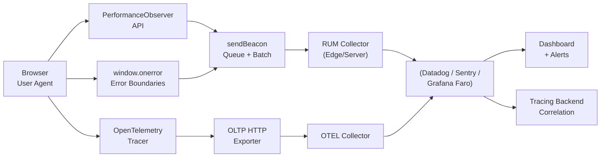

# Observability

## What & Why

Observability is the ability to understand a system's internal state from its external outputs. Monitoring tells you *what* broke; observability lets you ask *why* it broke without shipping new code.

Frontend observability matters because:

- **User-centric metrics**: Backend metrics (CPU, latency p99) don't capture janky UX, layout shifts, or broken interactions
- **Real-world vs synthetic**: Lab tests (Lighthouse) miss device diversity, network conditions, and geographic variance
- **Business impact**: 100ms slower load = 7% fewer conversions (Amazon); INP > 200ms correlates with higher bounce rates

Frontend observability answers: What did real users actually experience?

## RUM Architecture

Real User Monitoring captures every page load, interaction, and error from production users.

```javascript
// PerformanceObserver API — observe Core Web Vitals
const observer = new PerformanceObserver((list) => {
  for (const entry of list.getEntries()) {
    if (entry.entryType === 'largest-contentful-paint') {
      console.log('LCP:', entry.startTime);
      sendMetric('lcp', entry.startTime);
    }
    if (entry.entryType === 'first-input') {
      const fid = entry.processingStart - entry.startTime;
      console.log('FID:', fid);
      sendMetric('fid', fid);
    }
    if (entry.entryType === 'layout-shift') {
      if (!entry.hadRecentInput) {
        console.log('CLS:', entry.value);
        sendMetric('cls', entry.value);
      }
    }
  }
});

observer.observe({ type: 'largest-contentful-paint', buffered: true });
observer.observe({ type: 'first-input', buffered: true });
observer.observe({ type: 'layout-shift', buffered: true });
observer.observe({ type: 'navigation', buffered: true }); // TTFB
```

**sendBeacon batching** — non-blocking, survives page unload:

```javascript
const queue = [];
let scheduled = false;

function sendMetric(name, value, tags = {}) {
  queue.push({ name, value, tags, ts: Date.now() });
  if (!scheduled) {
    scheduled = true;
    requestIdleCallback(() => flush(), { timeout: 2000 });
  }
}

function flush() {
  if (queue.length === 0) return;
  const payload = queue.splice(0);
  scheduled = false;
  const blob = new Blob([JSON.stringify(payload)], { type: 'application/json' });
  navigator.sendBeacon('/api/rum', blob);
}
```

**Sampling** — avoid overloading your pipeline:

- Page-load events: 10–100% depending on traffic
- Interaction events (INP, clicks): 1–10% on high-traffic sites
- Error events: 100% (errors are rare and critical)

**Privacy** — never send PII:

- Strip URL query params and fragments
- Anonymize IPs
- No `userId`, email, or payment data in RUM payloads
- Hash session identifiers

## Core Web Vitals

| Metric | Measures | Good | Needs Improvement | Poor |
|--------|----------|------|-------------------|------|
| **LCP** | Loading (largest element) | ≤2500ms | 2500–4000ms | >4000ms |
| **INP** | Interactivity (response to clicks/taps) | ≤200ms | 200–500ms | >500ms |
| **CLS** | Visual stability (cumulative layout shift) | ≤0.1 | 0.1–0.25 | >0.25 |
| **TTFB** | Server response time | ≤800ms | 800–1800ms | >1800ms |

**Debugging each metric:**

- **LCP**: Usually an image, hero heading, or video poster. Check: slow CDN, missing `fetchpriority=high`, render-blocking resources, large DOM
- **INP** (replaced FID in March 2024): Long tasks (>50ms) on the main thread. Check: heavy JS execution, layout thrashing, large data processing on button clicks
- **CLS**: Unspecified dimensions on images/ads, dynamic content injection above fold, web fonts causing reflow. Always set `width`/`height` or `aspect-ratio` on media
- **TTFB**: Server response, DB queries, CDN cache misses, slow API calls upstream

```javascript
// web-vitals library (Google) — production-grade measurement
import { onLCP, onINP, onCLS, onTTFB } from 'web-vitals';

onLCP((metric) => sendMetric('lcp', metric.value));
onINP((metric) => sendMetric('inp', metric.value));
onCLS((metric) => sendMetric('cls', metric.value));
onTTFB((metric) => sendMetric('ttfb', metric.value));
```

## Error Tracking

```javascript
// window.onerror — catch unhandled JS errors
window.onerror = (message, source, lineno, colno, error) => {
  sendError({
    message,
    source,
    lineno,
    colno,
    stack: error?.stack,
    url: location.href,
    timestamp: Date.now(),
  });
  return false; // let default handler run too
};

// window.onunhandledrejection — catch promise rejections
window.addEventListener('unhandledrejection', (event) => {
  sendError({
    message: event.reason?.message || String(event.reason),
    stack: event.reason?.stack,
    type: 'unhandledrejection',
  });
});
```

**React Error Boundary:**

```javascript
import { Component } from 'react';

class ErrorBoundary extends Component {
  constructor(props) {
    super(props);
    this.state = { hasError: false };
  }

  static getDerivedStateFromError() {
    return { hasError: true };
  }

  componentDidCatch(error, info) {
    sendError({
      message: error.message,
      stack: error.stack,
      componentStack: info.componentStack,
      type: 'react-error-boundary',
      tags: { version: this.props.version },
    });
  }

  render() {
    if (this.state.hasError) {
      return this.props.fallback || <h1>Something went wrong</h1>;
    }
    return this.props.children;
  }
}

// Usage
<ErrorBoundary version="1.2.3">
  <App />
</ErrorBoundary>
```

**Breadcrumbs** — context leading up to the error:

```javascript
const breadcrumbs = [];

export function addBreadcrumb(category, message, level = 'info') {
  breadcrumbs.push({ category, message, level, timestamp: Date.now() });
  if (breadcrumbs.length > 50) breadcrumbs.shift();
}

// Attach to error payload
function sendError(errorData) {
  fetch('/api/errors', {
    method: 'POST',
    body: JSON.stringify({ ...errorData, breadcrumbs: breadcrumbs.slice() }),
  });
}

// Instrument user interactions
document.addEventListener('click', (e) => {
  addBreadcrumb('ui.click', `${e.target.tagName}#${e.target.id || '(no-id)'}`);
});
```

**Source Maps** — decode minified stack traces:

- Upload `.map` files to your error tracker (Sentry, Datadog) — never to production
- Ensure `sourcemap` build option is enabled in Vite/webpack for non-prod builds
- Services auto-apply source maps to reveal original file/line/column

## Tracing

**OpenTelemetry** for browser spans:

```javascript
import { trace, context } from '@opentelemetry/api';
import { WebTracerProvider } from '@opentelemetry/sdk-web';
import { W3CTraceContextPropagator } from '@opentelemetry/core';
import { FetchInstrumentation } from '@opentelemetry/instrumentation-fetch';
import { ZoneContextManager } from '@opentelemetry/context-zone';
import { OTLPTraceExporter } from '@opentelemetry/exporter-trace-otlp-http';

const provider = new WebTracerProvider();

provider.addSpanProcessor(new SimpleSpanProcessor(new OTLPTraceExporter({
  url: 'https://otel.example.com/v1/traces',
})));

provider.register({
  contextManager: new ZoneContextManager(),
  propagator: new W3CTraceContextPropagator(),
});

// Automatically traces all fetch/XHR calls with traceparent header
new FetchInstrumentation({ propagateTraceHeader: true }).setTracerProvider(provider);
```

**W3C Trace Context** (`traceparent` header):

- Frontend generates a `trace-id` and `span-id`
- Outgoing `fetch()` calls include `traceparent: 00-{trace-id}-{span-id}-01`
- Backend services propagate the same `trace-id`, adding their own `span-id`
- This correlates: browser click → API call → DB query → response

**Correlating frontend→backend:**

```
Browser                    API Gateway                Auth Service           Database
   |                          |                          |                     |
   |-- GET /api/orders ------>|                          |                     |
   |   traceparent: 00-abc..  |-- Auth check ----------->|                     |
   |                          |   traceparent: 00-abc..  |-- SQL query ------->|
   |                          |                          |<-- results ---------|
   |                          |<-- ok -------------------|                     |
   |                          |-- Query DB -------------------------------->|
   |                          |<-- results ----------------------------------|
   |<-- 200 + data ---------- |                          |                     |
```

## Production Monitoring

| Platform | RUM | Errors | Tracing | Pricing |
|----------|-----|--------|---------|---------|
| **Datadog RUM** | Full session replays | Error tracking | APM integration | Per-session |
| **Sentry** | Performance spans | Exception tracking | Distributed tracing | Per-event (free tier) |
| **New Relic** | Browser agent | JS errors | Full-Stack Observability | Per-host + data ingest |
| **Grafana Faro** | Web Vitals | Error collection | OpenTelemetry-native | Open source (self-host) |

**Grafana Faro example:**

```javascript
import { Faro } from '@grafana/faro-web-sdk';
import { TracingInstrumentation } from '@grafana/faro-web-tracing';

const faro = new Faro({
  url: 'https://faro-collector.example.com/collect',
  app: { name: 'md-courses', version: '1.0.0' },
  instrumentations: [new TracingInstrumentation()],
});

try {
  doRiskyOperation();
} catch (err) {
  faro.api.pushError(err);
}
```

## RUM Pipeline



**Key takeaways:**

- RUM captures real user data — it's not optional for production SPAs
- Batch metrics with `sendBeacon` to avoid harming page performance
- Always upload source maps to your error tracker
- W3C Trace Context enables full end-to-end tracing from browser click to DB query
- Start with web-vitals library, layer on error tracking, then add tracing
