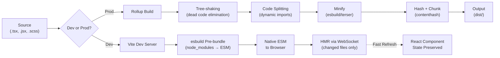

# Build Tools

## What & Why

Build tools transform source code (JSX, TypeScript, Sass, ES modules) into optimized bundles for production browsers.

**Evolution:**

| Era | Tool | Strategy | Dev Server |
|-----|------|----------|------------|
| 2015–2019 | webpack 3/4 | Bundle everything, serve bundles | Bundle on save |
| 2020–2022 | webpack 5 + HMR | Persistent caching, improved HMR | Faster bundle rebuilds |
| 2021+ | Vite | Native ESM dev, esbuild pre-bundle, Rollup prod | On-demand per-file |
| 2023+ | Turbopack (Next.js) | Incremental computation, function-level caching | Sub-second HMR |

**Why speed matters:**

- 10s+ rebuild kills developer flow (context switching cost ~23 min per interruption)
- Faster iteration → more experiments → better products
- Webpack's JS-based bundling is fundamentally slower than Go/Rust-based tools (esbuild, SWC, Turbopack)

## Comparison

| Feature | Vite | webpack 5 | Turbopack | esbuild | SWC |
|---------|------|-----------|-----------|---------|-----|
| **Language** | JS (Rollup+esbuild) | JS | Rust | Go | Rust |
| **Dev speed** | Instant (native ESM) | Slow–moderate (full bundle) | Sub-second | N/A (bundler only) | N/A (transformer) |
| **Prod build** | Rollup (optimized) | webpack | Next.js only (alpha) | Fast, fewer optimizations | Used inside others |
| **HMR** | ESM-based, fast | Chunk-based | Function-grained | — | — |
| **Code splitting** | Rollup dynamic imports | splitChunks | Automatic | Manual | Manual |
| **Plugins** | Rich (Rollup + Vite) | Massive ecosystem | Minimal | Minimal | Minimal |
| **Maturity** | Production-ready | Battle-tested | Alpha/beta | Mature (bundler) | Mature (transformer) |
| **Use case** | New SPAs, SSGs | Large/complex apps | Next.js apps | Speed-critical builds | Transpilation/minification |

## Vite Deep-Dive

### Native ESM Dev Server

```javascript
// vite.config.js
import { defineConfig } from 'vite';
import react from '@vitejs/plugin-react';

export default defineConfig({
  plugins: [react()],
  server: {
    port: 3000,
    open: true,
  },
  build: {
    target: 'es2020',
    sourcemap: true,
    rollupOptions: {
      output: {
        manualChunks(id) {
          if (id.includes('node_modules')) {
            if (id.includes('react')) return 'vendor-react';
            if (id.includes('lodash')) return 'vendor-lodash';
            return 'vendor';
          }
        },
      },
    },
  },
});
```

**How it works:**

1. Dev server serves `.js`/`.tsx` files as native ESM — no bundling
2. Browser imports modules on demand via `<script type="module">`
3. Vite transforms each file on the fly (TS → JS, JSX → JS) using esbuild
4. Dependencies are pre-bundled once with esbuild (converted to ESM, cached)

**Pre-bundling:**

```javascript
// Vite auto-detects deps and pre-bundles them with esbuild
// node_modules/.vite/deps/ contains the cached result
// Force re-bundle if needed:
vite --force
```

### Rollup Production Builds

For production, Vite uses Rollup — generates optimized, tree-shaken bundles with code splitting:

```javascript
// Equivalent command
npx vite build
// Output to dist/ — optimized with code splitting, minification, hashing
```

## Webpack Configuration

### Module Federation

```javascript
// webpack.config.js (host app)
const ModuleFederationPlugin = require('webpack/lib/container/ModuleFederationPlugin');
const path = require('path');

module.exports = {
  mode: 'production',
  entry: './src/index.js',
  output: {
    path: path.resolve(__dirname, 'dist'),
    filename: '[name].[contenthash].js',
    clean: true,
  },
  module: {
    rules: [
      {
        test: /\.(js|jsx)$/,
        exclude: /node_modules/,
        use: {
          loader: 'babel-loader',
          options: { presets: ['@babel/preset-react'] },
        },
      },
    ],
  },
  plugins: [
    new ModuleFederationPlugin({
      name: 'host',
      remotes: {
        checkout: 'checkout@http://localhost:3001/remoteEntry.js',
      },
      shared: {
        react: { singleton: true, requiredVersion: '^18.0.0' },
        'react-dom': { singleton: true },
      },
    }),
  ],
  optimization: {
    splitChunks: {
      chunks: 'all',
      cacheGroups: {
        vendor: {
          test: /[\\/]node_modules[\\/]/,
          name: 'vendor',
          chunks: 'all',
        },
        react: {
          test: /[\\/]node_modules[\\/](react|react-dom|scheduler)[\\/]/,
          name: 'vendor-react',
          chunks: 'all',
          priority: 10,
        },
      },
    },
  },
};
```

## Code Splitting

### Dynamic Imports (React + Vite)

```javascript
import { lazy, Suspense } from 'react';

const Dashboard = lazy(() => import('./pages/Dashboard'));
const Settings = lazy(() => import('./pages/Settings'));
const Billing = lazy(() => import('./pages/Billing'));

function App() {
  return (
    <Suspense fallback={<Spinner />}>
      <Routes>
        <Route path="/dashboard" element={<Dashboard />} />
        <Route path="/settings" element={<Settings />} />
        <Route path="/billing" element={<Billing />} />
      </Routes>
    </Suspense>
  );
}
```

### Automatic Vendor Chunking (Vite)

```javascript
export default defineConfig({
  build: {
    rollupOptions: {
      output: {
        manualChunks(id) {
          if (id.includes('node_modules')) {
            if (id.includes('@sentry') || id.includes('datadog')) {
              return 'vendor-monitoring';
            }
            if (id.includes('@mui')) return 'vendor-mui';
            return 'vendor';
          }
          if (id.includes('src/pages/')) return 'pages';
        },
      },
    },
  },
});
```

### webpack splitChunks

```javascript
// webpack.config.js
optimization: {
  splitChunks: {
    chunks: 'all',
    minSize: 20000,
    maxSize: 244000, // Keep under 250KB for HTTP/2
    cacheGroups: {
      defaultVendors: {
        test: /[\\/]node_modules[\\/]/,
        priority: -10,
        reuseExistingChunk: true,
      },
      common: {
        minChunks: 2,
        priority: -20,
        reuseExistingChunk: true,
      },
    },
  },
},
```

## Caching Strategies

### webpack 5 Persistent Cache

```javascript
// webpack.config.js
module.exports = {
  cache: {
    type: 'filesystem',
    cacheDirectory: path.resolve(__dirname, '.temp/cache'),
    buildDependencies: {
      config: [__filename],
    },
    version: '1.0.0',
  },
};
```

- Stores compiled modules on disk between builds (cold → warm start)
- Invalidated when dependencies or config change
- Dramatically reduces subsequent build times (5min → 30s for large apps)

### Module Federation Caching

- `remoteEntry.js` is cached by the browser (long max-age with contenthash)
- Shared dependencies are loaded once and reused across remotes
- Version mismatches trigger fallback to separate loading

## HMR (Hot Module Replacement)

### webpack HMR Protocol

1. Dev server pushes updated chunks via WebSocket
2. webpack runtime accepts or declines the update
3. Module replaces in-place — state preserved via `module.hot.accept`

```javascript
if (module.hot) {
  module.hot.accept('./Component', () => {
    render(<App />, root);
  });
}
```

### Vite ESM-Based HMR

1. File saved → Vite sends `module.hot` update via WebSocket
2. Browser fetches the changed module as a new ESM import
3. React Fast Refresh replaces component without losing state

No bundling needed — only the changed file is re-fetched.

### React Fast Refresh

```javascript
// Vite: enabled automatically with @vitejs/plugin-react
import react from '@vitejs/plugin-react';

export default defineConfig({
  plugins: [
    react({
      fastRefresh: true,
      babel: {
        plugins: ['babel-plugin-macros'],
      },
    }),
  ],
});
```

- Preserves React component state across edits
- Falls back to full reload for non-component changes (e.g., Redux store)
- Avoids the `module.hot.accept` ceremony webpack requires

## Environment Handling

### .env Files

```
.env                 # loaded in all cases
.env.local           # loaded in all cases, git-ignored
.env.[mode]          # loaded in specific mode only
.env.[mode].local    # loaded in specific mode only, git-ignored
```

Vite exposes variables prefixed with `VITE_`:

```javascript
// VITE_API_URL=https://api.example.com
const apiUrl = import.meta.env.VITE_API_URL;

// Mode: development | production | test
const mode = import.meta.env.MODE;

// Boolean: is this production?
if (import.meta.env.PROD) {
  console.log('Running in production');
}
```

webpack uses `process.env` with DefinePlugin:

```javascript
// Use dotenv + DefinePlugin
const dotenv = require('dotenv').config();

module.exports = {
  plugins: [
    new webpack.DefinePlugin({
      'process.env.API_URL': JSON.stringify(process.env.API_URL),
      'process.env.MODE': JSON.stringify(process.env.NODE_ENV),
    }),
  ],
};
```

### Environment-Based Config Composition

```javascript
// vite.config.js
import { defineConfig, loadEnv } from 'vite';
import react from '@vitejs/plugin-react';

export default defineConfig(({ mode }) => {
  const env = loadEnv(mode, process.cwd(), '');

  return {
    plugins: [react()],
    define: {
      __APP_VERSION__: JSON.stringify(env.APP_VERSION || '0.0.0'),
    },
    build: {
      minify: mode === 'production' ? 'esbuild' : false,
      sourcemap: mode !== 'production',
    },
    server: {
      proxy: {
        '/api': {
          target: env.API_PROXY || 'http://localhost:4000',
          changeOrigin: true,
        },
      },
    },
  };
});
```

### Tree-Shaking Production Config

```javascript
export default defineConfig(({ mode }) => {
  const config = {
    plugins: [react()],
    build: {
      minify: 'esbuild',
      rollupOptions: {
        treeshake: {
          moduleSideEffects: false,
          propertyReadSideEffects: false,
          tryCatchDeoptimization: false,
        },
      },
    },
  };

  if (mode === 'development') {
    config.build.minify = false;
    config.build.sourcemap = true;
  }

  return config;
});
```

## Build Pipeline



**Key takeaways:**

- Vite is the default for new React SPAs — instant dev server, fast builds
- webpack 5 is still needed for Module Federation and complex configs
- Use esbuild or SWC for isolated transpilation/minification tasks
- Code splitting (dynamic imports) is essential for performance — chunk lazily
- Persistent caching (webpack) or pre-bundling (Vite) is mandatory for large projects
- HMR with React Fast Refresh dramatically improves developer experience
- Environment-based config composition keeps dev/prod settings clean
