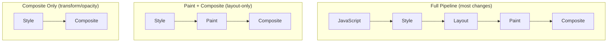

# Browser Internals

[🎨 Interactive Visualization](../../../../html/25-prototype-chain-viz.html)

## The Rendering Pipeline

The browser converts HTML/CSS/JS into pixels through a sequence of stages:


### Stage 1: DOM → CSSOM

When the browser parses HTML, it builds two trees:

- **DOM** (Document Object Model) — the parsed HTML nodes
- **CSSOM** (CSS Object Model) — the parsed CSS rules with computed specificity

CSS is **render-blocking** — the browser won't paint until CSSOM is built.

### Stage 2: Render Tree

The DOM and CSSOM are combined into the Render Tree. It contains only visible elements:

- `display: none` elements are excluded (but `visibility: hidden` is included, just invisible)
- `<head>` and its children are excluded
- Pseudo-elements (`::before`, `::after`) are added

### Stage 3: Layout (Reflow)

The browser calculates the geometry of each Render Tree node: width, height, x, y positions. This is the **Layout** stage (also called Reflow).

Layout is **tree-based** — a change in one element's size can cascade to parent/sibling/child elements.

### Stage 4: Paint

The browser fills in pixels for each render object: colors, borders, shadows, text. Paint is done in **layers** (separate backing stores) to enable compositing.

### Stage 5: Composite

Layers are composited together on the GPU. If only `transform` or `opacity` changed, the browser **skips Layout and Paint** and goes straight to Composite — the most expensive pipeline shortcut.



---

## The Event Loop

JavaScript is single-threaded. The event loop coordinates task execution.

```
   ┌──────────────────────────────────────────┐
   │              Event Loop                  │
   │                                          │
   │  ┌──────┐   ┌──────────┐  ┌─────────┐   │
   │  │  JS  │   │  rAF     │  │ rIC     │   │
   │  │Call  │   │ Callbacks│  │Callbacks│   │
   │  │Stack │   │          │  │         │   │
   │  └──┬───┘   └──────────┘  └─────────┘   │
   │     │                                      │
   │  ┌──▼───────────────────────────┐         │
   │  │      Task Queue (Macro)      │         │
   │  │  setTimeout, setInterval,    │         │
   │  │  I/O, UI events, postMessage │         │
   │  └──────────────────────────────┘         │
   │     │                                      │
   │  ┌──▼───────────────────────────┐         │
   │  │   Microtask Queue            │         │
   │  │   Promise.then,              │         │
   │  │   MutationObserver,          │         │
   │  │   queueMicrotask             │         │
   │  └──────────────────────────────┘         │
   └──────────────────────────────────────────┘
```

### Event Loop Steps (per tick)

1. Execute one **task** from the task queue (setTimeout, click, etc.)
2. Process the entire **microtask queue** (Promise resolutions, queueMicrotask)
3. Run `requestAnimationFrame` callbacks
4. **Style + Layout** recalculation (if needed)
5. **Paint + Composite**
6. Run `requestIdleCallback` callbacks (if idle time remains)

### `requestAnimationFrame`

Runs before the next paint. The browser **guarantees** it runs before Style/Layout/Paint. Use for visual updates (animations, DOM measurements that must be up-to-date).

```js
function animate() {
  element.style.transform = `translateX(${x}px)`;
  x += 1;
  requestAnimationFrame(animate);
}
requestAnimationFrame(animate);
```

### `requestIdleCallback`

Runs when the event loop is idle (no pending tasks, no rAF callbacks, no paint needed). Use for non-urgent work (analytics, localStorage writes, prefetching).

```js
requestIdleCallback(
  (deadline) => {
    while (deadline.timeRemaining() > 0) {
      processBatch();
    }
  },
  { timeout: 2000 }
);
```

### Frame Budget

| Frame Rate | Budget per Frame | What Fits |
|---|---|---|
| 60 fps | 16.6 ms | Simple animations, scroll handlers |
| 120 fps | 8.3 ms | High-refresh displays, VR, gaming |
| 30 fps | 33.3 ms | Acceptable for non-interactive content |

A healthy frame leaves **at least 3–4 ms** of headroom — pushing 16 ms means one GC pause drops a frame.

| Work Item | Typical Cost |
|---|---|
| React reconciliation (small) | 1–2 ms |
| Layout (medium DOM) | 3–8 ms |
| Paint (complex layers) | 2–5 ms |
| Composite | 0.5–2 ms |
| Garbage Collection pause | 5–30 ms |

---

## Layout Thrashing

Layout thrashing occurs when JS repeatedly reads and writes DOM properties, forcing the browser into **forced synchronous layouts**. Each read after a write invalidates the layout, so the browser must recalculate immediately.

### The Problem

```js
// BAD — layout thrashing
for (const el of elements) {
  el.classList.add('highlight');        // write (invalidates layout)
  const rect = el.getBoundingClientRect(); // read (forces layout recalc)
  log(rect.width);
}
```

Every iteration forces a layout recalculation — O(n) layouts for n elements.

### The Fix — Batch Reads & Writes

```js
// GOOD — batch reads, then batch writes
const rects = [];
for (const el of elements) {
  rects.push(el.getBoundingClientRect()); // read first
}
for (let i = 0; i < elements.length; i++) {
  elements[i].classList.add('highlight'); // write after
}
```

### How React Avoids Layout Thrashing

React batches state updates within event handlers and lifecycle methods. All DOM mutations are flushed in a single synchronous pass:

```js
// React batches these into ONE layout + paint cycle
function handleClick() {
  setCount(c => c + 1);
  setFlag(true);
  setText('done');
}
```

`ReactDOM.flushSync()` can opt out of batching (rarely needed):

```js
import { flushSync } from 'react-dom';

flushSync(() => {
  setCount(c => c + 1); // flushed immediately
});
```

### Detecting Layout Thrashing

Using the **Performance API**:

```js
// Layout thrashing detector (development)
let layoutCount = 0;
const originalGetBoundingClientRect = Element.prototype.getBoundingClientRect;

Element.prototype.getBoundingClientRect = function () {
  layoutCount++;
  if (layoutCount > 10) {
    console.warn(`Layout thrash: >${layoutCount} forced reflows`, new Error().stack);
  }
  return originalGetBoundingClientRect.apply(this, arguments);
};
```

```js
// Custom performance marks
performance.mark('layout-start');
const height = element.getBoundingClientRect().height;
performance.mark('layout-end');
performance.measure('forced-layout', 'layout-start', 'layout-end');

const entries = performance.getEntriesByName('forced-layout');
entries.forEach(e => console.log(`Forced layout took ${e.duration}ms`));
```

---

## Compositing

### GPU vs CPU Layers

| Layer Type | Backing Store | Triggers |
|---|---|---|
| **CPU layer** | Main thread bitmap | Default rendering |
| **GPU layer** (compositor layer) | GPU texture | `will-change`, 3D transforms, `<video>`, `<canvas>`, `opacity` animations, `position: fixed` |

### Properties That Only Trigger Compositing

These properties can be animated without triggering Layout or Paint:

- `transform` (translate, scale, rotate, skew)
- `opacity`

Browser support also includes `filter` and `clip-path` in some engines.

```css
/* This animation only touches Composite — no Layout, no Paint */
.card {
  transition: transform 0.3s ease, opacity 0.3s ease;
}
.card:hover {
  transform: scale(1.05);
  opacity: 0.9;
}
```

### The `will-change` Property

Promotes the element to its own compositor layer:

```css
.sidebar {
  will-change: transform;
}
```

**Use sparingly** — each compositor layer consumes GPU memory. Too many layers degrades performance.

### Layer Explosion

Avoid promoting too many elements:

```css
/* BAD — promotes every list item */
.list-item {
  will-change: transform;
}

/* GOOD — promote only the container that actually moves */
.scroll-container {
  will-change: transform;
}
```

---

## Critical Rendering Path

The sequence of steps the browser MUST complete before painting the first frame:

```
1. Parse HTML → DOM
2. Block on CSS (download & parse) → CSSOM
3. Combine DOM + CSSOM → Render Tree
4. Layout
5. Paint
```

### Optimizations

| Optimization | What It Does |
|---|---|
| **Inline critical CSS** | `<style>` in `<head>` for above-the-fold styles |
| **Defer non-critical CSS** | `<link rel="preload" ... media="print" onload="this.media='all'">` |
| **Async/defer JS** | `async` (download + execute ASAP) or `defer` (execute after parse) |
| **Preload key assets** | `<link rel="preload" href="font.woff2" as="font">` |
| **Preconnect to origins** | `<link rel="preconnect" href="https://api.example.com">` |
| **Font-display: swap** | Show fallback font until custom font loads |

### Measuring the Critical Rendering Path

```js
// Navigation Timing API
window.addEventListener('load', () => {
  const perf = performance.getEntriesByType('navigation')[0];

  console.log('DOM to First Paint:', perf.domContentLoadedEventEnd - perf.domInteractive);
  console.log('Total Blocking Time:', perf.domContentLoadedEventEnd - perf.domInteractive);
});
```

---

## React-Specific Browser Interactions

### Batching DOM Mutations

React groups multiple state updates into one DOM commit:

```jsx
function SearchResults() {
  const [query, setQuery] = useState('');
  const [results, setResults] = useState([]);
  const [loading, setLoading] = useState(false);

  async function handleSearch(e) {
    setQuery(e.target.value);   // batched
    setLoading(true);            // batched

    const data = await fetchResults(e.target.value);
    setResults(data);           // new batch (async boundary)
    setLoading(false);           // new batch
  }
}
```

Before React 18, only event handlers were batched. React 18 introduced **automatic batching** — all updates are batched including inside `setTimeout`, Promises, and native events.

### Why Keys Prevent Unnecessary DOM Operations

Without keys, React uses **index-based reconciliation**, which can reuse the wrong DOM node:

```jsx
// BAD — no keys, index-based reconciliation
{items.map((item, index) => <ListItem data={item} />)}
```

When the list changes, React reuses the first DOM node and mutates it even if it's a completely different item.

```jsx
// GOOD — keyed reconciliation preserves DOM nodes
{items.map((item) => <ListItem key={item.id} data={item} />)}
```

With keys, React can:
- Reorder existing DOM nodes instead of destroying+recreating
- Preserve component state (scroll position, input focus)
- Skip unnecessary layout recalculations

### The Render + Commit Phases

```
                     Fiber Tree
                         │
                    [Render Phase]
                    (can be async)
                         │
               ┌─────────┴──────────┐
               │                    │
          [Reconciliation]    [Diffing]
               │                    │
               └─────────┬──────────┘
                         │
                    [Commit Phase]
                   (synchronous)
                         │
                 ┌───────┴───────┐
                 │               │
          [DOM mutations]  [Effects]
```

- **Render phase**: React walks the fiber tree, computes what changed (can be interrupted by the browser)
- **Commit phase**: React applies DOM mutations synchronously (blocks the browser)
- **Effects**: `useEffect` fires **after** the browser paints (non-blocking)
- **Layout Effects**: `useLayoutEffect` fires **synchronously after** DOM mutations but **before** the browser paints (use for measuring DOM)

### Custom Performance Marks in React

```jsx
import { useEffect, useRef } from 'react';

function ProfiledComponent() {
  const ref = useRef(null);

  useEffect(() => {
    performance.mark('component-mounted');
    performance.measure('mount-time', 'navigationStart', 'component-mounted');

    const measure = performance.getEntriesByType('measure').pop();
    console.log(`Mounted in ${measure.duration}ms`);

    return () => performance.clearMarks();
  }, []);

  return <div ref={ref}>Profiled</div>;
}
```

### Measuring Frame Rate

```js
class FPSMonitor {
  frames = 0;
  lastTime = performance.now();

  start() {
    const tick = (now) => {
      this.frames++;
      if (now - this.lastTime >= 1000) {
        console.log(`FPS: ${this.frames}`);
        this.frames = 0;
        this.lastTime = now;
      }
      requestAnimationFrame(tick);
    };
    requestAnimationFrame(tick);
  }
}

const monitor = new FPSMonitor();
monitor.start();
```
