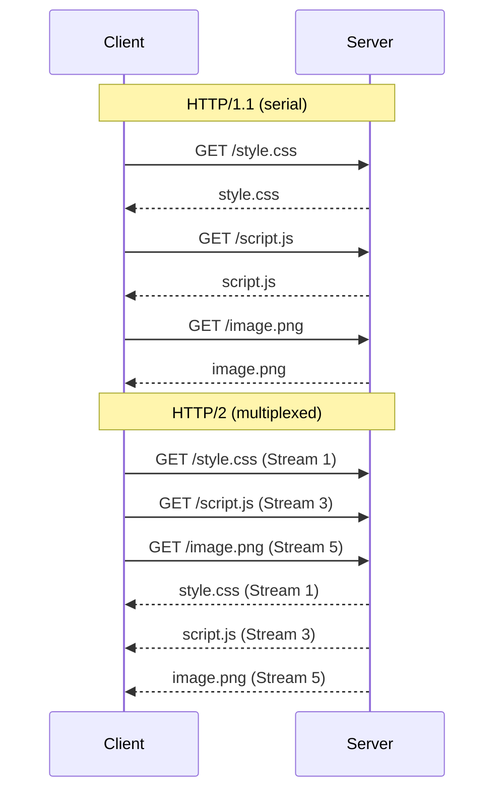
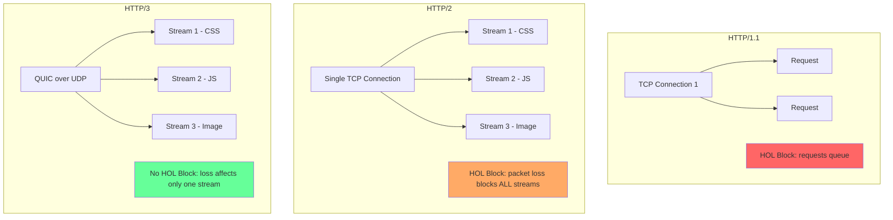

# Networking

## Overview

Modern React applications depend on efficient network transport. Understanding HTTP/2, HTTP/3, CDNs, and caching strategies is essential for optimizing load times, reducing bandwidth, and ensuring reliable delivery.

---

## HTTP/2

HTTP/2 (2015) addressed HTTP/1.1's head-of-line blocking by introducing multiplexing, header compression, and server push.

### Multiplexing

HTTP/1.1 required one TCP connection per request (or limited concurrent requests via domain sharding). HTTP/2 multiplexes multiple streams over a single TCP connection.

```
HTTP/1.1:                     HTTP/2:
┌────────────────┐            ┌────────────────┐
│ TCP Connection │            │ TCP Connection │
│                │            │ ┌──────┐       │
│  Request 1     │ ◄── Block► │ │Stream│ Req 1 │
│  Response 1    │            │ │  1   │ Res 1 │   │
│  Request 2     │    Wait    │ ├──────┤       │
│  Response 2    │            │ │Stream│ Req 2 │
│  Request 3     │            │ │  2   │ Res 2 │
│  Response 3    │            │ ├──────┤       │
└────────────────┘            │ │Stream│ Req 3 │
                              │ │  3   │ Res 3 │
                              │ └──────┘       │
                              │ All simultaneous│
                              └────────────────┘
```



**Impact**: No more domain sharding. One connection saturates bandwidth. ~30% faster page loads on slow connections.

### Header Compression (HPACK)

HTTP/1.1 sends headers as plaintext on every request. Typical overhead: 500–800 bytes per request.

HPACK uses:
- **Static table**: 61 predefined header entries (e.g., `:method: GET` → 1 byte)
- **Dynamic table**: recently seen headers cached per connection
- **Huffman encoding**: further compresses string values

```
HTTP/1.1 Headers (~500 bytes):
  GET /index.html HTTP/1.1
  Host: example.com
  User-Agent: Mozilla/5.0 ...
  Accept: text/html,application/xhtml+xml
  Accept-Encoding: gzip, deflate
  Cookie: session=abc123; theme=dark

HTTP/2 HPACK (~50 bytes):
  :method: GET         (static table index 2 → 1 byte)
  :path: /index.html   (dynamic table after first request → 1 byte)
  :authority: example.com (dynamic table → 1 byte)
  ... Huffman-encoded cookies
```

**Impact**: ~90% reduction in header overhead. Critical for APIs with many small requests.

### Server Push (Deprecated)

HTTP/2 allowed servers to push resources before the client requested them. Chrome deprecated support in 2022 because:

- Push was never cache-aware (could push already-cached resources)
- Couldn't be cancelled by the client (wasted bandwidth)
- Hard to prioritize correctly
- **Replaced by**: `103 Early Hints`, `<link rel="preload">`, service workers

### Stream Prioritization

HTTP/2 streams have a priority tree. Browsers signal which resources are important:

```
Root
├── CSS (highest) — blocks render
├── JS (high) — blocks parsing
├── Fonts (medium) — blocks text
└── Images (low) — non-blocking
```

Servers *should* allocate bandwidth proportionally, but most implementations use a simpler round-robin.

---

## HTTP/3

HTTP/3 (2022) replaces TCP with QUIC (Quick UDP Internet Connections), developed by Google.

### QUIC Protocol

```
┌────────────────────────────────────┐
│           HTTP/3 (HTTP)            │
├────────────────────────────────────┤
│           QUIC Transport           │
│  (TLS 1.3 built-in, 0-RTT,        │
│   stream multiplexing,             │
│   no HOL blocking)                 │
├────────────────────────────────────┤
│            UDP                     │
└────────────────────────────────────┘

vs.

┌────────────────────────────────────┐
│      HTTP/2 (HTTP framing)         │
├────────────────────────────────────┤
│         TLS 1.3 (optional)         │
├────────────────────────────────────┤
│   TCP (byte stream, HOL blocking)  │
├────────────────────────────────────┤
│            IP                      │
└────────────────────────────────────┘
```

### Key Features

| Feature | HTTP/2 (TCP) | HTTP/3 (QUIC) |
|---------|-------------|---------------|
| Protocol | TCP + TLS 1.3 | UDP + TLS 1.3 (built-in) |
| Handshake | 2-3 RTT | 0-1 RTT |
| Head-of-line blocking | At TCP level (lost packet blocks all streams) | Per-stream (lost packet only blocks that stream) |
| Connection migration | ❌ (breaks on IP change) | ✅ (connection ID survives IP change) |
| Encryption | Optional (TLS) | Mandatory (built-in) |

### 0-RTT Connection Establishment

```
HTTP/1.1:     SYN ──▶ SYN-ACK ──▶ ACK ──▶ TLS ClientHello ──▶ ... (3 RTT)
TCP                          TLS

HTTP/2:       SYN ──▶ SYN-ACK ──▶ ACK ──▶ ClientHello ──▶ ... (2-3 RTT)

HTTP/3:       Initial ──▶ Handshake ──▶ 0-RTT Data ✈ (1 RTT)
              (or 0 RTT with cached credentials)

0-RTT:       ┌─────────────┐
             │ Client sends │
             │  data IMMEDIATELY│
             │  on first UDP  │
             │  packet        │
             └─────────────┘
```

### No Head-of-Line Blocking

```
TCP (HTTP/2):
Stream 1: [DATA] [DATA] [DATA] [LOST] [DATA] [DATA]
Stream 2: [                              WAITING          ]
Stream 3: [                              WAITING          ]
         ↑ All streams block waiting for retransmit

QUIC (HTTP/3):
Stream 1: [DATA] [DATA] [DATA] [LOST] [DATA] [DATA]
Stream 2: [DATA] [DATA] [DATA] [DATA] [DATA] [DATA]
Stream 3: [DATA] [DATA] [DATA] [DATA] [DATA] [DATA]
         ↑ Only Stream 1 blocks; 2 & 3 continue
```

### Protocol Comparison Diagram



---

## CDN (Content Delivery Network)

### How CDNs Work

```
User in Sydney
    │
    ▼
┌──────────────────────────────────────┐
│          DNS Resolution             │
│  (returns nearest edge server IP)   │
└──────────────────────────────────────┘
    │
    ▼
┌──────────────────────────────────────┐
│  Edge Server (Sydney)               │
│  Cache: HIT? → Serve                │
│         MISS → Fetch from origin    │
│                → Cache & serve      │
└──────────────────────────────────────┘
    │                        │
    ▼                        ▼
Cache HIT              Cache MISS
(fast: ~5ms)           ┌────────────────┐
                       │ Origin Server  │
                       │ (US East)      │
                       │ ~200ms latency │
                       └────────────────┘
```

### Cache-Control Headers

```http
# Public — can be cached by CDN, browser, any intermediary
Cache-Control: public, max-age=3600

# Private — only browser cache, NOT CDN
Cache-Control: private, max-age=3600

# No cache — revalidate with origin every time
Cache-Control: no-cache

# No store — never cache (sensitive data)
Cache-Control: no-store

# s-maxage — overrides max-age for CDNs/proxies only
Cache-Control: public, max-age=60, s-maxage=86400

# Stale while revalidate — serve stale content while fetching fresh
Cache-Control: public, max-age=3600, stale-while-revalidate=60

# Stale if error — serve stale content if origin is down
Cache-Control: public, max-age=3600, stale-if-error=86400

# Immutable — browser never revalidates within max-age (fingerprinted assets)
Cache-Control: public, max-age=31536000, immutable
```

### Recommended Strategy for React Apps

| Resource | Cache-Control | Rationale |
|----------|--------------|-----------|
| `index.html` | `no-cache` | Always get latest JS bundle URL |
| `static/js/*.chunk.js` | `public, max-age=31536000, immutable` | Content-hashed, never changes |
| `static/css/*.chunk.css` | `public, max-age=31536000, immutable` | Content-hashed, never changes |
| API responses (user data) | `private, no-cache` | Per-user sensitive data |
| API responses (public) | `public, max-age=60, s-maxage=300` | CDN caches longer, browser short |
| Images | `public, max-age=86400, stale-while-revalidate=604800` | Often static, serve stale |

### Cache Invalidation

**Hard**: Purge or invalidate CDN cache by URL pattern on deploy.

```
Before deploy:  bundle.abc123.js  (cached at edge, immutable)
Deploy:         bundle.def456.js  (new URL, no invalidation needed)
After deploy:   Old cache lives until expiry OR manual purge
```

**Soft**: Use max-age + s-maxage. On deploy:
1. Update index.html to reference new asset URLs
2. Old cached assets expire naturally (or never — it's fine, they're unused)

**Immediate purge**: CDN API call (CloudFlare `PURGE /path`, AWS CloudFront invalidation).

### Cache Invalidation Methods

| Method | Latency | Scope | Notes |
|--------|---------|-------|-------|
| URL versioning (hash) | Instant | Per-file | Best — no invalidation needed |
| Purge by pattern | ~1-30s | Path/regex | CloudFlare, Fastly |
| Purge all | ~1-60s | Whole CDN | Expensive (cache refill storm) |
| TTL expiry | By design | Age-based | Unpredictable timing |

---

## Service Worker Caching

Service workers intercept network requests and serve from a cache, enabling offline support and custom caching strategies.

### Registration

```javascript
// service-worker.js — registration
if ('serviceWorker' in navigator) {
  window.addEventListener('load', async () => {
    try {
      const registration = await navigator.serviceWorker.register(
        '/service-worker.js',
        { scope: '/' }
      );
      console.log('SW registered:', registration.scope);

      registration.addEventListener('updatefound', () => {
        const newWorker = registration.installing;
        newWorker.addEventListener('statechange', () => {
          if (newWorker.state === 'installed' && navigator.serviceWorker.controller) {
            // New version available — show update prompt
            showUpdatePrompt(registration);
          }
        });
      });
    } catch (err) {
      console.error('SW registration failed:', err);
    }
  });
}
```

### Caching Strategies

```javascript
// service-worker.js — caching strategies

const CACHE_NAME = 'my-app-v2';
const STATIC_ASSETS = [
  '/',
  '/index.html',
  '/static/js/main.abc123.js',
  '/static/css/main.def456.css',
];

// Install: precache static assets
self.addEventListener('install', (event) => {
  event.waitUntil(
    caches.open(CACHE_NAME).then((cache) => {
      return cache.addAll(STATIC_ASSETS);
    })
  );
  self.skipWaiting();
});

// Activate: clean old caches
self.addEventListener('activate', (event) => {
  event.waitUntil(
    caches.keys().then((cacheNames) => {
      return Promise.all(
        cacheNames
          .filter((name) => name !== CACHE_NAME)
          .map((name) => caches.delete(name))
      );
    })
  );
  self.clients.claim();
});

// Stale-while-revalidate strategy
async function staleWhileRevalidate(request) {
  const cache = await caches.open(CACHE_NAME);
  const cachedResponse = await cache.match(request);

  const fetchPromise = fetch(request).then(async (networkResponse) => {
    if (networkResponse.ok) {
      await cache.put(request, networkResponse.clone());
    }
    return networkResponse;
  });

  // Return cached immediately, update cache in background
  return cachedResponse || fetchPromise;
}

// Cache-first strategy (for immutable assets)
async function cacheFirst(request) {
  const cached = await caches.match(request);
  if (cached) return cached;

  const networkResponse = await fetch(request);
  if (networkResponse.ok) {
    const cache = await caches.open(CACHE_NAME);
    await cache.put(request, networkResponse.clone());
  }
  return networkResponse;
}

// Network-first strategy (for API calls)
async function networkFirst(request) {
  try {
    const networkResponse = await fetch(request);
    if (networkResponse.ok) {
      const cache = await caches.open(CACHE_NAME);
      await cache.put(request, networkResponse.clone());
    }
    return networkResponse;
  } catch (err) {
    const cached = await caches.match(request);
    if (cached) return cached;
    // Offline fallback
    return caches.match('/offline.html');
  }
}

// Fetch handler — route by request type
self.addEventListener('fetch', (event) => {
  const { request } = event;
  const url = new URL(request.url);

  // Static assets: cache-first
  if (url.pathname.startsWith('/static/')) {
    event.respondWith(cacheFirst(request));
    return;
  }

  // API calls: network-first with offline fallback
  if (url.pathname.startsWith('/api/')) {
    event.respondWith(networkFirst(request));
    return;
  }

  // Navigation: stale-while-revalidate (HTML)
  if (request.mode === 'navigate') {
    event.respondWith(staleWhileRevalidate(request));
    return;
  }

  // Everything else: network-only
  event.respondWith(fetch(request));
});
```

### Strategy Selection

| Strategy | Use Case | Offline Support | Freshness |
|----------|----------|----------------|-----------|
| **Cache-first** | Immutable assets (JS/CSS hashes) | ✅ | ✅ (unchanged) |
| **Network-first** | API calls | ⚠️ Falls back to cache | ✅ Latest data |
| **Stale-while-revalidate** | HTML, non-critical API | ✅ | ⚠️ Stale until refresh |
| **Network-only** | Real-time data, auth | ❌ | ✅ |
| **Cache-only** | Preloaded assets only | ✅ | ❌ Never updates |

---

## Resource Hints

### Comparison

```html
<!-- DNS resolution only -->
<link rel="dns-prefetch" href="https://api.example.com">

<!-- DNS + TCP + TLS handshake -->
<link rel="preconnect" href="https://api.example.com">

<!-- Fetch resource, cache for future navigation -->
<link rel="prefetch" href="/next-page.js" as="script">

<!-- Fetch critical resource for current page (high priority) -->
<link rel="preload" href="/fonts/inter.woff2" as="font" crossorigin>

<!-- Prerender entire page (deprecated, use speculation rules) -->
<link rel="prerender" href="/next-page.html">
```

### When to Use Each

| Hint | When | Cost | Benefit |
|------|------|------|---------|
| `dns-prefetch` | Third-party origins | ~1 DNS lookup (~20ms) | Low overhead |
| `preconnect` | Critical third-party (analytics, CDN) | TCP + TLS overhead (~100ms) | Higher savings |
| `prefetch` | Next page resources | Bandwidth + CPU | Instant next page |
| `preload` | Above-the-fold resources discovered late | Bandwidth | Earlier render |
| `modulepreload` | ES modules (React RSC) | Module parse + fetch | Faster ESM execution |

### React-Specific Usage

```html
<!-- Preconnect to API server -->
<link rel="preconnect" href="https://api.example.com">

<!-- Preload critical fonts (prevent FOUT) -->
<link rel="preload" href="/fonts/inter-var.woff2" as="font" crossorigin>

<!-- Prefetch next page (route-based code splitting) -->
<link rel="prefetch" href="/dashboard.abc123.js" as="script">

<!-- modulepreload for ESM modules (React 18+ RSC) -->
<link rel="modulepreload" href="/src/App.js">
<link rel="modulepreload" href="/src/Header.js">
<link rel="modulepreload" href="/src/Footer.js">
```

```javascript
// React Router + Prefetch (programmatic)
const prefetchCache = new Set();

function prefetchRoute(path) {
  if (prefetchCache.has(path)) return;
  prefetchCache.add(path);

  // Dynamically inject <link rel="prefetch">
  const link = document.createElement('link');
  link.rel = 'prefetch';
  link.as = 'script';
  link.href = path;
  document.head.appendChild(link);
}

// Call on hover:
// <Link onMouseEnter={() => prefetchRoute('/dashboard')} to="/dashboard">
```

---

## React-Specific Networking

### RSC Streaming (React Server Components)

React 18+ supports streaming SSR and Server Components over HTTP.

```http
HTTP/1.1 200 OK
Content-Type: text/html; charset=utf-8
Transfer-Encoding: chunked

<!-- Initial shell (streamed immediately) -->
<!DOCTYPE html>
<html>
<head><title>My App</title></head>
<body>
  <div id="root">

<!-- Suspense boundaries stream independently -->
<!-- Header loads fast -->
<div class="header">Header Content</div>

<!-- Main content arrives later (async data) -->
<div class="main" hidden>
<style>
  .main-content { color: blue; }
</style>
<div>Main Content Loaded After Data</div>
</div>

<!-- Footer streams first if static -->
<div class="footer">Footer</div>
```

```javascript
// Server-side RSC streaming (Next.js App Router)
import { Suspense } from 'react';

async function SlowComponent() {
  const data = await fetch('https://api.example.com/slow-data');
  const json = await data.json();
  return <div>{json.content}</div>;
}

export default function Page() {
  return (
    <html>
      <body>
        <Header />           {/* Streams immediately */}
        <Suspense fallback={<Spinner />}>
          <SlowComponent />  {/* Streams when data ready */}
        </Suspense>
        <Footer />           {/* Streams immediately */}
      </body>
    </html>
  );
}
```

### Chunked Transfer Encoding

HTTP/1.1 chunked encoding enables streaming without knowing content length:

```
HTTP/1.1 200 OK
Content-Type: text/html
Transfer-Encoding: chunked

25                          ← chunk size (hex)
<!DOCTYPE html><html><body>
1c
<div>Shell content</div>
30
<div>Suspense boundary content</div>
0                           ← zero size = end

```

React uses this to stream HTML as it renders. With HTTP/2, this happens per-stream — each Suspense boundary can be its own stream.

### `modulepreload` for React

```html
<!-- With React 18 RSC + ESM, preload the module graph -->
<link rel="modulepreload" href="/_next/static/chunks/app/layout.js">
<link rel="modulepreload" href="/_next/static/chunks/app/page.js">
<link rel="modulepreload" href="/_next/static/chunks/app/Header.js">
```

`modulepreload` differs from `prefetch`:
- **Prefetch**: downloads for future navigation (low priority)
- **Modulepreload**: downloads + parses the module and its dependencies for immediate use (high priority)

---

## Caching Strategy Code Examples

### Cache-Control by Resource Type

```javascript
// Express.js middleware example
const express = require('express');
const app = express();

// Static assets with content hash (immutable)
app.use('/static', express.static('dist/static', {
  maxAge: '1y',
  immutable: true,
  setHeaders: (res, path) => {
    res.setHeader('Cache-Control', 'public, max-age=31536000, immutable');
  },
}));

// HTML entry (revalidate always)
app.get('/', (req, res) => {
  res.setHeader('Cache-Control', 'no-cache');
  res.sendFile('dist/index.html');
});

// API response (private, short CDN, medium browser)
app.get('/api/public/posts', async (req, res) => {
  res.setHeader('Cache-Control', 'public, max-age=60, s-maxage=300');
  res.json(await getPosts());
});

// API response (private, no cache)
app.get('/api/user/profile', async (req, res) => {
  res.setHeader('Cache-Control', 'private, no-cache');
  res.json(await getUserProfile(req.user.id));
});
```

### CDN Cache Invalidation on Deploy

```javascript
// CloudFlare API cache purge (run after deploy)
async function purgeCDNCache(zoneId, apiToken) {
  const response = await fetch(
    `https://api.cloudflare.com/client/v4/zones/${zoneId}/purge_cache`,
    {
      method: 'POST',
      headers: {
        'Authorization': `Bearer ${apiToken}`,
        'Content-Type': 'application/json',
      },
      body: JSON.stringify({
        files: [
          'https://example.com/',
          'https://example.com/index.html',
        ],
        // Or purge everything:
        // purge_everything: true,
      }),
    }
  );
  return response.json();
}

// Deploy pipeline:
// 1. Build — outputs index.html + content-hashed assets
// 2. Upload to origin server
// 3. Optionally purge CDN cache for index.html only
// 4. New asset URLs → old cached assets are never referenced
```

---

## Summary

| Technology | Key Benefit | Best For |
|-----------|-------------|----------|
| **HTTP/2** | Multiplexing over one TCP connection | Modern sites with many resources |
| **HTTP/3** | No HOL blocking + 0-RTT | Poor network conditions, mobile |
| **CDN** | Edge caching reduces latency | Static assets, global users |
| **Cache-Control** | Fine-grained caching policy | Every response |
| **Service Worker** | Full offline support + custom strategy | Progressive web apps |
| **Resource Hints** | Preload critical resources | First paint optimization |
| **RSC Streaming** | Progressive HTML delivery | Large React pages with async data |
