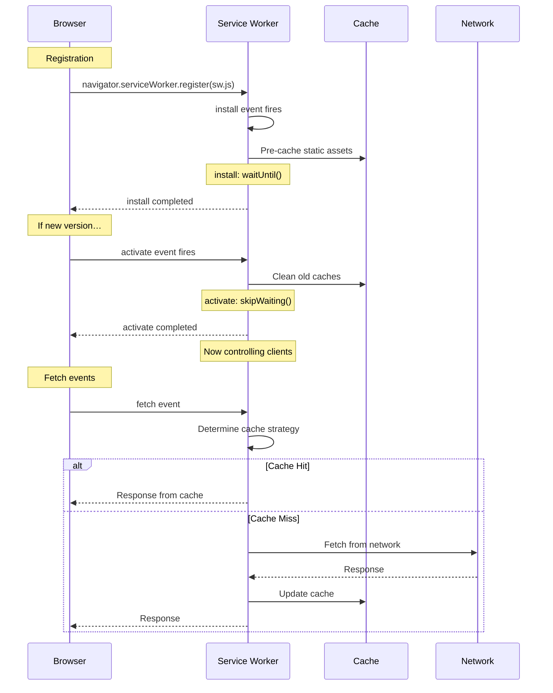

# Progressive Web Apps (PWA)

## Service Worker Lifecycle

Service workers act as a programmable network proxy between the browser and the network. They run on a separate thread and enable offline functionality, caching, and push notifications.

### Lifecycle: Install → Activate → Fetch



### Scope and Update Flow

- **Scope**: determined by the SW file location. A SW at `/sw.js` controls all pages under `/`, while `/nested/sw.js` only controls `/nested/`.
- **Update**: browser checks for byte-differences every 24h (or on `navigator.serviceWorker.register()`). New SW installs but enters `waiting` state until all tabs close.
- **Skip waiting**: call `self.skipWaiting()` during `install` to force immediate activation.
- **Claim clients**: call `clients.claim()` during `activate` to take control of open tabs without reload.

```js
// Registration
if ('serviceWorker' in navigator) {
  navigator.serviceWorker.register('/sw.js', { scope: '/' })
    .then(reg => {
      console.log('SW registered', reg.scope);
      reg.addEventListener('updatefound', () => {
        const newSW = reg.installing;
        newSW.addEventListener('statechange', () => {
          if (newSW.state === 'installed' && navigator.serviceWorker.controller) {
            // New version available
          }
        });
      });
    });
}
```

## Cache Strategies

### Cache First (Static Assets)

Best for assets that rarely change (fonts, logos, framework bundles).

```js
self.addEventListener('fetch', event => {
  event.respondWith(
    caches.match(event.request).then(cached => {
      return cached || fetch(event.request).then(response => {
        return caches.open('static-v1').then(cache => {
          cache.put(event.request, response.clone());
          return response;
        });
      });
    })
  );
});
```

### Network First (API)

Best for dynamic data where freshness is preferred but offline fallback is acceptable.

```js
self.addEventListener('fetch', event => {
  event.respondWith(
    fetch(event.request)
      .then(response => {
        return caches.open('api-v1').then(cache => {
          cache.put(event.request, response.clone());
          return response;
        });
      })
      .catch(() => caches.match(event.request))
  );
});
```

### Stale While Revalidate (Content)

Best for content where speed matters and freshness is secondary (articles, images).

```js
self.addEventListener('fetch', event => {
  event.respondWith(
    caches.match(event.request).then(cached => {
      const fetchPromise = fetch(event.request).then(response => {
        return caches.open('content-v1').then(cache => {
          cache.put(event.request, response.clone());
          return response;
        });
      });
      return cached || fetchPromise;
    })
  );
});
```

### Network Only

Best for CRUD mutations, sensitive data, or real-time endpoints.

```js
self.addEventListener('fetch', event => {
  event.respondWith(fetch(event.request));
});
```

## Web App Manifest

Located at `site.webmanifest` and linked in `<head>`:

```html
<link rel="manifest" href="/site.webmanifest" />
```

```json
{
  "name": "My App",
  "short_name": "App",
  "description": "A great PWA",
  "start_url": "/",
  "display": "standalone",
  "background_color": "#ffffff",
  "theme_color": "#317EFB",
  "orientation": "portrait-primary",
  "icons": [
    { "src": "/icon-192.png", "sizes": "192x192", "type": "image/png" },
    { "src": "/icon-512.png", "sizes": "512x512", "type": "image/png" },
    {
      "src": "/icon-512-maskable.png",
      "sizes": "512x512",
      "type": "image/png",
      "purpose": "maskable"
    }
  ],
  "shortcuts": [
    {
      "name": "New Item",
      "short_name": "New",
      "description": "Quickly create a new item",
      "url": "/new"
    }
  ],
  "categories": ["productivity"],
  "screenshots": [
    { "src": "/screenshot.png", "sizes": "1280x720", "type": "image/png" }
  ]
}
```

### Display Modes

| Mode | Description |
|------|-------------|
| `fullscreen` | All browser UI hidden, full screen |
| `standalone` | Looks like a native app (no URL bar) |
| `minimal-ui` | Some browser chrome remains (back/forward) |
| `browser` | Regular browser tab |

### `beforeinstallprompt` Event

```js
let deferredPrompt;

window.addEventListener('beforeinstallprompt', e => {
  e.preventDefault();
  deferredPrompt = e;
  document.getElementById('install-btn').style.display = 'block';

  deferredPrompt.prompt();
  deferredPrompt.userChoice.then(choice => {
    if (choice.outcome === 'accepted') {
      console.log('User installed');
    }
    deferredPrompt = null;
  });
});
```

## Push Notifications

### Permission Flow

```js
async function requestNotificationPermission() {
  const permission = await Notification.requestPermission();
  if (permission !== 'granted') {
    throw new Error('Permission denied');
  }
}
```

### Push API — Subscribing

```js
async function subscribeUser(swReg) {
  const subscription = await swReg.pushManager.subscribe({
    userVisibleOnly: true,
    applicationServerKey: urlB64ToUint8Array('PUBLIC_VAPID_KEY'),
  });
  // Send subscription to server
  await fetch('/api/push/subscribe', {
    method: 'POST',
    body: JSON.stringify(subscription),
  });
}
```

### Push Event Handler in Service Worker

```js
self.addEventListener('push', event => {
  const data = event.data ? event.data.json() : {
    title: 'Default title',
    body: 'Default body',
    icon: '/icon-192.png',
  };

  const options = {
    body: data.body,
    icon: data.icon,
    badge: '/badge.png',
    actions: [
      { action: 'open', title: 'Open' },
      { action: 'dismiss', title: 'Dismiss' },
    ],
    data: { url: data.url },
    vibrate: [200, 100, 200],
  };

  event.waitUntil(
    self.registration.showNotification(data.title, options)
  );
});

self.addEventListener('notificationclick', event => {
  event.notification.close();
  if (event.action === 'open') {
    const url = event.notification.data?.url || '/';
    event.waitUntil(clients.openWindow(url));
  }
});
```

### Requesting Notification Permission

```js
async function setupPush() {
  const permission = await Notification.requestPermission();
  if (permission !== 'granted') return;

  const reg = await navigator.serviceWorker.ready;
  await subscribeUser(reg);
}
```

## Summary

- SW lifecycle: `install` → `waiting` → `activate` → `fetch` events
- Pick cache strategy based on resource type (static vs dynamic vs API)
- Manifest enables installability and defines app identity
- Push notifications require VAPID keys, user permission, and SW event handlers
- The `beforeinstallprompt` event lets you trigger the install dialog manually
