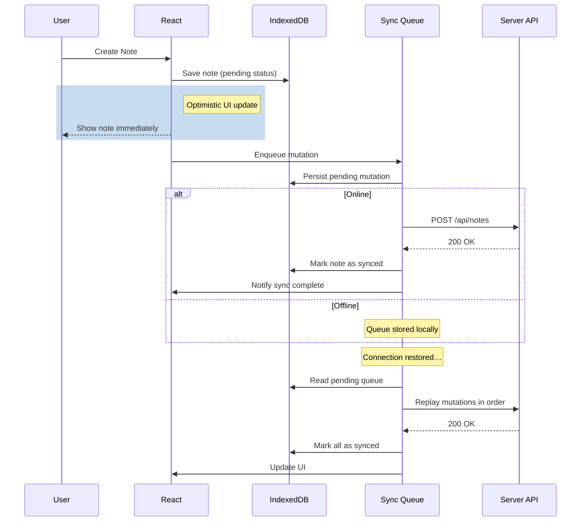

# Offline-First Architecture

## IndexedDB

IndexedDB is a low-level, transactional, object-oriented database built into the browser. It stores structured data (including blobs) and is the backbone of offline-first apps.

### Core Concepts

| Concept | Description |
|---------|-------------|
| **Object Store** | Like a table in SQL; stores records as key-value pairs |
| **Index** | Secondary lookup on a property (e.g. find user by email) |
| **Transaction** | Atomic unit of work; all ops succeed or roll back |
| **Cursor** | Iterator for walking over a range of records |
| **Key Path** | Property used as the primary key (e.g. `id`) |
| **Auto Increment** | Auto-generated sequential key |

### Using the `idb` Library

The [`idb`](https://github.com/jakearchibald/idb) library (by Jake Archibald) wraps IndexedDB in a Promise-based API, eliminating the tedious `onsuccess`/`onerror` callback nesting.

```js
import { openDB, deleteDB, wrap, unwrap } from 'idb';

const db = await openDB('my-app', 1, {
  upgrade(db, oldVersion, newVersion, transaction) {
    const store = db.createObjectStore('notes', {
      keyPath: 'id',
      autoIncrement: true,
    });
    store.createIndex('by-date', 'updatedAt');
    store.createIndex('by-tag', 'tags', { multiEntry: true });
  },
});
```

### CRUD Operations

```js
// Create
const id = await db.add('notes', { title: 'Hello', body: 'World' });

// Read one
const note = await db.get('notes', id);

// Read all (with cursor)
const allNotes = await db.getAll('notes');

// Query by index
const notesByDate = await db.getAllFromIndex('notes', 'by-date');

// Range query
const recent = await db.getAll('notes', IDBKeyRange.lowerBound(
  new Date(Date.now() - 86400000)
));

// Cursor iteration
const txn = db.transaction('notes', 'readonly');
let cursor = await txn.store.openCursor();
while (cursor) {
  console.log(cursor.key, cursor.value);
  cursor = await cursor.continue();
}

// Update
await db.put('notes', { id, title: 'Updated', body: '...' });

// Delete
await db.delete('notes', id);
```

### IndexedDB Transaction Modes

| Mode | Behavior |
|------|----------|
| `readonly` | Multiple concurrent reads |
| `readwrite` | Exclusive write lock per store |
| `readwriteflush` | Forces write to disk (Chromium) |

## Offline Sync Patterns

### Mutation Queue



### Sync Queue with Retry

```js
class SyncQueue {
  constructor(db) {
    this.db = db;
  }

  async enqueue(mutation) {
    await this.db.add('sync-queue', {
      ...mutation,
      status: 'pending',
      createdAt: new Date(),
      retries: 0,
    });
    this.process();
  }

  async process() {
    if (!navigator.onLine) return;

    const pending = await this.db.getAll('sync-queue');
    for (const item of pending) {
      try {
        const res = await fetch(item.url, {
          method: item.method,
          headers: { 'Content-Type': 'application/json' },
          body: JSON.stringify(item.body),
        });
        if (!res.ok) throw new Error(`HTTP ${res.status}`);

        await this.db.delete('sync-queue', item.id);
      } catch (err) {
        item.retries += 1;
        item.lastError = err.message;
        if (item.retries >= 5) {
          item.status = 'failed';
        }
        await this.db.put('sync-queue', item);
        break; // stop on first failure to preserve order
      }
    }
  }
}
```

## Conflict Resolution

### Last-Write-Wins (LWW)

Simplest strategy. The last sync wins, typically using a `updatedAt` timestamp.

```js
async function syncDocument(doc) {
  const server = await fetch(`/api/docs/${doc.id}`);
  const serverDoc = await server.json();

  if (new Date(doc.updatedAt) >= new Date(serverDoc.updatedAt)) {
    await fetch(`/api/docs/${doc.id}`, {
      method: 'PUT',
      body: JSON.stringify(doc),
    });
  } else {
    // Server wins — overwrite local
    await db.put('docs', serverDoc);
  }
}
```

### CRDT/Delta Diff

Conflict-free Replicated Data Types merge concurrent edits automatically.

```js
// Simplified operation-based CRDT
function merge(serverVersion, localVersion) {
  const ops = new Map();

  for (const op of [...serverVersion.ops, ...localVersion.ops]) {
    const key = `${op.path}:${op.timestamp}`;
    if (!ops.has(key)) {
      ops.set(key, op);
    }
  }

  return applyOps([...ops.values()].sort((a, b) => a.timestamp - b.timestamp));
}
```

### Manual Merge UI

When automatic conflict resolution is impossible, present a three-way merge UI.

```js
function MergeDialog({ local, server, onResolve }) {
  return (
    <div className="merge-dialog">
      <h3>Conflict: {local.title}</h3>
      <div style={{ display: 'grid', gridTemplateColumns: '1fr 1fr', gap: 16 }}>
        <div>
          <h4>Your version</h4>
          <pre>{local.body}</pre>
        </div>
        <div>
          <h4>Server version</h4>
          <pre>{server.body}</pre>
        </div>
      </div>
      <textarea
        defaultValue={local.body}
        rows={6}
        ref={el => mergedRef.current = el}
      />
      <button onClick={() => onResolve({ ...local, body: mergedRef.current.value })}>
        Resolve
      </button>
    </div>
  );
}
```

## Background Sync API

Registers a sync event that wakes the SW when connectivity is restored.

```js
async function registerSync() {
  const reg = await navigator.serviceWorker.ready;
  try {
    await reg.sync.register('sync-notes');
  } catch (err) {
    console.log('Background sync not supported', err);
  }
}

// In service worker
self.addEventListener('sync', event => {
  if (event.tag === 'sync-notes') {
    event.waitUntil(syncPendingNotes());
  }
});
```

### Periodic Background Sync

Updates cached data at regular intervals (requires user permission).

```js
async function registerPeriodicSync() {
  const status = await navigator.permissions.query({
    name: 'periodic-background-sync',
  });
  if (status.state !== 'granted') return;

  const reg = await navigator.serviceWorker.ready;
  await reg.periodicSync.register('update-content', {
    minInterval: 24 * 60 * 60 * 1000, // 1 day
  });
}

self.addEventListener('periodicsync', event => {
  if (event.tag === 'update-content') {
    event.waitUntil(fetchAndCacheFreshContent());
  }
});
```

## React Integration

### `useSyncExternalStore` with IndexedDB

```js
import { useSyncExternalStore, useCallback } from 'react';
import { openDB } from 'idb';

function createIndexedDBStore(dbName, storeName) {
  let db;

  async function getDb() {
    if (!db) {
      db = await openDB(dbName, 1, {
        upgrade(db) {
          db.createObjectStore(storeName, { keyPath: 'id', autoIncrement: true });
        },
      });
    }
    return db;
  }

  return {
    subscribe(callback) {
      // Poll or use IDB events; simplified here
      const interval = setInterval(callback, 5000);
      return () => clearInterval(interval);
    },
    async getSnapshot() {
      const database = await getDb();
      return database.getAll(storeName);
    },
  };
}

function useNotes() {
  const store = useMemo(() => createIndexedDBStore('notes-db', 'notes'), []);
  const notes = useSyncExternalStore(
    useCallback(cb => store.subscribe(cb), [store]),
    useCallback(() => store.getSnapshot(), [store]),
  );

  return notes ?? [];
}
```

### Optimistic UI Updates

```js
function useOptimisticMutation(mutationFn, queryKey) {
  const queryClient = useQueryClient();

  return useMutation({
    mutationFn,
    onMutate: async (newData) => {
      await queryClient.cancelQueries(queryKey);
      const previous = queryClient.getQueryData(queryKey);

      queryClient.setQueryData(queryKey, old => [...(old ?? []), {
        ...newData,
        id: `temp-${Date.now()}`,
        status: 'pending',
      }]);

      return { previous };
    },
    onError: (err, newData, context) => {
      queryClient.setQueryData(queryKey, context.previous);
    },
    onSettled: () => {
      queryClient.invalidateQueries(queryKey);
    },
  });
}
```

## Summary

- **IndexedDB** stores structured data offline; use the `idb` library for a Promise API
- **Sync queue** persists mutations locally and replays them in order when online
- **Conflict resolution** ranges from simple LWW to CRDTs to manual merge UIs
- **Background Sync API** wakes the SW on reconnect; Periodic Sync refreshes caches on a schedule
- **React bindings** use `useSyncExternalStore` for IndexedDB subscriptions and optimistic updates with rollback on error
- Always handle the `online`/`offline` events to trigger sync processing
