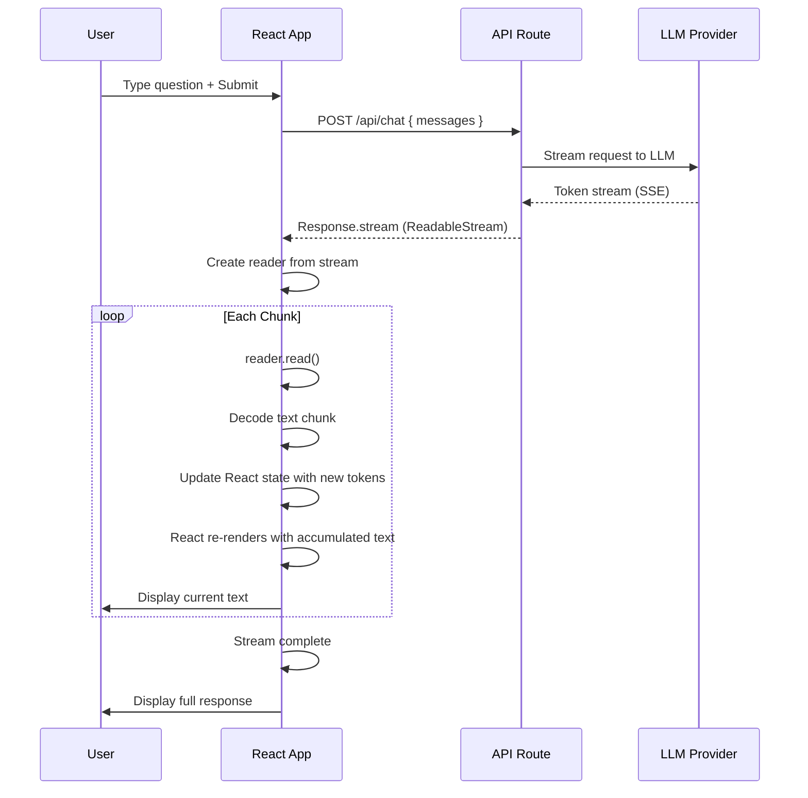
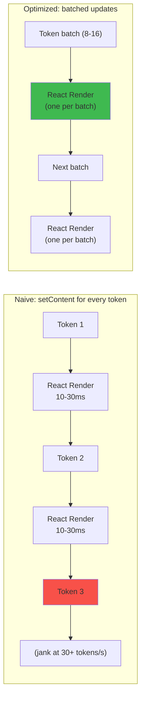
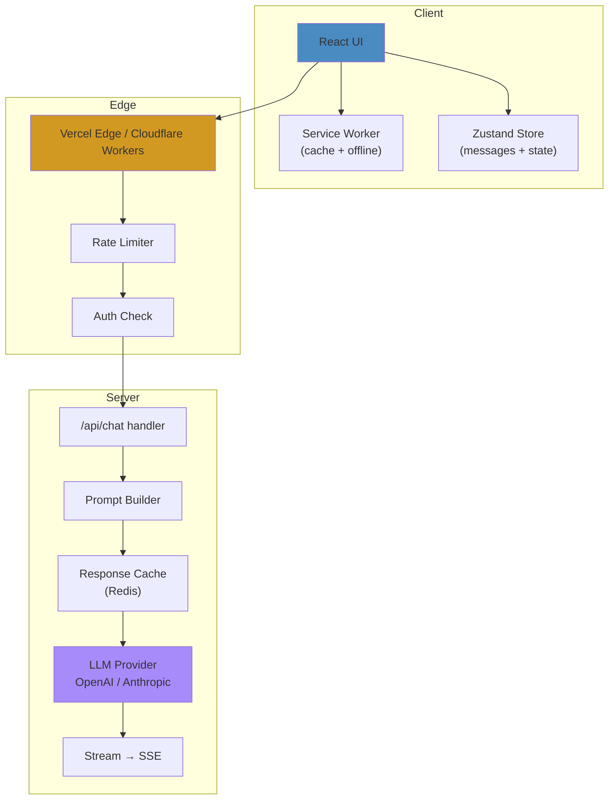

# AI-Powered UI: Streaming LLM Responses in React

## WHAT
Rendering large language model (LLM) responses token-by-token in real-time — the foundation of ChatGPT, Claude, Perplexity, and every AI chat interface.

## WHY
LLMs generate text incrementally (token by token). Waiting for the entire response before displaying creates 5-30s of blank screen. Streaming displays each token **as it's generated**, creating sub-200ms perceived latency.

## THE STREAMING ARCHITECTURE



## INTERNALS

### The Streaming Hook

```typescript
"use client";
import { useState, useCallback, useRef } from 'react';

interface UseChatOptions {
  api: string;
  onError?: (error: Error) => void;
}

interface UseChatReturn {
  messages: Message[];
  input: string;
  setInput: (value: string) => void;
  handleSubmit: (e: React.FormEvent) => Promise<void>;
  isLoading: boolean;
  stop: () => void;
}

export function useChat({ api, onError }: UseChatOptions): UseChatReturn {
  const [messages, setMessages] = useState<Message[]>([]);
  const [input, setInput] = useState('');
  const [isLoading, setIsLoading] = useState(false);
  const abortRef = useRef<AbortController | null>(null);

  const handleSubmit = useCallback(async (e: React.FormEvent) => {
    e.preventDefault();
    if (!input.trim() || isLoading) return;

    const userMessage: Message = { role: 'user', content: input };
    const assistantMessage: Message = { role: 'assistant', content: '' };
    
    setMessages(prev => [...prev, userMessage, assistantMessage]);
    setInput('');
    setIsLoading(true);

    const abortController = new AbortController();
    abortRef.current = abortController;

    try {
      const response = await fetch(api, {
        method: 'POST',
        headers: { 'Content-Type': 'application/json' },
        body: JSON.stringify({ messages: [...messages, userMessage] }),
        signal: abortController.signal,
      });

      if (!response.ok) throw new Error(`HTTP ${response.status}`);
      if (!response.body) throw new Error('No response body');

      const reader = response.body.getReader();
      const decoder = new TextDecoder();
      let accumulated = '';

      while (true) {
        const { done, value } = await reader.read();
        if (done) break;

        const chunk = decoder.decode(value, { stream: true });
        
        // Parse SSE format: "data: {...}\n\n"
        const lines = chunk.split('\n');
        for (const line of lines) {
          if (line.startsWith('data: ')) {
            try {
              const data = JSON.parse(line.slice(6));
              if (data.choices?.[0]?.delta?.content) {
                accumulated += data.choices[0].delta.content;
                setMessages(prev => {
                  const updated = [...prev];
                  updated[updated.length - 1] = { 
                    ...updated[updated.length - 1], 
                    content: accumulated 
                  };
                  return updated;
                });
              }
            } catch {}
          }
        }
      }
    } catch (err: any) {
      if (err.name !== 'AbortError' && onError) {
        onError(err);
      }
    } finally {
      setIsLoading(false);
      abortRef.current = null;
    }
  }, [api, input, isLoading, messages, onError]);

  const stop = useCallback(() => {
    abortRef.current?.abort();
    setIsLoading(false);
  }, []);

  return { messages, input, setInput, handleSubmit, isLoading, stop };
}
```

### SSE vs WebSocket

| Feature | SSE | WebSocket |
|---|---|---|
| **Direction** | Server→Client only | Bidirectional |
| **Auto-reconnect** | Built-in (EventSource) | Manual implementation |
| **Protocol** | HTTP (standard) | ws:// or wss:// |
| **Binary** | Text only | Text + Binary |
| **Browser support** | All modern | All modern |
| **Use Case** | Streaming LLM responses | Chat with tool calls |

## TOKEN-BY-TOKEN PERFORMANCE



Optimization: batch tokens into groups of 8-16 before triggering setState. At 50 tokens/s, this means 3-6 renders/s instead of 50 renders/s.

## MARKDOWN RENDERING

```typescript
import { useMemo } from 'react';
import ReactMarkdown from 'react-markdown';
import { Prism as SyntaxHighlighter } from 'react-syntax-highlighter';

const MarkdownRenderer = ({ content }: { content: string }) => {
  // Memoize to prevent re-render on every token
  return useMemo(() => (
    <ReactMarkdown
      components={{
        code({ node, inline, className, children, ...props }) {
          const match = /language-(\w+)/.exec(className || '');
          return !inline && match ? (
            <SyntaxHighlighter language={match[1]} PreTag="div">
              {String(children).replace(/\n$/, '')}
            </SyntaxHighlighter>
          ) : (
            <code className={className} {...props}>{children}</code>
          );
        }
      }}
    >
      {content}
    </ReactMarkdown>
  ), [content]);
};
```

## EDGE CASES

| Scenario | Issue | Solution |
|---|---|---|
| **Network disconnect mid-stream** | Partial response | Auto-retry with SSE EventSource |
| **User sends new message before stream ends** | Race condition | Abort previous stream |
| **LLM returns error mid-stream** | Corrupted content | Check for error tokens in stream |
| **Rate limiting** | HTTP 429 | Exponential backoff + queue |
| **Very long response (10K+ tokens)** | Memory | Virtualize message list |

## PRODUCTION ARCHITECTURE



## INTERVIEW QUESTIONS

**Senior**: Design a chat interface that streams tokens. How do you handle rendering markdown/code blocks token-by-token?
**Staff**: Design a real-time AI coding assistant like Cursor. How does the UI handle multi-file diffs, streaming code generation, and undo/redo of AI changes?
