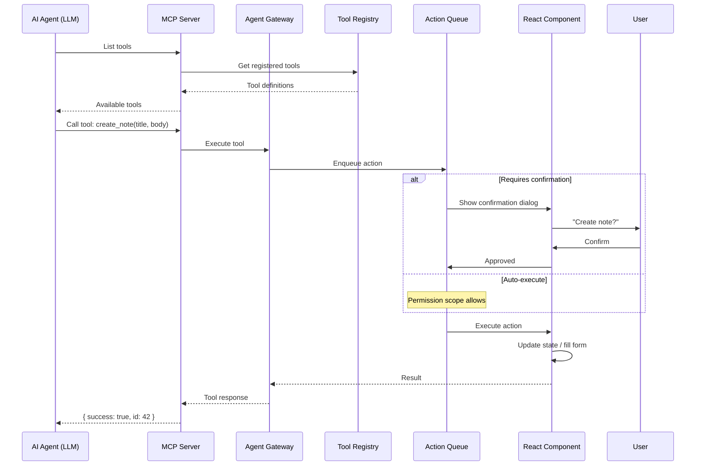

# Agentic UI

## What is Agent-Driven UI?

Agentic UI refers to interfaces where an **AI agent** takes actions within the UI beyond chat — filling forms, navigating pages, triggering workflows, and composing component props — rather than just displaying text. The React app becomes an execution environment for agentic tasks.

## MCP (Model Context Protocol)

MCP is an open protocol that standardizes how applications expose **tools** and **resources** to LLMs. A React app can act as an MCP **host** or **client**, connecting to an MCP **server** that an agent's LLM can call.

### How MCP Works in React

```
┌──────────────┐     MCP Protocol     ┌─────────────────┐
│  AI Model     │◄──────────────────►│  MCP Server      │
│  (Claude,     │                     │  (Node/JS)       │
│   GPT, etc.)  │                     │                  │
└──────────────┘                     │  - Tools         │
                                     │  - Resources     │
                                     │  - Prompts       │
                                     └────────┬────────┘
                                              │
                                     ┌────────▼────────┐
                                     │  React App      │
                                     │  (Agent Gateway) │
                                     │                 │
                                     │  - Tool Registry │
                                     │  - Action Queue  │
                                     │  - Confirmation  │
                                     └──────────────────┘
```



## Autonomous UI Patterns

### AI Filling Forms

```jsx
// Component exposes structured schema for agents
function NoteForm() {
  const [title, setTitle] = useState('');
  const [body, setBody] = useState('');

  return (
    <form
      data-agent-form="create-note"
      data-agent-fields={JSON.stringify({
        title: { type: 'string', description: 'Note title', required: true },
        body: { type: 'text', description: 'Note body', required: true },
      })}
    >
      <input
        data-agent-field="title"
        value={title}
        onChange={e => setTitle(e.target.value)}
      />
      <textarea
        data-agent-field="body"
        value={body}
        onChange={e => setBody(e.target.value)}
      />
      <button type="submit">Save</button>
    </form>
  );
}
```

### AI Generating Component Props

```js
// Tool definition exposed via MCP
const PROPS_TOOLS = {
  name: 'generate_component_props',
  description: 'Generate props for a Chart component based on data query',
  inputSchema: {
    type: 'object',
    properties: {
      dataSource: { type: 'string' },
      chartType: { type: 'string', enum: ['bar', 'line', 'pie'] },
    },
    required: ['dataSource'],
  },
  async handler({ dataSource, chartType }) {
    const data = await fetchChartData(dataSource);
    return {
      component: 'Chart',
      props: {
        type: chartType,
        data: data,
        xAxis: { dataKey: 'date' },
        yAxis: { dataKey: 'value' },
        responsive: true,
      },
    };
  },
};
```

### AI Navigating Pages

```js
const NAV_TOOLS = {
  name: 'navigate',
  description: 'Navigate to a page in the application',
  inputSchema: {
    type: 'object',
    properties: {
      path: { type: 'string', description: 'Route path' },
      params: { type: 'object' },
    },
    required: ['path'],
  },
  async handler({ path, params }) {
    router.navigate(path, { state: params });
    return { navigated: true, to: path };
  },
};
```

## UI Affordances for Agents

### Data Attributes

Use semantic `data-*` attributes so agents can identify interactive elements.

```jsx
<button data-agent-action="delete-note" data-note-id={note.id}>
  Delete
</button>

<select data-agent-field="category" data-agent-options='["work","personal","ideas"]'>
  <option value="work">Work</option>
  <option value="personal">Personal</option>
</select>
```

### Structured Outputs

Render data in machine-parseable formats alongside human-friendly UI.

```jsx
function UserProfile({ user }) {
  return (
    <div data-agent-entity="user" data-agent-id={user.id}>
      <h2>{user.name}</h2>
      <p>{user.email}</p>
      {/* Structured metadata for agents */}
      <script type="application/ld+json">
        {JSON.stringify({
          '@type': 'Person',
          name: user.name,
          email: user.email,
          roles: user.roles,
        })}
      </script>
    </div>
  );
}
```

## Tool Definitions for MCP

```js
// tool-registry.js
class ToolRegistry {
  constructor() {
    this.tools = new Map();
  }

  register(tool) {
    this.tools.set(tool.name, tool);
  }

  list() {
    return Array.from(this.tools.values()).map(t => ({
      name: t.name,
      description: t.description,
      inputSchema: t.inputSchema,
    }));
  }

  async call(name, args) {
    const tool = this.tools.get(name);
    if (!tool) throw new Error(`Unknown tool: ${name}`);

    const validated = validateSchema(tool.inputSchema, args);
    return tool.handler(validated);
  }
}

// Register tools
const registry = new ToolRegistry();
registry.register({
  name: 'create_note',
  description: 'Create a new note',
  inputSchema: {
    type: 'object',
    properties: {
      title: { type: 'string' },
      body: { type: 'string' },
      tags: { type: 'array', items: { type: 'string' } },
    },
    required: ['title'],
  },
  async handler({ title, body, tags }) {
    return api.post('/notes', { title, body, tags });
  },
});
```

## Guardrails

### Confirmation Dialog

```jsx
function ConfirmAction({ action, onConfirm, onCancel }) {
  const [visible, setVisible] = useState(true);

  return visible ? (
    <div className="confirmation-dialog" role="alertdialog">
      <p>Agent wants to: <strong>{action.description}</strong></p>
      {action.details && <pre>{JSON.stringify(action.details, null, 2)}</pre>}
      <div>
        <button onClick={() => { setVisible(false); onConfirm(); }}>
          Allow
        </button>
        <button onClick={() => { setVisible(false); onCancel(); }}>
          Deny
        </button>
      </div>
    </div>
  ) : null;
}
```

### Action Queue

```js
class ActionQueue {
  constructor({ requireConfirmation }) {
    this.queue = [];
    this.processing = false;
    this.requireConfirmation = requireConfirmation;
  }

  enqueue(action) {
    return new Promise((resolve, reject) => {
      this.queue.push({ action, resolve, reject });
      this.processNext();
    });
  }

  async processNext() {
    if (this.processing || this.queue.length === 0) return;
    this.processing = true;

    const { action, resolve, reject } = this.queue.shift();

    try {
      if (this.requireConfirmation(action)) {
        const confirmed = await this.showConfirmation(action);
        if (!confirmed) {
          reject(new Error('Action rejected by user'));
          this.processing = false;
          this.processNext();
          return;
        }
      }
      const result = await action.execute();
      resolve(result);
    } catch (err) {
      reject(err);
    }

    this.processing = false;
    this.processNext();
  }
}
```

### Permission Scopes

```js
const PERMISSIONS = {
  read: {
    description: 'Read data only',
    tools: ['get_notes', 'search', 'get_user'],
  },
  write: {
    description: 'Create and edit content',
    tools: ['create_note', 'update_note', 'delete_note'],
  },
  admin: {
    description: 'Full system access',
    tools: ['*'],
  },
};

function canExecute(toolName, scope) {
  const perm = PERMISSIONS[scope];
  if (!perm) return false;
  return perm.tools.includes('*') || perm.tools.includes(toolName);
}
```

### Rate Limits

```js
class RateLimiter {
  constructor(maxRequests = 10, windowMs = 60000) {
    this.tokens = maxRequests;
    this.maxTokens = maxRequests;
    this.windowMs = windowMs;
    this.lastRefill = Date.now();
  }

  async check() {
    this.refill();
    if (this.tokens <= 0) {
      throw new Error('Rate limit exceeded. Try again later.');
    }
    this.tokens--;
  }

  refill() {
    const now = Date.now();
    const elapsed = now - this.lastRefill;
    this.tokens = Math.min(
      this.maxTokens,
      this.tokens + Math.floor(elapsed / this.windowMs) * this.maxTokens
    );
    this.lastRefill = now;
  }
}
```

### Undo Support

```js
class UndoManager {
  constructor() {
    this.stack = [];
    this.maxSize = 20;
  }

  push(action, undoFn) {
    this.stack.push({ action, undo: undoFn });
    if (this.stack.length > this.maxSize) {
      this.stack.shift();
    }
  }

  async undo() {
    const entry = this.stack.pop();
    if (!entry) throw new Error('Nothing to undo');
    await entry.undo();
    return { undone: entry.action };
  }
}
```

## Architecture Summary

| Layer | Component | Responsibility |
|-------|-----------|----------------|
| **Agent** | AI Model (Claude/GPT) | Decides which tools to call |
| **Protocol** | MCP Server | Translates LLM tool calls into app actions |
| **Gateway** | Agent Gateway | Routes tool calls, validates permissions |
| **Registry** | Tool Registry | Stores tool definitions, schemas, handlers |
| **Queue** | Action Queue | Serializes actions, enforces rate limits |
| **Guardrails** | Confirmation Dialog | Requires user approval for destructive actions |
| **UI** | React Components | Renders agent-driven state changes, exposes data attributes for discoverability |

## Key Takeaways

- **Agentic UI** moves beyond chat — agents fill forms, navigate, and compose props
- **MCP** provides a standardized protocol for LLMs to call tools in your React app
- **Semantic data attributes** (`data-agent-action`, `data-agent-field`) make UI elements discoverable by agents
- **Guardrails** (confirmation dialogs, undo, rate limits, permission scopes) are essential for safe autonomous operation
- **Action queues** serialize agent operations and provide hooks for user confirmation
- Always scope permissions granularly and require human confirmation for destructive operations
