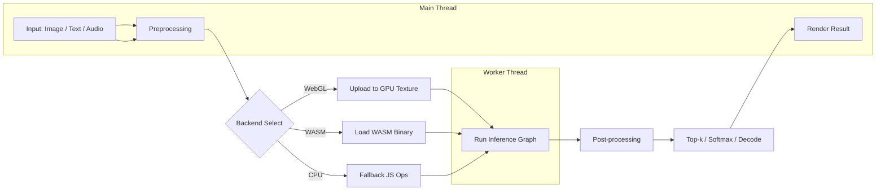

# Frontend ML: Client-Side Machine Learning

Running ML models directly in the browser enables low-latency, privacy-preserving, offline-capable experiences without round-tripping to a server.

---

## TensorFlow.js

TensorFlow.js brings ML to JavaScript via three backends:

| Backend | Execution | When to use |
|---------|-----------|-------------|
| **WebGL** | GPU via WebGL shaders | Most models — fastest for ops-heavy inference |
| **WASM** | CPU via WebAssembly | When WebGL unavailable or model is I/O bound |
| **CPU** | Vanilla JS fallback | Debugging or environments without WebGL/WASM |

### Loading a model and running inference

```typescript
import * as tf from '@tensorflow/tfjs';

async function loadAndPredict(imageElement: HTMLImageElement) {
  // Load a pre-trained MobileNet (classification model)
  const model = await tf.loadGraphModel(
    'https://tfhub.dev/google/tfjs-model/mobilenet_v2_1.0_224/1/default/1',
    { fromTFHub: true }
  );

  // Preprocess: resize, normalize, batch dimension
  const tensor = tf.browser
    .fromPixels(imageElement)
    .resizeNearestNeighbor([224, 224])
    .toFloat()
    .expandDims(0);

  // Normalize pixel values [0, 255] -> [-1, 1]
  const normalized = tensor.div(127.5).sub(1);

  // Run inference
  const predictions = model.predict(normalized) as tf.Tensor;
  const topK = await tf.topk(predictions, 3);
  const indices = topK.indices.dataSync();
  const scores = topK.values.dataSync();

  return Array.from(indices).map((idx, i) => ({
    classId: idx,
    score: scores[i],
  }));
}
```

### Performance considerations

- **WebGL texture limit**: Most GPUs cap at 16k × 16k textures. Large tensors must be split or tiled.
- **Memory leaks**: Tensors must be `dispose()`'d or use `tf.tidy()` — JS garbage collection does not free GPU memory.
- **Transfer cost**: Moving data between CPU ↔ GPU incurs overhead. Batch operations to minimize round-trips.
- **Warmup**: First inference is slow (shader compilation). Run a dummy pass on load.

```typescript
// Safe memory management pattern
function predictSafe(input: tf.Tensor3D) {
  return tf.tidy(() => {
    const normalized = input.div(127.5).sub(1);
    const batched = normalized.expandDims(0);
    return model.predict(batched) as tf.Tensor2D;
  });
}
```

### Model optimization

- **Quantization**: Convert float32 → int8 weights (4× smaller, minimal accuracy loss).
- **Pruning**: Remove near-zero weights; retrain to recover accuracy.
- **Sharding**: Split model weights into chunks for progressive loading.

```bash
# TensorFlow.js converter with quantization
tensorflowjs_converter \
  --input_format=tf_saved_model \
  --output_format=tfjs_graph_model \
  --quantize_uint8 \
  ./saved_model \
  ./web_model
```

---

## ONNX Runtime Web

Run models exported to ONNX format (from PyTorch, TensorFlow, Scikit-learn) in the browser.

```typescript
import * as ort from 'onnxruntime-web';

async function runONNXInference() {
  // Create session with WebGL backend
  const session = await ort.InferenceSession.create('./model.onnx', {
    executionProviders: ['webgl', 'wasm'],
    graphOptimizationLevel: 'all',
  });

  // Prepare input tensor
  const input = new ort.Tensor(
    'float32',
    new Float32Array(224 * 224 * 3),
    [1, 3, 224, 224]
  );

  // Run
  const feeds = { 'input': input };
  const results = await session.run(feeds);
  const output = results['output'].data as Float32Array;

  return output;
}
```

### Converting PyTorch/TF models to ONNX

```python
# PyTorch -> ONNX
import torch
model = torch.load('model.pth')
model.eval()
dummy = torch.randn(1, 3, 224, 224)
torch.onnx.export(model, dummy, 'model.onnx',
  input_names=['input'],
  output_names=['output'],
  dynamic_axes={'input': {0: 'batch_size'}})
```

---

## Use Cases

### Image Classification (NSFW Filter)

```typescript
// Offload classification to a Web Worker
const worker = new Worker(new URL('./nsfw.worker.ts', import.meta.url));

async function checkImage(file: File): Promise<{ safe: boolean; scores: Record<string, number> }> {
  const bitmap = await createImageBitmap(file);
  worker.postMessage({ image: bitmap }, [bitmap]);

  return new Promise((resolve) => {
    worker.onmessage = (e) => resolve(e.data);
  });
}
```

### Pose Detection (Camera Filters)

```typescript
import '@mediapipe/pose';
import { Pose } from '@mediapipe/pose';

const pose = new Pose({
  locateFile: (file) => `https://cdn.jsdelivr.net/npm/@mediapipe/pose/${file}`,
});

pose.setOptions({
  modelComplexity: 1,
  smoothLandmarks: true,
  enableSegmentation: false,
});

pose.onResults((results) => {
  // results.poseLandmarks — 33 landmarks
  // results.poseLandmarks[0] — nose (x, y, z, visibility)
  drawOverlay(results.poseLandmarks);
});
```

### Sentiment Analysis (Comment Moderation)

```typescript
const sentimentModel = await tf.loadLayersModel('/models/sentiment/model.json');
const tokenizer = await loadTokenizer('/models/sentiment/tokenizer.json');

function moderateComment(text: string) {
  const tokens = tokenizer.encode(text.trim().toLowerCase());
  const padded = tf.tensor2d([tokens.slice(0, 128)], [1, 128]);
  const prediction = sentimentModel.predict(padded) as tf.Tensor;
  const score = prediction.dataSync()[0];
  return {
    toxic: score > 0.7,
    confidence: score,
    label: score > 0.7 ? 'flagged' : 'approved',
  };
}
```

---

## Performance Optimization

### Web Worker Offloading

Main thread is for UI. Offload all ML inference to workers.

```typescript
// ml-worker.ts
import * as tf from '@tensorflow/tfjs';

let model: tf.GraphModel;

self.onmessage = async (e: MessageEvent) => {
  const { type, payload } = e.data;

  if (type === 'load') {
    model = await tf.loadGraphModel(payload.modelUrl);
    self.postMessage({ type: 'loaded' });
  }

  if (type === 'predict') {
    const tensor = new tf.Tensor(payload.data, payload.shape);
    const result = model.predict(tensor);
    const data = await (result as tf.Tensor).data();
    self.postMessage({ type: 'result', data: Array.from(data) }, undefined);
    tensor.dispose();
  }
};
```

### Model Size Reduction

| Technique | Size Reduction | Trade-off |
|-----------|---------------|-----------|
| Float16 quantization | ~50% | Slight accuracy drop |
| Int8 quantization | ~75% | Needs calibration data |
| Weight pruning | 60–90% sparsity | Retraining required |
| Knowledge distillation | Variable | Teacher model needed |
| Eager → Graph mode | ~20% | ONNX export step |

---

## ML Inference Pipeline in Browser



---

## Key Takeaways

1. **WebGL is the default backend** — ~5–10× faster than WASM for conv/ops-heavy models.
2. **ONNX Runtime Web** bridges PyTorch ecosystems to the browser — use when TF.js doesn't support your model.
3. **Always offload inference to a Web Worker** to keep the UI at 60 fps.
4. **Quantize before shipping** — int8 models are 4× smaller with <1% accuracy loss.
5. **Memory management is manual** — always `dispose()` tensors or wrap in `tf.tidy()`.
6. **Warmup inference** on page load to avoid first-interaction latency spikes.
