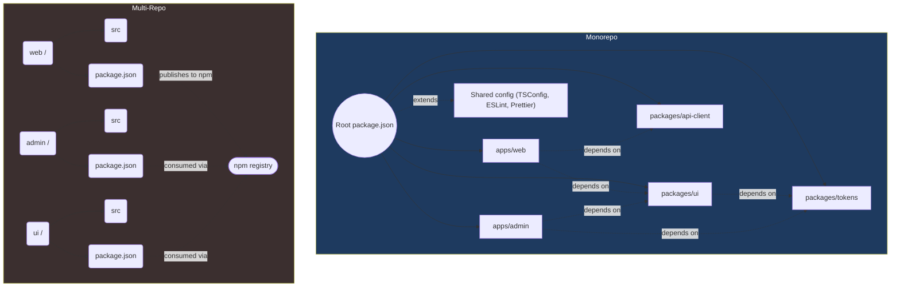

# Frontend Architecture Patterns

Scaling frontend codebases requires deliberate architectural choices. This covers monorepo tooling, module federation, design system integration, and cross-app communication.

---

## Monorepo: Turborepo & Nx

Monorepos centralize all frontend packages — apps, libraries, design tokens, configs — in a single repository with shared tooling.

### Turborepo Pipeline Configuration

```json
// turbo.json
{
  "$schema": "https://turbo.build/schema.json",
  "globalDependencies": [".env"],
  "pipeline": {
    "build": {
      "dependsOn": ["^build"],
      "outputs": ["dist/**", ".next/**"],
      "env": ["NEXT_PUBLIC_API_URL"]
    },
    "test": {
      "dependsOn": ["^build"],
      "outputs": [],
      "inputs": ["src/**/*.ts", "src/**/*.tsx"]
    },
    "lint": {
      "dependsOn": ["^build"],
      "outputs": []
    },
    "dev": {
      "cache": false,
      "persistent": true
    },
    "typecheck": {
      "dependsOn": ["^build"],
      "outputs": []
    }
  }
}
```

Key concepts:
- `^build` — wait for all upstream dependencies to build first
- `cache: true` — Turborepo caches outputs by hash; remote caching shares across CI
- `inputs` — narrow which files trigger cache invalidation

### Nx Workspace Setup

```typescript
// nx.json
{
  "extends": "nx/presets/npm.json",
  "tasksRunnerOptions": {
    "default": {
      "runner": "nx-cloud",
      "options": {
        "cacheableOperations": ["build", "test", "lint", "typecheck"],
        "parallel": 4
      }
    }
  },
  "generators": {
    "@nx/react": {
      "application": {
        "style": "tailwind",
        "bundler": "vite"
      }
    }
  }
}
```

```typescript
// apps/web/project.json
{
  "name": "web",
  "targets": {
    "build": {
      "executor": "@nx/next:build",
      "options": { "outputPath": "dist/apps/web" }
    },
    "serve": {
      "executor": "@nx/next:server",
      "options": { "dev": true }
    }
  }
}
```

### Workspace Layout

```
├── apps/
│   ├── web           # Next.js app
│   ├── admin         # Admin dashboard (Vite + React)
│   └── mobile        # React Native app
├── packages/
│   ├── ui            # Shared component library
│   ├── tokens        # Design tokens (colors, spacing, typography)
│   ├── api-client    # Generated API client
│   ├── config        # Shared ESLint, TSConfig, Prettier
│   └── utils         # Shared utility functions
├── turbo.json
├── nx.json
├── package.json      # Root scripts (scripts use turbo)
└── pnpm-workspace.yaml
```

### Dependency Management

```yaml
# pnpm-workspace.yaml
packages:
  - 'apps/*'
  - 'packages/*'
```

```jsonc
// Root tsconfig.base.json — shared across all packages
{
  "compilerOptions": {
    "target": "ES2022",
    "module": "ESNext",
    "moduleResolution": "bundler",
    "strict": true,
    "paths": {
      "@acme/ui/*": ["./packages/ui/src/*"],
      "@acme/tokens": ["./packages/tokens/src/index.ts"],
      "@acme/api-client": ["./packages/api-client/src/index.ts"]
    }
  }
}
```

---

## Module Federation

Webpack 5 Module Federation enables independent deployment of micro-frontends.

### Federation Configuration

```typescript
// apps/shell/webpack.config.ts
import { ModuleFederationPlugin } from '@module-federation/enhanced';

new ModuleFederationPlugin({
  name: 'shell',
  remotes: {
    checkout: 'checkout@http://localhost:3001/remoteEntry.js',
    catalog: 'catalog@http://localhost:3002/remoteEntry.js',
    userProfile: 'userProfile@http://localhost:3003/remoteEntry.js',
  },
  shared: {
    react: { singleton: true, requiredVersion: '^18.2.0', eager: true },
    'react-dom': { singleton: true, requiredVersion: '^18.2.0', eager: true },
    'react-router-dom': { singleton: true, requiredVersion: '^6.20.0' },
    // Shared state management
    'zustand': { singleton: true, version: '^4.4.0' },
  },
});
```

```typescript
// apps/checkout/webpack.config.ts
new ModuleFederationPlugin({
  name: 'checkout',
  exposes: {
    './Cart': './src/components/Cart.tsx',
    './CheckoutForm': './src/components/CheckoutForm.tsx',
  },
  shared: {
    react: { singleton: true, requiredVersion: '^18.2.0' },
    'react-dom': { singleton: true, requiredVersion: '^18.2.0' },
  },
});
```

### Handling Version Conflicts

```typescript
shared: {
  react: {
    singleton: true,
    requiredVersion: '^18.2.0',
    // If remote ships a different version, fall back to shell's
    fallback: () => import('react'),
    // Log version mismatches instead of crashing
    shareConfig: {
      logger: console.warn,
    },
  },
  // Use a polyfill or compatibility layer for breaking changes
  'react-router-dom': {
    singleton: true,
    import: false,            // Don't auto-provide — shell controls routing
    shareKey: 'react-router-dom',
    requiredVersion: '^6.20.0',
    version: '6.20.0',
  },
}
```

### Fallback on Remote Failure

```typescript
// apps/shell/src/remotes/checkout.ts
const CheckoutFallback = lazy(() =>
  import('checkout/Cart').catch(() => ({
    default: () => <div className="p-4 text-center text-red-500">
      Checkout unavailable — please try again later
    </div>,
  }))
);
```

```typescript
// Generic retry wrapper
function withRetry<T>(
  importFn: () => Promise<T>,
  retries = 2,
  delay = 1000
): () => Promise<T> {
  return async () => {
    for (let i = 0; i <= retries; i++) {
      try {
        return await importFn();
      } catch (e) {
        if (i === retries) throw e;
        await new Promise(r => setTimeout(r, delay * (i + 1)));
      }
    }
    throw new Error('Import failed');
  };
}

const Cart = lazy(withRetry(() => import('checkout/Cart')));
```

---

## Design System Sync

### Tokens as Packages

```typescript
// packages/tokens/src/colors.ts
export const colors = {
  primary: {
    50: '#eff6ff',
    100: '#dbeafe',
    500: '#3b82f6',
    600: '#2563eb',
    900: '#1e3a5f',
  },
  semantic: {
    success: '#22c55e',
    warning: '#f59e0b',
    error: '#ef4444',
    info: '#3b82f6',
  },
} as const;
```

```typescript
// packages/tokens/src/spacing.ts
export const spacing = {
  0: '0px',
  1: '4px',
  2: '8px',
  3: '12px',
  4: '16px',
  6: '24px',
  8: '32px',
  12: '48px',
  16: '64px',
} as const;
```

### Versioned Releases & Changelog

```yaml
# .github/workflows/release-tokens.yml
name: Release Tokens
on:
  push:
    branches: [main]
    paths: ['packages/tokens/**']

jobs:
  release:
    runs-on: ubuntu-latest
    steps:
      - uses: actions/checkout@v4
      - uses: actions/setup-node@v4
      - run: pnpm install
      - name: Build tokens
        run: pnpm --filter @acme/tokens build
      - name: Semantic release
        run: pnpm --filter @acme/tokens semantic-release
        env:
          GITHUB_TOKEN: ${{ secrets.GITHUB_TOKEN }}
          NPM_TOKEN: ${{ secrets.NPM_TOKEN }}
```

```typescript
// packages/tokens/release.config.js
export default {
  branches: ['main'],
  plugins: [
    '@semantic-release/commit-analyzer',
    '@semantic-release/release-notes-generator',
    '@semantic-release/changelog',
    '@semantic-release/npm',
    '@semantic-release/github',
  ],
};
```

---

## Cross-App Communication

### Custom Events (Same Origin)

```typescript
// Shell app — dispatches navigation events
window.dispatchEvent(
  new CustomEvent('app:navigate', {
    detail: { path: '/checkout', from: '/catalog' },
  })
);

// Remote app — listens for navigation events
window.addEventListener('app:navigate', (e: CustomEvent) => {
  const { path, from } = e.detail;
  if (path.startsWith('/checkout')) {
    router.navigate(path);
  }
});
```

### iframe postMessage

```typescript
// Shell → iframe
const iframe = document.getElementById('catalog-iframe') as HTMLIFrameElement;

function sendToIframe(action: string, payload: unknown) {
  iframe.contentWindow?.postMessage(
    { source: 'shell', action, payload },
    'https://catalog.example.com'
  );
}

// Listen for replies
window.addEventListener('message', (event) => {
  if (event.origin !== 'https://catalog.example.com') return;
  const { action, data } = event.data;
  if (action === 'add-to-cart') {
    cartStore.addItem(data);
  }
});
```

### Shared URL State

Centralize routing in the shell; remotes read/write URL params.

```typescript
// Remotes use shell's router via a shared package
import { useSearchParams } from '@acme/shared-router';

function ProductFilters() {
  const [params, setParams] = useSearchParams();

  const category = params.get('category') ?? 'all';
  const sort = params.get('sort') ?? 'popular';

  function updateFilter(key: string, value: string) {
    const next = new URLSearchParams(params);
    if (value) next.set(key, value);
    else next.delete(key);
    setParams(next, { replace: true });
  }

  return <FilterControls value={category} onChange={(v) => updateFilter('category', v)} />;
}
```

---

## Testing in Micro-Frontends

### Integration Testing Between Shell and Remotes

```typescript
// cypress/e2e/shell-checkout-integration.cy.ts
describe('Shell ← → Checkout integration', () => {
  it('loads checkout remote and completes purchase flow', () => {
    cy.visit('http://localhost:3000'); // Shell
    cy.get('[data-cy=cart-badge]').click();

    // Verify remote loaded
    cy.get('[data-cy=checkout-cart]', { timeout: 10000 }).should('be.visible');

    // State shared between shell and remote
    cy.window().its('__FEDERATION__shared__react').should('exist');

    // Interaction flows through shell → remote → shell
    cy.get('[data-cy=checkout-form]').within(() => {
      cy.get('#card-number').type('4242424242424242');
      cy.get('#expiry').type('12/28');
      cy.get('#cvc').type('123');
      cy.get('[data-cy=submit]').click();
    });

    // Shell shows success (response came through shell's API layer)
    cy.get('[data-cy=order-confirmation]').should('contain', 'Order confirmed');
  });
});
```

### Contract Testing

```typescript
// packages/checkout-contracts/__tests__/cart-contract.test.ts
// Verifies the Cart component exposes the expected interface
import { CartProps } from '@acme/checkout-types';

describe('Checkout remote contract', () => {
  it('exposes Cart component with correct props', async () => {
    const Cart = await import('checkout/Cart');
    expect(Cart.default).toBeDefined();
    expect(typeof Cart.default).toBe('function');
  });

  it('Cart component renders with minimal props', () => {
    const props: CartProps = {
      items: [],
      onCheckout: cy.stub().as('checkout'),
    };
    cy.mount(<Cart.default {...props} />);
    cy.get('[data-cy=empty-cart]').should('be.visible');
  });
});
```

---

## Monorepo vs Multi-Repo Comparison



| Aspect | Monorepo | Multi-Repo |
|--------|----------|------------|
| Code sharing | Direct import via workspace | npm publish + install |
| Atomic commits | One PR across packages | Coordinated releases required |
| CI speed | Turbo/Nx cache → skip unchanged packages | Full pipeline per repo |
| Tooling overhead | Once (shared config) | Per-repo setup |
| Ownership | CODEOWNERS per package | Per-repo permissions |
| Versioning | Single version or independent | Independent |
| Local dev | `turbo dev` runs all apps | Multiple terminals |

---

## Key Takeaways

1. **Monorepo ≠ monolith**. Use Turborepo/Nx to enforce dependency boundaries and cache aggressively.
2. **Module Federation** enables independent deploy with singleton React — handle version conflicts explicitly with fallbacks.
3. **Design tokens as versioned packages** — the single source of truth consumed by all apps and verified by visual regression tests.
4. **Cross-app communication** should go through a shared channel (custom events, postMessage, URL). Never let remotes import directly from other remotes.
5. **Contract tests** between shell and remotes catch breakage before end-to-end tests.
6. **Retry remote imports** with exponential backoff — federated apps must tolerate network failures gracefully.
