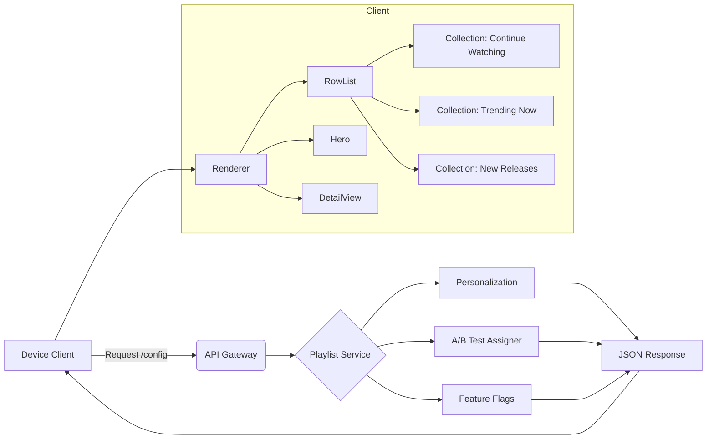
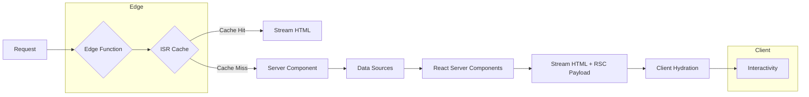
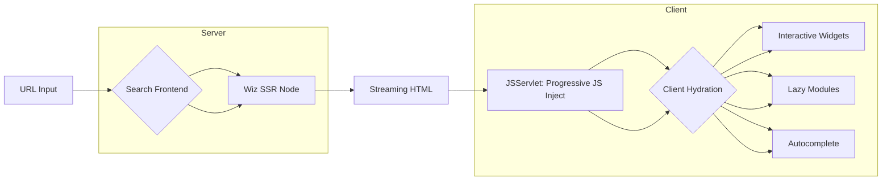

# Frontend Architecture Case Studies

How Meta, Netflix, Vercel, and Google build and scale their React frontends.

---

## Meta (Facebook) — Newsfeed

Meta's web Newsfeed is built on **Relay + GraphQL** with a custom React-like framework built on top of React's reconciler.

### Architecture

| Layer | Technology |
|-------|-----------|
| Data fetching | Relay (GraphQL) with persisted queries |
| State management | Relay store + local component state |
| Virtualization | Custom infinite scroll with `react-virtual`-like primitives |
| Optimistic updates | Relay's `updater` functions + rollback |
| Build system | Buck (custom) → Meta-internal bundler |

### React Features Used

- **Concurrent React**: Feed prioritizes visible posts over off-screen content
- **Suspense**: Data-dependent components suspend until Relay fetches complete
- **Transitions**: Mark feed filtering as non-urgent to keep interactions responsive

### How They Solved Scale

```typescript
// Relay pagination pattern (simplified)
function Newsfeed() {
  const { data, loadNext, hasNext, isLoadingNext } = usePaginationFragment(
    graphql`
      fragment Newsfeed_query on Query
      @refetchable(queryName: "NewsfeedPaginationQuery")
      @argumentDefinitions(
        cursor: { type: "ID" }
        count: { type: "Int", defaultValue: 12 }
      ) {
        newsfeed(after: $cursor, first: $count)
          @connection(key: "Newsfeed_newsfeed") {
          edges { node { ...FeedItem_node } }
        }
      }
    `,
    queryRef
  );

  // Optimistic update on like
  function handleLike(postId: string) {
    commitMutation(environment, {
      mutation: graphql`mutation LikePostMutation($id: ID!) { likePost(id: $id) { ... } }`,
      optimisticUpdater: (store) => {
        const post = store.get(postId);
        post.setValue(post.getValue('likeCount') + 1, 'likeCount');
        post.setValue(true, 'viewerLikes');
      },
      onError: () => rollback(), // Revert optimistic update
    });
  }

  return (
    <InfiniteScrollList
      items={data.newsfeed.edges}
      loadMore={() => loadNext(12)}
      hasMore={hasNext}
      loading={isLoadingNext}
      itemHeight={200}
      overscan={5}
    >
      {(edge) => <FeedItem post={edge.node} onLike={handleLike} />}
    </InfiniteScrollList>
  );
}
```

### Bundle Size Strategy

- **Code splitting by route**: Each feed tab (For You, Following, Gaming) is a separate chunk
- **Relay persisted queries**: GraphQL strings are replaced with 64-bit hashes — no query strings in the bundle
- **Feed items are lazy**: Media players, maps, and embeds load only when scrolled into viewport

### Key Lesson

> **Optimistic updates are not optional at Meta's scale.** Every mutation must feel instant. Server confirmation is async and out-of-band.

---

## Netflix — Server-Driven UI

Netflix uses **server-driven UI** where the server dictates component hierarchy, data dependencies, and layout — the client just renders.

### Architecture



### React Features Used

- **Custom reconciler**: Netflix built a React-like framework on the reconciler for their SDUI model
- **Reactive programming with RxJS**: Every UI component observes data streams from the server
- **Error boundaries**: Graceful fallback when a row fails to render

### A/B Testing Framework

```typescript
// Netflix-style A/B test integration
function useExperiment<T>(experimentName: string, variants: T[]): T {
  const [variant, setVariant] = useState<T | null>(null);

  useEffect(() => {
    // Server returns assigned variant during playlist fetch
    const assignment = playlistService.getExperiment(experimentName);
    setVariant(variants[assignment.variantIndex]);
  }, []);

  return variant ?? variants[0]; // Fallback to control
}

// Usage in a row component
function TrendingRow() {
  const layoutVariant = useExperiment('trending_row_layout', [
    'horizontal-scroll',
    'grid-3x2',
    'carousel',
  ]);

  switch (layoutVariant) {
    case 'horizontal-scroll': return <HorizontalScroll />;
    case 'grid-3x2': return <Grid3x2 />;
    case 'carousel': return <Carousel />;
  }
}
```

### Performance Budgets

| Metric | Budget | Enforcement |
|--------|--------|-------------|
| TTI | < 2s on mid-range device | Lighthouse CI in CI pipeline |
| JS bundle | < 200 KB per screen | Webpack bundle analyzer |
| Time to first frame | < 500ms | Custom perf monitoring |
| Memory | < 150 MB | Heap snapshot regression tests |

### Key Lesson

> **Let the server own the UI structure.** Client-side rendering of server-defined layouts enables instant experimentation without app store deployments.

---

## Vercel (Next.js) — Edge-Native React

Vercel's Next.js showcases the cutting edge of React: **Server Components, Streaming SSR, and Edge Functions**.

### Architecture



### Streaming SSR

```typescript
// app/page.tsx — Server Component with streaming
export default async function HomePage() {
  return (
    <div>
      <h1>Dashboard</h1>
      {/* Immediately streams shell — data loads async */}
      <Suspense fallback={<Skeleton />}>
        <UserProfile />
      </Suspense>
      <Suspense fallback={<TableSkeleton />}>
        <AnalyticsTable />
      </Suspense>
    </div>
  );
}

// These fetch in parallel and stream as they resolve
async function UserProfile() {
  const user = await db.user.findFirst(); // 200ms
  return <ProfileCard user={user} />;
}

async function AnalyticsTable() {
  const data = await db.analytics.query(); // 800ms
  return <DataTable data={data} />;
}
```

### ISR + On-Demand Revalidation

```typescript
// app/products/[slug]/page.tsx
export const revalidate = 3600; // Revalidate at most every hour

export async function generateStaticParams() {
  const products = await db.product.findMany({ take: 1000 });
  return products.map((p) => ({ slug: p.slug }));
}

async function ProductPage({ params }: { params: { slug: string } }) {
  const product = await db.product.findUnique({
    where: { slug: params.slug },
  });

  if (!product) notFound();

  return <ProductDetail product={product} />;
}

// On-demand revalidation (e.g., webhook from CMS)
// app/api/revalidate/route.ts
export async function POST(request: Request) {
  const { slug, secret } = await request.json();
  if (secret !== process.env.REVALIDATION_SECRET) {
    return Response.json({ error: 'Invalid secret' }, { status: 401 });
  }
  await revalidateTag(`product-${slug}`);
  return Response.json({ revalidated: true });
}
```

### Edge Functions

```typescript
// middleware.ts — runs at the edge before the request hits the page
import { NextResponse } from 'next/server';
import type { NextRequest } from 'next/server';

export function middleware(request: NextRequest) {
  const country = request.geo?.country ?? 'US';
  const response = NextResponse.next();

  // Geo-personalized rewrites
  if (country === 'DE' && request.nextUrl.pathname === '/pricing') {
    return NextResponse.rewrite(new URL('/pricing/de', request.url));
  }

  // Set cookie for A/B test
  if (!request.cookies.has('layout')) {
    const variant = Math.random() > 0.5 ? 'control' : 'treatment';
    response.cookies.set('layout', variant, { maxAge: 3600 });
  }

  return response;
}
```

### Bundle Size Strategy

- **Server Components have zero JS bundle cost** — only their client sub-tree contributes
- **Automatic code splitting** by page — no manual `React.lazy()` needed
- **RSC Payload** is serialized JSON, not JS — smaller than equivalent hydration code

### Key Lesson

> **React Server Components change the cost model.** The server renders what it can; only interactive islands ship to the client. This makes large data-fetching pages cheap to load.

---

## Google Search — Wiz Framework

Google Search uses its internal **Wiz** framework with React for parts of the UI. Wiz is Google's SSR-first, streaming, progressively-enhanced framework.

### Architecture



### Streaming HTML (Wiz)

Google Search streams HTML in **chunks** — the browser renders the shell immediately:

1. **First chunk**: doctype, head, styles, search bar (renderable at 200ms)
2. **Second chunk**: results header, top ads (renderable at 500ms)
3. **Third chunk**: organic results (renderable at 800ms)
4. **Fourth chunk**: pagination, footer (renderable at 1s)

Each chunk is a valid HTML fragment. The browser parses and paints progressively without waiting for the full response.

```typescript
// Conceptual Wiz streaming pattern
function SearchPage({ query }: { query: string }) {
  return (
    <>
      <Shell />                    {/* Chunk 1: streams immediately */}
      <Suspense fallback={<SkeletonResults />}>
        <SearchResults query={query} /> {/* Chunk 2-4: streams on data ready */}
      </Suspense>
    </>
  );
}
```

### Progressive Enhancement

- **HTML-first, JS-later**: Search results work without JavaScript (form submit → full page load)
- **Progressive hydration**: Autocomplete, instant previews, and keyboard nav hydrate on top of working HTML
- **JSServlet**: A custom Node.js service that injects only the JavaScript needed for the current view

### Performance as a Feature

Google treats performance as a product feature, not just an optimization:

| Initiative | Impact |
|------------|--------|
| **Instant Page** (prefetch on hover) | 0.3s perceived latency reduction |
| **Signed Exchange (SXG)** | Pre-render cached pages from Google's CDN |
| **Speculation Rules API** | Pre-fetch linked pages in idle time |
| **CSS containment** | Isolate layout of search results |
| **Font subsetting** | Only load Latin characters, not full CJK |

### Bundle Size Strategy

- **JSServlet** serves only the JS needed for the current interaction — no monolithic app bundle
- **Critical CSS inlined** in the first chunk; non-critical is deferred
- **Widget-level code splitting**: Image previewer, calculator, translator, and sports scores load independently

### Key Lesson

> **HTML is universal; JS is progressive.** Build a fully functional HTML page first, then enhance. This principle means Search works even if JavaScript fails silently.

---

## Architecture Comparison

```mermaid
flowchart TD
  subgraph Meta
    M1[Relay + GraphQL]
    M2[Client-side feed rendering]
    M3[Optimistic updates everywhere]
    M4[Concurrent React for prioritization]
  end

  subgraph Netflix
    N1[Server-driven UI]
    N2[Custom reconciler on React]
    N3[RxJS data streams]
    N4[A/B test at the server level]
  end

  subgraph Vercel
    V1[React Server Components]
    V2[Streaming SSR + Edge]
    V3[ISR + On-demand revalidation]
    V4[Zero JS for server trees]
  end

  subgraph Google
    G1[Wiz framework]
    G2[Streaming HTML chunks]
    G3[Progressive enhancement]
    G4[Performance as product feature]
  end

  subgraph Key Metrics
    K1[Bundle Size]
    K2[TTI / TBT]
    K3[Perceived Latency]
    K4[Offline / Resilience]
  end

  M1 --> K1
  N1 --> K2
  V2 --> K2
  G3 --> K4
  M3 --> K3
  V3 --> K1
```



### Comparison Table

| Dimension | Meta | Netflix | Vercel | Google |
|-----------|------|---------|--------|--------|
| **Data approach** | GraphQL (Relay) | Server-defined JSON | Server Components + DB | Streaming HTML |
| **Rendering** | Client-heavy SSR | Server-dictated UI | RSC + Edge | Streaming SSR (Wiz) |
| **State** | Relay store | RxJS observables | URL + Server state | DOM + progressive JS |
| **Personalization** | ML ranking | Playlist service | Edge geo-routing | Search ranking |
| **Error tolerance** | Optimistic rollback | Row error boundaries | Fallback UI per Suspense | JS not required |
| **Deploy model** | Monolith + modules | App store + SDUI | Edge + ISR | Global CDN |
| **Key metric** | Feed engagement | TTI | LCP | Any-net availability |

### What React Features Each Uses

| Feature | Meta | Netflix | Vercel | Google |
|---------|------|---------|--------|--------|
| Concurrent React | ✅ Feed priority | Partial | ✅ RSC streaming | Partial (Wiz) |
| Suspense | ✅ Data fetching | ❌ | ✅ Streaming | ✅ Chunked HTML |
| Server Components | ❌ (their own) | ❌ | ✅ Native | ❌ (Wiz alternative) |
| Transitions | ✅ Mark non-urgent | ❌ | ✅ `useTransition` | ❌ |
| Error Boundaries | ✅ Feed resilience | ✅ Row isolation | ✅ Per Suspense | ❌ (full page fallback) |
| Portals | ✅ Modals | ✅ Overlays | ✅ Modals | ❌ |

---

## Key Takeaways

1. **Meta** shows that **optimistic updates and concurrent React** are essential for feed-based UIs at scale. Relay's persisted queries are the gold standard for GraphQL bundle size.
2. **Netflix** proves **server-driven UI** decouples client releases from UI experiments. Their custom reconciler and RxJS streams let them iterate faster.
3. **Vercel/Next.js** demonstrates the **React Server Components future** — streaming SSR with zero-JS server trees, ISR for hybrid static/dynamic, and edge personalization.
4. **Google Search** is the benchmark for **progressive enhancement**. Their HTML-first, JSServlet-later pattern ensures search works on every network, every device.
5. **Every company prioritizes performance differently** — Meta optimizes for engagement feel, Netflix for TTI on TV devices, Vercel for LCP, Google for loading on slow networks.
6. **There is no one architecture to rule them all.** The right choice depends on personalization needs, deploy cadence, device targets, and network constraints.
