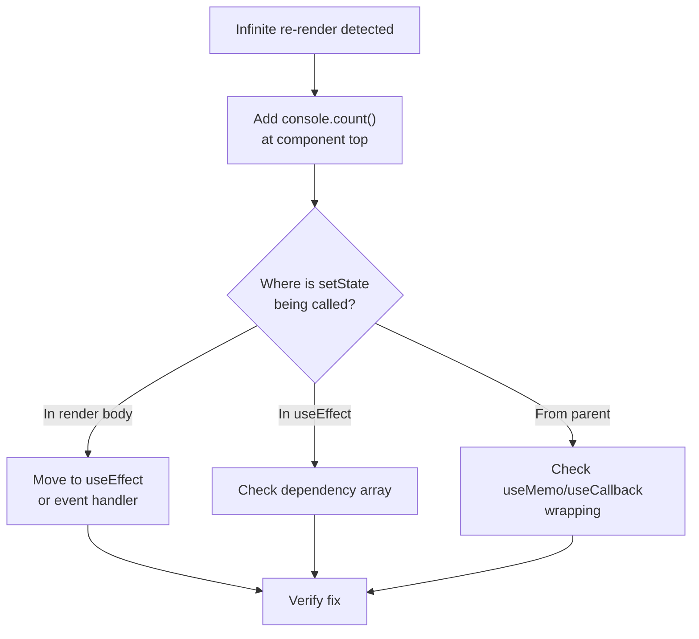

# React Debugging Playbook

## WHAT

A systematic approach to debugging React applications — from infinite re-renders to production-only crashes.

## 1. INFINITE RE-RENDER LOOP

### Symptoms
- Tab crashes / "Page Unresponsive"
- Console: hundreds of re-renders per second
- CPU 100%, browser tab killer

### Root Cause Analysis

```typescript
// PATTERN 1: State set during render
function Bad() {
  const [count, setCount] = useState(0);
  setCount(count + 1); // ❌ Render → setState → render → setState → ...
  return <div>{count}</div>;
}

// PATTERN 2: useEffect modifies state on every render
function BadEffect() {
  const [data, setData] = useState(null);
  useEffect(() => {
    fetch('/api/data').then(setData); // ❌ No deps → runs every render
  }); // Missing deps!
  return <div>{data}</div>;
}

// PATTERN 3: Object/array in useEffect deps
function BadDeps({ items }: { items: string[] }) {
  useEffect(() => {
    console.log('Items changed');
  }, [items]); // ❌ New array reference every render!
  return null;
}
```

### Debugging Flow



## 2. STATE NOT UPDATING

### Symptoms
- `setState(newValue)` but component shows old value
- Console.log shows correct value, UI shows stale

### Why

React batches state updates. `useState` setter is **async** — reading immediately shows old value.

```typescript
function AsyncState() {
  const [count, setCount] = useState(0);

  const handleClick = () => {
    setCount(count + 1);  // Queues update
    console.log(count);   // ❌ Still 0 (not updated yet!)
  };

  // ✅ Use a ref if you need immediate access
  const countRef = useRef(0);
  const handleClickRef = () => {
    countRef.current += 1;  // ✅ Immediate
    console.log(countRef.current); // ✅ 1
  };
}
```

### Stale Closure in Callbacks

```typescript
// ❌ Stale closure — `count` captured once
function Stale() {
  const [count, setCount] = useState(0);

  useEffect(() => {
    const interval = setInterval(() => {
      setCount(count + 1); // count is always 0 here!
    }, 1000);
    return () => clearInterval(interval);
  }, []); // Empty deps — count never updates
}

// ✅ Functional update
const interval = setInterval(() => {
  setCount(prev => prev + 1); // Always reads latest
}, 1000);
```

## 3. USEFFECT CLEANUP ISSUES

### Memory Leaks

```typescript
function Leaky() {
  const [data, setData] = useState(null);

  useEffect(() => {
    let cancelled = false;
    fetch('/api/data')
      .then(res => res.json())
      .then(data => {
        if (!cancelled) setData(data); // ✅ Safe
      });

    // ❌ Missing cleanup — if component unmounts before fetch finishes
    // setData will be called on unmounted component

    return () => {
      cancelled = true; // ✅ Prevents setState on unmounted
    };
  }, []);
}
```

### Stale Cleanup

```typescript
function Subscription({ userId }: { userId: string }) {
  useEffect(() => {
    const socket = connect(userId);
    socket.on('message', handleMessage);

    return () => {
      socket.disconnect(); // ✅ Clean up old subscription
    };
  }, [userId]);
  // If userId changes, effect runs again, prev cleanup runs first
}
```

## 4. REACT ROUTER: COMPONENT NOT RE-MOUNTING

```typescript
// ❌ Same component for /users/1 and /users/2 — React sees same type
// and only updates props (no re-mount)
<Route path="/users/:id" element={<UserPage />} />

// ✅ Use key to force re-mount on param change
function Routes() {
  const { id } = useParams();
  return <UserPage key={id} />; // New key → new mount
}
```

## 5. PRODUCTION-ONLY BUGS

### Symptoms
- Works in dev, broken in production
- No error messages (production strips warnings)

### Common Causes

| Issue | Dev | Production | Fix |
|---|---|---|---|
| `console.warn` in dev | Visible | Suppressed | Use proper error boundaries |
| `StrictMode` double-render | Catches issues | Single render | Will still fail in production |
| Minified error codes | Verbose | `#123` minified | Check React error decoder |
| Source maps | Available | Missing | Upload to Sentry |

### Debugging Production

```typescript
// 1. Check React error codes
// React #130 → "Hydration failed because initial UI doesn't match"
// Decode at: https://reactjs.org/docs/error-decoder.html

// 2. Add error boundary
class ErrorBoundary extends React.Component {
  state = { error: null };
  
  static getDerivedStateFromError(error: Error) {
    return { error };
  }
  
  componentDidCatch(error: Error, info: React.ErrorInfo) {
    console.group('🚨 Production Error');
    console.error(error.message);
    console.error('Component Stack:', info.componentStack);
    console.groupEnd();
  }
  
  render() {
    if (this.state.error) {
      return <h1>Something went wrong</h1>;
    }
    return this.props.children;
  }
}
```

## DEBUGGING CHEAT SHEET

```typescript
// 1. Why is this re-rendering?
console.log('Render:', performance.now());

// 2. What changed in props?
const prevProps = useRef(props);
useEffect(() => {
  Object.keys(props).forEach(key => {
    if (props[key] !== prevProps.current[key]) {
      console.log(`Prop "${key}" changed:`, prevProps.current[key], '→', props[key]);
    }
  });
  prevProps.current = props;
});

// 3. Is my error boundary working?
throw new Error('Test error');

// 4. Check React DevTools - Components tab
// Highlight updates: ⚡ flash on re-render

// 5. Profiler: record interaction → flame graph → identify bottleneck
```

## INTERVIEW QUESTIONS

**Senior**: Walk through debugging a React app that crashes only in production. What tools and techniques do you use?
**Staff**: Design a production monitoring system for a large React app. What metrics do you track? How do you correlate user actions with errors?
