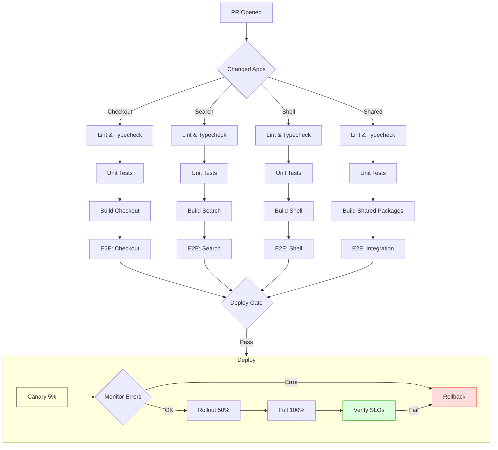

# Scaling React Applications

## Team Scaling

### Code Ownership with CODEOWNERS

```
# .github/CODEOWNERS
# Teams own their module boundaries
packages/checkout/       @team-checkout
packages/search/         @team-search
packages/shared/ui/      @team-design-system
packages/shared/api/     @team-platform
```

- Each team owns explicit module boundaries
- PRs automatically request reviewers from owning team
- Shared packages have cross-team review requirements
- `/packages/shared/` requires both platform team + affected team

### Module Boundaries

```
apps/
  shell/            # Host shell — owned by platform team
  checkout/         # Microfrontend — owned by checkout team
  search/           # Microfrontend — owned by search team
packages/
  shared/
    ui/             # Design system — owned by design system team
    api/            # API contracts/types — reviewed by all teams
    config/         # Shared configs (tsconfig, eslint, etc.)
```

- Each microfrontend is a standalone app with its own deployment
- Teams own their module end-to-end (code → deploy → monitor)
- Shared packages are versioned independently, consumed as dependencies

### API Contracts Between Teams

```typescript
// packages/shared/api/src/checkout/contract.ts
// Ownership: @team-platform, reviewed by @team-checkout

export interface CheckoutOrder {
  orderId: string;
  items: CheckoutLineItem[];
  total: Money;
  status: OrderStatus;
  shippingAddress: Address;
}

export interface CheckoutCreateRequest {
  items: { sku: string; quantity: number }[];
  shippingAddress: Address;
  couponCode?: string;
}

// Breaking changes require explicit version bump + migration guide
export const CHECKOUT_API_VERSION = "2025-03-01" as const;
```

- Contracts live in shared package with clear ownership
- Breaking changes trigger semver major bump
- Teams use `@deprecated` JSDoc tags with migration timeline

---

## Monorepo Tooling

### Turborepo Pipeline Configuration

```json
// turbo.json
{
  "$schema": "https://turbo.build/schema.json",
  "globalDependencies": ["tsconfig.json", ".eslintrc.js"],
  "pipeline": {
    "build": {
      "dependsOn": ["^build", "typecheck"],
      "outputs": ["dist/**", ".next/**"],
      "cache": {
        "duration": "7d"
      }
    },
    "typecheck": {
      "dependsOn": ["^typecheck"],
      "outputs": [],
      "cache": false
    },
    "lint": {
      "outputs": []
    },
    "test": {
      "dependsOn": ["build"],
      "outputs": [],
      "inputs": ["src/**/*.ts", "src/**/*.tsx", "test/**/*.ts"]
    },
    "dev": {
      "cache": false,
      "persistent": true
    },
    "e2e": {
      "dependsOn": ["build"],
      "outputs": []
    },
    "deploy:checkout": {
      "dependsOn": ["build", "e2e"],
      "outputs": [],
      "cache": false
    },
    "deploy:search": {
      "dependsOn": ["build", "e2e"],
      "outputs": [],
      "cache": false
    }
  }
}
```

### Nx Dependency Graph Visualization

```
> npx nx graph

  checkout (app)
    ├── @acme/shared-ui (build)
    ├── @acme/shared-api (build)
    └── @acme/config-ts (build)
  search (app)
    ├── @acme/shared-ui (build)
    ├── @acme/shared-api (build)
    └── @acme/config-ts (build)
  shell (app)
    ├── checkout (runtime via module federation)
    └── search (runtime via module federation)
```

### Changesets for Versioning

```bash
# Generate a changeset for a package change
npx changeset add
# Prompts: select packages → semver bump → description

# Version all changed packages
npx changeset version
# Updates CHANGELOG.md files and package.json versions

# Publish to internal registry
npx changeset publish
```

```markdown
# .changeset/shy-dogs-repair.md
---
"@acme/shared-api": minor
"@acme/checkout": patch
---

Add shipping address validation to CheckoutOrder contract
```

---

## CI/CD Pipeline

### Pipeline Structure (Per App, Not Per Commit)

```yaml
# .github/workflows/ci.yml
name: CI
on:
  push:
    branches: [main]
  pull_request:

jobs:
  changes:
    runs-on: ubuntu-latest
    outputs:
      apps: ${{ steps.filter.outputs.changes }}
    steps:
      - uses: actions/checkout@v4
      - uses: dorny/paths-filter@v2
        id: filter
        with:
          filters: |
            checkout:
              - 'apps/checkout/**'
              - 'packages/**'
            search:
              - 'apps/search/**'
              - 'packages/**'
            shell:
              - 'apps/shell/**'
              - 'packages/**'

  lint-and-typecheck:
    needs: [changes]
    strategy:
      matrix:
        app: ${{ fromJSON(needs.changes.outputs.apps) }}
    steps:
      - run: pnpm install
      - run: pnpm --filter ${{ matrix.app }} lint
      - run: pnpm --filter ${{ matrix.app }} typecheck

  test:
    needs: [lint-and-typecheck]
    strategy:
      matrix:
        app: ${{ fromJSON(needs.changes.outputs.apps) }}
    steps:
      - run: pnpm install
      - run: pnpm --filter ${{ matrix.app }} test --coverage

  build:
    needs: [test]
    strategy:
      matrix:
        app: ${{ fromJSON(needs.changes.outputs.apps) }}
    steps:
      - run: pnpm install
      - run: pnpm --filter ${{ matrix.app }} build
      - uses: actions/upload-artifact@v4
        with:
          name: build-${{ matrix.app }}
          path: apps/${{ matrix.app }}/dist

  e2e:
    needs: [build]
    strategy:
      matrix:
        app: ${{ fromJSON(needs.changes.outputs.apps) }}
    steps:
      - uses: actions/download-artifact@v4
      - run: pnpm --filter ${{ matrix.app }} e2e

  deploy:
    needs: [e2e]
    strategy:
      matrix:
        app: ${{ fromJSON(needs.changes.outputs.apps) }}
    environment: production
    steps:
      - uses: actions/download-artifact@v4
      - run: ./scripts/deploy.sh ${{ matrix.app }}
```

---

## Mermaid: CI/CD Pipeline for Microfrontends



---

## Performance Budgets

### Lighthouse CI Configuration

```js
// lighthouserc.js
module.exports = {
  ci: {
    collect: {
      startServerCommand: "pnpm --filter @acme/shell start",
      url: [
        "http://localhost:3000/",
        "http://localhost:3000/checkout",
        "http://localhost:3000/search?q=react",
      ],
      numberOfRuns: 3,
    },
    assert: {
      assertions: {
        "categories:performance": ["error", { minScore: 0.9 }],
        "categories:accessibility": ["error", { minScore: 0.95 }],
        "categories:best-practices": ["error", { minScore: 0.9 }],
        "categories:seo": ["error", { minScore: 0.9 }],
        "largest-contentful-paint": ["error", { maxNumericValue: 2500 }],
        "total-blocking-time": ["error", { maxNumericValue: 200 }],
        "cumulative-layout-shift": ["error", { maxNumericValue: 0.1 }],
        "first-contentful-paint": ["error", { maxNumericValue: 1800 }],
        "interactive": ["error", { maxNumericValue: 3500 }],
        "max-potential-fid": ["warn", { maxNumericValue: 100 }],
        "uses-optimized-images": ["error"],
        "uses-responsive-images": ["error"],
        "offscreen-images": ["error"],
        "unused-javascript": ["warn", { maxNumericValue: 0 }],
      },
    },
    upload: {
      target: "temporary-public-storage",
    },
  },
};
```

### Bundler Size Check

```js
// packages/shared/config/bundlesize.config.js
module.exports = {
  files: [
    {
      path: "apps/checkout/dist/**/*.js",
      maxSize: "200 kB",
      compression: "gzip",
    },
    {
      path: "apps/search/dist/**/*.js",
      maxSize: "250 kB",
    },
    {
      path: "apps/shell/dist/**/*.js",
      maxSize: "150 kB",
    },
    {
      path: "packages/shared/ui/dist/**/*.js",
      maxSize: "50 kB",
    },
  ],
};
```

### Bundlewatch Integration

```yaml
# .github/workflows/bundle-size.yml
name: Bundle Size Check
on: pull_request

jobs:
  check:
    runs-on: ubuntu-latest
    steps:
      - uses: actions/checkout@v4
      - uses: actions/setup-node@v4
      - run: pnpm install
      - run: pnpm build
      - uses: jackyef/bundlewatch-action@v1
        with:
          bundlewatchConfig: packages/shared/config/bundlesize.config.js
```

**Failing PRs that exceed budgets**: The CI step returns non-zero exit code when any bundle exceeds its `maxSize`. This blocks merge via branch protection rules. Teams are notified in the PR comment with a diff breakdown.

---

## Deployment Strategies

### Canary Releases

```yaml
# deploy-canary.yml
- name: Deploy Canary
  run: |
    # Deploy 5% of traffic to new version
    aws eks update-service \
      --service checkout \
      --canary-percent 5 \
      --image ${{ github.sha }}

- name: Wait for Observation Window
  run: sleep 300  # 5 minutes

- name: Check Error Budget
  run: |
    ERROR_RATE=$(curl -s metrics-service/error-rate?service=checkout)
    if (( $(echo "$ERROR_RATE > 0.001" | bc -l) )); then
      echo "Error rate exceeded threshold. Rolling back."
      exit 1
    fi
```

### Feature Flags (LaunchDarkly)

```typescript
// packages/shared/ui/src/components/FeatureFlag.tsx
"use client";

import { useEffect, useState, createContext, useContext, type ReactNode } from "react";

interface FeatureFlags {
  newCheckoutFlow: boolean;
  aiRecommendations: boolean;
  darkMode: boolean;
}

const FlagContext = createContext<FeatureFlags>({
  newCheckoutFlow: false,
  aiRecommendations: false,
  darkMode: false,
});

export function FeatureFlagProvider({
  children,
  flags,
}: {
  children: ReactNode;
  flags: FeatureFlags;
}) {
  return <FlagContext.Provider value={flags}>{children}</FlagContext.Provider>;
}

export function useFeatureFlag(name: keyof FeatureFlags): boolean {
  const flags = useContext(FlagContext);
  return flags[name];
}

// Usage in a component
// "use client";
// import { useFeatureFlag, FeatureFlagProvider } from "@acme/shared-ui";

export function CheckoutPage() {
  const useNewFlow = useFeatureFlag("newCheckoutFlow");

  if (useNewFlow) {
    return <NewCheckoutFlow />;
  }
  return <LegacyCheckoutFlow />;
}
```

### A/B Testing

```typescript
// packages/shared/api/src/ab-testing.ts
export interface ABTest {
  id: string;
  variant: "control" | "treatment";
}

export function getABTest(userId: string, testName: string): ABTest {
  const hash = hashCode(`${userId}:${testName}`);
  const variant = hash % 2 === 0 ? "control" : "treatment";
  return { id: testName, variant };
}
```

### Rollback Plan

```bash
# scripts/rollback.sh
#!/bin/bash
APP=$1
VERSION=${2:-previous}

echo "Rolling back $APP to $VERSION"

# 1. Revert traffic to previous stable version
kubectl rollout undo deployment/$APP --to-revision=$VERSION

# 2. Verify health
kubectl rollout status deployment/$APP --timeout=120s

# 3. Verify error rates
while true; do
  ERROR_RATE=$(curl -s metrics-service/error-rate?service=$APP)
  if (( $(echo "$ERROR_RATE < 0.001" | bc -l) )); then
    echo "Error rate normal. Rollback complete."
    break
  fi
  echo "Waiting for error rate to stabilize..."
  sleep 10
done

# 4. Disable feature flags associated with the failed release
# (handled separately via LaunchDarkly API)
```

---

## Production Monitoring

### Error Budgets

```yaml
# service-level-objectives.yaml
apiVersion: monitoring.coreos.com/v1
kind: ServiceLevelObjective
metadata:
  name: checkout-slo
spec:
  service: checkout
  description: "Checkout service availability"
  target: 99.9
  window: 28d
  indicators:
    - name: latency
      threshold: 200ms
      percentile: 95
    - name: error_rate
      threshold: 0.001
```

### SLOs for Core Web Vitals

```typescript
// packages/shared/observability/src/vitals.ts
export const CORE_WEB_VITALS_SLOS = {
  LCP: { threshold: 2500, target: 0.90 },   // 90% of pages ≤ 2.5s
  INP: { threshold: 200, target: 0.90 },     // 90% of interactions ≤ 200ms
  CLS: { threshold: 0.1, target: 0.95 },     // 95% of pages ≤ 0.1
  FCP: { threshold: 1800, target: 0.90 },
  TTFB: { threshold: 800, target: 0.90 },
};

export function checkVitalSLO(vitalName: string, value: number): boolean {
  const slo = CORE_WEB_VITALS_SLOS[vitalName as keyof typeof CORE_WEB_VITALS_SLOS];
  if (!slo) return true;
  return value <= slo.threshold;
}
```

### On-Call Runbook

```markdown
# Runbook: Checkout Service Degradation

## Symptoms
- Error rate > 0.1%
- P95 latency > 500ms
- Cart abandonment rate spikes

## Immediate Actions
1. **Verify deployment**: Check if a recent deploy correlates
2. **Rollback**: `./scripts/rollback.sh checkout`
3. **Disable feature flag**: Via LaunchDarkly dashboard
4. **Scale up**: `kubectl scale deployment checkout --replicas=10`

## Investigation
1. Check Datadog dashboard: `checkout-service-dashboard`
2. Query recent logs: `{app="checkout"} |= "ERROR"`
3. Check database connection pool: `show processlist;`
4. Verify upstream API latency: Check `payment-gateway` dash

## Resolution
1. Apply hotfix per investigation findings
2. Deploy to canary → verify → full rollout
3. Close incident in PagerDuty with RCA summary

## Post-Mortem Checklist
- [ ] Root cause identified
- [ ] Preventative tests added
- [ ] Monitoring improved (did this slip past? why?)
- [ ] Runbook updated
- [ ] Team retro scheduled
```

---

## Key Patterns Summary

| Concern | Approach | Tooling |
|---------|----------|---------|
| Code ownership | CODEOWNERS + module boundaries | GitHub, Turborepo |
| Versioning | Changesets, semver | changesets, npm |
| CI/CD | Per-app matrix with path filters | GitHub Actions |
| Performance | Lighthouse CI + bundle size checks | Lighthouse CI, bundlewatch |
| Deployment | Canary → rollout → verify | Kubernetes, custom scripts |
| Feature flags | Context provider + SDK | LaunchDarkly |
| A/B testing | Deterministic user split | In-house hash function |
| Monitoring | SLOs, error budgets, runbooks | Datadog, PagerDuty |
