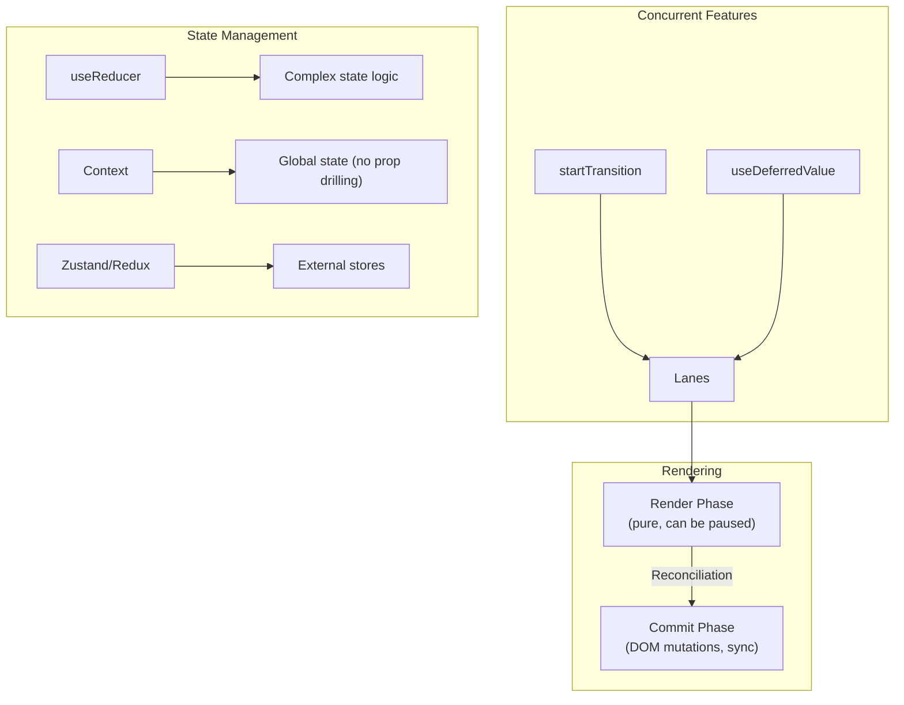

# React Interview Preparation

> 🎮 **Interactive Simulators**: [Fiber Reconciliation](/04-frontend/react/39-visual-simulations/fiber-reconciliation.html) · [VDOM Diff](/04-frontend/react/39-visual-simulations/vdom-diff.html) · [Re-render Tree](/04-frontend/react/39-visual-simulations/rerender-tree.html) · [State Batching](/04-frontend/react/39-visual-simulations/state-batching.html) — use these to practice explaining React internals live

## WHAT

Systematic interview prep covering React fundamentals through Staff Engineer-level system design.

## JUNIOR / MID-LEVEL

### Core Concepts

| Concept | Key Points | Example |
|---|---|---|
| **Virtual DOM** | Lightweight JS representation of real DOM; diff + batch updates | Reconciliation compares 2 trees |
| **JSX** | `React.createElement` syntax sugar; compiles to JS calls | `<div>Hi</div>` → `React.createElement('div', null, 'Hi')` |
| **State vs Props** | State is mutable, internal; props are read-only, external | `useState` vs component arguments |
| **useEffect** | Side effects after render; deps array controls execution | `useEffect(() => {}, [])` |
| **Keys** | Help React identify list items; stable, unique | `key={item.id}` not `key={index}` |
| **Lifting State** | Share state by moving to common ancestor | Parent owns state, passes via props |
| **Conditional Rendering** | `&&`, ternary, `if/else` | `{isLoggedIn && <Dashboard />}` |

### Common Interview Questions

**Question**: What is the virtual DOM and how does it improve performance?
**Answer**: It's a JS object tree. React diffs it against the previous version, batches changes, then applies minimal DOM updates. Avoids direct DOM manipulation (slow).

**Question**: How does `useEffect` differ from `useLayoutEffect`?
**Answer**: `useEffect` runs after paint (async, non-blocking). `useLayoutEffect` runs before paint (sync, blocks visual updates). Use `useLayoutEffect` for DOM measurements that affect layout.

**Question**: What is the purpose of the key prop in lists?
**Answer**: Keys help identify which items changed, added, or removed. Using index as key causes bugs with list reordering or filtering.

## SENIOR

### Advanced Concepts



### Key Senior Topics

| Topic | Must Know |
|---|---|
| **Reconciliation** | Keyed vs unkeyed, list diffing (O(n) heuristic), fragments |
| **Error Boundaries** | `componentDidCatch`, error recovery patterns |
| **Render Props** | Components that receive a function as children |
| **HOCs** | Higher-order components for cross-cutting concerns |
| **Portals** | Render outside parent DOM hierarchy |
| **Refs** | `useRef`, `forwardRef`, `useImperativeHandle` |
| **Code Splitting** | `React.lazy`, `Suspense`, dynamic imports |
| **StrictMode** | Double-renders, detects side effects, finds legacy APIs |

### Common Senior Questions

**Question**: How does React's reconciliation algorithm work? What makes it O(n) instead of O(n³)?
**Answer**: React assumes: 1) elements of different types produce different trees, 2) keys identify stable elements. This reduces the tree diff from O(n³) to O(n).

**Question**: Explain `useReducer` vs `useState`. When would you use each?
**Answer**: `useState` for simple independent values. `useReducer` for complex state with multiple sub-values, next state depends on previous, or when state logic is easier to test as a reducer function.

**Question**: How do `startTransition` and `useDeferredValue` work?
**Answer**: `startTransition` marks a state update as low priority (Transition lane). `useDeferredValue` returns a deferred version of a value. Both allow React to interrupt the update for higher-priority work (like user input).

## STAFF / PRINCIPAL

### System Design

| Topic | Architecture |
|---|---|
| **Large-scale React app** | Module federation, micro-frontends, shared component library |
| **Real-time collaboration** | CRDT, OT, WebSocket sync, optimistic updates |
| **SSR at scale** | Streaming RSC, ISR, edge caching, regional deployment |
| **Performance at scale** | Dynamic imports, route-based splitting, virtual lists, profiling |
| **State management** | Zustand for client, RSC for server, normalized cache |
| **Testing strategy** | Vitest (unit), Playwright (E2E), Loki (visual regression) |

### Staff-Level Questions

**Question**: Design a real-time collaborative document editor (like Google Docs) using React. How do you handle conflict resolution, cursor sync, and undo/redo?

**Question**: Your app has 10M+ MAU. The bundle size is 800KB. Walk through your optimization strategy — code splitting, caching, SSR, edge rendering, and performance monitoring.

**Question**: Design a design system component library used by 50+ teams. How do you handle versioning, tree-shaking, theming, accessibility, and testing across teams?

**Question**: Your React app has a memory leak that crashes user tabs after 30 minutes of use. How do you find and fix it?

## REACT 19+ FEATURES

| Feature | What It Does | Interview Angle |
|---|---|---|
| **Actions** | `useActionState`, `<form>` with Server Actions | Async state management, progressive enhancement |
| **React Compiler** | Auto-memoization, no manual useMemo | How React Forget analyzes JS |
| **Server Components** | Zero-bundle components | Architecture shift, data fetching patterns |
| **Asset Loading** | `use`, `preload` APIs | Resource prioritization |
| **New Hooks** | `use(Context)`, `use(Promise)` | Direct value reading in render |

## SCENARIO-BASED QUESTIONS

### 1. Performance
> "Users report the page is janky when typing in the search input. The search is debounced but the page still feels slow."

**Answer path**: Check render count → Profiler flame graph → find expensive re-renders → identify root cause (state too high, inline objects, no memo) → fix → verify.

### 2. State Management
> "Two sibling components need to share state, but lifting it to their common parent causes too many re-renders."

**Answer path**: Context splitting, `useSyncExternalStore`, Zustand with selectors, or reconsider the component architecture (children prop pattern).

### 3. Error Recovery
> "A third-party widget crashes the entire app on some user configurations."

**Answer path**: Error boundary → fallback UI → isolate widget with `key` for reset → report error with context.

## QUICK REFERENCE: HOOKS DECISION TREE

```mermaid
graph TD
    Q1["Need state?"] -->|"Yes"| Q2{"Complex state<br/>or multiple values?"}
    Q1 -->|"No"| Q4{"Need side effects?"}
    Q2 -->|"Simple"| useState
    Q2 -->|"Complex"| useReducer
    Q4 -->|"Yes"| Q5{"DOM measurement<br/>before paint?"}
    Q4 -->|"No"| Q6{"Need stable ref?"}
    Q5 -->|"Yes"| useLayoutEffect
    Q5 -->|"No"| useEffect
    Q6 -->|"DOM ref"| useRef
    Q6 -->|"Callback"| useCallback
    Q6 -->|"Expensive calc"| useMemo
    style useState fill:#3fb950
    style useReducer fill:#d29922
    style useEffect fill:#58a6ff
